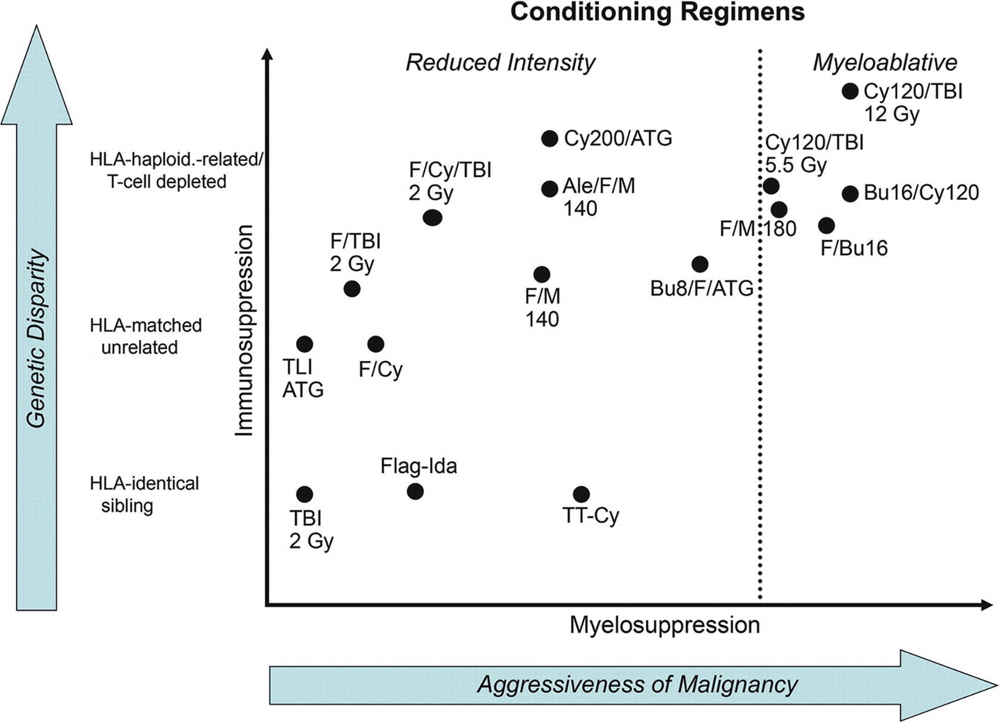

# Chapter 1. HCT: Historical Perspective

> **Source:** Sureda A, Corbacioglu S, Greco R, Kröger N, Carreras E (eds). *The EBMT Handbook: Hematopoietic Cell Transplantation and Cellular Therapies*, 8th ed. Springer, Cham; 2024. pp. 3–9. https://doi.org/10.1007/978-3-031-44080-9_1  
> **Authors:** Granot, Noa; Storb, Rainer  
>   - Granot, Noa: Chaim Sheba Medical Center  
>   - Storb, Rainer: Fred Hutchinson Cancer Research Center and University of Washington, School of Medicine  
> **License:** CC BY 4.0 (https://creativecommons.org/licenses/by/4.0/). Text reproduced verbatim from the open-access HTML edition; formatting converted to Markdown.

## Abstract

HCT has evolved from a field that was declared dead in the 1960s to the amazing clinical results obtained today in the treatment of otherwise fatal blood disorders.

## 1.1 Introduction

HCT has evolved from a field that was declared dead in the 1960s to the amazing clinical results obtained today in the treatment of otherwise fatal blood disorders. This chapter will reflect upon how HCT has progressed from the laboratory to clinical reality.

## 1.2 Early Enthusiasm and Disappointment

Research efforts on how to repair radiation effects resulted from observations on radiation damage among survivors of the atomic bomb explosions in Japan (reviewed in van Bekkum and de Vries 1967). In 1949, Jacobson and colleagues discovered protection of mice from TBI by shielding their spleens with lead. Two years later, Lorenz and colleagues reported radiation protection of mice and guinea pigs by infusing marrow cells. Initially, many investigators, including Jacobson, thought that the radiation protection was from some humoral factor(s) in spleen or marrow. However, by the mid-1950s, this “humoral hypothesis” was firmly rejected, and several laboratories convincingly demonstrated that the radiation protection was due to seeding of the marrow by donor cells.

This discovery was greeted with enthusiasm because of the implications for cell biology and for therapy of patients with life-threatening blood disorders. The principle of HCT was simple: high-dose radiation/chemotherapy would both destroy the diseased marrow and suppress the patient’s immune cells for a donor graft to be accepted. Within 1 year of the pivotal rodent studies, Thomas and colleagues showed that marrow could safely be infused into leukemia patients and engraft, even though, in the end, the leukemia relapsed. In 1958, Mathé’s group attempted the rescue, by marrow transplantation, of six nuclear reactor workers accidentally exposed to TBI. Four of the six survived, although donor cells persisted only transiently. In 1965, Mathé and colleagues treated a leukemia patient with TBI and then marrows from six relatives, absent any knowledge of histocompatibility (Mathe et al. 1965). A brother’s marrow engrafted. The patient went into remission but eventually succumbed to complications from GVHD. Following up on early observations by Barnes and Loutit in mice, Mathé coined the term “graft-vs.-leukemia effect.” In 1970, Bortin summarized results of 200 human marrow grafts reported between 1957 and 1967 (Bortin 1970). All 200 patients died of either graft failure, GVHD, infections, or recurrence of leukemia.

These transplants were performed before a clear understanding of conditioning regimens, histocompatibility matching, and control of GVHD. They were based directly on work in inbred mice, for which histocompatibility matching is not absolutely required. In 1967, van Bekkum and de Vries stated, “These failures have occurred mainly because the clinical applications were undertaken too soon, most of them before even the minimum basic knowledge required to bridge the gap between mouse and patient had been obtained.” Clinical HCT was declared a total failure and prominent immunologists pronounced that the barrier between individuals could never be crossed.

## 1.3 Back to the Laboratory: Focus on Animal Studies

Most investigators left the field, pronouncing it a dead end. However, a few laboratories continued animal studies aimed at understanding and eventually overcoming the obstacles encountered in human allogeneic HCT. Van Bekkum’s group in Holland used primates, George Santos at Johns Hopkins chose rats, and the Seattle group chose outbred dogs as experimental models. One reason behind using dogs was that, besides humans, only dogs combine unusual genetic diversity with a widespread, well-mixed gene pool. Also, dogs share spontaneous diseases with humans, such as non-Hodgkin lymphoma and X-linked SCID, among others. In addition to determining the best ways to administer TBI, new drugs with myeloablative or immunosuppressive qualities were introduced, including cyclophosphamide, ATG, and BU (Santos 1995). These agents improved engraftment and provided for tumor cell killing similar to TBI. Based on the mouse histocompatibility system defined 10 years earlier, in vitro histocompatibility typing for dogs was developed. Studies from 1968 showed that dogs given grafts from dog leukocyte antigen (DLA)-matched littermates or unrelated donors survived significantly longer than their DLA-mismatched counterparts, even though typing techniques were very primitive and the complexity of the genetic region coding for major antigens was far from understood (Epstein et al. 1968). Serious GVHD was first described in H-2 mismatched mice and in randomly selected monkeys. However, the canine studies first drew attention to fatal GVHD across minor histocompatibility barriers.

These pivotal observations drove the search for posttransplant drug regimens to control GVHD. The most promising drug was the folic acid antagonist, MTX (Storb et al. 1970). Further work in canines showed that transfusion-induced sensitization to minor antigens caused rejection of DLA-identical grafts (reviewed in Georges and Storb 2016). Subsequent canine studies eventually led to ways of understanding, preventing, and overcoming transfusion-induced sensitization, especially in patients with SAA. Next, mechanisms of graft-host tolerance were investigated. It turned out that IS could often be discontinued after 3–6 months, and donor-derived T lymphocytes were identified that downregulated immune reactions of other donor T cells against GVHD targets. Immune reconstitution was found to be complete in long-term canine chimeras, enabling them to live in an unprotected environment. Techniques for isolating transplantable stem cells from peripheral blood were refined in dogs and primates. Importantly, studies in pet dogs with non-Hodgkin lymphoma showed cures, in part due to graft-vs.-tumor effects.

## 1.4 Resuming Clinical Transplantation: 1968–1980s

The second half of the 1960s saw the refinement of high-intensity conditioning regimens, including fractionated TBI and maximally tolerated doses of CY or BU (Santos 1995). Histocompatibility matching was confirmed to be of utmost importance for reducing both graft rejection and GVHD (Thomas et al. 1975). However, even when donor and recipient were well matched, GVHD was a problem unless post-grafting MTX was given, which slowed donor lymphocyte replication. Rapid progress in understanding the molecular nature of the major human histocompatibility complex—HLA—improved matching of donor recipient pairs.

By 1968, the stage was set to resume clinical trials. The first successful transplants were for patients with primary immune deficiency disorders. A 5-month-old boy with “thymic alymphoplasia and agammaglobulinemia” was not perfectly matched with his sister (Gatti et al. 1968). Marrow and peripheral blood cells were infused intraperitoneally without conditioning. After a booster infusion several months later, the patient fully recovered with donor hematopoiesis and is well. A patient with Wiskott-Aldrich syndrome received a first unsuccessful marrow infusion from an HLA-identical sister without conditioning (Bach et al. 1968). A second transplant following CY conditioning resulted in full T- and B-cell recovery, but thrombocytopenia persisted.

During the first 7 or 8 years, most clinical studies were for patients with advanced hematological malignancies and SAA, who were in poor condition and presented tremendous challenges in supportive care (Thomas et al. 1975). They required transfusions and prophylaxis or treatment of bacterial, fungal, and viral infections. Therefore, in addition to discoveries made in marrow transplantation, these early trials stimulated advances in infectious diseases and transfusions (reviewed in Forman et al. 2016). The longest survivors from that era are patients with SAA who are approaching their 52nd anniversary from HCT with fully recovered donor-derived hematopoiesis and leading normal lives. Chronic GVHD emerged as a new problem among long-term survivors.

The initial studies saw GVHD among approximately half of the patients, despite HLA matching and despite receiving methotrexate. This stimulated further research in the canine system. Major improvements in GVHD control and patient survival were made when combining MTX with CNI inhibitors such as CSA or TAC (Storb et al. 1986). Combinations of drugs have remained a mainstay in GVHD prevention. GVHD treatment with PRD was introduced.

Early results with marrow grafts from HLA-identical siblings after CY for SAA showed 45% long-term survival (reviewed in Georges and Storb 2016). The major cause of failure was graft rejection as expected from canine studies on transfusion-induced sensitization to minor antigens. Canine studies identified dendritic cells in transfusions to be the key element in sensitization. Depleting transfusions of white cells, therefore, reduced the rejection risk. Further canine studies generated a clinical conditioning regimen that alternated CY and ATG, which greatly reduced the rates of both graft rejection and chronic GVHD (Storb et al. 1994). Finally, irradiation of blood products with 2000 cGy in vitro almost completely averted sensitization to minor antigens. Consequently, graft rejection in transplantation for AA has become the exception, and current survivals with HLA-identical sibling and HLA-matched unrelated grafts range from 90% to 100%. First successful grafts for thalassemia (Thomas et al. 1982) and sickle cell disease were reported.

For patients with leukemia and other malignant blood diseases, disease relapse after HCT has remained a major problem. Attempts to reduce relapse by increasing the intensity of systemic conditioning regimens have met with success, but this benefit was offset by higher non-relapse mortality. Reports by Weiden and the Seattle group in 1979/1981 firmly established the existence of graft-vs.-leukemia (GvL) effects in humans (Weiden et al. 1979). DLI to combat relapse were introduced by Kolb and colleagues in 1990 (Kolb et al. 1990) (see Chap. 59).

Some investigators have removed T cells from the marrow as a means of preventing GVHD (reviewed in Soiffer 2016). Early studies showed high incidences of graft rejection, relapse of underlying malignancies, and infections. More recent studies showed that relapse seemed a lesser problem in patients with acute leukemia. Others have used T-cell depletion with close disease monitoring and treating recurrence with DLI in hopes of initiating GvL responses without causing GVHD. Most recently, younger patients have been given high-intensity conditioning for grafts which were depleted of naïve T cells with a resulting decrease in GVHD (Bleakley et al. 2015).

The late 1980s saw the introduction of G-CSF-mobilized PBSC (reviewed in Schmitz and Dreger 2016). These were equivalent to marrow as far as engraftment and survival were concerned; however, they seemed to increase the risk of chronic GVHD. For patients with nonmalignant diseases, marrow has therefore remained the preferred source of stem cells in order to keep the rate of chronic GVHD low.

Only approximately 35% of patients have HLA-identical siblings. Therefore, alternative donors have been explored, predominantly HLA-matched unrelated volunteers. The first successful unrelated transplant for leukemia was reported in 1980. In order to expand the donor pool, national registries were established, with currently more than 40 million HLA-typed unrelated volunteers (reviewed in Confer et al. 2016). The likelihood of finding suitable unrelated donors is approximately 80% for Caucasians, although this percentage declines dramatically for patients from minority groups. A second, important alternative stem cell source has been unrelated cord blood (Gluckman et al. 1989), not requiring complete HLA matching and resulting in encouraging outcomes among patients with malignant blood diseases. First attempts with yet another donor source have included TCD megadose CD34+ cell grafts from related HLA-haploidentical donors to treat acute leukemia (Aversa et al. 1998).

## 1.5 Moving Ahead: The 1990s and Beyond

To allow the inclusion of older (highest prevalence of hematological malignancies), medically infirm, or very young immunodeficiency patients, less intensive conditioning programs have been developed. In patients with malignancies, these rely less on high-dose chemoradiation therapy and more on graft-vs.-tumor effects. One outpatient transplant strategy combines FLU and 2–3 Gy TBI conditioning with posttransplant IS using an inhibitor of purine synthesis MMF and CSA or TAC. Figure 1.1 illustrates the spectrum of current conditioning regimens (reviewed in Storb and Sandmaier 2016). High-intensity regimens carry the risk of short- and long-term toxicities, the latter including subsequent malignancies (Baker et al. 2019). The associated short-term toxicities restrict the therapy to younger, medically fit patients (as reviewed in Granot and Storb 2020). One outpatient transplant strategy combines FLU and 2–3 Gy TBI conditioning with posttransplant IS using an inhibitor of purine synthesis, MMF, combined with either CSA or TAC. Figure 1.1 illustrates the spectrum of current conditioning regimens (reviewed in Storb and Sandmaier 2016).

**Fig. 1.1**

Spectrum of current conditioning regimens. (Reproduced with permission from Sandmaier, B.M. and Storb, R. Reduced-intensity allogeneic transplantation regimens (Ch. 21). In Thomas’ Hematopoietic Cell Transplantation, fifth edition (ed. by Forman SJ, Negrin RS, Antin JH, & Appelbaum FR) 2016, pp. 232–243. John Wiley & Sons, Ltd., Chichester, UK)

A transplant regimen combining fludarabine and 2 Gy TBI conditioning with additional cyclophosphamide before and after HCT has encouraged widespread use of unmodified HLA-haploidentical grafts (Luznik et al. 2008). It is well tolerated with low incidences of graft rejection and of acute and chronic GVHD, but relapse remains a problem. Strategies addressing relapse have included infusion of donor lymphocytes or NK cells. Retrospective multicenter analyses show comparable outcomes after HLA-matched vs. HLA-haploidentical HCT.

While reduced-intensity regimens have been well tolerated, relapse and GVHD need improving. Adding targeted radioimmunotherapy against host hematopoietic cells, using anti-CD45 or anti-CD20 antibody coupled to beta- and alpha-emitting radionuclides to minimal-intensity conditioning, has the potential to decrease the pretransplant tumor burden, thereby lessening the relapse risk (Mawad et al. 2014; O’Steen et al. 2019; Chen et al. 2012; Pagel et al. 2009). Encouraging results with maintenance therapy after HCT have been reported in AML patients treated with sorafenib (Xuan et al. 2020) and bortezomib in high-risk MM (Green et al. 2017).

As for GVHD prevention, emerging therapies target alloreactive T cells, alloreactive and autoreactive B cells through direct depletion from stem cell grafts (e.g., posttransplant Cy is in vivo depletion, posttransplantation cyclophosphamide, CD34 selection, IL-2 and IL-17 therapy), in vivo depletion (e.g., rituximab, ofatumumab, obinutuzumab), and signal inhibition (e.g., ITK, JAK 1/2, ROCK-II, BTK, SYK inhibition), as reviewed in depth by Cutler et al. (2017) and MacDonald et al. (2017).

As for GVHD, a recent phase III randomized trial convincingly demonstrated that a triple combination of MMF/cyclosporine/sirolimus significantly reduced both acute GVHD and non-relapse mortality and improved survival (Sandmaier et al. 2016).

Survival of patients with primary immune deficiency diseases given NMA conditioning before HLA-matched and HLA-mismatched grafts between 1998 and 2006 has stabilized at 82% (Moratto et al. 2011).

In the future, better understanding of hematopoietic cell-specific polymorphic minor histocompatibility antigens might result in ways of directing donor immune cells toward hematopoietic targets, thereby controlling relapse without inducing GVHD. Another major research target is containment of chronic GVHD.

### Key Points

- Radiation protection of rodents by shielding the spleen or marrow infusion.

- First human transplants all failed.

- Allogeneic HCT called a total failure.

- HCT studies in large animals: histocompatibility matching; MTX for GVHD prevention; CY, ATG, and BU; rejection from transfusion-induced sensitization; PBSC; graft-vs.-lymphoma effect.

- Fractionated TBI.

- HCT for patients with immunodeficiency diseases, aplastic anemia, leukemia, hemoglobinopathies.

- Advances in infection prophylaxis and treatment.

- Graft-vs.-leukemia effects.

- Donor lymphocyte infusions.

- ATG conditioning.

- Unrelated donors.

- Cord blood transplants.

- Mega CD34+ HLA-haploidentical grafts.

- MTX/CNI GVHD prophylaxis.

- Reduced and minimal-intensity conditioning.

- Outpatient transplantation.

- PT-CY GVHD prophylaxis.

- Targeted radioimmunotherapy.

## References

- Aversa F, Tabilio A, Velardi A, et al. Treatment of high-risk acute leukemia with T-cell-depleted stem cells from related donors with one fully mismatched HLA haplotype. N Engl J Med. 1998;339:1186–93.

- Bach FH, Albertini RJ, Joo P, et al. Bone-marrow transplantation in a patient with the Wiskott-Aldrich syndrome. Lancet. 1968;2:1364–6.

- Baker KS, Leisenring WM, Goodman PJ, et al. Total body irradiation dose and risk of subsequent neoplasms following allogeneic hematopoietic cell transplantation. Blood. 2019;133:2790–9.

- Bleakley M, Heimfeld S, Loeb KR, et al. Outcomes of acute leukemia patients transplanted with naive T cell-depleted stem cell grafts. J Clin Invest. 2015;125:2677–89.

- Bortin MM. A compendium of reported human bone marrow transplants. Transplantation. 1970;9:571–87.

- Chen Y, Kornblit B, Hamlin DK, et al. Durable donor engraftment after radioimmunotherapy using alpha-emitter astatine-211-labeled anti-CD45 antibody for conditioning in allogeneic hematopoietic cell transplantation. Blood. 2012;119:1130–8.

- Confer DL, Miller JP, Chell JW. Bone marrow and peripheral blood cell donors and donor registries. In: Forman SJ, Negrin RS, Antin JH, Appelbaum FR, editors. Thomas’ hematopoietic cell transplantation. 5th ed. Chichester: Wiley; 2016. p. 423–30.

- Cutler CS, Koreth J, Ritz J. Mechanistic approaches for the prevention and treatment of chronic GVHD. Blood. 2017;129:22–9.

- Epstein RB, Storb R, Ragde H, Thomas ED. Cytotoxic typing antisera for marrow grafting in littermate dogs. Transplantation. 1968;6:45–58.

- Forman SJ, Negrin RS, Antin JH. F.R.A. complications of hematopoietic cell transplantation. (Ch. Part 7). In: Thomas’ hematopoietic cell transplantation. 5th ed. Chichester: Wiley; 2016. p. 944–1306.

- Gatti RA, Meuwissen HJ, Allen HD, et al. Immunological reconstitution of sex-linked lymphopenic immunological deficiency. Lancet. 1968;2:1366–9.

- Georges GE, Storb R. Hematopoietic cell transplantation for aplastic anemia. In: Forman SJ, Negrin RS, Antin JH, Appelbaum FR, editors. Thomas’ hematopoietic cell transplantation. 5th ed. Chichester: Wiley; 2016. p. 517–36.

- Gluckman E, Broxmeyer HE, Auerbach AD, et al. Hematopoietic reconstitution in a patient with Fanconi’s anemia by means of umbilical-cord blood from an HLA-identical sibling. N Engl J Med. 1989;321:1174–8.

- Granot N, Storb R. History of hematopoietic cell transplantation: challenges and progress. Haematologica. 2020;105:2716–29.

- Green DJ, Maloney DG, Storer BE, et al. Tandem autologous/allogeneic hematopoietic cell transplantation with bortezomib maintenance therapy for high-risk myeloma. Blood Adv. 2017;1:2247–56.

- Kolb HJ, Mittermüller J, Clemm C, et al. Donor leukocyte transfusions for treatment of recurrent chronic myelogenous leukemia in marrow transplant patients. Blood. 1990;76:2462–5.

- Luznik L, O’Donnell PV, Symons HJ, et al. HLA-haploidentical bone marrow transplantation for hematologic malignancies using nonmyeloablative conditioning and high-dose, post-transplantation cyclophosphamide. Biol Blood Marrow Transplant. 2008;14:641–50.

- MacDonald KP, Hill GR, Blazar BR. Chronic graft-versus-host disease: biological insights from preclinical and clinical studies. Blood. 2017;129:13–21.

- Mathe G, Amiel JL, Schwarzenberg L, Cattan A, Schneider M. Adoptive immunotherapy of acute leukemia: experimental and clinical results. Cancer Res. 1965;25:1525–31.

- Mawad R, Gooley TA, Rajendran JG, et al. Radiolabeled anti-CD45 antibody with reduced-intensity conditioning and allogeneic transplantation for younger patients with advanced acute myeloid leukemia or myelodysplastic syndrome. Biol Blood Marrow Transplant. 2014;20:1363–8.

- Moratto D, Giliani S, Bonfim C, et al. Long-term outcome and lineage-specific chimerism in 194 patients with Wiskott-Aldrich syndrome treated by hematopoietic cell transplantation in the period 1980–2009: an international collaborative study. Blood. 2011;118:1675–84.

- O’Steen S, Comstock ML, Orozco JJ, et al. The alpha-emitter astatine-211 targeted to CD38 can eradicate multiple myeloma in a disseminated disease model. Blood. 2019;134:1247–56.

- Pagel JM, Gooley TA, Rajendran J, et al. Allogeneic hematopoietic cell transplantation after conditioning with 131 I-anti-CD45 antibody plus fludarabine and low-dose total body irradiation for elderly patients with advanced acute myeloid leukemia or high-risk myelodysplastic syndrome. Blood. 2009;114:5444–53.

- Sandmaier BM, Maloney DG, Storer BE, et al. Sirolimus combined with mycophenolate mofetil (MMF) and cyclosporine (CSP) significantly improves prevention of acute graft-versus-host-disease (GVHD) after unrelated hematopoietic cell transplantation (HCT): results from a phase III randomized multi-center trial. Blood. 2016;128:506. (Abstract); http://www.bloodjournal.org/content/128/522/506.

- Santos GW. Preparative regimens: chemotherapy versus chemoradiotherapy. A historical perspective. (Review). Ann N Y Acad Sci. 1995;770:1–7.

- Schmitz N, Dreger P. Peripheral blood hematopoietic cells for allogeneic transplantation. (Ch. 41). In: Forman SJ, Negrin RS, Antin JH, Appelbaum FR, editors. Thomas’ hematopoietic cell transplantation. 5th ed. Chichester: Wiley; 2016. p. 460–8.

- Soiffer RJ. T-cell depletion to prevent graft-versus-host disease. (Ch. 82). In: Forman SJ, Negrin RS, Antin JH, Appelbaum FR, editors. Thomas’ hematopoietic cell transplantation. 5th ed. Chichester: Wiley; 2016. p. 965–72.

- Storb R, Sandmaier BM. Nonmyeloablative allogeneic hematopoietic cell transplantation. Haematologica. 2016;101:521–30.

- Storb R, Epstein RB, Graham TC, Thomas ED. Methotrexate regimens for control of graft-versus-host disease in dogs with allogeneic marrow grafts. Transplantation. 1970;9:240–6.

- Storb R, Deeg HJ, Whitehead J, et al. Methotrexate and cyclosporine compared with cyclosporine alone for prophylaxis of acute graft versus host disease after marrow transplantation for leukemia. N Engl J Med. 1986;314:729–35.

- Storb R, Etzioni R, Anasetti C, et al. Cyclophosphamide combined with antithymocyte globulin in preparation for allogeneic marrow transplants in patients with aplastic anemia. Blood. 1994;84:941–9.

- Thomas ED, Storb R, Clift RA, et al. Bone-marrow transplantation. N Engl J Med. 1975;292:832–43; 895–902.

- van Bekkum DW, de Vries MJ. Radiation chimaeras. London: Logos Press; 1967.

- Thomas ED, Buckner CD, Sanders JE, et al. Marrow transplantation for thalassaemia. Lancet. 1982;2:227–9.

- Weiden PL, Flournoy N, Thomas ED, et al. Antileukemic effect of graft-versus-host disease in human recipients of allogeneic-marrow grafts. N Engl J Med. 1979;300:1068–73.

- Xuan L, Wang Y, Huang F, et al. Sorafenib maintenance in patients with FLT3-ITD acute myeloid leukaemia undergoing allogeneic haematopoietic stem-cell transplantation: an open-label, multicentre, randomised phase 3 trial. Lancet Oncol. 2020;21:1201–12.
