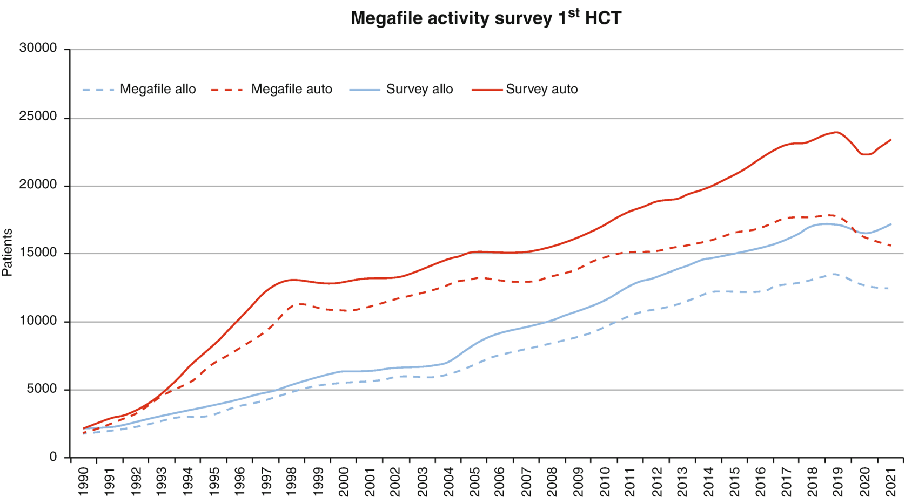

# Chapter 2. The EBMT: History, Present, and Future

> **Source:** Sureda A, Corbacioglu S, Greco R, Kröger N, Carreras E (eds). *The EBMT Handbook: Hematopoietic Cell Transplantation and Cellular Therapies*, 8th ed. Springer, Cham; 2024. pp. 11–19. https://doi.org/10.1007/978-3-031-44080-9_2  
> **Authors:** Sureda, Anna; Kröger, Nicolaus; Apperley, Jane; Gratwohl, Alois  
>   - Sureda, Anna: Institut Català d’Oncologia-L’Hospitalet  
>   - Kröger, Nicolaus: University Medical Center Hamburg-Eppendorf  
>   - Apperley, Jane: Imperial College London  
>   - Gratwohl, Alois: University of Basel  
> **License:** CC BY 4.0 (https://creativecommons.org/licenses/by/4.0/). Text reproduced verbatim from the open-access HTML edition; formatting converted to Markdown.

## Abstract

“Only he/she who knows the past has a future” is a proverb attributed to Wilhelm von Humboldt (1767–1835), a great historian, scientist, and philosopher (Spier, Big history and the future of humanity, Wiley, Chichester, 2015). It appears as an ideal introduction to a chapter on the history of EBMT. The context by which HCT evolved in the middle of the last century fits with modern views on history. The novel “big history” concept attempts to integrate major events in the past, beginning with the “big bang” up to today’s industrial revolution number IV (Spier, Big history and the future of humanity, Wiley, Chichester, 2015). According to this model, nothing “just happens.” Progress occurs when the conditions fit, at the right time and at the right place.

## 2.1 Introduction

“Only he/she who knows the past has a future” is a proverb attributed to Wilhelm von Humboldt (1767–1835), a great historian, scientist, and philosopher (Spier 2015). It appears as an ideal introduction to a chapter on the history of EBMT. The context by which HCT evolved in the middle of the last century fits with modern views on history. The novel “big history” concept attempts to integrate major events in the past, beginning with the “big bang” up to today’s industrial revolution number IV (Spier 2015). According to this model, nothing “just happens.” Progress occurs when the conditions fit, at the right time and at the right place. Such circumstances are called “Goldilocks conditions,” according to the novel by Robert Southey (https://en.wikipedia.org/wiki/Goldilocks_and_the_Three_Bears. Accessed November 6, 2018). They hold true for the formation of galaxies, suns, and planets, for the appearance of life on earth, or for the evolution of mankind. They apply specifically to the latter: as the one and only species, *Homo sapiens* managed to create “Goldilocks conditions” by him- or herself. They allowed man to fit religion, art, or beliefs in such ways to master society. In our perspective, big history thinking helps to understand the development of HCT and EBMT and to view it in a broader framework. It provides as well a caveat for the future.

## 2.2 The Past: Development of HCT and EBMT

The use of bone marrow (BM) for healing purposes dates back long in history, and BM from hunted animals might have contributed as rich nourishment to the evolution of *Homo sapiens* (McCann 2016). Its recognition as a primary hematopoietic organ in adult life with a hematopoietic stem cell as source of the circulating blood cells began in the middle of the nineteenth century (Schinck 1920). It did result in some early recommendations on the potential therapeutic use of BM (JAMA 1908; Osgood et al. 1939), but with no broader application. All changed after the explosions of atomic bombs in Hiroshima and Nagasaki in World War II, when survivors of the immediate exposure died from BM failure (Van Bekkum and De Vries 1967). Research was directed to find ways to treat this lethal complication. It led to the discovery that BM-derived stem cells from a healthy donor could replace hematopoiesis after total body irradiation (TBI); it provided at the same time, a tool, TBI, to eradicate aberrant hematopoiesis (Van Bekkum and De Vries 1967; Jacobson et al. 1949; Lorenz et al. 1951; Ford et al. 1956). The concept of HCT was born, and “the conditions were right.” It is to no surprise that the first clinical BMT centers in Europe started in hospitals with close links to radiobiology research institutes in the UK, the Netherlands, France, and Germany. Funding of radiobiology fostered basic research and stimulated clinical application. In the first series of patients reported in the NEJM in 1957 by the late Nobel Prize winner ED Thomas, all six patients died but two of them with clear signs of donor chimerism (Thomas et al. 1957). And BMT “saved” accidentally irradiated workers of a radiation facility in Vinca, a town in former Yugoslavia (Mathé et al. 1959). Hence, the clinical results confirmed the “proof of principle” obtained in mice: TBI could eradicate normal and malignant BM cells, and the infusion of healthy donor BM cells could restore the recipient’s depleted hematopoiesis with functioning donor cells. In reality, of more than 200 patients reported by Bortin for the IBMTR, all patients with leukemia had died, many of them free of their disease. Three patients survived, all with congenital immune deficiency and transplanted from HLA-identical sibling donors (Bortin 1970). Despite the dismal results, Goldilocks conditions prevailed. Armed forces were convinced of the need for a rescue tool in the event of a nuclear war, physicians viewed BMT as an instrument to treat hitherto incurable blood disorders, and patients envisioned a cure of their lethal disease.

In order to improve outcome, the “believers” joined forces. They met each other, openly reviewed their cases and charts one by one, exchanged views on hurdles and opportunities, spent time together on the slopes in the Alps, and became friendly rivals: EBMT was born. Goldilocks conditions still prevailed. Leukemia could be eradicated. BMT with haploidentical donor BM for SAA after conditioning with ATG yielded spectacular results (Speck et al. 1977). Today, we know that ATG, rather than the cells, was responsible for the outcome. The introduction of intensive induction regimens for AML enabled stable phases of complete first remission (CR1) (Crowther et al. 1970). The discovery of CSA, as the first of its kind of novel IS agents, opened new dimensions in BMT and other organ transplantation (Kay et al. 1980). It became acceptable to transplant patients in the early phase of their disease, e.g., CR1 or first chronic phase (CP1) (Thomas et al. 1975). The boom of BMT began (Thomas 2007; Gratwohl et al. 2015a). The first patient in the EBMT database dates back to 1965. In 1973, at the first informal gathering in St. Moritz, the database comprised 13 patients, 4 transplanted in that year. In 1980, a total of 285 HCT were performed, increasing to 4025 10 years later.

HCT rapidly diversified in terms of donor type, by including autologous and allogeneic stem cells from related and unrelated donors, and of stem cell source, from BM and peripheral blood to cord blood. Indications expanded from the early congenital immunodeficiency, leukemia, and aplastic anemia to a full variety of severe congenital disorders of the hematopoietic system, to other hematological malignancies such as myeloma and lymphoma, and to non-hematological malignancies, e.g., germ cell tumors. The HCT technology improved to encompass a variety of in vivo and ex vivo GvHD prevention methods and conditioning regimens of varying intensities with or without TBI. HCT became open to centers with no links to radiobiology institutes and was no longer bound to “sterile units” and to selected countries (Gratwohl et al. 2015a; Copelan 2006).

The previously informal gatherings and the database no longer sufficed to share the urgently needed information exchange. EBMT became a formal structure, with elections for presidents and working party chairs. It was listed in PubMed for the first time in 1985 (EBMT 1985). The meetings were no longer confined to ski resorts and became open to all involved in patient care and scientific analyses (Table 2.1). Obviously, organization of the annual meeting is today a major undertaking and only possible with the support of corporate sponsors. Still, the initial spirit remains.

**Table 2.1 List of EBMT meetings and presidents**

| Year | Location of annual meeting         | Participating groups                                                                                                     | EBMT president         |
|------|------------------------------------|--------------------------------------------------------------------------------------------------------------------------|------------------------|
| 1974 |                                    |                                                                                                                          | Informal gathering     |
| 1975 | St. Moritz, Switzerland            | 1st P                                                                                                                    |                        |
| 1976 | St. Moritz, Switzerland            | 2nd P                                                                                                                    | B. Specka   |
| 1977 | Courchevel, France                 | 3rd P                                                                                                                    | B. Specka   |
| 1978 | Courchevel, France                 | 4th P                                                                                                                    | B. Specka   |
| 1979 | St. Moritz, Switzerland            | 5th P                                                                                                                    | E. Gluckman            |
| 1980 | Sils-Maria, Switzerland            | 6th P                                                                                                                    | E. Gluckman            |
| 1981 | Courchevel, France                 | 7th P                                                                                                                    | E. Kubanek             |
| 1982 | Courmayeur, Italy                  | 8th P                                                                                                                    | E. Gordon-Smith        |
| 1983 | Oberstdorf, Germany                | 9th P                                                                                                                    | E. Gordon-Smith        |
| 1984 | Granada, Spain                     | 10th P                                                                                                                   | J. Barrett             |
| 1985 | Bad Hofgastein, Austria            | 11th P, 1st N                                                                                                            | J. Barrett             |
| 1986 | Courmayeur, Italy                  | 12th P, 2nd N                                                                                                            | A. Marmonta |
| 1987 | Interlaken, Switzerland            | 13th P, 3rd N                                                                                                            | A. Marmonta |
| 1988 | Chamonix, France                   | 14th P, 4th N                                                                                                            | G. Gharton             |
| 1989 | Bad Hofgastein, Austria            | 15th P, 5th N                                                                                                            | G. Gharton             |
| 1990 | The Hague, Netherlands             | 16th P, 6th N                                                                                                            | J. Goldmana |
| 1991 | Cortina d’Ampezzo, Italy           | 17th P, 7th N                                                                                                            | J. Goldmana |
| 1992 | Stockholm, Sweden                  | 18th P, 8th N                                                                                                            | J. Goldmana |
| 1993 | Garmisch-Partenkirchen, Germany    | 19th P, 9th N                                                                                                            | J. Goldmana |
| 1994 | Harrogate, UK                      | 20th P, 10th N                                                                                                           | A. Gratwohl            |
| 1995 | Davos, Switzerland                 | 21st P, 11th N                                                                                                           | A. Gratwohl            |
| 1996 | Vienna, Austria                    | 22nd P, 12th N                                                                                                           | A. Gratwohl            |
| 1997 | Aix-les-bains, France              | 23rd P, 13th N                                                                                                           | A. Gratwohl            |
| 1998 | Courmayeur, Italy                  | 24th P, 14th N                                                                                                           | A. Bacigalupo          |
| 1999 | Hamburg, Germany                   | 25th P, 15th N                                                                                                           | A. Bacigalupo          |
| 2000 | Innsbruck, Germany                 | 26th P, 16th N                                                                                                           | A. Bacigalupo          |
| 2001 | Maastricht, Netherlands            | 27th P, 17th N                                                                                                           | A. Bacigalupo          |
| 2002 | Montreux, Switzerland              | 28th P, 18th N, 1st DM                                                                                                   | J. Apperley            |
| 2003 | Istanbul, Turkey                   | 29th P, 19th N, 2nd DM                                                                                                   | J. Apperley            |
| 2004 | Barcelona, Spain                   | 30th P, 20th N, 3d DM                                                                                                    | J. Apperley            |
| 2005 | Prague, Czech Republic             | 31st P, 21st N, 4th DM                                                                                                   | J. Apperley            |
| 2006 | Hamburg, Germany                   | 32nd P, 22nd N, 5th DM                                                                                                   | D. Niederwieser        |
| 2007 | Lyon, France                       | 33rd P, 23d N, 6th DM, 1st P&F                                                                                           | D. Niederwieser        |
| 2008 | Florence, Italy                    | 34th P, 24th N, 7th DM, 2nd P&F                                                                                          | D. Niederwieser        |
| 2009 | Goteborg, Sweden                   | 35th P, 25th N, 8th DM, 3rd P&F                                                                                          | D. Niederwieser        |
| 2010 | Vienna, Austria                    | 36th P, 26th N, 9th DM, 4th P&F                                                                                          | A. Madrigal            |
| 2011 | Paris, France                      | 37th P, 27th N, 10th DM, 5th P&F                                                                                         | A. Madrigal            |
| 2012 | Geneva, Switzerland                | 38th P, 28th N, 11th DM, 6th P&F, 1st QM, 1st Ped                                                                        | A. Madrigal            |
| 2013 | London, UK                         | 39th P, 29th N, 12th DM, 7th P&F, 2nd QM, 2nd Ped                                                                        | A. Madrigal            |
| 2014 | Milan, Italy                       | 40th P, 30th N, 13th DM, 8th P&F, 3d QM, 3d Ped                                                                          | A. Madrigal            |
| 2015 | Istanbul, Turkey                   | 41st P, 31st N, 14th DM, 9th P&F, 4th QM, 4th Ped                                                                        | M. Mohty               |
| 2016 | Valencia, Spain                    | 42nd P, 32nd N, 15th DM, 10th P&F, 5th QM, 5thPed, 1st Pha                                                               | M. Mohty               |
| 2017 | Marseille, France                  | 43rd P, 33rd N, 16th DM, 11th P&F, 6th QM, 6th Ped, 2nd Pha, 1st Psy                                                     | M. Mohty               |
| 2018 | Lisbon, Portugal                   | 44th P, 34th N, 17th DM, 12th P&F, 7th QM, 7th Ped, 3d Pha, 2nd Psy                                                      | M. Mohty               |
| 2019 | Frankfurt, Germany                 | 45th P, 35th N, 18th DM, 13th P&F, 8th QM, 8th Ped, 4th Pha, 3rd Psy, 1st TC                                             | N. Kröger              |
| 2020 | Madrid, Spainb          | 46th P, 36th N, 19th DM, 14th P&F, 9th QM, 9th Ped, 5th Pha, 4th Psy, 2nd TC, 1st MSH-IC                                 | N. Kröger              |
| 2021 | Madrid, Spainb          | 47th P, 37th N, 20th DM, 15th P&F, 10th QM, 10th Ped, 6th Pha, 5th Psy, 3rd TC, 2nd MSH-IC, 1st LT                       | N. Kröger              |
| 2022 | Prague, Czech Republicb | 48th P, 38th N, 21st DM, 16th P&F, 14th QM, 11th CT, 11th Ped, 7th Pha, 6th Psy, 4th TC, 3rd MSH-IC, 2nd LT, 1st Trainee | N. Kröger              |
| 2023 | Paris, France                      | 49th P, 39th N, 22nd DM, 17th P&F, 15th QM, 12th CT, 12th Ped, 8th Pha, 7th Psy, 5th TC, 4th MSH-IC, 3rd LT, 2nd Trainee | A. Sureda              |

1.  Participating groups: *P* physicians, *N* nurses, *DM* data manager, *P&F* patient and family day, *QM* quality manager, *Ped* pediatricians, *Pha* pharmacists, *Psy* psychologists, *TC* transplant and search coordinators, *MSH-IC* multi-stakeholder forum and innovative cellular therapies, *LT* laboratory technicians
2.  a Deceased
3.  b Virtual meetings

## 2.3 The Present

Today, EBMT (www.ebmt.org) is a nonprofit organization with a clear mission statement: “To save the lives of patients with blood cancers and other life-threatening diseases by advancing the fields of blood and marrow transplantation and cell therapy worldwide through science, education and advocacy” (https://www.ebmt.org/ebmt/what-we-do). It is formally a professional society with legal residence in the Netherlands and an administrative office in Barcelona, Spain. EBMT is chaired by the president, who is elected by the members for 4 years with a prior year of president elect. The Board of Association is the administrative body responsible for defining the strategic direction of the EBMT and running operations and decisions that are not due to be taken by the General Assembly (GA) and it is constituted by the Executive Committee as well as by the chair and co-chair of the Scientific Council, the education and registry representative of the Scientific Council, and the president of the Nurses Group. The Scientific Council defines the scientific and education policy of the EBMT to be approved by the General Assembly. Its members consist of the chairs of each of the 12 Working Parties (WP) and the Nurses Group President. The EBMT Committees have been established over the years in response to various needs identified by the EBMT community that span different functions of the EBMT. Their objectives are to support and advise the EBMT Board and other committees and management, as well as the Working Parties, as they carry out their activities. The strong commitment of EBMT on training and education as well as on the equality, diversity, and inclusion (ED&I) approach led to the development of two new successful committees: the trainee and the EDI committee (Table 2.2). The operational structure of EBMT has significantly increased its complexity over time; EBMT has more than 100 employees that are physically located in four different offices: Barcelona, Paris, Leiden, and Shanghai, the latter one being opened with the development of an increasingly strong collaboration between EBMT and transplantation centers in China.

**Table 2.2 EBMT working parties and committees**

|                   |                                                  |
|-------------------|--------------------------------------------------|
| *Working parties* |                                                  |
| ADWP              | Autoimmune Diseases Working Party                |
| ALWP              | Acute Leukemia Working Party                     |
| CMWP              | Chronic Malignancies Working Party               |
| CTIWP             | Cellular Therapy and Immunobiology Working Party |
| HWP               | Haemoglobinopathies Working Party                |
| IDWP              | Infectious Diseases Working Party                |
| IEWP              | Inborn Errors Working Party                      |
| LWP               | Lymphoma Working Party                           |
| PDWP              | Paediatric Diseases Working Party                |
| SAAWP             | Severe Aplastic Anaemia Working Party            |
| TCWP              | Transplant Complications Working Party           |
| *Committees*      |                                                  |
|                   | Nuclear Accident Committee                       |
|                   | Donor Outcomes Committee                         |
|                   | Statistical Committee                            |
|                   | Registry Committee                               |
|                   | JACIE Committee                                  |
|                   | Global Committee                                 |
|                   | Legal and Regulatory Affairs Committee           |
|                   | Pharmacist Committee                             |
|                   | Patient Advocacy Committee                       |
|                   | Trainee Committee                                |
|                   | Practice Harmonization Committee                 |
|                   | Equality, Diversity and Inclusion Committee      |
|                   | Accreditation Committee                          |
|                   | Quality Managers Committee                       |
|                   | Inspectors Committee                             |
|                   | Nurses Group Research Committee                  |
|                   | Nurses Group Scientific Committee                |
|                   | Nurses Group Pediatric Committee                 |
|                   | Nurses Group Global Committee                    |

The EBMT is devoted to the promotion of all knowledge associated with the transplantation of hematopoietic cells or immunomodulatory cells from all donor sources and donor types including basic and clinical research, education, standardization, quality control, and accreditation for transplant procedures. The EBMT registry is one of EBMT’s most precious jewels. It currently contains information on more than 700,000 patients treated with HCT and more than 40,000 new patients are reported each year (Fig. 2.1). Most of the scientific production of the EBMT is based on information extracted from the registry data. At the present time and after the incorporation of other cell therapy strategies—CART cells—the EBMT registry contains information on more than 5000 patients treated with this new therapeutic option and our aim is that the information in the registry reflects the reality of the EBMT member centers in this field as much as possible. The annual congress is the most important educational activity; Paris 2023—the first face-to-face congress after 3 years of virtual life—brought together more than 4700 face-to-face delegates and more than 1100 virtual delegates. However, EBMT’s educational offer has grown significantly over the years with a multitude of medium and small educational events, mostly organized by the WPs and an e-learning platform, developed already before the COVID-19 pandemic, which has allowed to keep education in our virtual life and increase the participation of groups of professionals for whom it was unreachable. Finally, the concepts of accreditation, quality, benchmarking, and advocacy constitute the third fundamental pillar of EBMT’s life. JACIE has been and is one of the great triumphs of EBMT; JACIE accreditation has evolved over time and is now of paramount importance for the accreditation and qualification of CART centers. The benchmarking exercise is an ongoing project, which has already resulted in the publication of two manuscripts. EBMT’s participation as a scientific society within the Common Representation of Substances of Human Origin (CoRe SoHO) ensures our representation in this specific EU area.

**Fig. 2.1**

Numbers of patients with a first HCT by main donor type and year of transplant. The lines reflect the difference in patient numbers with and without information in the database (megafile). (Courtesy: Annelot van Amerongen, EBMT Registry Unit, Leiden; Helen Baldomero, EBMT activity survey office, Basel)

Members of the EBMT are mainly centers active in transplantation of hematopoietic cells or any other organization involved in the care of donors and recipients of HCT. Currently and after the GA of the Annual Meeting 2023, EBMT holds 6031 members in 582 full center members and 334 members in 50 associate center members, 176 members in 28 provisional center members, 256 individual members, and 35 honorary members from 58 different countries. EBMT is supported in its activities through the membership fees and the revenue of the annual meetings and by its corporate sponsors (https://www2.ebmt.org/Contents/Members-Sponsors/Sponsors/Listofcorporatesponsors/Pages/List-of-corporate-sponsors.aspx). EBMT is part of the global network of organizations involved in HCT, the Worldwide Network for Blood and Marrow Transplantation (WBMT), and in close link with national and other international professional organizations involved in HCT, such as AFBMT, APBMT, CIBMTR, EMBMT, LABMT, or WMDA. The GOCART coalition, with the slogan “If you want to go fast, go alone; if you want to go far, go together,” has EBMT and the European Society of Haematology (EHA) as founding partners and aims to become the umbrella that brings together the concerns and needs of the different actors involved in cell therapy strategies. In March/2019 EBMT received the positive qualification opinion from the European Medical Association (EMA) on the use of its patient registry to support novel CART cell therapies; this was the beginning of the development of the post-authorization studies (PASS) which will enable marketing authorization holders (MAH) to provide information on the long-term and real-life efficacy and safety of the different CART constructs to European authorities.

## 2.4 The Future

Again, according to the big history concept, predicting the future is a difficult task: “There are no data about the future; from an empirical scientific point of view, it is impossible to say what lies ahead of us” (Spier 2015). But we can project scenarios; we know the past, and we see the today. We live in the rapidly evolving world of the industrial revolution IV, dominated by globalization, digitization, and personalized medicine. Targeted therapies promise cures; gene-modified cells destroy hitherto untreatable cancers; immunomodulation with checkpoint inhibitors has become a reality (Hochhaus et al. 2017; Tran et al. 2017; Le et al. 2015). If HCT is to remain a valuable treatment, mentalities and methods of the past no longer suffice. The idea of beliefs, hence physicians creating their own Goldilocks conditions, will lead to the end of HCT. It has to be replaced by a stringent scientific approach. The sad story of HCT for breast cancer, with more than 40,000 transplants but no clear answer, must not to be repeated (Gratwohl et al. 2010).

Hence, prediction number one: The idea of “a donor for everybody” will be abandoned. HCT has to provide for the individual patient the best outcome regarding overall survival, quality of life, and costs. The outcome after HCT must be superior, in these three aspects, to any of the modern drugs or treatments, including “watch and wait” strategies or palliation. Assessment of risks needs to integrate risk factors relating to the patient, his or her disease, the donor, the stem cell source, the transplant technology, and micro- and macroeconomic risk factors (Gratwohl et al. 2015b, 2017). For some patients, early transplant will be the optimal approach; for others, HCT may need to be delayed. For others, HCT will never be the preferred option. Obviously, the transplant physician is no longer in a position to adequately assess risk in comparison to the multiple alternative strategies, as it was possible in the old times of the simple EBMT risk score. Machine-learning algorithms will replace risk assessment; the competent physician will still be needed to discuss the results with his or her patients and their families and to conduct the transplant (Verghese et al. 2018). The introduction of CART cells as a new cell therapy strategy has represented significant changes in the treatment of some hematological malignancies; the number of both autologous and allogeneic transplants has decreased significantly in lymphoma patients (Snowden et al. 2022). New gene therapy strategies will undoubtedly also change the current perception of transplantation in benign hematological pathology.

Hence, prediction number two: The WHO guiding principles for cell, organ, and tissue transplants, “data collection and data analysis are integral parts of the therapy,” need to become a mandatory reality for all transplant teams (WHO 2010). The gap between transplant numbers and reports (Fig. 2.1) has to be closed. Reporting has to become real time and lifelong. The EBMT and transplant centers have to adapt. Data and quality management will become a “condition sine qua non” for all, with close interactions between local, national, and international organizations. Machine learning will end the individualistic center unique transplant techniques. It will no longer be possible to apply hundreds of different GvHD prevention methods and a multitude of conditioning regimens, just by the argument “I have good experience with my method.” Standardization will permit correct personalized medicine, as outlined above. Obviously, assessment of outcome can no longer be restricted to transplanted patients; it will need the correct comparison with nontransplant strategies on a routine basis.

Hence, prediction number three: HCT centers and the EBMT will no longer be isolated in the treatment landscape. HCT will need to be integrated into the treatment chain, from diagnosis to early treatment, transplant decisions, and secondary treatment, up to lifelong follow-up. Not all of these steps have to occur at the transplant center, but they need to be coordinated by the expert team. Data have clearly shown that transplant experience, as measured in patient numbers and years, is associated with outcome (Gratwohl et al. 2015b). No center will have sufficient expertise for all diseases amenable to HCT or for all transplant techniques, e.g., BM harvest. HCT centers will have to decide on their priorities, jointly with their referral and their after-care chain, within their city, their country, or with neighboring countries for coordination.

Hence, final prediction: EBMT can take the science-based lead for coordination and standardization, guide in reorganization of networks with non-transplant treatment chains, and prioritize comparative studies, independent of pressure groups. This is the focus of EBMT’s strategic plan for 2023–2026: (a) to transform science on BMT and advanced CT through collaborative platforms and translational evidence and innovation, to become the EU reference in the field with global impact; (b) transform to leverage the community’s awareness and people’s knowledge, skills, and attitudes with non-bias and reliable educational resources to improve standards of BMT and CT and patient outcomes across borders; and (c) as a global community, to continually improve the cell therapy delivery for all involved. Then, history will tell, whether the proverb from a contemporary of von Humboldt, Georg Wilhelm Friedrich Hegel (1770–1831) “History teaches us that man learns nothing from history” (Spier 2015), can be overcome. The potential is here.

## References

- 11th annual meeting of the EBMT (European Cooperative Group for Bone Marrow Transplantation). Bad Hofgastein (Salzburg). Austria, January 28–30, 1985. Exp Hematol. 1985;13(Suppl 17):1–154.

- Bortin MM. A compendium of reported human bone marrow transplants. Transplantation. 1970;9:571–87.

- Copelan EA. Hematopoietic stem cell transplantation. N Engl J Med. 2006;354:1813–26.

- Crowther D, Bateman CJ, Vartan CP, et al. Combination chemotherapy using L-asparaginase, daunorubicin, and cytosine arabinoside in adults with acute myelogenous leukaemia. Br Med J. 1970;4:513–7.

- Ford CE, Hamerton JL, Barnes DW, Loutit JF. Cytological identification of radiation-chimaeras. Nature. 1956;177:452–4.

- Gratwohl A, Schwendener A, Baldomero H, et al. Changes in the use of hematopoietic stem cell transplantation: a model for diffusion of medical technology. Haematologica. 2010;95:637–43.

- Gratwohl A, Pasquini MC, Aljurf M, Worldwide Network for Blood and Marrow Transplantation (WBMT), et al. One million haemopoietic stem-cell transplants: a retrospective observational study. Lancet Haematol. 2015a;2:e91–100.

- Gratwohl A, Sureda A, Baldomero H, Joint Accreditation Committee (JACIE) of the International Society for Cellular Therapy (ISCT), the European Society for Blood and Marrow Transplantation (EBMT), the European Leukemia Net (ELN), et al. Economics and outcome after hematopoietic stem cell transplantation: a retrospective cohort study. EBioMedicine. 2015b;2:2101–9.

- Gratwohl A, Sureda A, Cornelissen J, et al. Alloreactivity: the Janus-face of hematopoietic stem cell transplantation. Leukemia. 2017;31:1752–9.

- Hochhaus A, Larson RA, Guilhot F, et al. Long-term outcomes of Imatinib treatment for chronic myeloid leukemia. N Engl J Med. 2017;376:917–27.

- Jacobson LO, Marks EK, Gaston EO, Robson M, Zirkle RE. The role of the spleen in radiation injury. Proc Soc Exp Biol Med. 1949;70:740–2.

- Kay HE, Powles RL, Sloane JP, Farthing MG. Cyclosporin A in human bone marrow grafts. Haematol Blood Transfus. 1980;25:255–60.

- Le DT, Uram JN, Wang H, et al. PD-1 blockade in tumors with mismatch-repair deficiency. N Engl J Med. 2015;372:2509–20.

- Lorenz E, Uphoff D, Reid TR, Shelton E. Modification of irradiation injury in mice and Guinea pigs by bone marrow injections. J Natl Cancer Inst. 1951;12:197–201.

- Mathé G, Jammet H, Pendic B, et al. Transfusions and grafts of homologous bone marrow in humans after accidental high dosage irradiation. Rev Fr Etud Clin Biol. 1959;4:226–38.

- McCann SR. A history of haematology. From herodotus to HIV. Oxford medical histories. London: Oxford University Press; 2016.

- Osgood EE, Riddle MC, Mathews TJ. Aplastic anemia treated with daily transfusions and intravenous marrow; a case report. Ann Intern Med. 1939;13:357–67.

- Schinck P. Ernst Neumann als Begründer der Hämatologie. Dissertation Königsberg; 1920.

- Snowden JA, Sánchez-Ortega I, Corbacioglu S, et al. Indications for haematopoietic cell transplantation for haematological diseases, solid tumours and immune disorders: current practice in Europe, 2022. Bone Marrow Transplant. 2022;57:1217–39.

- Speck B, Gluckman E, Haak HL, van Rood JJ. Treatment of aplastic anaemia by antilymphocyte globulin with and without allogeneic bone-marrow infusions. Lancet. 1977;2:1145–8.

- Spier F, editor. Big history and the future of humanity. Chichester: Wiley; 2015.

- The bone-marrow. JAMA. 1908;LI(23):1997. https://doi.org/10.1001/jama.1908.02540230083025.

- Thomas ED. A history of allogeneic hematopoietic cell transplantation. In: Appelbaum FR, Forman SJ, Negrin RS, Blume KG, editors. Thomas’ hematopoietic cell transplantation. Chichester: Wiley; 2007. p. 3–7.

- Thomas ED, Lochte HL Jr, Lu WC, Ferrebee JW. Intravenous infusion of bone marrow in patients receiving radiation and chemotherapy. N Engl J Med. 1957;257:491–6.

- Thomas ED, Storb R, Clift RA, et al. Bone-marrow transplantation (second of two parts). N Engl J Med. 1975;292:895–902.

- Tran E, Longo DL, Urba WJ. A milestone for CAR T cells. N Engl J Med. 2017;377:2593–6.

- Van Bekkum DW, De Vries MJ. Radiation chimeras. New York: Academic Press; 1967.

- Verghese A, Shah NH, Harrington RA. What this computer needs is a physician humanism and artificial intelligence. JAMA. 2018;319:19–20.

- World Health Organization. WHO guiding principles on human cell, tissue and organ transplantation. Transplantation. 2010;90:229–33.
