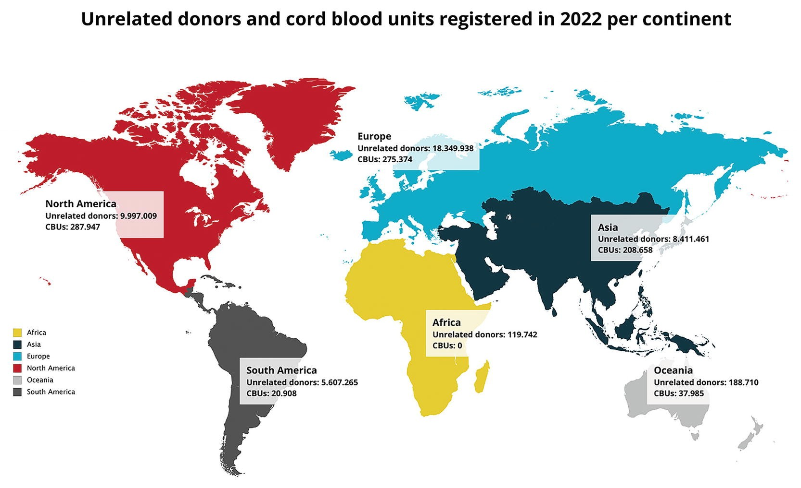
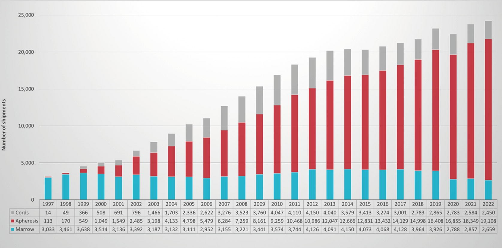
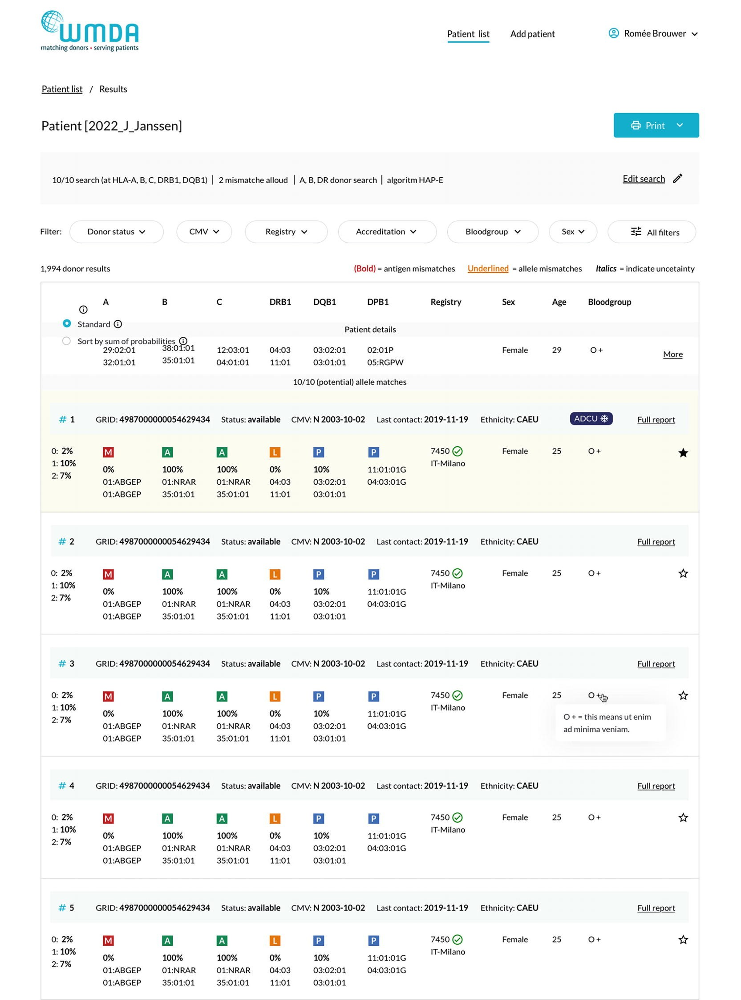
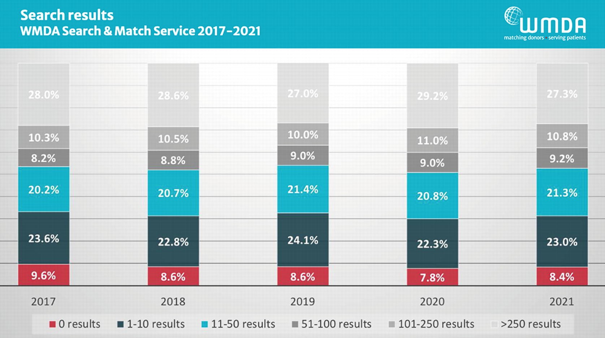
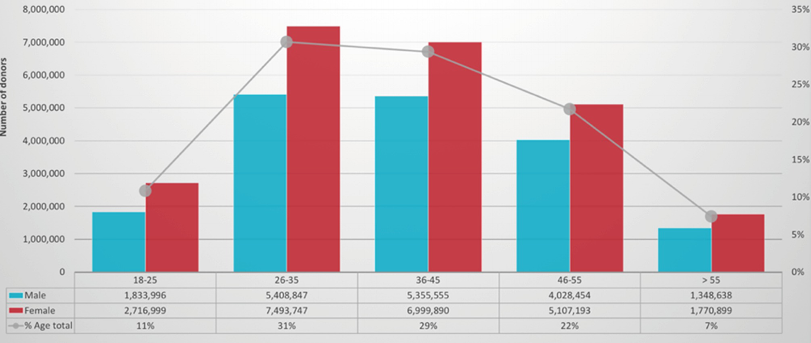

# Chapter 3. Registries: A Bridge Between Donor and Recipient

> **Source:** Sureda A, Corbacioglu S, Greco R, Kröger N, Carreras E (eds). *The EBMT Handbook: Hematopoietic Cell Transplantation and Cellular Therapies*, 8th ed. Springer, Cham; 2024. pp. 21–30. https://doi.org/10.1007/978-3-031-44080-9_3  
> **Authors:** Evseeva, Irina; Foeken, Lydia; Villa, Juliana  
>   - Evseeva, Irina: Anthony Nolan  
>   - Foeken, Lydia: World Marrow Donor Association  
>   - Villa, Juliana: Josep Carreras Foundation against Leukeamia  
> **License:** CC BY 4.0 (https://creativecommons.org/licenses/by/4.0/). Text reproduced verbatim from the open-access HTML edition; formatting converted to Markdown.

## Abstract

Registries strive for a world where access to life-saving cellular therapies for all patients is assured and donors’ rights and safety are protected. Through the World Marrow Donor Association (WMDA), registries work together to ensure reliable provision of cells and are crucial partners for the clinical community in facilitating HCT and other cellular therapies.

## 3.1 Introduction

### 3.1.1 What Is a Registry?

A registry plays a critical role in the recruitment, donation, collection, testing and distribution of cells for use in cellular therapy. As a bridge between donation and transplant, registries can serve either as donor registries, providing cell products from their donors/cord blood banks (CBBs) to national and international transplant centres, or patient registries, partnering with local transplant centres, making the search of the best cell source and requesting cell products. In most cases, registries serve in both roles.

Registries have different structures, some are governmental organizations, others are foundations, and a third category is part of a larger organization such as a hospital, blood bank or university. Some have affiliated donor or patient management entities located in different countries. WMDA provides operational and regulatory information on each operating registry and CBB on WMDA Share (https://share.wmda.info/x/4gdcAQ).

### 3.1.2 What Is WMDA?

WMDA was initiated by three pioneers, Professors John M. Goldman (United Kingdom), E. Donnell Thomas (United States) and Jon J. van Rood (the Netherlands) and founded in 1994. WMDA is a merger organization of BMDW, NetCord Foundation, EMDIS and WMDA. Over 100 registries and CBBs collaborate by sharing both donor and cord blood (CB) data for international search through WMDA’s Search & Match Service (WSMS) (https://share.wmda.info/x/4gdcAQ and https://statistics.wmda.info/) (Fig. 3.1).

**Fig. 3.1**

WMDA Global Trends Report 2022

WMDA operates a certification programme ensuring that cells are provided according to internationally agreed standards and can be imported without administrative burden into a country. In 2023, over 90% of the donors registered are assessed through WMDA’s Certification Programme (https://www.wmda.info/professionals/quality-and-accreditation/wmda-standards/).

## 3.2 The Role of the Registry: Patient Perspective

### 3.2.1 Find the Best Suitable Graft: Search and Match Service

The choice of the best suitable cell source depends on patient’s medical condition and clinical situation and is determined by patient HLA type, sex, weight, CMV status, alloantibody profile, ABO blood group and other factors that the transplant physician may find important. Transplant and search coordinators can utilize Search & Match Service, available at https://search.wmda.info/login, to register patient data. This can be done manually through a web form or automatically through an API connection that electronically transfers the data. Within seconds, a list of potentially matched URD/CBUs is available. Registries are encouraged to upload their complete URD/UCB data on a daily base.

Nearly 95% of the registered donors have been DNA typed for HLA-A,-B,-DRB1 loci, with more than half having additional information on HLA-C,-DQB1,-DPB1. The chance of finding a suitable cell source varies, depending on patient race and ethnicity. The likelihood of a patient of White (Caucasian) ancestry identifying an 8/8 HLA-matched URD is 79%, the rate is much lower for patients of non-White or multi-ethnic heritage—47% for Asian, 48% Hispanic/Latino and 29% for Black or African Americans. High genetic diversity, increased barriers to donor availability and underrepresentation in the global inventory are contributing factors to lower match likelihoods experienced by patients of non-Caucasian ancestry (Gragert et al. 2023) (https://bethematch.org/transplant-basics/how-blood-stem-cell-transplants-work/how-does-a-patients-ethnic-background-affect-matching/). To facilitate these complex searches multiple mismatched unrelated donors are selected, as described in Chap. 12. WMDA allows to search for multiple mismatches.

WMDA offers a set of filters that can be used to reduce the number of potential cell sources for your patient. Examples of filters are age, gender and certification status. WMDA provides accurate information at initial search for quick identification of the most suitable cell source and is working towards service development, e.g. implementing a flag on a CBU with all necessary releasing tests completed, listing of adult cryopreserved donor units and an algorithm on assessing donor’s commitment to donate.

WMDA lists over 800,000 UCBs and provides information to shortlist the best suitable CBUs—HLA match to the patient, cellularity parameters, frozen volume and CBB information to follow published guidelines (Politikos et al. 2020; Little et al. 2021). To further facilitate the selection process, WMDA is working to standardize the presentation through a report that includes information about potency and quality. A critical factor for assessing the quality is whether the CB is stored in an AABB or NetCord-FACT-accredited CBB. If this is not the case, it is recommended to seek information through the registry, Eurocord survival data and WMDA information sources.

### 3.2.2 Back-Up Donor Strategy

While availability of URD at workup is a WMDA key performance indicator, registries cannot always meet the timeframe requirements as individual and unexpected medical or personal issues can lead to unavailability of a donor. It is recommended that at least one backup donor who is prepared and willing to donate and/or a reserved UCB be chosen at workup with a primary donor, to ensure that impact to patient care is minimized should the primary donor become unavailable.

### 3.2.3 Registries as Partners of Transplant Centres

Once a cell source has been identified, the transplant centre will notify their affiliated registry to facilitate the delivery of the cells. Annually, over 20,000 cell products are transported across borders to meet the needs of patients requiring a HCT (Fig. 3.2). Registries work closely with transplant physicians to assist with URD and CBU selection, evaluation of product quality and education and training.

**Fig. 3.2**

URD and CBUs shipped annually (WMDA Global Trends 2022 Report)

If there is no national registry in your country, WMDA can assist with the identification of the most suitable cell source and provide a match list (Fig. 3.3).

**Fig. 3.3**

Search & Match Service

## 3.3 The Role of a Registry: Donor Perspective

### 3.3.1 Donor Recruitment

Annually, registries add two million new volunteer URDs. Donor recruitment is challenging as registries must target young donors and ensure they are well-informed. Methods for recruitment include patient-related drives, targeting specific groups, engaging blood donors, social media campaigns and online recruitment. When donors sign up as volunteers, they agree to register in the global database. They provide biological material and personal information for testing and potential matching. Confidentiality and traceability are crucial. To ensure this registries follow European General Data Protection Regulation and have implemented Global Registration Identifier for Donors (GRID) (Neller et al. 2017). Annually, WMDA is honouring the donors on the third Saturday in September during World Marrow Donor Day (https://worldmarrowdonorday.org/).

### 3.3.2 Donor Pool HLA Diversity

New conditioning regimens allow an increase in the selection of mismatched unrelated donors (Nagler et al. 2022), and the disparities between patients from different ethnicities being transplanted are considerable (Auletta et al. 2021). For 30% of the patients that are registered, the number of options to find a suitable cell source is limited (Fig. 3.4). The main obstacles are rare alleles or haplotype combinations (e.g. multi-race ancestry). Strategies are explored to focus on targeted recruitment within non-Caucasian populations and encouraging the establishment of new and emerging registries. WMDA has published a handbook on how to start a registry to facilitate this process (available on request, mail@wmda.info). Another strategy is training of search coordinators in exploring alternative options (e.g. mismatched URD, CB). In collaboration with EBMT, WMDA has developed an online education programme on donor and cord blood selection.

**Fig. 3.4**

Search results (WMDA Global Trends 2022 Report)

### 3.3.3 Donor Profile: Young, Healthy and High-Resolution Typed

Registries target young and healthy volunteers (Fig. 3.5). The age range of the donor pool is between 16 and 60 years old, and younger donors are preferred due to better transplant outcomes (Kollman et al. 2016; Shaw et al. 2018). In addition, other testing such as CMV status and blood group can be done. WMDA’s donor medical suitability guidelines are publicly available (Lown et al. 2014 and https://share.wmda.info/x/FABtEQ; Worel et al. 2022).

**Fig. 3.5**

Age and gender of unrelated donors

Donor/patient HLA matching is an aspect in selecting a cell source. The classic approach is to consider the best match on a minimum of four HLA loci-HLA-A,-B,-C,-DRB1 for adult and CB donors, where additional HLA loci (-DQB1,-DPB1) may be included (Fleischhauer et al. 2012; Mayor et al. 2018). The number of mismatches allowed depends on the type of the graft and clinical situation. WMDA provides flexibility in search tools to identify matched and mismatched donors in line with the patient needs (Shaw et al. 2017; Eapen et al. 2017).

### 3.3.4 Donor Availability: Focus of Registries Worldwide

Donor retention is influenced by cultural and traditional factors. Donor availability is a key focus, as time to transplant is a significant factor in overall survival (Craddock et al. 2011). While donors have the right to withdraw at any stage, registries aim to keep in touch with donors to ensure up-to-date information and increase the number of collection centres to meet desirable turnaround times. WMDA has defined key performance indicators (KPI) on donor availability (https://share.wmda.info/x/1YC1EQ).

Improvements in HLA typing methodologies have resulted in donors with high HLA-resolution typing, allowing for unambiguous determination of compatibility with patients in need of HCT. The health and availability check (HAC) is an emerging strategy that can expedite a patient’s timeline to transplant, as well as improving both donor experience and potentially patient outcomes.

## 3.4 Working Together to Deliver Best Care to Patient and Donor

To deliver the best care for donor and patient, transplant centres work closely with local registries providing necessary information and helping to maintain donor commitment and satisfaction.

### 3.4.1 Backup Donor

Transplant centres must consider the cost, unnecessary testing and workload of managing backup donors while ensuring care for their patients. Having prepared backup donors is crucial to avoid delays if the primary donor is unavailable. The transplant centre should collaborate with the registry to identify and prepare backup donors promptly, following ethical and regulatory guidelines.

### 3.4.2 Serious (Product) Events and Adverse Reactions (SPEAR)

WMDA operates a service that collects and analyses information on serious adverse events (SAE) and reactions (SAR) related to stem cell donation (Shaw et al. 2013; Jöris et al. 2021). This service is known as SPEAR (serious \[product\] adverse events and reactions). The aim of SPEAR is to gather information and to provide a rapid alert system for disseminating information to the international community that affect donors and/or products and/or recipients. By reporting these incidents (Sorensen et al. 2016), WMDA understands the potential risks and improves the safety of the donation process. Transplant centres are welcome to report on related donors. Info is available at sear-spear@wmda.info and at https://share.wmda.info/x/YotOGg.

### 3.4.3 Donor Follow-Up

The donation process in general has proven to be safe, but in rare cases severe and even fatal events have been reported. Better supportive care and the administration of reduced-intensity conditioning regimens have contributed to an increase in HCT in older patients, whose related donors are usually also older. As a consequence, the median age of related donors has increased and is approximately 10 years higher than that of unrelated donors (Halter et al. 2009) leading to potentially more donors with occult or manifest comorbidities at the time of donation. Donor follow-up is organized in different ways (Sánchez Ibáñez et al. 2023) and registries can assist transplant centres to organize donor follow-up for related donors (Ruesch et al. 2022).

### 3.4.4 Patient Follow-Up

To ensure safety of HCT, registries would like to share patient follow-up information with both the collection centre and the donor. Both external parties are important to be informed: the collection centre from a quality perspective (as stated in JACIE standards) and, if a donor is interested, they can be informed about the status of the patient. Registries send forms (https://wmda.info/wp-content/uploads/2022/04/WMDA-FORM-TF1_Group_v1.1.pdf) to receive this information from transplant centres, in case they do not have access to the EBMT database.

### 3.4.5 Addressing Crisis Situations

Several times the provision of cells has been challenged by situations such as volcano eruptions or political conflicts, and none of them have been so disruptive as the COVID-19 pandemic. For the first time, a negative development in the number of donations was observed due to logistical reasons such as travel and lockdown restrictions or limited capacity at collection centres. Registries should be able to respond to crisis situations and to collaborate internationally (Joris et al. 2022).

One of the EBMT/WMDA recommendations was to withhold the conditioning regimen of the patient until the cells had safely arrived at the transplant centre. This was possible by cryopreserving the products at origin or destination (https://www.ebmt.org/covid-19-and-bmt). This methodology had as a negative consequence a high number of non-transfused donations, some registries reporting as many as 5–10% of their donations going unused (Schmidt et al. 2021). Although the latter waves of the pandemic showed fewer logistic problems, cryopreservation needs to be reviewed to assess the impact on donor burden and patient outcome.

### 3.4.6 Donor-Patient Contact

Donor-patient contact after donation is generally not recommended. There may be ethical and psychological implications for donors and recipients if contact is made. Therefore, it is important to follow the guidance provided by their medical professionals and the ethical guidelines established by regulatory bodies. However, there are circumstances where contact can be facilitated in a controlled manner, such as anonymous correspondence or facilitated meetings with medical professionals present to monitor and guide the interaction.

### 3.4.7 Related Donor

In recent years, registries have expanded their services to include support for related donors who live in different countries or who are unable to collect cells at their local transplant centre. This includes providing logistical and administrative assistance to ensure the safe and timely transport of cells from the donor to the patient’s transplant centre. Some registries also offer pre- and post-collection support, as well as assistance with travel and accommodation arrangements.

### 3.4.8 Research

Registries want to make sure that donors are fully informed of the risks and benefits of participating in clinical trials and that their decision to participate is entirely voluntary. By participating in clinical trials, donors can help to further medical knowledge and potentially benefit patients in the future. Donors should be made aware of their right to withdraw from the study at any time, without any negative consequences for their care or the donation process. Registries have a responsibility to ensure that donors are properly informed about any research studies and that their participation is strictly voluntary (King et al. 2012).

## 3.5 Future of Registries

WMDA and its registries are a community of healthcare professionals focused on innovation and striving for equal access for all patients. The connection between donors and patients is going beyond the traditional unrelated donor. Areas that registries can assist transplant centres are:

- Care, administrative and logistical support for related donors

- Logistics of products for cellular therapy

- Complex logistical procedures

### Key Points

- WMDA and its members strive for a world where access to life-saving cellular therapies for all patients is assured and donors’ rights and safety are protected.

- International collaboration resulted in more than 41 million URD and CBUs being potentially available for patients requiring HCT. A potential match can quickly be identified by performing a search in WMDA’s Search & Match Service.

- Registries are important partners for transplant centres in requesting URD/CBUs, to ensure quality and legal compliance. Registries are exploring other products and services to support the clinical community, e.g. care for related donors and supporting cellular therapy.

- Efforts are being made to reduce time to transplant by increasing the HLA diversity, by performing high-quality HLA typing and by educating donors on their role in the donation process to avoid the donor not being available.

## References

- Auletta JJ, Kou J, Chen M, Shaw BE. Current use and outcome of hematopoietic stem cell transplantation: CIBMTR US summary slides; 2021.

- Craddock C, Labopin M, Pillai S, et al. Factors predicting outcome after unrelated donor stem cell transplantation in primary refractory acute myeloid leukaemia. Leukemia. 2011;25:808–13.

- Eapen M, Wang T, Veys PA, et al. Allele-level HLA matching for umbilical cord blood transplantation for non-malignant diseases in children: a retrospective analysis. Lancet Haematol. 2017;4:325–33.

- Fleischhauer K, Shaw BE, Gooley T, et al. Effect of T-cell-epitope matching at HLA-DPB1 in recipients of unrelated-donor haematopoietic-cell transplantation: a retrospective study. Lancet Oncol. 2012;13:366–74.

- Gragert L, Spellman SR, Shaw BE, Maiers M. Unrelated stem cell donor HLA match likelihood in the US Registry incorporating HLA-DPB1 permissive mismatching. Transpl Cell Therapy. 2023;29:244–52.

- Halter J, Kodera Y, Ispizua AU, et al. Severe events in donors after allogeneic hematopoietic stem cell donation. Haematologica. 2009;94:94–101.

- Jöris MM, Pustjens E, Mengling T, et al. New global reporting system for serious (product) events and adverse reactions in hematopoietic stem cell donation and transplantation. Cell Tissue Bank. 2021;22:191–7.

- Joris MM, Schmidt AH, Bernas SN, et al. Impact of COVID-19 pandemic on global unrelated stem cell donations in 2020—report from World Marrow Donor Association. Bone Marrow Transplant. 2022;57:1021–4.

- King R, Schmidt AH, Costeas P, Egeland T. Donors as research subjects: a challenge. Bone Marrow Transplant. 2012;47:605–6.

- Kollman C, Spellman SR, Zhang MJ, et al. The effect of donor characteristics on survival after unrelated donor transplantation for hematologic malignancy. Blood. 2016;127:260–7.

- Little AM, Akbarzad-Yousefi A, Anand A, et al. BSHI guideline: HLA matching and donor selection for haematopoietic progenitor cell transplantation. Int J Immunogenet. 2021;48:75–109.

- Lown RN, Philippe J, Navarro W, et al. Unrelated adult stem cell donor medical suitability: recommendations from the World Marrow Donor Association Clinical Working Group Committee. Bone Marrow Transplant. 2014;49:880–6.

- Mayor NP, Hayhurst JD, Turner TR, et al. Better HLA matching as revealed only by next generation sequencing technology results in superior overall survival post-allogeneic haematopoietic cell transplantation with unrelated donors. Biol Blood Marrow Transplant. 2018;24:63–4.

- Nagler A, Labopin M, Arat M, et al. Posttransplant cyclophosphamide-based anti-graft-vs-host disease prophylaxis in patients with acute lymphoblastic leukemia treated in complete remission with allogeneic hematopoietic cell transplantation from human leukocyte antigen-mismatched unrelated donors versus haploidentical donors: a study on behalf of the ALWP of the EBMT. Cancer. 2022;128:3959–68.

- Neller JK, Ashford P, van Veen C, et al. Global Registration Identifier for Donors (GRID) of hematopoietic stem cells: road to automation and safety. Transfus Med Hemother. 2017;44:407–13.

- Politikos I, Davis E, Nhaissi M, et al. Guidelines for cord blood unit selection. Biol Blood Marrow Transplant. 2020;26:2190–6.

- Ruesch M, Dusouqui SA, Burhfeind E, et al. Basic characteristics and safety of donation in related and unrelated haemtopoietic progenitor cell donors—first 10 years of prospective donor follow up Swiss donors. Bone Marrow Transplant. 2022;57:918–24.

- Sánchez Ibáñez J, Bokhorst A, Chandrasekar A, et al. Protection of haematopoietic progenitor cell donors: an updated overview of the European landscape. Bone Marrow Transplant. 2023;15:1–7. https://doi.org/10.1038/s41409-023-01982-w. \[EPub ahead of print\].

- Schmidt AH, Buk D, Bernas SN, et al. A DKMS (German Bone Marrow Donor Center) view on cryopreservation of unrelated donor stem cell products during the Covid-19 pandemic. Am J Hematol. 2021;96:E91–2.

- Shaw BE, Chapman J, Fechter M, et al. Towards a global system of vigilance and surveillance in unrelated donor of haematopoietic progenitor cells for transplantation. Bone Marrow Transplant. 2013;48:1506–9.

- Shaw BE, Mayor NP, Szydlo RM, et al. Recipient/donor HLA and CMV matching in recipients of T-cell-depleted unrelated donor haematopoietic cell transplants. Bone Marrow Transplant. 2017;52:717–25.

- Shaw BE, Logan BR, Spellman SR, et al. Development of an unrelated donor selection score predictive of survival after HCT: donor age matters most. Biol Blood Marrow Transplant. 2018;24:1049–56.

- Sorensen BS, Szer J, Shaw B, et al. Inadvertent completely HLA-mismatched allogeneic unrelated bone marrow transplant: lessons learnt. Bone Marrow Transplant. 2016;51:1016–8.

- Worel N, Aljurf M, Anthias C, et al. Suitability of haematopoietic cell donors: updated consensus recommendations from the WBMT standing committee on donor issues. Lancet Haematol. 2022;9:e605–14.

## Acknowledgements

The authors are grateful to Alejandro Madrigal at Anthony Nolan and Monique Jöris at WMDA for providing information and advising on the content of this chapter.
