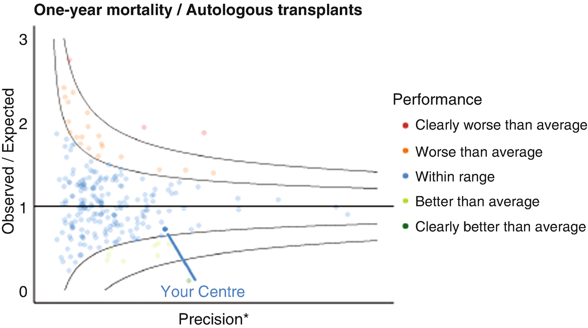
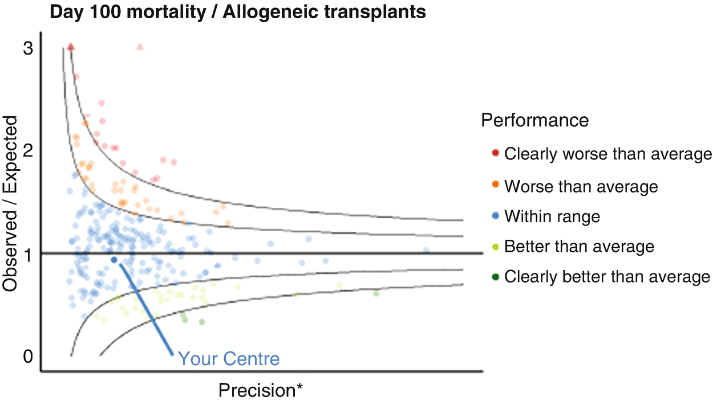
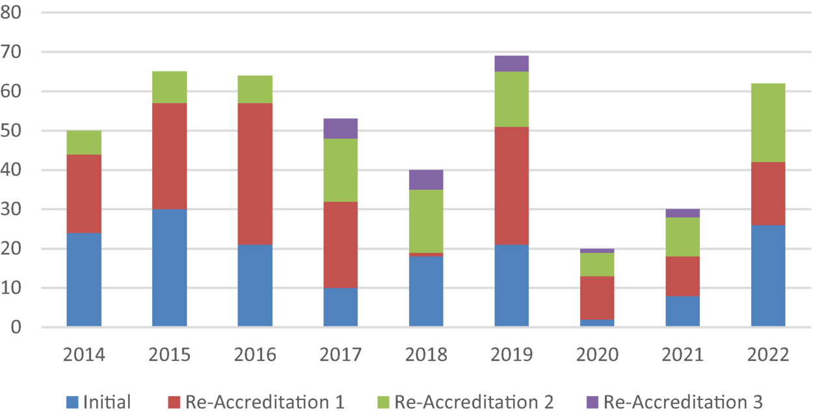
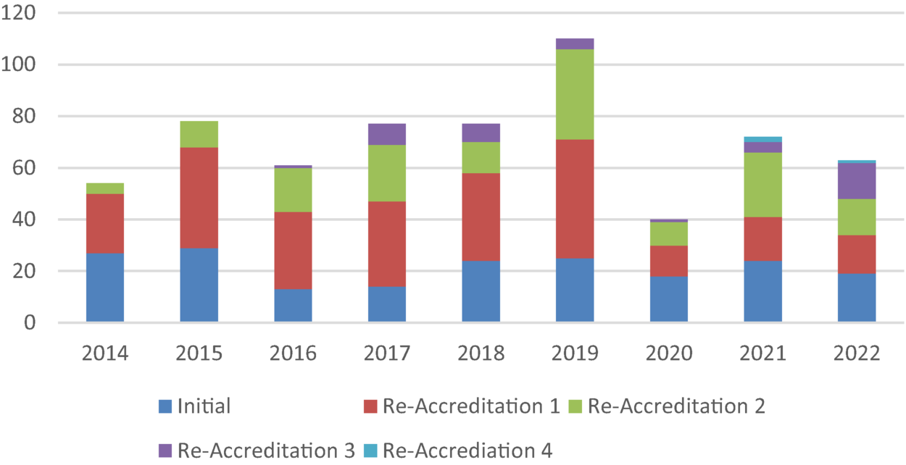
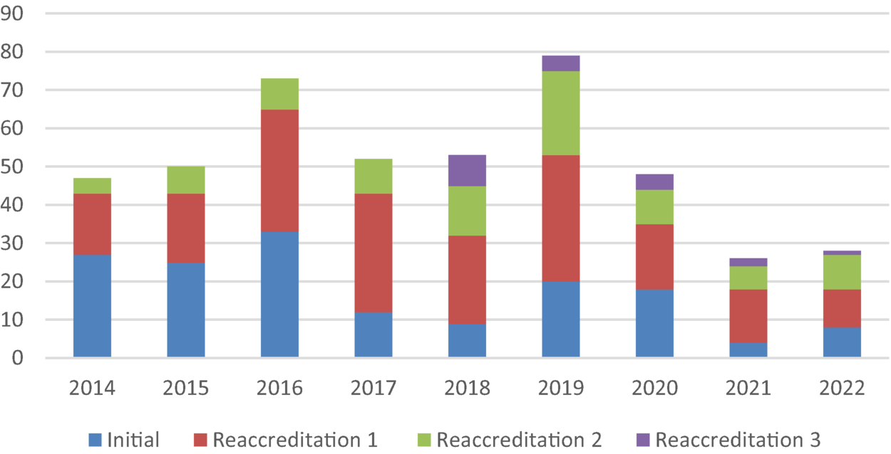

# Chapter 5. JACIE Accreditation of HCT Programs

> **Source:** Sureda A, Corbacioglu S, Greco R, Kröger N, Carreras E (eds). *The EBMT Handbook: Hematopoietic Cell Transplantation and Cellular Therapies*, 8th ed. Springer, Cham; 2024. pp. 41–47. https://doi.org/10.1007/978-3-031-44080-9_5  
> **Authors:** Saccardi, Riccardo; Rintala, Tuula; McGrath, Eoin; Snowden, John A.  
>   - Saccardi, Riccardo: Careggi University Hospital  
>   - Rintala, Tuula: European Society for Blood and Marrow Transplantation (EBMT)  
>   - McGrath, Eoin: International Council for Commonality in Blood Banking Automation (ICCBBA)  
>   - Snowden, John A.: Sheffield Teaching Hospitals NHS Foundation Trust and Division of Clinical Medicine, School of Medicine and Population Health, The University of Sheffield  
> **License:** CC BY 4.0 (https://creativecommons.org/licenses/by/4.0/). Text reproduced verbatim from the open-access HTML edition; formatting converted to Markdown.

## Abstract

The complexity of HCT as a medical technology and the frequent need for close interaction and interdependence between different services, teams, and external providers (donor registries, typing laboratories, etc.) distinguish it from many other medical fields. This complexity led to efforts by transplantation professionals to standardize processes based on consensus as a way to better manage inherent risks of this treatment. HCT was, and continues to be, a pioneer in the area of quality and standards.

## 5.1 Introduction

The complexity of HCT as a medical technology and the frequent need for close interaction and interdependence between different services, teams, and external providers (donor registries, typing laboratories, etc.) distinguish it from many other medical fields. This complexity led to efforts by transplantation professionals to standardize processes based on consensus as a way to better manage inherent risks of this treatment. HCT was, and continues to be, a pioneer in the area of quality and standards.

## 5.2 Background

In 1998, EBMT and the International Society for Cell and Gene Therapy (ISCT) established the Joint Accreditation Committee, ISCT and EBMT (JACIE). JACIE aimed to offer an inspection-based accreditation process in HCT against established international standards. JACIE is a committee of the EBMT, its members are appointed by and are accountable to the EBMT board, and ISCT is represented through two members of the committee. JACIE collaborates with the US-based Foundation for the Accreditation of Cellular Therapy (FACT) to develop and maintain global standards for the provision of quality medical and laboratory practice in cellular therapy.

The JACIE and FACT accreditation systems stand out as examples of profession-driven initiatives to improve quality in transplantation and which have subsequently been incorporated by third parties, such as healthcare payers (health insurers, social security) and competent authorities (treatment authorization). The JACIE Accreditation Program was supported in 2004 by the European Commission under the public health program 2003–2008 and was acknowledged as an exemplary project in a 2011 review of spending under the public health program.

## 5.3 Impact of Accreditation in Clinical Practice

Much literature indicating a better clinical outcome in teaching hospitals and centers of excellence has been available since the 1990s (Hartz et al. 1989; Birkmeyer et al. 2005; Loberiza et al. 2005). Initial evidence of a positive relationship between the implementation of a quality management system and outcome of HCT in Europe was published in 2011 (Gratwohl et al. 2011). In this study, patients’ outcome was systematically better when the transplantation center was at a more advanced phase of JACIE accreditation, independent of year of transplantation and other risk factors.

Another analysis (Gratwohl et al. 2014) was performed on a large cohort of patients who received either an allogeneic or an autologous transplantation between 1996 and 2006 and reported to the EBMT database. The authors showed that the decrease of overall mortality in allogeneic procedures over the 14-year observation period was significantly faster in JACIE-accredited centers, thus resulting in a higher relapse-free survival and overall survival at 72 months from transplant. Such improvement was not shown in autologous transplantation. Further confirmation with an updated health economic analysis was provided in Gratwohl et al. (2015).

Similar results published by Marmor et al. (2015) in an American study showed that centers accredited by both FACT and Clinical Trial Network (CTN) demonstrated significantly better results for more complex HCT such as HLA-mismatched transplants. Further, Anthias et al. (2016) suggested that the introduction of FACT-JACIE standards has improved the related donor care.

These data reinforce the concept that clinical improvement is driven by the implementation of a quality management system embedded in external accreditation standards, especially in the context of more complex procedures. This process also results in a wider standardization of procedures across different countries and geographic areas, therefore contributing to providing patients with similar treatment expectations even when accessing different health management systems. Comprehensive reviews of this area have been recently published (Snowden et al. 2017, 2021).

## 5.4 JACIE-FACT Accreditation System

JACIE and FACT accreditation systems are based on the development and continuous update of standards covering the entire transplantation process, from selection of the donor/patient to follow-up, including collection, processing, and storage of the graft. Considering the different competences included in the process, the standards are divided in four parts:

- Clinical program

- Bone marrow collection

- Apheresis collection

- Processing facility

A quality management (QM) section is embedded in each section, aimed at providing a tool for both the applicants to develop a comprehensive system of quality assessment and for the inspectors to check the compliance of the program to the standard. Stand-alone processing laboratories can apply; however, the target of the accreditation is the transplantation program, intended as a process in its entirety, thus requiring a full integration of units, laboratories, services, and professionals. Each section focusses on the competence of personnel, listing topics for which the evidence of specific training is required which also includes the minimum experience requirements for positions of responsibility. Maintaining these competencies is required for all professionals.

The standards are revised on a 3-year basis by a commission formed of experts appointed by JACIE and FACT, including HCT administration, cell processing and storage, blood apheresis, transplant registries, and QM specialists. The standards are based on published evidence and, when this is not available, on expert consensus. A legal review and comparison with current regulations are carried out for each version. When the developmental phase is finalized, the standards are published for public review and comment and finally approved by JACIE and FACT. The standards incorporate sound principles of quality medical and laboratory practice in cellular therapy, but do not cover legal requirements of local competent authorities.

The compliance to the standards is ensured through an inspection system, carried out by voluntary inspectors, trained and coordinated by the JACIE office. The JACIE inspection is a multistep procedure: the applicant center is provided with all the application documents and is then required to submit a set of documentation to the JACIE accreditation coordinators. The on-site inspection is then planned in agreement with the applicant.

JACIE inspections are carried out in most cases in the language of the applicant. The inspectors’ report is then assessed by the JACIE accreditation committee, which may request supplementary information, modifications, or another on-site visit. Once all aspects are shown to be compliant, accreditation is awarded. An accreditation cycle is 4 years for JACIE, and facilities must complete an interim, documentation-based audit at 2 years post-accreditation. Accredited facilities must reapply for reaccreditation and may also be reinspected in response to complaints or information that a facility may be noncompliant with the standards, in response to significant changes in the program and/or facility.

Many tools are made available to prepare the accreditation through the JACIE website, including a quality management guide, the welcome guide, e-learning materials and webinars. JACIE runs training courses throughout the year, and the JACIE staff are available to support the applicants. An accreditation manual provides detailed explanations and examples for each single item of the standards. JACIE and FACT also collaborate on an initiative for transplant programs in low- and middle-income countries (LMICs), where full accreditation might not be feasible due to resources and/or cultural issues. This “stepwise” option encourages the programs to connect with an international network of professionals and may also stimulate local authorities to support further progress toward full accreditation in the interests of patients, donors, and the professional community.

The standards cover the use of different sources of hematopoietic stem cells and nucleated cells from any hematopoietic tissue source administered in the context of the transplant process, such as DLI. The term “hematopoietic” in the title is to define the scope of these standards, due to an increasing number of accredited facilities that also support non-hematopoietic cellular therapies. Starting with version 6.1, the standards include new items specifically developed for other cellular therapy products, with special reference to immune effector cells (IECs). This reflects the rapidly evolving field of cellular therapy through mainly, but not exclusively, genetically modified cells, such as CAR-T cells. The standards do not cover the manufacturing of such cells but include the chain of responsibilities where the product is provided by a third party and ensure the competence of the personnel in the management of adverse events related to the infusion.

## 5.5 Benchmarking

Introduction of “benchmarking” standards related to 1-year survival/mortality, 1 year event-free survival, 100-day survival mortality, and other patient outcomes has developed into a collaboration between JACIE and the EBMT registry which will enable centers to address these new JACIE standards within their own BMT community and across the international boundaries. The “benchmarking” initiative at the EBMT is comprehensively covered in Snowden et al. (2020) and Saccardi et al. (2023). Based on individual center EBMT registry returns and a minimum level of data completeness over a 5-year period, annual reports are issued reflecting center performance “benchmarked” against the broader EBMT returns with adjustment for case mix and follow-up.

Only centers reporting at least 80% of follow-up in transplants performed in the 5-year observed interval are included in the benchmarking analysis. Results are presented as “funnel plots” and other data outputs for autologous and allogeneic transplants. Results are highly affected by data completeness and quality of follow-up over the period. Examples of funnel plots are provided below comparing “observed over expected” 1-year and 100-day survival/mortality (Figs. 5.1 and 5.2).

**Fig. 5.1**

Example of funnel plot for 1-year mortality following autologous transplantation comparing observed over expected mortality adjusted for case mix and center follow-up. ^(\*) Precision reflects increasing number of transplants per centre

**Fig. 5.2**

Example funnel plot for 100-day mortality following allogeneic transplantation comparing observed over expected mortality adjusted for case mix and center follow-up. ^(\*) Precision reflects increasing number of transplants per centre

## 5.6 Activity of JACIE, Including Impact of Pandemic

JACIE is run on a nonprofit basis, resourced almost entirely on application fees. Fees depend on the configuration of the program and supplementary fees for additional sites and discounts for active inspectors based at the applicant center are also applied (*see* JACIE website for details).

Over the last 25 years JACIE has carried out over 800 inspections and accredited over 700 centers in 30 countries across Europe and further afield with increasing numbers of centers going through the second and third reaccreditation cycle (Fig. 5.4). The Covid-19 pandemic brought the inspection activity to a halt in early 2020, and despite developing a virtual inspection model, the inspections did not restart until late 2021. The pandemic was also reflected in the number of applications and the accreditations during this period (Figs. 5.3 and 5.5).

**Fig. 5.3**

JACIE applications 2014–2022

**Fig. 5.4**

JACIE Inspections 2014–2022

**Fig. 5.5**

JACIE accreditations 2014–2022

JACIE accreditation is now mandatory in several European countries to apply for reimbursement of the procedure and/or to be authorized to perform HCT.

### Key Points

- JACIE accreditation is based on an internationally-agreed quality standard system led and delivered by the professionals in the field of HCT and cell therapy.

- The standards are regularly updated, incorporating advances in the evidence base while reflecting the practical view of experienced experts on clinical and laboratory practice of HCT and cell therapy.

- Published data support a positive improvement in the clinical outcome related to the accreditation process, also promoting a progressive standardization of HCT practice across different countries.

- **JACIE continues to develop the standards to meet the changing needs of the evolving field in CAR-T and immune effector cells (IEC), “benchmarking” of patient survival and extending the access in LMIC countries through “stepwise” initiative.**

## References

- Anthias C, O’Donnell PV, Kiefer DM, et al. European Group for Blood and Marrow Transplantation Centers with FACT-JACIE Accreditation have significantly better compliance with related donor care standards. Biol Blood Marrow Transplant. 2016;22:514–9.

- Birkmeyer NJ, Goodney PP, Stukel TA, et al. Do cancer centers designated by the National Cancer Institute have better surgical outcomes? Cancer. 2005;103(3):435–41. https://doi.org/10.1002/cncr.20785.

- Gratwohl A, Brand R, Niederwieser D, et al. Introduction of a quality management system and outcome after hematopoietic stem-cell transplantation. J Clin Oncol. 2011;29:1980–6.

- Gratwohl A, Brand R, McGrath E, Joint Accreditation Committee (JACIE) of the International Society for Cellular Therapy and the European Group for Blood and Marrow Transplantation, and the European Leukemia Net, et al. Use of the quality management system “JACIE” and outcome after hematopoietic stem cell transplantation. Haematologica. 2014;99:908–15.

- Gratwohl A, Sureda A, Baldomero H, et al; Joint Accreditation Committee (JACIE) of the International Society for Cellular Therapy (ISCT) and the European Society for Blood and Marrow Transplantation (EBMT) and the European Leukemia Net (ELN). Economics and outcome after hematopoietic stem cell transplantation: a retrospective cohort study. EBioMedicine. 2015;2:2101–9.

- Hartz AJ, Krakauer H, Kuhn EM, et al. Hospital characteristics and mortality rates. N Engl J Med. 1989;321:1720–5.

- Loberiza FR, Zhang MJ, Lee SJ, et al. Association of transplant center and physician factors on mortality after hematopoietic stem cell transplantation in the United States. Blood. 2005;105:2979–87.

- Marmor S, Begun JW, Abraham J, Virnig BA. The impact of center accreditation on hematopoietic cell transplantation (HCT). Bone Marrow Transplant. 2015;50:87–94.

- Saccardi R, Putter H, Eikema DJ, et al. Benchmarking of survival outcomes following Haematopoietic Stem Cell Transplantation (HCT): an update of the ongoing project of the European Society for Blood and Marrow Transplantation (EBMT) and Joint Accreditation Committee of ISCT and EBMT (JACIE). Bone Marrow Transplant. 2023;58:659–66.

- Snowden JA, McGrath E, Duarte RF, et al. JACIE accreditation for blood and marrow transplantation: past, present and future directions of an international model for healthcare quality improvement. Bone Marrow Transplant. 2017;52:1367–71.

- Snowden JA, Saccardi R, Orchard K, et al. Benchmarking of survival outcomes following haematopoietic stem cell transplantation: a review of existing processes and the introduction of an international system from the European Society for Blood and Marrow Transplantation (EBMT) and the Joint Accreditation Committee of ISCT and EBMT (JACIE). Bone Marrow Transplant. 2020;55:681–94.

- Snowden JA, McGrath E, Orchard K, et al. Visions for a JACIE Quality Management System 4.0. Bone Marrow Transplant. 2021;56:2876–81.
