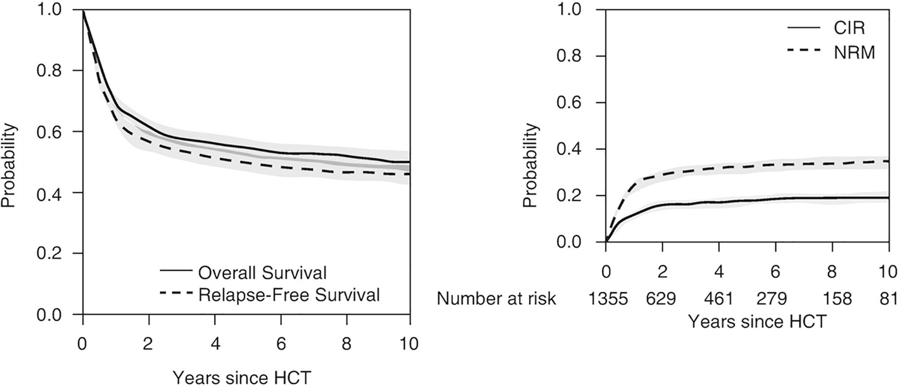
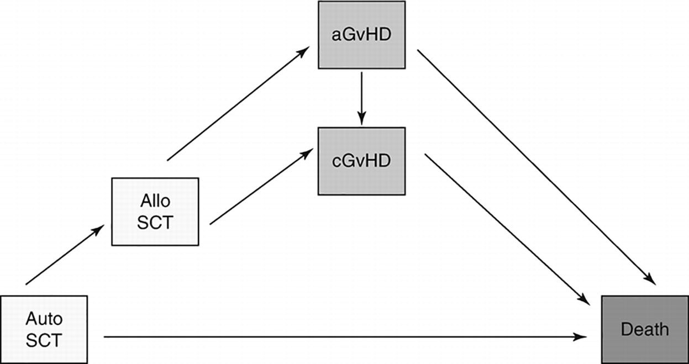

# Chapter 6. Statistical Methods in HCT and Cellular Therapies

> **Source:** Sureda A, Corbacioglu S, Greco R, Kröger N, Carreras E (eds). *The EBMT Handbook: Hematopoietic Cell Transplantation and Cellular Therapies*, 8th ed. Springer, Cham; 2024. pp. 49–54. https://doi.org/10.1007/978-3-031-44080-9_6  
> **Authors:** Iacobelli, Simona; de Wreede, Liesbeth C.  
>   - Iacobelli, Simona: University of Rome Tor Vergata; EBMT  
>   - de Wreede, Liesbeth C.: Leiden University Medical Center; DKMS Clinical Trials Unit  
> **License:** CC BY 4.0 (https://creativecommons.org/licenses/by/4.0/). Text reproduced verbatim from the open-access HTML edition; formatting converted to Markdown.

## Abstract

The analysis of data describing the outcomes of patients who have received an HCT is not only fundamental to assessing the effectiveness of the treatment but can provide invaluable information on the prognostic role of disease and patient factors. Thus, the appropriate analysis and understanding of such data are of paramount importance. This document provides an overview of the main and well-established statistical methods, as well as a brief introduction of more novel techniques. More insight is provided in the *EBMT Statistical Guidelines* (Iacobelli 2013). Additionally, the paper by de Wreede et al. (2022) explains the most important concepts and related pitfalls in the analysis of HCT studies.

## 6.1 Introduction

The analysis of data describing the outcomes of patients who have received an HCT is not only fundamental to assessing the effectiveness of the treatment but can provide invaluable information on the prognostic role of disease and patient factors. Thus, the appropriate analysis and understanding of such data are of paramount importance. This document provides an overview of the main and well-established statistical methods, as well as a brief introduction of more novel techniques. More insight is provided in the *EBMT Statistical Guidelines* (Iacobelli 2013). Additionally, the paper by de Wreede et al. (2022) explains the most important concepts and related pitfalls in the analysis of HCT studies.

## 6.2 Endpoints

The outcomes most commonly studied in HCT analyses are the key events occurring at varying times post-HCT, e.g. engraftment, GVHD, relapse/progression and death. Besides the clinical definition of the event of interest, it is important to define the corresponding statistical endpoint and to use a proper method of measuring the occurrence of the event (Guidelines 2.1).

The main distinction is between events that occur with certainty during a sufficiently long observation period (follow-up), death in particular and events which are precluded from occurring once another event occurs, e.g. not all patients will experience a relapse of their disease because some die before. We define death without prior relapse (usually called NRM; see Guidelines 2.1.2) as the ‘competing event’ of relapse. The name ‘NRM’ is preferable to TRM, the proper analysis of which requires individual adjudication of causes of death.

Standard survival endpoints: In addition to death, other examples of events of the first type are the combinations of (negative) events of interest, which in total have 100% probability of occurrence, for example, PFS which considers as failure the event ‘either relapse/progression or death, whatever occurs first’. The components of PFS are the two competing events mentioned above, relapse/progression and NRM.

Competing risks endpoints: In addition to relapse/progression and NRM, other examples are death of a specific cause and all intermediate events during an HCT history (engraftment, GVHD, achievement of CR, CMV infection) including the long term (diagnosis of secondary malignancy). Notice that the definition of an endpoint requires specifying which are the competing events. Usually, this will be death without prior event of interest, but depending on the disease and the aims of the analysis, other competing events might be included in the analysis, e.g. a second transplantation or other treatment can be considered as competing event for achievement of response.

## 6.3 Analysis of Time-to-Event Outcomes

Each event of interest may occur at variable times posttransplant, so in statistical terms, it has two components—whether it occurs at all and, if it does, when. However, at the end of the follow-up, there can be patients who have not yet had the event of interest but are still at risk for it: their observation times are called ‘censored’. Censoring occurs at different timepoints for different patients. The inclusion of censored data precludes the use of simple statistical methods such as the chi-square or T-test and requires the methods of survival (or competing risks) analysis. The crucial assumption of most methods in survival analysis is that the patients censored at a timepoint are ‘represented’ by those who remain under follow-up beyond that timepoint. In other words, the fact that a patient is censored should not indicate that their prognosis is worse or better than the prognosis of a similar patient who remains under observation. This assumption is called ‘independent and uninformative’ censoring.

### 6.3.1 Kaplan-Meier Curves

The main method to summarize survival endpoints is the Kaplan-Meier curve (Kaplan and Meier 1958), estimating for each point in time *t* after HCT the probability *S*(*t*) of surviving beyond that time. This curve is decreasing from 100% and will reach 0% with complete follow-up. A long flat tail of the curve (often called ‘plateau’) is often based on a few censored observations at late times, corresponding to very unreliable estimates of the long-term survival. It is useful to report each *S*(*t*) with its 95%CI (confidence interval at 95% level, best obtained using the Greenwood formula) or at least the number of patients still at risk at different timepoints. The median survival time is the minimum time when *S*(*t*) is equal to 50% (Fig. 6.1).

**Fig. 6.1**

Probability curves of the four main outcomes after HCT. *CIR* cumulative incidence of relapse. CIR and NRM add up to 1-RFS. Number at risk indicates the number of patients in follow-up who have not yet experienced an event. The grey zones indicate 95% confidence intervals

### 6.3.2 Cumulative Incidence Curves

The appropriate method to summarize endpoints with competing risks is the cumulative incidence curve (Gooley et al. 1999), estimating for each point in time *t* the probability *F*(*t*) of having had the event of interest before that time. This curve is increasing from 0% and will not reach 100% even with complete follow-up if the competing event was observed for some patients. It is always useful to interpret cumulative incidence curves of competing events together, to understand, e.g. when a category of patients has a small risk of relapse, if this means that they have a good prognosis or that they died too early from complications to experience a relapse (shown by a high NRM curve) (Fig. 6.1).

### 6.3.3 Comparison of Groups

The main method to compare survival curves for two or more independent groups is the log-rank test. This test is based on the comparison of the underlying hazard functions, which express the instantaneous probability of the event at a time *t* among patients currently at risk. It has good properties in the situation of proportional hazards (PH, described in the next section), but it should be avoided (or considered carefully) when the survival curves cross; with converging curve alternatives like the Wilcoxon signed-rank test should be preferred.

In the comparison of cumulative incidence curves, the main method is the Gray test. Also the log-rank test can be applied to compare groups in the case of competing risks, when the object of interest is not the cumulative probability of occurrence of the event but its instantaneous probability among the cases at risk at each time, which is called ‘cause-specific hazard’. For the interesting difference of the two approaches to the analysis of competing risks endpoints, see Dignam and Kocherginsky (2008).

We refer to Sects. 1.3 and 1.4 of the guidelines for remarks on statistical testing and about proper settings for comparisons of groups. Importantly, the simple methods described in this chapter can be applied only to groups defined at or before the time origin (e.g. transplantation); assessing differences between groups defined during the follow-up requires other approaches, as those described in Sect. 6.4.1 (Guidelines page 14).

### 6.3.4 Proportional Hazard Regression Analysis

The above tests do not give a summary measure of the difference in outcomes between groups, nor can they be used when the impact of a continuous risk factor (e.g. age) has to be assessed. Furthermore, any comparison could be affected by confounding. These limitations are typically overcome by applying a (multivariable) regression model. The one most commonly used for survival endpoints is the proportional hazard (PH) Cox model (Cox 1972). Results are provided in terms of hazard ratios (HR), which are assumed to be constant during the whole follow-up (Guidelines 4.3.1). The Cox model in its simplest form is thus not appropriate when a factor has an effect that strongly decreases (or increases) over time, but time-varying effects can be accommodated for in more complex models. Effects of characteristics which change during follow-up can be assessed by including them as time-dependent covariates.

For endpoints with competing risks, two methods can be used, which have a different focus: the Cox model can be used to analyse cause-specific hazards, whereas a regression model for cumulative incidence curves was proposed by Fine and Gray (1999).

The use of these regression models requires a sound statistical knowledge, as there are many potential difficulties with the methods both in application and interpretation of results.

## 6.4 Advanced Methods

Many more advanced methods than the ones described above exist that help to get more insights from the available data. A good application of these needs expert statistical knowledge. The brief introductions given below are primarily meant to help understanding papers where these methods have been applied. For a more in-depth discussion, see, e.g. Therneau and Grambsch (2000).

### 6.4.1 Multi-State Models

The methodology of multi-state models (Putter et al. 2007) has been developed to understand the interplay between different clinical events and interventions after HCT and their impact on subsequent prognosis. Their primary advantage is that sequences of events, such as HCT, DLI, GVHD and death, and competing events, such as relapse and NRM, can be modelled simultaneously (see Fig. 6.2 for an example). This is in contrast to analysing composite survival outcomes such as GVHD-free survival where all failures are combined and resolution of GVHD is not considered. Some studies applying this method that offer new insights into the outcomes after HCT are Klein et al. (2000) about current leukaemia-free survival, Iacobelli et al. (2015) about the role of second HCT and CR for MM patients and Eefting et al. (2016) about the evaluation of a TCD-based strategy incorporating DLI for AML patients.

**Fig. 6.2**

Example of a multi-state model. All patients start in state 1 (event-free after HCT). They can then proceed through the states by different routes. Each arrow indicates a possible transition

### 6.4.2 Random Effect Models

In standard methods, all patients are considered as independent, and each patient only contributes one observation for each endpoint. There are, however, situations when this does not hold, for instance, when patients within the same centre tend to have more similar outcomes than those from another centre or when one patient can experience more than one outcome of the same kind, e.g. infections. In these cases, the outcomes within one ‘cluster’ (a centre or a patient) are more correlated than the outcomes between clusters, which has to be accounted for in the analysis. This is usually done by random effect models, which assume that each cluster shares an unobserved random effect. In survival analysis, these are called frailty models (Therneau and Grambsch 2000, Chap. 9). If the outcome is not an event but a value measured over time, e.g. CD8 counts, the appropriate regression models are mixed models and joint models (Baart et al. 2021).

### 6.4.3 Long-Term Outcomes: Relative Survival/Cure Models

With improved long-term outcomes and increasing numbers of older patients, a substantial number of patients will die from other causes than the disease for which they have been transplanted and the direct and indirect consequences of its treatment. This so-called population mortality can be quantified by methods from relative survival, using population tables describing mortality of the general population (Pohar Perme et al. 2016).

Especially for transplanted children, a period with a high risk of mortality can be followed by a very long and stable period where the death risk is (almost) zero. When the focus of an analysis is on the probability of long-term cure, cure models can be used that assess the impact of risk factors on this but only if follow-up is sufficiently long (Sposto 2002).

### 6.4.4 Propensity Scores

Propensity scores (PS) are useful to compare the outcomes of two treatments in the absence of randomization, to control confounding due to the fact that usually the choice of the treatment depends on patient’s characteristics (confounding by indication) (Rosenbaum and Rubin 1983). First, the PS, defined as the probability of receiving one treatment instead of the other, is estimated for each patient. Then PS can be used in various ways (mainly stratification or pair matching), allowing comparison of treatment outcomes among cases with a similar risk profile.

### 6.4.5 Methods for Missing Values

Missing values in risk predictors are a common problem in clinical studies. The simplest solution is to exclude the patients with missing values from the analysis (CC \[complete case analysis\]). This solution is not optimal, however: firstly, not all information is used (an excluded patient might have other characteristics known), and secondly, this approach can lead to bias if patients with missing values have on average a different outcome from the patients with observed values.

If values can be imputed on the basis of observed values in the dataset, these patients can be retained in the analysis to increase precision of estimates and (under certain conditions) avoid bias. The replacement of all missing values of a variable by a single value, e.g. its mean or mode if categorical, should be avoided; instead multiple imputation (MI) can be used. MICE (White et al. 2011) is the most common approach for MI; another method to consider more suitable for Cox models is called SMC-FCS (Bartlett et al. 2015). A major advantage of MI is that it properly takes into account the uncertainty caused by the imputation in the estimates. For practical advice on when and how to use MI, see Carpenter and Smuk (2021). If data are missing not at random—meaning their values cannot be predicted from the observed variables—multiple imputation can at most decrease the bias but not fully remove it.

### Key Points

- Survival and competing risk endpoints need specific methods.

- Survival analysis methods: Kaplan-Meier, log-rank test and Cox model.

- Competing risks methods: cumulative incidence curve, Gray test, Cox model and fine and Gray model.

- Including events/changes of status occurring during follow-up in an analysis requires specific (advanced) methods, like multi-state models.

## References

- Baart SJ, van der Palen RLF, Putter H, et al. Joint modeling of longitudinal markers and time-to-event outcomes: an application and tutorial in patients after surgical repair of transposition of the great arteries. Circ Cardiovasc Qual Outcomes. 2021;14(11):1199–207.

- Bartlett JW, Seaman SR, White IR, et al. Multiple imputation of covariates by fully conditional specification: accommodating the substantive model. Stat Methods Med Res. 2015;24(4):462–87.

- Carpenter JR, Smuk M. Missing data: a statistical framework for practice. Biom J. 2021;63(5):915–47.

- Cox DR. Regression models and life tables. J R Stat Soc. 1972;34(Series B):187–220.

- de Wreede LC, Schetelig J, Putter H. Analysis of survival outcomes in haematopoietic cell transplant studies: pitfalls and solutions. Bone Marrow Transplant. 2022;57(9):1428–34.

- Dignam JJ, Kocherginsky MN. Choice and interpretation of statistical tests used when competing risks are present. J Clin Oncol. 2008;26:4027–34.

- Eefting M, de Wreede LC, Halkes CJM, et al. Multi-state analysis illustrates treatment success after stem cell transplantation for acute myeloid leukemia followed by donor lymphocyte infusion. Haematologica. 2016;101:506–14.

- Fine JP, Gray RJ. A proportional hazards models of the subdistribution of a competing risk. J Am Stat Assoc. 1999;94:496–509.

- Gooley TA, Leisenring W, Crowley JA, et al. Estimation of failure probabilities in the presence of competing risks: new representations of old estimators. Stat Med. 1999;18:695–706.

- Iacobelli S, on behalf of the EBMT Statistical Committee. Suggestions on the use of statistical methodologies in studies of the European Group for Blood and Marrow Transplantation. Bone Marrow Transplant. 2013;48:S1–S37.

- Iacobelli S, de Wreede LC, Schönland S, et al. Impact of CR before and after allogeneic and autologous transplantation in multiple myeloma: results from the EBMT NMAM2000 prospective trial. Bone Marrow Transplant. 2015;50:505–10.

- Kaplan EL, Meier P. Non-parametric estimation from incomplete observations. J Am Stat Assoc. 1958;53:457–81.

- Klein JP, Szydlo RM, Craddock C, et al. Estimation of current leukaemia-free survival following donor lymphocyte infusion therapy for patients with leukaemia who relapse after allografting: application of a multistate model. Stat Med. 2000;19:3005–16.

- Pohar Perme M, Estève J, Rachet B. Analysing population-based cancer survival—settling the controversies. BMC Cancer. 2016;16:933.

- Putter H, Fiocco M, Geskus RB. Tutorial in biostatistics: competing risks and multi-state models. Stat Med. 2007;26:2389–430.

- Rosenbaum PR, Rubin DB. The central role of the propensity score in observational studies for causal effects. Biometrika. 1983;70:41–55.

- Sposto R. Cure model analysis in cancer: an application to data from the Children’s Cancer group. Stat Med. 2002;21:293–312.

- Therneau TM, Grambsch PM. Modeling survival data: extending the Cox model. New York: Springer; 2000.

- White IR, Royston P, Wood AM. Multiple imputation using chained equations: issues and guidance for practice. Stat Med. 2011;30:377–99.

## Acknowledgements

We thank Myriam Labopin, Richard Szydlo and Hein Putter for their contributions to this chapter.
