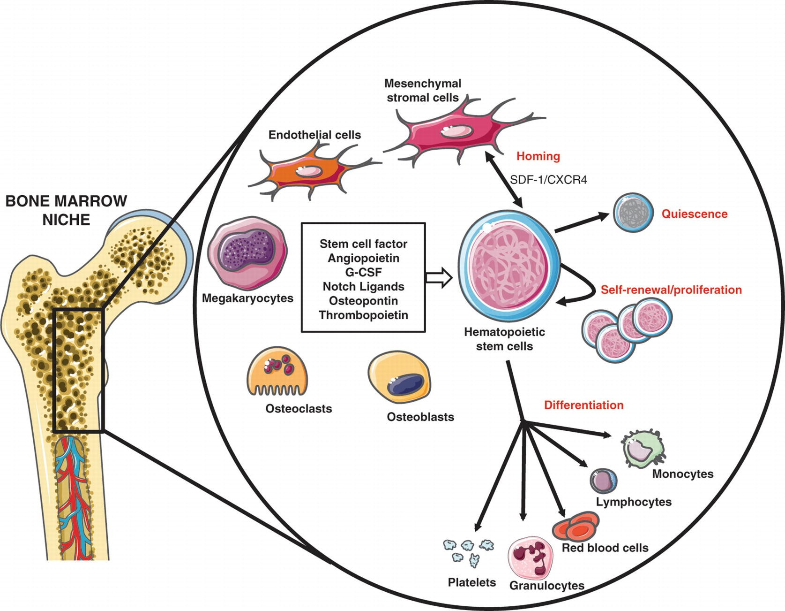
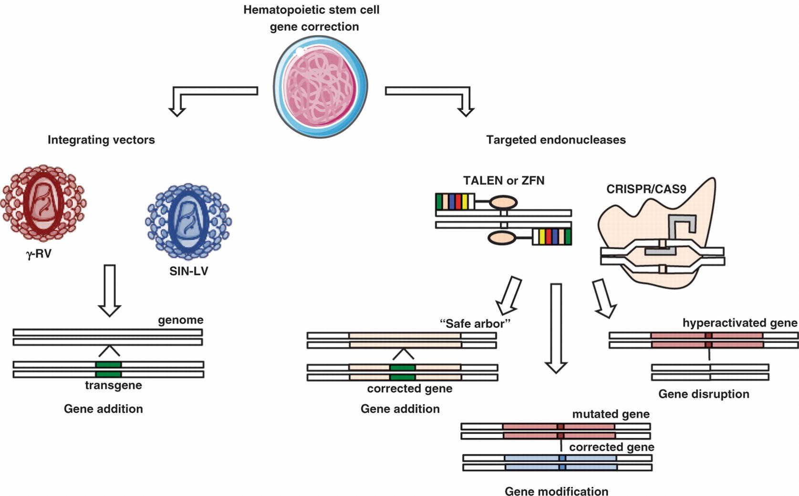
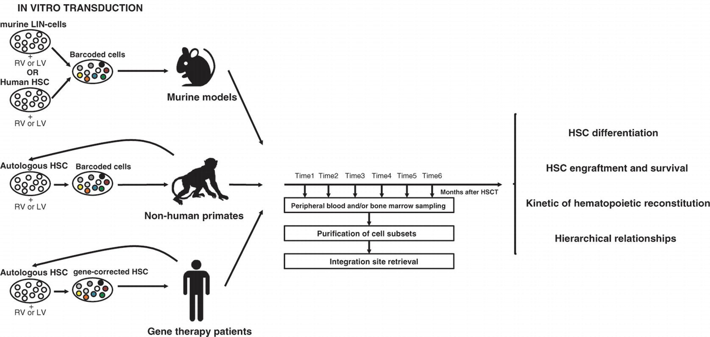

# Chapter 7. Biological Properties of Hematopoietic Stem Cells: Scientific Basis for Hematopoietic Cell Transplantation

> **Source:** Sureda A, Corbacioglu S, Greco R, Kröger N, Carreras E (eds). *The EBMT Handbook: Hematopoietic Cell Transplantation and Cellular Therapies*, 8th ed. Springer, Cham; 2024. pp. 57–66. https://doi.org/10.1007/978-3-031-44080-9_7  
> **Authors:** Aiuti, Alessandro; Scala, Serena; Chabannon, Christian  
>   - Aiuti, Alessandro: Vita-Salute San Raffaele University  
>   - Scala, Serena: San Raffaele Telethon Institute for Gene Therapy (SR-TIGET), IRCCS Ospedale San Raffaele  
>   - Chabannon, Christian: Université d’Aix-Marseille; Inserm CBT 1409, Centre d’Investigations Cliniques en Biothérapie  
> **License:** CC BY 4.0 (https://creativecommons.org/licenses/by/4.0/). Text reproduced verbatim from the open-access HTML edition; formatting converted to Markdown.

## Abstract

Hematopoiesis—from the Greek term for “blood making”—is the adaptive process by which mature and functional blood cells are continuously replaced over the entire lifetime of an individual. Erythrocytes, platelets, and the various subsets of leukocytes all have finite although different life spans. As a consequence, the daily production of red blood cells, platelets, and neutrophils under homeostatic conditions amounts to more than 300 billion cells.

## 7.1 Introduction

Hematopoiesis—from the Greek term for “blood making”—is the adaptive process by which mature and functional blood cells are continuously replaced over the entire lifetime of an individual. Erythrocytes, platelets, and the various subsets of leukocytes all have finite although different life spans. As a consequence, the daily production of red blood cells, platelets, and neutrophils under homeostatic conditions amounts to more than 300 billion cells.

In mammals, after the emergence of the first hematopoietic progenitors in extraembryonic structures such as the yolk sac in mice, cells of hematopoietic nature are first detected in the aorto–gonado–mesonephric (AGM) region of the developing embryo, where they derive from the endothelium (Costa et al. 2012; Yvernogeau et al. 2020; Zhu et al. 2020). The site of hematopoiesis then moves to the fetal liver and next to the bone marrow (BM) where it remains established until the death of the individual. In humans, extramedullary hematopoiesis denotes a myeloproliferative syndrome.

The considerable knowledge accumulated over more than a century of experimental hematology has led to the early understanding that all hematopoietic lineages derive from a small subpopulation of undifferentiated and self-renewing stem cells. Hematopoietic stem cells (HSCs) represent the most accurately explored model of somatic stem cells that are present in most if not all tissues and organs, contributing to tissue homeostasis and repair. The existence of a population of HSCs also has practical implications in terms of developing innovative therapies aiming at the definitive replacement or enhancement of a function in cells from one or several hematopoietic lineages, including the possibility of establishing durable hematopoietic chimerism in recipients of allogeneic hematopoietic cell transplantation (HCT).

## 7.2 Self-Renewal

A general property of stem cells is self-renewal, assuming that when these cells divide, at least one of the “daughter cells” fully recapitulates the biological properties of the “mother stem cell.” Self-renewal of the HSC population prevents exhaustion while the hematopoietic tissue proliferates and differentiates extensively under steady-state conditions to repair various damages. Demonstration of self-renewal at the clonal level remains an arduous task, even though high-throughput analytical tools have been developed. There is a growing body of evidence suggesting aging of the HSC population and decline of stem cell function with age (de Haan and Lazare 2018; Goodell and Rando 2015; Hammond et al. 2023). Appearance of “passenger mutations” in clonal hematopoiesis is one hallmark of aging (Cooper and Young 2017; Xie et al. 2014). Recent lines of evidence have suggested links between lifestyle and aging through direct or indirect mechanisms as well as opportunities for therapeutic interventions in order to slow the aging process (Kaastrup and Gronbaek 2021). The significance of such observations remains to be fully elucidated but obviously raises questions when it comes to soliciting elderly individuals to donate HSCs for the benefit of a related patient. Since increasing pieces of evidence suggest that younger age of the donors is associated with better overall survival, donor age has become an important variable in the selection of matched unrelated and haploidentical donors for allogeneic transplantation. However, it remains difficult to dissect the role of donor age in HSC functionality (i.e., hematopoietic and lymphoid reconstitution) vs. other graft components and variables influenced by age, which may impact engraftment, non-relapse mortality, and disease relapse (DeZern et al. 2021; Ciurea et al. 2020; Pruitt et al. 2023).

## 7.3 Commitment and Differentiation: New Data Challenge the Historical View of Hematopoietic Hierarchy

The traditional view of HSC differentiation is a hierarchical representation of an inverted tree, where discrete and homogeneous populations branch from one another, with successive restrictions in differentiation potentials. This oversimplifying view has been increasingly challenged by recent studies reporting on noninvasive genetic experiments and clonal analyses in mice (Busch and Rodewald 2016; Laurenti and Gottgens 2018). These studies suggest that hematopoietic differentiation uses different mechanisms under steady-state and stress conditions (Goyal and Zandstra 2015); however, both under steady-state conditions and in transplantation models, only a small fraction of HSCs contributes to long-term and stable reconstitution without compromising on the reestablishment of hematopoiesis (Hofer and Rodewald 2016; Schoedel et al. 2016), whereas most stem cells remain quiescent or proliferate infrequently. Single-cell transcriptional landscapes also suggest that differentiation occurs as a continuous rather than a discrete physiological process and that restriction of differentiation is not the result of a “symmetric split” between the myeloid and lymphoid compartments, as long believed by the phenotypic identification of “common myeloid progenitors” (CMPs) and “common lymphoid progenitors” (CLPs).

Commitment to one or several lineages, or conversely restriction in differentiation abilities, results from the expression of a controlled genetic and epigenetic program (Antoniani et al. 2017; Gottgens 2015; Pouzolles et al. 2016); these mechanisms remain partially understood and can thus only be partially harnessed for in vitro engineering of HSCs and their progeny (Rowe et al. 2016). Pathways vary during ontogeny, thus likely reflecting changes in these genetic and epigenetic programs (Keita et al. 2023). The fate of HSCs and their progeny is additionally regulated by extrinsic signals, among which hematopoietic growth factors and cytokines play an important role in survival, proliferation, and amplification (Kaushansky 2006). Experimental pieces of evidence also suggest that murine HSCs may directly sense external signals, such as from pathogens (Hysenaj et al. 2023).

## 7.4 The Bone Marrow Niches and Maintenance of Stemness

Recent years have witnessed considerable progress in our understanding of the organization and function of the bone marrow microenvironment (Fig. 7.1). HSCs establish interactions in the context of microanatomical organizations termed “niches.” Progress has been made both in understanding the heterogeneity of niches within successive hematopoietic sites and in identifying various categories of cells—either of non-hematopoietic or of hematopoietic origin—that interact with HSCs (Christodoulou et al. 2020). The various types of bone marrow niches closely associate with the neurovascular network that infiltrates the central bone marrow and the endosteal region. The nature of the signaling between these different cell populations is also increasingly deciphered and involves many pathways, with some of them unexpected at first (Calvi and Link 2015; Crane et al. 2017). Replicating some of these interactions in vitro is key to successful expansion or genetic engineering of isolated HSCs. Among the many molecular actors that govern interactions between HSCs and the various cells present in niches, the C-X-C motif chemokine 12 (CXCL12) and its most important receptor CXCR4 are of particular interest: direct or indirect modulation of this axis is clinically used to amplify the compartment of circulating stem cells that exist in low numbers under steady-state conditions (Crees et al. 2023).

**Fig. 7.1**

HSC properties and BM niche components

## 7.5 Preclinical Models of HCT

Most of the current knowledge on the biology of HSCs and on the therapeutic mechanisms of HCT derives from studies in animal models (Sykes and Scadden 2013; Eaves 2015). Classical murine transplantation studies have shown that single or few engrafting HSCs are sufficient and necessary to sustain long-term hematopoiesis in a reconstituted mouse. Human-in-mouse xenografts have become a fundamental tool to study hematopoietic dynamics upon HCT. The generation of immune-deficient mice bearing a deletion of the interleukin-2 receptor gamma chain on the nonobese diabetic/severe combined immunodeficiency (NOD/SCID) background (NSG mice) was instrumental for studying HSC homing, engraftment, lineage differentiation, and serial transplantation capacity. This model has been further modified by introducing human myeloid cytokine genes to increase myeloid differentiation (Doulatov et al. 2012) or loss-of-function mutation in the KIT receptor to efficiently support engraftment of human HSCs without the need for conditioning therapy (Cosgun et al. 2014). To overcome the lack of human components in the murine BM, humanized BM niche systems, which are based on human stromal cells implanted on a specific scaffold or directly injected with the extracellular matrix to generate BM micro-ossicles, have been recently developed (Di Maggio et al. 2011; Reinisch et al. 2016). These strategies provide novel tools to study the behavior of human HSCs in their physiological context and to dissect the role of the niche upon transplantation. However, homing and engraftment parameters in xenografts may be different from the natural setting and most HCT models follow recipient mice for few months after transplantations, thus making long-term outcome difficult to assess.

Dogs provide an ideal preclinical modeling system for HCT studies due to their large body size, life span, and high genetic diversity, which more appropriately recapitulate the human scenario. Preclinical canine modeling has been fundamental for the clinical translation of conditioning regimens and the importance of major histocompatibility complex (MHC) donor/recipient matching. However, the lack of canine reagents and the logistic difficulties of working with large animal models have precluded widespread availability (Stolfi et al. 2016). Autologous HCT in nonhuman primates (NHPs) is arguably the experimental model most closely resembling humans; their treatment conditions—including the use of CD34⁺ cells, mobilization, and conditioning regimens—all parallel those commonly used in human transplantation. Although ethical issues and costs are increasingly limiting their availability and use to selected centers, these animals are able to maintain long-term hematopoiesis up to several years after transplantation, thus allowing the study of HCT dynamics in a close-to-human manner (Koelle et al. 2017).

## 7.6 Gene Transfer/Gene Editing/Gene Therapy (GT) Targeting HSCs

Ex vivo HSC gene therapy (GT) is based on the genetic modification of autologous HSCs to correct monogenic disorders or to provide novel features to hematopoietic cells for treating infectious diseases or cancers (Naldini 2011) (Fig. 7.2). It is now well-established that HSCs can be efficiently gene modified to continuously produce a cell progeny expressing the therapeutic gene while maintaining the ability to engraft in the long term, for at least 15 years (Cicalese et al. 2016). According to a recent meta-analysis, more than 400 patients have received hematopoietic stem and progenitor cell (HSPC) GT for the treatment of 14 genetic diseases, in the context of 55 clinical trials (Tucci et al. 2022). The potential advantages of this approach over allogeneic HCT include the lack of graft-versus-host disease (GVHD) or rejection and the possibility of engineering HSCs in order to achieve a supraphysiological level of the corrected protein (Naldini 2011; Cicalese et al. 2016; Tucci et al. 2022; Aiuti and Naldini 2016). Despite robust and consistent results in terms of long-term durability, efficacy, and safety of the treatment, there are differences in terms of gene correction in the intended populations and BM-transduced cell chimerism. The gene engineering platform, the stem cell source, the disease background, and the conditioning regimen might account for some of these distinctions.

**Fig. 7.2**

Gene correction of HSCs for cell-based therapies

Currently, integrating vectors derived from retroviruses represent the most efficient platform for engineering HSCs and providing permanent and heritable gene correction. γ-Retroviral vectors (RVs) have been used in many clinical applications, including GT of inherited immunodeficiencies and cancer therapy, but the use of γ-RVs is associated with risks of insertional mutagenesis due to activation of proto-oncogenes, also depending on the disease type (Cicalese et al. 2016; Tucci et al. 2022). Self-inactivating (SIN) lentiviral vectors (LVs) are currently the tools of choice for most of the HSC GT applications, given their ability to transduce nondividing cells at higher efficiency, to carry larger and more complex gene cassettes, and to display a safer insertion site (IS) pattern in human HSCs (Naldini 2011; Locatelli et al. 2022; Scala et al. 2023). The recent development of designer endonucleases has led to the advent of gene targeting approaches. In contrast to viral vectors, which can mediate only one type of gene modification (gene addition), genome editing technologies can mediate gene addition, gene disruption, gene correction, and other targeted genome modifications (Dunbar et al. 2018; Ferrari et al. 2023). These strategies have the potential to overcome vector IS genotoxicity and to handle diseases due to dominant negative mutations and have started to enter clinical trials and practices (Frangoul et al. 2021). Despite the great promises, several challenges need to be addressed, including long-term clinical safety. Primitive, slow-cycling, human BM-derived HSCs are highly resistant to ex vivo manipulations required for gene targeting, and the current efficiency of gene editing by homology-directed repair into repopulating HSCs may not be suitable for clinical applications requiring high levels of correction (Dunbar et al. 2018; Kohn 2017).

In most cases, mobilized peripheral blood (MPB) has become the preferred HSC source for patients undergoing HCT and HSPC GT, also owing to the higher numbers of stem cells collected. Recent findings have shown that the use of MPB HSCs is associated not only with faster neutrophil and platelet reconstitution but also with an overall increased clonality of the engrafted HSCs (Scala et al. 2023) and that a better characterization of the HSPC compartments has been more informative than the total CD34⁺ cell dose.

Despite these progress, a collection of HSCs still present challenges under certain pathological conditions with low HSC content, heavily treated patients, or low-body-weight pediatric subjects. In vitro expansion protocols are an attractive strategy to increase the quality and/or the amount of transplantable HSCs. High-throughput screening of chemical compounds has resulted in the identification of at least two promising molecules, namely, StemRegenin1 and SR1 (Wagner Jr. et al. 2016), and the pyrimidoindole derivative UM171 (Dumont-Lagace et al. 2021; Fares et al. 2014), which are able to achieve great expansion of long-term repopulating HSCs. The ideal drug or combination has yet to be reported, although encouraging results paving the way for non-conditioned or non-genotoxic cell transplants or cellular therapies have been reported in mice (Wilkinson et al. 2019; Srikanthan et al. 2020; Omer-Javed et al. 2022).

## 7.7 Studying the Dynamics of Hematopoietic Reconstitution Upon HCT

Upon gene correction, each transduced cell and its progeny becomes univocally marked by a specific IS. The analysis of RV or LV IS has emerged as one of the most effective strategies for tracing the activity of genetically engineered hematopoietic cells directly in vivo in animal models and in GT-treated patients. Retrieving the IS from mature blood cells after HCT allowed studying the kinetics of blood cell production from individual stem cells within a heterogeneous population (Scala et al. 2023) (Fig. 7.3).

**Fig. 7.3**

Clonal tracking for studying the hematopoietic reconstitution dynamics upon HCT

In the murine setting, the finding that the vast majority of the ISs after transplantation were present in either lymphoid or myeloid cells with few ISs shared by both lineages led to the concept that murine HSCs are heterogeneous and already biased for their fate. The possibility of directly translating these models in human beings is currently under investigation (Lu et al. 2011; Yamamoto et al. 2013).

Clonal tracking studies in nonhuman primates have been pivotal in studying HCT dynamics in an experimental setting close to humans. The results of these works showed a common pattern of hematopoietic reconstitution upon transplantation: clonal fluctuation in the early phases post-HCT, potentially due to the initial contribution to the hematopoiesis of short-term unilineage progenitors, followed by a recovery of a stable hematopoietic output, likely related to the takeover of long-term multipotent HSC contribution. Thus, differently from murine studies, long-term HSCs are able to provide multilineage engraftment and there is no evidence of a predetermined lineage choice at the stem cell level in primates (Koelle et al. 2017; Kim et al. 2014). Additionally, NHPs have been useful in interrogating the effect of older HSCs in HCT, showing reduced multilineage output and clonality of the graft in aged vs. young animals (Yu et al. 2018).

To date, few cutting-edge studies have used IS retrieval from GT-treated patients, allowing, for the first time, to study the complexity of the hematopoietic system and hematopoietic reconstitution upon HCT in humans (Scala et al. 2023; Biasco et al. 2016; Scala et al. 2018; Wang et al. 2010). These studies showed that transplanted gene-repaired HSCs are able to engraft and generate a polyclonal multilineage output overtime. Longitudinal analyses allowed unveiling that unilineage clones active during the first 6 months after GT tend to be replaced by multilineage long-term clones, indicating HSC-derived activity. Finally, based on the number of ISs recaptured overtime, it has been estimated that about 1 in 10⁵–10⁶ infused gene-corrected cells have the potential to engraft in the long term. These approaches represent a prototypical example of the power of translational studies, providing information relevant to the human hematopoietic system, complementing and expanding the data derived from animal models.

Alternative approaches based on single-cell high-throughput analyses have also allowed to explore the dynamics of hematopoietic posttransplant reconstitution in human recipients and its relation to posttransplant clinical events (Huo et al. 2023).

## 7.8 From Experimental Hematology to Medical Practices and Hematopoietic Cellular Therapies

As already stressed in this brief review, a considerable amount of knowledge has been accumulated over years, thus allowing us to understand part of the mechanisms that control HSC behavior and take advantage of this knowledge; many of these observations have cross-fertilized other disciplines. However, a large gap persists between the technological sophistication of research tools and the rudimentary nature of clinical-grade reagents, devices, and laboratory tests. In clinical transplantation or even in the most modern forms of hematopoietic cellular therapies, stem cells remain identified as “CD34⁺ cells,” which can at best be considered as a gross approach to stemness; functional assays are limited to clonogenic cultures in routine practice; flow cytometry-activated cell sorting has barely entered the clinical field, and most cell selection procedures rely on immune selection with magnetic beads. Despite these limitations, and as can be seen from the content of the other chapters in this book, HCT remains the only example of a worldwide and widely used cell transplant procedure, with many of its underlying conceptual aspects and techniques being used to design innovative and highly personalized somatic cell therapy or gene therapy medicinal products (Chabannon et al. 2018).

## References

- Aiuti A, Naldini L. Safer conditioning for blood stem cell transplants. Nat Biotechnol. 2016;34(7):721–3.

- Antoniani C, Romano O, Miccio A. Concise review: epigenetic regulation of hematopoiesis: biological insights and therapeutic applications. Stem Cells Transl Med. 2017;6(12):2106–14.

- Biasco L, Pellin D, Scala S, Dionisio F, Basso-Ricci L, Leonardelli L, et al. In vivo tracking of human hematopoiesis reveals patterns of clonal dynamics during early and steady-state reconstitution phases. Cell Stem Cell. 2016;19(1):107–19.

- Busch K, Rodewald HR. Unperturbed vs. post-transplantation hematopoiesis: both in vivo but different. Curr Opin Hematol. 2016;23(4):295–303.

- Calvi LM, Link DC. The hematopoietic stem cell niche in homeostasis and disease. Blood. 2015;126(22):2443–51.

- Chabannon C, Kuball J, Bondanza A, Dazzi F, Pedrazzoli P, Toubert A, et al. Hematopoietic stem cell transplantation in its 60s: a platform for cellular therapies. Sci Transl Med. 2018;10(436):eaap9630.

- Christodoulou C, Spencer JA, Yeh SA, Turcotte R, Kokkaliaris KD, Panero R, et al. Live-animal imaging of native haematopoietic stem and progenitor cells. Nature. 2020;578(7794):278–83.

- Cicalese MP, Ferrua F, Castagnaro L, Pajno R, Barzaghi F, Giannelli S, et al. Update on the safety and efficacy of retroviral gene therapy for immunodeficiency due to adenosine deaminase deficiency. Blood. 2016;128(1):45–54.

- Ciurea SO, Al Malki MM, Kongtim PK, Fuchs EJ, Luznik L, et al. The European Society for Blood and Marrow Transplantation (EBMT) consensus recommendations for donor selection in haploidentical hematopoietic cell transplantation. Bone Marrow Transplant. 2020;55:12–24.

- Cooper JN, Young NS. Clonality in context: hematopoietic clones in their marrow environment. Blood. 2017;130(22):2363–72.

- Cosgun KN, Rahmig S, Mende N, Reinke S, Hauber I, Schafer C, et al. Kit regulates HSC engraftment across the human-mouse species barrier. Cell Stem Cell. 2014;15(2):227–38.

- Costa G, Kouskoff V, Lacaud G. Origin of blood cells and HSC production in the embryo. Trends Immunol. 2012;33(5):215–23.

- Crane GM, Jeffery E, Morrison SJ. Adult haematopoietic stem cell niches. Nat Rev Immunol. 2017;17(9):573–90.

- Crees ZD, Rettig MP, Jayasinghe RG, Stockerl-Goldstein K, Larson SM, Arpad I, et al. Motixafortide and G-CSF to mobilize hematopoietic stem cells for autologous transplantation in multiple myeloma: a randomized phase 3 trial. Nat Med. 2023;29(4):869–79.

- de Haan G, Lazare SS. Aging of hematopoietic stem cells. Blood. 2018;131(5):479–87.

- DeZern AE, Franklin C, Tsai H, Hollingsworth Imus P, Cooke KR, et al. Relationship of donor age and relationship to outcomes of haploidentical transplantation with posttransplant cyclophosphamide. Blood Adv. 2021;5(5):1360–8.

- Di Maggio N, Piccinini E, Jaworski M, Trumpp A, Wendt DJ, Martin I. Toward modeling the bone marrow niche using scaffold-based 3D culture systems. Biomaterials. 2011;32(2):321–9.

- Doulatov S, Notta F, Laurenti E, Dick JE. Hematopoiesis: a human perspective. Cell Stem Cell. 2012;10(2):120–36.

- Dumont-Lagace M, Li Q, Tanguay M, Chagraoui J, Kientega T, Cardin GB, et al. UM171-expanded cord blood transplants support robust T cell reconstitution with low rates of severe infections. Transplant Cell Ther. 2021;27(1):76:e1–9.

- Dunbar CE, High KA, Joung JK, Kohn DB, Ozawa K, Sadelain M. Gene therapy comes of age. Science. 2018;359:6372.

- Eaves CJ. Hematopoietic stem cells: concepts, definitions, and the new reality. Blood. 2015;125(17):2605–13.

- Fares I, Chagraoui J, Gareau Y, Gingras S, Ruel R, Mayotte N, et al. Cord blood expansion. Pyrimidoindole derivatives are agonists of human hematopoietic stem cell self-renewal. Science. 2014;345(6203):1509–12.

- Ferrari S, Valeri E, Conti A, Scala S, Aprile A, Di Micco R, et al. Genetic engineering meets hematopoietic stem cell biology for next-generation gene therapy. Cell Stem Cell. 2023;30(5):549–70.

- Frangoul H, Altshuler D, Cappellini MD, Chen YS, Domm J, Eustace BK, et al. CRISPR-Cas9 gene editing for sickle cell disease and beta-thalassemia. N Engl J Med. 2021;384(3):252–60.

- Goodell MA, Rando TA. Stem cells and healthy aging. Science. 2015;350(6265):1199–204.

- Gottgens B. Regulatory network control of blood stem cells. Blood. 2015;125(17):2614–20.

- Goyal S, Zandstra PW. Stem cells: chasing blood. Nature. 2015;518(7540):488–90.

- Hammond CA, Wu SW, Wang F, MacAldaz ME, Eaves CJ. Aging alters the cell cycle control and mitogenic signaling responses of human hematopoietic stem cells. Blood. 2023;141(16):1990–2002.

- Hofer T, Rodewald HR. Output without input: the lifelong productivity of hematopoietic stem cells. Curr Opin Cell Biol. 2016;43:69–77.

- Huo Y, Wu L, Pang A, Li Q, Hong F, Zhu C, et al. Single-cell dissection of human hematopoietic reconstitution after allogeneic hematopoietic stem cell transplantation. Sci Immunol. 2023;8(81):eabn6429.

- Hysenaj L, de Laval B, Arce-Gorvel V, Bosilkovski M, Gonzalez-Espinoza G, Debroas G, et al. CD150-dependent hematopoietic stem cell sensing of Brucella instructs myeloid commitment. J Exp Med. 2023;220(7):e20210567.

- Kaastrup K, Gronbaek K. The impact of sedentary lifestyle, High-fat diet, tobacco smoke, and alcohol intake on the hematopoietic stem cell niches. Hemasphere. 2021;5(8):e615.

- Kaushansky K. Lineage-specific hematopoietic growth factors. N Engl J Med. 2006;354(19):2034–45.

- Keita S, Diop S, Lekiashvili S, Chabaane E, Nelson E, Strullu M, et al. Distinct subsets of multi-lymphoid progenitors support ontogeny-related changes in human lymphopoiesis. Cell Rep. 2023;42(6):112618.

- Kim S, Kim N, Presson AP, Metzger ME, Bonifacino AC, Sehl M, et al. Dynamics of HSPC repopulation in nonhuman primates revealed by a decade-long clonal-tracking study. Cell Stem Cell. 2014;14(4):473–85.

- Koelle SJ, Espinoza DA, Wu C, Xu J, Lu R, Li B, et al. Quantitative stability of hematopoietic stem and progenitor cell clonal output in rhesus macaques receiving transplants. Blood. 2017;129(11):1448–57.

- Kohn DB. Historical perspective on the current renaissance for hematopoietic stem cell gene therapy. Hematol Oncol Clin North Am. 2017;31(5):721–35.

- Laurenti E, Gottgens B. From haematopoietic stem cells to complex differentiation landscapes. Nature. 2018;553(7689):418–26.

- Locatelli F, Thompson AA, Kwiatkowski JL, Porter JB, Thrasher AJ, Hongeng S, et al. Betibeglogene Autotemcel gene therapy for non-beta(0)/beta(0) genotype beta-thalassemia. N Engl J Med. 2022;386(5):415–27.

- Lu R, Neff NF, Quake SR, Weissman IL. Tracking single hematopoietic stem cells in vivo using high-throughput sequencing in conjunction with viral genetic barcoding. Nat Biotechnol. 2011;29(10):928–33.

- Naldini L. Ex vivo gene transfer and correction for cell-based therapies. Nat Rev Genet. 2011;12(5):301–15.

- Omer-Javed A, Pedrazzani G, Albano L, Ghaus S, Latroche C, Manzi M, et al. Mobilization-based chemotherapy-free engraftment of gene-edited human hematopoietic stem cells. Cell. 2022;185:2248–2264.e2.

- Pouzolles M, Oburoglu L, Taylor N, Zimmermann VS. Hematopoietic stem cell lineage specification. Curr Opin Hematol. 2016;23(4):311–7.

- Pruitt A, Gao F, De Togni E, et al. Impact of donor age and relationship on outcomes of peripheral blood haploidentical hematopoietic cell transplantation. Bone Marrow Transplant. 2023;58:855–62.

- Reinisch A, Thomas D, Corces MR, Zhang X, Gratzinger D, Hong WJ, et al. A humanized bone marrow ossicle xenotransplantation model enables improved engraftment of healthy and leukemic human hematopoietic cells. Nat Med. 2016;22(7):812–21.

- Rowe RG, Mandelbaum J, Zon LI, Daley GQ. Engineering hematopoietic stem cells: lessons from development. Cell Stem Cell. 2016;18(6):707–20.

- Scala S, Basso-Ricci L, Dionisio F, Pellin D, Giannelli S, Salerio FA, et al. Dynamics of genetically engineered hematopoietic stem and progenitor cells after autologous transplantation in humans. Nat Med. 2018;24(11):1683–90.

- Scala S, Ferrua F, Basso-Ricci L, Dionisio F, Omrani M, Quaranta P, et al. Hematopoietic reconstitution dynamics of mobilized- and bone marrow-derived human hematopoietic stem cells after gene therapy. Nat Commun. 2023;14(1):3068.

- Schoedel KB, Morcos MNF, Zerjatke T, Roeder I, Grinenko T, Voehringer D, et al. The bulk of the hematopoietic stem cell population is dispensable for murine steady-state and stress hematopoiesis. Blood. 2016;128(19):2285–96.

- Srikanthan AM, Humbert O, Haworth KG, Ironside C, Rajawat YS, Blazar BR, et al. Effective multi-lineage engraftment in a mouse model of Fanconi anemia using non-genotoxic antibody-based conditioning. Mol Ther Methods Clin Dev. 2020;17:455–64.

- Stolfi JL, Pai CC, Murphy WJ. Preclinical modeling of hematopoietic stem cell transplantation—advantages and limitations. FEBS J. 2016;283(9):1595–606.

- Sykes SM, Scadden DT. Modeling human hematopoietic stem cell biology in the mouse. Semin Hematol. 2013;50(2):92–100.

- Tucci F, Galimberti S, Naldini L, Aiuti A. Gene therapy with hematopoietic stem and progenitor cell for monogenic disorders : a systematic review and meta-analysis. Nat Commun. 2022;13(1):1315.

- Wagner JE Jr, Brunstein CG, Boitano AE, DeFor TE, McKenna D, Sumstad D, et al. Phase I/II trial of StemRegenin-1 expanded umbilical cord blood hematopoietic stem cells supports testing as a stand-alone graft. Cell Stem Cell. 2016;18(1):144–55.

- Wang GP, Berry CC, Malani N, Leboulch P, Fischer A, Hacein-Bey-Abina S, et al. Dynamics of gene-modified progenitor cells analyzed by tracking retroviral integration sites in a human SCID-X1 gene therapy trial. Blood. 2010;115(22):4356–66.

- Wilkinson AC, Ishida R, Kikuchi M, Sudo K, Morita M, Crisostomo RV, et al. Long-term ex vivo haematopoietic-stem-cell expansion allows nonconditioned transplantation. Nature. 2019;571(7763):117–21.

- Xie M, Lu C, Wang J, McLellan MD, Johnson KJ, Wendl MC, et al. Age-related mutations associated with clonal hematopoietic expansion and malignancies. Nat Med. 2014;20(12):1472–8.

- Yamamoto R, Morita Y, Ooehara J, Hamanaka S, Onodera M, Rudolph KL, et al. Clonal analysis unveils self-renewing lineage-restricted progenitors generated directly from hematopoietic stem cells. Cell. 2013;154(5):1112–26.

- Yu K, Espinoza DA, Wu C, Truitt L, Shin T, et al. The impact of aging on primate hematopoiesis as interrogated by clonal tracking. Blood. 2018;131:1195–205.

- Yvernogeau L, Klaus A, Maas J, Morin-Poulard I, Weijts B, Schulte-Merker S, et al. Multispecies RNA tomography reveals regulators of hematopoietic stem cell birth in the embryonic aorta. Blood. 2020;136(7):831–44.

- Zhu Q, Gao P, Tober J, Bennett L, Chen C, Uzun Y, et al. Developmental trajectory of prehematopoietic stem cell formation from endothelium. Blood. 2020;136(7):845–56.
