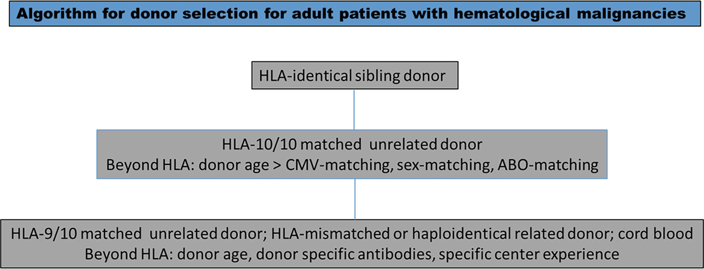

# Chapter 12. Donor Selection for Adults and Pediatrics

> **Source:** Sureda A, Corbacioglu S, Greco R, Kröger N, Carreras E (eds). *The EBMT Handbook: Hematopoietic Cell Transplantation and Cellular Therapies*, 8th ed. Springer, Cham; 2024. pp. 111–123. https://doi.org/10.1007/978-3-031-44080-9_12  
> **Authors:** Ayuk, Francis; Balduzzi, Adriana; Worel, Nina  
>   - Ayuk, Francis: University Medical Center Hamburg-Eppendorf (UKE)  
>   - Balduzzi, Adriana: Fondazione IRCCS San Gerardo dei Tintori; Milano-Bicocca University  
>   - Worel, Nina: Medical University of Vienna  
> **License:** CC BY 4.0 (https://creativecommons.org/licenses/by/4.0/). Text reproduced verbatim from the open-access HTML edition; formatting converted to Markdown.

## Abstract

It is known that multiple factors impact transplantation outcome; the heaviest ones are disease-related (disease refractoriness, phase, clonal abnormalities, etc. in malignancies and disease type and associated rejection risk in nonmalignant diseases) and patient-related (age, comorbidities, infectious diseases/colonization, etc.). Moreover, donor-related issues and stem cell source may influence the extent of disease control and transplant-related mortality.

## 12.1 Introduction

The availability of a suitable stem cell graft is an absolute prerequisite for the performance of allo-hematopoietic cell transplantation (HCT). Beyond donor–recipient histocompatibility, other factors such as stem cell source, donor age and gender, donor–recipient cytomegalovirus (CMV) status, and ABO compatibility, besides the stem cell dose contained in the graft, may play a role in transplant outcome.

In this chapter, we discuss the results of studies investigating these factors and conclude with an algorithm for donor selection. Issues peculiar to pediatric recipients are also analyzed and discussed.

## 12.2 Donor Human Leukocyte Antigen (HLA) Compatibility (See Chap. *9*)

The outcome of HCT depends in part on the matching between the donor and the recipient for the human leukocyte antigens (HLAs), encoded by a group of genes on chromosome 6; genes and products are labeled the major histocompatibility complex (MHC). The HLA system is the most polymorphic genetic region known in the human genome. A set of HLA gene alleles, called haplotypes, is inherited from each parent; therefore, the probability that a child inherits and shares both parental haplotypes with a full sibling is 25%. Such an HLA-identical sibling is still considered an optimal donor.

The most relevant genes for transplantation belong to class I (HLA-A, HLA-B, and HLA-Cw) and class II (HLA-DR, HLA-DQ, and HLA-DP). HLA compatibility with the donor is usually defined by high-resolution typing (4 digits) for 10 alleles, HLA-A, HLA-B, HLA-C, HLA-DR, and HLA-DQ (Petersdorf 2013), even though there is increasing evidence supporting the relevance of DPB1 matching (reviewed by Fleischhauer and Shaw (2017)).

The concept of “compatibility” between cord blood (CB) donor–recipient pairs is still under debate. In the past, any CB unit, which was 6/6 or 5/6 matched was considered HLA-compatible (matched donor (MD)), as defined by low-resolution typing at the A and B loci and high-resolution typing at the DRB1 locus; more recently, a high resolution for at least A, B, C, and DRB1 loci has been requested and, progressively, the same criteria used for volunteer donors are considered to define CB HLA matching (Eapen et al. 2017).

## 12.3 Donor Selection for Adult Patients

### 12.3.1 Donor Type

#### 12.3.1.1 Matched Related Siblings and Unrelated Donors (URDs)

Donor–recipient histocompatibility is one of the key variables in allo-HCT. An HLA-identical sibling donor is generally considered the best donor for allo-HCT; however, less than a third of patients will have one available, with the proportion varying mainly according to family size. The algorithm for donor selection is described in Fig. 12.1.

**Fig. 12.1**

The algorithm for donor selection

Unrelated donor registries worldwide now include more than about 41 million volunteer donors, with most of them in North America and Europe ( *www.bmdw.org*). The probability of finding a fully matched unrelated donor (MUD) (8/8 or 10/10) varies on average between 16% and 75% (Gragert et al. 2014; Buck et al. 2016) depending on ethnicity, with the lowest and highest probabilities in patients of African and European descent, respectively. Over time, increasing ethnic diversity will further limit the chances of finding a fully matched unrelated donor.

Till date, no randomized trial has compared the outcome of transplants from different donors. However, one prospective analysis (Yakoub-Agha et al. 2006) and several retrospective analyses indicate that outcomes after matched sibling donor (MSD) and fully MUD (8/8 or 10/10) HCT are comparable (Schetelig et al. 2008; Szydlo et al. 1997; Arora et al. 2009; Gupta et al. 2010; Woolfrey et al. 2010; Saber et al. 2012). Increase in donor–recipient HLA disparity in HLA-A, HLA-B, HLA-C, or HLA-DRB1 is associated with poorer outcome after unrelated donor transplantation (Lee et al. 2007; Shaw et al. 2010; Woolfrey et al. 2011; Horan et al. 2012; Fürst et al. 2013; Pidala et al. 2014; Verneris et al. 2015). The overall decrease in survival can be explained by the increase in non-relapse mortality (NRM) with no positive effect on relapse. Disparities in HLA-DQB1 and C-allele disparities in C\*03:03 vs. 03:04 have been reported to be permissive with no negative effects on outcome (Lee et al. 2007; Fürst et al. 2013; Morishima et al. 2015; Pidala et al. 2014; Crivello et al. 2016). Disparities in HLA-DPB1 are observed in the majority of HLA-A, HLA-B, HLA-C, and HLA-DQB1 (10/10) MUD transplants. Nonpermissive mismatches in DPB1 defined according to T-cell epitope matching (Zino et al. 2004; Crocchiolo et al. 2009; Fleischhauer et al. 2012; Pidala et al. 2014; Oran et al. 2018), allele cell surface expression levels (Petersdorf et al. 2015), or a combination of both (Ruggeri et al. 2023) are associated with poorer outcome compared to full matches or permissive mismatches. Associations of permissive DPB1 mismatches with a lower relapse incidence are currently being explored (Fleischhauer and Beelen 2016; Fleischhauer and Shaw 2017) and have been demonstrated in a recent large retrospective study (Ruggeri et al. 2023).

In HLA-mismatched unrelated donor transplantations, recent data have shown that outcome depends on the HLA-mismatched locus and HLA-B leader dimorphism, indicating that the success of HLA-mismatched unrelated transplantation might be enhanced through the judicious selection of mismatched donors (Petersdorf et al. 2020). Similar findings have subsequently been reported for haploidentical related donor and cord blood transplantations (Fuchs et al. 2022; Petersdorf et al. 2021).

The impact of the killer immunoglobulin-like receptor (KIR) ligand on the outcome, especially disease relapse, has been mostly reported for HLA-mismatched transplantations (Ruggeri et al. 2002; Hsu et al. 2006; Cooley et al. 2014). More recent data have also shown that natural killer (NK) cell reactivity may still affect the outcome in the era of posttransplant cyclophosphamide (Solomon et al. 2018; Wanquet et al. 2018). The NKG2D (natural killer group 2, member D) axis has also been explored and holds promise for further improvement of patient selection (Petersdorf et al. 2023).

#### 12.3.1.2 Haploidentical Related Donors

Improvements in transplant technology, including pretransplant anti-T-cell globulin (ATG) (Huang et al. 2006), posttransplant cyclophosphamide (PT-CY) (Luznik et al. 2008), and α/β T-cell depletion (TCD) (Bertaina et al. 2014), have led to improved outcome and rapidly increasing use of haploidentical related donor transplantation (Passweg et al. 2014). Several retrospective comparison studies have reported a similar outcome for haploidentical and MUD transplants (summarized by Fuchs 2017). The results of prospective comparative trials are eagerly awaited. Selection of an optimal haploidentical donor also takes into account HLA-mismatched loci, including B-leader, NK reactivity, and the other non-HLA factors described below.

### 12.3.2 The Role of Non-HLA Donor Characteristics

Besides donor–recipient histocompatibility, donor age is now considered the most relevant non-HLA donor characteristic in unrelated donor HCT (Kollman et al. 2001, 2016; Wang et al. 2018) with a 2-year survival being 3% better when a donor 10 years younger is selected (Shaw et al. 2018). These findings have impacted daily practice to the extent that the percentage of selected donors under 30 years of age has increased from 36% in the period 1988–2006 to 51% in 1999–2011 up to 69% in 2012–2014 (Kollman et al. 2016). There is accumulating evidence that transplantation with grafts from younger matched unrelated donors may even lead to improved outcomes compared to older matched related donors (Kröger et al. 2013; Guru Murthy et al. 2022). This also seems to hold true for haploidentical HCT, at least for patients over 40 years of age (Canaani et al. 2018).

Matching for patient/recipient CMV serostatus also seems to be a determinant of transplant outcome, with the best outcome seen in seronegative patients receiving seronegative grafts (Ljungman 2014; Kalra et al. 2016; Shaw et al. 2017). How recent improvements in CMV prophylaxis and treatment will impact the relevance of CMV in donor selection remains to be defined.

The impact of sex mismatch on outcome is more controversial, possibly reflecting different definitions of sex mismatch, which has been considered for only male recipients (Gratwohl et al. 2009, 2017; Nakasone et al. 2015) or for both male and female in other reports (Kollman et al. 2016). Interestingly, all three studies confining sex mismatch to male recipients reported a significant impact for this variable, albeit possibly dependent on the conditioning regimen.

The impact of ABO (blood group) compatibility on outcome has been reported to be modest and seems to have further diminished in recent years probably due to changes in transplant practice, including the less frequent use of bone marrow (BM) grafts (Seebach et al. 2005; Kollman et al. 2016; Shaw et al. 2018). Nevertheless, the use of peripheral blood (PB) instead of BM eliminates ABO incompatibility infusion-related issues but does not prevent possible ABO-incompatibility related-issues in the posttransplant course, with the occurrence of delayed hemolysis, delayed erythropoiesis, and pure red cell aplasia (Balduzzi et al. 2021).

The impact of non-HLA donor characteristics may be less conspicuous in matched and mismatched related donor transplantations using PT-CY. It must, however, be taken into consideration that the close association between donor age and donor–patient relation, on the one hand, with patient age, on the other hand, makes these analyses more complex (McCurdy et al. 2018; Robinson et al. 2018). Larger patient cohorts and prospective studies are required for more definite conclusions.

### 12.3.3 Donor Choice According to Stem Cell Source

The three graft sources for allo-HCT are BM, PB stem cells (PBSCs), and CB. In matched related donor and unrelated donor HCT, survival outcome is similar for both BM and PBSCs. However, hematological recovery is more rapid and graft rejection less frequent after PB compared to BM HCT, whereas the incidence of chronic graft-versus-host disease (cGvHD) and, to a lesser extent, acute GvHD tends to be higher after PB HCT (Bensinger et al. 2001; Couban et al. 2002; Schmitz et al. 2002; Couban et al. 2016; Anasetti et al. 2012). In allo-HCT for nonmalignant diseases, in particular for severe aplastic anemia (SAA), BM is still the preferred stem cell source in high-income countries, despite improvements in outcome after PB HCT (Schrezenmeier et al. 2007; Chu et al. 2011; Bacigalupo et al. 2012; Kumar et al. 2016).

Traditionally, BM has been used as a stem cell source for haploidentical HCT with PT-CY (Luznik et al. 2008), whereas granulocyte colony-stimulating factor (G-CSF)-stimulated BM has been used for haploidentical HCT with ATG (Huang et al. 2006) and PBSCs for haploidentical HCT with α/β T-cell depletion (Bertaina et al. 2014). There are no prospective studies comparing different stem cell sources within these strategies. When PT-CY is used, PBSCs seem to be associated with a higher risk of acute and chronic GvHD and a lower risk of relapse in patients with leukemia (Bashey et al. 2017).

The use of umbilical CB grafts continues to decrease with the rise in the numbers of haploidentical transplants performed (Passweg et al. 2023). Due to the limited number of stem cells per unit, CB grafts have been more frequently used in pediatric HCT and will be discussed in the specific CB chapter.

### 12.3.4 Anti-HLA Antibodies

The abovementioned improvements in transplant technology have led to an increased use of grafts from HLA-mismatched donors. Detection of donor-specific anti-HLA antibodies in the patients’ serum has been associated with an increased risk of graft failure and also poorer survival of those patients with graft failure (Ciurea et al. 2015) after haploidentical HCT. The risk of graft failure and overall mortality may however also depend on the type and intensity of TCD used. The European Society for Blood and Marrow Transplantation (EBMT) has recently published a consensus guideline on detection and treatment of donor-specific antibodies in haploidentical HCT (Ciurea et al. 2018).

## 12.4 Donor Selection for Pediatric Patients

Donor selection criteria may vary between adult and pediatric recipients. According to the “motto” of the Pediatric Disease Working Party, “children are not small adults;” besides the size, what makes HCT in children different is mainly related to indications and the biology of a growing individual.

The most frequent indication for transplantation in children is acute leukemia, but a growing proportion of transplanted children is affected with nonmalignant disorders (NMDs), mainly inherited diseases.

### 12.4.1 Pediatric Recipient Size

In terms of size, the recipient weight may vary from few kilograms in most patients transplanted for immunodeficiencies to a full adult size in some adolescents. The recommended cell dose in the graft is shown in Table 12.1 (Gluckmann 2012). The lower the recipient weight, the smaller is the amount of the requested absolute total nucleated cell and stem cell count in the graft, which makes the harvest easier, often matching the transplant center requests. An appropriate cell dose in the graft yields a lower risk of rejection, which is actually the lowest in pediatrics. On the other hand, the lower amount of cells requested to ensure engraftment in children makes CB a more valuable source than in adults.

**Table 12.1 Number of cells according to stem cell source**

|                      | Volume collected | Med CD34 content                    | Med CD3 content         | Target cell dose                          |
|----------------------|------------------|-------------------------------------|-------------------------|-------------------------------------------|
| Bone marrow          | 10–20 mL/kg      | 2–3 × 106/kga | 25 × 106/kg  | \>2 × 108 TNC/kg               |
| Peripheral blood     | 150–400 mL       | 8 × 106/kg               | 250 × 106/kg | 5–10 × 106 CD34+/kg |
| Umbilical cord blood | 80–160 mL        | 0.2 × 106/kg             | 2.5 × 106/kg | \>3 × 107 TNC/kg               |

1.  aPer kilogram recipient body weight

### 12.4.2 Indications

In terms of indications, according to the most recent EBMT survey, out of the 2920 children and young adults younger than 18 years transplanted in 2021, the main indications for allogeneic HCT were acute leukemias (48%), followed by NMDs (46%), with primary immunodeficiencies representing 37% of them (Passweg et al. 2023).

As NMDs, mainly inherited disorders, namely, immunodeficiencies, hemoglobinopathies, inborn errors of metabolism, and congenital bone marrow failures, do not benefit from any alloreactivity, the closest HLA matching (possibly “10 out of 10” HLA alleles) is recommended. On the contrary, a small degree of HLA incompatibility is tolerated in malignancies, as the detrimental effect of HLA disparity, triggering a higher risk of GvHD and consequent higher risks of toxicity and mortality, might be counterbalanced by the so-called “graft-versus-leukemia (GVL)” or “graft-versus-tumor” effect, which is the alloreactivity of immunocompetent donor cells potentially eradicating residual malignant cells in the patient and playing a role in the prevention of malignant disease recurrence.

### 12.4.3 Donor Type

Due to the decreasing size of modern families in the so-called Western countries, HLA-identical siblings are available for less than 25% of the children in need of a transplant, as shown by the few studies performing a “randomization by genetic chance,” based on the availability of an HLA-identical sibling or not (Balduzzi et al. 2005). As a consequence, 75% of the patients may need to run a search for an unrelated donor.

In the Acute Lymphoblastic Leukemia-Stem Cell Transplantation-Berlin–Frankfurt–Muenster 2003 (ALL-SCT- BFM 2003) and ALL-SCT-International BFM 2007 (ALL-SCT-I-BFM 2007) studies, out of 569 very-high-risk ALL patients, eligible for HCT from any donor, a total of 106 patients (26%) were transplanted from a mismatched donor (MMD), mainly haploidentical. The 4-year NRM was higher for patients transplanted from MMD (23 ± 4% versus 9 ± 1%, *p* \< 0.001). In multivariate analysis, MMD grafts were detrimental in terms of OS, event-free survival (EFS), and NRM.

More recently, in the aforementioned EBMT survey (Passweg et al. 2023), donors for pediatric recipients transplanted in 2021 were unrelated in 54% and related in 46% of the cases, with haploidentical grafts being 42% of the latter ones. In terms of stem cell source, BM was used as the stem cell source in 48% of the patients, whereas PBSCs were used in 47% and CB was used in 140 pediatric patients, 84% of which were unrelated.

The eligibility criteria for HCT in malignant diseases vary overtime, resulting from the balance between the outcome of frontline and relapse chemotherapy protocols and the outcome of transplantation, which partially depends on the degree of compatibility within each donor–recipient pair. Similarly, the eligibility for transplantation in NMD increased as the safety profile of the procedure improved. Some patients are considered eligible for transplantation only in case an HLA-identical sibling is available; as the risk profile of the patient worsens, a broader degree of HLA mismatching is considered acceptable.

Within the International BFM (I-BFM) Study Group, focusing on pediatric malignancies, regardless of their relationship with their recipient, donors are defined as HLA-matched (MD) if the donor–recipient pairs are fully matched (10/10) or have a single allelic or antigenic disparity (9/10) or are defined as a mismatched donor (MMD) if the donor–recipient pairs have two (8/10) or more allelic or antigenic disparities, up to a different haplotype (Peters et al. 2015). Any donor who is not an HLA-identical sibling or an MD, as defined above, is considered an MMD. Both MD and MMD could be either related or unrelated to their recipient. A related donor who is not an HLA-identical sibling is actually regarded as an MD, and GvHD prophylaxis is planned accordingly (Peters et al. 2015).

Results from a BFM study and an I-BFM prospective study showed that transplantation from a “10 or 9 out of 10” matched donor, either related or unrelated, was not inferior to transplantation from an HLA-identical sibling in terms of EFS, OS, and cumulative incidence of relapse (CIR) in pediatric patients with ALL (Peters et al. 2015; Balduzzi et al. 2019). As a consequence, the eligibility criteria for HCT might be reviewed and extended to those for MSD HCT, at least in ALL, and, possibly, considered for other malignant diseases. Therefore, an unrelated donor search activation and transplantation might be recommended in the future virtually for every child for whom an allo-HCT is indicated and disparities within donor–recipient pairs can be progressively accepted as the risk profile of the patient increases.

Unfortunately, some inherited disorders, in particular sickle cell disease (Gluckman et al. 2017) or other recessively inherited disease, the incidence of which is highly increased by a parental blood relation, have higher incidences in non-Caucasian ethnicities, which are less represented within stem cell donor banks. The consequence is that well-matched donors often lack when a perfect matching is crucial; progresses in haploidentical HCT progressively broadened its indications and may overcome this issue (de la Fuente et al. 2020).

Depending on each transplant center experience, MMD might be preferred, carrying the advantage of prompt donor availability and flexible schedules and bringing about higher degrees of alloreactivity, potentially associated with a lower relapse risk. HCT from MMD is widely recommended when timing adjustment is crucial, as in an advanced disease phase in malignancies and in case of posttransplant relapse.

### 12.4.4 Haploidentical Donors in Pediatrics

Successful haploidentical HCT has mainly evolved in pediatrics over the last two decades from ex vivo T-cell depletion by CD34⁺-positive selection, to CD34⁺-negative selection, up to selective CD3 αβ depletion, to allow other cells in the graft, potentially protecting from viral infections (Handgretinger et al. 2001; Klingebiel et al. 2010). In pediatrics, an improved immune recovery after T-cell receptor (TCR) αβ-depleted haploidentical HCT (Lang et al. 2015), a similar outcome between TCR αβ-depleted and matched sibling and matched unrelated donor HCT in children with acute leukemia (Locatelli et al. 2017) and in NMD, (Bertaina et al. 2014), has been recently reported and confirmed by a multicenter phase I/II study (Lang et al. 2017). Moreover, some reports of PT-CY in pediatric patients show promising results (Jaiswal et al. 2016; Sawada et al. 2014; Wiebking et al. 2017; Fierro-Pineda et al. 2023).

One of the parents mostly serves as a donor in haploidentical donors for pediatric recipients. The choice between the mother and the father is still debated. Better survival was shown in patients transplanted from the mother than from the father (51% vs. 11%; *P* \< 0.001), due to both reduced incidence of relapse and transplant-related mortality (TRM), with a protective effect on the risk of failure (hazards ratio (HR) 0.42; *P* = 0.003), possibly explained by transplacental leukocyte trafficking during pregnancy, inducing long-term, stable, reciprocal microchimerism in both the mother and child (Stern et al. 2008).

As donor-derived alloreactive NK cells have been shown to play a key role in the eradication of leukemic cells, favorable NK matching should guide donor selection (Stringaris and Barrett 2017; Mavers and Bertaina 2018). Moreover, anti-HLA antibodies should be checked and accounted for to guide donor selection.

### 12.4.5 Stem Cell Source

BM is usually recommended as a stem cell source. A donor with a body weight allowing for a graft containing at least 3 × 10⁸ nucleated cells/kg recipient body weight and 3 × 10⁶ CD34⁺ cells/kg body weight should be selected, in order to yield more than 95% neutrophil engraftment chances at a median of 21 days in the setting of hematological malignant diseases (Simonin et al. 2017).

It is rare in pediatrics to require PB just in order to obtain an adequate amount of cells to ensure engraftment, as the absolute cell dose needed rarely overcomes the maximum amount, which could be harvested from a donor. As higher numbers of CD3 cells are obtained in PB grafts, it is recommended not to exceed an amount of 10 × 10⁸ CD3⁺ cells/kg recipient body weight.

The increased risk of chronic, and possibly acute, GvHD after PBSC transplantation, as compared to BM, is commonly reported. In a recent European retrospective study, including 2584 pediatric patients transplanted from 2003 to 2012 for ALL, both TRM and chronic GvHD have appeared to be significantly higher after PBSCs, as compared with other stem cell (SC) sources, despite the similarity of the overall survival for both stem cell sources (Simonin et al. 2017). In the prospective ALL-SCT-BFM 2003 study, the same OS was reported, and no difference could be demonstrated in TRM, acute GvHD, and relapse, irrespective of the stem cell source in the two cohorts of patients transplanted from HLA-identical siblings and other matched donors. Nevertheless, within patients transplanted from HLA-identical siblings, the cumulative incidence of chronic GvHD was higher in PB than in BM recipients (Peters et al. 2015).

Reinforced GvHD prophylaxis may be recommended when PBSCs are used, mainly when no serotherapy is included as for GvHD prophylaxis, as in most protocols in the HLA-identical sibling setting in malignancies (Simonin et al. 2017).

Nowadays, in the ongoing prospective FORUM trial, the algorithm for choosing the stem cell source recommends BM as the first choice. To date, there is no demonstration for a better GVL effect after PB HCT in the pediatric population (Peters et al. 2021).

Due to the increased risk of cGvHD after PB transplant, which is almost consistent among investigators, it is definitely recommended to avoid PB in nonmalignant disorders.

From the first CB transplantation performed for a Fanconi anemia patient in 1987, CB appeared as a useful and an efficient stem cell source, due to two major features: high proliferative capacity, allowing engraftment despite 1-log fewer cells, and immune plasticity, allowing a wider HLA disparity within each donor–recipient pair (Gluckman et al. 1989).

The possibility of adopting less stringent HLA-matching criteria enlarged the availability of grafts to at least 90% of the pediatric patients in need of an allogeneic transplant (Eapen et al. 2017). According to Eurocord consortium recommendations, unrelated CB with two or less HLA disparities typed in low resolution (i.e., two digits) for class I (A and B loci) and high resolution (i.e., four digits) for class II (DRB1 locus) and with more than 2.5 × 10⁷ nucleated cell dose/kg or 2 × 10⁵ CD34⁺ cells/kg are suitable for engraftment (Gratwohl et al. 2009). Recent studies from Eurocord, NetCord, EBMT, and Center for International Blood and Marrow Transplant Research (CIBMTR) have recommended high-resolution HLA typing for A, B, C, and DRB1 and a maximum of one or two mismatched loci with a cellularity of 3 × 10⁷ total nucleated cells (TNC)/kg or higher (Eapen et al. 2014).

In the EBMT Survey reporting 2021 data, BM was used as the stem cell source in 1402 patients of which 62% were family donors. PBSCs were used in 1378 patients with similar proportions seen in both family (*n* = 699) and unrelated donors (*n* = 679). Cord blood stem cells were used in 140 pediatric patients of which 118 (84%) were from unrelated cord blood donors.

Two prospective studies could demonstrate no benefit of double CB in pediatric patients transplanted for malignant diseases (Wagner et al. 2014; Michel et al. 2016).

### 12.4.6 Other Donor–Recipient-Related Factors

Besides HLA compatibility and stem cell source, donor age, gender, female parity, weight, ABO blood group, and viral serological status should also be considered in the decision-making process for donor selection, whenever more than one donor is available, which may not often be the case (Wang et al. 2018).

Most studies report that a young donor is better than an older one. Few studies also report that a male donor is better for a male recipient and better than a multiparous woman for any recipient, even though this finding is not consistent through the literature. The donor gender effect may be mild and may need a larger series of patients to be demonstrated (Friedrich et al. 2018). Unfavorable weight disparity, with donors weighing less than their recipient, should be avoided, when possible (Styczynski et al. 2012). CMV-immunoglobulin G (IgG) and Epstein–Barr virus (EBV)-positive patients should be grafted from CMV- and EBV-positive donors, respectively (Jeljeli et al. 2014; Bontant et al. 2014). ABO matching is usually preferred, especially instead of a major or even minor incompatibility (Booth et al. 2013). Donor location might also be considered, as overseas deliveries increase the time elapsing between collection and infusion, thus reducing cell viability and potentially jeopardizing engraftment. More recently, KIR genotyping has allowed identification of alloreactive donors who may contribute to preventing relapse in the non-haploidentical setting as well (Mavers and Bertaina 2018).

Even though it is mainly clear which variant should be preferred within each variable, there is no consensus regarding the hierarchical order by which the above factors should be combined. In a recent survey within the Pediatric Diseases Working Party of the EBMT, the above features have been listed in the following order of importance, on an average, but evaluations widely differed among the responders (Balduzzi et al. 2021):

- HLA compatibility, with 10/10 better than 9/10

- CMV serological status of positive donors in case of positive recipients

- BM as a stem cell source

- Donor age, with a younger donor being preferable over an older one

- Donor gender, with a male donor preferred, particularly for a male recipient

- ABO major compatibility

- Donor center location

- ABO minor compatibility

The recent use of letermovir as per CMV prophylaxis might limit the role of donor CMV serological status in the donor selection process in pediatrics also and in the adult setting. Experiences in pediatrics are relatively scarce, but the prevention of CMV reactivation seems as successful as in adults (Körholz et al. 2023), therefore CMV serostatus might become less and less relevant in the donor section process.

Moreover, the presence of anti-HLA antibodies directed to any mismatched HLA alleles should be ruled out, mainly in heavily transfused nonmalignant diseases, such as hemoglobinopathies or bone marrow failures (Ciurea et al. 2018).

### Key Points

- An HLA-identical sibling is considered a donor of first choice.

- For patients with hematological malignancies, transplantation from a fully HLA MUD (8/8 or 10/10) is not inferior to transplantation from HLA-identical siblings in terms of EFS. Recent data have indicated that outcome after transplant from a young matched unrelated donor may be better than that from older (\>10 years) related donors.

- The choice of alternative donors (haploidentical related donors, cord blood, mismatched unrelated donors) depends on center experience, urgency of transplant procedure, donor age, and detection of donor-specific anti-HLA antibodies.

- For pediatric patients and patients with nonmalignant disorders, BM is the preferred stem cell source.

- For adult patients with hematological malignancies, survival outcome after HCT with PBSCs and BM is comparable.

- In URD transplantation, donor age is probably the most relevant non-HLA donor factor.

## References

- Anasetti C, Logan BR, Lee SJ, et al. Peripheral-blood stem cells versus bone marrow from unrelated donors. N Engl J Med. 2012;367:1487–96.

- Arora M, Weisdorf DJ, Spellman SR, et al. HLA-identical sibling compared with 8/8 matched and mismatched unrelated donor bone marrow transplant for chronic phase chronic myeloid leukemia. J Clin Oncol. 2009;27:1644–52.

- Bacigalupo A, Socie G, Schrezenmeier H, et al. Bone marrow versus peripheral blood as the stem cell source for sibling transplants in acquired aplastic anemia: survival advantage for bone marrow in all age groups. Haematologica. 2012;97:1142–8.

- Balduzzi A, Valsecchi MG, Uderzo C, et al. Chemotherapy versus allogeneic transplantation for very-high-risk childhood acute lymphoblastic leukaemia in first complete remission: comparison by genetic randomisation in an international prospective study. Lancet. 2005;366:635–42.

- Balduzzi A, Dalle JH, Wachowiak J, Yaniv I, Yesilipek A, Sedlacek P, Bierings M, Ifversen M, Sufliarska S, Kalwak K, Lankester A, Toporski J, Di Maio L, Glogova E, Poetschger U, Peters C. Transplantation in children and adolescents with acute lymphoblastic leukemia from a matched donor versus an HLA-identical sibling: is the outcome comparable? Results from the international BFM ALL SCT 2007 Study. Biol Blood Marrow Transplant. 2019;25(11):2197–210. https://doi.org/10.1016/j.bbmt.2019.07.011.

- Balduzzi A, Bönig H, Jarisch A, Nava T, Ansari M, Cattoni A, Prunotto G, Lucchini G, Krivan G, Matic T, Kalwak K, Yesilipek A, Ifversen M, Svec P, Buechner J, Vettenranta K, Meisel R, Lawitschka A, Peters C, Gibson B, Dalissier A, Corbacioglu S, Willasch A, Dalle JH, Bader P, Pediatric Diseases Working EBMT, Party. ABO incompatibile graft management in pediatric transplantation. Bone Marrow Transplant. 2021;56(1):84–90. https://doi.org/10.1038/s41409-020-0981-7. Epub 2020 Jun 27. Erratum in: Bone Marrow Transplant 2020 Aug 4.

- Bashey A, Zhang MJ, McCurdy SR, et al. Mobilized peripheral blood stem cells versus unstimulated bone marrow as a graft source for T-cell-replete haploidentical donor transplantation using post-transplant cyclophosphamide. J Clin Oncol. 2017;35:3002–9.

- Bensinger WI, Martin PJ, Storer B, et al. Transplantation of bone marrow as compared with peripheral-blood cells from HLA-identical relatives in patients with hematologic cancers. N Engl J Med. 2001;344:175–81.

- Bertaina A, Merli P, Rutella S, et al. HLA-haploidentical stem cell transplantation after removal of αβ+ T and B cells in children with nonmalignant disorders. Blood. 2014;124:822–6.

- Bontant T, Sedlaçek P, Balduzzi A, et al. Survey of CMV management in pediatric allogeneic HCT programs, on behalf of the inborn errors, infectious diseases and pediatric diseases working parties of EBMT. Bone Marrow Transplant. 2014;49:276–9.

- Booth GS, Gehrie EA, Bolan CD, Savani BN. Clinical guide to ABO-incompatible allogeneic stem cell transplantation. Biol Blood Marrow Transplant. 2013;19:1152–8.

- Buck K, Wadsworth K, Setterholm M, et al. High-resolution match rate of 7/8 and 9/10 or better for the be the match unrelated donor registry. Biol Blood Marrow Transplant. 2016;22:759–63.

- Canaani J, Savani BN, Labopin M, Huang XJ, Ciceri F, Arcese W, Koc Y, Tischer J, Blaise D, Gülbas Z, Van Lint MT, Bruno B, Mohty M, Nagler A. Donor age determines outcome in acute leukemia patients over 40 undergoing haploidentical hematopoietic cell transplantation. Am J Hematol. 2018;93(2):246–53. https://doi.org/10.1002/ajh.24963.

- Chu R, Brazauskas R, Kan F, et al. Comparison of outcomes after transplantation of G-CSF-stimulated bone marrow grafts versus bone marrow or peripheral blood grafts from HLA-matched sibling donors for patients with severe aplastic anemia. Biol Blood Marrow Transplant. 2011;17:1018–24.

- Ciurea SO, Thall PF, Milton DR, et al. Complement-binding donor-specific anti-HLA antibodies and risk of primary graft failure in hematopoietic stem cell transplantation. Biol Blood Marrow Transplant. 2015;21:1392–8.

- Ciurea SO, Cao K, Fernadez-Vina M, et al. The European Society for Blood and Marrow Transplantation (EBMT) consensus guidelines for the detection and treatment of donor-specific anti-HLA antibodies (DSA) in haploidentical hematopoietic cell transplantation. Bone Marrow Transplant. 2018;53:521–34.

- Cooley S, Weisdorf DJ, Guethlein LA, et al. Donor killer cell Ig-like receptor B haplotypes, recipient HLA-C1, and HLA-C mismatch enhance the clinical benefit of unrelated transplantation for acute myelogenous leukemia. J Immunol. 2014;192(10):4592–600.

- Couban S, Simpson DR, Barnett MJ, et al. A randomized multicenter comparison of bone marrow and peripheral blood in recipients of matched sibling allogeneic transplants for myeloid malignancies. Blood. 2002;100:1525–31.

- Couban S, Aljurf M, Lachance S, et al. Filgrastim-stimulated bone marrow compared with filgrastim-mobilized peripheral blood in myeloablative sibling allografting for patients with hematologic malignancies: a randomized Canadian blood and marrow transplant group Study. Biol Blood Marrow Transplant. 2016;22:1410–5.

- Crivello P, Heinold A, Rebmann V, et al. Functional distance between recipient and donor HLA-DPB1 determines nonpermissive mismatches in unrelated HCT. Blood. 2016;128:120–9.

- Crocchiolo R, Zino E, Vago L, et al. Gruppo Italiano Trapianto di Midollo Osseo, cellule Staminale Ematopoietiche (CSE) e Terapia Cellulare; Italian bone marrow donor registry. Nonpermissive HLA-DPB1 disparity is a significant independent risk factor for mortality after unrelated hematopoietic stem cell transplantation. Blood. 2009;114:1437–44.

- de la Fuente J, Gluckman E, Makani J, Telfer P, Faulkner L, Corbacioglu S. Paediatric Diseases Working Party of the European Society for blood and marrow transplantation. The role of haematopoietic stem cell transplantation for sickle cell disease in the era of targeted disease-modifying therapies and gene editing. Lancet Haematol. 2020;7(12):e902–11. https://doi.org/10.1016/S2352-3026(20)30283-0.

- Eapen M, Klein JP, Ruggeri A, et al. Impact of allele-level HLA matching on outcomes after myeloablative single unit umbilical cord blood transplantation for hematologic malignancy. Blood. 2014;123:133–4.

- Eapen M, Wang T, Veys PA, et al. Allele-level HLA matching for umbilical cord blood transplantation for non-malignant diseases in children: a retrospective analysis. Lancet Haematol. 2017;4:e325–33.

- Fierro-Pineda JC, Tsai HL, Blackford AL, Cluster A, Caywood EH, Dalal J, Davis JH, Egeler RM, Huo J, Hudspeth M, Keating AK, Kelly SS, Krueger J, Lee DA, Lehmann LE, Madden L, Oshrine BR, Pulsipher MA, Fry TJ, Symons HJ. Prospective PTCTC trial of Myeloablative HaploBMT with post-transplant cyclophosphamide for Pediatric acute Leukemias. Blood Adv. 2023:bloodadvances.2023010281. https://doi.org/10.1182/bloodadvances.2023010281.

- Fleischhauer K, Beelen DW. HLA mismatching as a strategy to reduce relapse after alternative donor transplantation. Semin Hematol. 2016;53:57–64.

- Fleischhauer K, Shaw BE. HLA-DP in unrelated hematopoietic cell transplantation revisited: challenges and opportunities. Blood. 2017;130:1089–96.

- Fleischhauer K, Shaw BE, Gooley T, et al. Effect of T-cell-epitope matching at HLA-DPB1 in recipients of unrelated-donor haemopoietic-cell transplantation: a retrospective study international histocompatibility Working group in hematopoietic cell transplantation. Lancet Oncol. 2012;13:366–74.

- Friedrich P, Guerra-García P, Stetson A, et al. Young female donors do not increase the risk of graft-versus-host disease or impact overall outcomes in pediatric HLA-matched sibling hematopoietic stem cell transplantation. Biol Blood Marrow Transplant. 2018;24:96–102.

- Fuchs EJ. Related haploidentical donors are a better choice than matched unrelated donors: point. Blood Adv. 2017;1:397–400.

- Fuchs EJ, McCurdy SR, Solomon SR, et al. HLA informs risk predictions after haploidentical stem cell transplantation with posttransplantation cyclophosphamide. Blood. 2022;139(10):1452–68.

- Fürst D, Müller C, Vucinic V, et al. High-resolution HLA matching in hematopoietic stem cell transplantation: a retrospective collaborative analysis. Blood. 2013;122:3220–9.

- Gluckman E, Broxmeyer HA, Auerbach AD, et al. Hematopoietic reconstitution in a patient with Fanconi’s anemia by means of umbilical-cord blood from an HLA-identical sibling. N Engl J Med. 1989;321:1174–8.

- Gluckman E, Cappelli B, Bernaudin F, et al. Sickle cell disease: an international survey of results of HLA-identical sibling hematopoietic stem cell transplantation. Blood. 2017;129:1548–56.

- Gluckmann E (2012) Choice of the donor according to HLA typing and stem cell source. EBMT handbook.

- Gragert L, Eapen M, Williams E, et al. HLA match likelihoods, for hematopoietic stem-cell grafts in the U.S. registry. N Engl J Med. 2014;371:339–48.

- Gratwohl A, Stern M, Brand R, et al. European Group for Blood and Marrow Transplantation and the European leukemia net. Risk score for outcome after allogeneic hematopoietic stem cell transplantation: a retrospective analysis. Cancer. 2009;115:4715–26.

- Gratwohl A, Sureda A, Cornelissen J, et al. Alloreactivity: the Janus-face of hematopoietic stem cell transplantation. Leukemia. 2017;31:1752–9.

- Gupta V, Tallman MS, He W, et al. Comparable survival after HLA-well-matched unrelated or matched sibling donor transplantation for acute myeloid leukemia in first remission with unfavorable cytogenetics at diagnosis. Blood. 2010;116:1839–48.

- Guru Murthy GS, Kim S, Hu ZH, Estrada-Merly N, Abid MB, Aljurf M, Bacher U, Badawy SM, Beitinjaneh A, Bredeson C, Cahn JY, Cerny J, Diaz Perez MA, Farhadfar N, Gale RP, Ganguly S, Gergis U, Hildebrandt GC, Grunwald MR, Hashmi S, Hossain NM, Kalaycio M, Kamble RT, Kharfan-Dabaja MA, Hamilton BK, Lazarus HM, Liesveld J, Litzow M, Marks DI, Murthy HS, Nathan S, Nazha A, Nishihori T, Patel SS, Pawarode A, Rizzieri D, Savani B, Seo S, Solh M, Ustun C, van der Poel M, Verdonck LF, Vij R, Wirk B, Oran B, Nakamura R, Scott B, Saber W. Relapse and disease-free survival in patients with myelodysplastic syndrome undergoing allogeneic hematopoietic cell transplantation using older matched sibling donors vs younger matched unrelated donors. JAMA Oncol. 2022;8(3):404–11. https://doi.org/10.1001/jamaoncol.2021.6846.

- Handgretinger R, Klingebiel T, Lang P, et al. Megadose transplantation of purified peripheral blood CD34(+) progenitor cells from HLA-mismatched parental donors in children. Bone Marrow Transplant. 2001;27:777–83.

- Horan J, Wang T, Haagenson M, et al. Evaluation of HLA matching in unrelated hematopoietic stem cell transplantation for nonmalignant disorders. Blood. 2012;120:2918–24.

- Huang XJ, Liu DH, Liu KY, et al. Haploidentical hematopoietic stem cell transplantation without in vitro T-cell depletion for the treatment of hematological malignancies. Bone Marrow Transplant. 2006;38:291–7.

- Hsu KC, Gooley T, Malkki M, et al. KIR ligands and prediction of relapse after unrelated donor hematooietic cell transplantation for hematologic malignancy. Biol Blood Marrow Transplant. 2006;12(8):828–36.

- Jaiswal SR, Chakrabarti A, Chatterjee S, et al. Haploidentical peripheral blood stem cell transplantation with post-transplantation cyclophosphamide in children with advanced acute leukemia with fludarabine-, busulfan-, and melphalan-based conditioning. Biol Blood Marrow Transplant. 2016;22:499–504.

- Jeljeli M, Guérin-El Khourouj V, Porcher R, et al. Relationship between cytomegalovirus (CMV) reactivation, CMV-driven immunity, overall immune recovery and graft-versus-leukaemia effect in children. Br J Haematol. 2014;166:229–39.

- Kalra A, Williamson T, Daly A, et al. Impact of donor and recipient cytomegalovirus serostatus on outcomes of antithymocyte globulin-conditioned hematopoietic cell transplantation. Biol Blood Marrow Transplant. 2016;22:1654–63.

- Klingebiel T, Cornish J, Labopin M, et al. Results and factors influencing outcome after fully haploidentical hematopoietic stem cell transplantation in children with very high-risk acute lymphoblastic leukemia: impact of center size: an analysis on behalf of the acute leukemia and Pediatric disease Working parties of the European blood and marrow transplant group. Blood. 2010;115:3437–46.

- Kollman C, Howe CW, Anasetti C, et al. Donor characteristics as risk factors in recipients after transplantation of bone marrow from unrelated donors: the effect of donor age. Blood. 2001;98:2043–51.

- Kollman C, Spellman SR, Zhang MJ, et al. The effect of donor characteristics on survival after unrelated donor transplantation for hematologic malignancy. Blood. 2016;127:260–7.

- Körholz KF, Füller MA, Hennies M, Holterhus M, Hagedorn S, Ahlmann M, Thorer H, Burkhardt B, Groll AH. Letermovir for Prophylaxis and Pre-emptive therapy of Cytomegalovirus Infection in Paediatric Allogeneic Haematopoietic Cell Transplant Patients. Paediatr Drugs. 2023;25(2):225–32. https://doi.org/10.1007/s40272-022-00547-6.

- Kröger N, Zabelina T, de Wreede L, Berger J, Alchalby H, van Biezen A, Milpied N, Volin L, Mohty M, Leblond V, Blaise D, Finke J, Schaap N, Robin M, de Witte T, MDS subcommittee of the Chronic Leukemia Working Party of the European Group for Blood and Marrow Transplantation (EBMT). Allogeneic stem cell transplantation for older advanced MDS patients: improved survival with young unrelated donor in comparison with HLA-identical siblings. Leukemia. 2013;27(3):604–9. https://doi.org/10.1038/leu.2012.210.

- Kumar R, Kimura F, Ahn KW, et al. Comparing outcomes with bone marrow or peripheral blood stem cells as graft source for matched sibling transplants in severe aplastic anemia across different economic regions. Biol Blood Marrow Transplant. 2016;22:932–40.

- Lang P, Feuchtinger T, Teltschik HM, et al. Improved immune recovery after transplantation of TCRαβ/CD19-depleted allografts from haploidentical donors in pediatric patients. Bone Marrow Transplant. 2015;50(Suppl 2):S6–10.

- Lang PL, Schlegel PG, Meisel R, et al. Safety and efficacy of Tcr alpha/beta and CD19 depleted haploidentical stem cell transplantation following reduced intensity conditioning in children: results of a prospective multicenter phase I/II clinical trial. Blood. 2017;130:214.

- Lee SJ, Klein J, Haagenson M, et al. High-resolution donor-recipient HLA matching contributes to the success of unrelated donor marrow transplantation. Blood. 2007;110:4576–83.

- Ljungman P. The role of cytomegalovirus serostatus on outcome of hematopoietic stem cell transplantation. Curr Opin Hematol. 2014;21:466–9.

- Locatelli F, Merli P, Pagliara D, et al. Outcome of children with acute leukemia given HLA-haploidentical HCT after αβ T-cell and B-cell depletion. Blood. 2017;130:677–85.

- Luznik L, O’Donnell PV, Symons HJ, et al. HLA-haploidentical bone marrow transplantation for hematologic malignancies using nonmyeloablative conditioning and high-dose, posttransplantation cyclophosphamide. Biol Blood Marrow Transplant. 2008;14:641–50.

- Mavers M, Bertaina A. High-risk leukemia: past, present, and future role of NK cells. J Immunol Res. 2018 Apr;15:2018.

- McCurdy SR, Zhang MJ, St Martin A, et al. Effect of donor characteristics on haploidentical transplantation with posttransplantation cyclophosphamide. Blood Adv. 2018;2:299–307.

- Michel G, Galambrun C, Sirvent A, et al. Single- vs double-unit cord blood transplantation for children and young adults with acute leukemia or myelodysplastic syndrome. Blood. 2016;127:3450–7.

- Morishima Y, Kashiwase K, Matsuo K, et al. Biological significance of HLA locus matching in unrelated donor bone marrow transplantation. Japan Marrow Donor Program Blood. 2015;125:1189–97.

- Nakasone H, Remberger M, Tian L, et al. Risks and benefits of sex-mismatched hematopoietic cell transplantation differ according to conditioning strategy. Haematologica. 2015;100:1477–85.

- Oran B, Saliba RM, Carmazzi Y, et al. Effect of nonpermissive HLA-DPB1 mismatches after unrelated allogeneic transplantation with in vivo T-cell depletion. Blood. 2018;131:1248–57.

- Passweg JR, Baldomero H, Peters C, et al. European Society for Blood and Marrow Transplantation EBMT. Hematopoietic SCT in Europe: data and trends in 2012 with special consideration of pediatric transplantation. Bone Marrow Transplant. 2014;49:744–50.

- Passweg JR, Baldomero H, Ciceri F, et al. Hematopoietic cell transplantation and cellular therapies in Europe 2021. The second year of the SARS-CoV-2 pandemic. A Report from the EBMT Activity Survey. Bone Marrow Transplant.2023;58:647–658.

- Peters C, Schrappe M, von Stackelberg A, et al. Stem-cell transplantation in children with acute lymphoblastic leukemia: a prospective international multicenter trial comparing sibling donors with matched unrelated donors-the ALL-SCT-BFM-2003 trial. J Clin Oncol. 2015;33:1265–74.

- Peters C, Dalle JH, Locatelli F, Poetschger U, Sedlacek P, Buechner J, Shaw PJ, Staciuk R, Ifversen M, Pichler H, Vettenranta K, Svec P, Aleinikova O, Stein J, Güngör T, Toporski J, Truong TH, Diaz-de-Heredia C, Bierings M, Ariffin H, Essa M, Burkhardt B, Schultz K, Meisel R, Lankester A, Ansari M, Schrappe M, IBFM Study Group, von Stackelberg A, IntReALL Study Group, Balduzzi A, I-BFM SCT Study Group, Corbacioglu S, EBMT Paediatric Diseases Working Party, Bader P. Total body irradiation or chemotherapy conditioning in childhood all: a multinational, randomized, noninferiority phase III study. J Clin Oncol. 2021;39(4):295–307. https://doi.org/10.1200/JCO.20.02529.

- Petersdorf EW. The major histocompatibility complex: a model for understanding graft-versus-host disease. Blood. 2013;122:1863–72.

- Petersdorf EW, Malkki M, O’hUigin C, et al. High HLA-DP expression and graft-versus host disease. N Engl J Med. 2015;373:599–609.

- Petersdorf EW, Philip Stevenson P, Bengtsson M, et al. HLA-B leader and survivorship after HLA-mismatched unrelated donor transplantation. Blood. 2020;136(3):362–9.

- Petersdorf EW, Gooley T, Volt F, et al. Use of the HLA-B leader to optimize cord blood transplantation. Haematologica. 2021;106(12):3107–14.

- Petersdorf EW, McKallor C, Malkki M, et al. Role of NKG2D ligands and receptor in haploidentical related donor hematopoietic cell transplantation. Blood Adv. 2023;7(12):2888–96.

- Pidala J, Lee SJ, Ahn KW, et al. Nonpermissive HLA-DPB1 mismatch increases mortality after myeloablative unrelated allogeneic hematopoietic cell transplantation. Blood. 2014;124:2596–606.

- Robinson TM, Fuchs EJ, Zhang MJ, et al. Related donor transplants: has posttransplantation cyclophosphamide nullified the detrimental effect of HLA mismatch? Blood Adv. 2018;2:1180–6.

- Ruggeri L, Capanni M, Urbani E, et al. Effectiveness of donor natural killer cell alloreactivity in mismatched hematopoietic transplants. Science. 2002;295(5562):2097–100.

- Ruggeri A, De Wreede LC, Müller CR, et al. Integrating biological HLA-DPB1 mismatch models to predict survival after unrelated hematopoietic cell transplantation. Haematologica. 2023;108(2):645–52.

- Saber W, Opie S, Rizzo JD, et al. Outcomes after matched unrelated donor versus identical sibling hematopoietic cell transplantation in adults with acute myelogenous leukemia. Blood. 2012;119:3908–16.

- Solomon SR, Aubrey MT, Zhang X, et al. Selecting the Best Donor for Haploidentical Transplant: Impact of HLA, Killer Cell Immunoglobulin-Like Receptor Genotyping, and Other Clinical Variables. Biol Blood Marrow Transplant. 2018;24(4):789–98.

- Sawada A, Shimizu M, Isaka K, et al. Feasibility of HLA-haploidentical hematopoietic stem cell transplantation with post-transplantation cyclophosphamide for advanced pediatric malignancies. Pediatr Hematol Oncol. 2014;31:754–64.

- Schetelig J, Bornhauser M, Schmid C, et al. Matched unrelated or matched sibling donors result in comparable survival after allogeneic stem-cell transplantation in elderly patients with acute myeloid leukemia: a report from the cooperative German transplant Study group. J Clin Oncol. 2008;26:5183–91.

- Schmitz N, Beksac M, Hasenclever D, et al. Transplantation of mobilized peripheral blood cells to HLA-identical siblings with standard-risk leukemia. Blood. 2002;100:761–7.

- Schrezenmeier H, Passweg JR, Marsh JC, et al. Worse outcome and more chronic GVHD with peripheral blood progenitor cells than bone marrow in HLA-matched sibling donor transplants for young patients with severe acquired aplastic anemia. Blood. 2007;110:1397–400.

- Seebach JD, Stussi G, Passweg JR, et al. ABO blood group barrier in allogeneic bone marrow transplantation revisited. Biol Blood Marrow Transplant. 2005;11:1006–13.

- Shaw BE, Arguello R, Garcia-Sepulveda CA, Madrigal JA. The impact of HLA genotyping on survival following unrelated donor haematopoietic stem cell transplantation. Br J Haematol. 2010;150:251–8.

- Shaw BE, Mayor NP, Szydlo RM, et al. Recipient/donor HLA and CMV matching in recipients of T-cell-depleted unrelated donor haematopoietic cell transplants. Bone Marrow Transplant. 2017;52:717–25.

- Shaw BE, Logan BR, Spellman SR, et al. Development of an unrelated donor selection score predictive of survival after HCT: donor age matters most. Biol Blood Marrow Transplant. 2018;24:1049–56.

- Simonin M, Dalissier A, Labopin M, et al. More chronic GvHD and non-relapse mortality after peripheral blood stem cell compared with bone marrow in hematopoietic transplantation for paediatric acute lymphoblastic leukemia: a retrospective study on behalf of the EBMT Paediatric Diseases Working Party. Bone Marrow Transplant. 2017;52:1071–3.

- Stern M, Ruggeri L, Mancusi A, et al. Survival after T cell-depleted haploidentical stem cell transplantation is improved using the mother as donor. Blood. 2008;112:2990–5.

- Stringaris K, Barrett AJ. The importance of natural killer cell killer immunoglobulin-like receptor-mismatch in transplant outcomes. Curr Opin Hematol. 2017;24:489–95.

- Styczynski J, Balduzzi A, Gil L, et al. Risk of complications during hematopoietic stem cell collection in pediatric sibling donors: a prospective European Group for Blood and Marrow Transplantation Pediatric Diseases Working Party study. Blood. 2012;119:2935–42.

- Szydlo R, Goldman JM, Klein JP, et al. Results of allogeneic bone marrow transplants for leukemia using donors other than HLA-identical siblings. J Clin Oncol. 1997;15:1767–77.

- Verneris MR, Lee SJ, Ahn KW, et al. HLA mismatch is associated with worse outcomes after unrelated donor reduced-intensity conditioning hematopoietic cell transplantation: an analysis from the Center for International Blood and Marrow Transplant Research. Biol Blood Marrow Transplant. 2015;21:1783–9.

- Wagner JE, Eapen M, Carter S, et al. One-unit versus two-unit cord-blood transplantation for hematologic cancers. N Engl J Med. 2014;371:1685–94.

- Wang Y, Wu DP, Liu QF, et al. Donor and recipient age, gender and ABO incompatibility regardless of donor source: validated criteria for donor selection for haematopoietic transplants. Leukemia. 2018;32:492–8.

- Wanquet A, Bramanti S, Harbi S, et al. Killer cell immunoglobulin-like receptor-ligand mismatch in donor versus recipient direction provides better graft-versus-tumor effect in patients with hematologic malignancies undergoing allogeneic T cell-replete haploidentical transplantation followed by post-transplant cyclophosphamide. Biol Blood Marrow Transplant. 2018;24(3):549–54.

- Wiebking V, Hütker S, Schmid I, et al. Reduced toxicity, myeloablative HLA-haploidentical hematopoietic stem cell transplantation with post-transplantation cyclophosphamide for sickle cell disease. Ann Hematol. 2017;96:1373–7.

- Woolfrey A, Lee SJ, Gooley TA, et al. HLA-allele matched unrelated donors compared to HLA-matched sibling donors: role of cell source and disease risk category. Biol Blood Marrow Transplant. 2010;16:1382–7.

- Woolfrey A, Klein JP, Haagenson M, et al. HLA-C antigen mismatch is associated with worse outcome in unrelated donor peripheral blood stem cell transplantation. Biol Blood Marrow Transplant. 2011;17:885–92.

- Yakoub-Agha I, Mesnil F, Kuentz M, et al. Allogeneic marrow stem-cell transplantation from human leukocyte antigen-identical siblings versus human leukocyte antigen-allelic-matched unrelated donors (10/10) in patients with standard-risk hematologic malignancy: a prospective study from the French Society of Bone Marrow Transplantation and Cell Therapy. J Clin Oncol. 2006;24:5695–702.

- Zino E, Frumento G, Marktel S, et al. A T-cell epitope encoded by a subset of HLA-DPB1 alleles determines nonpermissive mismatches for hematologic stem cell transplantation. Blood. 2004;103:1417–24.
