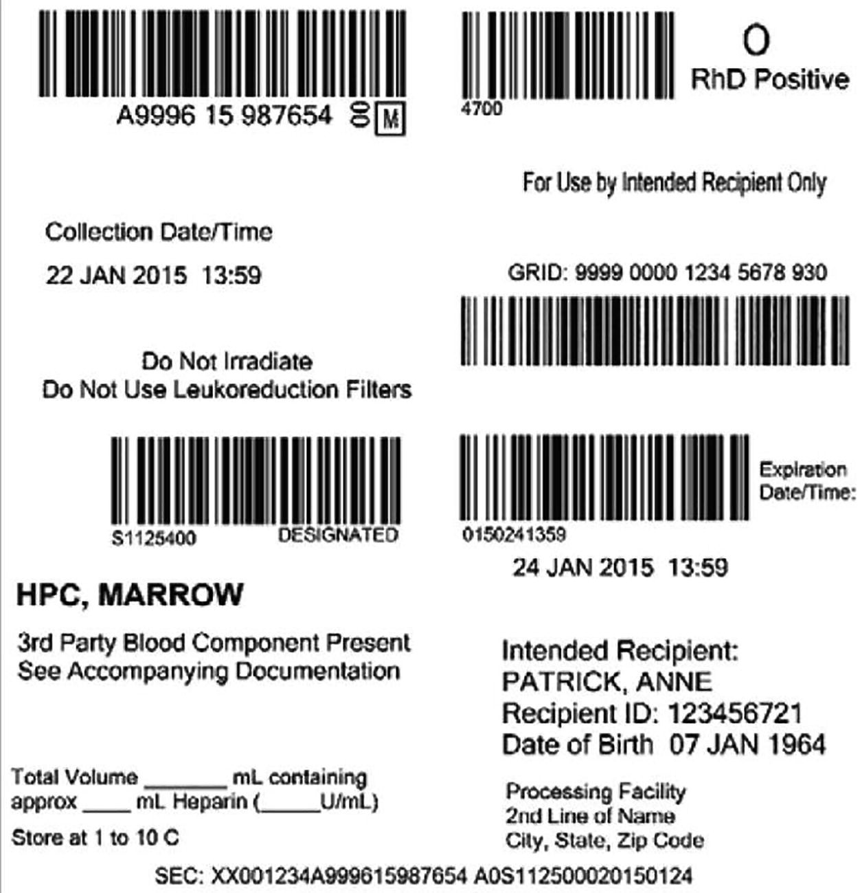

# Chapter 15. Bone Marrow Harvesting for HCT

> **Source:** Sureda A, Corbacioglu S, Greco R, Kröger N, Carreras E (eds). *The EBMT Handbook: Hematopoietic Cell Transplantation and Cellular Therapies*, 8th ed. Springer, Cham; 2024. pp. 143–149. https://doi.org/10.1007/978-3-031-44080-9_15  
> **Authors:** Gorin, Norbert Claude; Carreras, Enric; Fernández-Sojo, Jesús; Villa, Juliana  
>   - Gorin, Norbert Claude: EBMT Paris Office, Hôpital Saint Antoine APHP; Paris Sorbonne University  
>   - Carreras, Enric: Josep Carreras Foundation and Research Institute against Leukemia, Campus Clinic/University of Barcelona  
>   - Fernández-Sojo, Jesús: Stem Cells and CAR-T, Cell Therapy Unit, Banc de Sang i Teixits  
>   - Villa, Juliana: REDMO, Josep Carreras Foundation Against Leukemia  
> **License:** CC BY 4.0 (https://creativecommons.org/licenses/by/4.0/). Text reproduced verbatim from the open-access HTML edition; formatting converted to Markdown.

## Abstract

This chapter analyses the technique of bone marrow (BM) collection, major and minor complications of this procedure as well as advantatges and disadvantatges of bone marrow over peripheral blood (PB) stem cells.

## 15.1 Introduction

Historically, bone marrow (BM) has been the first source of stem cells considered since the early 1960s for hematopoietic cell transplantation (HCT) (Gorin et al. 1977). In 1986, the first success of an unrelated cord blood (UCB) transplantation in a child promoted UCB (Gluckman et al. 1997) as an alternative source in certain settings. Since 1994 and the initial demonstration that peripheral blood (PB) mobilized by cytokines (granulocyte colony-stimulating factor (G-CSF) first and, more recently, when needed, plerixafor) could be used as well as BM, the proportion of PB transplants has considerably increased to reach about 65% (haplo), 90% (allo), and 100% (auto) (Passweg et al. 2021) so that nowadays bone marrow transplantation (BMT) accounts for a minority of transplants.

This chapter schematically compares the advantages of PB with those of BM and details the technique of BM harvesting. It is not the purpose of this chapter to review the benefit/risk ratio of BM versus PB stem cells (PBSCs). However, the use of BM should always be considered in non-neoplastic diseases, such as Severe Aplastic Anemia (SAA), in which no graft-versus-tumor effect is needed and graft-versus-host disease (GVHD) should be avoided.

## 15.2 Advantages and Disadvantages of BM

<table>
<thead>
<tr>
<th><p><strong>BM</strong></p></th>
<th><p><strong>For the patients</strong></p></th>
<th><p><strong>For the donors</strong></p></th>
</tr>
</thead>
<tbody>
<tr>
<td><p>Disadvantages</p></td>
<td><p>Lower hematological and immunological recovery and consequently:</p>
<p>  – A higher risk of infectious complications</p>
<p>  – More days of hospitalization</p></td>
<td><p>They need:</p>
<p>  – To be anesthetized</p>
<p>  – Hospital admission</p>
<p>  – Autotransfusion</p></td>
</tr>
<tr>
<td><p>Advantages</p></td>
<td><p>Lower incidence of chronic GVHD and consequently:</p>
<p>  – A lower risk of late infections</p>
<p>  – Less late complications due to prolonged IST (e.g., osteoporosis, aseptic necrosis, etc.)</p>
<p>  – A better quality of life</p>
<p>  – A higher risk of relapse in neoplastic diseases</p></td>
<td><p>  – No need to administer G-CSF, avoiding possible short- and long-term secondary effects [1]</p>
<p>(see this chapter)</p></td>
</tr>
</tbody>
</table>

1.  *IST* Immunosuppressive treatment \[1\]. This is a much-debated topic, but in both donors, receiving the drug for a few days, and patients, receiving it for prolonged periods, no greater risk of long-term hemopathies than in those who do not receive it has been demonstrated

## 15.3 The Technique of BM Collection

- **Admittance**: Confirm that the posterior pelvic area has been shaved, the autotransfusion obtained before (if needed), the preanesthetic visit done, and the informed consent form signed.

- **Preparation**: In a sterile operating room, as currently only posterior iliac crests are punctured, the donor should be positioned in a prone position. In the case of a pediatric donor, completing the volume to be extracted by puncturing the anterior crests by turning the donor during the procedure can be considered. Monitor and avoid compression of the breasts and genitalia.

- **Anesthesia**: Usually, general anesthesia is performed, and the use of a laryngeal mask to avoid postintubation throat discomfort is advised. In exceptional cases where general anesthesia is contraindicated, subarachnoid anesthesia (a spinal block) can be used.

- **Preparation of the area**: Disinfect the skin of the posterior pelvic region with povidone iodine, and, then, dry with a sterile gauze. Cover the donor with sterile drapes, leaving the upper part of the posterior pelvis free. Fix the carvings and cover the field with a Steri-Drape.

- **Aspiration**: A physician will be placed on each side of the operating table. Using puncture needles, through 1–2 cutaneous points in the posterosuperior area of both iliac crests, perform 100–200 punctures by varying the direction and depth of the needle. Once the needle is inserted, the clamp is removed, the syringe is connected, the first aspiration is performed, the clamp is reinserted, and so on. The needle is advanced a few millimeters, and the same process is repeated several times at each new puncture site. Each time, 4–5 mL of marrow blood is aspirated to avoid blood contamination, and the contents are emptied into the collection bag. Needles with multiple holes at different levels simplify the process but increase the risk of blood contamination. Once the syringe has been emptied, it is washed with saline solution with sodium heparin, from a container prepared for this purpose. Periodically and gently shake the collection bag with the volume to be aspirated. The maximum volume to aspirate is 15–20 mL/kg donor weight.

Some registries, such as the National Marrow Donor Program (NMDP), use the following formula to **predict the cellularity** that can be obtained from a BM donor considering that the maximum volume of BM to be obtained is 15–20 mL/kg donor weight and that the “expected Total Nucleated Cells (TNC)” is 0.22 × 10⁸ TNC per mL aspirated.

```math
\mathrm{Then},\mathrm{total}\;\mathrm{TNC}\;\mathrm{expected}=\mathrm{maximum}\ \mathrm{volume}\;\left(\mathrm{in}\ \mathrm{milliliters}\right){\times}^{``}\mathrm{expected}\;\mathrm{TNC}{.}^{"}
```

```math
\mathrm{Total}\;\mathrm{TNC}\times \mathrm{kilogram}\ \mathrm{receptor}\ \mathrm{weight}=\mathrm{Total}\;\mathrm{TNC}\;\mathrm{expected}/\mathrm{receptor}\ \mathrm{weight}\ \mathrm{in}\ \mathrm{kilogram}\mathrm{s}
```

- **Objective**: The aim of aspiration is to obtain 2–4 × 10⁸ nucleated cells/kilogram of recipient weight. In case of Unrelated Donors (UNR), it is advisable to request and attempt to collect \>3 × 10⁸ TNC/kg. To ensure this goal, it is advisable to perform a cell count after having collected about 500–600 mL to assess the efficacy of the aspiration. Unlike PBSCs, CD34⁺ cell counts, despite being quantified, are not standard with BM.

A recent study has shown that the cellularity of BM collections has been decreasing over the last few years, despite a better selection of donors (younger and more males with a larger body volume). This decrease is attributed to the lack of experience of the collection centers (worse results in centers with \<6 collections/year) and to the reduction of the collection time, which, although beneficial to the donor from an anesthetic point of view, implies a greater contamination of the product by medullary blood, either by aspirations with a greater volume or by the use of new aspiration equipment that facilitates the aspiration of medullary blood (Prokopishyn et al. 2019). This multicenter observation has recently been replicated in a large single-center series (Spitzer et al. 2021). Recently, as a result of the coronavirus disease 2019 (COVID-19) pandemic, this observation has acquired special relevance due to the loss of cellularity that can be caused by delays in the delivery of products and their cryopreservation, although the latter factor does not seem to have a relevant clinical impact (Fernandez-Sojo et al. 2021), except in some cases of bone marrow aplasia (Eapen et al. 2020).

- **Filtering**: Classically, once the desired cellularity is reached, the collection bag (that contains a prefilter of 850 μm) is connected to two additional filters of 500 and 200 μm (included in the collection kit), which, in turn, are connected to the final collection bags. By gravity, the collected volume passes through the filters, reaching the final bags. It is preferable to distribute the aspirated Bone Marrow (BM) in two to three bags as a precaution against possible breakage during transport or handling. This procedure is under revision due to the destocking of the classic BM collection kits, which are being replaced by in-house kits (see below).

- **Labeling**: All products, especially if they are to be cryopreserved, should be labeled for an adequate traceability. ISBT 128 (proposed by the International Society of Blood Transfusion) is a labeling method that is voluntary in some countries and mandatory in others, supported by scientific and professional societies and required by the Joint Accreditation Committee of International Society for Cell and Gene Therapy-European Society for Blood and Marrow Transplantation (ISCT-EBMT) (JACIE)-accredited cell therapy facilities. In 2017, the use of the Single European Code (SEC) on tissues and cells was enforced within the European Union (EU) or exported from the EU. SEC intended standardization within the EU and the integration of the two existing codes (Regulation EU 2017/745). As ISBT 128 provides all the information required in SEC, except the country identifier and the tissue establishment code, which are constants, most centers use ISBT 128 labeling.

Due to the increasing numbers of exported hematopoietic stem cell products, it was necessary to generate a distinct identification code linking donors and products to maintain adequate traceability. As a result, a Global Registration Identifier for Donors (GRID) of Hematopoietic Cells was implemented in 2014 by the World Marrow Donor Association (WMDA). Over the years, the initial concept “GRID for life” changed, the GRID was abandoned by cord blood products, and the number could be changed if the issue organization of the donor changed. Despite that, nowadays, GRID has become a crucial code for unrelated donors and has been included in the ISBT 128/SEC (see Fig. 15.1).

- **Autotransfusion**: Depending on the volume collected, two attitudes regarding transfusion during BM collection may be followed: no transfusion and liquid replacement or autotransfusion collected 2–3 weeks preceding marrow collection. Allogeneic transfusions should be avoided by all means in healthy donors. Depending on hemoglobin and ferritin pre-donation and volume obtained, a dose of intravenous Fe could be administered.

- **Post-aspiration**: After disinfecting the wounds, apply dressing and a compressive bandage. Administer analgesia. The morning after aspiration, remove the compressive bandage, assess the puncture site aspect, and apply dressing on each side. Continue with the prescribed analgesia for approximately 1 week and oral Fe. Avoid violent exercise or heavy lifting for 7 days.

- **Sodium (Na) heparin or anticoagulant citrate dextrose solution (Acd) solution a (ACD-A)?:** Many collection centers only use Na heparin as an anticoagulant for BM collection, but international standards (JACIE and the Association for the Advancement of Blood and Biotherapies (AABB) clearly recommend:

  - **JACIE** (Standards eighth edition, CM5.1.12.2): Use of additives for a long shelf life. Explanation: ACD should be used as an anticoagulant (may be combined with heparin) when shipping long-acting cell therapy products for centralized manufacturing.

  - **AABB** (Standards 32 edition): Heparin is used to prevent clotting in BM. However, given the potential for marrow “clumping” during longer storage (as might be the case when marrow is transferred to another center for transplantation), additional anticoagulation may be used. ACD-A at a 10% concentration appears to decrease the likelihood of marrow clotting and clumping. The AABB also recommends it for those marrows to be processed.

While many products continue to be cryopreserved (i.e., in a pandemic situation), it seems reasonable to employ this additional measure. Since it is not a matter of changing the form of collection for those who only use heparin, simply add ACD-A at 10% at the time of preparing the product for transport, especially if it is to be cryopreserved.

**Fig. 15.1**



An example of an ISBT 128 label, including two-dimensional (2D) GRID and SEC code (adapted from Neller et al. (2017))

## 15.4 In-House Collection Kits

After the introduction of a new European legislation on medical devices (2017/745), the commercial BM extraction kits lost the European Conformity (EC) mark and were no longer permitted for use in Europe. Some member states asked for a derogation of the EC mark for the kits, but commercial BM manufacturers stated that they were unable to resume the supply in Europe. This has led to the production of different in-house protocols, varying mainly in the filtration process of the cells, depending on the filters and other materials available, the site of filtering (in the operating (OP) room or the processing laboratory), and the regulations set by the regional authorities of each country. Some examples of this protocols have been shared by different groups as the “New Method for Bone Marrow Collection and Filtration” presented as a poster by E. Berger at EBMT 2023 and the recently published “In-house Bone Marrow Collection kit” by J. Fernandez-Sojo, which has compared the results of the harvest performed with a commercial kit and found no differences (Fernandez-Sojo et al. 2023).

## 15.5 Major and Minor Complications According to the NMDP (Pulsipher et al. 2014)

<table>
<tbody>
<tr>
<td><p><strong>Major:</strong> They are extremely rare (0.25%), and most of them have a rapid resolution.</p>
<p> – Severe hypotension with electrocardiogram (ECG) changes, hypo K</p>
<p> – Abdominal thrombosis, sepsis due to <em>Escherichia coli</em></p>
<p> – Severe laryngospasm after extubating</p>
<p> – Pulmonary edema</p>
<p> – Asystole, arrhythmia, desaturation</p>
<p> – Significant pain, severe anemia</p>
<p>Another publication analyzes <strong>serious complications</strong> of BM donation and describes 12 cases in 27,770 donations analyzed (0.04%), with the most notable being 1 death due to massive Pulmonary thromboembolism (PTE) 15 days after donation; among the major nonfatal complications are cardiac arrest (4), severe hypotension (2), pulmonary edema (1), cerebral vascular accident (1), and subdural hematoma due to heparin-induced thrombocytopenia (1) (Halter 2009).</p></td>
</tr>
<tr>
<td><p><strong>Expected minor that prolongs admission:</strong> Similarly, infrequent, 1.4%. They resolve in 1–2 days.</p>
<p> – Nausea, vomiting</p>
<p> – Pain, fever</p>
<p> – Syncope</p>
<p> – Anesthesia-related problems: Hypotension, urinary retention, bradycardia, bronchospasm</p></td>
</tr>
<tr>
<td><p><strong>Unexpected minors, prolong admission:</strong> Also infrequent, 0.2%, few days duration</p>
<p> – Infection, unusual pain</p>
<p> – Pulmonary edema, chest pain</p></td>
</tr>
<tr>
<td><p><strong>Chronic or disabling complications:</strong> Referred in 5%, some cases &gt;3 months duration</p>
<p> – Prolonged hip, back, or joint pain</p></td>
</tr>
</tbody>
</table>

## 15.6 Other Therapeutic Applications of BM Harvesting

### 15.6.1 Culture-Adapted Mesenchymal Stromal Cells (MSCs)

These cells have the potential to stimulate the tissue repairing process and exercise an immune modulatory and anti-inflammatory effect (treat GVHD). MSCs can be isolated from 30–150 mL BM harvesting of healthy consent allogeneic donors (individually or in pool (Kuci et al. 2016)). Donor selection must be in accordance with the national legislation and international (Foundation for the Accreditation of Cellular Therapy (FACT)/JACIE and WMDA) regulations. A considerable variability regarding in vivo effects of BM MSCs for bone formation and hematopoiesis support exists between manufacturer’s centers (Liu et al. 2017).

### Key Points

- BM, when compared with PBSCs, results in less TRM, less GVHD (in particular chronic extensive GVHD), but a less GVL/lymphoma/tumor effect.

- Harvest with small (2–5 mL) aspirate volumes to avoid dilution with blood.

- The goal should be at least 3 × 10⁸ nucleated cells per kilogram, but the more the better. The maximum volume collected should not exceed 20 mL/kg donor body weight. Cryopreservation should be avoided unless under specific conditions.

- A correct filtering of the product and labeling of the bags is mandatory. Validate all the in-house procedures.

- The decision for no transfusion with liquid replacement (recommended) or autotransfusion (second-best option) relies on the judgment of the local medical team. Allo-transfusion must be avoided in healthy donors.

## References

- Eapen M, Zhang MJ, Tang XY, et al. Hematopoietic cell transplantation with cryopreserved grafts for severe aplastic anemia. Biol Blood Marrow Transplant. 2020;26:e161–6.

- Fernandez-Sojo J, Azqueta C, Valdivia E, et al. Cryopreservation of unrelated donor hematopoietic stem cells: the right answer for transplantations during the COVID-19 pandemic? Bone Marrow Transplant. 2021;56:2489–96.

- Fernandez-Sojo J, Valdivia E, Esquirol A, et al. Development of an in-house bone marrow collection kit: the Catalan bone marrow transplantation group experience. Vox Sang. 2023;118:783. https://doi.org/10.1111/vox.13499.

- Gluckman E, Rocha V, Boyer-Chammard A, et al. Outcome of cord-blood transplantation from related and unrelated donors. Eurocord transplant group and the European blood and marrow transplantation group. N Engl J Med. 1997;337:373–81.

- Gorin NC, Nasjman A, Duhamel G. Autologous bone-marrow transplantation in acute myelocytic leukaemia. Lancet. 1977;1:1050.

- Halter J, Kodera Y, Urbano-Ispizua A, et al. Severe events in donors after allogeneic hematopoietic stem cell donation. Haematologica. 2009;94:94–101.

- ISBT 128 and the Single European Code. n.d.. *https://www.eeba.eu/files/pdf/TB-007-ISBT-128-and-the-Single-European-Code-v1_1_0.pdf*

- Kuci Z, Bonig H, Kreyenberg H, Bunos M, Jauch A, Janssen JW, et al. Mesenchymal stromal cells from pooled mononuclear cells of multiple bone marrow donors as rescue therapy in pediatric severe steroid-refractory graft-versus-host disease: a multicenter survey. Haematologica. 2016;101:985–94.

- Liu S, de Castro LF, Jin P, et al. Manufacturing differences affect human bone marrow stromal cell characteristics and function: comparison of production methods and products from multiple centers. Sci Rep. 2017;7:46731.

- Neller JK, Ashford P, van Veen C, Humpe A. Global registration identifier for donors (GRID) of hematopoietic stem cells: road to automation and safety. Transfus Med Hemother. 2017;44:407–13.

- Passweg JR, Baldomero H, Chabannon C, et al. Hematopoietic cell transplantation and cellular therapy survey of the EBMT: monitoring of activities and trends over 30 years. Bone Marrow Transplant. 2021;56:1651–64.

- Prokopishyn NL, Logan BR, Kiefer DM, et al. The concentration of Total nucleated cells in harvested bone marrow for transplantation has decreased over time. Biol Blood Marrow Transplant. 2019;25:1325–30.

- Pulsipher MA, Chitphakdithai P, Logan BR, et al. Lower risk for serious adverse events and no increased risk for cancer after PBSC vs BM donation. Blood. 2014;123:3655–63.

- Regulation EU 2017/745 on medical devices (Medical Device Regulation, MDR). Cited 2022 Dec 17. n.d.. https://eur-lex.europa.eu/legal-content/EN/TXT/PDF/?uri=CELEX:32017R0745

- Spitzer TR, Kim SE, Cohen R, et al. Declining bone marrow harvest quality over 24 years: a single institution experience. Bone Marrow Transplant. 2021;56:983–5.
