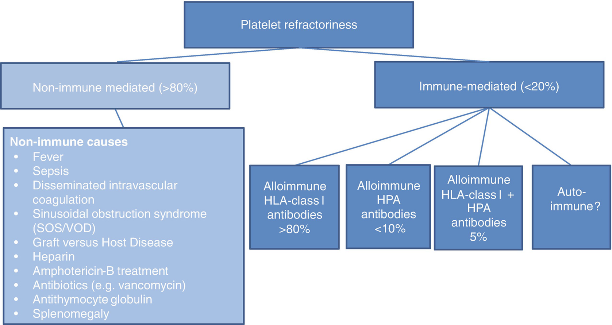

# Chapter 24. Transfusion Support

> **Source:** Sureda A, Corbacioglu S, Greco R, Kröger N, Carreras E (eds). *The EBMT Handbook: Hematopoietic Cell Transplantation and Cellular Therapies*, 8th ed. Springer, Cham; 2024. pp. 203–210. https://doi.org/10.1007/978-3-031-44080-9_24  
> **Authors:** Schrezenmeier, Hubert; Körper, Sixten; Höchsmann, Britta; Weinstock, Christof  
>   - Schrezenmeier, Hubert: Institute of Clinical Transfusion Medicine and Immunogenetics Ulm, German Red Cross Blood Transfusion Service Baden-Württemberg-Hessen and University Hospital Ulm; Institute of Transfusion Medicine, University of Ulm  
>   - Körper, Sixten: Institute of Clinical Transfusion Medicine and Immunogenetics Ulm, German Red Cross Blood Transfusion Service Baden-Württemberg-Hessen and University Hospital Ulm; Institute of Transfusion Medicine, University of Ulm  
>   - Höchsmann, Britta: Institute of Clinical Transfusion Medicine and Immunogenetics Ulm, German Red Cross Blood Transfusion Service Baden-Württemberg-Hessen and University Hospital Ulm; Institute of Transfusion Medicine, University of Ulm  
>   - Weinstock, Christof: Institute of Clinical Transfusion Medicine and Immunogenetics Ulm, German Red Cross Blood Transfusion Service Baden-Württemberg-Hessen and University Hospital Ulm; Institute of Transfusion Medicine, University of Ulm  
> **License:** CC BY 4.0 (https://creativecommons.org/licenses/by/4.0/). Text reproduced verbatim from the open-access HTML edition; formatting converted to Markdown.

## Abstract

Transfusions are an essential part of supportive care in the context of HCT. RBC and platelet concentrates (PCs) are the main blood products transfused in the peri-transplant period. Here we summarize indication for transfusion, selection of product type and immunohematological challenges in the context of allogeneic stem cell transplantation.

## 24.1 General Aspects

Many recommendations in this chapter are based on evidence from studies including a broad variety of diseases. Only a few studies addressed transfusion strategy specifically in patients undergoing HCT (see review Christou et al. 2016). Many recommendations are derived from patients with cytopenia in nontransplant settings. There are both need and opportunity to address issues regarding transfusion of HCT patients in clinical trials. So far, there is a paucity of studies on the impact of transfusion on HCT-specific outcomes.

Red blood cell (RBC), platelet concentrate (PC), and fresh frozen plasma (FFP) for patients who are candidates for HCT should be leukocyte-reduced, i.e. should contain \<1 × 10⁶ leukocytes/unit. Leukocyte reduction reduces febrile non-hemolytic transfusion reactions and decreases the incidence of alloimmunization to leukocyte antigens and the risk of CMV transmission. All cellular blood components (RBC, PC, and granulocyte transfusions) must be irradiated (see below).

## 24.2 Irradiation for Prevention of Transfusion-Associated GvHD (ta-GvHD)

Ta-GvHD is a rare complication of transfusion wherein viable donor T lymphocytes in cellular blood products mount an immune response against the recipient (Kopolovic et al. 2015). Some of the clinical presentations of ta-GvHD resemble that of GvHD (fever, cutaneous eruption, diarrhea, and liver function abnormalities). Also, many patients develop pancytopenia. Since mortality is high (\>90%), prevention of ta-GvHD is critical (Kopolovic et al. 2015; Foukaneli et al. 2020; Wiersum-Osselton et al. 2021). HCT recipients are at a risk of ta-GvHD and should receive irradiated cellular blood products (Kopolovic et al. 2015). It is recommended that no part of the component receives a dose \<25 Gy and \>50 Gy (European Committee (Partial Agreement) on Blood Transfusion (CD-P-TS) 2023). Some pathogen-reduction technologies have been shown to inactivate lymphocytes, and additional irradiation is not required (Kleinman and Stassinopoulos 2018).

There is no consensus on the duration of the use of irradiated blood products in HCT recipients (Foukaneli et al. 2020; Wiersum-Osselton et al. 2021). Standard practice is (1) auto-HCT, at least 2 weeks prior to stem cell collection until at least 3 months after HCT and (2) allo-HCT, at the latest starting with conditioning until at least 6 months after HCT or until immune reconstitution. However, some centers recommend lifetime use of irradiated products since it is difficult to confirm complete and sustained immunological reconstitution.

Allogeneic cellular blood components that transfused hematopoietic stem cell donors within 7 days prior to or during the harvest should also be irradiated (Foukaneli et al. 2020).

## 24.3 Prevention of CMV Transmission

The highest risk of transfusion-transmitted CMV (TT-CMV) remains in CMV-seronegative recipients of matched CMV-negative HCT (Ljungman 2014). Risk of TT-CMV can be reduced by transfusion of leukocyte-reduced blood products (i.e., \<1 to 5 × 10⁶ residual leukocytes per unit) or by transfusion of blood components from CMV-seronegative donors (Ziemann and Thiele 2017). The UK Advisory Committee for the Safety of Tissues and Organs recommended that CMV-unselected components could be safely transfused without increased risk of CMV transmission. It is unclear whether the “belt and suspender approach,” i.e., the use of both leukocyte-reduced and seronegative products, further reduces the risk of TT-CMV. Donations from newly CMV-IgG-positive donors bear the highest risk for transmitting CMV infections (Ziemann and Thiele 2017). Currently, no international consensus on risk mitigation for CMV transmission exists, and surveys revealed substantial heterogeneity of clinical practice (Lieberman et al. 2014; Morton et al. 2017). Also, there is no consensus how long CMV-seronegative products should be given to transplant recipients: the current practice ranges from 100 days after transplant till lifelong (or until CMV seroconversion) (Lieberman et al. 2014).

## 24.4 Red Blood Cell Concentrates (RBCs)

A restrictive RBC transfusion threshold of 7–8 g/dL hemoglobin is recommended for adult patients who are hemodynamically stable. A restrictive RBC transfusion threshold of 8 g/dL is recommended for patients with existing cardiovascular disease (Carson et al. 2021; Carson et al. 2016). These cut-offs are derived from studies on a broad range of indications. Only one randomized clinical trial is available specifically for patients undergoing HCT (TRIST trial, NCT01237639). It randomly assigned 300 patients to either a liberal strategy (Hb threshold \<90 g/L) or a restrictive strategy (Hb threshold \<70 g/L). Health-related quality of life was similar between groups, and there were no significant differences in clinical outcomes between the transfusion strategies (Tay et al. 2020). The median number of RBC units transfused was lower in the restrictive strategy compared to the liberal strategy group, but this did not reach statistical significance (Tay et al. 2020). One randomized feasibility trial is ongoing in children undergoing allogeneic hematopoietic cell transplantation. It compares restrictive versus liberal red cell transfusion strategies using hemoglobin concentrations of \<6.5 g/dL and \<8.0 g/dL (ISCRTN17438123).

In adult recipients, one unit of RBC increases the hemoglobin concentration by about 1 g/dl. In children, the dose should be calculated by the formula:

```math
\mathrm{Volume}\ \left(\mathrm{mL}\ \mathrm{RBC}\right):\mathrm{Target}\ \mathrm{Hb}\ \mathrm{after}\ \mathrm{transfusion}\ \left(\mathrm{g}/\mathrm{dL}\right)-\mathrm{pretransfusion}\ \mathrm{Hb}\ \left(\mathrm{g}/\mathrm{dL}\right)\times 4\times \mathrm{weight}\ \left(\mathrm{kg}\right)
```

A randomized trial in patients with hematological malignancies indicated that transfusion of a single is not inferior to double RBC transfusion for patients receiving a bone marrow transplant or intensive chemotherapy in a hematological intensive care unit (Chantepie et al. 2023). The single RBC transfusion policy did not reduce the number of RBC units transfused per stay (Chantepie et al. 2023).

Several randomized trials showed no evidence that transfusion of fresh RBC reduced morbidity or mortality compared to standard issue RBCs. Thus, the AABB recommends that patients should receive RBC selected at any point within their licensed dating period (Carson et al. 2016).

Chronic RBC transfusions result in iron overload. The impact of pretransplant iron overload on outcome after HCT remains controversial. A meta-analysis (Armand et al. 2014) and a prospective cohort study suggest that iron overload, as assessed by liver iron content, is not a strong prognostic factor for overall survival in a general adult HCT population. Hepcidin or labile plasma iron levels may be more specific for iron overload and complications in HCT patients.

## 24.5 Platelet Concentrates (PCs)

PC should be transfused prophylactically to nonbleeding, nonfebrile patients when platelet counts are ≤10 × 10⁹/L (Schiffer et al. 2018). Prophylactic platelet transfusions may be administered at higher counts based on clinical judgment (Schiffer et al. 2018). Patients with active bleeding, febrile conditions, or active infections should receive prophylactic PC transfusions at a threshold of 20 × 10⁹/L. Also, in case of specific transplant-related toxicity which might increase the risk of bleeding (acute GvHD, mucositis, hemorrhagic cystitis, or diffuse alveolar hemorrhage), a threshold of 20 × 10⁹/L or even higher, based on careful clinical observation, might be justified.

Two prospective randomized control trials comparing prophylactic versus therapeutic PC transfusion in adult patients (≥16 years) suggest that a therapeutic transfusion strategy might be feasible in patients after auto-PB HCT but cannot be easily transferred to other indications (AML, allo-HCT) for whom special attention to the increased risk of bleeding, in particular, CNS bleeding, is needed (Stanworth et al. 2013; Wandt et al. 2012). The results may not be generalizable to children since a subset analysis of the PLADO trial demonstrated that bleeding rates were significantly increased among children, particularly among those undergoing autologous HCT (Josephson et al. 2012).

The randomized PLADO trial compared different doses of PC transfusions (“low dose,” “medium dose,” and “high dose” defined as 1.1 × 10¹¹, 2.2 × 10¹¹, and 4.4 × 10¹¹ platelets per m² BSA, respectively) (Slichter et al. 2010). While a strategy of “low-dose” transfusion significantly reduces the overall quantity of platelets transfused, patients required more frequent PC transfusion events (Slichter et al. 2010). At doses between 1.1 × 10¹¹ and 4.4 × 10¹¹ platelets/m², the number of platelets in the prophylactic transfusions had no effect on the incidence of bleeding.

Both apheresis PC and pooled PC from whole blood donations are safe and effective. Available data suggest equivalence of the products in non-allosensitized recipients (Schrezenmeier and Seifried 2010). A clear advantage of apheresis PCs can only be demonstrated in allosensitized patients with HLA and/or HPA antibodies who receive antigen-compatible apheresis PCs.

Some patients experience inadequate increment after PC transfusions, i.e., a corrected count increment (CCI) below 5000/μL at 1 h after transfusion of fresh, ABO-identical PCs on at least two subsequent transfusions. Refractoriness can be caused by non-immunological factors (\>80%) or immunological factors (\<20%) (Fig. 24.1). If platelet refractoriness is suspected and no apparent nonimmune causes can be identified, screening for the presence of HLA-Ab is recommended. If HLA-Ab is present, the patient should receive apheresis PCs from matched donors (Juskewitch et al. 2017; Stanworth et al. 2015): ideally all four antigens (HLA-A, HLA-B) of donor and recipient are identical. Also PCs from donors expressing only antigens which are present in the recipient can be used. If PCs from such donors are not available, donors with “permissive” mismatches in HLA-A or HLA-B shall be selected (e.g., based on cross-reactive groups or computer algorithms that determine HLA compatibility at the epitope level). A noninferiority, crossover, randomized trial compared HLA epitope-matched platelets with HLA standard antigen-matched platelet transfusion. It supported a role for epitope-matched platelets for HLA alloimmunized, platelet refractory patients (Marsh et al. 2021). If no better-matched donor is available, antigen-negative platelets, i.e., not expressing the target antigen(s) of the recipients’ HLA allo-Ab, can be transfused. Screening for antibodies against human platelet antigens (HPAs) should be performed if refractoriness persists also after transfusion of HLA-matched PCs and nonimmune causes are unlikely. Approaches for patients without compatible platelet donors are autologous cryopreserved platelets (e.g., collected in remission prior to allogeneic HCT), IS (e.g., rituximab), and high-dose IVIg and plasmapheresis.

**Fig. 24.1**



Etiology of platelet transfusion refractoriness (modified according to Pavenski et al. 2012)

## 24.6 Immunohematological Consequences of ABO-Mismatched Transplantation

About 40–50% of allo-HCT are ABO-mismatched. While transplantation across the ABO barrier is possible, immunohematological problems have to be taken into account. There is a risk that ABO incompatibility between donor and recipient causes hemolytic transfusion reactions. In case of major ABO mismatch and a recipient anti-donor isoagglutinin titer ≥32, the red cell contamination in PBSC graft should be kept \<20 mL, and RBC depletion of BM grafts must be performed. If recipient anti-donor isoagglutinin titers are low (≤16), no manipulation of the PBSC graft is required and RBC depletion of a BM graft might be considered in this situation but is not mandatory. In case of minor ABO incompatibility and a high donor anti-recipient isoagglutinin titer (≥1:256), plasma depletion of both PBSC and BM grafts should be performed. If the donor anti-recipient isoagglutinin titer is low (≤128), no manipulation of the PBSC graft is required and plasma depletion of a BM graft might be considered but is not mandatory. In case of bidirectional ABO incompatibility and high titers of anti-recipient isoagglutinins, both RBC and plasma depletion are required.

Delayed hemolysis can occur in minor ABO-mismatched HCT, in particular after RIC, due to hemolysis of remaining recipient red cells by isoagglutinins produced by donor B lymphocytes.

Major or bidirectional ABO-incompatible HCT can cause pure red cell aplasia (PRCA), delayed engraftment, and increased RBC transfusion requirement (Griffith et al. 2019). The risk is higher if a group O recipient with high-titer anti-A isoagglutinins receives a group A graft. If no spontaneous remission of PRCA occurs and anti-donor isoagglutinins persist, various treatments to remove isoagglutinins, to reduce their production, or to stimulate erythropoiesis can be used (see review Worel 2016; Marco-Ayala et al. 2021).

## 24.7 Transfusion in ABO- or RhD-Incompatible HCT

The change of blood group and the persistence of recipient isoagglutinins require a special approach for transfusion support in ABO-incompatible HCT considering several aspects: isoagglutinins might target engrafting progenitors and transfused platelets to which variable amounts of ABO antigens can be bound. ABO blood group antigens are expressed in many non-hematopoietic tissues which continue to express the recipients’ ABO antigens also after engraftment. ABO antigens can be secreted into body fluids. If possible, exposure of HSC recipients to isoagglutinins should be avoided. RBCs which are ABO compatible with both HSC donor and recipient are mandatory. Plasma and PCs which are compatible with both the donor and the recipient should be preferred. Table 24.1 summarizes the recommendation for ABO preference of transfusions in ABO-incompatible HCT.

**Table 24.1 RBC, platelet, and plasma transfusion support for patients undergoing ABO-incompatible HCT**

|                     |           |       | Phase I<sup>a</sup> | Phase II and phase III<sup>a</sup> |                |                           |              |               |
|---------------------|-----------|-------|---------------------|------------------------------------|----------------|---------------------------|--------------|---------------|
|                     |           |       | All products        | RBC                                | Platelets      |                           | Plasma       |               |
| ABO incompatibility | Recipient | Donor |                     | Choice<sup>b</sup>                 | First choice   | Second choice<sup>b</sup> | First choice | Second choice |
| Major               | O         | A     | Recipient           | O                                  | A              | AB, B, O                  | A            | AB            |
|                     | O         | B     | Recipient           | O                                  | B              | AB, A, O                  | B            | AB            |
|                     | O         | AB    | Recipient           | O                                  | AB             | A, B, O                   | AB           | –             |
|                     | A         | AB    | Recipient           | A, O                               | AB             | A, B, O                   | AB           | –             |
|                     | B         | AB    | Recipient           | B, O                               | AB             | B, A, O                   | AB           | –             |
| Minor               | A         | O     | Recipient           | O                                  | A<sup>c</sup>  | AB, B, O                  | A            | AB            |
|                     | B         | O     | Recipient           | O                                  | B<sup>c</sup>  | AB, A, O                  | B            | AB            |
|                     | AB        | O     | Recipient           | O                                  | AB<sup>c</sup> | A, B, O                   | AB           | –             |
|                     | AB        | A     | Recipient           | A, O                               | AB<sup>c</sup> | A, B, O                   | AB           | –             |
|                     | AB        | B     | Recipient           | B, O                               | AB<sup>c</sup> | B, A, O                   | AB           | –             |
| Bidirectional       | A         | B     | Recipient           | O                                  | AB             | B, A, O                   | AB           | –             |
|                     | B         | A     | Recipient           | O                                  | AB             | A, B, O                   | AB           | –             |

1.  – Not applicable
2.  <sup>a</sup>Phase I until preparative regimen, phase II until complete engraftment, phase III after complete engraftment
3.  <sup>b</sup>Choices are listed in the order of preference
4.  <sup>c</sup>For practical reasons, the use of donor type platelets might be defined as first choice, in phase III, i.e., after complete engraftment

For PCs, some choices of blood groups might not always be available. To reduce the risk of adverse events due to isoagglutinins, apheresis PC donors with high-titer ABO antibodies should be excluded. However, a preferred strategy is the use of plasma-reduced PC (both for apheresis PC and pooled PC from whole blood donations). These are suspended in platelet additive solution with only about 30% plasma volume remaining.

HSC recipients should receive RhD-negative RBC and also RhD-negative PC except when both HSC donor and recipient are RhD-positive. If the HSC donor is RhD-positive and the recipient is RhD-negative, platelet transfusion can be switched to RhD-positive products after erythroid engraftment, i.e., appearance of RhD-positive red cells.

Whenever possible, RBC should be compatible both with HCT donor and recipient for CcEe antigens. If Rh antigens of HCT donor and recipient differ in a way that compatibility with both is not possible (e.g., recipient CCD.ee, donor ccD.EE), then RBC compatible with the recipient shall be chosen in the period until engraftment. After the appearance of donor-derived red cells, RBC supply should switch to compatibility with the graft. Patients should receive K-negative RBC except when both recipient and donor are K positive.

## 24.8 Granulocyte Concentrates

In life-threatening non-viral infections during neutropenia, the use of irradiated granulocyte transfusions should be considered. Response and survival after granulocyte transfusion correlate strongly with hematopoietic recovery. Thus, granulocyte transfusions may mainly bridge the gap between specific treatment and neutrophil recovery (Nguyen et al. 2020). Granulocyte transfusions can help to control active fungal infections in a very high-risk population of patients who otherwise are denied by transplant program. A retrospective study suggested that granulocyte transfusion might maintain the mucosal integrity and thus reduces bacterial translocation and triggers for GvHD. In the randomized RING trial, success rates for granulocyte and control arms did not differ within any infection type. The overall success rates for the control and granulocyte transfusion group were 41% and 49% (n.s.) (Price et al. 2015). However, patients who received high dose (≥0.6 × 10⁹ granulocytes/kg per transfusion) fared better than patients who received lower doses. The collection center should ensure to provide a high-dose concentrate by appropriate donor selection, pre-collection stimulation, and apheresis techniques. The optimal number of granulocyte transfusions is unclear. Adverse events of granulocyte infusions are fever, chills, pulmonary reactions, and alloimmunization. Studies demonstrated that overall risk of alloimmunizations was low and there was no effect of alloimmunization on the primary outcome (survival, microbial response), the occurrence of transfusion reactions, or post transfusion neutrophil increments. Alloimmunization remains a problem because of its negative impact on increments after platelet transfusion and potential increase of graft failure after HCT. Donor-specific HLA-Ab might be implicated in early graft failure. If granulocyte transfusions are used prior to a planned unrelated HCT, recipients should be monitored for the development of HLA-Ab and the search algorithm for the UD should take into account donor-specific antibodies. Granulocyte concentrates must be irradiated and should be obtained from CMV-seronegative donors, ideally also confirmed by CMV-PCR to avoid donations in the serological window period.

### Key Points

- Patients undergoing HCT must be transfused with irradiated blood products (at least 2 weeks prior to stem cell collection in auto- and starting with the conditioning in allo-HCT).

- A restrictive RBC transfusion threshold of 7–8 g/dL hemoglobin is recommended for adult patients who are hemodynamically stable.

- RBC must be compatible with both the HSC donor and the recipients.

- Platelet concentrates should be transfused to non-bleeding, nonfebrile patients when platelet counts are ≤10 × 10⁹/L.

- Prophylactic platelet transfusion remains the standard of care for thrombocytopenic patients undergoing allogeneic HCT.

## References

- Armand P, Kim HT, Virtanen JM, et al. Iron overload in allogeneic hematopoietic cell transplantation outcome: a meta-analysis. Biol Blood Marrow Transplant. 2014;20:1248–51.

- Carson JL, Guyatt G, Heddle NM, et al. Clinical practice guidelines from the AABB: red blood cell transfusion thresholds and storage. JAMA. 2016;316:2025–35.

- Carson JL, Stanworth SJ, Dennis JA, Trivella M, Roubinian N, Fergusson DA, Triulzi D, Doree C, Hebert PC. Transfusion thresholds for guiding red blood cell transfusion. CochraneDatabaseSystRev. 2021;12:CD002042.

- Chantepie SP, Mear JB, Briant AR, Vilque JP, Gac AC, Cheze S, Girault S, Turlure P, Marolleau JP, Lebon D, Charbonnier A, Jardin F, Lenain P, Peyro-Saint-Paul L, Abonnet V, Dutheil JJ, Chene Y, Bazin A, Reman O, Parienti JJ. Effect of single-unit transfusion in patients treated for haematological disease including acute leukemia: a multicenter randomized controlled clinical trial. Leuk Res. 2023;129:107058.

- Christou G, Iyengar A, Shorr R, et al. Optimal transfusion practices after allogeneic hematopoietic cell transplantation: a systematic scoping review of evidence from randomized controlled trials. Transfusion. 2016;56:2607–14.

- European Committee (Partial Agreement) on Blood Transfusion (CD-P-TS). Guide to the preparation, use and quality assurance of blood components. 21st ed. EDQM; 2023.

- Foukaneli T, Kerr P, Bolton-Maggs PHB, Cardigan R, Coles A, Gennery A, Jane D, Kumararatne D, Manson A, New HV, Torpey N. Guidelines on the use of irradiated blood components. Br J Haematol. 2020;191:704–24.

- Griffith LM, VanRaden M, Barrett AJ, Childs RW, Fowler DH, Kang EM, Tisdale JF, Klein HG, Stroncek DF. Transfusion support for matched sibling allogeneic hematopoietic stem cell transplantation (1993-2010): factors that predict intensity and time to transfusion independence. Transfusion. 2019;59:303–15.

- Josephson CD, Granger S, Assmann SF, et al. Bleeding risks are higher in children versus adults given prophylactic platelet transfusions for treatment-induced hypoproliferative thrombocytopenia. Blood. 2012;120:748–60.

- Juskewitch JE, Norgan AP, De Goey SR, et al. How do I … manage the platelet transfusion-refractory patient? Transfusion. 2017;57:2828–35.

- Kleinman S, Stassinopoulos A. Transfusion-associated graft-versus-host disease reexamined: potential for improved prevention using a universally applied intervention. Transfusion. 2018;58:2545–63.

- Kopolovic I, Ostro J, Tsubota H, et al. A systematic review of transfusion-associated graft-versus-host disease. Blood. 2015;126:406–14.

- Lieberman L, Devine DV, Reesink HW, et al. Prevention of transfusion-transmitted cytomegalovirus (CMV) infection: standards of care. Vox Sang. 2014;107:276–311.

- Ljungman P. The role of cytomegalovirus serostatus on outcome of hematopoietic stem cell transplantation. Curr Opin Hematol. 2014;21:466–9.

- Marco-Ayala J, Gomez-Segui I, Sanz G, Solves P. Pure red cell aplasia after major or bidirectional ABO incompatible hematopoietic stem cell transplantation: to treat or not to treat, that is the question. Bone Marrow Transplant. 2021;56:769–78.

- Marsh JC, Stanworth SJ, Pankhurst LA, Kallon D, Gilbertson AZ, Pigden C, Deary AJ, Mora AS, Brown J, Laing ES, Choo LL, Hodge R, Llewelyn CA, Harding K, Sage D, Mijovic A, Mufti GJ, Navarrete CV, Brown CJ. An epitope-based approach of HLA-matched platelets for transfusion: a noninferiority crossover randomized trial. Blood. 2021;137:310–22.

- Morton S, Peniket A, Malladi R, Murphy MF. Provision of cellular blood components to CMV-seronegative patients undergoing allogeneic stem cell transplantation in the UK: survey of UK transplant centres. Transfus Med. 2017;27:444–50.

- Nguyen TM, Scholl K, Idler I, Wais V, Korper S, Lotfi R, Bommer M, Wiesneth M, Schrezenmeier H, Dohner H, Bohl SR, Harsdorf SV, Reinhardt P, Bunjes D, Ringhoffer M, Kuchenbauer F. Granulocyte transfusions - bridging to allogeneic hematopoietic stem cell transplantation. Leuk Lymphoma. 2020;61:481–4.

- Pavenski K, Freedman J, Semple JW. HLA alloimmunization against platelet transfusions: pathophysiology, significance, prevention and management. Tissue Antigens. 2012;79:237–45.

- Price TH, Boeckh M, Harrison RW, et al. Efficacy of transfusion with granulocytes from G-CSF/dexamethasone-treated donors in neutropenic patients with infection. Blood. 2015;126:2153–61.

- Schiffer CA, Bohlke K, Delaney M, et al. Platelet transfusion for patients with cancer: American Society of Clinical Oncology clinical practice guideline update. J Clin Oncol. 2018;36:283–99.

- Schrezenmeier H, Seifried E. Buffy-coat-derived pooled platelet concentrates and apheresis platelet concentrates: which product type should be preferred? Vox Sang. 2010;99:1–15.

- Slichter SJ, Kaufman RM, Assmann SF, et al. Dose of prophylactic platelet transfusions and prevention of hemorrhage. N Engl J Med. 2010;362:600–13.

- Stanworth SJ, Estcourt LJ, Powter G, et al. A no-prophylaxis platelet-transfusion strategy for hematologic cancers. N Engl J Med. 2013;368:1771–80.

- Stanworth SJ, Navarrete C, Estcourt L, Marsh J. Platelet refractoriness–practical approaches and ongoing dilemmas in patient management. Br J Haematol. 2015;171:297–305.

- Tay J, Allan DS, Chatelain E, Coyle D, Elemary M, Fulford A, Petrcich W, Ramsay T, Walker I, Xenocostas A, Tinmouth A, Fergusson D. Liberal versus restrictive red Blood cell transfusion thresholds in hematopoietic cell transplantation: a randomized, open label, phase III, noninferiority trial. J Clin Oncol. 2020;38:1463–73.

- Wandt H, Schaefer-Eckart K, Wendelin K, et al. Therapeutic platelet transfusion versus routine prophylactic transfusion in patients with haematological malignancies: an open-label, multicentre, randomised study. Lancet. 2012;380:1309–16.

- Wiersum-Osselton JC, Slomp J, Frederik Falkenburg JH, Geltink T, van Duijnhoven HLP, Netelenbos T, Schipperus MR. Guideline development for prevention of transfusion-associated graft-versus-host disease: reduction of indications for irradiated blood components after prestorage leukodepletion of blood components. BrJHaematol. 2021;195:681–8.

- Worel N. ABO-mismatched allogeneic hematopoietic stem cell transplantation. Transfus Med Hemother. 2016;43:3–12.

- Ziemann M, Thiele T. Transfusion-transmitted CMV infection–current knowledge and future perspectives. Transfus Med. 2017;27:238–48.
