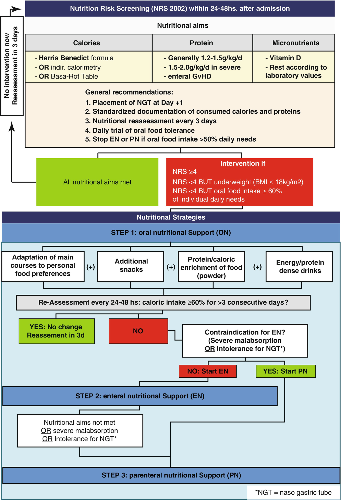

# Chapter 25. Nutritional Support

> **Source:** Sureda A, Corbacioglu S, Greco R, Kröger N, Carreras E (eds). *The EBMT Handbook: Hematopoietic Cell Transplantation and Cellular Therapies*, 8th ed. Springer, Cham; 2024. pp. 211–217. https://doi.org/10.1007/978-3-031-44080-9_25  
> **Authors:** Baumgartner, Annic; Schuetz, Philipp  
>   - Baumgartner, Annic: Medical University Clinic of Kantonsspital Aarau, University of Basel  
>   - Schuetz, Philipp: Kantonsspital Aarau, University of Basel  
> **License:** CC BY 4.0 (https://creativecommons.org/licenses/by/4.0/). Text reproduced verbatim from the open-access HTML edition; formatting converted to Markdown.

## Abstract

Patients undergoing HCT, particularly allo-HCT, are at risk for malnutrition (Fuji et al., Food Nutr Sci 3:417–421, 2012).

Based on “Supportive Care” in EBMT Handbook, 2009, by Tamás Masszi and Arno Mank.

## 25.1 Introduction

Patients undergoing HCT, particularly allo-HCT, are at risk for malnutrition (Fuji et al. 2012). Malnutrition is associated with poor clinical outcome, decreased OS, higher risk of infectious and immunologic complications, delayed neutrophil engraftment and prolonged hospital stay (Baumgartner et al. 2016, 2017). Importantly, most patients are well-nourished or even overweight upon admission to HCT but experience rapid deterioration of nutritional status during treatment (Fuji et al. 2014). Weight loss results from a complex interplay of toxic, inflammatory and immunological mechanisms leading to caloric deficits by anorexia as well as a catabolism of the metabolism.

Nutritional support is meant to reduce caloric deficit and reduce the risks for negative metabolic effects. However, there is a lack of large-scale trials proving benefit of nutritional interventions in this setting (Baumgartner et al. 2017). The current nutritional approach is thus based on physiological considerations and results of observational and some smaller interventional trials and needs to be adapted to an individual patient’s situation.

## 25.2 Screening for Malnutrition

Pre-existing malnutrition is an important additional risk factor in patients undergoing HCT. International guidelines such as the European Society of Enteral and Parenteral Nutrition (ESPEN) recommend screening for malnutrition at admission for transplantation (Bozzetti et al. 2009). There is no international consensus on how to assess malnutrition in this patient population. For reasons of practicability, the use of the NRS 2002 is generally recommended (Bozzetti et al. 2009). In the acute setting, weight assessment may be inaccurate because of inflammatory fluid retention.

## 25.3 Nutritional Recommendations (See General Recommendations in Table 25.1 and Fig. 25.1; Monitoring in Table 25.2 and Nutritional Strategies in Fig. 25.1)

### 25.3.1 Nutrition in Allo-HCT

#### 25.3.1.1 Route of Administration

Due to its positive effects on GI integrity and microbiome, enteral nutritional (EN) support is generally preferred over parenteral nutrition (PN) in case of a functioning GI tract.

**Table 25.1 Summary of general recommendations for nutritional support**

|                              |                                                                                                                                                     |
|------------------------------|-----------------------------------------------------------------------------------------------------------------------------------------------------|
| Screening for malnutrition   |                                                                                                                                                     |
| Indication                   | All patients to estimate risk for pre-existing malnutrition                                                                                         |
| Tools                        | NRS 2002                                                                                                                                            |
| Nutritional support          |                                                                                                                                                     |
| General management           | 1\. Early involvement of dietitians                                                                                                                 |
|                              | 2\. Consider placement of nasogastric tube on day +1                                                                                                |
|                              | 3\. Standardized monitoring of nutritional intake                                                                                                   |
|                              | 4\. Nutritional reassessment every 3 days using the NRS 2002                                                                                        |
| Indication of intervention   | 1\. Oral intake \<60% for 3 days consecutively                                                                                                      |
|                              | 2\. Consider nutritional support in all patients with preexisting malnutrition and/or BMI \<18                                                      |
| Discontinuation              | Oral intake \>50% for 3 days consecutively                                                                                                          |
| Estimation of caloric needs  | According to Harris–Benedict formula (ideal body weight)                                                                                            |
|                              | OR BASA-ROT table (25–30 kcal/kg ideal body weight)                                                                                                 |
| Route of nutritional support | 1\. Intensification of oral nutrition                                                                                                               |
|                              | 2\. Enteral nutrition                                                                                                                               |
|                              | 3\. Parenteral nutrition                                                                                                                            |
| Forms of nutritional support |                                                                                                                                                     |
| Intensified oral nutrition   | *Indication*: Malnutrition or underweight (BMI \<18 kg/m2) and preserved oral intake                                                     |
|                              | *Options*: Additional snacks rich in proteins and energy, protein or calorie enrichment of main courses, additional protein and energy drinks (ONS) |
|                              | *Standardized supplementation*: None                                                                                                                |
| Enteral nutrition            | *Indication*: If nutritional goals cannot be reached by oral support alone                                                                          |
|                              | *Standardized supplementation:*                                                                                                                     |
|                              |  Vitamin K once weekly                                                                                                                              |
| Parenteral nutrition         | *Indication*: If nutritional goals cannot be reached in patients with gastrointestinal failure and/or intolerance for NGT                           |
|                              | *Standardized supplementation:*                                                                                                                     |
|                              |  Lipid-soluble vitamins (ADEK)                                                                                                                      |
|                              |  Water-soluble vitamins                                                                                                                             |
|                              |  Trace elements                                                                                                                                     |
| Vitamin and trace elements   | Multivitamin generally recommended                                                                                                                  |
|                              | Vitamin D: Supplementation recommended (bolus of 40,000E at admission, maintenance therapy with 1500E orally per day                                |
|                              | Other vitamins or trace elements if overt deficiency                                                                                                |
| Immunonutrition              | Generally not recommended                                                                                                                           |

**Fig. 25.1**

Algorithm for guided nutritional support

**Table 25.2 Monitoring of nutritional parameters**

| Parameter                     | Frequency of assessment                                                  | Significance and implications                                        |
|-------------------------------|--------------------------------------------------------------------------|----------------------------------------------------------------------|
| Anthropometry                 |                                                                          |                                                                      |
| Weight                        | Daily                                                                    | Correlation with fluid balance                                       |
|                               |                                                                          | Evaluation of diuretics and albumin supplementation                  |
| Bioimpedance assessment       | Individually                                                             | Uncontrolled, unexplained weight loss                                |
|                               |                                                                          | Severe, prolonged inflammation                                       |
| Nutritional assessment        |                                                                          |                                                                      |
| Oral food consumption         | 3× daily                                                                 | Evaluation of nutritional support                                    |
| Laboratory parameter          |                                                                          |                                                                      |
| Albumin                       | Weekly                                                                   | Evaluation of supplementation in anasarca                            |
| Sodium, potassium             | Daily                                                                    | Adaptation of potassium supplementation                              |
| Calcium, magnesium, phosphate | Twice weekly                                                             | Adaptation of supplementation                                        |
|                               |                                                                          | CAVEAT refeeding, gastrointestinal loss                              |
| INR, quick                    | Twice weekly                                                             | Evaluation of supplementation                                        |
|                               |                                                                          | CAVEAT low content in certain products for EN/PN                     |
| Glucose                       | 3–6× daily if PN or preexisting diabetes mellitus otherwise twice weekly | Adaptation of insulin dose                                           |
| Creatinine                    | Daily                                                                    | Correction of fluid balance                                          |
|                               |                                                                          | CAVEAT toxic damage                                                  |
| Liver function tests          | Twice weekly                                                             | Evaluation of toxic damage, infection, hepatic GvHD, VOD, or relapse |
| Triglycerides                 | Twice weekly if PN                                                       | Adaptation of PN                                                     |
| Vitamin D                     | At admission                                                             | Begin routine supplementation                                        |
| Vitamin B12                   | At admission                                                             | Supplementation pretransplantational individually                    |

During allo-HCT, patients often experience GI failure so PN is used instead. Yet, higher risk of central line infections as well as hyperglycaemia associated with PN demand restricted use (Seguy et al. 2012).

Small, prospective, nonrandomized trials on EN found satisfying results on feasibility and safety with lower infection rates as well as beneficial effects such as earlier neutrophil engraftment and lower rates of severe GI GvHD (Seguy et al. 2012; Guièze et al. 2014). Some studies even report higher OS (Seguy et al. 2012). Results of a large prospective trial are expected (Lemal et al. 2015).

We encourage the use of EN as a first-line measure. Indication for PN should be limited to intolerance for nasogastric tube and GI failure including severe malabsorption or limited gastroenteral passage.

#### 25.3.1.2 Indications and Timing

There are few study data regarding optimal timing of nutrition. The ESPEN guidelines recommend implementation of nutritional support if oral caloric intake falls below 60–70% of basic requirements for 3 days consecutively (Bozzetti et al. 2009).

Discontinuation of EN or PN should be considered, if \>50% of daily requirements are met by oral intake (Bozzetti et al. 2009). To enhance early return to oral food intake patients should be encouraged to maintain minimal oral intake throughout therapy.

#### 25.3.1.3 Estimation of Caloric Needs

Most studies investigating energy expenditure by indirect calorimetry have been performed in small paediatric populations. Validity of the data for adults therefore is limited, and results are controversial (Sharma et al. 2012; Duro et al. 2008).

Determination of energy requirements based on calculations, e.g., by the BASA-ROT table or Harris–Benedict Formula, does not differ significantly from results by indirect calorimetry (Sharma et al. 2012; Valentini 2012; Harris and Benedict 1918). Therefore, we recommend estimation of energy requirements according to an adjusted Harris–Benedict formula.

### 25.3.2 Nutrition in Auto-HCT

In general, effects of auto-HCT on nutritional status are less pronounced. Nutritional support is not generally recommended and has to be evaluated individually in patients experiencing severe complications or in patients with pre-existing malnutrition.

### 25.3.3 Nutrition in Acute Gastrointestinal GvHD

GvHD of the digestive tract leads to excessive diarrhoea, abdominal pain, nausea, vomiting, gastrointestinal bleeding, dysphagia and malabsorption. Patients experience malnutrition to a higher extent and show significantly more additional complications (van der Meij et al. 2013).

Caloric demands are mainly driven by energy loss through diarrhoea. Enteral solutions should be low in fibre and fat and not contain lactose. Maintaining a minimal amount of oral or enteral nutrition facilitates early dietary recovery (Imataki et al. 2006; Andermann et al. 2016). Complete bowel rest and total PN are indicated in severe GvHD grade IV and stool volume \>1500 mL in 24 h (Bozzetti et al. 2009; Imataki et al. 2006).

Protein requirements are elevated. Recommendations range from 1.2 to 2.5 g/kg/day. We recommend aiming for 1.5–2 g/kg/day in the absence of severe renal impairment (Bozzetti et al. 2009; Muscaritoli et al. 2002).

Vitamin and trace elements are often deficient and need to be measured regularly to evaluate need of supplementation.

### 25.3.4 Low Bacterial Diet/Low Microbial Diet/Neutropenic Diet

A low microbial diet has been installed in the 1980s to prevent potential threat of food-borne infections from organisms colonizing the gastrointestinal tract.

There is no standardized protocol, and variations amongst centres, contradictions even, are high. Yet, there is no proof of efficacy in preventing infections or death.

In line with most current publications, we recommend safe food handling and strict hand hygiene as proposed by the FDA or the EC over a neutropenic diet.

## 25.4 Immunonutrition

A meta-analysis on glutamine found reduced severity and duration of mucositis and GvHD (Kota and Chamberlain 2017). To date, no randomized controlled trial showed a benefit on overall survival or reduction of infection rates (Crowther et al. 2009).

Pre- and probiotics may enhance diversity of the GI microbiome. So far, no study has evaluated their effects compared to placebo. Again, there might be a benefit on severity of GvHD (Ladas et al. 2016). Safety has been evaluated in a pilot study in children and adolescents and proved satisfying.

There are no randomized controlled trials assessing the benefits of omega-3 fatty acids or trace elements. Except for vitamin D, there is no proven benefit of a routine supplementation (Hall and Juckett 2013). Based on this data, we do not recommend routine use of immunonutrients.

## 25.5 Long-Term Follow-Up

Follow-up should include regular nutritional screening and documentation of weight, BMI, appetite, and functional status based on patients’ history. A balanced, Mediterranean diet can be recommended along with regular physical training to regain muscle mass. An increase in weight should be addressed early to avoid full development of a metabolic syndrome because of high baseline cardiovascular risk in transplanted patients.

Persisting malnutrition, especially in chronic GvHD, should be handled by an interdisciplinary team. Caloric needs seem to be elevated and often require in- and out-hospital nutritional support.

### Key Points

- There is high risk for malnutrition upon HCT treatment

- Malnutrition is an independent risk factor in these patients

- The potential benefit of all nutritional interventions remains largely unproven

- All dietary recommendations are based on physiological considerations and results of mainly observational trials

- Adherence to a systematic approach to nutritional support improves transparency, comparability, and generally reduces use of unnecessary PN

- Oral and enteral nutritional support is recommended over parenteral support in case of functioning gastrointestinal tract

- A minimal oral or enteral food intake is beneficial for recovery of mucosa and microbiome

- Immunonutrients did not show significant beneficial effects and therefore are not recommended for routine use

- Neutropenic diets did not show a benefit over safe food handling approaches

## References

- Andermann TM, Rezvani A, Bhatt AS. Microbiota manipulation with prebiotics and probiotics in patients undergoing stem cell transplantation. Curr Hematol Malig Rep. 2016;11:19–28.

- Baumgartner A, Zueger N, Bargetzi A. Association of nutritional parameters with clinical outcomes in patients with acute myeloid leukemia undergoing hematopoietic stem cell transplantation. Ann Nutr Metab. 2016;69:89–98.

- Baumgartner A, Bargetzi A, Zueger N, et al. Revisiting nutritional support for allogeneic hematologic stem cell transplantation—a systematic review. Bone Marrow Transplant. 2017;52:506–13.

- Bozzetti F, Arends J, Lundholm K, Micklewright A, Zurcher G, Muscaritoli M. ESPEN guidelines on parenteral nutrition: non-surgical oncology. Clin Nutr. 2009;28:445–54.

- Crowther M, Avenell A, Culligan D. Systematic review and meta-analyses of studies of glutamine supplementation in haematopoietic stem cell transplantation. Bone Marrow Transplant. 2009;44:413–25.

- Duro D, Bechard LJ, Feldman HA, et al. Weekly measurements accurately represent trends in resting energy expenditure in children undergoing hematopoietic stem cell transplantation. J Parenter Enter Nutr. 2008;32:427–32.

- Fuji S, Mori T, Lee V, et al. A multi-center international survey related to the nutritional support after hematopoietic stem cell transplantation endorsed by the ASIA Pacific Blood and Marrow Transplantation (APBMT). Food Nutr Sci. 2012;3:417–21.

- Fuji S, Mori T, Khattry N, et al. Severe weight loss in 3 months after allogeneic hematopoietic SCT was associated with an increased risk of subsequent non-relapse mortality. Bone Marrow Transplant. 2014;50:100–5.

- Guièze R, Lemal R, Cabrespine A, et al. Enteral versus parenteral nutritional support in allogeneic haematopoietic stem-cell transplantation. Clin Nutr. 2014;33:533–8.

- Hall AC, Juckett MB. The role of vitamin D in hematologic disease and stem cell transplantation. Nutrients. 2013;5:2206–21.

- Harris JA, Benedict FG. A biometric study of human basal metabolism. Proc Natl Acad Sci U S A. 1918;4:370–3.

- Imataki O, Nakatani S, Hasegawa T, et al. Nutritional support for patients suffering from intestinal graft-versus-host disease after allogeneic hematopoietic stem cell transplantation. Am J Hematol. 2006;81:747–52.

- Kota H, Chamberlain RS. Immunonutrition is associated with a decreased incidence of graft-versus-host disease in bone marrow transplant recipients: a meta-analysis. JPEN J Parenter Enteral Nutr. 2017;41:1286–92.

- Ladas EJ, Bhatia M, Chen L, et al. The safety and feasibility of probiotics in children and adolescents undergoing hematopoietic cell transplantation. Bone Marrow Transplant. 2016;51:262–6.

- Lemal R, Cabrespine A, Pereira B, et al. Could enteral nutrition improve the outcome of patients with haematological malignancies undergoing allogeneic haematopoietic stem cell transplantation? A study protocol for a randomized controlled trial (the NEPHA study). Trials. 2015;16:136.

- Muscaritoli M, Grieco G, Capria S, Iori AP, Rossi FF. Nutritional and metabolic support in patients undergoing bone marrow transplantation. Am J Clin Nutr. 2002;75:183–90.

- Seguy D, Duhamel A, Rejeb MB, et al. Better outcome of patients undergoing enteral tube feeding after myeloablative conditioning for allogeneic stem cell transplantation. Transplantation. 2012;94:287–94.

- Sharma TS, Bechard LJ, Feldman HA, et al. Effect of titrated parenteral nutrition on body composition after allogeneic hematopoietic stem cell transplantation in children: a double-blind, randomized, multicenter trial. Am J Clin Nutr. 2012;95:342–51.

- Valentini L. The BASA-ROT table: an arithmetic-hypothetical concept for easy BMI-, age-, and sex-adjusted bedside estimation of energy expenditure. Nutrition. 2012;28:773–8.

- van der Meij BS, de Graaf P, Wierdsma NJ, et al. Nutritional support in patients with GVHD of the digestive tract: state of the art. Bone Marrow Transplant. 2013;48:474–82.
