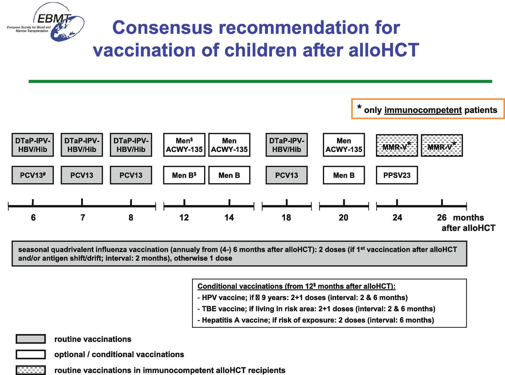

# Chapter 29. Vaccinations

> **Source:** Sureda A, Corbacioglu S, Greco R, Kröger N, Carreras E (eds). *The EBMT Handbook: Hematopoietic Cell Transplantation and Cellular Therapies*, 8th ed. Springer, Cham; 2024. pp. 249–264. https://doi.org/10.1007/978-3-031-44080-9_29  
> **Authors:** de la Cámara, Rafael; Meisel, Roland  
>   - de la Cámara, Rafael: Hospital de la Princesa  
>   - Meisel, Roland: Heinrich-Heine-University  
> **License:** CC BY 4.0 (https://creativecommons.org/licenses/by/4.0/). Text reproduced verbatim from the open-access HTML edition; formatting converted to Markdown.

## Abstract

Vaccination should be considered a *routine practice for all HCT receptors*, either autologous or allogeneic, adults or children. It should be implemented in all HCT programs. Adult cover is particularly important as they represent 90% of HCTs.

## 29.1 General Concepts

Vaccination should be considered a *routine practice for all HCT receptors*, either autologous or allogeneic, adults or children. It should be implemented in all HCT programs. Adult cover is particularly important as they represent 90% of HCTs. To obtain this objective, the following are necessary:

- To have in place a standardized program specific for HCT patients.

- The collaboration of the Preventive Department of the hospital and primary care physicians.

- The program must be simple, with a clear chronology, and convenient for the patient and physician (no increase in the number of visits).

- FACT-JACIE Standards (version 8.1, December 2021) require that policies/SOP are in place for posttransplant vaccination schedules and indications.

*The vaccination program should include* not only the patient but also those who live with the patient and the healthcare workers (HCWs).

*There is not a unique vaccine schedule for all HCT patients*. Each center should discuss and adapt a specific vaccine program.

- The practical application of the immunization programs shows important variations across centers (Miller et al. 2017).

- Auto-HCT recipients are generally vaccinated with the schedule used for allogeneic recipients with small differences (see Table 29.1).

&nbsp;

**Table 29.1 ECIL recommendations for allogeneic-HCT recipients (Cordonnier et al. 2019 )**

<table>
<thead>
<tr>
<th>
Vaccine
</th>
<th>
No. of dosesa
</th>
<th>
Time post-HCT to initiate vaccine
</th>
<th>
Grading
</th>
</tr>
</thead>
<tbody>
<tr>
<td>
<strong>Influenza</strong> (inactivated)
</td>
<td>
1 (or 2, special cases)b
</td>
<td>
 • &gt;6 months

 • As long as patient is judged to be IS

 • Yearly, lifelong

 • From 3 months in case of a community outbreak
</td>
<td>
AIIr

BIIr

BIIr
</td>
</tr>
<tr>
<td>
<strong>Measles–mumps–rubella</strong>

 • Measles

In sero(−) patients, with no GVHD, no IS, no REL of underlying disease, and no IGIV during the previous months, at least 3 months, ideally between 8 and 11 months

 • Rubella

In sero(−) women and of childbearing potential, with same precautions as for measles vaccine
</td>
<td>
1 (2 in children) MMR

1 MMR
</td>
<td>
 • ≥24 months

≥12 months in case of measles outbreak in patients with low-grade IS

 • ≥24 months
</td>
<td>
BIIu

CIII

CIIu
</td>
</tr>
<tr>
<td>
<strong>Virus hepatitis B</strong>c

 • Sero(−) patients before HCT and patients vaccinated pre-HCT but lost their immunity at 6 months)

 • Previously infected and anti-HBs &lt;10 IU/L

 • Sero(−) patients with a donor with positive anti-HBc
</td>
<td>
3d
</td>
<td>
6–12 months

6–12 months

Vaccine before transplant
</td>
<td>
BIIt

BIII

BIII
</td>
</tr>
<tr>
<td>
<strong>Human papilloma virus</strong> (HPV)

Follow recommendations for general population in each country
</td>
<td>
According to official label
</td>
<td>
From 6 to 12 months
</td>
<td>
BIIu
</td>
</tr>
<tr>
<td>
<strong>Inactivated polio</strong>
</td>
<td>
3e
</td>
<td>
6–12 months
</td>
<td>
BIIu
</td>
</tr>
<tr>
<td rowspan="2">
<strong>Live-attenuated varicella vaccine</strong>
</td>
<td>
1
</td>
<td>
Can be considered in sero(−) patients, with ALL the following: &gt;24 m from HCT, no GVHD, no IS, no REL of the underlying disease, and no IGIV in the previous months, at least 3 months, ideally between 8 and 11 months
</td>
<td>
BIIr
</td>
</tr>
<tr>
<td>
2
</td>
<td>
The addition of a second dose in adults may be considered in patients who were sero(−) before HCT or had no history of VZ infect
</td>
<td> </td>
</tr>
<tr>
<td>
<strong>Live-attenuated zoster vaccine</strong>
</td>
<td colspan="2">
Not recommended
</td>
<td>
DIII
</td>
</tr>
<tr>
<td>
<strong>Pneumococcal conjugate</strong> (PCV)

<strong>Polysaccharidic vaccine</strong>

In case of GVHD, use PCV instead of PPS for this fourth dose (BIIr)
</td>
<td>
3

1
</td>
<td>
3 months

12 months (no earlier than 8 weeks after last PCV)
</td>
<td>
AI

BI
</td>
</tr>
<tr>
<td>
<strong>Meningococcal conjugate</strong> (in accordance with country recommendations and local prevalence)
</td>
<td>
2
</td>
<td>
From 6 months

 • For men-C or tetravalent vaccine

 • For men-B vaccine
</td>
<td>
BIIu

BIII
</td>
</tr>
<tr>
<td>
<strong><em>Haemophilus influenzae conjugate</em></strong>
</td>
<td>
3
</td>
<td>
3 months or 6 months
</td>
<td>
BIIr
</td>
</tr>
<tr>
<td>
<strong>Diphtheria-tetanus</strong> (DT is preferred to Td CIII)
</td>
<td>
3e
</td>
<td>
From 6 months
</td>
<td>
BIu
</td>
</tr>
<tr>
<td>
<strong>Pertussis (acellular)</strong> (DTaP is preferred over Tdap CIII)
</td>
<td>
3e
</td>
<td>
From 6 to 12 months
</td>
<td>
CIII
</td>
</tr>
</tbody>
</table>

1.  *Note* for auto-HCT: same recommendations but grading changes for some vaccines
2.  aIf not specified otherwise, the interval between dose is 1 month
3.  bInfluenza: a second dose of influenza vaccine, after 3–4 weeks from the first, may have a marginal benefit and should preferably be considered in patients with severe GVHD or low lymphocyte count (B II r) and also for the patients vaccinated early (from 3 months after transplant) (B II r). Children ≥6 months through 8 years, receiving influenza for the first time after transplant, should receive a second dose at least 4 weeks after the first dose
4.  cHBV. After posttransplant vaccination, if anti-HBs are \<10 mIU/mL 1–2 months after the initial series of three vaccine doses, an additional three doses should be considered, but the benefit of this second series of vaccination is uncertain. IDSA guidelines (Rubin et al. 2014): give the same recommendations (strong, low); for adolescents and adults, a high dose of vaccine (40 μg) is recommended for these booster doses (strong, low)
5.  dThree doses: interval 0, 1, and 6 months
6.  eAt 1–2 months interval

### *Reasons for universal vaccination* of HCT patients

- *General interest*: as a general healthcare principle, all the population should be correctly vaccinated, including adults and of course HCT recipients. If an increasing collective of patients, like HCT, is not well vaccinated, which can generate holes of immunity that can be a risk for the health of the general population.

- *Individual interest for each HCT patient*: vaccination protects the patient against infections that can cause important morbi-mortality. There are frequent infections in HCT that have safe vaccines (pneumococcus, influenza, and HBV) and other rare infections associated with high mortality that have an unsatisfactory prevention/treatment but can be prevented by immunization (tetanus, diphtheria, measles, and polio).

## 29.2 General Principles of Vaccination in HCT Patients

### 29.2.1 The Pretransplant Vaccination

The pretransplant vaccination is not effective to maintain a prolonged posttransplant immunity. In order to protect the HCT recipient, a complete series of posttransplant vaccinations is required. This is different from what is recommended for solid organ transplant (SOT) recipients for whom pretransplant vaccination is an essential part of the vaccination program. Post-HCT recipients should be viewed as “never vaccinated” regardless of the pre-HCT vaccination history of the recipient or the donor (Rubin et al. 2014).

### 29.2.2 The Pre-HCT Immunity

The pre-HCT immunity for a specific pathogen is not a reason to withhold vaccination after transplant. The majority of patients will lose their immunity after HCT.

As a general rule, *live vaccines should be considered contraindicated* (there are exceptions, see later). The inactivated, subunit, or protein/polysaccharide vaccines can be safely administered.

There are few randomized trials in HCT recipients, and many of the studies have been done in patients transplanted with BM/PB, using MAC. The experience with other sources (CBU), conditioning regimens (RIC), and donors (haplo) is scarce.

Many vaccines are administered by *intramuscular route*, which can be a problem for severe thrombocytopenic patients (less than 50 × 10⁹ platelets/L). For severe thrombocytopenic patients, some vaccines can be safely administered SC (inactivated poliomyelitis, conjugate pneumococcal vaccine) or even intradermic route (for influenza vaccine). Clinical experience suggests that intramuscular injections are safe if the platelet count is ≥30–50 × 10⁹/L, a ≤23-gauge needle is used, and constant pressure is maintained at the injection site for 2 min (Rubin et al. 2014).

### 29.2.3 The Dose of Vaccine

The dose of vaccine used is the same for general population, with some exceptions (see Table 29.1). A uniform specific interval between doses cannot be recommended, as various intervals have been used in studies. As a general guideline, a minimum of 1 month between doses may be reasonable.

### 29.2.4 Several Patient and Vaccine Characteristics Impact on the Vaccine Response

#### 29.2.4.1 Time from Transplantation

As a general rule, the later time a vaccine is administered, the better response is obtained (there are exceptions; see pneumococcal vaccine section). Usually \>12 months from transplant is associated with better responses.

Postponing vaccination with a non-live vaccine should be the exception. Reasonable situations to postpone vaccination with a non-live vaccine are: recent rituximab administration (\<6 months); profound hypogammaglobulinemia (\<3 g/L); unstable condition (due to uncontrolled grade 3–4 acute GVHD, uncontrolled infection, and admission to intensive care unit); and current treatment with ATG. The presence of GVHD under control with treatment should not delay vaccination. Some centers delay vaccination until the patient shows a minimum level of lymphocytes (for example, \>200 CD4/μL). However, there are no data to support any specific lymphocyte level for starting vaccines, and delaying the vaccination increases the at-risk period for the patient.

#### 29.2.4.2 Type of Vaccine

T-cell-dependent vaccines obtains better response than T-cell-independent vaccines because it triggers memory response that leads to a longer protection compared with T-cell-independent vaccine.

#### 29.2.4.3 Other Factors

*The presence of GVHD or ongoing IS treatment* has been associated with a decrease in vaccine response, particularly for polysaccharide-based vaccines.

- Some vaccine responses seem to be not impaired by the presence of GVHD/IS treatment. This is the case of conjugated *Haemophilus* vaccine, conjugated pneumococcal vaccine, conjugated meningococcal vaccine, inactivated polio vaccine, and diphtheria-tetanus vaccine.

- International guidelines recommend different attitudes in patients with GVHD for the moment of vaccine administration.

- Although GVHD may impair response to vaccines, these patients have higher risk of infection and are likely to benefit from vaccination.

### *The use of rituximab* decreases serological vaccine response at least to tetanus, influenza, and SARS-CoV-2.

- ECIL 2019 guidelines (Cordonnier et al. 2019): patients who have received rituximab from transplant should have their vaccine program delayed at least more than 6 months after the last dose. As the antibody response is uncertain, specific antibody assessment after vaccination can be helpful.

### 29.2.5 Types of Vaccines in HCT Recipients

### *Generally recommended for all HCT* (auto and allogeneic)

- Influenza (inactivated/subunit), SARS-CoV-2, poliomyelitis (inactivated), human papillomavirus, pneumococcus*, Haemophilus influenzae*, hepatitis B, meningococcus, tetanus, diphtheria, pertussis, and measles–mumps–rubella (special conditions, see Sects. 29.4 and 29.5).

### *Optional/special situations*, to cover situations such as after disease exposure or before travel to areas endemic for infections

- Hepatitis A, tick-borne encephalitis (see Chap. 38, Sect. 38.7.2), Japanese B encephalitis, rabies, yellow fever (live), varicella (Varivax^(®), live).

### *Contraindicated*: As a general rule, *all live vaccines*

- Oral polio vaccine, bacillus Calmette–Guérin, oral typhoid, zoster vaccine (Zostavax^(®)), intranasal influenza vaccine, and oral rotavirus vaccine.

- The exceptions for this rule are live vaccines for measles–mumps–rubella that are recommended following strict safety rules (see Sect. 29.4), yellow fever (live) (see specific section), and varicella (Varivax^(®), live); all these vaccines are contraindicated (DIII) before 24 months post-HCT or in case of active GVHD or IS.

#### 29.2.5.1 Use of IVIG and Vaccines

For inactivated vaccines, Ig do not inhibit immune responses. For live virus vaccines, vaccination should not be administered *at least 3 months and ideally 8 months after the last immunoglobulin infusion.*

## 29.3 Benefits and Risks of Vaccination in HCT Recipients

### 29.3.1 Benefits

#### 29.3.1.1 Direct Benefits

The prevention of the specific infectious disease targeted by the vaccine, as shown by pneumococcus, influenza, SARS-CoV-2, and varicella-zoster (subunit vaccine) vaccination. Nonetheless, the majority of the efficacy studies in HCT recipients are based on surrogate markers (serology response) and not on the demonstration of a reduced risk of the infectious disease.

#### 29.3.1.2 Indirect Benefits

The benefits of vaccination can go beyond the prevention of a particular infection, as shown by influenza vaccine. Influenza immunization with inactivated vaccine is recommended by cardiologists as part of comprehensive secondary prevention with the same enthusiasm as the control of cholesterol, blood pressure, and other modifiable risk factors (Davis et al. 2006). In patients with cardiovascular disease, influenza vaccination is associated with a lower risk of all-cause, cardiovascular mortality, and major adverse cardiovascular events compared with control (Yedlapati et al. 2021). Although all these studies were performed in general population, it is logical to assume a similar trend in HCT recipients.

### 29.3.2 Risks

Evidence indicates that *inactivated vaccines* have the same safety profile in immunocompromised patients as in immunocompetent individuals (Beck et al. 2012; Rubin et al. 2014; Cordonnier et al. 2019), and there is no evidence that they induce or aggravate GVHD (Cordonnier et al. 2019). The exception is the SARS-CoV-2 vaccine. There is a risk of worsening/eliciting GVHD in allogeneic HCT recipients with SARS-CoV-2 vaccines. This risk needs to be considered when deciding about time for vaccination (Cesaro et al. 2022). It is possible that the risk for GVHD using the protein-subunit vaccine might be lower and could be considered in individual patients after careful risk assessment (Cesaro et al. 2023).

*Live vaccines* represent a real risk for HCT and should not be used except in special situations with strict requirements (see section of varicella vaccine and ECIL vaccination guidelines table). Fatal disseminated VZV infections due to vaccine strain have been reported in HCT recipients after varicella vaccine and zoster vaccine, even when vaccine was administered several years after transplant (Cordonnier et al. 2019).

## 29.4 Vaccination Recommendations

There are several international recommendations focused on HCT recipients. The best known are those by the Infectious Disease Working Party (IDWP) of the EBMT, ECIL, CDC, NCCN, and Infectious Diseases Society of America (IDSA). Here, we follow the ECIL recommendations (Cordonnier et al. 2019). *A specific recommendation for vaccination of children after HCT generated and endorsed by the Pediatric Diseases Working Party of EBMT is provided in* Sect. 29.6 and Fig. 29.1.

**Fig. 29.1**

Recommended and optional/conditional vaccinations after allogeneic hematopoietic cell transplantation in childhood.

DTaP-IPV-HBV/Hib, hexavalent diphtheria, tetanus, acellular pertussis, inactivated poliovirus, hepatitis B, Haemophilus influenzae type B vaccine; PCV13, 13-valent pneumococcal conjugate vaccine; Men ACWY-135, quadrivalent meningococcal conjugate vaccine; Men B, recombinant meningococcal type B vaccine; PPSV23, 23-valent pneumococcal polysaccharide vaccine; MMR-V, live attenuated measles, mumps, rubella, varicella-zoster virus vaccine; HPV, human-papilloma-virus vaccine; TBE, tick-born-encephalitis vaccine; HAV, hepatitis A vaccine. \#Start of vaccination at 3 months post-HCT possible after individual risk–benefit analysis (please refer to text). \$Start of vaccination at 6 months post-HCT possible after individual risk–benefit analysis (please refer to text). \*Only immunocompetent patients post-HCT, if ≥3 months without immunosuppressive therapy and ≥3 months without active cGvHD

The IDWP of the EBMT was one of the first cooperative groups that published recommendations specific for HCT recipients. The first ones were published in 1995, with updates in 1999 and 2005. In 2017, guidelines were reviewed and updated under the umbrella of the ECIL group, (Cordonnier et al. 2019) (Table 29.1).

For SARS-CoV2, there are specific guidelines for HCT recipients. IDWP-EBMT had published several updates (https://www.ebmt.org/covid-19-and-bmt). ECIL recently updates vaccine recommendations in the ECIL-9 meeting (Cesaro et al. 2022, 2023). For a summary of SARS-CoV-2 vaccination in HCT recipients, see Chap. 38.

## 29.5 Specific Vaccines

### 29.5.1 Influenza

#### 29.5.1.1 Clinical Manifestations

Twenty percent of HCT with confirmed influenza are afebrile.

It is a serious disease in HCT: one-third develops pneumonia, 10% requires mechanical ventilation, and 6% died (Ljungman et al. 2011) (i.e., 100–300 times higher the mortality of influenza in general population). Other complications include encephalitis, which can be lethal, and myocarditis.

#### 29.5.1.2 Influenza and Cardiovascular Disease (CVD)

The majority of influenza deaths are related to lung complications. Nonetheless, in general population up to a third of deaths related to influenza are CV deaths (Loomba et al. 2012).

The risk of acute myocardial infarction is significantly increased after laboratory-confirmed influenza infection (Kwong et al. 2018).

HCT recipients are at high risk of developing CVD. At 10 years, 8% will develop CVD (Armenian et al. 2012).

#### 29.5.1.3 Vaccine

### Evidence of Vaccine Efficacy

- A retrospective study showed a protection rate of 80% in the rates of virologically confirmed influenza (Machado et al. 2005).

- A systematic review and meta-analysis showed significantly lower odds of influenza-like illness after vaccination in transplant recipients (HCT and SOT) compared with patients receiving placebo or no vaccination (Beck et al. 2012). Seroconversion and seroprotection were lower in transplant recipients compared with immunocompetent controls.

- Given the suboptimal immunogenicity in HCT recipients, family members and healthcare professionals involved in the care of these populations should be vaccinated.

### Vaccine Response (Engelhard et al. 2013; Cordonnier et al. 2019)

- Longer interval from transplant is associated with better serology response. Vaccination within the first 6 months after transplant produces poor serology responses. Nonetheless, seasonal vaccination against influenza can boost the cellular immune response in HCT recipients as early as 3 months after HCT, but the protective effect is lower compared with healthy controls (Engelhard et al. 2013).

- Conflicting data exist on the benefit of a second dose of vaccine, and marginal benefit was seen with the use of GM-CSF.

- In a recent randomized phase II trial in pediatric allogeneic-HCT, high-dose (60 μg) antigen trivalent IIV was more immunogenic but induced more injection-site reactions than a standard dose (15 μg) (Schuster et al. 2023).

- Rituximab administration during the year before vaccination was associated with a lack of seroprotective titer.

- Active GVHD and low lymphocyte counts at vaccination are associated with poor immune response.

*Live, attenuated influenza vaccine* is contraindicated in HCT recipients.

### 29.5.2 Respiratory Syncytial Virus (RSV)

RSV is a frequent and serious infection in HCT recipients and occur in 1–12% of adult patients with hematological malignancy and HCT. Progression to LRTID is observed in 38% of leukemia and HCT recipients, with an average mortality of 32% (range, 0–70%) (Hirsch et al. 2013).

Recently, 2 RSV vaccines have been approved by the FDA in May 2023 \[Abrysvo (Pfizer; unadjuvanted) (Walsh et al. 2023) and Arexvy (GSK; uses same adjuvant as Shingrix) (Papi et al. 2023)\], and one by EMA in June 2023 (Arexvy). Both are indicated for active immunization for the prevention of lower respiratory tract disease (LRTD) caused by respiratory syncytial virus in adults 60 years of age and older. Both use a recombinant glycoprotein F stabilized in the prefusion conformation. Both vaccines demonstrated significant vaccine effectiveness against RSV-induced lower respiratory tract infection (85.7–82.6%) among older adults that lasted over at least 2 consecutive seasons. Co-administration with influenza vaccine appears safe without a statistically significant effect on vaccine effectiveness for either vaccine. Availability of both vaccines is anticipated for the 2023–2024 winter RSV season (mid-September through mid-May; peaks late December to mid-February).

Neither has been studied in immunocompromised patients, including HCT. Studies have to be done, but as with other protein recombinant vaccines, no serious problems are anticipated.

### 29.5.3 Measles, Mumps, and Rubella

### The clinical impact and the reasons for immunization in HCT recipients differ among these viruses

- *Measles*: Severe and also fatal measles infections (pneumonia, encephalitis) have been reported in HCT recipients. The aim of vaccination is to protect the patient of severe consequences of infection.

- *Rubella*: There are no reports of severe rubella disease occurring in HCT recipients. The main indication for rubella vaccination is the prevention of congenital rubella in fertile women.

- *Mumps*: There are no reports of severe mumps occurring in HCT recipients. The indication for mumps vaccination is therefore weak. There is no indication for routine mumps vaccination after HCT. However, mumps is included in combination vaccines with measles and rubella.

#### 29.5.3.1 Vaccines

Only live-attenuated vaccines are available. Presentations: measles alone, combined measles–mumps–rubella, combined measles–mumps–rubella–varicella (live).

### 29.5.4 Hepatitis B Virus (HBV)

### *Prevention of infection and reverse seroconversion*

- Approximately 40–70% of HCT recipients obtain a titer of anti-HBs of \>10 mIU/mL after post-HCT vaccination, a rather low response compared with healthy controls. Even those who fail to obtain a response may benefit from vaccination as it can prevent reverse seroconversion.

- Patients who have evidence of a previously resolved hepatitis B infection prior to the transplant (i.e., HBsAg negative but anti-HBs and/or anti-HBc) are at risk or reverse seroconversion.

- Immunization for HBV can prevent HBV reverse seroconversion even in non-responders to hepatitis B vaccine after allo-HCT (Takahata et al. 2014). Probably, antigen-specific memory T-cells and cytotoxic T-cells induced by hepatitis B vaccine are largely responsible for the prevention of reverse seroconversion in non-responders to the vaccine. This reinforces the need of HBV vaccination.

### 29.5.5 Human Papilloma Virus (HPV)

In HCT, women nearly 40% will have genital HPV infection in long-term follow-up (Shanis et al. 2018). HPV is associated with cervical, vulvar, and vaginal cancer in females, penile cancer in males, and anal cancer and oropharyngeal cancer in both females and males.

In long-term survivors, second neoplasias are a significant complication after allo-HCT. Cervix cancer is one of the most frequent. Squamous cell cancers, the commonest posttransplant solid tumors, are associated with HPV infection. Genital HPV disease is a significant late complication of allo-HCT, occurring in one-third of women. Prolonged systemic IS treatment for cGVHD is associated with a higher risk of developing HPV-related squamous intraepithelial lesions.

Regular gynecologic examination, cervical cytology, and HPV testing after HCT are recommended for all women (Majhail et al. 2012) as preventing measure for HPV-related cancer and as a tool for early diagnose and treatment of genital GVHD.

#### 29.5.5.1 Vaccine

- HPV vaccine is a noninfectious, virus-like particle (VLP) vaccine. There are three formulations of HPV vaccines that differ in the number of HPV covered: a 9-valent HPV vaccine (6, 11, 16, 18, 31, 33, 45, 52, and 58 VLPs) (Gardasil 9^(®)), quadrivalent HPV vaccine (6, 11, 16, and 18 VLPs) (Gardasil^(®)), and bivalent vaccine (16, 18 VLPs) (Cervarix^(®)).

- The experience with HPV vaccine in HCT is limited, 20 children (MacIntyre et al. 2016) and 64 adults (Stratton et al. 2020), but shows a good immune response, similar to health women, with no specific safety issue.

- HPV vaccine is recommended in all guidelines (Ljungman et al. 2009; Hilgendorf et al. 2011; Rubin et al. 2014; Cordonnier et al. 2019) but with a low grade of recommendation (B II u to C III) due to the limited experience in HCT recipients. The recommended number of doses is three (Hilgendorf et al. 2011; Rubin et al. 2014).

### 29.5.6 Poliovirus

The WHO European Region was declared polio-free in 2002. Imported wild-type and vaccine-type polioviruses still remain a threat to unvaccinated people in the EU/EEA. Maintaining high vaccination coverage in all population groups remains an essential tool for keeping Europe polio-free.

Only inactivated poliovirus vaccines are used in all EU/EEA countries.

Oral polio vaccine (OPV) is contraindicated for HCT recipients due to the risk of paralytic poliomyelitis. This complication has occurred after vaccination of patients with severe combined immune deficiency and acute lymphoblastic leukemia but has not been described in HCT recipients.

### 29.5.7 Varicella Zoster Virus (VZV)

#### 29.5.7.1 Prevention of VZV After HCT

Antiviral prophylaxis (acyclovir/valacyclovir) is the primary mode of prevention. It should be given for at least 1 year after allo-HCT and for 3–6 months after auto-HCT (Cordonnier et al. 2019).

#### 29.5.7.2 Types of Vaccines

There are three available vaccines.

- Live-attenuated varicella vaccine, a low-titer VZV vaccine (Varivaxl^(®), Varilixl^(®)). It is also available in combination in the same vaccine with measles, mumps, and rubella.

- Varicella vaccine can be used in HCT following strict requirements (see ECIL and IDSA vaccination guidelines) (Cordonnier et al. 2019; Rubin et al. 2014). Although vaccination with varicella-attenuated vaccine is indicated/considered in guidelines, in practice it is rarely used due to concerns of safety, particularly in adults (Miller et al. 2017). The commercial availability of the VZ subunit vaccine makes the use of attenuated vaccines even lower.

- Live-attenuated zoster vaccine, a high-titer vaccine (Zostavaxl^(®)). It contains more than 14 times more virus than varicella vaccine. In all guidelines, this vaccine is contraindicated in HCT patients.

- New adjuvanted VZV subunit vaccine (Shingrixl^(®))

- *Adjuvanted VZV subunit vaccine* (Shingrix^(®)) consists of recombinant VZV gE antigen mixed with AS01B adjuvant. It was approved by the FDA (October 2017) and EMA (March 2018) for the prevention of herpes zoster (HZ) and post-herpetic neuralgia in adults 50 years of age or older, and in adults 18 years of age or older at increased risk of HZ (in this group, HCT recipients are included). This vaccine is not indicated for the prevention of primary varicella infection (chickenpox). It is administered IM in two doses separated by 60 days.

  In a randomized phase 3, double-blind trial in auto-HCT (Bastidas et al. 2019), 2 doses of adjuvanted VZV subunit vaccine (or placebo) were given: the first at 50–70 days after HCT and the second dose 1–2 months thereafter. The vaccine showed a 68.2% efficacy in preventing post-transplant zoster and 89% in preventing post-herpetic neuralgia. The vaccine was well-tolerated, and most symptoms were mild and transient. At the time of ECIL-7 (Cordonnier et al. 2019) guidelines publication, this study was not published and therefore this vaccine was not commented on the guidelines. Nonetheless, this vaccine has been incorporated to the routine vaccination calendar in many HCT centers. It is also recommended in the last NCCN guidelines (National Comprehensive Cancer Network 2023) for auto-HCT and can be considered in allogeneic.

  No randomized study has been done in allogeneic HCT with adjuvanted VZV subunit vaccine, and only limited experience is available. Therefore, the efficacy and safety of this vaccine in allogeneic-HCT have not been established.

### 29.5.8 Pneumococcus

Pneumococcus is a frequent and *serious complication in HCT*. The incidence of invasive pneumococcal disease (IPD) in HCT is 50 times higher compared to the general population (Shigayeva et al. 2016). In spite of this high incidence of IPD, less than one in five HCT recipients with IPD had received pneumococcal vaccine.

#### 29.5.8.1 Types of Vaccine

- Polysaccharidic (PS) vaccine.

  - 23-valent polysaccharidic (PS) vaccine (Pneumo 23^(®), Pneumovax23^(®)): poor immunogenic, T-cell-independent response, no boost benefit

  - Poor responses, particularly in patients with GVHD.

  - PS after PCV vaccine increases and expands the response obtained with PCV. Some non-responders to PCV will achieve a response with PS vaccine.

- Conjugate vaccine (PCV): highly immunogenic, T-cell-dependent response, with boost benefit.

  - 13-valent in the majority of countries (Prevenar 13r^(®)) (that replace the previous 7-valent vaccine) or 10-valent available in some countries (Synflorix^(®)).

  - Five trials have shown a good response to PCV after three doses (range 54–98%). Four trials used 7-valent conjugated vaccine and one the 13-valent vaccine (Cordonnier et al. 2019). These responses are much better compared with what is obtained with PS vaccine.

  - Early vaccination at 3 months is not inferior to late vaccination (9 months) after allo-HCT.

  - PCV should always be administered before PS vaccine.

Conjugate vaccine (PCV) has shown higher efficacy in preventing invasive pneumococcal disease (IPD) compared to polysaccharidic (PS), both in autologous and allogeneic HCT recipients (Roberts et al. 2020).

### 29.5.9 Diphtheria–Tetanus–Pertussis

The exposure to *tetanus* in the environment is a real risk for HCT recipients, so the aim of vaccination after transplant is to protect the patient.

*Diphtheria* has essentially been eradicated, but ongoing vaccination is critical for immunity. Diphtheria cases are still happening in Europe with an increase of 280% from 2009 to 2014. The reappearance of diphtheria cases in countries like Spain diphtheria-free for more than 30 years (Jane et al. 2018) is alarming and another reason to vaccine all our HCT recipients.

There are very limited published data of *pertussis* in HCT and no reported case of severe or fatal pertussis infection after HCT in adults. Therefore, the objective of vaccination in these patients is avoiding pertussis transmission by HCT recipients.

## 29.6 Vaccinations in Children Post-allogeneic Hematopoietic Cell Transplantation

Early and comprehensive re-immunization is important post-HCT and should recognize stepwise recovery of the immune system after HCT and potential impact of immunosuppressive therapy (IST) for prophylaxis/treatment of GvHD that impacts immune recovery.

An expert group of pediatric infectious disease and transplant physicians within the Pediatric Diseases Working Party of the EBMT identified the specific clinical demand, reviewed currently available evidence *focusing on the pediatric age group* and in 2021, generated the current consensus recommendation detailed in Fig. 29.1 and publication (Ifversen et al. 2021). Major aspects are summarized in the following paragraphs.

### 29.6.1 General Principles for Immunization Post-HCT in Children

Based on data from a retrospective analysis of revaccination of pediatric HCT recipients from Great-Britain (Patel et al. 2007), the prospective IKAST trial on vaccination of children after HCT (Meisel et al. 2007), and a trial on 13-valent pneumococcal conjugate vaccination in HCT recipients (Cordonnier et al. 2015), the following recommendations are made:

- Use a fixed starting time point for re-vaccination with the newborn DTaP/IPV/HBV/Hib combination vaccine and the 13-valent pneumococcal conjugate (PCV13) vaccine 6 months post-HCT \[if leukocyte engraftment and platelets ≥50 × 10(9)/L\] and immunize irrespective of donor/graft type, GvHD, IST, and/or measures of immune recovery.

- Use combination vaccine DTaP/IPV/HBV/Hib irrespective of chronologic age.

- Optional/conditional vaccinations should not interfere with evidence-based immunizations (DTaP/IPV/HBV/Hib, PCV13) starting at 6 months. Optional/conditional vaccinations preferably start at 12 months post-HCT.

- Immunization with *non-live vaccines* is safe during IVIG replacement as there is no specific risk besides non-response. Check titers 3 months after stopping IVIG.

- Start vaccination with live vaccines (MMR-V) not earlier than 24 months post-HCT and restrict to immunocompetent patients without GvHD and IST ≥3 months and off IVIG substitution.

- Consider checking antibody concentrations prior and 1 month after primary series in patients with GvHD, IST, IVIG treatment, and/or delayed immune reconstitution.

Additional note: Single-center experience indicates that providing non-live vaccines earlier than 6 months post-HCT may be feasible in children with very swift immune recovery. However, there are no published data on this policy and limited induction of immunologic memory and duration of protection must carefully be weighed against potential earlier protection.

### 29.6.2 Specific Recommendation for Selected Vaccines

#### 29.6.2.1 Influenza

High risk for life-threatening influenza-virus infection post-HCT mandates annual immunization with inactivated influenza vaccines comprising quadrivalent strain coverage. Two doses should be given for first influenza vaccination post-HCT and after antigenic shift/drift.

#### 29.6.2.2 Pneumococcus

PCV13 comprises the majority of pneumococcal serotypes detected in invasive pneumococcal disease post-HCT. Administration of the 23-valent pneumococcal polysaccharide vaccine (PPSV23) at 24 months may broaden protection. However, sparse data on the immunogenicity of PPV23 with regard to serotypes reaching beyond PCV13 result in an optional recommendation for PPSV23 post-HCT.

#### 29.6.2.3 Meningococcus

No data exist on the specific risk for invasive meningococcal disease post-HCT, but immunocompromised patients represent candidates for meningococcal vaccination. Clinical relevant protection requires vaccination with both A/C/W/Y135 conjugate and recombinant MenB vaccines. Only few disappointing data are available for A/C/W/Y135 conjugate and no data with MenB vaccination post-HCT resulting in an optional recommendation for meningococcal vaccination starting at 12 months post-HCT.

#### 29.6.2.4 Human Papilloma Virus

All adolescent transplant recipients should receive HPV vaccination starting from 12 months post-HCT.

#### 29.6.2.5 Varicella-Zoster Virus

High incidence of VZV reactivations with substantial morbidity exists in the first 2 years post-HCT. Only few case series report on the use of the live-attenuated VZV vaccine in pediatric HCT recipients. Immunization can only be instituted at 2 years after HCT coming too late to prevent the major burden of VZV reactivation. These considerations lead to an optional recommendation for immunization with live-attenuated VZV vaccine in immunocompetent children at least 24 months post-HCT. Vaccination of family members and household contacts is urgently recommended. If a post-vaccination rash develops, the vaccinated should avoid contact with HCT recipients who may receive aciclovir prophylaxis. Non-live VZV vaccines have recently been investigated in immunocompromised hosts. An inactivated VZV vaccine as well as an adjuvanted VZV subunit vaccine prevented zoster reactivation in adult autologous HCT recipients. No data are available for either of these vaccines in the post-HCT setting. Thus, no recommendation can be made for their use in children post-HCT.

#### 29.6.2.6 COVID-19

During the COVID-19 pandemic and with COVID-19 now being endemic, it seems prudent to administer COVID-19 vaccines—under the condition that they are non-live and non-replicating—to all recipients of allogeneic HCT, as far as they are available and labeled for use in children and adolescents. In analogy with the recommendation for the influenza vaccination, in the current active pandemic situation, the immunization may be started earlier than 6 months after alloHCT e.g., at 3 months. It is recommended to do antibody assessments whenever available prior to and 4 weeks after (last) vaccination of the primary series in order to assess immunogenicity as information on this is lacking, in particular in the setting of pediatric alloHCT. This recommendation is in accordance with the EBMT guideline for COVID-19 vaccination in allogeneic HCT recipients (https://www.ebmt.org/covid-19-and-bmt). In the current endemic situation, it appears logic to re-vaccinate annually as with influenza vaccines.

## 29.7 Vaccinations Before Travel to Areas Endemic for Infections (See Table 29.2) (Ljungman et al. 2009)

**Table 29.2 Vaccinations before travel to areas endemic for infections (Ljungman et al. 2009 )**

<table>
<tbody>
<tr>
<td colspan="2">
If contraindications for the vaccine exist, the patient should be advised not to travel to endemic areas (CIII)

Vaccination is one of the precautions that the HCT patients should observe. There are other equal important measures that should be followed: chemoprophylaxis against malaria; mosquito-oriented precautions; food safety to prevent traveler’s diarrhea; avoiding sun exposure, particularly for those under treatments associated with photosensitivity (like voriconazole)
</td>
</tr>
<tr>
<td>
Tick-borne and Japanese B encephalitis
</td>
<td>
 • According to local policy in endemic areas (CIII), no data exist regarding the time after HCT when vaccination can be expected to induce an immune response
</td>
</tr>
<tr>
<td>
Rabies
</td>
<td>
 • Rabies vaccine is made from killed virus and cannot cause rabies. Nonetheless, there are no data regarding safety, immunogenicity, or efficacy among HCT recipients

 • Preexposure rabies vaccination should probably be delayed until 12–24 months after HCT

 • Postexposure administration of rabies vaccine with human rabies Ig can be administered any time after HCT, as indicated
</td>
</tr>
<tr>
<td>
Yellow fever (live)
</td>
<td>
 • Limited data regarding safety and efficacy (C III). Yellow fever vaccine has been safely administered to a limited number of post-HCT patients (Rubin et al. 2014)

 • The risk–benefit balance may favor the use of the vaccine in patients residing in or traveling to endemic areas
</td>
</tr>
<tr>
<td>
Hepatitis A
</td>
<td>
 • Follow recommendations for general population in each country (CIII)

 • Ig should be administered to hepatitis A-susceptible HCT recipients who anticipate hepatitis A exposure (for example, during travel to endemic areas) and for postexposure prophylaxis
</td>
</tr>
<tr>
<td>
Typhoid (IM), inactivated vaccine
</td>
<td>
 • No data were found regarding safety, immunogenicity, or efficacy among HCT recipients. DIII. Remember that typhoid oral vaccine is live attenuated and is contraindicated in HCT patients (DIII)
</td>
</tr>
<tr>
<td>
Cholera
</td>
<td>
 • No data were found regarding safety and immunogenicity among HCT recipients. Vaccine is not recommended (DIII)
</td>
</tr>
</tbody>
</table>

## 29.8 Serological Testing

For the majority of vaccines, no pre- or postvaccination serology is recommended. Nonetheless, there are exceptions for this rule (Ljungman et al. 2009).

Antibody titer assessment can be useful to evaluate the need for some vaccines (e.g., HBV 6 months after transplant, measles, mumps, rubella, and LAVV 24 months after transplant), to decide the need for vaccination or for a second dose or series in the presence of predictors of poor response (Cordonnier et al. 2019).

### 29.8.1 Prevaccination

Testing for Abs to measles is recommended in adults, with vaccination performed if the patient is seronegative (BIIu).

If vaccination against varicella is contemplated, testing of immunity should be carried out and vaccination should be administered to seronegative patients only (BIIr).

### 29.8.2 Postvaccination

Pneumococcal vaccine: Pneumococcal antibodies can be assessed at 24 months, although the practical consequences of such assessments—boost or full revaccination program—are to be prospectively evaluated.

Hepatitis B: Testing should be carried out 1 month or later after the third vaccine dose. A second three-dose vaccination schedule is recommended in nonresponders~~.~~

Testing should be conducted approximately every 4–5 years to assess for immunity to HBV, measles, tetanus, diphtheria, and polio (BIII).

## 29.9 Vaccinations for Donors, Close Contacts/Family, and HCWs of HCT Recipients (See Table 29.3) (Ljungman et al. 2009; Cordonnier et al. 2019; Rubin et al. 2014)

### Key Points

- Vaccination should be considered a routine practice for all HCT recipients, either autologous or allogeneic, adults or children. It should be implemented in all HCT programs.

- There is no unique vaccine schedule for all HCT recipients. Each center should discuss and adapt a specific vaccine program.

- To obtain this objective, it is necessary to have in place a standardized program specific for HCT recipients with a simple and clear chronology and the collaboration of the Preventive Department of the hospital and primary care physicians.

- Postponing vaccination with a non-live vaccine should be the exception.

- The vaccination program should include not only the HCT recipients but also those who live with the patient and the healthcare workers (HCWs).

- There are two main reasons for universal vaccination of HCT recipients: (a) the general interest as all the population should be correctly vaccinated to avoid holes of immunity that can be a risk for the health of the general population and (b) individual interest for each HCT recipient.

&nbsp;

**Table 29.3 Vaccinations for donors, close contacts/family, and HCWs of HCT recipients**

<table>
<tbody>
<tr>
<td colspan="3">
<em>General comments</em>
</td>
</tr>
<tr>
<td colspan="3">
Inactivated vaccines can be safely given for donors, close contacts, and HCWs of HCT patients

For live vaccines, a careful evaluation should be done (see below). Some have no safety issues for HCT recipients, but other can cause severe damage
</td>
</tr>
<tr>
<td colspan="3">
<em>Donors</em>
</td>
</tr>
<tr>
<td colspan="3">
Guidelines do not recommend donor vaccination for the benefit of the recipienta,b

 • Only vaccines that are indicated and recommended based on the donor’s age, vaccination history, and exposure history should be administered

 • Nonetheless, vaccination of the donor has been shown to improve the posttransplant immunity of the patient in the case of tetanus, diphtheria, 7-valent pneumococcal conjugate vaccine (PCV), and <em>Haemophilus influenzae</em> type b-conjugate vaccines. Donation is an opportunity to update the donor vaccination calendar. If the donor has to receive any of these vaccines in his/her own interest, the administration of at least one dose pre-collection of stem cells could also benefit the receptor

Administration of MMR, MMRV, varicella, and zoster vaccines should be avoided within 4 weeks of stem cell harvestb. By extension, all live vaccines should be avoided before stem cell collection due to the risk of transmission of the pathogen with the graftc
</td>
</tr>
<tr>
<td colspan="3">
<em>Vaccines recommended for close contacts and HCWs of HCT recipients</em>
</td>
</tr>
<tr>
<td>
<em>Who?</em>
</td>
<td>
<em>Vaccine</em>
</td>
<td>
<em>Dose/notes</em>
</td>
</tr>
<tr>
<td>
All
</td>
<td>
Influenza, inactivated
</td>
<td>
 • Annually, as long as there is in contact with an IS recipienta: close contacts: AIIa–AIIIc; HCWs: AIa–AIItc
</td>
</tr>
<tr>
<td>
All sero(−) VZ
</td>
<td>
Varicella: AIIIa
</td>
<td>
 • 2 doses, separated by at least 28 days
</td>
</tr>
<tr>
<td>
HCWs Sero(−)
</td>
<td>
Measles
</td>
<td>
 • AIIIa; recommended, not gradedb,c
</td>
</tr>
<tr>
<td colspan="3">
<em>Live vaccines</em> given for <em>close contacts or HCWs</em> of HCST patients: precautions
</td>
</tr>
<tr>
<td colspan="2">
<em>Intranasal influenza vaccine</em>
</td>
<td>
 • If live influenza vaccine is administered to a close contact/HCWs, contact between the IS patient and household member should be avoided for 7 days (weak, very low)b
</td>
</tr>
<tr>
<td colspan="2">
Measles-mumps-rubella
</td>
<td>
 • No risk for the HCT patient
</td>
</tr>
<tr>
<td colspan="2">
Varicella
</td>
<td>
 • The vaccination dose or doses should be completed &gt;4 weeks before the conditioning regimen begins or &gt;6 weeks (42 days) before contact with the HCT recipient is planned (BIII)a

 • If a varicella vaccine develops a postvaccination rash within 42 days of vaccination, the vaccinee should avoid contact with HCT recipients until all rash lesions are crusted or the rash has resolveda
</td>
</tr>
<tr>
<td colspan="2">
<em>Oral polio vaccine</em> (OPV)
</td>
<td>
 • Oral polio vaccine (OPV) should not be administered to individuals who live in a household with IS patients (strong, moderate)b. These vaccinated contacts shed the live-attenuated poliovirus strains of the vaccine in the stools that can induce paralytic poliomyelitis in immunocompromised patients like HCT

 • If live-attenuated oral polio vaccine, that is still available in some non-US/non-European countries, is given to a household contact, a 4–6-week furlough is advised
</td>
</tr>
<tr>
<td colspan="2">
Rotavirus
</td>
<td>
 • Rotavirus vaccine is included in the children vaccine calendar of many countries, so it will be frequent that a HCT patient has a child candidate for the vaccine

 • Virus is shed in stools for 2–4 weeks after vaccination. Transmission from vaccinated to IS person has been confirmed, but there are no reported cases of symptomatic infection in contacts

 • Highly IS patients should avoid handling diapers of infants who have been vaccinated with rotavirus vaccine for 4 weeks after vaccination (strong, very low)

 • HCT recipients should have no contact with the stools or diapers of vaccinated children for 4 weeks following vaccinationc
</td>
</tr>
<tr>
<td colspan="2">
<em>Vaccines for travel</em>: Yellow fever vaccine; oral typhoid vaccine
</td>
<td>
 • Can safely be administeredb
</td>
</tr>
</tbody>
</table>

1.  *HCWs*: healthcare workers
2.  aLjungman et al. (2009)
3.  bRubin et al. (2014)
4.  cCordonnier et al. (2017)

## References

- Armenian SH, Sun CL, Vase T, et al. Cardiovascular risk factors in hematopoietic cell transplantation (HCT) survivors: role in development of subsequent cardiovascular disease. Blood. 2012;120:4505–12.

- Bastidas A, de la Serna J, El Idrissi M, Oostvogels L, Quittet P, Lopez-Jimenez J, et al. Effect of recombinant zoster vaccine on incidence of herpes zoster after autologous stem cell transplantation: a randomized clinical trial. JAMA. 2019;322(2):123–33.

- Beck CR, McKenzie BC, Hashim AB, et al. Influenza vaccination for immunocompromised patients: systematic review and meta-analysis by aetiology. J Infect Dis. 2012;206:1250–9.

- Cesaro S, Ljungman P, Mikulska M, Hirsch HH, von Lilienfeld-Toal M, Cordonnier C, et al. Recommendations for the management of COVID-19 in patients with haematological malignancies or haematopoietic cell transplantation, from the 2021 European Conference on Infections in Leukaemia (ECIL 9). Leukemia. 2022;36(6):1467–80.

- Cesaro S, Mikulska M, Hirsh H, Styczynski J, Meylan S, Cordonnier C, et al. Update of recommendations for the management of COVID-19 in patients with haematological malignancies or haematopoietic cell transplantation, from the 2022 European Conference on Infections in Leukaemia (ECIL 9). Leukemia. 2023;37(9):1933–8.

- Cordonnier C, Ljungman P, Juergens C, Maertens J, Selleslag D, Sundaraiyer V, et al. Immunogenicity, safety, and tolerability of 13-valent pneumococcal conjugate vaccine followed by 23-valent pneumococcal polysaccharide vaccine in recipients of allogeneic hematopoietic stem cell transplant aged ≥2 years: an open-label study. Clin Infect Dis. 2015;61:313–23. https://doi.org/10.1093/cid/civ287.

- Cordonnier C, Einarsdottir S, Cesaro S, Di Blasi R, Mikulska M, Rieger C, et al. Vaccination of haemopoietic stem cell transplant recipients: guidelines of the 2017 European Conference on Infections in Leukaemia (ECIL 7). Lancet Infect Dis. 2019;19(6):e200–e12.

- Davis MM, Taubert K, Benin AL, et al. Influenza vaccination as secondary prevention for cardiovascular disease: a science advisory from the American Heart Association/American College of Cardiology. J Am Coll Cardiol. 2006;48:1498–502.

- Engelhard D, Mohty B, de la Camara R, et al. European guidelines for prevention and management of influenza in hematopoietic stem cell transplantation and leukemia patients: summary of ECIL-4 (2011), on behalf of ECIL, a joint venture of EBMT, EORTC, ICHS, and ELN. Transpl Infect Dis. 2013;15:219–32.

- Hilgendorf I, Freund M, Jilg W, et al. Vaccination of allogeneic haematopoietic stem cell transplant recipients: report from the international consensus conference on clinical practice in chronic GVHD. Vaccine. 2011;29:2825–33.

- Hirsch HH, Martino R, Ward KN, Boeckh M, Einsele H, Ljungman P. Fourth European Conference on Infections in Leukaemia (ECIL-4): guidelines for diagnosis and treatment of human respiratory syncytial virus, parainfluenza virus, metapneumovirus, rhinovirus, and coronavirus. Clin Infect Dis. 2013;56(2):258–66.

- Ifversen M, Meisel R, Sedlacek P, Kalwak K, Sisinni L, Hutt D, et al. Supportive care during pediatric hematopoietic stem cell transplantation: prevention of infections. A report from workshops on Supportive Care of the Paediatric Diseases Working Party (PDWP) of the European Society for Blood and Marrow Transplantation (EBMT). Front Pediatr. 2021;29:705179. https://doi.org/10.3389/fped.2021.705179.

- Jane M, Vidal MJ, Camps N, et al. A case of respiratory toxigenic diphtheria: contact tracing results and considerations following a 30-year disease-free interval, Catalonia, Spain, 2015. Euro Surveill. 2018;23:183. https://doi.org/10.2807/1560-7917.

- Kwong JC, Schwartz KL, Campitelli MA, et al. Acute myocardial infarction after laboratory-confirmed influenza infection. N Engl J Med. 2018;378:345–53.

- Ljungman P, Cordonnier C, Einsele H, et al. Vaccination of hematopoietic cell transplant recipients. Bone Marrow Transplant. 2009;44:521–6.

- Ljungman P, de la Camara R, Perez-Bercoff L, et al. Outcome of pandemic H1N1 infections in hematopoietic stem cell transplant recipients. Haematologica. 2011;96:1231–5.

- Loomba RS, Aggarwal S, Shah PH, Arora RR. Influenza vaccination and cardiovascular morbidity and mortality. J Cardiovasc Pharmacol Ther. 2012;17:277–83.

- Machado CM, Cardoso MR, da Rocha IF, et al. The benefit of influenza vaccination after bone marrow transplantation. Bone Marrow Transplant. 2005;36:897–900.

- MacIntyre CR, Shaw P, Mackie FE, et al. Immunogenicity and persistence of immunity of a quadrivalent human papillomavirus (HPV) vaccine in immunocompromised children. Vaccine. 2016;34:4343–50.

- Majhail NS, Rizzo JD, Lee SJ, et al. Recommended screening and preventive practices for long-term survivors after hematopoietic cell transplantation. Bone Marrow Transplant. 2012;47:337–41.

- Meisel R, Kuypers L, Dirksen U, Schubert R, Gruhn B, Strauss G, et al. Pneumococcal conjugate vaccine provides early protective antibody responses in children after related and unrelated allogeneic hematopoietic stem cell transplantation. Blood. 2007;109:2322–6. https://doi.org/10.1182/blood-2006-06-032284.

- Miller PDE, de Silva TI, Skinner R, et al. Routine vaccination practice after adult and paediatric allogeneic haematopoietic stem cell transplant: a survey of UK NHS programmes. Bone Marrow Transplant. 2017;52:775–7.

- National Comprehensive Cancer Network. Prevention and treatment of cancer-related infection. NCCN Version 1.2023. June 28, 2023 NCCN Clinical Practice Guidelines in Oncology. 2023. https://www.nccn.org/professionals/physician_gls/pdf/infections.pdf. Accessed July 2023.

- Papi A, Ison MG, Langley JM, Lee DG, Leroux-Roels I, Martinon-Torres F, et al. Respiratory syncytial virus prefusion F protein vaccine in older adults. N Engl J Med. 2023;388(7):595–608.

- Patel SR, Ortin M, Cohen BJ, Borrow R, Irving D, Sheldon J, et al. Revaccination of children after completion of standard chemotherapy for acute leukemia. Clin Infect Dis. 2007;44:635–42. https://doi.org/10.1086/511636.

- Roberts MB, Bak N, Wee LYA, Chhetri R, Yeung DT, Lewis I, Hiwase DK. Clinical effectiveness of conjugate pneumococcal vaccination in hematopoietic stem cell transplantation recipients. Biol Blood Marrow Transplant. 2020;26(2):421–7.

- Rubin LG, Levin MJ, Ljungman P, et al. 2013 IDSA clinical practice guideline for vaccination of the immunocompromised host. Clin Infect Dis. 2014;58:e44–100.

- Schuster JE, Hamdan L, Dulek DE, Kitko CL, Batarseh E, Haddadin Z, et al. Influenza vaccine in pediatric recipients of hematopoietic-cell transplants. N Engl J Med. 2023;388(4):374–6.

- Shanis D, Anandi P, Grant C, et al. Risks factors and timing of genital human papillomavirus (HPV) infection in female stem cell transplant survivors: a longitudinal study. Bone Marrow Transplant. 2018;53:78–83.

- Shigayeva A, Rudnick W, Green K, et al. Invasive pneumococcal disease among immunocompromised persons: implications for vaccination programs. Clin Infect Dis. 2016;62:139–47.

- Stratton P, Battiwalla M, Tian X, Abdelazim S, Baird K, Barrett AJ, et al. Immune response following quadrivalent human papillomavirus vaccination in women after hematopoietic allogeneic stem cell transplant: a nonrandomized clinical trial. JAMA Oncol. 2020;6(5):696–705.

- Takahata M, Hashino S, Onozawa M, et al. Hepatitis B virus (HBV) reverse seroconversion (RS) can be prevented even in non-responders to hepatitis B vaccine after allogeneic stem cell transplantation: long-term analysis of intervention in RS with vaccine for patients with previous HBV infection. Transplant Infect Dis. 2014;16:797–801.

- Walsh EE, Perez Marc G, Zareba AM, Falsey AR, Jiang Q, Patton M, et al. Efficacy and safety of a bivalent RSV prefusion F vaccine in older adults. N Engl J Med. 2023;388:1465.

- Yedlapati SH, Khan SU, Talluri S, Lone AN, Khan MZ, Khan MS, et al. Effects of influenza vaccine on mortality and cardiovascular outcomes in patients with cardiovascular disease: a systematic review and meta-analysis. J Am Heart Assoc. 2021;10(6):e019636.
