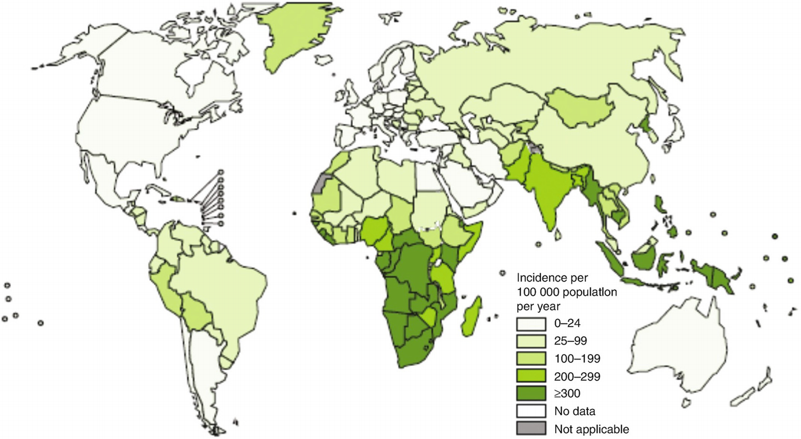

# Chapter 39. Other Life-Threatening Infections

> **Source:** Sureda A, Corbacioglu S, Greco R, Kröger N, Carreras E (eds). *The EBMT Handbook: Hematopoietic Cell Transplantation and Cellular Therapies*, 8th ed. Springer, Cham; 2024. pp. 345–354. https://doi.org/10.1007/978-3-031-44080-9_39  
> **Authors:** Martino, Rodrigo  
>   - Martino, Rodrigo: Hospital de la Santa Creu I Sant Pau, Autonomous University of Barcelona  
> **License:** CC BY 4.0 (https://creativecommons.org/licenses/by/4.0/). Text reproduced verbatim from the open-access HTML edition; formatting converted to Markdown.

## Abstract

*Toxoplasma gondii* is a protozoan that commonly infects animals and birds. Primary *T. gondii* infection in humans and other mammals is usually asymptomatic but leads to lifelong latent infection. Transmission to humans occurs by ingesting tissue cysts from undercooked meat or oocysts (released in the feces of cats). Latent cysts can give rise during immunosuppression to a severe localized reactivation producing, for example, toxoplasma encephalitis or chorioretinitis, with dissemination being common (Martino, et al.Clin Infect Dis 2000;31:1188–95; Martino et al. Clin Infect Dis 2005;40:67–78; Tomblyn et al., Biol Blood Marrow Transplant 2009;15:1143–23; Martino, et al., Clin Infect Dis 1996;23:419–20.).

Very detailed guidelines for the management and diagnosis of toxoplasmosis following HCT have been recently finalized for the European Conference of Infections in Leukemia 9th Meeting (ECIL-9) conference and are being considered for publication as of June 2023 (Aerts et al., Under peer-review, 2023).

## 39.1 Toxoplasmosis

### 39.1.1 General Concepts

*Toxoplasma gondii* is a protozoan that commonly infects animals and birds. Primary *T. gondii* infection in humans and other mammals is usually asymptomatic but leads to lifelong latent infection. Transmission to humans occurs by ingesting tissue cysts from undercooked meat or oocysts (released in the feces of cats). Latent cysts can give rise during immunosuppression to a severe localized reactivation producing, for example, toxoplasma encephalitis or chorioretinitis, with dissemination being common. (Martino et al. 2000, 2005; Tomblyn et al. 2009; Martino 2016).

Although toxoplasmosis is the most common systemic parasitic infection in EBMT centers, it is a relatively rare opportunistic infection following HCT. Currently, we are aware that the patients’ seroprevalence explains the wide range of incidences published. Table 39.1 summarizes selected case series of toxoplasmosis in HCT published to date.

**Table 39.1 Selected case series of toxoplasmosis after HCT up to 2021 (see updated detailed information in Aerts et al. 2023 )**

<table>
<thead>
<tr>
<th>
Author (year)a
</th>
<th>
Cases
</th>
<th>
Number of HCT (% frequency)
</th>
<th>
% of sero (+) pre-HCT
</th>
<th>
Median (range) day onset
</th>
</tr>
</thead>
<tbody>
<tr>
<td>
Derouin et al. (1992)
</td>
<td>
7
</td>
<td>
296 allo (2.4)
</td>
<td>
65
</td>
<td>
74 (55–180)
</td>
</tr>
<tr>
<td>
Slavin et al. (1994)
</td>
<td>
12
</td>
<td>
3.803 allo (0.31)

509 auto (0)
</td>
<td>
15
</td>
<td>
59 (35–97)
</td>
</tr>
<tr>
<td>
Bretagne et al. (1995)
</td>
<td>
2
</td>
<td>
550 allo (0.3)
</td>
<td>
70
</td>
<td>
NS
</td>
</tr>
<tr>
<td>
Maschke et al. (1999)
</td>
<td>
20b
</td>
<td>
655 (3.1)
</td>
<td>
NS
</td>
<td>
73 (14–689)
</td>
</tr>
<tr>
<td>
Martino et al. (2003)
</td>
<td>
41
</td>
<td>
4.391 allo (0.93)

7.097 auto (0)
</td>
<td>
Variable (multinational study)
</td>
<td>
64 (4–516)
</td>
</tr>
<tr>
<td>
Small et al. (2000)
</td>
<td>
10
</td>
<td>
463 allo (2.2)
</td>
<td>
23
</td>
<td>
78 (36–155)
</td>
</tr>
<tr>
<td>
Aoun et al. (2006)
</td>
<td>
7
</td>
<td>
121 allo (5)

204 auto (0.4)
</td>
<td>
69
</td>
<td>
45 (13–140)
</td>
</tr>
<tr>
<td>
de Medeiros et al. (2001)
</td>
<td>
9
</td>
<td>
789 allo-HCT (1.14)
</td>
<td>
NS
</td>
<td>
69 (13–265)
</td>
</tr>
<tr>
<td>
Mulanovich et al. (2011)
</td>
<td>
9
</td>
<td>
3.626 Allo (0.25)

 – US pt0.15%

 – Non-US pt1.6%
</td>
<td>
18% US pt

&gt;50% non-US pt
</td>
<td>
56 (12–122)
</td>
</tr>
<tr>
<td>
Bautista et al. (2012) and Martino et al. (2015)
</td>
<td>
9
</td>
<td>
148 adult CBT (4%)
</td>
<td>
45
</td>
<td>
39 (7–98)
</td>
</tr>
<tr>
<td>
Sumi et al. (2013)
</td>
<td>
6
</td>
<td>
279 allo (1.8%)

87 auto (1.1%)
</td>
<td>
10
</td>
<td>
NS
</td>
</tr>
<tr>
<td>
Hakko et al. (2017)
</td>
<td>
5
</td>
<td>
170 allo (2.9%)
</td>
<td>
70
</td>
<td>
42 (26–119)
</td>
</tr>
</tbody>
</table>

1.  a Not all in references
2.  b Four definite and 16 possible cases of toxoplasmosis

### 39.1.2 Risk Factors and Incidence in HCT

The seroprevalence for *T. gondii* varies greatly between and even within countries, ranging from \<15% in Japan and in pediatric wards, 30% in urban adults in North America and the UK, and to 40–80% of adult HCT recipients in countries with high endemicity such as France or Turkey. This varying seroprevalence is the main reason for the great variability in the incidence of toxoplasmosis after HCT, which has been estimated to average 0.8%, with \<0.4% in areas of low endemicity to 2–3% in those with high-antibody prevalence.

Toxoplasmosis occurs mainly in allo-HCT recipients, although cases after auto-HCT have been published. Reactivation of latent tissue cysts in previously infected individuals is the usual mechanism implicated. Thus, it is important to determine the patients’ serostatus prior to transplant. However, the disease may also develop if primary (or re-)infection after the transplant may occur.

Ninety-five percent of the cases occur within the first 6 months after the procedure, and acute GVHD and its treatment are the main risk factors. Late cases may occur, again usually in patients with chronic GVHD requiring IST. In addition, seropositive patients without GVHD but with severe cellular IS due to in vivo or ex vivo TCD are also at risk.

### 39.1.3 Most Common Clinical Presentations

The CNS is the main site of disease, but pneumonitis and myocarditis are also frequent findings.

Toxoplasma encephalitis typically presents with focal neurologic abnormalities of subacute onset, frequently accompanied by nonfocal signs and symptoms such as headache, altered mental status, and fever. Meningeal signs are very rare. CT brain scans often show multiple bilateral cerebral lesions, although MRI is more sensitive than CT in the early diagnosis of this infection. Toxoplasma pneumonitis may develop in the absence of extrapulmonary disease. Toxoplasma chorioretinitis is rare compared to AIDS patients.

### 39.1.4 Diagnosis

In HCT recipients, the utility of serology is mainly to identify those at risk for developing toxoplasmosis posttransplant.

PCR techniques are currently the standard method for its diagnosis. These techniques are applicable in blood, CSF, and BAL, the usual samples that are available in HCT recipients with this infection. Most centers use qPCR with a level of detection as low as 20 parasites/mL, with parasite loads of \>600/mL reported in most patients with toxoplasmosis.

Since histologically proven toxoplasmosis is a very difficult-to-obtain diagnosis, various levels of diagnostic certainty have been proposed. Histologically defined cases are considered as definite cases of toxoplasma disease, PCR-defined cases as probable, and CNS imaging-defined cases as possible ones.

### 39.1.5 Treatment and Prognosis

Table 39.2 details the recommended treatment and prophylaxis of toxoplasmosis in HCT recipients. Most patients respond to one or another of these regimens, and neurologic improvement of toxoplasma brain involvement usually occurs within 7 days. If appropriately treated, up to 60% of patients may show clinical–radiologic improvement or even a complete response to therapy. This highlights the importance of a high index of suspicion for toxoplasmosis in immunocompromised patients.

**Table 39.2 Suggested treatment and prophylaxis for toxoplasmosis in HCT recipients**

<table>
<thead>
<tr>
<th>
Treatment
</th>
<th>
Dose
</th>
</tr>
</thead>
<tbody>
<tr>
<td>
Pyrimethamine (<em>plus</em> folinic acid)
</td>
<td>
Oral, 200 mg loading dose, then 50–75 mg q.d. (folinic acid, oral or IV, 10–15 mg q.d.) <em>+ one of the following</em>
</td>
</tr>
<tr>
<td>
Sulfadiazine
</td>
<td>
Oral, 1–1.5 g q6–8h, <em>OR</em>
</td>
</tr>
<tr>
<td>
Clindamycin
</td>
<td>
Oral or IV, 600 mg q6h
</td>
</tr>
<tr>
<td>
Prophylaxis
</td>
<td>
Dose
</td>
</tr>
<tr>
<td>
TMP/SMXa,b
</td>
<td>
1 double-strength tablet (160/800 mg)/day, 4 day × week, <em>OR</em>

2 double-strength tablets (160/800 mg)/day, 3 day × week, <em>OR</em>

1 standard-dose tablet (80/400 mg) daily, <em>OR</em>
</td>
</tr>
<tr>
<td>
Pyrimethamine and sulfadoxine (fansidar)a
</td>
<td>
2–3 tables per week
</td>
</tr>
<tr>
<td>
Dapsoneb
</td>
<td>
100 mg daily
</td>
</tr>
<tr>
<td>
Atovaquoneb
</td>
<td>
1500 mg daily
</td>
</tr>
</tbody>
</table>

1.  aAlso effective for PJP prophylaxis, and possibly listeriosis, nocardiosis, and, in some geographic areas, partly effective in preventing gram-positive cocci and gram-negative bacillary (enterobacterial and nonglucose fermenting) infections
2.  bThe dose can be reduced in patients with mild renal insufficiency

### 39.1.6 Specific Screening and/or Prophylactic Strategies Available

Current data suggest that infection may precede disease in most cases of toxoplasmosis. Thus, monitoring sero(+) patients with weekly qPCR of blood samples has been advocated, especially when prophylaxis is not being used, in an effort of using a preemptive-type therapeutic approach, as used for CMV infection. Although an optimal qPCR technique has not been standardized, several studies support the usefulness of this approach. Patients on TMP/SMX prophylaxis should not be monitored.

TMP/SMX is useful in minimizing the risk of reactivation of toxoplasmosis, although there are well-reported cases of toxoplasmosis breaking through this prophylaxis in HCT recipients. Suboptimal dosing may have contributed to some of these “breakthrough” infections, since these cases occur when TMP/SMX is taken less than 3 days per week. Thus, using either one standard-dose tablet (80/400 mg) daily or a double-strength tablet (160/800 mg) 4 days per week is the recommended dosing, as shown in Table 39.2.

Avoiding primary or reinfection after HCT is always important, avoiding the most common sources of infection: uncooked meats of any type and drinking contaminated water.

## 39.2 Tuberculosis (TBC)

de la Cámara et al. (2000), Cordonnier et al. (2004), Yao-Chung et al. (2016), Young and Weisdorf (2016), Beswick et al. (2018), and Bergeron et al. (2022).

### 39.2.1 General Concepts

TBC, and especially, multidrug-resistant (MDR) TBC, continues to be a worldwide major health problem. This may surprise many EBMT HCT physicians, who may have never seen a case of TBC.

#### 39.2.1.1 Mycobacterium Tuberculosis

*Mycobacterium tuberculosis* causes nearly all cases of TBC, and these acid-fast bacilli differ from other bacteria in that they can live only in an infected human. Outside of the human body, they have a very short survival, and infection is transmitted by the inhalation of aerosolized particles from a patient. In addition, its isolation from clinical samples should never be considered as a colonization or sample contamination. TBC is not an opportunistic infection, and thus its detailed description is outside the scope of this manual.

### 39.2.2 Risk Factors and Incidence in HCT

The risk of developing TBC is directly proportional to the TBC present in the geographic area of the HCT center and the patients’ residence (Fig. 39.1). A few studies have analyzed its incidence with respect to the general population, and most have found that allo-HCT recipients have 2–10 times higher risk than the general population, while auto-HCT recipients do not have a significantly higher risk (De la Cámara et al. 2000) (Table39.3).

**Fig. 39.1**

TBC estimate incidence rate 2016 (WHO webpage)

**Table 39.3 Selected case series of mycobacterial infections after HCT before 2018**

<table>
<thead>
<tr>
<th>
Author (year)a
</th>
<th>
Country
</th>
<th>
TBC/HCT × risk with GPb
</th>
<th>
NTM/HCT × risk with GP
</th>
<th>
Outcome of infection
</th>
</tr>
</thead>
<tbody>
<tr>
<td>
Lee et al. (2017)
</td>
<td>
Korea
</td>
<td>
21/824 (Allo) × 9.1 GP
</td>
<td>
NA
</td>
<td>
1 died
</td>
</tr>
<tr>
<td>
Liu et al. (2016)c
</td>
<td>
Taiwan
</td>
<td>
5/422 (allo)
</td>
<td>
21/422 (allo)
</td>
<td>
11 died
</td>
</tr>
<tr>
<td>
Beswick et al. (2018)
</td>
<td>
Canada
</td>
<td>
NA
</td>
<td>
30/1097 (allo) × 35 GP
</td>
<td>
NA
</td>
</tr>
<tr>
<td>
Fan et al. (2015)
</td>
<td>
Taiwan
</td>
<td>
32/1368 (allo) × 7 GP

7/672 (auto) × 2.5 GP
</td>
<td>
0
</td>
<td>
20 died
</td>
</tr>
<tr>
<td>
Garces-Ambrossi et al. (2005)
</td>
<td>
USA
</td>
<td>
4/577 (allo) × 10 GP
</td>
<td>
0
</td>
<td>
NA
</td>
</tr>
<tr>
<td>
Cordonnier et al. (2004)
</td>
<td>
Multiple (EBMT)
</td>
<td>
23/1513 (allo)

8/3012 (auto)
</td>
<td>
8
</td>
<td>
5 died
</td>
</tr>
<tr>
<td>
Ku et al. (2001)
</td>
<td>
Taiwan
</td>
<td>
8/255 (allo) × 13.1 GP

0/95 (auto)
</td>
<td>
0
</td>
<td>
ND
</td>
</tr>
<tr>
<td>
de la Cámara et al. (2000)
</td>
<td>
Spain
</td>
<td>
12/2866 (allo) × 2.2 GP

8/5147 (auto) = to GP
</td>
<td>
NA
</td>
<td>
3 died
</td>
</tr>
<tr>
<td>
Budak-Alpdogan et al. (2000)
</td>
<td>
Turkey
</td>
<td>
5/351 (allo) × 3.9 GP
</td>
<td>
0
</td>
<td>
No deaths
</td>
</tr>
<tr>
<td>
Gaviria et al. (2000)
</td>
<td>
USA
</td>
<td>
3/6529 (3allo)
</td>
<td>
0
</td>
<td>
No deaths
</td>
</tr>
<tr>
<td>
Aljurf et al. (1999)
</td>
<td>
Saudi Arabia
</td>
<td>
4/641 (allo)
</td>
<td>
0
</td>
<td>
2 died
</td>
</tr>
<tr>
<td>
Roy et al. (1997)
</td>
<td>
USA
</td>
<td>
2/1486 (allo)

0/755 (auto)
</td>
<td>
7/1486 (allo)

2/755 (auto)
</td>
<td>
No deaths
</td>
</tr>
<tr>
<td>
Martino et al. (1996, 2011)
</td>
<td>
Spain
</td>
<td>
2/698 (allo)

0/637(auto)
</td>
<td>
0
</td>
<td>
No deaths
</td>
</tr>
</tbody>
</table>

1.  *NA* Details not available in the study
2.  aNot all in references
3.  bx risk with GP, studies in which the relative risk of suffering TBC was compared to that in age-/sex-matched normal individuals from the general population
4.  cAbstract

### 39.2.3 Most Common Clinical Presentations

The clinical presentation of TBC in HCT recipients is the same as in the general population, although it may have a more rapid progression, and the ratio of pulmonary to extrapulmonary disease has been reported 34/5 to 11/10, which surely represents a publication bias, with a median of 75%/25%. The most common extrapulmonary disease is meningitis.

### 39.2.4 Diagnosis

The culture of even a single colony from an affected organ is diagnostic for TBC. Direct microbiologic examination for acid-fast bacilli is of course mandatory, but its sensitivity is probably low. In addition, the results of positive cultures take many days to weeks, and the use of highly sensitive and specific PCR methods is now the usual method for the initial diagnosis.

The quantiFERON-TB Gold test (and other gamma-interferon release assays) is not reliable in the diagnosis of TBC in HCT recipients due to their T-cell immunodeficiency.

### 39.2.5 Treatment and Prognosis

With appropriate treatment, TBC in HCT recipients has a low attributable mortality (\<30%). The author suggests that HCT physicians contact ID physicians immediately when the diagnosis of TBC is made. Empirical treatment should be started if this consultation will not be replied immediately, but herein we cannot recommend a “one-fits-all” drug combination, since this varies greatly according to the level of drug resistance in each geographical area. Specific recommendations can be found in the recent ECIL-EBMT gudelines (Bergeron et al. 2022).

### 39.2.6 Specific Screening and/or Prophylactic Strategies (Bergeron et al. 2022)

Even in areas where TBC is endemic, pre-HCT screening with the tuberculin skin test or the gamma-interferon quantiFERON-TB Gold test is not done in most HCT centers, and in a recent ECIL-EBMT questionnaire, only 32/88 (36%) had a pre-HCT latent TBC screening routine protocol (Bergeron et al. 2022). In addition, specific antibiotic prophylaxis in patients with past and cured TBC is not warranted.

Recent ECIL-EBMT recommendations (Bergeron et al. 2022) basically emphasize several special scenarios that do, however, require contacting an ID specialist pre- or post-HCT in order to analyze whether screeing or “prophylaxis” may be indicated, the drugs to use, and their duration:

1.  1\.

    Highly IS HCT recipients or candidates who have been substantially exposed to someone with active pulmonary or laryngeal TBC, either before or after the transplant procedure, irrespective of the results of the tuberculin skin test or the gamma-interferon quantiFERON-TB Gold test.

2.  2\.

    HCT recipients or candidates with a positive tuberculin skin test or the gamma-interferon quantiFERON-TB Gold test who were not previously treated and have radiological evidence of TBC lung disease (pleuroparenchymal abnormalities, especially of the upper lobes).

3.  3\.

    Patients with prior TBC which was appropriately treated do not need screening nor prophylaxis, but if there is any doubt as to whether appropriate treatment was indeed given, please consult with an ID specialist.

## 39.3 Nontuberculous (or Atypical) Mycobacterial (NTM) Infections

(Cordonnier et al. 2004; Young and Weisdorf 2016; Beswick et al. 2018; Bergeron et al. 2022).

### 39.3.1 General Concepts

Atypical mycobacteria are fastidious microorganisms that are ubiquitous in nature and can simply colonize any body surface and secretions and often contaminate clinical samples from the environment. There are a very large number of NTM species with varying geographical distributions. However, with respect to infections in HCT recipients, NTM can be divided into two different categories:

1.  1\.

    *Mycobacterium avium-intracellulare* complex, which are slow-growing mycobacteria.

2.  2\.

    Anonymous or atypical NTM, subdivided into the rapidly growing NTM and the slow-growing NTM: the most commonly reported species from EBMT centers are *M. fortuitum, M. abscessus-chelonae* complex*, M. haemophilum, M. xenopi*, *and M. kansasii*.

### 39.3.2 Most Common Clinical Presentations and Risk Factor

A large number of atypical NTM infections are CVC infections (40%), followed by skin infections (30%) and pleuropulmonary infections (20%). However, in patients with severe cGVHD, severe infections of any organ can occur, as well as disseminated cases. *M. avium-intracellulare* complex, on the other hand, usually causes pulmonary disease or disseminated infections, with blood cultures being positive in \>50% of cases. Such infections almost always occur in severely immunocompromised allo-HCT recipients, such as those with severe steroid-dependent cGVHD.

### 39.3.3 Diagnosis

Diagnosis requires the isolation of a NTM from the affected organ(s). In cases of pleuro-pulmonary infection, differentiating colonization from true active infection and disease can be difficult with NTM. Depending on the species, cultures can be positive in very few days or take up to 9 weeks in slow-growing mycobacteria, as with TBC. Thus, the use of specific PCR methods and/or special biochemical methods is now the usual method for the diagnosis of NTM infections.

### 39.3.4 Treatment and Prognosis

With appropriate treatment, most NTM infections have a good outcome and a low attributable mortality, although the data are very scarce (Table 39.3). When prolonged antimicrobial treatment is required (which is not always the case, depending on the site of infection and species involved), the drugs most commonly used are macrolides, quinolones, aminoglycosides, and rifamycins (the latter rarely in HCT recipients due to their drug interactions).

As in the case of TBC, the author suggests that HCT physicians contact ID physicians immediately when the diagnosis of NTM infection is made. In CVC infections, the catheter should probably always be removed. While awaiting for the ID specialists, empirical therapy with a macrolide (clarithromycin or azithromycin) plus moxifloxacin or levofloxacin can be started.

### 39.3.5 Specific Screening and/or Prophylactic Strategies Available

Screening and prophylaxis have no role in NTM infections.

## 39.4 Listeriosis

Safdar et al. (2002), Boyle (2014), Martino et al. (1996), and Averbuch et al. (2022a, b).

### 39.4.1 General Concepts

Only one species, *Listeria monocytogenes*, produces all cases of this mostly “bacterial foodborne” infection. *L. monocytogenes* is a pseudo-“diphtheroid” gram-positive bacillus. This organism is widespread in nature and in tap water, sewage, the microbiota of pets and farm animals, and nearly all types of fresh foods. The fact that it grows well in refrigerator temperatures adds yet another variable that favors ingestion by humans, which appears to be universal worldwide. At any specific moment, 5% of healthy humans have *L. monocytogenes* in feces. With these premises, it is surprising that listeriosis is an uncommon infection in HCT recipients.

### 39.4.2 Risk Factors and Incidence in HCT

The only risk factor is the combination of ingesting colonized food or water and having a severe cellular IS.

Its incidence is unknown, and only two studies are available. At the MSKCC in New York, six cases occurred in 1315 allo-HCT recipients from 1985 to 1997, with an incidence of 0.47% (Safdar et al. 2002). At the FHCRC in Seattle, three cases occurred among 4069 HCT recipients (\<0.1%) during the first 100 days posttransplant (Boyle 2014). Finally, in our center, we have had three cases of listeriosis among 2360 adult HCT recipients (0.1%) (Martino et al. 1996). All other information has been reported as isolated case reports.

### 39.4.3 Most Common Clinical Presentations

Listeriosis in HCT recipients is almost always a sepsis syndrome with bloodstream infection, with CNS involvement in 40–60% of cases, which can present as meningitis, encephalitis, or brain abscess, and with several cases of rhombencephalitis reported (Chang et al. 1995).

### 39.4.4 Diagnosis

The diagnosis is made after the bacterial microbiology laboratory informs the clinicians that the patient has positive blood and/or CSF cultures for this organism. The putative source of the infection cannot be identified in outpatients.

### 39.4.5 Specific Screening and/or Prophylactic Strategies Available

Screening has no role in preventing listeriosis. Standard approaches to food safety handling and preparation are, of course, the main preventive measures.

The routine use of TMP/SMX prophylaxis after HCT surely has a role in preventing listeriosis, but its low incidence makes this impossible to prove.

Cases of listeriosis in long-term inpatients should, of course, activate the rapid intervention of the hospital infection control/prevention unit in the HCT ward.

### 39.4.6 Treatment and Prognosis

The treatment of choice is high-dose ampicillin (or high-dose TMP/SMX in those allergic to penicillin) combined with an aminoglycoside for 3 weeks or 6 weeks in case of CNS infection. We also recommend consultation with ID specialists.

The prognosis of listeriosis in HCT recipients is unknown, although 20% of the reported cases died, while 10% had a CNS recurrence. In an ongoing EBMT study, survival in patients with listeriosis (*n* = 42) and controls (*n* = 62) was 48% and 72%, respectively (Averbuch et al. 2022a, b).

## 39.5 Nocardiosis

Averbuch et al. (2022a, b), Coussement et al. (2017), Shannon et al. (2016), and Bambace et al. (2013).

### 39.5.1 General Concepts

*Nocardia* spp. (any of the dozens of currently accepted species may be involved, but most cases in Europe appear to be due to *N. asteroides*, *N. brasiliensis*, and *N. nova*) are aerobic gram-positive rods that grow in characteristic filamentous, branching chains and being acid fast, and their appearance makes them easily identifiable by microbiologists, with their acid-fast staining properties differentiating them from *Actinomyces* spp. *Nocardia* spp. grow in soil and decaying matter, and human infection usually occurs from inhalation of airborne bacilli.

### 39.5.2 Risk Factors and Incidence in HCT

Nocardiosis is a late post-HCT infection, occurring months to years after HCT, mostly allo-HCT. Patients usually have steroid-dependent chronic GVHD, secondary diabetes mellitus, and/or bronchiolitis obliterans or bronchiectasis from the numerous post-HCT infections suffered. There are no specific risk factors in HCT, although being at the right time in a place where soil-living bacilli are made massively airborne is a common-sense mechanism of infection. Similar to *M. tuberculosis*, *Nocardia* spp. do not colonize the airways.

The incidence of nocardiosis has been reported to range from 0.3 to 1.7% in allo-HCT, although many large centers have not had a single case. In auto-HCT the median incidence is 0%, although occasional cases have been reported and surely occur in many centers.

### 39.5.3 Most Common Clinical Presentations

Pulmonary infection, with its accompanying signs and symptoms, and radiologically one or more nodular lesions with a tendency to cavitate occur in 90% of patients with nocardiosis. At presentation, however, around half of the patients have disseminated disease, usually to the skin and osteoskeletal organs, but around 1/3 will have CNS involvement up front. Since CNS involvement is so common and can initially be asymptomatic, a CNS CT or MRI scan is mandatory in all HCT recipients with pulmonary nocardiosis (in any IS host, in fact). Brain abscesses are the usual presentation, although severe hyponatremia due to SIADH is also common due to basal meningitis.

### 39.5.4 Diagnosis

Diagnosis, of course, requires the culture of an affected organ, usually the lungs. Often, the characteristic ramified bacilli can be directly observed from sputum or a directed BAL, but culture-based diagnosis is made in at least 1/3 of the cases. This is of utmost importance, since cultures become positive at a median of 9 days after sampling but can take up to 2–4 weeks. Molecular-based methods are useful only to identify uncommon species of *Nocardia* with known multidrug resistance, but this is rarely required in clinical practice. The most common differential diagnosis is with invasive pulmonary mold infections.

### 39.5.5 Specific Screening and/or Prophylactic Strategies Available

Screening has no role in preventing nocardiosis, but its rapid diagnosis does have an impact on patient outcome.

The routine use of TMP/SMX prophylaxis after HCT may prevent more cases of nocardiosis, but the 2–3-day per week schedules are not effective in preventing it. Of note, *Nocardia* spp. isolated in patients taking single-strength TMP/SMX prophylaxis 5–7 days per week have had a good in vitro susceptibility to TMP/SMX and have responded well to high doses of the drug.

### 39.5.6 Treatment and Prognosis

High-dose TMP/SMX is still the treatment of choice, although there have been good results with carbapenems, amikacin, second-generation cephalosporins, and/or linezolid.

When treated promptly, nocardiosis usually resolves with prolonged antibiotic therapy, but directly attributable mortality has been reported in up to 40% of cases; these are, of course, those cases that affect extremely debilitated allo-HCT recipients due to prolonged severe GVHD and its numerous complications, as well as those with disseminated infection and extensive CNS involvement, including the brain stem. Overall mortality, however, is high, since around 40% of patients have severe coinfections when nocardiosis joins the club.

Treatment of nocardiosis usually requires at least 6 months of specific antibiotic therapy, and it is of course recommended that ID specialists are actively involved in the treatment and follow-up. Of note, most *Nocardia* isolates are susceptible to most of the too-often empirically/prophylactically used antibiotics in HCT recipients (levofloxacin, moxifloxacin, and amoxicillin-clavulanate), as well as tetracyclines and tigecycline.

### Key Points

- The intense IS associated with allo-HCT, especially when there is a chronic GVHD that requires a prolonged IST, favors the development of infections by very unusual pathogens.

- Despite its low incidence, it is necessary to know these pathologies in order to make an early diagnosis and to adapt the therapy to the causal pathogen.

## References

- Aerts R, Mehra V, Groll AH,et al. Guidelines for the management of toxoplasma infection and disease in patients with haematological malignancies and after haematopoietic stem cell transplantation from the 9th European Conference on Infections in Leukaemia, 2022. 2023.

- Averbuch D, De Greef J, Duréault A, et al. European Study Group for Nocardia in hematopoietic cell transplantation. Nocardia infections in hematopoietic cell transplant recipients: amulticenter international retrospective study of the infectious diseases working Party of the European Society for blood and marrow transplantation. Clin Infect Dis. 2022a;75:88–97.

- Averbuch D, Tridello G, Wendel L, et al. Listeria infection in hematopoietic cell transplant recipients: an international case-control study of the Infectious Diseases Working Party of the EBMT. The 48th Annual Meeting of the European Society for Blood and Marrow Transplantation: Physicians—Oral Sessions (O009-O155). Bone Marrow Transplant. 2022b;57(Suppl 1):16–99. https://doi.org/10.1038/s41409-022-01815-2.

- Bambace NM, Poirier L, Cohen S, et al. Nocardiosis in allogeneic hematopoietic stem cell transplant recipients: a matched case-control study of risk factors, clinical features and outcomes. Biol Blood Marrow Transplant. 2013;19:S280.

- Bergeron A, Mikulska M, De Greef J, et al. Mycobacterial infections in adults with haematological malignancies and haematopoietic stem cell transplants: guidelines from the 8th European conference on infections in Leukaemia. Lancet Infect Dis. 2022 Dec;22:e359–69.

- Beswick J, Shin E, Michelis FV, et al. Incidence and risk factors for nontuberculous mycobacterial infection after allogeneic hematopoietic cell transplantation. Biol Blood Marrow Transplant. 2018;24:366–72.

- Chang J, Powles R, Mehta J, et al. Listeriosis in bone marrow transplant recipients: incidence, clinical features, and treatment. Clin Infect Dis. 1995;21:1289–90.

- Cordonnier C, Martino R, Trabasso P, et al. Mycobacterial infection: a difficult and late diagnosis in stem cell transplant recipients. Clin Infect Dis. 2004;38:1229–36.

- Coussement J, Lebeaux D, Rouzaud C, Lortholary O. Nocardia infections in solid organ and hematopoietic stem cell transplant recipients. Curr Opin Infect Dis. 2017;30:545–51.

- de la Cámara R, Martino R, Granados E, et al. Tuberculosis after hematopoietic stem cell transplantation: incidence, clinical characteristics and outcome. Spanish group on infectious complications in hematopoietic transplantation. Bone Marrow Transplant. 2000;26:291–8.

- Martino R. Toxoplasmosis after hematopoietic stem cell transplantation. In: Ljungman P, Snydman D, Boeckh M, editors. Transplant infections. Printfort: Springer; 2016. p. 773–80.

- Martino R, Lopez R, Pericas R, et al. Listeriosis in bone marrow transplant recipient. Clin Infect Dis. 1996;23:419–20.

- Martino R, Maertens J, Bretagne S, et al. Toxoplasmosis after hematopoietic stem cell transplantation. Clin Infect Dis. 2000;31:1188–95.

- Martino R, Bretagne S, Einsele H, et al. Early detection of toxoplasma infection by molecular monitoring of toxoplasma gondii in peripheral blood samples after allogeneic stem cell transplantation. Clin Infect Dis. 2005;40:67–78.

- Safdar A, Papadopoulous EB, Armstrong D. Listeriosis in recipients of allogeneic blood and marrow transplantation: thirteen year review of disease characteristics, treatment outcomes and a new association with human cytomegalovirus infection. Bone Marrow Transplant. 2002;29:913–6.

- Shannon K, Pasikhova Y, Ibekweh Q, Ludlow S, Baluch A. Nocardiosis following hematopoietic stem cell transplantation. Transpl Infect Dis. 2016;18:169–75.

- Tomblyn M, Chiller T, Einsele H, et al. Guidelines for preventing infectious complications among hematopoietic cell transplantation recipients: a global perspective. Biol Blood Marrow Transplant. 2009;15:1143–23.

- Yao-Chung L, Wu C, Chien S, et al. Mycobacterial infections in adult recipients of allogeneic hematopoietic stem cell transplantation: a cohort study in a high endemic area. Blood. 2016;128:S2202.

- Yetmar ZA, Thoendel MJ, Bosch W, Seville MT, Hogan WJ, Beam E. Risk factors and outcomes of nocardiosis in hematopoietic stem cell transplant recipients. Transplant Cell Ther. 2022.

- Young JAH, Weisdorf DJ. Typical and atypical mycobacterium infections after hematopoietic stem cell or solid organ transplantation. In: Ljungman P, Snydman D, Boeckh M, editors. Transplant infections. Printfort: Springer; 2016. p. 381–96.
