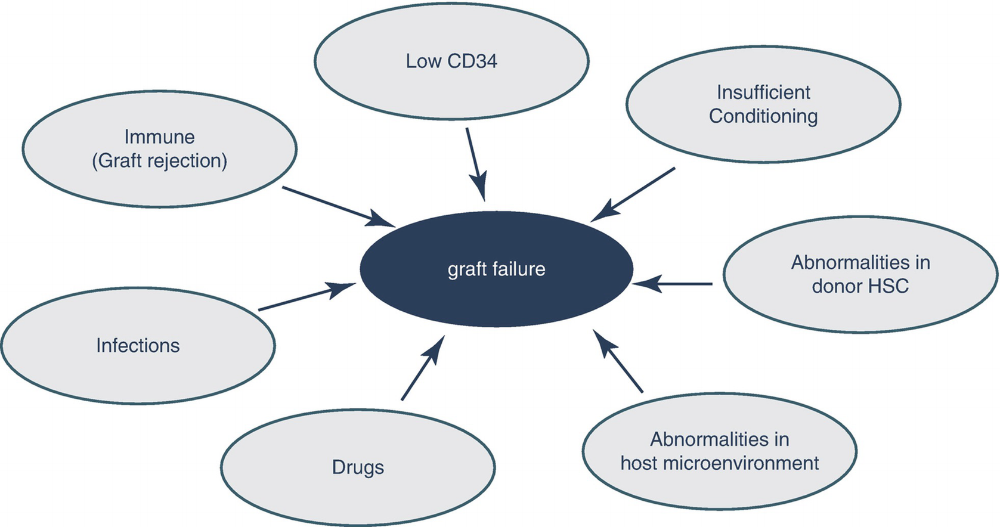

# Chapter 41. Graft Failure

> **Source:** Sureda A, Corbacioglu S, Greco R, Kröger N, Carreras E (eds). *The EBMT Handbook: Hematopoietic Cell Transplantation and Cellular Therapies*, 8th ed. Springer, Cham; 2024. pp. 365–372. https://doi.org/10.1007/978-3-031-44080-9_41  
> **Authors:** Valcárcel, David; Sánchez-Ortega, Isabel; Sureda, Anna  
>   - Valcárcel, David: Vall d’Hebron University Hospital, Universitat Autónoma de Barcelona  
>   - Sánchez-Ortega, Isabel: Medical officer, EBMT, Executive Office  
>   - Sureda, Anna: Institut Català d’Oncologia—Hospitalet  
> **License:** CC BY 4.0 (https://creativecommons.org/licenses/by/4.0/). Text reproduced verbatim from the open-access HTML edition; formatting converted to Markdown.

## Abstract

The current definition for hematological recovery includes neutrophil recovery, defined as the first of three consecutive days with an absolute neutrophil count ≥0.5 × 109/L and platelet recovery which is defined as a platelet count of ≥20 × 109/L in the absence of platelet transfusion for 7 consecutive days.

## 41.1 Introduction

The current definition for hematological recovery includes neutrophil recovery, defined as the first of three consecutive days with an absolute neutrophil count ≥0.5 × 109/L and platelet recovery which is defined as a platelet count of ≥20 × 109/L in the absence of platelet transfusion for 7 consecutive days.

In allogeneic transplantation, chimerism evaluation is essential to confirm that cells are donor-derived, particularly in reduced-intensity and non-myeloablative conditioning regimens. A common cutoff for complete donor chimerism is ≥95% of donor-derived cells (typically ranging from 90% to 97.5% in most centers). It is advisable to assess multiple lineages, including T-cells and granulocytes, if feasible.

The incidence of graft failure (GF) is \<3–5% in the auto- and matched allo-HCT setting, but it increases up to 10% in the cases of haploidentical or CBT. The prognosis of GF is poor, and most patients die due to infections or bleeding, with an OS at 3–5 years after the diagnosis of GF in the range of 20–30%.

## 41.2 Definitions (Kharfan-Dabaja et al.2021)

<table>
<tbody>
<tr>
<td>
Primary graft failure (GF)
</td>
<td>
ANC &lt;0.5 × 109/L by day +30 with associated pancytopenia. Donor chimerism testing is also done to confirm the suspicion of graft failure.

CBT: Up to day +42, with associated pancytopenia
</td>
</tr>
<tr>
<td>
Secondary GF
</td>
<td>
A decline in hematopoietic function (may involve hemoglobin and/or platelets and/or neutrophils) necessitating blood products or growth factor support, after having met the standard definition of hematopoietic (neutrophils and platelets) recovery.

This assumes donor chimerism testing is also done to confirm the suspicion of graft failure.
</td>
</tr>
<tr>
<td>
Poor graft function
</td>
<td>
Frequent dependence on blood and/or platelet transfusions and/or growth factor support in the absence of other explanations, such as disease relapse, drugs, or infections.

This assumes that donor myeloid and lymphoid chimerism are within a desirable target level.
</td>
</tr>
<tr>
<td>
Graft rejection
</td>
<td>
GF caused by the <em>immune rejection</em> of donor cells mediated by host cells.
</td>
</tr>
</tbody>
</table>

## 41.3 Causes and Risk Factors

The etiology of GF is multifactorial in most of the cases (Fig. 41.1, Table 41.1).

**Fig. 41.1**

Causes associated with the development of GF

**Table 41.1 Risk factors for GF**

<table>
<thead>
<tr>
<th>
Pretransplant (difficult to modify)
</th>
<th>
Pretransplant (easy to modify)
</th>
<th>
Peri- and post-transplant
</th>
</tr>
</thead>
<tbody>
<tr>
<td>
HLA mismatches

Non-malignant disease

Advanced disease

Extensive marrow fibrosis

Donor age

Splenomegaly
</td>
<td>
Graft source

Conditioning

T-cell depletion
</td>
<td rowspan="2">
CD34+ cell count

Viral infections

GVHD

Drug toxicity
</td>
</tr>
<tr>
<td colspan="2">
Iron overload

HLA antibodies

Transfusion history
</td>
</tr>
</tbody>
</table>

### 41.3.1 Donor Type, HLA Matching, and Graft Source

Classical studies showed a close relationship between the degree of HLA mismatch and the incidence of GF, but it is difficult to draw conclusions because most of them used a limited HLA matching, including only low-resolution A, B, and DR locus (Anasetti et al. 1989; Petersdorf et al. 2001). More recent studies, using high-resolution techniques for HLA typing and including 10–12 loci (A, B, C, DR, DQ, and DP), did not find differences in GF rates between no HLA antigen mismatch and a single HLA mismatch in both conventional MAC (Lee et al. 2007) and RIC (Passweg et al. 2011).

URD transplant was associated with a higher risk of GF (HR 1.38, *p* \< 0.001 compared to HLA identical sibling) that was even higher when there were two or more mismatches (HR 1.79, *p* \< 0.001) (Olsson et al. 2015).

In the haploidentical setting, the incidence of GF is around 10%, which seems higher than the 3–5% currently reported for MSD or URD HCT, although there are not well-designed comparative studies.

### 41.3.2 Graft Source and Cellular Content

BM is consistently associated with delayed neutrophil and platelet engraftment across all types of transplants; the impact on GF depends on the donor type. GF incidence is not different for HLA MRD (Bensinger, 2012), but it is higher in the setting of URD (9% vs 3%, for BM and PB, respectively, *p* \< 0.001) (Anasetti et al. 2012). There are no prospective randomized data either looking at MAC or RIC, but retrospective results from EBMT and CIBMTR suggested there were no differences in GF between BM and PB (less than 5% in all cases). In contrast, in a study evaluating donor characteristics, the use of BM was the only factor associated with GF after RIC (HR 2.3; *p* = 0.02) (Passweg et al. 2011).

The minimum cellular content required is still a matter of debate. Table 41.2 depicts a conservative proposal based on the literature review.

**Table 41.2 Minimum cell content recommended**

<table>
<thead>
<tr>
<th>
Progenitors
</th>
<th>
Type of transplant
</th>
<th>
Amount of cells
</th>
</tr>
</thead>
<tbody>
<tr>
<td rowspan="2">
BM progenitors
</td>
<td>
Autologous
</td>
<td>
TNC: 2 × 108/kg
</td>
</tr>
<tr>
<td>
Allogeneic
</td>
<td>
TNC: 3 × 108/kg
</td>
</tr>
<tr>
<td rowspan="3">
PB progenitors
</td>
<td>
Autologous
</td>
<td>
Minimum: CD34 &gt; 1 × 106/kg

Optimum: CD34 &gt; 2 × 106/kg
</td>
</tr>
<tr>
<td>
Allogeneic MAC
</td>
<td>
Minimum: CD34 &gt; 2 × 106/kg

Optimum: CD34 &gt; 4 × 106/kg
</td>
</tr>
<tr>
<td>
Allogeneic RIC
</td>
<td>
Minimum: CD34 &gt; 2 × 106/kg

Optimum: CD34 4–8 × 106/kg
</td>
</tr>
<tr>
<td>
Cord blood
</td>
<td>
HLA 4–6/6
</td>
<td>
TNC &gt;2.5–3 × 107/kg

CD 34 &gt; 1 × 105/kg
</td>
</tr>
</tbody>
</table>

1.  *TNC* total nucleated cells; *MAC* myeloablative conditioning; *RIC* reduced-intensity conditioning regimen

### 41.3.3 Anti-HLA Antibodies

The presence of donor-specific anti-HLA antibodies (DSAs) is associated with a higher risk of GF in the context of haploidentical CBT and URD transplants, and it may in fact translate into a reduced OS (Spellman et al. 2010; Ciurea et al. 2009; Ciurea et al. 2015). The high prevalence of anti-HLA antibodies (10–40%) (Morin-Zorman et al. 2016) and the increasing use of mismatched donors prompted the EBMT to write a set of advice and recommendations on this issue (Table 41.3) (Ciurea et al. 2018).

**Table 41.3 Considerations regarding the presence of anti-HLA antibodies**

<table>
<tbody>
<tr>
<td>
Anti-HLA and DSA prevalence
</td>
<td>
Anti-HLA: 10–40%

DSA: 10–20%. Higher in females (increase with each pregnancy)
</td>
</tr>
<tr>
<td>
Detection methods
</td>
<td>
 • Cell-based (direct test): donor viable lymphocytes and patient serum are needed. Complex and time-consuming technique. Low specificity and variable sensitivity (higher with flow cytometry assays than complement-based assays)

 • Solid-phase immunoassays (virtual test): only require patient serum, and the technique is easy and fast. Sensitivity and specificity are intermediate/high depending on the type of assay. Modified techniques such as C4d or Cq1 assays allow to detect complement-fixing antibodies, which are at higher risk of inducing GF. These are the tests most commonly used nowadays; initial DSA testing and complement assay in case of positivity are recommended

 • Although not well validated, the threshold of positivity for DSA can be considered &gt;1000 and especially &gt;5000 MFI, which is probably associated with the presence of complement-binding antibodies

 • DSA study should be done during donor identification to select a donor and also within the month prior to transplant
</td>
</tr>
<tr>
<td>
Management and desensitization treatment
</td>
<td>
 • No standard scheme is widely accepted; different combinations have proven to be efficacious

  – Ab removal: plasmapheresis 1–4 procedures days −10 to −17 and even after transplant

  – Inhibition of ab production: rituximab 375 mg/m2 IV

  – Ab neutralization: infusion of 20–40 platelet units selected to share donor antigens or buffy coat from 1 unit of blood, on day 1. IVIg can also be used

<em>Avoid complement activation</em>: IVIg, eculizumab
</td>
</tr>
</tbody>
</table>

1.  *DSA* donor-specific antibodies; *MFI* mean fluorescence intensity; *Ab* antibodies; *IVIg* intravenous immunoglobulins

### 41.3.4 Conditioning Regimen

Increasing the intensity of MAC conditioning protocols does not reduce the incidence of GF. In contrast, RIC may be associated with a higher risk of GF.

Although it is well accepted that TBI reduces the risk of GF, there are no comparative studies that confirm this latter point. In combination with CY, the use of full-dose TBI does not seem to reduce GF in comparison with BU. The use of ATG in the preparative regimen in combination with CY seems to reduce the incidence of GF in patients with aplastic anemia. Also, in aplastic anemia patients, the addition of 2 Gy TBI to FLU/CY did not reduce the incidence of this complication.

### 41.3.5 Other Factors Associated with the Development of GF

ABO mismatch: Major incompatibility was associated with primary GF (HR 1.24; *p* = 0.012).

Cryopreservation: Associated with primary GF (HR 1.43; *p* = 0.013).

Female donor to male recipient: Associated with primary GF (HR 1.28; *p* = 0.001).

Splenomegaly: Associated with primary GF in MPN (HR 3.92; *p* = 0.001) and MDS (HR 2.24; *p* = 0.002).

Use of G-CSF: Associated with reduced risk of primary GF (HR 0.36; *p* \< 0.001) vs no growth factors.

Underlying disease: Non-malignant diseases are associated with a higher incidence.

Previous treatments: On the one hand, the use of numerous lines of treatments prior to the transplant may impair engraftment through the damage of the marrow microenvironment, while on the other hand, the absence of treatments may facilitate graft rejection.

Graft manipulation: Ex vivo TCD is associated with a higher risk of primary GF in most studies.

## 41.4 Management of GF

OS after GF remains consistently low, even in patients who undergo salvage transplant. Therefore, the focus should be on preventing GF and prompting its identification to adopt the measures to revert it.

### 41.4.1 Prevention and Early Diagnosis of GF

The identification of DSA is of utmost importance in the mismatch setting. Desensitization treatment for patients at higher risk seems reasonable. Although barely supported by well-designed studies, we recommend the following measures to be adopted in patients at high risk of GF: use PB as a stem cell source, include low-dose TBI and/or ATG in the conditioning regimen, consider the use of G-CSF posttransplant, and closely evaluate the engraftment including marrow chimerism studies shortly after transplant (day +14). In a single-CBT study, a level of donor chimerism in BM lower than 65% was associated with a higher risk of GF (Moscardó et al. 2009); these results cannot be directly extrapolated to other types of transplants.

Olson and colleagues developed a score to predict GF in patients at risk at day +21 post-HCT (Olsson et al. 2015): age (\<30, 1 point), Karnofsky status (\<90%, 1 point), disease (MDS, 1; CLL or CML, 2; and MPN, 3 points), status (advanced, 1 point), HLA matching (mismatched, 2 points), graft (BM \<2.4 × 10⁸/kg, 1 point; PB, 2 points), conditioning (no TBI, 2 points), and GVHD prophylaxis (no CNI + MTX, 2 points; TCD, 3 points). A score \> 6 at day +21 had a positive predictive value of 28–36%, while the negative predictive value of a score \< 7 was 81% for GF.

### 41.4.2 Initial Measures

It is important to apply them as soon as GF is suspected.

- Stop as many toxic drugs as possible; treat infections; although of limited utility, it would be reasonable to trial use of G-CSF.

- Adjust posttransplant IS. Maintain correct IS levels in the early posttransplant period. Later on, after the third/sixth month and if mixed chimerism is present, especially after a RIC transplant, a faster tapering of IST could overcome mixed chimera (in patients with SAA, it is commonly recommended to increase IST). As the best approach is influenced by multiple variables (chimerism dynamics, cell lineage affected by the mixed chimerism, disease type and status, presence of GVHD, etc) it is important to underline the absence of consensus regarding the best management in this situation, as it is highlighted in a recent report on behalf of the ASTCT (Kharfan-Dabaja et al. 2021).

- Data regarding the use of TPO analogs after transplant are scarce, but the results of eltrombopag in aplastic anemia and its favorable toxicity profile would support, in our view, a trial with this drug before considering more complex and risky options such as DLI or a second transplant. Recent studies in the transplant setting suggest that TPO receptor agonists are safe and may be useful to revert cytopenias, especially thrombocytopenia (Bento et al. 2019).

### 41.4.3 DLI, CD34 Boost, and Mesenchymal Stem Cells (MSCs)

DLI could be recommended if decreasing levels of donor chimerism are observed. A careful risk/benefit evaluation is warranted, as this is not a risk-free approach and a high risk of development of GVHD is anticipated.

In patients with poor graft function, the use of CD34 boost can be offered, with a recent systematic review and meta-analysis supporting it is relatively safe and suggesting a possible benefit in survival (Shahzad et al. 2021). Unfortunately, it is not clear when to perform it, but probably 2–3 months without improvement after the initial measures would be a reasonable cutoff.

Some recent experiences have also shown the safety and potential utility of the infusion of MSC in the context of PGF or GF (Servais et al. 2023).

### 41.4.4 Second Transplant

The limited utility and low success of cryopreserved autologous stem cells do not allow to formally recommend to perform auto-HSC harvest in any type of transplant procedure.

Results and recommendations for second allogeneic transplantation are detailed in Tables 41.4 and 41.5.

**Table 41.4 Second allogeneic hematopoietic cell transplant in patients with GF**

<table>
<thead>
<tr>
<th>
Author (year)
</th>
<th>
<em>n</em> patients diagnosis
</th>
<th>
Donor (same/different) source
</th>
<th>
Engraftment (median <em>d</em>)
</th>
<th>
OS
</th>
</tr>
</thead>
<tbody>
<tr>
<td>
Gaziev (1999)
</td>
<td>
32 (1°, 4; 2°, 28)

Thalassemia
</td>
<td>
28/4

All BM
</td>
<td>
67.7% (+19)
</td>
<td>
3 years: 60%
</td>
</tr>
<tr>
<td>
Guardiola (2000)
</td>
<td>
82 (1°, 7; 2°, 54)

Hem Neo, AA
</td>
<td>
56/26

72 BM; 10 PB
</td>
<td>
62% (+17)
</td>
<td>
3 years: 33%
</td>
</tr>
<tr>
<td>
Min (2000)
</td>
<td>
20 (1°, 7; 2°, 10)

Hem Neo, AA
</td>
<td>
20/0

6 BM, 14 PB
</td>
<td>
75% (NR)
</td>
<td>
3 years: 70%
</td>
</tr>
<tr>
<td>
Chewning (2007)
</td>
<td>
16 (1°, 11; 2°, 5)

Hem Neo, FA
</td>
<td>
6/16

13 PB (8 TCD),

2 BM, 1 CB
</td>
<td>
100% (+12)
</td>
<td>
3 years: 35%
</td>
</tr>
<tr>
<td>
Gyurkocza et al. (2009)
</td>
<td>
38 (1°, 18; 2°, 20)

Hem Neo, AA
</td>
<td>
14/24

36 PB, 1 BM, 1 CB
</td>
<td>
87% (+15)
</td>
<td>
4 years: 42%
</td>
</tr>
<tr>
<td>
Schreiber (2010)
</td>
<td>
122 (1°, 122)

Hem Neo, AA
</td>
<td>
98/24

60 PB, 62 CB
</td>
<td>
66% (NR)
</td>
<td>
1 year: 11%
</td>
</tr>
<tr>
<td>
Remberger (2010)
</td>
<td>
20 (1°, 6; 2°, 14)

Hem Neo, Non-Mal
</td>
<td>
11/9

7 PB, 11 BM, 2 CB
</td>
<td>
90% (+20)
</td>
<td>
3 years: 60%
</td>
</tr>
<tr>
<td>
Fuji (2012)
</td>
<td>
220 (1°, 200; 2°, 19)

Hem Neo, Non-Mal
</td>
<td>
0/220

24 PB, 16 BM,

180 CB
</td>
<td>
CB 30% (21)

PB-BM 70–75%

(18–14)
</td>
<td>
1 year PB:58% CB: 28%
</td>
</tr>
<tr>
<td>
Ferrá (2014)
</td>
<td>
89 (1°, 49; 2°, 40)

Hem Neo, Non-Mal
</td>
<td>
38/37

61 PB, 6 BM, 8 CB
</td>
<td>
85% (+15)
</td>
<td>
5 years: 31%
</td>
</tr>
<tr>
<td>
Nagler (2023)
</td>
<td>
243 (all 1° GF and AL)
</td>
<td> </td>
<td>
77.3%
</td>
<td>
5 years: 30.7%
</td>
</tr>
</tbody>
</table>

1.  *Hem Neo* hematological neoplasias; *AA* aplastic anemia; *AL Acute leukemia*; *FA* Fanconi anemia; *Non-Mal* nonmalignant disorders; *PB* peripheral blood; *BM* bone marrow; *CB* cord blood; *TCD* T-cell depletion

**Table 41.5 Recommendations to perform a second allogeneic HCT as treatment for GF**

<table>
<tbody>
<tr>
<td>
Type of donor
</td>
<td>
Similar results using the same/different donor. Consider a different donor if it is not associated with significant delays. Consider haploidentical donors.

Always avoid donors if positive DSA
</td>
</tr>
<tr>
<td>
Conditioning regimen
</td>
<td>
It is always required. Better RIC
</td>
</tr>
<tr>
<td>
Posttransplant IS
</td>
<td>
It is required; CNI-based schemes are the most commonly used
</td>
</tr>
<tr>
<td>
Stem cell source
</td>
<td>
PB or BM show similar results and should be preferred to CB
</td>
</tr>
<tr>
<td>
T-cell depletion
</td>
<td>
– avoid ex vivo T-cell depletion, especially if with immune graft rejection

– in cases of poor graft function, it can be a good option as it reduces the potential risk of GVHD

– ATG or alemtuzumab have been used to foster IS and also to reduce the GVHD risk
</td>
</tr>
</tbody>
</table>

1.  *DSA* donor-specific antigens; *BM* bone marrow; *PB* peripheral blood

### Key Points

- Graft failure is an infrequent but often fatal complication of HCT.

- Etiology is complex and usually multifactorial.

- Preventive measures and early identification of potential causes in order to try to revert them are the key aspects to treat it.

## References

- Anasetti C, Amos D, Beatty PG, et al. Effect of HLA compatibility on engraftment of bone marrow transplants in patients with leukemia or lymphoma. N Engl J Med. 1989;320:197–204.

- Anasetti C, Logan BR, Lee SJ, et al. Peripheral-blood stem cells versus bone marrow from unrelated donors. N Engl J Med. 2012;367:1487–96.

- Bensinger WI. Allogeneic transplantation: peripheral blood vs bone marrow. Curr Opin Oncol. 2012;24:191–6.

- Ciurea SO, de Lima M, Cano P, et al. High risk of graft failure in patients with anti-HLA antibodies undergoing haploidentical stem-cell transplantation. Transplantation. 2009;88:1019–24.

- Bento L, Bastida JM, García-Cadenas I, García-Torres E, Rivera D, Bosch-Vilaseca A. Thrombopoietin receptor agonists for severe thrombocytopenia after allogeneic stem cell transplantation: experience of the Spanish group of hematopoietic stem cell transplant. Biol Blood Marrow Transplant. 2019;25(9):1825–31. https://doi.org/10.1016/j.bbmt.2019.05.023.

- Ciurea SO, Thall PF, Milton DR, et al. Complement-binding donor-specific anti-HLA antibodies and risk of primary graft failure in hematopoietic stem cell transplantation. Biol Blood Marrow Transplant. 2015;21:1392–8.

- Ciurea SO, Cao K, Fernadez-Vina M, et al. The European Society for Blood and Marrow Transplantation (EBMT) consensus guidelines for the detection and treatment of donor-specific anti-HLA antibodies (DSA) in haploidentical hematopoietic cell transplantation. Bone Marrow Transplant. 2018;53:521–34.

- Chewning JH, Castro-Malaspina H, Jakubowski A, Kernan NA, Papadopoulos EB, Small TN, et al. Fludarabine-based conditioning secures engraftment of second hematopoietic stem cell allografts (HCT) in the treatment of initial graft failure. Biol Blood Marrow Transplant. 2007;13(11):1313–23. https://doi.org/10.1016/J.Bbmt.2007.07.006.

- Ferrá C, Sanz J, Díaz-Pérez M-A, Morgades M, Gayoso J, Cabrera J-R, et al. Outcome of graft failure after allogeneic stem cell transplant: study of 89 patients. Leuk Lymphoma. 2014;56(3):656–62. https://doi.org/10.3109/10428194.2014.930849.

- Fuji S, Nakamura F, Hatanaka K, Taniguchi S, Sato M, Mori S-I, et al. Peripheral blood as a preferable source of stem cells for salvage transplantation in patients with graft failure after cord blood transplantation: a retrospective analysis of the registry data of the Japanese Society for Hematopoietic Cell Transplantation. Biol Blood Marrow Transplant. 2012;18:1407–14.

- Gaziev D, Polchi P, Lucarelli G, Galimberti M, Sodani P, Angelucci E, et al. Second marrow transplants for graft failure in patients with thalassemia. Bone Marrow Transplant. 1999;24(12):1299–306. https://doi.org/10.1038/Sj.Bmt.1702076.

- Guardiola P, Kuentz M, Garban F, Blaise D, Reiffers J, Attal M, et al. Second early allogeneic stem cell transplantations for graft failure in acute leukaemia, chronic myeloid leukaemia and aplastic anaemia. French Society of Bone Marrow Transplantation. Br J Haematol. 2000;111(1):292–302.

- Gyurkocza B, Cao TM, Storb RF, Lange T, Leisenring W, Franke GN, et al. Salvage allogeneic hematopoietic cell transplantation with fludarabine and low-dose total body irradiation after rejection of first allografts. Biol Blood Marrow Transplant. 2009;15(10):1314–22. https://doi.org/10.1016/j.bbmt.2009.06.011.

- Kharfan-Dabaja MA, Kumar A, Ayala E, Aljurf M, Nishihori T, Marsh R, et al. Standardizing definitions of hematopoietic recovery, graft rejection, graft failure, poor graft function, and donor Chimerism in allogeneic hematopoietic cell transplantation: a report on behalf of the American Society for Transplantation and Cellular Therapy. Transplant Cell Therapy. 2021;27(8):642–9. https://doi.org/10.1016/j.jtct.2021.04.007.

- Lee SJ, Klein J, Haagenson M, et al. High-resolution donor-recipient HLA matching contributes to the success of unrelated donor marrow transplantation. Blood. 2007;110:4576–83.

- Min CK, Kim DW, Lee JW, Min WS, Kim CC. Additional stem cell therapy for graft failure after allogeneic bone marrow transplantation. Acta Haematol. 2000;104(4):185–92.

- Morin-Zorman S, Loiseau P, Taupin JL, Caillat-Zucman S. Donor-specific anti-HLA antibodies in allogeneic hematopoietic stem cell transplantation. Front Immunol. 2016;7:1–6.

- Moscardó F, Sanz J, Senent L, et al. Impact of hematopoietic chimerism at day +14 on engraftment after unrelated donor umbilical cord blood transplantation for hematologic malignancies. Haematologica. 2009;94:827–32.

- Nagler A, Labopin M, Swoboda R, et al. Long-term outcome of second allogeneic hematopoietic stem cell transplantation (HCT2) for primary graft failure in patients with acute leukemia in remission: a study on behalf of the acute leukemia working Party of the European Society for Blood And Marrow Transplantation. Bone Marrow Transplant. 2023;58:1008. https://doi.org/10.1038/s41409-023-02012-5.

- Olsson RF, Logan BR, Chaudhury S, et al. Primary graft failure after myeloablative allogeneic hematopoietic cell transplantation for hematologic malignancies. Leukemia. 2015;29:1754–62.

- Passweg JR, Zhang MJ, Rocha V, et al. Donor characteristics affecting graft failure, graft-versus-host disease, and survival after unrelated donor transplantation with reduced-intensity conditioning for hematologic malignancies. Biol Blood Marrow Transplant. 2011;17:1869–73.

- Petersdorf EW, Hansen JA, Martin PJ, et al. Major-histocompatibility-complex class I alleles and antigens in hematopoietic-cell transplantation. N Engl J Med. 2001;345:1794–800.

- Remberger M, Mattsson J, Olsson R, Ringden O. Second allogeneic hematopoietic stem cell transplantation: a treatment for graft failure. Clin Transpl. 2010;25(1):E68–76. https://doi.org/10.1111/J.1399-0012.2010.01324.X.

- Shahzad M, Siddiqui RS, Anwar I, Chaudhary SG, Ali T, Naseem M, et al. Outcomes with CD34-selected stem cell boost for poor graft function after allogeneic hematopoietic stem cell transplantation: asystematic review and meta-analysis. Transplantation and Cellular Therapy. 2021;27(10):877.e1–8. https://doi.org/10.1016/j.jtct.2021.07.012.

- Schreiber J, Agovi M-A, Ho V, Ballen KK, Bacigalupo A, Lazarus HM, et al. Second unrelated donor hematopoietic cell transplantation for primary graft failure. Biol Blood Marrow Transplant. 2010;16(8):1099–106. https://doi.org/10.1016/j.bbmt.2010.02.013.

- Servais S, Baron F, Lechanteur C, Seidel L, Baudoux E, Briquet A, Selleslag D, Maertens J, Poire X, Schroyens W, Graux C, De Becker A, Zachee P, Ory A, Herman J, Kerre T, Beguin Y. Multipotent mesenchymal stromal cells as treatment for poor graft function after allogeneic hematopoietic cell transplantation: a multicenter prospective analysis. Front Immunol. 2023;14:1106464. https://doi.org/10.3389/fimmu.2023.1106464.

- Spellman S, Bray R, Rosen-Bronson S, et al. The detection of donor-directed, HLA-specific alloantibodies in recipients of unrelated hematopoietic cell transplantation is predictive of graft failure. Blood. 2010;115:2704–8.
