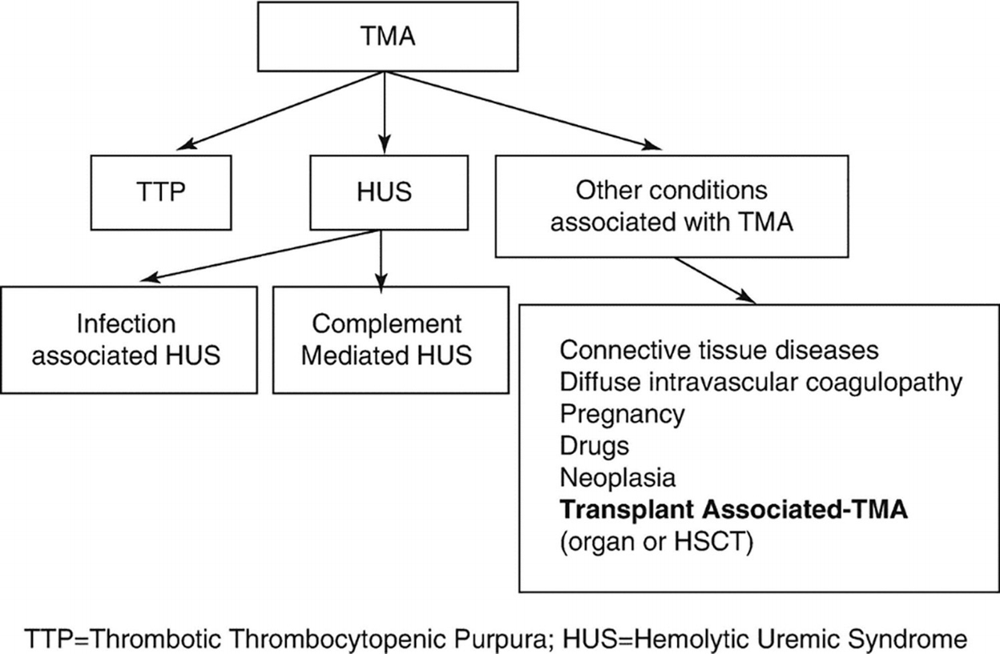
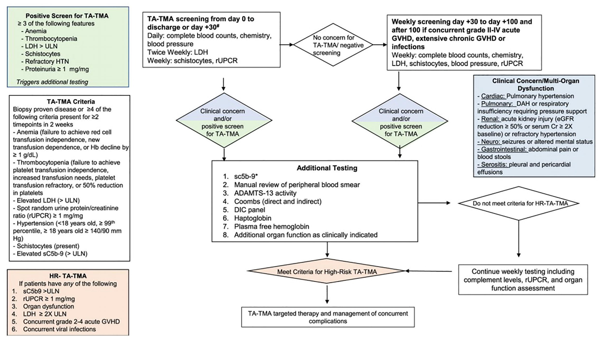

# Chapter 42. Early Complications of Endothelial Origin

> **Source:** Sureda A, Corbacioglu S, Greco R, Kröger N, Carreras E (eds). *The EBMT Handbook: Hematopoietic Cell Transplantation and Cellular Therapies*, 8th ed. Springer, Cham; 2024. pp. 373–383. https://doi.org/10.1007/978-3-031-44080-9_42  
> **Authors:** Carreras, Enric; Diaz-Ricart, M.; Jodele, S.; Penack, O.; Vasu, S.  
>   - Carreras, Enric: Barcelona Endothelium Team; Hospital Clinic/University of Barcelona Campus  
>   - Diaz-Ricart, M.: Barcelona Endothelium Team; Hospital Clínic of Barcelona, Biomedical Diagnosis Centre (CDB), Institute of Biomedical Research August Pi i Sunyer (IDIBAPS), University of Barcelona  
>   - Jodele, S.: Cincinnati Children’s Hospital Medical Center  
>   - Penack, O.: Charité Universitätsmedizin Berlin  
>   - Vasu, S.: Ohio State University  
> **License:** CC BY 4.0 (https://creativecommons.org/licenses/by/4.0/). Text reproduced verbatim from the open-access HTML edition; formatting converted to Markdown.

## Abstract

During HCT, the vascular endothelium is affected by conditioning, IS agents, inflammatory molecules released by injured cells and tissues, endotoxins translocated across injured mucosal barriers, the complex process of engraftment, and in allo-HCT immune alloreactivity. This endothelial damage can affect the entire vascular endothelium or that of specific organs and be the triggering event for several of the early complications grouped under denomination vascular endothelial syndromes of HCT.

## 42.1 Early Complications of Endothelial Origin

### 42.1.1 Introduction

Endothelial dysfunction is a common pathophysiology during inflammation and allo-immunity. The endothelium is the first contact for immunological effector cells in the blood and key to the regulation of various inflammatory processes. It is well known that during inflammatory diseases and allo-immune responses, activation of endothelial cells (ECs) occurs, leading to increased expression of adhesion molecules, release of chemokines, production of growth factors, and activation of coagulation factors. Published data indicate that endothelial dysfunction may be related to donor T-cell recognition of host HLA molecules on endothelial cells (ECs). In murine models, it was shown that the transfer of allogeneic lymphocytes leads to EC activation and damage (Deschaumes et al. 2007).

Additionally, the animal models of the most well-known endothelial syndrome, SOS/VOD (see Chap. 49), evidence that the first morphological alterations occur in endothelial cells (ECs) of the hepatic sinusoids (DeLeve et al. 1996). Similarly, multiple ex vivo and in vitro studies have shown that, in auto- and allo-HCT, there is a pro-inflammatory, prothrombotic, and pro-apoptotic state secondary to endothelial damage (Palomo et al. 2009, 2010; Carreras and Diaz-Ricart 2011).

### 42.1.2 Main Characteristics of These Early Complications

1.  1\.

    They appear early after HCT (between days 0 and +100).

2.  2\.

    Their diagnosis is based on the presence of overlapping medical signs and symptoms, and consequently, they are classified as syndromes.

3.  3\.

    They seem to begin at the capillary level, in a systemic way or in one or more affected organs.

4.  4\.

    If not properly treated, they can evolve into an irreversible MODS/MOF.

### 42.1.3 Classification of vascular endothelial syndromes

Nowadays, the following entities are considered secondaries to endothelial damage during HCT (Carreras 2020):

<table>
<tbody>
<tr>
<td colspan="2">
 – Fluid overload syndrome (FOS)

 – Capillary leak syndrome (CLS)

 – Sinusoidal obstruction syndrome (SOS/VOD) (see Chap. 49)

 – Pre-engraftment syndrome (pES) and engraftment syndrome (ES)

 – Thrombotic microangiopathy associated with HCT (TMA)

 – Vascular idiopathic pneumonia syndrome (vIPS) (see Chap. 52) including diffuse alveolar hemorrhage (DAH), pulmonary capillary hyperpermeability syndrome, and; peri-engraftment respiratory distress syndrome (PREDS).

 – Posterior reversible encephalopathy syndrome (PRES)

 – Acute graft-versus-recipient disease (aGVHD) (see Chap. 43)
</td>
</tr>
</tbody>
</table>

### 42.1.4 Biomarkers

Given the difficulty in establishing a correct differential diagnosis of these syndromes, attempts have been made for years to find panels of biomarkers that facilitate their diagnosis, but for the moment, except in aGVHD, little progress has been made since many of these syndromes share biomarkers that only reflect endothelial damage. For example, we could mention:

|          |                                                                                                                                   |
|----------|-----------------------------------------------------------------------------------------------------------------------------------|
| **SOS**  | vWF; sTM; P-selectin; PAI-1; sICAM-1; L-Ficolin; Ang-2; hyaluronan; IGF-1                                                         |
| **TMA**  | vWF; t-PA; sTM; Ab. anti-CFH; sC5b-9; ds-DNA; sST2                                                                                |
| **CLS**  | VEGF; Ang-2                                                                                                                       |
| **ES**   | CRP; procalcitonin; elafine; sST2; IL2R-α; TNFR1; IL-6                                                                            |
| **GVHD** | vWF; sICAM-1; sVCAM-1; sTM, TNFR1, E-selectin; Ang-2; EMP; sST2; REG3-α; CEC; Follistatin; PIGF; (panel Ang-2, sTM, dimer D, CRP) |

1.  Adapted from Luft et al. (2020), Hildebrandt and Chao (2020), and Putta et al. (2023). *vWF* von Willebrand factor; *sTM* soluble thrombomodulin; *PAI-1* plasminogen activator inhibitor-1; *sICAM-1* soluble intercellular adhesion molecule-1; *IGH-1* insulin-like growth factor; *t-PA* tissue plasminogen activator; *CHF* complement factor H; *sC5b-9* soluble complement C5b-9 fraction; *ds-DNA* double-stranded DNA; *sST2* soluble tumorigenicity suppressor-2; *VEGF* vascular endothelial growth factor; *Ang-2* angiopoietin-2; *CRP* C-reactive protein; *IL2R* interleukin-2 receptor; *TNFR1* tumor necrosis factor receptor 1; *IL* interleukin; *sVCAM-1* soluble vascular adhesion molecule-1; *EMP* endothelium-derived microparticles; *REG3* pancreatic islet-derived regenerating protein-3-alpha; *CEC* circulating endothelial cells; *PIGF* placental growth factor

### 42.1.5 EASIX

Despite all these efforts to have specific biomarkers available, today the “biomarker panel” that is proving most successful for the suspicion, diagnosis, and prognosis of endothelial dysfunction syndromes is the so-called EASIX (endothelial activation and stress index), which is obtained by applying the formula:

LDH (U / L) × Creatinine (mg/mL) / Platelets (× 10⁹/L)

EASIX has been shown to be an excellent surrogate marker to quantify endothelial damage. Measured before HCT, it predicts TMA and TRM. Measured at day 0, it predicts SOS. Measured at the onset of aGVHD, it predicts TRM. In addition, before HCT and on day 0, it predicts early water retention and early hyperbilirubinemia (without the need for SOS). Its value in other clinical situations such as MDS, MM, CAR-T cell therapy, and COVID-19 is being analyzed (Luft et al. 2020; Korell et al. 2022).

## 42.2 Fluid Overload Syndrome (FOS)

FOS is believed to be a consequence of increased vascular permeability caused by endothelial activation, as well as the usual hyperhydration used in conditioning. Despite its high frequency (up to 60% around day 0 of HCT), few publications recognize this entity (Rondón et al. 2017).

This diagnosis should be suspected when very early (even before the administration of stem cells), the patient presents weight gain, moderate dyspnea, nonproductive cough, and moderate hypoxemia in the absence of renal or cardiac insufficiency. Pulmonary auscultation shows bibasal moist rales, and radiology shows increased cardiothoracic index and diffuse alveolar/interstitial infiltrates. Central venous pressure is elevated. An elevated EASIX index on day 0 predicts this complication. If recognized and correctly managed with diuretics, it has no impact on TRM.

## 42.3 Capillary Leak Syndrome (CLS)

Idiopathic systemic capillary syndrome was described in healthy patients who presented episodic crisis of hypotension/hypoperfusion, hypoalbuminemia, and severe generalized edema (Clarkson disease). Usually, these manifestations could be reversed with steroids, vasopressors, fluid, and colloids, but some patients could die during the recovery phase due to cardiopulmonary failure. Very similar episodes have also been described after the administration of IL-2, IL-4, TNF-α, GM-CSF, and G-CSF and in the context of HCT (Nürnberger et al. 1997; Lucchini et al. 2016).

**Pathogenesis**: Many mechanisms have been suspected but, nowadays, due to the duration of the capillary leak and its reversibility, the endothelial injury seems to be the main cause of the capillary damage. The high levels of VEGF and angiopoietin-2 (potent inducers of vascular permeability) observed in these patients could play a role (Xie et al. 2012).

**Diagnosis** of CLS post-HCT is accepted when there is (Lucchini et al. 2016):

- Weight gain \>3% in 24 h, not justifiable by hydric overload.

- Generalized edema (ascites, pericardial, or pleural effusion).

- Absence of response to 24 h of furosemide treatment (at least 1 mg/kg).

it is not uncommon to observe tachycardia, hypotension, prerenal renal failure, and hypoalbuminemia.

No clear **risk factors** have been evident, although G-CSF has always been suspected. What is clear is that patients with CLS have a higher TRM and a higher incidence of aGVHD.

Its true **incidence** is unknown (due to the variable diagnostic criteria used) but mainly observed in children with 5.4% in the largest series (similar incidence between MAC and RIC).

**Treatment**: Only supportive measures are available, such as immediate withdrawal of growth factors, steroid treatment, hemodynamic support (catecholamines, colloids, and plasma), and even mechanical ventilation. Administration of C1-starchase inhibitor concentrates has been shown to be ineffective. In the only case described, the administration of Bevacizumab (MoAb against VEGF) was effective (Yabe et al. 2010), as was colchicine in the only two published cases (Cocchi et al. 2019).

## 42.4 Engraftment Syndrome (ES)

This syndrome has also been referred to as: implant CLS; auto-aggression syndrome; engraftment respiratory distress; aseptic septic shock, and autologous GVHD. It appears to result from endothelial dysfunction produced by the massive release of activated leukocytes and pro-inflammatory cytokines during the complex process of engraftment, plus all the previously mentioned factors that damage the endothelium during conditioning.

**Risk factors**: it has always been thought that ES may be related to infused cellularity (higher incidence with PB), concomitant administration of G-CSF/GM-CSF (potent endothelial toxicants), or the use of DMSO (in auto-HCT or CBT), without clear evidence of this. There does appear to be a correlation with the intensity of previous treatments received (Carreras et al. 2010) (see below).

**Diagnostic.** The existence of three very different diagnostic criteria (Spitzer 2001; Maiolino et al. 2003; Grant et al. 2020) has made it difficult to know the true incidence (7% to 59% in auto- and 10% to 25% in allo-HCT).

| Author                             | Spitzer (2001)    | Maiolino et al. (2003) | Grant et al. (2020) |
|------------------------------------|-------------------|------------------------|---------------------|
| **Clinical criteria observed**     | 3 M or 2 M + ≥1 m | 1 M + 1 m              | 2 M or 1 M + ≥2 m   |
| Hours before/after engraftment (E) | 96 \< E \< 96     | 24 \< E \< any after   | 96 \< E \< 24       |
| Noninfectious fever                | M                 | M                      | M                   |
| Skin rash \>25% body surface       | M \[2\]           | m                      | M                   |
| Pulmonary edema/hypoxia \[1\]      | M                 | m                      | m                   |
| Weight gain \>2.5% of basal        | m                 | m (\>3% of basal)      | m                   |
| Hepatic/renal dysfunction          | m                 | –                      | –                   |
| Encephalopathy                     | m                 | –                      | –                   |
| Diarrhea (≥2 episodes)             | –                 | m                      | m                   |

1.  *M* MAJOR criteria; *m* MINOR criteria. A CRP \>6 mg/dL (usually up to 10–15 mg/dL) at fever onset has an excellent positive and negative prognostic value (90% and 90%, respectively) and serves to monitor the response to treatment (Carreras et al. 2010). \[1\] Without cardiac failure, thromboembolism, or infection. \[2\] Without histological data of acute GVHD (Spitzer 2015)

From a descriptive point of view, it is advisable to separate the ES observed after auto-HCT (or syngeneic) and the ES observed after allo-HCT (excluding CBT –\> see preES).

- **ES in auto-HCT**. In these cases, the diagnosis is very simple allowing rapid treatment and resolution. For this reason, it is advisable to apply Maiolino’s diagnostic criteria. If Spitzer’s criteria are applied, up to 50% will not be diagnosed with ES.

- **ES in allo-HCT**. The diagnosis of ES is complex to establish in this context. In allo-HCT, the phenomena of alloreactivity, the use of CNI and the increased risk of infections require a broad differential diagnosis. Therefore, if suspected, it is advisable to use the Spitzer’s diagnostic criteria, which are much stricter and require that there be no histological alterations of GVHD to avoid possible confusion with an early aGVHD.

**Treatment**: (1) Stop G-CSF immediately, obtain cultures, and start broad-spectrum ATB. (2) After, 48 h to see the effect of ATBs and to know the result of cultures, and without withdrawing ATBs, start methyl-PDN 1 mg/kg q12h IV (×3 days) and taper out over a week. Remember that delay in starting treatment can lead to MOF (Dispenzieri et al. 2008). If early steroid treatment, rapid resolution of the picture in \>90% of cases (CRP levels are good indicators of response). If no rapid improvement, consider other diagnoses. Occasional relapses when steroids are stopped.

## 42.5 Pre-engraftment Syndrome (pES)

Initially called early inflammatory syndrome with a similar pathogenesis to ES + an alloreactivity component. pES is clinically similar to ES, but with three relevant differences (Lee and Rah 2016):

- It is characteristic of CBT, especially if they receive MAC.

- It occurs well before engraftment (approx. Day +7; 10–11 days before).

- Water retention is more frequent than in ES (30%).

Other aspects of interest are:

- It is more frequent than ES, with an incidence between 20% and 70% in CBT.

- The use of G-CSF, DMSO, and the higher percentage of NK cells in the inoculum are considered risk factors.

- It is associated with a lower incidence of engraftment failure, a higher incidence of GVHD and early bacterial infections, and an equal incidence of TRM, REL, or SRV (Park et al. 2013).

- Its treatment is the same as ES.

## 42.6 Thrombotic Microangiopathy Associated with HCT (TA-TMA)

### 42.6.1 Definition and Classification

TMA is a heterogeneous group of diseases characterized by microangiopathic hemolytic anemia and thrombocytopenia due to platelet clumping in the microcirculation leading to ischemic organ dysfunction. As this phenomenon could be observed in different clinical situations, a consensus on the standardization of terminology has been recently proposed by an International Working Group (Scully et al. 2017) (Fig. 42.1).

**Fig. 42.1**

Terminology of TMA

### 42.6.2 Pathogenesis

Like in the other vascular–endothelial syndromes after HCT, the endothelial injury due to the action of different factors (conditioning, lipopolysaccharides, CNI, alloreactivity, and GVHD) plays a crucial role in its development. Endothelial injury generates a prothrombotic and pro-inflammatory status that favors capillary occlusion.

However, unlike in other endothelial syndromes, the dysregulation of the complement system and the possible presence of specific antibodies (donor- or recipient-specific Ab, as anti-factor H Ab) could play a relevant role in some TA-TMA. The activation of the classical pathway of the complement system (by chemotherapy, infections, and GVHD) and the activation of the alternative pathway (favored by a genetically determined mutation of several genes (CFH, CFI, CFB, and CFHR1,3,5) produce deposits of C4d or C5b-9 (membrane attack complex) fractions, respectively (Jodele et al. 2016).

Recently, a “three-hit hypothesis” was proposed in which patients with either an underlying predisposition to complement activation or preexisting endothelial injury (Hit 1) undergo a toxic conditioning regimen causing endothelial injury (Hit 2), and then additional insults are triggered by medications, alloreactivity, infections, and/or antibodies (Hit 3) (Dvorak et al. 2019). Understanding this cycle of injury permits the development of a specific TA-TMA treatment algorithm designed to treat both the triggers and the drivers of the endothelial injury.

### 42.6.3 Clinical Manifestations

<table>
<thead>
<tr>
<th colspan="2">
Manifestations of microangiopathic hemolytic anemia
</th>
</tr>
</thead>
<tbody>
<tr>
<td colspan="2">
De novo anemia

De novo thrombocytopenia

Increased transfusion requirements

Elevated LDH

Schistocytes in the blood

Decreased haptoglobin (may be increased early in the disease process)

Increased free plasma hemoglobin
</td>
</tr>
<tr>
<td colspan="2">
<strong>Manifestations of organ damage</strong>
</td>
</tr>
<tr>
<td>
Kidney
</td>
<td>
Decreased glomerular filtration rate (by nuclear GFR or cystatin C GFR)

Proteinuria as measured by random urine protein/creatine ratio (rUPCR)

Microhematuria

Hypertension; ≥2 medications
</td>
</tr>
<tr>
<td>
Lungs
</td>
<td>
Hypoxemia, respiratory distress
</td>
</tr>
<tr>
<td>
Cardiovascular
</td>
<td>
Pulmonary hypertension, right-sided heart failure
</td>
</tr>
<tr>
<td>
GI tract
</td>
<td>
Abdominal pain/GI bleeding/ileus
</td>
</tr>
<tr>
<td>
CNS
</td>
<td>
Headaches/confusion

Hallucinations/seizures

Posterior reversible encephalopathy syndrome (PRES)
</td>
</tr>
<tr>
<td>
Skin
</td>
<td>
Purpura, ecchymoses
</td>
</tr>
<tr>
<td>
Testes
</td>
<td>
Painless vasculopathy
</td>
</tr>
<tr>
<td>
Polyserositis
</td>
<td>
Refractory pericardial/pleural effusion, and/or ascites, without generalized edema
</td>
</tr>
</tbody>
</table>

1.  Schoettler et al. (2023)

### 42.6.4 Diagnostic Criteria

The gold standard for diagnosis is a biopsy of the damaged organ. However, obtaining these samples is almost impossible in these patients, so TA-TMA remains a clinical diagnosis. Multiple diagnostic criteria have been proposed without universal application. To address this urgent need, the American Society for Transplantation and Cellular Therapy, Center for International Bone Marrow Transplant Research, Asia-Pacific Blood and Marrow Transplantation, and European Society for Blood and Marrow Transplantation experts proposed consensus criteria for TA-TMA diagnosis and prognosis (Schoettler et al. 2023).

<table>
<thead>
<tr>
<th colspan="2">
Harmonization panel consensus TA-TMA diagnostic criteria
</th>
</tr>
</thead>
<tbody>
<tr>
<td colspan="2">
1. Biopsy-proven disease of ANY organ <strong><em>OR</em></strong>
</td>
</tr>
<tr>
<td colspan="2">
2. Clinical diagnosis. <strong><em>Diagnostic criteria</em></strong> must meet <strong>≥4/7 of the following within 14 days at two consecutive time points</strong>
</td>
</tr>
<tr>
<td>
Anemiaa
</td>
<td>
Defined as one of the following:

1. Failure to achieve transfusion independence for pRBCS despite evidence of neutrophil engraftment

2. Hemoglobin decline from the patient’s baseline by 1 g/dL

3. New onset of transfusion dependence.

<em>Rule out other causes of anemia such as AIHA and PRCA</em>
</td>
</tr>
<tr>
<td>
Thrombocytopeniaa
</td>
<td>
Defined as one of the following:

1. Failure to achieve platelet engraftment

2. Higher than expected platelet transfusions needs

3. Refractoriness to platelet transfusions

4. 50% reduction in baseline platelet count after full platelet engraftment
</td>
</tr>
<tr>
<td>
Elevated LDH
</td>
<td>
Above the upper limit of normal for age
</td>
</tr>
<tr>
<td>
Schistocytes
</td>
<td>
Present
</td>
</tr>
<tr>
<td>
Hypertension
</td>
<td>
&gt;99th percentile for age (&lt;18 years old), or systolic BP ≥140 mmHg or diastolic BP ≥90 mmHg (≥18 years old)
</td>
</tr>
<tr>
<td>
Elevated sC5b-9
</td>
<td>
Greater than the upper limit of normal
</td>
</tr>
<tr>
<td>
Proteinuria
</td>
<td>
≥1 mg/mg random urine protein to creatinine ratio (rUPCR)
</td>
</tr>
</tbody>
</table>

1.  a Clarification from published Jodele et al., 2015

### 42.6.5 Clinical Forms, Incidence, Risk Factors, and Prognosis

- Clinical manifestations: onset day, median time day +32 to +40 (\>92% before day +100).

- Incidence: Prospective multi-institutional study in 13 pediatric centers showed TA-TMA incidence of 19% in allo-HCT recipients. In auto-HCT recipients, TA-TMA was observed exclusively in children with neuroblastoma after the second tandem transplant (25%). TA-TMA incidence in adult HCT recipients is not well defined, but large centers screening for TA-TMA report ~12–15% incidence (Dandoy et al. 2021).

- Risk factors: Use of CNI, the combination of sirolimus with CNIs (Chen et al. 2021), viral (CMV, ADV, BK virus, etc.) or fungal infection, active GVHD, URD/mismatch HCT (probably due to more infections and GVHD), and several gene polymorphisms (predominate in non-Caucasian).

- Risk stratification: TA-TMA is currently stratified into standard risk and high risk. Patients with TA-TMA presenting at least with one high-risk feature are assigned to high-risk group and should be considered for TA-TMA-targeted therapy.

- Prognosis: Despite the resolution of TA-TMA, these patients have an increased relative risk (RR) of chronic kidney disease (4.3); arterial hypertension (9); and TRM (5).

&nbsp;

<table>
<thead>
<tr>
<th colspan="2">
Risk stratification of TA-TMA by harmonization of definitions subcommittee
</th>
</tr>
<tr>
<th>
Standard-risk TA-TMA
</th>
<th>
High-risk TA-TMA
</th>
</tr>
</thead>
<tbody>
<tr>
<td>
 – Peak LDH &lt;2x ULN

 – rUPCR &lt;1 mg/mg

 – KDIGO stage I acute kidney injury

 – Normal C5b-9
</td>
<td>
 – Peak LDH ≥ 2× ULN*

 – rUPCR ≥1 mg/mg

 – any organ dysfunction that develops in the setting of TMA except KDIGO stage I acute kidney injury

 – Elevated soluble C5b-9 (&gt; ULN)

 – Concurrent acute GVHD grade II-IV *

 – Concurrent systemic infection (bacterial or viral)*
</td>
</tr>
</tbody>
</table>

1.  International Consensus Risk stratification is a modification of Jodele et al., 2015 with the additional risk factors indicated by an asterisk (\*) (Schoettler et al. 2023). Kidney disease improving global outcomes (KDIGO) stage 1 kidney injury is defined as serum creatinine of 1.5–1.9-time baseline. Lactate dehydrogenase (LDH), random urine protein to creatinine ratio (rUPCR)

### 42.6.6 Recommended Screening and Diagnostic Work-Up for TA-TMA (Fig. 42.2)

There is sufficient evidence supporting routine screening of all allo- and pediatric auto-HCT recipients with an underlying diagnosis of neuroblastoma through day 100 post-HCT. Screening also should be considered after day 100 in patients who develop a known risk factor for TA-TMA, including acute GVHD, chronic GVHD, or infection. In patients with \>3 abnormal screening laboratory test results or clinical manifestations or organ dysfunction concerning TA-TMA, additional testing should be done. In patients who meet the criteria for high-risk TA-TMA, treatment with TA-TMA-directed therapy should be considered. Patients who do not meet high-risk criteria should be monitored closely, and treatment may be initiated at the discretion of the clinician if cytopenia or other manifestations persist. Triggers of TA-TMA (e.g., infection, GVHD) should be aggressively managed. If sC5b-9 testing is not available, screening of urine and other organ function should continue, and treatment offered to patients meeting high-risk TA-TMA criteria.

**Fig. 42.2**

Recommended screening and diagnostic work-up

### 42.6.7 Treatment

<table>
<thead>
<tr>
<th>
Supportive therapy
</th>
</tr>
</thead>
<tbody>
<tr>
<td>
Red cell and platelet transfusion support

Discontinue causative agents, if feasible

Modify immunosuppression, if risk/benefit assessment is in favor (be cautious not to provoke acute GVHD)

Treat GVHD, infections

Aggressively treat hypertension

Monitor for organ injury

Nutrition, vitamin support (Vit D, C)
</td>
</tr>
<tr>
<td>
<strong>TA-TMA-targeted therapy</strong>
</td>
</tr>
<tr>
<td>
 • Complement blocking agents with reported clinical benefit:

   – eculizumab (C5 blocker): most promising targeted agent for high-risk complement-mediated TA-TMA in children and adults, demonstrating increased survival to 70% in high-risk TA-TMA and recovery of organ function in survivors (Jodele et al. 2020).

   – narsoplimab (MASP2 inhibitor): most experience in adults demonstrating 68% survival at 100 days (Khaled et al. 2022).

 • Complement-blocking agents currently being evaluated in clinical studies for TA-TMA:

   – Ravulizumab (C5 blocker)

   – Nomacopan (C5 blocker)

   – Pegcetacoplan (C3 blocker)

 • Therapeutic plasma exchange (TPE): TA-TMA responses had been reported with early initiation of TPE. It may serve as an alternative option for selected patients when complement-blocking agents are not available. In patients with ab anti-factor H, responses had been reported in combination with rituximab.

 • Rituximab: Reported 12/15 responses to Rituximab + TPE.(Uderzo et al. 2014)

 • Defibrotide: responses documented in children and adults after HCT in retrospective multi-institutional review (Yeates et al. 2017)
</td>
</tr>
<tr>
<td>
<strong>TA-TMA prophylaxis</strong>
</td>
</tr>
<tr>
<td>
 • Defibrotide: has been studied as prophylactic agent in pediatric patients with high-risk TA-TMA (Higham et al. 2022: Richardson et al. 2021)

 • N-acetylcysteine: potential benefit was demonstrated in the prospective randomized study (Pan et al. 2022)

 • Statins: Statin-based endothelial prophylaxis (SEP) has been shown beneficial in adult HCT recipients with the reduction of GVDH and TA-TMA (Pabst et al. 2023).
</td>
</tr>
</tbody>
</table>

<table>
<thead>
<tr>
<th colspan="2">
TA-TMA key points
</th>
</tr>
</thead>
<tbody>
<tr>
<td colspan="2">
 • TA-TMA is now a well-recognized endothelial injury syndrome after HCT, resulting in high mortality and morbidity.

 • Prospective screening for TA-TMA allows timely disease diagnosis and risk stratification.

 • Early diagnosis is essential to prevent TA-TMA-associated organ injury and improve outcome.

 • Complement-blocking therapies are the most promising targeted interventions for high-risk TA-TMA and have been shown to be safe in HCT recipients.

 • Given the limited availability of complement-blocking agents, all modifiable risk factors that may favor the development of TA-TMA should be avoided.

 • Prophylactic and preventative strategies to reduce or severity of TA-TMA are needed
</td>
</tr>
</tbody>
</table>

## 42.7 Posterior Reversible Encephalopathy Syndrome (PRES)

**Pathogenesis**: There are two theories (Fischer and Schmutzhard 2017): 1) Rapid rise in blood pressure (BP) as a trigger. However, about 30% of patients with PRES show normal or minimally elevated BP values. 2) Triggered by endothelial dysfunction leakage caused by endogenous circulating toxins. In favor of this hypothesis, PRES is frequently observed in patients with (pre)eclampsia, sepsis, or during HCT or cytotoxic treatments (Geocadin 2023).

**Risk factors** for this complication are not clearly established but have been described: hypertension (sometimes just an elevated mean blood pressure), fludarabine, HCT for Hbpathies, CNI, hypoMg, and presence of aGVHD II-IV. The **incidence** is variable among the published series and appears to be around 8% in allo-HCT with a wide range from 1% following haplo-HCT (Chen et al. 2021) to 25% in HCT due to sickle cell disease (Shenoy et al. 2017).

The most frequent PRES **clinical manifestations** are (Fischer and Schmutzhard 2017) encephalopathy, disturbances in consciousness, hypertension (sometimes simply elevated mean arterial blood pressure), seizures, visual disturbances, headache, and occasionally neurological focality.

CSF is essential for differential diagnosis but normal in PRES. EEG: it is useful for the detection of epileptic seizures (nonconvulsive) and status epilepticus and for evaluating encephalopathy.

MRI of the brain: evidence of bilateral parieto-occipital vasogenic edema (more evident in T2 or FLAIR sequences) although they may be distributed asymmetrically. Due to the lower density of the white matter, the subcortical areas are the most affected but cortical involvement has also been described. Lesions in other areas are infrequent.

**PRES treatment** is symptomatic as there are no specific therapies. Treat hypertension (if present), anticonvulsant, or hypomagnesemia treatment if necessary. Act on possible triggers: it has always been said that stopping CNIs was the best measure and several isolated cases reported in the literature seem to indicate this. But in the few studies in which stopping (or changing) the CNI while maintaining it (Hammerstrom et al. 2013; Singer et al. 2015), no different evolution of PRES has been observed.

In more than 80% of cases, all manifestations of PRES disappear rapidly. Neurological sequelae may be present in a few cases, but the majority of patients who die do so from intercurrent causes. PRES does not seem to affect TRM or SRV.

## References

- Carreras E. Barcelona endothelium team. Vascular endothelial syndromes after HCT: 2020 update. Bone Marrow Transplant. 2020;55:1885–7.

- Carreras E, Diaz-Ricart M. The role of the endothelium in the short-term complications of hematopoietic SCT. Bone Marrow Transplant. 2011;46:1495–502.

- Carreras E, Fernández-Avilés F, Silva L, et al. Engraftment syndrome after auto-SCT: analysis of diagnostic criteria and risk factors in a large series from a single center. Bone Marrow Transplant. 2010;45:1417–22.

- Chen X, Sun H, Cassady K, et al. The addition of sirolimus to GVHD prophylaxis after allogeneic hematopoietic stem cell transplantation: a meta-analysis of efficacy and safety. Front Oncol. 2021;11:683263.

- Cocchi E, Chiale F, Gianoglio B, et al. An impressive effect on posttransplant capillary leak syndrome and renal failure. Pediatrics. 2019;143:e20182820.

- Dandoy CE, Rotz S, Alonso PB, et al. A pragmatic multi-institutional approach to understanding transplant-associated thrombotic microangiopathy after stem cell transplant. Blood Adv. 2021;5:1–11.

- DeLeve LD, Wang X, Kuhlenkamp JF, et al. Toxicity of azathioprine and monocrotaline in murine sinusoidal endothelial cells and hepatocytes: the role of glutathione and relevance to hepatic venoocclusive disease. Hepatology. 1996;23:589–99.

- Deschaumes C, Verneuil L, Ertault-Daneshpouy M, et al. CD95 ligand-dependant endothelial cell death initiates oral mucosa damage in a murine model of acute graft versus host disease. Lab Investig. 2007;87:417–29.

- Dispenzieri A, Lacy MQ, Hayman SR, et al. Peripheral blood stem cell transplant for POEMS syndrome is associated with high rates of engraftment syndrome. Eur J Haematol. 2008;80:397–406.

- Dvorak CC, Higham C, Shimano KA. Transplant-associated thrombotic Microangiopathy in pediatric hematopoietic cell transplant recipients: a practical approach to diagnosis and management. Front Pediatr. 2019;7:133.

- Fischer M, Schmutzhard E. Posterior reversible encephalopathy syndrome. J Neurol. 2017;264:1608–16.

- Geocadin RG. Posterior reversible encephalopathy syndrome. N Engl J Med. 2023;388:2171–8.

- Grant A, Chapman LRM, Mitchell R, O’Brien TA. Engraftment syndrome following hematopoietic stem cell transplant: a review of the literature. Clin Transpl. 2020;34:e13875.

- Hammerstrom AE, Howell J, Gulbis A, et al. Tacrolimus-associated posterior reversible encephalopathy syndrome in hematopoietic allogeneic stem cell transplantation. Am J Hematol. 2013;88:301–5.

- Higham CS, Shimano KA, Melton A, et al. A pilot trial of prophylactic defibrotide to prevent serious thrombotic microangiopathy in high-risk pediatric patients. Pediatr Blood Cancer. 2022;69:e29641.

- Hildebrandt GC, Chao N. Endothelial cell function and endothelial-related disorders following haematopoietic cell transplantation. Br J Haematol. 2020;190:508–19.

- Jodele S, Laskin BL, Dandoy CE, et al. A new paradigm: diagnosis and management of HSCT-associated thrombotic microangiopathy as multi-system endothelial injury. Blood Rev. 2015;29:191–204.

- Jodele S, Zhang K, Zou F, et al. The genetic fingerprint of susceptibility for transplant-associated thrombotic microangiopathy. Blood. 2016;127:989–96.

- Jodele S, Dandoy CE, Lane A, et al. Complement blockade for TA-TMA: lessons learned from a large pediatric cohort treated with eculizumab. Blood. 2020;135:1049–57.

- Khaled SK, Claes K, Goh YT, et al. Narsoplimab, a Mannan-binding lectin-associated serine Protease-2 inhibitor, for the treatment of adult hematopoietic stem-cell transplantation-associated thrombotic Microangiopathy. J Clin Oncol. 2022;40:2447–57.

- Korell F, Penack O, Mattie M, et al. EASIX and severe endothelial complications after CD19-directed CAR-T cell therapy-acohort study. Front Immunol. 2022;13:877477.

- Lee YH, Rah WJ. Pre-engraftment syndrome: clinical significance and pathophysiology. Blood Res. 2016;51:152–4.

- Lucchini G, Willasch AM, Daniel J, et al. Epidemiology, risk factors, and prognosis of capillary leak syndrome in pediatric recipients of stem cell transplants: a retrospective single-center cohort study. Pediatr Transplant. 2016;20:1132–6.

- Luft T, Benner A, Terzer T, et al. EASIX and mortality after allogeneic stem cell transplantation. Bone Marrow Transplant. 2020;55:553–61.

- Maiolino A, Biasoli I, Lima J, et al. Engraftment syndrome following autologous hematopoietic stem cell transplantation: definition of diagnostic criteria. Bone Marrow Transplant. 2003;31:393–7.

- Nürnberger W, Willers R, Burdach S, Göbel U. Risk factors for capillary leakage syndrome after bone marrow transplantation. Ann Hematol. 1997;74:221–4.

- Pabst C, Schreck N, Benner A, et al. Statin-based endothelial prophylaxis and outcome after allogeneic stem cell transplantation. Eur J Clin Investig. 2023;53:e13883.

- Palomo M, Diaz-Ricart M, Carbo C, et al. The release of soluble factors contributing to endothelial activation and damage after hematopoietic stem cell transplantation is not limited to the allogeneic setting and involves several pathogenic mechanisms. Biol Blood Marrow Transplant. 2009;15:537–46.

- Palomo M, Diaz-Ricart M, Carbo C, et al. Endothelial dysfunction after hematopoietic stem cell transplantation: role of the conditioning regimen and the type of transplantation. Biol Blood Marrow Transplant. 2010;16:985–93.

- Pan T, Qi J, Tang Y, et al. N-acetylcysteine as prophylactic therapy for transplantation-associated thrombotic microangiopathy: a randomized, placebo-controlled trial. Transplant Cell Ther. 2022;28:764.e1–7.

- Park M, Lee SH, Lee YH, et al. Pre-engraftment syndrome after unrelated cord blood transplantation: a predictor of engraftment and acute graft-versus-host disease. Biol Blood Marrow Transplant. 2013;19:640–6.

- Putta S, Young BA, Levine JE, et al. Prognostic biomarkers for hepatic veno-occlusive disease/sinusoidal obstruction syndrome in myeloablative allogeneic hematopoietic cell transplantation: results from the blood and marrow transplant clinical trials network 1202 study. Transplant Cell Ther. 2023;3:166.e1–166.e10.

- Richardson PG, Palomo M, Kernan NA, et al. The importance of endothelial protection: the emerging role of defibrotide in reversing endothelial injury and its sequelae. Bone Marrow Transplant. 2021;56:2889–96.

- Rondón G, Saliba RM, Chen J, et al. Impact of fluid overload as new toxicity category on hematopoietic stem cell transplantation outcomes. Biol Blood Marrow Transplant. 2017;23:2166–71.

- Schoettler ML, Carreras E, Cho B, et al. Harmonizing definitions for diagnostic criteria and prognostic assessment of transplantation-associated thrombotic Microangiopathy: a report on behalf of the European Society for Blood and Marrow Transplantation, American Society for Transplantation and Cellular Therapy, Asia-Pacific Blood and Marrow Transplantation Group, and Center for International Blood and Marrow Transplant Research. Transplant Cell Ther. 2023;29:151–63.

- Scully M, Cataland S, Coppo P, et al. Consensus on the standardization of terminology in thrombotic thrombocytopenic purpura and related thrombotic microangiopathies. J Thromb Haemost. 2017;15:312–22.

- Shenoy S, Angelucci E, Arnold SD, et al. Current results and future research priorities in late effects after hematopoietic stem cell transplantation for children with sickle cell disease and thalassemia: a consensus statement from the second pediatric blood and marrow transplant consortium international conference on late effects after pediatric hematopoietic stem cell transplantation. Biol Blood Marrow Transplant. 2017;23:552–61.

- Singer S, Grommes C, Reiner AS, et al. Posterior reversible encephalopathy syndrome in patients with cancer. Oncologist. 2015;20:806–11.

- Spitzer TR. Engraftment syndrome following hematopoietic stem cell transplantation. Bone Marrow Transplant. 2001;27:893–8.

- Spitzer TR. Engraftment syndrome: double-edged sword of hematopoietic cell transplants. Bone Marrow Transplant. 2015;50:469–75.

- Uderzo CC, Jodele S, Missiry ME, et al. Transplant-associated thrombotic microangiopathy (TATMA) and consensus based diagnostic and therapeutic recommendations: which TA-TMA patients to treat and when? J Bone Marrow Res. 2014;2:152–9.

- Xie Z, Ghosh CC, Patel R, et al. Vascular endothelial hyperpermeability induces the clinical symptoms of Clarkson disease (the systemic capillary leak syndrome). Blood. 2012;119:4321–3.

- Yabe H, Yabe M, Koike T, et al. Rapid improvement of life-threatening capillary leak syndrome after stem cell transplantation by bevacizumab. Blood. 2010;115:2723–4.

- Yeates L, Slatter MA, Bonanomi S, et al. Use of defibrotide to treat transplant-associated thrombotic microangiopathy: a retrospective study of the paediatric diseases and inborn errors working parties of the European Society of Blood and Marrow Transplantation. Bone Marrow Transplant. 2017;52:762–4.
