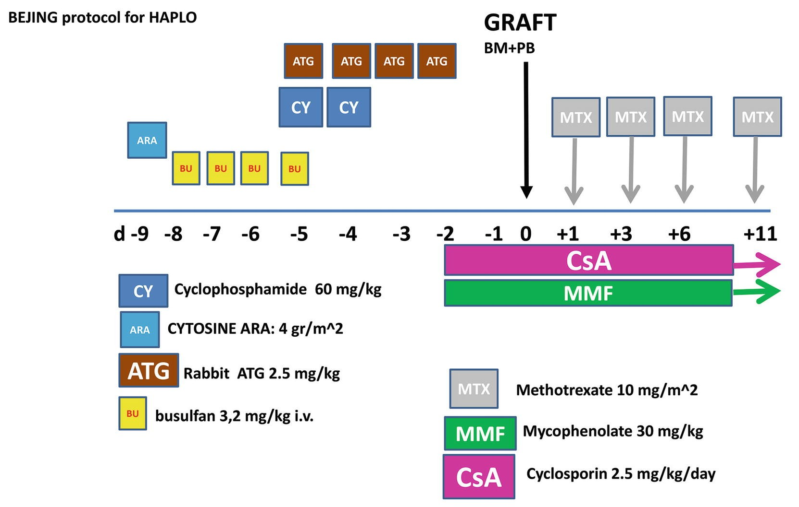
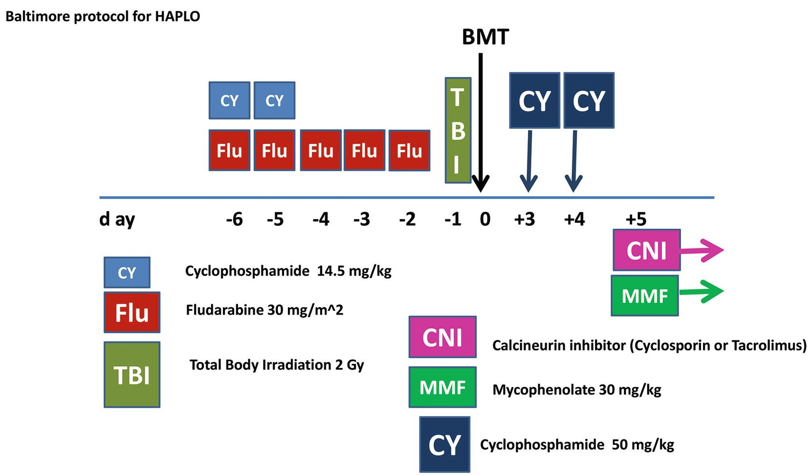
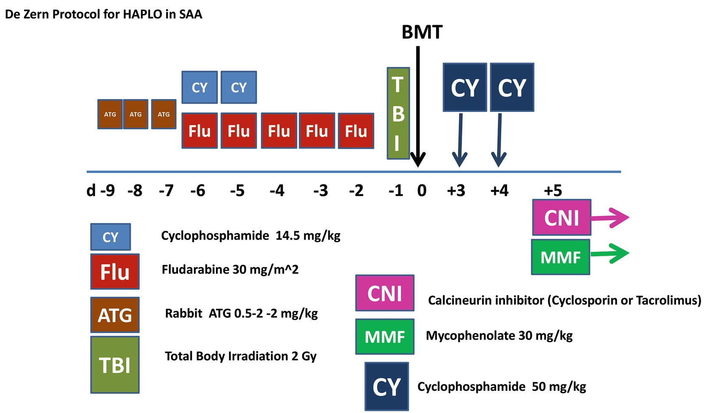

# Chapter 65. Haploidentical HCT

> **Source:** Sureda A, Corbacioglu S, Greco R, Kröger N, Carreras E (eds). *The EBMT Handbook: Hematopoietic Cell Transplantation and Cellular Therapies*, 8th ed. Springer, Cham; 2024. pp. 577–585. https://doi.org/10.1007/978-3-031-44080-9_65  
> **Authors:** Bacigalupo, Andrea; Lankester, Arjan; Ciceri, Fabio; Bertaina, Alice  
>   - Bacigalupo, Andrea: Istituto di Ematologia, Fondazione Polclinico Universitario A. Gemelli IRCCS, Universita’ Cattolica del Sacro Cuore  
>   - Lankester, Arjan: Leiden University Medical Center  
>   - Ciceri, Fabio: IRCCS San Raffaele Scientific Institute, University Vita-Salute San Raffaele  
>   - Bertaina, Alice: School of Medicine, Stanford University  
> **License:** CC BY 4.0 (https://creativecommons.org/licenses/by/4.0/). Text reproduced verbatim from the open-access HTML edition; formatting converted to Markdown.

## Abstract

We will discuss two platforms of haploidentical HSCT(haplo-HSCT): ex vivo T cell depletion and unmanipulated in vivo T-cell depletion. The former has evolved from positive selection of CD34+ cells to selection of CD34+ cells associated with alpha/beta T cell and CD19 B cell depletion. We will outline the outcome of these procedures in children and adults. More recently selective add back of Treg Tcon has also been developed and will be discussed. The second platform is unmanipulated haplo-HSCT: PTCy and ATG have been used alone or in combination to optimize prevention of GvHD. We will discuss the outcome in patients with hematologic malignancies as well as in patients with non-malignant disorders, such as aplastic anemia, hemoglobinopathies, and immune deficiencies.

## 65.1 Ex Vivo TCD Platforms

The physical removal of donor T cells from the graft has been pioneered on adult patients by the group of Perugia in the late 1990s (Aversa et al. 1998). The original concept was to prevent GvHD by infusing a high-dose CD34-enriched graft with a T cell content \<1 × 10⁴/kg of recipient body weight.

### 65.1.1 Positive CD34 Selection

The first generation of ex vivo graft manipulation by antibody-based immunomagnetic methodology has been the positive selection of CD34+ cells using the CliniMACS^(®) System. Using G-CSF ± Plerixafor mobilized PBSC, CD34+ selected grafts provide a megadose of stem cells (\>1010⁶/Kg) along with a negligible dose of T cells. (Aversa et al. 1998; Ciceri et al. 2008; Reisner et al. 2011). To ensure engraftment, the infusion of such a graft required the combination of fully myeloablative and immunoablative conditioning regimens including ATG, TBI, fludarabine, and thiotepa.

Despite the application of such intensive immunoablative regimens, 10–15% of transplanted patients required a second HCT due to primary graft failure or rejection. While this approach was very effective to prevent GvHD, patients given these low dose T cell grafts, and especially when receiving serotherapy as part of conditioning, were typically characterized by substantially delayed immune reconstitution resulting in high incidence of life-threatening opportunistic infections and leukemia relapse (Reisner et al. 2011; Perruccio et al. 2005; Ciceri et al. 2008). Therefore, adoptive cellular therapies were developed to enhance T cell immune reconstitution without concomitant risk for GvHD (Perruccio et al. 2005; Di Ianni et al. 2011; Ciceri et al. 2009). Donor T cells genetically modified to express HSV-thymidine kinase suicide gene (Zalmoxis^(®)) have been registered by the European Medicines Agency as adjunctive therapeutic tool post haploidentical HCT. In the pediatric population, virus-specific T cells have shown promise (Leen et al. 2009; Feucht et al. 2015).

### 65.1.2 CD3/CD19 Negative Selection

To overcome some of the shortcomings of the CD34+ selection method, a second generation of ex vivo graft manipulation was developed using CD3/CD19 depletion by the same CliniMACS system. This approach keeps stem and progenitor cells untouched while retaining immune effector cells, in the cellular product (Bethge et al. 2006; Federmann et al. 2011, 2012). Compared to CD34+ positive selection, the CD3/CD19 depletion approach seems associated with more favorable CD4 T cell reconstitution, while the difference for other immune and clinical outcome parameters is less evident (Salzmann-Manrique et al. 2018).

### 65.1.3 TCRα/β and CD19 Depletion

To more selectively remove the GvHD causing T cells from the graft, CD3 depletion was replaced by depletion of TCRα/β expressing T cells with the aim to reduce the risk for GvHD while maintaining the potentially beneficial anti-leukemic and anti-pathogen gamma-delta T cells and NK cells in the graft (Li Pira et al. 2016). In the last decade, this method has been proven to be associated with positive outcomes in pediatric and adult patients with malignant as well as non-malignant diseases, including low rates of TRM, low rates of relapse, fast neutrophil and platelet recovery, and improved chronic GvHD-free/relapse-free survival, compared to unmanipulated mismatched unrelated HCT. These results indicate that the TCRα/β depletion approach can be considered an effective and safe option for patients who require a stem cell transplant but lack a fully matched donor (Bertaina et al. 2014; Locatelli et al. 2013; Lum et al. 2022; Merli et al. 2022; Tsilifis et al. 2022). Despite these advances, delayed reconstitution of TCRα/β T cells remains an issue and is associated with a high rate of viral reactivations (~50%) in the first 2–3 months. To overcome this window of immune deficiency, several adoptive GvHD-sparing cellular therapy approaches have been and are being explored in clinical trials including virus-specific T cells, suicide gene-modified DLI, T cell progenitors, and memory T cell infusions (Sect. 65.1.5).

### 65.1.4 Co-Infusion of Regulatory T Cells

The Perugia group as well as others recently implemented a new variation of ex vivo TCD, which includes the co-infusion of regulatory T cells, followed by mature T cells (Pierini et al. 2021): preferential migration of regulatory T cells to the lymph nodes, but not the bone marrow, prevents GvHD (in the lymph nodes) and allows, at the same time, a strong graft versus leukemia (in the bone marrow). The result is an extremely low incidence of leukemia relapse (Pierini et al. 2021).

### 65.1.5 CD45RA+ Depletion

Mouse models have demonstrated the capacity of naïve T cells (CD45RA+) to cause severe GvHD, whereas memory T cells (CD45RA-RO+) induced mild or no GvHD (Anderson et al. 2003). In the last decade, few groups have implemented the use of CD45RA+ depletion targeting naïve T cells to reduce the risk of GvHD in mismatched HCST (Triplett et al. 2018; Gasior Kabat et al. 2021; Maschan et al. 2017).

## 65.2 Unmanipulated Haploidentical HCT

The number of unmanipulated HLA haploidentical transplants has been rapidly increasing over the past 15 years (Passweg et al. 2012), due to the successful prevention of two major problems: lethal GvHD and graft rejection. There are currently three main platforms to perform unmanipulated haplo-HCT:

- ATG based → together with CSA, MMF, and MTX (Lu et al. 2006),

- PTCy based → together with FK/CSA, MMF (Luznik et al. 2008), and

- ATG + PTCy → together with other in vivo immunosuppressants (DeZern et al. 2017; Duléry et al. 2018)

### 65.2.1 Anti-Thymocyte Globulin (ATG) Based

Following the pioneering work of Dao Pei Lu (Lu et al. 2006), the ATG-based prophylaxis has been shown to allow significant engraftment and control of GvHD, in recipients of haplo-HCT, such that the outcome is comparable with recipients of HLA-matched grafts (Wang et al. 2013).

The Beijing protocol consists of a myeloablative conditioning regimen (ARA-C, BU 4 days and CY 2 days), together with rabbit ATG 2.5 mg/kg/day (Fig. 65.1). GvHD prophylaxis is based on 4 drugs (ATG, CSA, MTX, MMF) (Fig. 65.1). The stem cell source is a combination of G-CSF (G)-mobilized bone marrow (G-BM) and G-mobilized PB. A modification of the Beijing protocol has used unmanipulated G-BM alone (Ji et al. 2005) and included intensive GvHD prophylaxis with ATG, CSA, MTX, and MMF with the addition of basiliximab, an anti-CD25 antibody. The same GvHD prophylaxis has been reported by an Italian consortium (Di Bartolomeo et al. 2010), with a different conditioning regimen (thiotepa, busulfan, fludarabine) (TBF), originally described by Sanz and coworkers for cord blood transplants (Sanz et al. 2012).

**Fig. 65.1**

The Beijing protocol, first published in 2006 (Lu et al. 2006), used for patients with hematologic malignancies

### 65.2.2 Post-transplant Cyclophosphamide (PT-Cy) Based

The use of PT-Cy on day +3 and +4 after an unmanipulated haplo-HCT has been pioneered by the Baltimore group (Fig. 65.2). It is based on the combination of FLU Cy and low dose TBI (2 Gy), followed by unmanipulated haplo BM; GvHD prophylaxis consists of high-dose CY on day +3 +4 (50 mg/kg) combined with a CNI and MMF (Fig. 65.2).

**Fig. 65.2**

The Baltimore protocol with high-dose Cy post-transplant on days +3 +4

It is based on the idea that high-dose Cy (50 mg/kg) will kill alloreactive T cells proliferating on day +3 and +4 after the transplant, whereas stem cells would be protected because they are not proliferating and with a high concentration of aldehyde dehydrogenase. In 2008, the Baltimore group published their first clinical study and showed that PT-Cy was able to protect patients from GvHD after haplo-HCT (Luznik et al. 2008). not only GvHD could be prevented, but GvL seemed superior, at least in patients with HL.

There have been numerous variations of the Baltimore protocol, with use of G-PB instead of BM (Bashey et al. 2017), rapamycin, instead of a CNI (Cieri et al. 2015), the use of a MAC regimen instead of the NMA regimen of Baltimore (Raiola et al. 2013; Bashey et al. 2017), suggesting a certain degree of flexibility of PTCy-based platforms. Engraftment is achieved in over 95% of patients, and there is good control of acute and chronic GvHD.

PTCy dose and timing. There are several open questions: the first is whether the dose of 50 mg/kg × 2 can be modified. The question is relevant since cardiac toxicity of PTCy 50 mg/kg × 2 has been reported (Duléry et al. 2021), with clinical consequences such as atrial fibrillation, heart failure, and death. A reduced dose of 40 mg/kg × 2 (Sugita et al. 2021) as well as 25 mg/kg × 2 (McAdams et al. 2021) has been reported as effective. It would be clearly very important to assess the minimal effective dose of PTCy, in order to reduce cardiac toxicity, accelerate neutrophil recovery, and maintain protection against GvHD. Another open question is the timing of PTCy. The Baltimore protocol calls for PTCy on days +3 +4 with CNI and MMF starting *after* PTCy (Fig. 65.2). One center has introduced a different timing with PT-Cy on days +3 and +5, together with CSA and MMF starting *before* PT-Cy (Raiola et al. 2013); the feasibility and effectiveness of this timing have been confirmed (Chiusolo et al. 2018). The EBMT has compared the two different options for PTCy: day +3 +4 vs. day +3 +5, in patients with AML (Ruggeri et al. 2020): patients receiving PTCy day +3 +5, had reduced incidence of relapse and improved DFS. It should be said that this regimen is safe when using BM as a stem cell source, with acute GvHD III–IV rates of 3%; however, it is not known what the outcome would be with PB as a stem cell source, since CSA will protect some T cells from PT-Cy purging, and these may produce a beneficial GvL effect but also cause detrimental GvHD.

### 65.2.3 ATG + PT-Cy

Some centers are combining the two basic platforms (PT-Cy and ATG), and early results seem promising. The Baltimore group is using this combination for patients with aplastic anemia, in the attempt of avoiding GvHD completely (DeZern et al. 2017, 2020) (Fig. 65.3). The difference here is adding ATG before the conditioning regimen on days -9-8-7, and combining with PTCy, CNI, and MM (4 drug GvHD prophylaxis). Also, the group in Saint-Antoine, Paris, is using a combination of ATG 2.5 mg/kg and PT-Cy, CSA, and MMF for patients with acute leukemia undergoing a MAC haplo-HCT (Duléry et al. 2018).

**Fig. 65.3**

4 drug GvHD prophylaxis (ATG, PTCY, CNI and MMF) for haplo transplants in SAA (De Zern et al 2020). TBI has recently been increased to 4 Gy

## 65.3 Other Relevant Aspects of Haplo-HCT

### 65.3.1 Choice of the Best Haploidentical Donor

The EBMT ALWP has established younger donor age and kinship, as a major determinant of outcome for leukemia patients grafted from haploidentical donor (Canaani et al. 2018). The Beijing group has confirmed younger age to be relevant, using their ATG-based platform together with a mismatch for non-inherited maternal antigen (NIMA) (Wang et al. 2014). One report has suggested that NK alloreactivity, together with HLA-DP disparity might identify an optimal haplo donor (Solomon et al. 2018). Other reports have denied an effect of increasing HLA disparity on major outcomes (Wang et al. 2014). There is currently no solid data to choose a haploidentical donor based on HLA disparities.

### 65.3.2 Comparison of ATG-Based Versus PT-Cy-Based Platforms

The EBMT Acute Leukemia Working Party has compared these two platforms (Ruggeri et al. 2017). In a Cox analysis, ATG-based haplo grafts had a higher risk of failure, in terms of LFS (RR 1.48, *p* = 0.03), GvHD relapse-free survival (RR 1.45, *p* = 0.03), and OS (HR 1.43, *p* = 0.06): there was for all end points a very strong center effect (*p* \< 0.001), suggesting that a learning curve is required for optimal results in haplo-HCT.

### 65.3.3 Bone Marrow or Peripheral Blood

There are two large registry-based studies comparing BM versus PB for unmanipulated haplo-HCT: the EBMT study (Ruggeri et al. 2018) shows increased GvHD II–IV and III–IV with PB, same chronic GvHD, same relapse, and same 2-year OS (55% and 56%). The CIBMTR shows increased GvHD II–IV, but not III–IV with PB grafts, increased chronic GvHD, and reduced relapse (Bashey et al. 2017): survival at 2 years also in this study is quite similar, 54% vs. 57%. So, it seems that one can use both stem cell sources, with some difference in the short term (more GvHD with PB) and perhaps some differences in the long term (cGvHD and relapse): at the end survival seems comparable.

### Key Points

- Following the pioneering work of the Perugia group, HLA-haplotype mismatch family transplants using ex vivo T cell depletion is evolving, with the use of T cell subpopulations and the use of Treg Tcon.

- Unmanipulated haplo-HCT is rapidly increasing in numbers, worldwide, due to the introduction of post-transplant cyclophosphamide (PTCy).

- There are two platforms for unmanipulated haplo-HCT: ATG based or PTCy based.

- ATG can be combined with PTCy, CSA, and MMF, to further reduce GvHD: this is being tested especially in non-malignant disorders.

- One important question is how haplo-HCT compare with unrelated donor grafts, and to answer this question, randomized trials have been designed and are about to start.

- One should consider that HLA-haplotype mismatch transplants remain an alternative donor procedure and should be regarded as such complications, including blood stream infections, invasive fungal disease, viral infections, GvHD, and toxicity may occur with significant frequency and expose the patients to the risk of TRM. For this reason, HLA-haplotype mismatch grafts, whether TCD or unmanipulated, should be performed in centers with expertise in MUD or CB HCT and should follow clinical protocols.

## Abbreviations

AML:  
Acute myeloid leukemia

ATG:  
Anti-thymocyte globulin

BM:  
Bone marrow

CNI:  
Calcineurin inhibitors

CSA:  
Cyclosporine A

DFS:  
Disease-free survival

EBMT:  
European Group for Blood and Marrow Transplantation

FK:  
Tacrolimus

G-PB:  
G-CSF mobilized PB

GvHD:  
Graft versus host disease

HL:  
Hodgkin lymphoma

HLA:  
Human leukocyte antigen

HCT:  
Hemopoietic cell transplantation

MMF:  
Mycophenolate

MTX:  
Methotrexate

PB:  
Peripheral blood

PTCy:  
Post-transplant cyclophosphamide

TCD:  
T-cell depletion

Treg:  
Regulatory T cells

TRM:  
Transplant-related mortality

## References

- Anderson BE, McNiff J, Yan J, et al. Memory CD4+ T cells do not induce graft-versus-host disease. J Clin Invest. 2003;112(1):101–8.

- Aversa F, Tabilio A, Velardi A, et al. Treatment of high risk acute leukemia with T-cell-depleted stem cells from related donors with one fully mismatched HLA haplotype. N Engl J Med. 1998;339:1186–93.

- Bashey A, Zhang MJ, McCurdy SR, et al. Mobilized peripheral blood stem cells versus unstimulated bone marrow as a graft source for T-cell–replete haploidentical donor transplantation using post-transplant cyclophosphamide. J Clin Oncol. 2017;35:3002–9.

- Bertaina A, Merli P, Rutella S, et al. HLA-haploidentical stem cell transplantation after removal of αβ+ T and B cells in children with nonmalignant disorders. Blood. 2014;124:822–6.

- Bethge WA, Haegele M, Faul C, et al. Haploidentical allogeneic hematopoietic cell transplantation in adults with reduced-intensity conditioning and CD3/CD19 depletion: fast engraftment and low toxicity. Exp Hematol. 2006;34:1746–52.

- Canaani J, Savani BN, Labopin M, et al. Donor age determines outcome in acute leukemia patients over 40 undergoing haploidentical hematopoietic cell transplantation. Am J Hematol. 2018;93:246–53.

- Chiusolo P, Bug G, Olivieri A, et al. A modified post-transplant cyclophosphamide regimen, for unmanipulated haploidentical marrow transplantation, in acute myeloid leukemia: a multicenter study. Biol Blood Marrow Transplant. 2018;24:1243–9.

- Ciceri F, Labopin M, Aversa F, Acute Leukemia Working Party (ALWP) of European Blood and Marrow Transplant (EBMT) Group, et al. A survey of fully haploidentical hematopoietic stem cell transplantation in adults with high-risk acute leukemia: a risk factor analysis of outcomes for patients in remission at transplantation. Blood. 2008;112:3574–81.

- Ciceri F, Bonini C, Stanghellini MT, et al. Infusion of suicide-gene-engineered donor lymphocytes after family haploidentical haemopoietic stem-cell transplantation for leukaemia (the TK007 trial): a non-randomised phase I-II study. Lancet Oncol. 2009;10:489–500.

- Cieri N, Greco R, Crucitti L, et al. Post transplantation cyclophosphamide and sirolimus after hapoloidentical hemopoietic stem cells transplantation., using a reosulfan based myeloablative conditioning and peripheral blood cells. Biol Blood Marrow Transpl. 2015;21:1506–14.

- DeZern AE, Zahurak M, Symons H, et al. Alternative donor transplantation with high-dose post-transplantation cyclophosphamide for refractory severe aplastic anemia. Biol Blood Marrow Transplant. 2017;23(3):498–504.

- DeZern AE, Zahurak ML, Symons HJ, et al. Haploidentical BMT for severe aplastic anemia with intensive GVHD prophylaxis including posttransplant cyclophosphamide. Blood Adv. 2020;4(8):1770–9. https://doi.org/10.1182/bloodadvances.2020001729. PMID: 32343796; PMCID: PMC7189283

- Di Bartolomeo P, Santarone S, De Angelis G, et al. Unmanipulated bone marrow transplantation from haploidentical related donors for patients with high risk hematologic malignancies. Blood. 2010;116:2350.

- Di Ianni M, Falzetti F, Carotti A, et al. Tregs prevent GvHD and promote immune reconstitution in HLA-haploidentical transplantation. Blood. 2011;117:3921–8.

- Duléry R, Ménard AL, Chantepie S, et al. Sequential conditioning with thiotepa in T cell- replete hematopoietic stem cell transplantation for the treatment of refractory hematologic malignancies: comparison with matched related, haplo-mismatched, and unrelated donors. Biol Blood Marrow Transplant. 2018;24(5):1013–21.

- Duléry R, Mohty R, Labopin M, et al. Early cardiac toxicity associated with post-transplant cyclophosphamide in allogeneic stem cell transplantation. JACC CardioOncol. 2021;3(2):250–9.

- Federmann B, Hägele M, Pfeiffer M, et al. Immune reconstitution after haploidentical hematopoietic cell transplantation: impact of reduced intensity conditioning and CD3/CD19 depleted grafts. Leukemia. 2011;25:121–9.

- Federmann B, Bornhauser M, Meisner C, et al. Haploidentical allogeneic hematopoietic cell transplantation in adults using CD3/CD19 depletion and reduced intensity conditioning: a phase II study. Haematologica. 2012;97:1523–31.

- Feucht J, Opherk K, Lang P, et al. Adoptive T-cell therapy with hexon-specific Th1 cells as a treatment of refractory adenovirus infection after HSCT. Blood. 2015;125:1986–94.

- Gasior Kabat M, Bueno D, Sisinni L, et al. Selective T-cell depletion targeting CD45RA as a novel approach for HLA-mismatched hematopoietic stem cell transplantation in pediatric nonmalignant hematological diseases. Int J Hematol. 2021;114(1):116–23.

- Ji S-Q, Chen H-R, Yan H-M, et al. Anti-CD25 monoclonal antibody (basiliximab) for prevention of graft-versus-host disease after haploidentical bone marrow transplantation for hematological malignancies. Bone Marrow Transplant. 2005;36:349–54.

- Leen AM, Christin A, Myers GD, et al. Cytotoxic T lymphocyte therapy with donor T cells prevents and treats adenovirus and Epstein-Barr virus infections after haploidentical and matched unrelated stem cell transplantation. Blood. 2009;114:4283–92.

- Li Pira G, Malaspina D, Girolami E, et al. Selective depletion of αβ T cells and B cells for human leukocyte antigen-haploidentical hematopoietic stem cell transplantation. A three-year follow-up of procedure efficiency. Biol Blood Marrow Transplant. 2016;22:2056–64.

- Locatelli F, Pende D, Mingari MC, et al. Cellular and molecular basis of haploidentical hematopoietic stem cell transplantation in the successful treatment of high-risk leukemias: role of alloreactive NK cells. Front Immunol. 2013;4:15.

- Lu D-P, Dong L, Wu T, et al. Conditioning including antithymocyte globulin followed by unmanipulated HLA-mismatched/haploidentical blood and marrow transplantation can achieve comparable outcomes with HLA-identical sibling transplantation. Blood. 2006;107:3065–73.

- Lum SH, Greener S, Perez-Heras I, et al. T-replete HLA-matched grafts vs T-depleted HLA-mismatched grafts in inborn errors of immunity. Blood Adv. 2022;6(4):1319–28.

- Luznik L, O’Donnell PV, Symons HJ. HLA-haploidentical bone marrow transplantation for hematologic malignancies using nonmyeloablative conditioning and high-dose, posttransplantation cyclophosphamide. Biol Blood Marrow Transplant. 2008;14(6):641–50.

- Maschan M, Blagov S, Shelikhova L, Shekhovtsova Z, et al. Low-dose donor memory T-cell infusion after TCR alpha/beta depleted unrelated and haploidentical transplantation: results of a pilot trial. Bone Marrow Transplant. 2017;53(3):264–73.

- McAdams MJ, Hyder M, Dimitrova D, et al. Phase I/II study of reduced dosing of post-transplantation cyclophosphamide (PTCy) after HLA-haploidentical bone marrow transplantation. Blood. 2021;138:101.

- Merli P, Pagliara D, Galaverna F, et al. TCRαβ/CD19 depleted HSCT from an HLA-haploidentical relative to treat children with different nonmalignant disorders. Blood Adv. 2022;6(1):281–92.

- Passweg JR, Baldomero H, Gratwohl A, European Group for Blood and Marrow Transplantation (EBMT), et al. The EBMT activity survey: 1990–2010. Bone Marrow Transplant. 2012;47:906–23.

- Perruccio K, Tosti A, Burchielli E, et al. Transferring functional immune responses to pathogens after haploidentical hematopoietic transplantation. Blood. 2005;106:4397–06.

- Pierini A, Ruggeri L, Carotti A, et al. Haploidentical age-adapted myeloablative transplant and regulatory and effecter T cells for acute myeloid leukemia. Blood Adv. 2021;5:1119–2021.

- Raiola AM, Dominietto A, Ghiso A, et al. Unmanipulated haploidentical bone marrow transplantation and posttransplantation cyclophosphamide for hematologic malignancies after myeloablative conditioning. Biol Blood Marrow Transplant. 2013;19(1):117–22.

- Reisner Y, Hagin D, Martelli M. Haploidentical hematopoietic transplantation: current status and future perspectives. Blood. 2011;118:6006–17.

- Ruggeri A, Sun Y, Labopin M, et al. Post-transplant cyclophosphamide versus anti-thymocyte globulin as graft- versus-host disease prophylaxis in haploidentical transplant. Haematologica. 2017;102:401–10.

- Ruggeri A, Labopin M, Bacigalupo A, et al. Bone marrow versus mobilized peripheral blood stem cells in haploidentical transplants using posttransplantation cyclophosphamide. Cancer. 2018;124:1428–37.

- Ruggeri A, Labopin M, Battipaglia G, et al. Timing of post-transplantation cyclophosphamide administration in haploidentical transplantation: a comparative study on behalf of the acute leukemia working party of the European society for blood and marrow transplantation. Biol Blood Marrow Transplant. 2020;26(10):1915–22.

- Salzmann-Manrique E, Bremm M, Huenecke S, et al. Modeling of immune reconstitution post haploidentical stem cell transplantation in pediatric patients with acute leukemia comparing CD34+-selected to CD3/CD19-depleted grafts in a retrospective multicenter study. Front Immunol. 2018;9:1841.

- Sanz J, Boluda JCH, Martín C, et al. Single-unit umbilical cord blood transplantation from unrelated donors in patients with hematological malignancy using busulfan, thiotepa, fludarabine and ATG as myeloablative conditioning regimen. Bone Marrow Transplant. 2012;47:1287–93.

- Solomon SR, Aubrey MT, Zhang X, et al. Selecting the best donor for haploidentical transplant: impact of HLA killer cell immunoglobulin like receptor genotyping. Biol Blood Marrow Transp. 2018;24:789–98.

- Sugita J, Kamimura T, Ishikawa T, et al. Reduced dose of posttransplant cyclophosphamide in HLA-haploidentical peripheral blood stem cell transplantation. Bone Marrow Transplant. 2021;56(3):596–604.

- Triplett BM, Muller B, Kang G, et al. Selective T-cell depletion targeting CD45RA reduces viremia and enhances early T-cell recovery compared with CD3-targeted T-cell depletion. Transpl Infect Dis. 2018;20(1):e12823. https://doi.org/10.1111/tid.12823.

- Tsilifis C, Lum SH, Nademi Z, Hambleton S, et al. TCRαβ-depleted haploidentical grafts are a safe alternative to HLA-matched unrelated donor stem cell transplants for infants with severe combined immunodeficiency. J Clin Immunol. 2022;42(4):851–8.

- Wang Y, Liu DH, Liu KY, et al. Long-term follow-up of haploidentical hematopoietic stem cell transplantation without in vitro T cell depletion for the treatment of leukemia. Cancer. 2013;119:978–85.

- Wang Y, Chang YJ, Xu LP, et al. Who is the best donor for a related HLA haplotype-mismatched transplant? Blood. 2014;124:843–50.
