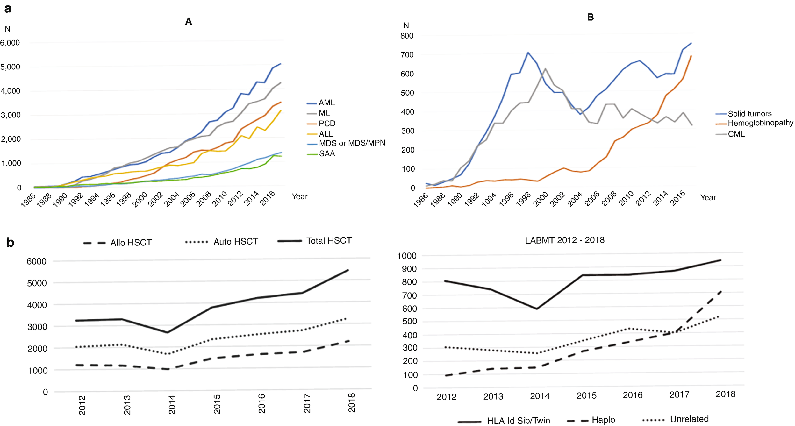

# Chapter 69. Feasibility and Experiences of HCT in Resource-Constrained Settings

> **Source:** Sureda A, Corbacioglu S, Greco R, Kröger N, Carreras E (eds). *The EBMT Handbook: Hematopoietic Cell Transplantation and Cellular Therapies*, 8th ed. Springer, Cham; 2024. pp. 607–614. https://doi.org/10.1007/978-3-031-44080-9_69  
> **Authors:** Srivastava, Alok; Duarte, Fernando Barroso; Faulkner, Lawrence  
>   - Srivastava, Alok: Christian Medical College  
>   - Duarte, Fernando Barroso: Universidade Federal do Ceara/Hemoce  
>   - Faulkner, Lawrence: Cure2Children Foundation  
> **License:** CC BY 4.0 (https://creativecommons.org/licenses/by/4.0/). Text reproduced verbatim from the open-access HTML edition; formatting converted to Markdown.

## Abstract

Even though hematopoietic cell transplant (HCT) has been in vogue for more than six decades as a curative therapy for many hematological disorders, with increasing trends in all parts of the world (Fig. 69.1), the density of HCT services is low and access to existing services remain an unmet need in the resource-constrained settings (RCSs) of low- and middle-income countries (LMICs) (Niederwieser et al. 2022). The silver lining though is that within these limitations, there are several examples of high-quality HCT services functioning in several countries, some with full national/international accreditation showing that even in those circumstances this is possible (Damodar et al. 2021). The goal of this chapter will be to discuss how good HCT services may be established and sustained in RCSs (Pasquini et al. 2019; Faulkner et al. 2021).

## 69.1 Introduction

Even though hematopoietic cell transplant (HCT) has been in vogue for more than six decades as a curative therapy for many hematological disorders, with increasing trends in all parts of the world (Fig. 69.1), the density of HCT services is low and access to existing services remain an unmet need in the resource-constrained settings (RCSs) of low- and middle-income countries (LMICs) (Niederwieser et al. 2022). The silver lining though is that within these limitations, there are several examples of high-quality HCT services functioning in several countries, some with full national/international accreditation showing that even in those circumstances this is possible (Damodar et al. 2021). The goal of this chapter will be to discuss how good HCT services may be established and sustained in RCSs (Pasquini et al. 2019; Faulkner et al. 2021).

**Figure**

Fig. 69. Trends in hematopoietic cell transplantation: **a**. APBMT; **b**. LABMT

## 69.2 Establishing HCT Centers: Personnel/Infrastructure/Types of HCTs

All HCT centers even within RCS will ultimately need to offer the full range of HCT services for pediatric and adult patients depending on the indications for the patients being served. However, the most critical issue in determining the focus and direction of any new HCT service is the training and experience of the lead transplant physician and the access to various support infrastructure, as exemplified in a recent report from Bangladesh and Nepal (Mahfuz et al. 2021; Poudyal et al. 2022). While it would be desirable for HCT services to be offered in government-funded public hospitals, this has not been a successful model in many RCS where paradoxically HCT rates are higher when services are offered in private hospitals as reported from Latin America (Jaimovich et al. 2021). Autologous HCT in the context of malignancies is often the starting point particularly if cryopreservation facilities are available with the exception of multiple myeloma where the very short conditioning does not require this. However, starting with allogeneic HCT particularly for nonmalignant conditions, such as bone marrow failure syndromes, major hemoglobin, and immune deficiency disorders, is also not uncommon with very good results expected in children particularly with matched related donors (MRDs) but increasingly also with alternate donors. There is no clear recommendation on this aspect of starting an HCT service except that the lead physician and the team should be adequately trained for the services they wish to start. A suggested approach is shown in Table 69.1. It is of course very common for such physicians to seek real-time “consultative” help from experienced physicians at other more established centers.

**Table 69.1 Stages of development of a HCT program**

|                                    | Stage I                  | Stage II                                 | Stage III                |
|------------------------------------|--------------------------|------------------------------------------|--------------------------|
| Types of transplantation performed |  •Autologous             | Stage I +                                | Stage II +               |
|                                    |  •HLA-matched sib donors |  •All MSD transplants including MMSD     |  •Haploidentical         |
|                                    |                          |  •Autologous with cryopreserved products |  •And/or MUD.MMUD        |
|                                    |                          |                                          |  •And/or UCB             |
|                                    |                          |                                          |  •And/or T-cell depleted |
| Number of HCT                      | 5 Auto-HCT/year          | 10 Auto-HCT/year                         | \>10 Auto-HCT/year       |
|                                    | 3–5Allo-HCT/year         | 5–10 Allo-HCT/year                       | \>10 Allo-HCT/year       |

1.  *MMSD* indicates mismatched sibling donor, *MSD* matched sibling donor, *MMUD* mismatched unrelated donor, *MUD* matched unrelated donor, *UCB* umbilical cord blood, *auto-HCT* autologous hematopoietic cell transplant, *allo-HCT* allogeneic hematopoietic cell transplant
2.  Transplantation and Cellular Therapy. 2021 Mar;27(3):267 e1–5

## 69.3 Patient Selection and Indications for HCT

Selecting patients for HCT can pose challenges for centers starting their programs in RCS. On the one side is the need of the individual patient, adult or pediatric, who presents with a disease that could be cured by HCT, and on the other side is the capability and capacity of the HCT center that may wish to prioritize certain indications. The choice finally depends on the transplant physician and the team at that center, their experience and training as well as institutional priorities. It would be advisable to start with standard risk younger patients with matched related donors—the actual indication will depend on the region of the world and practice pattern at that center. Given the paucity of HCT services in RCS, it should be recognized that many centers offer services to both adult and pediatric patients (Chandy 2008; Benakli et al. 2020). Physicians trained at such HCT centers may well be capable of managing HCTs in a wide range of patients and indications. The presence of trained pediatricians in the transplant team is of course necessary whenever possible. It is also important that transplant physicians be aware of the evolving indications for HCT and the possible outcomes with different donors. The expected outcomes in each of these situations are critical for counseling patients and their families as well as planning resources for the HCT(Snowden et al. 2022).

## 69.4 Donor Selection: Alternative Donors—Graft Manipulations

Access to locally available reliable HLA typing services has been a challenge in preventing allogenic transplants in many parts of the world. With a molecular approach to HLA typing, more services are accessible. This then allows for appropriate donor selection. Once this is available, matched related donors (MRDs) become the first option to start a service with. High-resolution typing might yet be desirable in regions with high consanguinity or close ethnicity (Agarwal et al. 2017), and it also allows the initiation of unrelated donor searches. As experience and resources advance and the logistics of international transportation of grafts improve, matched unrelated donors (MUDs) are also being increasingly used. However, with increasing experience around the world with haplo-identical donor (HID) HCTs, these types of donor transplants can be offered early within HCT services, depending on the training and experience of the physician involved as well as the team along with access to diagnostic and consultation services (Niederwieser et al. 2022). An important aspect of any allogeneic HCT service is to be able to carry out basic graft manipulation at least for red cell depletion when needed for blood group mismatched donors. Familiarity with manual centrifugation or precipitation-based techniques is needed if automated instrument platforms are not available for the same (Sawa et al. 2023).

## 69.5 Harvest of Graft: CD34+ HSC Dose Calculation and Cryopreservation Issues

With the increasing use of peripheral blood stem cells (PBSCs) for allogeneic grafts, collection of such grafts on one of the several apheresis platforms is quite easily established in most HCT centers. However, the use of PBSC grafts may be associated with an increased risk of graft versus host disease (GVHD), particularly chronic, and it is important that transplant physicians should be familiar with bone marrow harvesting. As this requires general anesthesia and access to an operating room facility, those aspects also need to be considered. The assessment of the quality of the graft even in terms of the CD34+ cell count can be a limitation in many centers. Arrangements to outsource this evaluation are often possible. Another limitation encountered is related to both capability and capacity to cryopreserve grafts mainly for autologous HCTs. Though reports of grafts being used after storage at 4–8°C for up to 6 days exist, (Bekadja et al. 2021) having appropriate control rate freezing equipment is desirable for optimal graft storage and transplantation outcomes.

## 69.6 Conditioning Regimen

Conditioning is a critical aspect of any HCT protocol, and the possibilities are many between myeloablative and reduced intensity options with various myelotoxic and immunosuppressive drugs with or without total body or more limited irradiation fields (Ma et al. 2020). It is very important that the transplant physician should be familiar with these possibilities and understand the principles of using these options. The final choice depends on what drugs and whether facilities for radiation therapy are locally available as well as the personal experience of the physician concerned. The good thing is that nearly for all indications of HCT various chemotherapy-based conditioning is possible with good outcomes (Rehman et al. 2023). Regimen-related toxicities can be a major cause of morbidity and mortality in HCT, and this should be borne in mind when choosing conditioning protocols.

## 69.7 Supportive Care

While disease-related and individual patient-related variables are a major determinant of outcomes of HCT, what matters most next in determining outcome is the supportive care provided during HCT. There are two important aspects to this—first, the availability of appropriate therapeutic products (Table 69.2) and next the knowledge and training of the entire team to utilize them. Standardization of protocols for the management of different aspects of HCT goes a long way toward improving outcomes (Snowden et al. 2020). No amount of effort is too much in enhancing supportive care at the nursing, consultation services, and relevant diagnostic investigations in any HCT program.

**Table 69.2 Medicines considered essential for HCT programs**

<table>
<thead>
<tr>
<th> </th>
<th>
Required (score 1 and 2) with votes above 70%
</th>
<th>
Preferred (score 3 and 4) with votes above 70%
</th>
<th>
Ideal (score &gt;4) with votes above 70%
</th>
</tr>
</thead>
<tbody>
<tr>
<td>
Stage I program
</td>
<td>
Mobilization:

 –Chemotherapy and filgrastim for autologous PBSCT mobilization

 –Filgrastim for autologous PBSCT mobilization

 –Filgrastim for allogeneic PBSCT mobilization

Conditioning:

 –Cyclophosphamide

 –Cytarabine

 –Melphalan

 –Fludarabine

Seizures prophylaxis:

 –Benzodiazepine

GVHD Prophylaxis/Treatment:

 –Cyclosporine

 –Methotrexate

 –Methylprednisolone

 –Prednisone

 –Dexamethasone

Antimicrobials:

 –Piperacillin/Tazobactam

 –Cefepime

 –Ciprofloxacin

 –Vancomycin

 –Fluconazole

 –Acyclovir

 –Ganciclovir

 –Bactrim

Supportive:

 –IV narcotics

 –5-HT3 antagonists
</td>
<td>
Mobilization: none

Conditioning:

 –Oral busulfan

 –Intravenous busulfan

 –Carboplatin

 –Carmustine

 –Etoposide

Seizures prophylaxis:

 –Phenytoin

 –Levetiracetam

GVHD Prophylaxis/Treatment:

 –Tacrolimus

 –Mycophenolate

 –Rituximab

Antimicrobials:

 –Carbapenem

 –Levofloxacin

 –Tigecycline

 –Amphotericin B (liposomal)

 –Echinocandin

 –Voriconazole

 –Posaconazole

 –Valganciclovir

 –Foscarnet

 –Valacyclovir

 –Pentamidine

Supportive:

 –Phenothiazines

 –Neurokinin antagonists

 –Ursodiol

 –IVIG

 –TPN

 –PCA
</td>
<td>
Mobilization:

 –Plerixafor for autologous PBSCT mobilization

Conditioning:

 –Intravenous busulfan with TDM

Seizures prophylaxis: none

GVHD Prophylaxis/Treatment:

 –Antithymocyte globulin rabbit

 –Budesonide

 –Sirolimus

 –Etanercept

 –Alemtuzumab

 –Basiliximab

 –Extracorporeal photopheresis

 –Infliximab

Antimicrobials:

 –Amphotericin B (conventional)

 –Isavuconazoniurn

 –Cidofovir

 –Letermovir

Supportive:

 –Defibrotide

 –Olanzapine
</td>
</tr>
</tbody>
</table>

1.  *TDM* indicates therapeutic drug monitoring
2.  Adapted from Transplantation and Cellular Therapy. 2021 Mar;27(3):267 e1–5

- *Blood product support*: Access to the full range of blood bank products such as packed red cells, platelet concentrates, and fresh frozen plasma is absolutely essential to run a transplant program (Warner et al. 2019). Blood product irradiation is required for immunosuppressed patients to avoid transfusion-associated GVHD. When dedicated blood irradiators are not available, a clinical Co60 teletherapy unit can also be used to irradiate both red cell and platelet products (Goes et al. 2006). Where there is a lack of access to large blood banks that can supply products ad lib, having an apheresis unit within the transfusion service in the institution and using screened relatives of patients and other volunteers is a practical way to manage this critical requirement particularly for platelet transfusions.

- *Immunosuppressants*: Access to relevant immunosuppressant drugs is absolutely essential for any HCT program (Penack et al. 2020). Commonly used drugs such as calcineurin inhibitors (cyclosporin A and tacrolimus), mycophenolate mofetil, and sirolimus along with methylprednisolone form the basis for the management of immune complications of HCT most of the time. Posttransplant cyclophosphamide is a good option at low costs which is not only useful in HID transplant but may also be good for MRD transplants (Sawa et al. 2023). A wide range of other drugs including biologicals may also be needed in a small proportion of patients. Measurement of drug levels is important in ensuring efficacy (Table 69.1).

- *Antibiotics*: Given the extent of antimicrobial resistance, particularly in RCS, availability of and access to a wide range of broad-spectrum antibiotics is absolutely essential for initiating HCT services. Therapeutic drug monitoring is desirable but not critical in most situations. However, knowledge of local patterns of antimicrobial resistance is very important for making antibiotic protocols (Table 69.1).

- *Diagnostics*: Intense laboratory monitoring is the pillar of supportive care in HCT. Access to reliable round-the-clock laboratory services for blood counts, hemostasis tests, and common biochemical assessments are indispensable for establishing a successful HCT program (Aljurf et al. 2019). A range of microbiological assessments including bacterial and fungal cultures and antibiotic sensitivity assays are also essential. Viral infection monitoring, particularly for CMV in the context of GVHD, is needed. Specialized radiological evaluation is also frequently needed through experienced radiologists for ultrasound, CT scan, and MRI-based assessments.

- *Consultation services*: In any ongoing HCT program, multisystem complications resulting from regimen-related toxicities, infections, or graft versus host disease are not uncommon. These require suitable consultation services to be available on call. Most commonly used services are gastroenterology for endoscopies, nephrology for renal insufficiency, infectious diseases, and dermatology.

## 69.8 Graft Versus Host Disease (GVHD) Management

- Acute: This is one area where compromises are best avoided and standard protocols are followed depending on the type of donor and graft. Fortunately, most of the commonly used prophylactic drugs are widely available and not too expensive. Access to second-line drugs for steroid-resistant GVHD can be a challenge in some RCS and specific plans, and protocols should be in place to address these situations (Penack et al. 2020). The success of haplo-identical HCTs with posttransplant cyclophosphamide has made this an increasingly used option. This may also be useful in other donor HCTs and could make GVHD prophylaxis more cost-effective (Rimando et al. 2023).

- Chronic: Extensive chronic GVHD can be one of the most difficult complications to manage in RCS because of the need for prolonged expensive immunosuppressive therapy and other associated complications (Saleem et al. 2019). In the absence of adequate resources to support such care, this is a major cause of major morbidity and mortality. There are no specific low-cost protocols, and general principles of the management of chronic GVHD also need to apply in RCS.

## 69.9 Long-term Follow-Up

All HCT centers must aspire to have full long-term follow-up on all patients. An important aspect of achieving this goal is to provide adequate information and counseling to the patient and their families regarding the importance and significance of such follow-up visits (Hashmi et al. 2018). Streamlining the assessments, a caring attitude of the team toward the individual patient and offering relevant advice during such visits enhances compliance. However, given the paucity of HCT centers in RCS, patients often travel very long distances to have the HCT done and going back frequently for follow-up can be challenging. A hub and spoke model should be considered in those situations by establishing partnership with patients and local physicians for a shared care plan.

## 69.10 Socioeconomic Issues

The major challenge that restricts access to HCT in RCS is the cost of HCT (Aljurf et al. 2019). What contributes heavily to costs are the drugs and disposables. These costs are variable depending on where they are manufactured. It is important therefore that a facilitatory regulatory environment be created for such life-saving drugs and disposables to be made available and locally relevant prices. Human resource costs are often modest and usually in a structure that the healthcare system has learnt to accommodate. The low density of HCT services in most RCS around the world are related to two major reasons—cost and lack of adequately trained personnel who know how to innovate and establish such services within the local context. Both these need to be addressed (Aljurf et al. 2019).

## 69.11 Conclusion

Creating greater awareness among healthcare professionals, comprehensive training programs and establishing appropriate infrastructure along with access to the required drugs and disposable combined with modifications and innovations in management protocols which are practical in those conditions are all needed to make HCT more widely available and accessible all over the world.

## References

- Agarwal RK, Kumari A, Sedai A, Parmar L, Dhanya R, Faulkner L. The case for high resolution extended 6-loci HLA typing for identifying related donors in the Indian subcontinent. Biol Blood Marrow Transplant. 2017;23(9):1592–6.

- Aljurf M, Weisdorf D, Hashmi S, Nassar A, Gluckman E, Mohty M, et al. Worldwide network for blood and marrow transplantation recommendations for establishing a hematopoietic stem cell transplantation program in countries with limited resources, part II: clinical, technical, and socioeconomic considerations. Biol Blood Marrow Transplant. 2019;25(12):2330–7.

- Bekadja MA, Boumendil A, Blaise D, Chevallier P, Peggs KS, Salles G, et al. Non-cryopreserved hematopoietic stem cells in autograft patients with lymphoma: a matched-pair analysis comparing a single center experience with the use of cryopreserved stem cells reported to the European Society for Blood and Marrow Transplantation registry. Cytotherapy. 2021;23(6):483–7.

- Benakli M, Ahmed Nacer R, Mehdid F, Belhadj R, Talbi A, Rahmoune N, et al. Two decades of experience in a combined adult/pediatric allogeneic hematopoietic stem cell transplantation center in Algiers, Algeria. Ann Hematol. 2020;99(3):619–25.

- Chandy M. Stem cell transplantation in India. Bone Marrow Transplant. 2008;42(Suppl 1):S81–S4.

- Damodar S, Ma DD, Ragg SJ, Chang A, Hwang WY, Ho AY, et al. Standardization and accreditation in haemopoietic stem cell transplantation – an Asia Pacific perspective. Blood cell therapy. 2021;4(Spec Edition):S14–S9.

- Faulkner L, Verna M, Rovelli A, Agarwal RK, Dhanya R, Parmar L, et al. Setting up and sustaining blood and marrow transplant services for children in middle-income economies: an experience-driven position paper on behalf of the EBMT PDWP. Bone Marrow Transplant. 2021;56(3):536–43.

- Goes EG, Borges JC, Covas DT, Orellana MD, Palma PV, Morais FR, et al. Quality control of blood irradiation: determination T cells radiosensitivity to cobalt-60 gamma rays. Transfusion. 2006;46(1):34–40.

- Hashmi SK, Lee SJ, Savani BN, Burns L, Wingard JR, Perales MA, et al. ASBMT practice guidelines committee survey on long-term follow-up clinics for hematopoietic cell transplant survivors. Biol Blood Marrow Transplant. 2018;24(6):1119–24.

- Jaimovich G, Gale RP, Hanesman I, Vazquez A, Hammerschlak N, Simoes BP, et al. The paradox of haematopoietic cell transplant in Latin America. Bone Marrow Transplant. 2021;56(10):2382–8.

- Ma S, Shi W, Li Z, Tang L, Wang H, Xia L, et al. Reduced-intensity versus Myeloablative conditioning regimens for younger adults with acute myeloid leukemia and myelodysplastic syndrome: a systematic review and meta-analysis. J Cancer. 2020;11(17):5223–35.

- Mahfuz H, Hossain ME, Uddin MM, Karim MM, Wright J, Joyce K, et al. Overcoming the hurdles and establishing a haematopoietic stem cell transplant centre in a resource poor setting: an example from Dhaka, Bangladesh. Br J Haematol. 2021;194(2):e59–60.

- Niederwieser D, Baldomero H, Bazuaye N, Bupp C, Chaudhri N, Corbacioglu S, et al. One and a half million hematopoietic stem cell transplants: continuous and differential improvement in worldwide access with the use of non-identical family donors. Haematologica. 2022;107(5):1045–53.

- Pasquini MC, Srivastava A, Ahmed SO, Aljurf M, Atsuta Y, Doleysh C, et al. Worldwide network for blood and marrow transplantation recommendations for establishing a hematopoietic cell transplantation program, part I: minimum requirements and beyond. Biol Blood Marrow Transplant. 2019;25(12):2322–9.

- Penack O, Marchetti M, Ruutu T, Aljurf M, Bacigalupo A, Bonifazi F, et al. Prophylaxis and management of graft versus host disease after stem-cell transplantation for haematological malignancies: updated consensus recommendations of the European Society for Blood and Marrow Transplantation. Lancet Haematol. 2020;7(2):e157–e67.

- Poudyal BS, Tuladhar S, Neupane S, Sapkota S, Pandit S, Shrestha PR, et al. Hematopoietic stem cell transplantation in Nepal: international partnership, implementation steps, and clinical outcomes. Transplant Cell Therapy. 2022;28(5):268–75.

- Rehman MEU, Chattaraj A, Mahboob A, Ijaz Z, Franco D, Farhan M, et al. Total body irradiation versus chemotherapy conditioning in pediatric acute lymphoblastic leukemia patients undergoing hematopoietic stem cell transplant: asystematic review and meta-analysis. Clin Lymphoma Myeloma Leuk. 2023;23(4):249–58.

- Rimando J, McCurdy SR, Luznik L. How I prevent GVHD in high-risk patients: posttransplant cyclophosphamide and beyond. Blood. 2023;141(1):49–59.

- Saleem MS, Aljurf M, Srivastava A, Shamsi T, Lu PH, Hamidieh AA, et al. Challenges in managing graft-versus-host disease in developing countries: a perspective. Bone Marrow Transplant. 2019;54(5):641–7.

- Sawa M, Zatorska-Kwiecinska M, Gozdzik J. Optimizing of the isolation of hematopoietic stem cell in bone marrow transplantation in children. Transfus Apher Sci. 2023;13:103707.

- Snowden JA, Saccardi R, Orchard K, Ljungman P, Duarte RF, Labopin M, et al. Benchmarking of survival outcomes following haematopoietic stem cell transplantation: a review of existing processes and the introduction of an international system from the European Society for Blood and Marrow Transplantation (EBMT) and the joint accreditation committee of ISCT and EBMT (JACIE). Bone Marrow Transplant. 2020;55(4):681–94.

- Snowden JA, Sanchez-Ortega I, Corbacioglu S, Basak GW, Chabannon C, de la Camara R, et al. Indications for haematopoietic cell transplantation for haematological diseases, solid tumours and immune disorders: current practice in Europe, 2022. Bone Marrow Transplant. 2022;57(8):1217–39.

- Warner MA, Jambhekar NS, Saadeh S, Jacob EK, Kreuter JD, Mundell WC, et al. Implementation of a patient blood management program in hematopoietic stem cell transplantation (editorial, p. 2763). Transfusion. 2019;59(9):2840–8.
