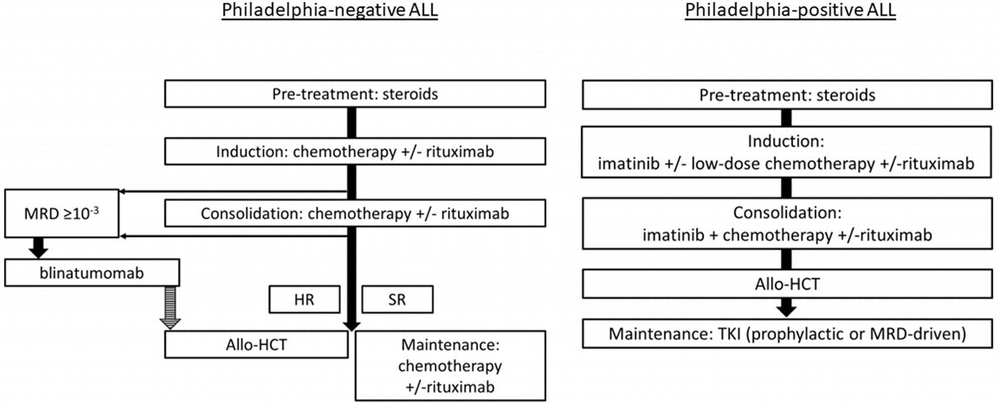
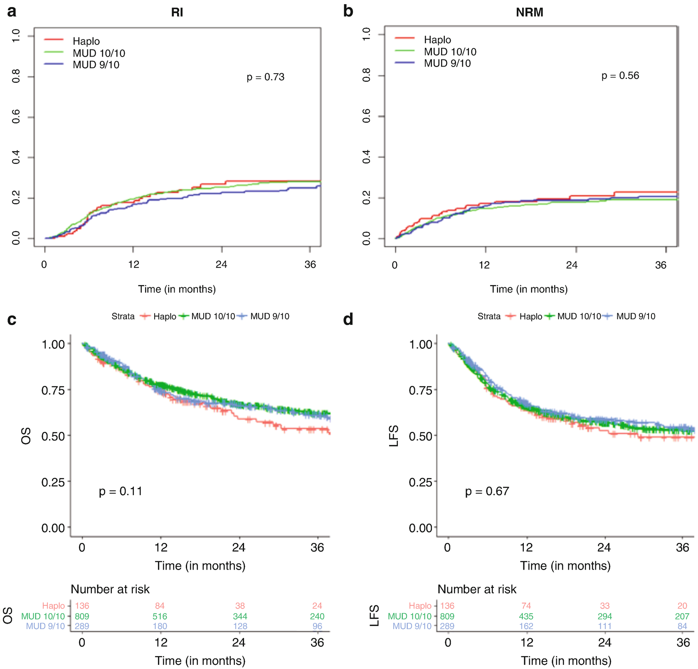
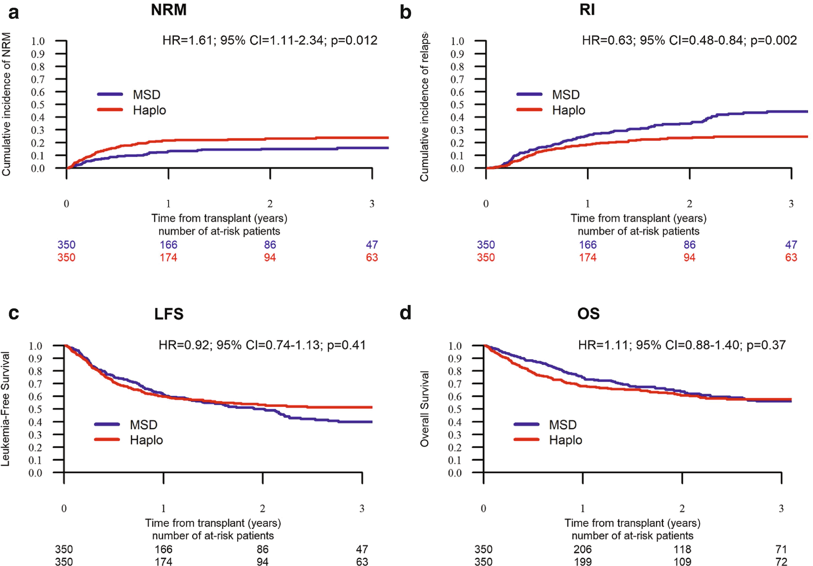

# Chapter 72. Acute Lymphoblastic Leukemia in Adults

> **Source:** Sureda A, Corbacioglu S, Greco R, Kröger N, Carreras E (eds). *The EBMT Handbook: Hematopoietic Cell Transplantation and Cellular Therapies*, 8th ed. Springer, Cham; 2024. pp. 649–657. https://doi.org/10.1007/978-3-031-44080-9_72  
> **Authors:** Stelljes, Matthias; Marks, David I.; Giebel, Sebastian  
>   - Stelljes, Matthias: University Hospital of Münster, University of Münster  
>   - Marks, David I.: Bristol Haematology and Oncology Centre; University of Bristol  
>   - Giebel, Sebastian: Maria Sklodowska-Curie National Research Institute of Oncology  
> **License:** CC BY 4.0 (https://creativecommons.org/licenses/by/4.0/). Text reproduced verbatim from the open-access HTML edition; formatting converted to Markdown.

## Abstract

The prognosis of patients with acute lymphoblastic leukemia is constantly improving. Beside optimization strategies of conventional chemotherapies and close monitoring of treatment response (e.g. by PCR-based measurement of measurable disease, which helps to early identify patients at risk for relapse), the integration of antibody (e.g. anti-CD20)/antibody-based drugs (blinatumomab and inotuzumab-ozogamicin) to frontline and/or salvage therapy protocols led to significant improvements. However, allogeneic HCT still plays a fundamental role in the treatment of high-risk patients in 1st line consolidation and for patients with relapsed/refractory disease.

## 72.1 Definition and Epidemiology

Acute lymphoblastic leukemia (ALL) is a malignant transformation and proliferation of lymphoid progenitor cells in the bone marrow, blood, and extramedullary sites. While 80% of ALL occurs in children, it represents a much less curable disease in adults. The incidence of ALL is bimodal, with the first peak occurring in childhood and a second peak occurring around 50 years. The estimated overall incidence of ALL and lymphoblastic lymphoma in Europe is 1.28 per 100,000 individuals annually, with significant age-related variations (0.53 at 45–54 years, ∼1.0 at 55–74 years, and 1.45 at 75–99 years) (Terwilliger and Abdul-Hay 2017).

## 72.2 Diagnosis

Typical but non-specific clinical manifestations of patients with ALL are constitutional symptoms, bleeding, infections, and/or bone pain, with less than 10% of individuals having symptomatic CNS involvement at diagnosis, more common in T-cell disease. Mediastinal mass with wheezing and stridor can be a presenting feature of T-lineage ALL. A comprehensive work-up is necessary to allow a precise differential diagnosis, an accurate stratification and to establish an optimal monitoring of minimal residual disease (MRD). It includes blood and marrow morphology, flow cytometry, karyotype, and molecular genetics. Bone marrow infiltration \>20% is used as cutoff point to distinguish ALL from LBL although it is arbitrary.

## 72.3 Classification

In 2022, the updated WHO classification and International Consensus Classification were published (Alaggio et al. 2022; Arber et al. 2022). Both distinguish B- and T-cell precursor neoplasms, including variety of genetically defined subtypes. Among B-ALL/LBL, Philadelphia-positive (Ph+) subtype characterized by the presence of t(9;22)(q34.1;q11.2) and *BCR::ABL1* fusion gene is the most frequent one accounting for 20–30% of adults. Its frequency increases with age.

## 72.4 Risk Factors

Clinical risk factors include age and white blood cell count at the time of diagnosis. Increasing age portends a worse prognosis. Patients over 60 years have particularly poor outcomes, with less than 20% long-term survival (Geyer et al. 2017). In most studies, the cut point for high-risk ALL has been 30 × 10⁹/L for B-cell precursor ALL and 100 × 10⁹/L for T-cell precursor ALL, respectively.

Immunophenotyping allows for evaluation of the maturation status of leukemic cells and has been historically used for risk stratification. Among T-ALL/LBL, the early T-cell precursor ALL defined by reduced expression of T-cell markers (CD1a, CD8, and CD5), and aberrant expression of myeloid or stem cell markers is associated with high-risk of treatment failure (Chiaretti et al. 2014). With the application of modern treatment protocols, the prognostic value of other phenotypically defined subtypes subtypes is unclear.

Several genetically defined subtypes are associated with poor prognosis. In adults, the most frequent one is t(v;11q23.3) associated with KMT2A rearrangements. The prognostic relevance of low-hypodiploidy and complex karyotype (five or more chromosomal aberrations) in ALL remains controversial among different study groups. Ph + ALL was historically defined as very high risk subtype. In modern era, treatment results for Ph + and Ph- ALL are comparable. Among older patients ineligible for allo-HCT, the presence of *BCR::ABL1* may even be associated with favorable outcomes due to sensibility to tyrosine kinase inhibitors. In a significant proportion of Ph-ALL, gene expression profile resembles that of BCR::ABL1+ ALL. This subtype, named Ph-like ALL, is associated with unfavorable prognosis. Its identification, however, is not routinely available in many countries.

Response to initial therapy is a strong predictior of the overall outcome. This includes the need for more than one cycle of induction to achieve CR as well as inadequate response at the level of MRD. MRD \>10⁻³ of bone marrow cells after induction and/or \>10⁻⁴ during/after consolidation is considered a high-risk feature (Giebel et al. 2019). An increase of MRD level above 10⁻³ after initial response represents a very high risk of relapse (Brüggemann et al. 2010). MRD is evaluable using either multichannel flow cytometry or the real-time quantitative polymerase chain reaction (RQ-PCR). Aberrant phenotypes are identified on the basis of different combinations and/or asynchronous expression and/or variable intensity staining of several antigens. PCR targets are transcripts of fusion genes associated with chromosomal abnormalities (e.g., BCR::ABL1) or rearranged immunoglobulin or T-cell receptor sequences (TCR β, γ, δ, IgH, and IgK-Kde) unique to each patient with ALL. Innovative, more sensitive methods include next-generation flow cytometry, digital drop PCR, and next-generation sequencing. They require further standardization before wide implementation in clinical practice.

## 72.5 Prognostic Factors Used to Indicate Allo-HCT in CR1

Indications for allo-HCT in CR1 are restricted to patients with high-risk ALL. However, criteria used for stratification in particular study groups vary strongly (Giebel et al. 2019).

<table>
<thead>
<tr>
<th>
Factors considered by all study groups
</th>
<th>
Factors considered by majority of study groups
</th>
<th>
Factors considered by some study groups
</th>
</tr>
</thead>
<tbody>
<tr>
<td>
Inadequate response during/ after consolidation:

 • MRD &gt;10−4/detectable at any level
</td>
<td>
Inadequate response to induction I:

 • No hematological CR

 • MRD &gt;10−3 after induction
</td>
<td>
Initial CNS involvement
</td>
</tr>
<tr>
<td>
Age (various cut points)
</td>
<td>
High initial WBC:

 • &gt;30 × 109/L in B-ALL

 • &gt;100 × 109/L in T-ALL
</td>
<td>
Adverse immunophenotype:

 • Early T-precursor

 • Mature T

 • Pro-B
</td>
</tr>
<tr>
<td>
<em>BCR:ABL1</em>
</td>
<td>
Other genetic factors:

 • KMT2A rearrangements

 • Hypodiploidy

 • Complex karyotype
</td>
<td> </td>
</tr>
</tbody>
</table>

## 72.6 First-Line Treatment

The first-line chemotherapy usually consists of prephase, induction, treatment intensification/consolidation, and either long-term maintenance or allo-HCT, with CNS prophylaxis given at intervals throughout therapy (Fig. 72.1). The goal of induction therapy is to achieve CR remission and to restore normal hematopoiesis.

In Ph-ALL intensive chemotherapy inspired by pediatric protocols is recommended. The backbone of induction therapy typically includes VCR, DEX, and an anthracycline with or without L-asp and CY. CR rates are in a range of 90–95% for younger adults and 70–90%for older individuals. For consolidation therapy, most study groups recommend six to eight courses, two to four of which contain high-dose MTX, Ara-C, and L-asp, and one to two represent reinduction blocks. Postremission consolidation is most often followed by allo-HCT or long-term maintenance with daily oral mercaptopurine and weekly MTX for 2 years or longer, sometimes with periodic applications of, e.g., VCR, PRD, or other drugs. The addition of RTX to the induction and consolidation therapy for patients with B-ALL and CD20 expression has significantly improved the outcome in these subgroups (Maury et al. 2016). In case of MRD persistence or recurrence, a bispecific anti-CD3/CD19 antibody, blinatumomab, may be administered with high rate of MRD responses. Results of recent studies indicate that also patients with MRD-negativity may benefit from blinatumomab administered in sequence with consolidation chemotherapy. In older individuals, inotuzumab ozagamicin, an anti-CD22 immunotoxin, may be alternative to upfront conventional chemotherapy, although it has not yet been approved for this indication. The addition of nelarabine to first-line treatment of T-ALL has not been shown to influence outcome in adults.

In Ph + ALL TKIs are the most important treatment component. Imatinib (IM) is the only drug approved for first-line therapy. During induction, it may be administered in combination with low-dose chemotherapy (VCR, DEX) allowing for 90–100% CR. More intensive chemotherapy does not increase the CR rate (Chalandon et al. 2015). During consolidation, IM used to be combined with high doses of MTX as CNS prophylaxis and other chemotherapeutical agents. All patients should be considered for allo-HCT in CR1, followed by TKI maintenance (Giebel et al. 2016). New regimens, including up-front use of dasatinib or ponatinib in sequence with blinatumomab, increase the chance of molecular CR and may reduce the role of allo-HCT in future.

## 72.7 Second-Line Treatment

Approximately 5–10% of all adults with ALL are refractory to induction therapy while among those achieving CR, 30–50% experience relapse. Conventional standard chemotherapy regimens for adults with relapsed or refractory B-cell ALL are associated with rates of CR of 31–44% when they are the first salvage therapy administered after an early relapse and 18–25% when they are the second salvage therapy (Gokbuget et al. 2016). Results of randomized trials demonstrated that CR rates increased to 80% using inotuzumab and 44% using blinatumomab, which translated into prolonged survival compared to standard chemotherapy.

Any treatment regimen for relapsed/refractory ALL should be be considered a “bridge” to allo-HCT in order to increase a chance of cure. The use of inotuzumab ozogamycin is associated with increased risk of VOD, especially after more than two treatment courses, in case of preexisting liver impairment and using double alkylators for conditioning. Consequently, the allo-HCT should be scheduled idealy within 6–8 weeks after the start of salvage therapy.

Anti-CD19 CAR T-cells are a new option for patients with relapsed/refractory B-ALL. Tisagenlecleucel is approved for children and younger adults up to 25 y.o. with 80–90% CR rate and approximately 50% RFS (Maude et al. 2018). Brexucaptagene autoleucel in Europe is approved for patients ≥26 years old and allows for approximately 71% CR with median OS exceeding 2 years (Shah et al. 2021). The need for subsequent allo-HCT is a matter of debate. Given the high relapse rates reported so far after CAR-T cell therapy and the limited treatment options for patients failing CAR-T cell therapy, a subsequents allo-HCT as consilidation therapy should be considered in patients who have not had a previous HCT although more data are needed.

Treatment options for patients with relapse/refractory T-ALL are limited. Standard chemotherapy regimens such as FLAG (FLU, Ara-C, and G-CSF) ± idarubicin result in only 30–40% response rates with 6 months median OS in responders. Nelarabine as monotherapy or in combination with other chemotherapeutic agents is a reasonable alternative option. Anti-CD7 or anti-CD5 CAR T-cells are being investigated with promising early results (Pan et al. 2021). Bortezomib-based strategies may be evaluated as an effective and well-tolerated treatment option for adult patients with relapsed/refractory ALL, as a bridge to immunotherapy or allo-HCT (Nachmias et al. 2018). Moreover, daratumumab has started to be used in advanced ALL without other therapeutic options (Cerrano et al. 2022). In any case, allo-HCT should be considered to consolidate response.

## 72.8 Autologous HCT

### 72.8.1 Indication

Auto-HCT is not considered a standard therapy for adult ALL. Optional for patients with MRD-negative ALL, not eligible for allo-HCT.

### 72.8.2 Conditioning

Fractionated TBI (e.g., 6 × 2 Gy) in combination with CY and/or VP.

### 72.8.3 Results

In some trials, patients excluded from allo-HCT were randomly assigned between chemotherapy and auto-HCT. In the largest study, chemotherapy proved superior, while a marginal superiority of auto-HCT was ascertained in high-risk patients in another one. In a European retrospective analysis on auto-HCT, a cohort of patients who were MRD negative had a significantly better survival compared to those being MRD positive. Results of another retrospective study comparing auto- and allo-HCT for adults with Philadelphia-positive ALL in first complete molecular remission showed similar survival rates for both groups (higher rate of relapse after auto-HCT and higher rates of death in remission after allo-HCT). Finally, comparable results after auto-HCT and RIC-allo-HCT have been reported for patients \>55 years old.

It remains a matter of debate if the MRD-negative patients in these retrospective trials would have shown similar results with conventional chemotherapy. The value of high-dose therapy, particularly in ALL patients being early MRD negative after induction therapy, has to be evaluated in prospective trials.

## 72.9 Allogeneic HCT

### 72.9.1 Indication

Standard therapy for patients with high-risk ALL in CR1 (see Sect. 72.5) and standard therapy for patients with subsequent remission after induction failure or relapsed ALL (Giebel et al. 2019). Optional for patients with standard-risk ALL in CR1 and unexpected treatment-related toxicities (e.g., prolonged severe cytopenia), which preclude continuation of conventional therapy. Optional for patients with refractory/active ALL (Pavlu et al. 2017).

### 72.9.2 Conditioning

For fit patients \<45 years and no relevant comorbidities, preferably fractionated TBI (cumulative dose of 12–13 Gy) in combination with CY or VP (Marks et al. 2006); alternative BU (preferable IV BU targeted plasma-drug level monitoring) in combination with CY although this may be associated with higher relapse rates (Kebriaei). For patients aged 45 years and older, dose-adapted/dose-reduced conditioning should be considered. So far, no standard regimen has been established. Reasonable options are TBI-based therapies (e.g., 8 Gy TBI in combination with FLU or CY) and MEL-, BU-, or TREO-based conditioning regimes.

Especially patients transplanted beyond first remission are at risk for severe transplant-related toxicities with cumulative incidence of death in remission exceeding 30% and more. Consequently, dose-reduced conditioning regimes should be discussed in patients being in a MRD-negative subsequent remission after treatment with novel antibody-based salvage therapies. Moreover, conditioning therapies associated with significant toxicities (e.g., SOS/VOD for patients treated with inotuzumab ozogamicin) must be avoided.

### 72.9.3 Donor

MSD, HLA-MUD (at least matched for HLA-A, HLA-B, HLA-C, and DR), HLA-MMUD, haploidentical donor. Results of a retrospective, EBMT registry-based analyses showed comparable results for all donor types (Shem-Tov et al. 2020; Nagler et al. 2021) (Figs. 72.2 and 72.3).

**Fig. 72.1**

Therapeutic algorithm for patients with newly diagnosed Ph- and Ph + ALL. Additional agents (e.g., binatumomab consolidation for MRD neg. patients) might become available in the near future. HR, high risk; SR, standard risk; MRD, measurable residual disease

**Fig. 72.2**

Outcome of *matched unrelated donor, mismatched unrelated donor, and haploidentical donor*—HCT performed between 2007–2016 for adults with ALL in CR1. (**a**) Relapse incidence (RI), (**b**) non-relapse mortality (NRM), (**c**) leukemia-free survival (LFS), (**d**) overall survival (OS) (Shem-Tov et al. 2020)

**Fig. 72.3**

Outcome of *matched sibling donor and haploidentical*—hematopoietic cell transplantation for adults with acute lymphoblastic leukemia (ALL) in first or second complete remission (CR1). Changes over time in the period 1993–2012. (**a**) non-relapse mortality (NRM), (**b**) relapse incidence (RI), (**c**) leukemia-free survival (LFS), (**d**) overall survival (OS) (Nagler et al. 2021)

## 72.10 Therapeutic Algorithm Recommended by the Authors

### 72.10.1 Stem Cell Source

Most likely no relevant difference with regard to GvHD between BM and PBSC as transplant source from an unrelated donor when ATG is part of the conditioning. Faster engraftment and low risk of graft failure with PBSC. For T-replete haploidentical HCT using post-transplant CY, BM may be associated with improved OS and GRFS (Nagler 2020).

### 72.10.2 GvHD Prophylaxis

CSA + MTX or CSA + MMF are standard options. ATG should be considered in all patients receiving an allograft from an unrelated donor although in registry-based analyses it was associated with increased risk of relapse for both Ph- and Ph + ALL. Using post-transplant CY instead of ATG is recommended for haplo-HCT, using T cell replete allografts. It is also an option for allo-HCT from MMUD and MUD.

#### 72.10.2.1 Maintenance

For patients with Ph + ALL, maintenance with TKI after allo-HCT should be applied as a prophylactic or preemptive therapy. The choice of TKI should take into account previous TK mutation analyses. At least in patients with B-ALL and positive findings for MRD after allo-HCT, preemptive therapies with antibodies/antibody-drug conjugates or CAR-T cells are valuable options to be evaluated in prospective trials.

### Key Points

<table>
<tbody>
<tr>
<td>
Allo-HCT indication
</td>
<td colspan="2">
 – CR1: Ph + ALL, high-risk Ph- ALLa

 – &gt;CR1: all patients with no contraindication for allogeneic HCT
</td>
</tr>
<tr>
<td>
Donor
</td>
<td colspan="2">
MSD &gt; (MUD = MMUD = Haplo)
</td>
</tr>
<tr>
<td>
Conditioning
</td>
<td colspan="2">
 – &lt;45 years: TBI/CY; TBI/VP; TBI/CY/VEP, IV BU/CY. TBI probably associated with lower relapse rates, TBI dose for patients &lt;45 years: Cumulative 12–13 Gy

 – &gt;44 years (or &lt; 45 + contraindication for MAC) FLU/IV BU; FLU/MEL; FLU/TBI 8 Gy; FLU/TREO; TBFb
</td>
</tr>
<tr>
<td>
Source of SC
</td>
<td colspan="2">
PB/BM
</td>
</tr>
<tr>
<td>
GvHD prophylaxis
</td>
<td colspan="2">
CSA + MTX or CSA + MMF (ATG in MUD, MMUD, MSD); post-transplant CY in haplo (consider in MMUD, MUD)
</td>
</tr>
<tr>
<td>
Maintenance
</td>
<td colspan="2">
TKI in case of Ph + ALL (prophylactic or preemptive)
</td>
</tr>
<tr>
<td rowspan="2">
TRM
</td>
<td>
CR1

(age 18–55 years)
</td>
<td>
MSD: 11–24% (2 years)

MUD: 19–23% (3 years)
</td>
</tr>
<tr>
<td>
CR1

(age &gt; 60 years)
</td>
<td>
MSD: Approx. 23% (3 years)

MUD: Approx. 24% (3 years)
</td>
</tr>
<tr>
<td> </td>
<td>
CR2
</td>
<td>
MSD/MUD/MMUD/haplo: 28–35% (2 years)
</td>
</tr>
<tr>
<td rowspan="2">
REL
</td>
<td>
CR1

(age 18–55 years)
</td>
<td>
MSD: 23–32% (2 years)

MUD: 14–21% (2 years)
</td>
</tr>
<tr>
<td>
CR1

(age &gt; 60 years)
</td>
<td>
MSD: Approx. 47% (3 years)

MUD: Approx. 35% (3 years)
</td>
</tr>
<tr>
<td> </td>
<td>
CR2
</td>
<td>
MSD/MUD/MMUD/haplo: 33–38% (2 years)
</td>
</tr>
<tr>
<td rowspan="3">
OS
</td>
<td>
CR1

(age 18–55 years)
</td>
<td>
MSD: 60–76% (2 years)

MUD: 62–70% (2 years)
</td>
</tr>
<tr>
<td>
CR1

(age &gt; 60 years)
</td>
<td>
MSD: Approx. 39% (3 years)

MUD: Approx. 46% (3 years)
</td>
</tr>
<tr>
<td>
CR2
</td>
<td>
MSD/MUD/MMUD/haplo: 38–47% (2 years)
</td>
</tr>
</tbody>
</table>

1.  a Definition of “high risk” differs between study groups; most important risk factors: persisting MRD after two or more courses of therapy, high initial leukocyte count, high-risk cytogenetic
2.  b For patients treated with inotuzumab ozogamicin, avoid regimens associated with SOS/VODS

## References

- Alaggio R, Amador C, Anagnostopoulos I, et al. The 5th edition of the World Health Organization classification of Haematolymphoid Tumours: lymphoid neoplasms. Leukemia. 2022;36:1720–48.

- Arber DA, Orazi A, Hasserjian RP, et al. International consensus classification of myeloid neoplasms and acute Leukemias: integrating morphologic, clinical, and genomic data. Blood. 2022;140:1200–28.

- Brüggemann et al. 2010: Leukemia. 2010;24(3):521–35. https://doi.org/10.1038/leu.2009.268. Epub 2009 Dec 24.

- Cerrano M, Bonifacio M, Olivi M, et al. Daratumumab with or without chemotherapy in relapsed and refractory acute lymphoblastic leukemia. A retrospective observational campus ALL study. Haematologica. 2022;107(4):996–9.

- Chalandon Y, Thomas X, Hayette S, et al. Randomized study of reduced-intensity chemotherapy combined with imatinib in adults with Ph-positive acute lymphoblastic leukemia. Blood. 2015;125:3711–9.

- Chiaretti S, Zini G, Bassan R. Diagnosis and subclassification of acute lymphoblastic leukemia. Mediterr J Hematol Infect Dis. 2014;6:e2014073.

- Geyer MB, Hsu M, Devlin SM, et al. Overall survival among older US adults with ALL remains low despite modest improvement since 1980: SEER analysis. Blood. 2017;129:1878–81.

- Giebel S, Czyz A, Ottmann O, et al. Use of tyrosine kinase inhibitors to prevent relapse after allogeneic hematopoietic stem cell transplantation for patients with Philadelphia chromosome-positive acute lymphoblastic leukemia: A position statement of the Acute Leukemia Working Party of the European Society for Blood and Marrow Transplantation. Cancer. 2016;122:2941–51.

- Giebel S, Marks DI, Boissel N, et al. Hematopoietic stem cell transplantation for adults with Philadelphia chromosome-negative acute lymphoblastic leukemia in first remission: a position statement of the European Working Group for Adult Acute Lymphoblastic Leukemia (EWALL) and the Acute Leukemia Working Party of the European Society for Blood and Marrow Transplantation (EBMT). Bone Marrow Transplant. 2019;54:798–809.

- Gokbuget N, Dombret H, Ribera JM, et al. International reference analysis of outcomes in adults with B-precursor Ph-negative relapsed/refractory acute lymphoblastic leukemia. Haematologica. 2016;101:1524–33.

- Marks DI, Forman SJ, Blume KG, et al. A comparison of cyclophosphamide and total body irradiation with etoposide and total body irradiation as conditioning regimens for patients undergoing sibling allografting for acute lymphoblastic leukemia in first or second complete remission. Biol Blood Marrow Transplant. 2006;12:438–53.

- Maude 2018: N Engl J Med. 2018;378(5):439–48. https://doi.org/10.1056/NEJMoa1709866.

- Maury S, Chevret S, Thomas X, et al. Rituximab in B-lineage adult acute lymphoblastic leukemia. N Engl J Med. 2016;375:1044–53.

- Nachmias B, Shaulov A, Gatt ME, et al. A Bortezomib-based protocol induces a high rate of complete remission with minor toxicity in adult patients with relapsed/refractory acute lymphoblastic leukemia. Acta Haematol. 2018;140(4):209–14.

- Nagler 2020: Leukemia. 2020;34(10):2766–75. https://doi.org/10.1038/s41375-020-0850-9. Epub 2020 May 11. PMID: 32393841.

- Nagler A, Labopin M, Houhou M, et al. Outcome of haploidentical versus matched sibling donors in hematopoietic stem cell transplantation for adult patients with acute lymphoblastic leukemia: a study from the Acute Leukemia Working Party of the European Society for Blood and Marrow Transplantation. J Hematol Oncol. 2021;14:53.

- Pan J, Tan Y, Wang G, et al. Donor-derived CD7 chimeric antigen receptor T cells for T-cell acute lymphoblastic leukemia: first-in-human, Phase I Trial. J Clin Oncol. 2021;39:2340–3351.

- Pavlu J, Labopin M, Zoellner AK, et al. Allogeneic hematopoietic cell transplantation for primary refractory acute lymphoblastic leukemia: a report from the acute leukemia working party of the EBMT. Cancer. 2017;123:1965–70.

- Shah BD, Ghobadi A, Oluwole OO, et al. KTE-X19 for relapsed or refractory adult B-cell acute lymphoblastic leukaemia: phase 2 results of the single-arm, open-label, multicentre ZUMA-3 study. Lanccet. 2021;398:491–502.

- Shem-Tov N, Peczynski C, Labopin M, et al. Haploidentical vs. unrelated allogeneic stem cell transplantation for acute lymphoblastic leukemia in first complete remission: on behalf of the ALWP of the EBMT. Leukemia. 2020;34:283–92.

- Terwilliger T, Abdul-Hay M. Acute lymphoblastic leukemia: a comprehensive review and 2017 update. Blood Cancer J. 2017;7:e577.
