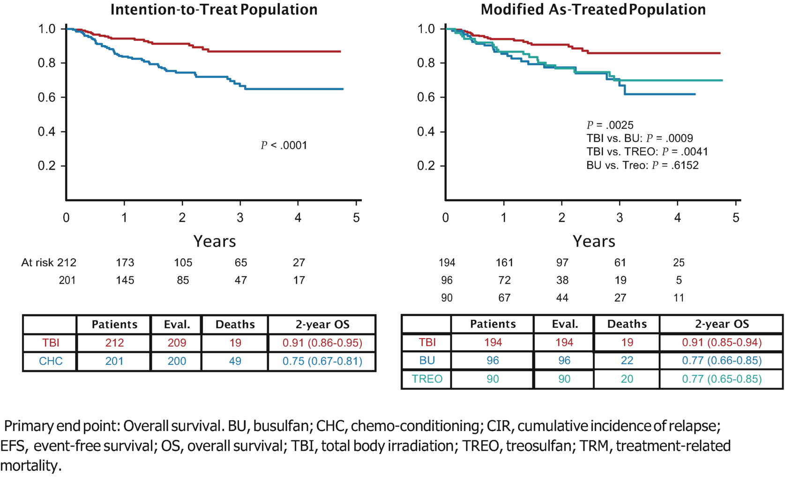

# Chapter 73. Acute Lymphoblastic Leukaemia in Children and Adolescents

> **Source:** Sureda A, Corbacioglu S, Greco R, Kröger N, Carreras E (eds). *The EBMT Handbook: Hematopoietic Cell Transplantation and Cellular Therapies*, 8th ed. Springer, Cham; 2024. pp. 659–667. https://doi.org/10.1007/978-3-031-44080-9_73  
> **Authors:** Peters, Christina; Locatelli, Franco; Bader, Peter  
>   - Peters, Christina: St. Anna Children’s Hospital; St. Anna Children’s Cancer Research Insitute  
>   - Locatelli, Franco: IRCCS Bambino Gesù Children’s Hospital; Catholic University of the Sacred Heart  
>   - Bader, Peter: University Hospital for Children and Adolescents, Goethe University Frankfurt am Main  
> **License:** CC BY 4.0 (https://creativecommons.org/licenses/by/4.0/). Text reproduced verbatim from the open-access HTML edition; formatting converted to Markdown.

## Abstract

Acute lymphoblastic leukaemia (ALL) is the most common cancer in children; approximately 60% of ALL cases occur in children and adolescents under the age of 20. Allogeneic haematopoietic cell transplantation (HCT) has become the most commonly used cellular immunotherapy and the standard of care for children with ALL who are either at high risk of relapse or have previously relapsed. HCT is a successful therapeutic option and a significant proportion of patients achieve long-term survival. The most common cause of treatment failure is relapse after allogeneic HCT. The risk of relapse after transplantation is influenced by several factors, including remission status at transplantation, conditioning regimen and donor type. Strategies to reduce the risk of relapse include reduction of pretransplant minimal residual disease (MRD), replacement of toxic pretransplant chemotherapy with bispecific antibodies, replacement of HCT with chimeric antigen receptor (CAR) T-cell therapy, improved transplantation strategies for specific groups, including infants, adolescents and young adults (AYA), and innovative prophylaxis and treatments for acute and chronic graft-versus-host disease. In addition, therapeutic drug monitoring with dose adjustment of some drugs, including busulfan, and novel radiation techniques may allow a more personalised approach.

## 73.1 Introduction

Acute lymphoblastic leukaemia (ALL) is the most common paediatric cancer; approximately 60% of ALL cases occur in children and adolescents younger than 20 years (Inaba and Pui 2021). Allogeneic haematopoietic cell transplantation (HCT) became the most commonly applied cellular immunotherapy and the standard of care for children with ALL who are either at high risk for relapse or had previously experienced a disease recurrence. HCT represents a successful therapeutic option and a relevant proportion of patients achieved long-term survival (Balduzzi et al. 2019). The most frequent cause of treatment failure is relapse after allogeneic HCT. The risk of post-transplant relapse is influenced by several factors, including remission status at transplantation, conditioning regimen and donor type (Peters*,* et al. 2021). Strategies aimed at reducing the risk of treatment failure have included a reduction of minimal residual disease (MRD) pre-transplant (Bader et al. 2019), the substitution of toxic chemotherapy before transplantation with bispecific antibodies (Locatelli et al. 2021), replacement of HCT with chimeric antigen receptor (CAR) T-cell therapy (Maude et al. 2018a, b), improved transplant strategies for specific groups, including infants (Pieters et al. 2019), adolescents and young adults (AYA) (Diesch-Furlanetto et al. 2021) and innovative prophylaxis and treatments for acute and chronic graft-vs.-host disease (GvHD). Furthermore, therapeutic drug monitoring with dose adjustment of some drugs, including busulfan (Diesch-Furlanetto et al. 2021) and novel radiation techniques might enable a more individualised approach (Hoeben et al. 2021).

To offer the patients the best available treatment options, a close collaboration between international study groups and transplant consortia is necessary. As an example, this cooperation was realized within the treatment consortia for childhood leukaemia (e.g. IBFM-SG, IntReALL, NOPHO, UKALL, AIEOP, FRALLE and others) and the paediatric transplant community (e.g. EBMT-PD WG, IBFM-SC SCT, GETMON and GITMO). ALL trial groups assess outcome according to their chemotherapy protocols and stratify patients into standard, intermediate and high relapse risk groups. In contrast to adults, only high-risk patients are eligible for allo-HCT in first complete remission (CR).

## 73.2 Prognostic Factors and Indications for HCT

HCT indications have to be defined prospectively and must be re-evaluated and regularly revised at intervals dependent on modifications and improvements in non-transplant approaches for both front-line and relapse protocols. Some risk factors such as recurrent molecular lesions predicting a poor outcome conveying a dismal prognosis in childhood ALL can be identified at diagnosis (Moorman 2016; O'Connor et al. 2018). In addition, the response to induction therapy measured by MRD levels has a strong prognostic value and now defines many indications for HCT (Bader et al. 2009; Conter et al. 2010; Schrappe et al. 2011; Eckert et al. 2013; Berry et al. 2017).

### 73.2.1 Indications: CR1

Only patients with high-risk cytogenetic features or unsatisfactory response to chemotherapy are eligible for HCT in first remission. In contrast to earlier recommendations, for these patients an MSD and an MUD and for the highest relapse category also mismatched donors (MMD) are an option (Truong et al. 2021). In the ongoing AIEOP-BFM 2017-trial, the very-high-risk subgroup with an indication for HCT in first CR is defined by

1.  1\.

    The presence of TCF3-HLF gene fusion,

2.  2\.

    KMT2A-AFF1 gene fusion,

3.  3\.

    Hypodiploidy defined as \<44 chromosmes,

4.  4\.

    IKZF1^(plus) deletions and medium-risk/high-risk MRD levels at the end of consolidation,

5.  5\.

    PCR-MRD HR, and.

6.  6\.

    T-ALL with PPR and/or FCM-MRD d15 HR and/or IF.

Patients with MRD negativity at EOI are excluded from a HCT indication. MMD-HCTs are nowadays reserved for a PCR-MRD TP2 ≥ 5 × 10⁻³, all TCF3-HLF fused leukaemias and those with induction failure (Table 73.1).

**Table 73.1 Indications for allogeneic HCT in CR1 according to AIEOP-BFM ALL 2009-trial**

|                       |                                           | PCR-MRD resultsa |                    |                                                |                           |               |
|-----------------------|-------------------------------------------|-----------------------------|--------------------|------------------------------------------------|---------------------------|---------------|
|                       |                                           | MRD-SR                      | MRD-MRb | MRD-HR                                         |                           | No MRD result |
|                       |                                           |                             |                    | MRD TP2 ≥ 10−3 to \<10−2 | MRD TP2 ≥ 10−2 |               |
| Criteria hierarchical | No CR d33                                 | Noc              | MMD                | MMD                                            | MMD                       | MMD           |
|                       | t(4;11)d                       | No                          | MD                 | MD                                             | MMD                       | MD            |
|                       | Hypodiploidy \<44 chromosomese | No                          | MD                 | MD                                             | MMD                       | MD            |
|                       | PPR + T-ALL                               | No                          | No                 | MD                                             | MMD                       | MD            |
|                       | None of the above featuresf    | No                          | No                 | MD                                             | MMD                       | No            |

1.  *PPR* Prednisone Poor Response on day 8, *NRd33* No Remission on day 33 *MRD* Minimal Residual Disease, *no* Allo HCT not indicated, *MD* Permitted donor: HLA-matched sibling or non-sibling donor, *MMD* Permitted donor: HLA-matched or HLA-mismatched donor
2.  a FCM-MRD results have no impact on the allo-HCT indication
3.  b Including MRD-MR SER (MRD TP1 ≥ 10−3 and TP2 10–4/−5)
4.  c Non-remission in patients with this rare constellation should be due to extramedullary disease. Allo-HCT indication in these cases should be discussed with the national study coordinator
5.  d Independent of prednisone response
6.  e The finding of exactly 44 chromosomes qualifies for HR treatment but has no impact on allo-HCT indication
7.  f Including patients with 44 chromosomes

### 73.2.2 Indications: CR2 and Later

All patients with relapse of T-ALL and patients with B-ALL who relapse during frontline therapy or within 6 months from treatment discontinuation (very early and early relapse) have a dismal prognosis when treated with conventional chemotherapy. Allo-HCT from any donor type is the contemporary standard post-remission consolidation therapy (Table 73.2a).

**Table 73.2 Indication for HCT according to IntReALL SR 2010 and HR protocol criteria**

| Relapse risk group | Phenotype | Time of relapse | Site of relapse  | MRD-status | Donor type   |
|--------------------|-----------|-----------------|------------------|------------|--------------|
| Very high          | T-ALL     | Any time        | I-BM, C-BM, I-EM |            | MSD, MD, MMD |
|                    | Non-T-ALL |                 |                  |            |              |
|                    |           | Very early      | I-BM, C-BM, I-EM |            |              |
|                    |           | Early           | I-BM, C-BM       | PR, ND     |              |
| High               | Non-T-ALL |                 |                  |            | MSD, MD      |
|                    |           | Late            | I-BM, C-BM       | PR, ND     |              |
|                    |           | Early           | C-BM             | GR         |              |
|                    |           |                 | I-EM             |            |              |
|                    |           | Late            | I-BM             | PR, ND     |              |
|                    |           |                 | C-BM             | ND         |              |

1.  *I-BM* isolated bone marrow, *C-BM* combined bone marrow and extramedullary site, *I-EM* isolated extramedullary, *MRD: GR* good response as defined by the specific chemotherapy-protocol, *PR* poor response, *ND* not detectable

In multiple relapsed patients, if they achieve a third or higher remission, allo-HCT should be considered in all patients, provided that their condition allows such a procedure. Patient not in morphological remission should not be transplanted except in extraordinary experimental situations (e.g. well-designed clinical trial with clear scientific questions).

## 73.3 Donor Selection and Stem Cell Source

OS and incidence of NRM in patients transplanted from a MSD as well as from a \> 9/10 MUD have steadily improved over time, and today the results for these outcomes do not differ according to the type of donor. However, it has been shown that in children HCT from an HLA-identical sibling results in a faster myeloid engraftment, prompter immunoreconstitution and less severe infections and should remain the preferred option (Peters et al. 2015a, b).

Since less than 25% of patients have a MSD, HCT from an alternative donors is most frequently applied. Several groups have demonstrated that an HCT from a MUD, identified by HLA high-resolution typing, has a similar outcome as a MSD-HCT (Zhang et al. 2012; Fagioli et al. 2013; Burke et al. 2015) Notably, Dalle et al. recently reported the 3-year consolidated results of 612 patients aged 4–21 years, treated at \>100 pediatric centers in 26 countries following HCT from either MSD (*n* = 186, 30%) or MUD (defined as 9 or 10/10 4-digit molecular HLA compatibility, *n* = 426, 70%) following 12Gy TBI-VP16 for ALL in CR1. GvHD-relapse-secondary malignancy-free survival (GRFS) was significantly better in MUD vs. MSD (62 ± 3 vs. ±51 ± 5%, *P* = 0.04) (Dalle et al. 2022).

Several methods were developed to overcome the HLA barriers in those patients who lack an HLA compatible donor. Currently, it is not clear which of the following, HLA-mismatched CB, TCD (alpha-beta depleted, CD34+ selected or CD3/CD19 depleted) haplo-identical grafts or PT-CY approaches, will result in the best outcome (Lang and Handgretinger 2008; Smith et al. 2009; Ruggeri et al. 2014; Locatelli et al. 2017; Rocha*,* et al. 2021) (Tables 73.3 and 73.4). Very promising results have been recently confirmed in children with ALL receinving a graft from an α/β T cell depleted HLA-haploidentical relative, with a very low risk of NRM and of both acute and chronic GvHD (Merli et al. 2022).

**Table 73.3 Matching criteria according to HLA typing/matching and stem cell source for children and AYAs with ALL**

| MSD | HLA-genotypically matched sibling, or 10/10 allelic match (if parental haplotypes unknown) | BM, PBSC |
|-----|--------------------------------------------------------------------------------------------|----------|
| MSD | 6/6 or 8/8, 5/6 or 7/8a                                                         | CB       |
| MD  | 9/10 or 10/10 allelic matched related or unrelated                                         | BM, PBSC |
| MD  | 5–6/6 unrelated or 6–7-8/8 unrelated                                                       | CB       |
| MMD | Less than 9/10 matched                                                                     | BM, PBSC |
| MMD | Less than 5/6 or 6/8 UCB                                                                   | CB       |

1.  *MSD* matched sibling donor, *MD* matched donor, *MMD* mismatched donor
2.  a 4 digits high-resolution typing recommended also for CB matching definition

**Table 73.4 Donor hierarchy—further selection criteria**

| Variable/order                 | Priority                                                                    |
|--------------------------------|-----------------------------------------------------------------------------|
| *CMV-status*                   |                                                                             |
| Patient CMV IgG positive       |                                                                             |
| 1                              | Donor CMV IgG positive                                                      |
| 2                              | Donor CMV IgG negative                                                      |
| Patient CMV IgG negative       |                                                                             |
| 1                              | Donor CMV IgG negative                                                      |
| 2                              | Donor CMV IgG positive                                                      |
| *Gender*                       |                                                                             |
| (Locatelli et al. 2022)        |                                                                             |
| 1                              | Male or female (preferentially not Allo-immunized by prior pregnancy) donor |
| Male patient                   |                                                                             |
| 1                              | Male donor                                                                  |
| 2                              | Female (preferentially not Allo-immunized by prior pregnancy) donor         |
| *Age*                          |                                                                             |
| 1                              | Younger donor if body weight enables sufficient SC harvest                  |
| 2                              | Older donor                                                                 |
| *Stem cell source*             |                                                                             |
| HCT from MSD or MD             |                                                                             |
| 1                              | Bone marrow                                                                 |
| 2                              | PPBSC (CAVE: Adjust GvHD-prophylaxis for matched siblings)                  |
| 2                              | Cord blood with sufficient cell number (\>3 × 107 NC/kg)         |
| HCT from MMD: Possible options |                                                                             |
|                                | BM, 8/10 matches, unmanipulated                                             |
|                                | PBSC, haploidentical, CD3/CD19 depleted, α/β depleted                       |
|                                | CB, sufficient stem cell dose                                               |
|                                | PBSC, haploidentical, CD34+ selection                                       |
|                                | PT-CY                                                                       |

Other factors to be considered in the choice of the donor are detailed in Tables 73.3 and 73.4. In particular, the donor/recipient CMV serology plays a relevant role in the post-transplant outcome as well as the donor age.

## 73.4 Conditioning Regimen

A myeloablative conditioning regimen is the treatment of choice for children and AYA with ALL. The FORUM trial demonstrated the significant superiority of the TBI/etoposide scheme in a randomized, prospective, multicenter, phase III trial. At a median age of 4.5 years, patients over 4 years of age with high-risk ALL had a 20% better OS and EFS and a lower NRM compared to patients who received a chemotherapy-based conditioning regimen.(Locatelli et al. 2022). In addition, the risk of leukaemia recurrence was much lower in patients given TBI as part of the conditioning regimen in comparison to those prepared with a chemo-therapy-based myeloablation. The same study showed that a myeloablative regimen containing treosulfan, thiotepa and fludarabine was associated with an outcome comparable to that of patients treated with busulfan, thiotepa and fludarabine (Peters*,* et al. 2021) (Fig. 73.1).

**Fig. 73.1**

Outcome of the randomized, prospective, multicentre phase III FORUM-study: (© 2020 by American Society of Clinical Oncology)

Whether a myeloablative conditioning with treosulfan will have a more benign adverse event profile and a higher chance for fertility preservation remains to be proven (Wachowiak et al. 2011; Boztug et al. 2015; Lee et al. 2015; Faraci et al. 2019).

Whenever possible, the interval between the end of the last chemotherapy and the start of the conditioning regimen should be 3–6 weeks to reduce the risk of NRM. If infection or toxicity requires a delay in conditioning, patients receive risk-adjusted chemotherapy or immunotherapy to bridge the time to transplant.The most successful approach to allow a reduction of MRD before transplantation is the use of blinatumomab. The continuous infusion of the bispecific antibody enables not only a deeper remission but also to spare chemotherapy-associated organ toxicity which results in better pre-transplant performance status (Locatelli et al. 2000a, b).

## 73.5 GVHD Prophylaxis

Children transplanted with bone marrow from MSD might benefit from an augmented GVL effect if only cyclosporine A is administered as GVHD prophylaxis (Locatelli et al. 2000a, b; Peters et al. 2010). However, careful monitoring and rapid intervention are crucial to prevent the development of severe GVHD. After HCT from non-sibling donors, a combination of a calcineurin inhibitor with short-course MTX and ATG is given in most patients (Peters et al. 2015a, b; Veys et al. 2012a, b; Balduzzi et al. 2019).

## 73.6 Children below 4 Years of Age

Both relapse and NRM contribute to treatment failure in infants and young children with high-risk ALL undergoing HCT. The optimal chemotherapeutic approach able to improve event-free survival (EFS) and to reduce the risk of NRM is not yet defined (Peters et al. 2022).

### 73.6.1 Mixed Chimerism (MC) and MRD

*Mixed chimerism (MC) and MRD* strongly predict risk for relapse in children (Bader et al. 2015).

Preemptive immunotherapy, e.g. withdrawal of IS or DLI guided by chimerism and MRD monitoring, may prevent impending relapse. However, the dynamic of leukaemic reappearance hampers the final success of these methods. Therefore, new post-transplant intervention strategies with less risk for severe complications like bi-specific antibodies or CAR-T-cell interventions may expedite the control of impending relapse (Handgretinger et al. 2011; Maude et al. 2018a, b).

### 73.6.2 Children with Ph + ALL

*Children with Ph +* ALL should receive TKIs post-transplant for relapse prevention. Whether the prophylactic approach (all Ph + patients will receive TKIs) or a preemptive therapy (only patients with a persistence/reappearance of BCR/ABL fusion transcript) is more effective has yet to be demonstrated (Schultz et al. 2010; Bernt and Hunger 2014). Both strategies are currently under investigation.

#### 73.6.2.1 The Amended EsPhALL Recommendation

Administration of imatinib prophylaxis post HCT when more than 50,000 platelets are reached is recommended with a duration of 365 days after HCT.

#### 73.6.2.2 TKI According to MRD Result

Administration of imatinib post HCT for all MRD-positive patients until two negative results are achieved. FACS- and PCR-MRD analyses are accepted.

### Key Points

- Only children and adolescents with very high or high relapse risk should be candidates for allo-HCT in CR1 and CR2. The assessment of relapse risk is largely influenced by the presence of recurrent molecular and cytogenetic abnormalities, response to chemotherapy, assessed through MRD evaluation and in relapsed patients – by time and site of relapse.

- MRD levels pre- and post-HCT are powerful predictors for outcome after HCT.

- Patients who are not in morphological remission before conditioning should not undergo allogeneic HCT except in extraordinary situations.

- Fractionated TBI/VP16-MAC is recommended for all children above the age of 4 with ALL. If this is not possible, a myeloablative chemo-conditioning is an option.

## References

- Bader P, Kreyenberg H, Henze GH, et al. Prognostic value of minimal residual disease quantification before allogeneic stem-cell transplantation in relapsed childhood acute lymphoblastic leukemia: the ALL-REZ BFM study group. J Clin Oncol. 2009;27:377–84.

- Bader P, Kreyenberg H, von Stackelberg A, et al. Monitoring of minimal residual disease after allogeneic stem-cell transplantation in relapsed childhood acute lymphoblastic leukemia allows for the identification of impending relapse: results of the ALL-BFM-SCT 2003 trial. J Clin Oncol. 2015;33:1275–84.

- Bader P, Salzmann-Manrique E, Balduzzi A, Dalle JH, Woolfrey AE, Bar M, Verneris MR, Borowitz MJ, Shah NN, Gossai N, Shaw PJ, Chen AR, Schultz KR, Kreyenberg H, Di Maio L, Cazzaniga G, Eckert C, van der Velden VHJ, Sutton R, Lankester A, Peters C, Klingebiel TE, Willasch AM, Grupp SA, Pulsipher MA. More precisely defining risk peri-HCT in pediatric ALL: pre- vs post-MRD measures, serial positivity, and risk modeling. Blood Adv. 2019;3:3393–405.

- Balduzzi A, Dalle JH, Wachowiak J, Yaniv I, Yesilipek A, Sedlacek P, Bierings M, Ifversen M, Sufliarska S, Kalwak K, Lankester A, Toporski J, Di Maio L, Glogova E, Poetschger U, Peters C. Transplantation in children and adolescents with acute lymphoblastic leukemia from a matched donor versus an HLA-identical sibling: is the outcome comparable? Results from the international BFM ALL SCT 2007 study. Biol Blood Marrow Transplant. 2019;25:2197–210.

- Bernt KM, Hunger SP. Current concepts in pediatric Philadelphia chromosome-positive acute lymphoblastic leukemia. Front Oncol. 2014;4:54.

- Berry DA, Zhou S, Higley H, Mukundan L, Fu S, Reaman GH, Wood BL, Kelloff GJ, Jessup JM, Radich JP. Association of Minimal Residual Disease with Clinical Outcome in pediatric and adult acute lymphoblastic leukemia: a meta-analysis. JAMA Oncol. 2017;3:e170580.

- Boztug H, Zecca M, Sykora KW, et al. EBMT paediatric diseases working party. Treosulfan-based conditioning regimens for allogeneic HSCT in children with acute lymphoblastic leukemia. Ann Hematol. 2015;94:297–306.

- Burke MJ, Verneris MR, Le Rademacher J, et al. Transplant outcomes for children with t cell acute lymphoblastic leukemia in second remission: a report from the center for international blood and marrow transplant research. Biol Blood Marrow Transplant. 2015;21:2154–9.

- Conter V, Bartram CR, Valsecchi MG, et al. Molecular response to treatment redefines all prognostic factors in children and adolescents with B-cell precursor acute lymphoblastic leukemia: results in 3184 patients of the AIEOP-BFM ALL 2000 study. Blood. 2010;115:3206–14.

- Diesch-Furlanetto T, Gabriel M, Zajac-Spychala O, Cattoni A, Hoeben BAW, Balduzzi A. Late effects after Haematopoietic stem cell transplantation in ALL, Long-Term Follow-Up and Transition: A Step Into Adult Life. Front Pediatr. 2021;9:9.

- Dalle J-H, Bader P, Yesilipek A, Locatelli F, Palma J, Wachowiak J, et al. Superior Graft-Versus-Leukemia Effect in Matched Unrelated Donor Versus HLA-Identical Sibling Pediatric Recipients Transplanted for Acute Lymphoblastic Leukemia within the Forum Study. Blood. 2022;140(Supplement 1):903–5.

- Eckert C, von Stackelberg A, Seeger K, et al. Minimal residual disease after induction is the strongest predictor of prognosis in intermediate risk relapsed acute lymphoblastic leukemia - long-term results of trial ALL-REZ BFM P95/96. Eur J Cancer. 2013;49:1346–55.

- Fagioli F, Quarello P, Zecca M, et al. Hematopoietic stem cell transplantation for children with high-risk acute lymphoblastic leukemia in first complete remission: a report from the AIEOP registry. Haematologica. 2013;98:1273–81.

- Faraci M, Diesch T, Labopin M, Dalissier A, Lankester A, Gennery A, Sundin M, Uckan-Cetinkaya D, Bierings M, Peters AMJ, Garwer M, Schulz A, Michel G, Giorgiani G, Gruhn B, Locatelli F, Giardino S, Uyttebroeck A, Rialland F, Itala-Remes M, Dreger P, Shaw PJ, Bordon V, Schlegel PG, Mellgren K, Moraleda JM, Patrick K, Schneider P, Jubert C, Lawitschka A, Salooja N, Basak GW, Corbacioglu S, Duarte R, Bader P. Gonadal function after Busulfan compared with Treosulfan in children and adolescents undergoing allogeneic hematopoietic stem cell transplant. Biol Blood Marrow Transplant. 2019;25:1786–91.

- Handgretinger R, Zugmaier G, Henze G, et al. Complete remission after blinatumomab-induced donor T-cell activation in three pediatric patients with post-transplant relapsed acute lymphoblastic leukemia. Leukemia. 2011;25:181–4.

- Hoeben BAW, Wong JYC, Fog LS, Losert C, Filippi AR, Bentzen SM, Balduzzi A, Specht L. Total body irradiation in Haematopoietic stem cell transplantation for Paediatric acute lymphoblastic Leukaemia: review of the literature and future directions. Front Pediatr. 2021;9:774348.

- Inaba H, Pui CH. Advances in the diagnosis and treatment of pediatric acute lymphoblastic leukemia. J Clin Med. 2021;10:1926.

- Lang P, Handgretinger R. Haploidentical SCT in children: an update and future perspectives. Bone Marrow Transplant. 2008;42(Suppl 2):S54–9.

- Lee JW, Kang HJ, Kim S, et al. Favorable outcome of hematopoietic stem cell transplantation using a targeted once-daily intravenous busulfan-fludarabine-etoposide regimen in pediatric and infant acute lymphoblastic leukemia patients. Biol Blood Marrow Transplant. 2015;21:190–5.

- Locatelli F, Bruno B, Zecca M, et al. Cyclosporin a and short-term methotrexate versus cyclosporin a as graft versus host disease prophylaxis in patients with severe aplastic anemia given allogeneic bone marrow transplantation from an HLA-identical sibling: results of a GITMO/EBMT randomized trial. Blood. 2000a;96:1690–7.

- Locatelli F, Zecca M, Rondelli R, Bonetti F, Dini G, Prete A, Messina C, Uderzo C, Ripaldi M, Porta F, Giorgiani G, Giraldi E, Pession A. Graft versus host disease prophylaxis with low-dose cyclosporine-a reduces the risk of relapse in children with acute leukemia given HLA-identical sibling bone marrow transplantation: results of a randomized trial. Blood. 2000b;95:1572–9.

- Locatelli F, Merli P, Pagliara D, et al. Outcome of children with acute leukemia given HLA-haploidentical HSCT after alphabeta T-cell and B-cell depletion. Blood. 2017;130:677–85.

- Locatelli F, Zugmaier G, von Stackelberg A. Blinatumomab vs chemotherapy among children with relapsed acute lymphoblastic leukemia-reply. JAMA. 2021;326:359–60.

- Locatelli F, Bader P, Dalle J-H, Poetschger U, Pichler H, Sedlacek P, Büchner J, Shaw PJ, Ifversen M, Staciuk R, Vettenranta K, Balduzzi A, Peters C. Long-term data confirm the superiority of Total body irradiation-containing conditioning regimen in comparison to a chemotherapy-based preparation in children with acute lymphoblastic leukemia above the age of 4 years given an Unmanipulated allograft. Results of the Forum randomized clinical trial. Blood. 2022;140:4865–7.

- Maude SL, Laetsch TW, Buechner J, Rives S, Boyer M, Bittencourt H, Bader P, Verneris MR, Stefanski HE, Myers GD, Qayed M, De Moerloose B, Hiramatsu H, Schlis K, Davis KL, Martin PL, Nemecek ER, Yanik GA, Peters C, Baruchel A, Boissel N, Mechinaud F, Balduzzi A, Krueger J, June CH, Levine BL, Wood P, Taran T, Leung M, Mueller KT, Zhang Y, Sen K, Lebwohl D, Pulsipher MA, Grupp SA. Tisagenlecleucel in children and young adults with B-cell lymphoblastic leukemia. N Engl J Med. 2018a;378:439–48.

- Maude SL, Laetsch TW, Buechner J, et al. Tisagenlecleucel in children and young adults with b-cell lymphoblastic leukemia. N Engl J Med. 2018b;378:439–48.

- Merli P, Pagliara D, Galaverna F, Li Pira G, Andreani M, Leone G, Amodio D, Pinto RM, Bertaina A, Bertaina V, Mastronuzzi A, Strocchio L, Boccieri E, Pende D, Falco M, Di Nardo M, Del Bufalo F, Algeri M, Locatelli F. TCRαβ/CD19 depleted HSCT from an HLA-haploidentical relative to treat children with different nonmalignant disorders. Blood Adv. 2022;6:281–92.

- Moorman AV. New and emerging prognostic and predictive genetic biomarkers in B-cell precursor acute lymphoblastic leukemia. Haematologica. 2016;101:407–16.

- O'Connor D, Enshaei A, Bartram J, et al. Genotype-specific minimal residual disease interpretation improves stratification in pediatric acute lymphoblastic leukemia. J Clin Oncol. 2018;36:34–43.

- Peters C, Cornish JM, Parikh SH, Kurtzberg J. Stem cell source and outcome after hematopoietic stem cell transplantation (HSCT) in children and adolescents with acute leukemia. Pediatr Clin N Am. 2010;57:27–46.

- Peters C, Schrappe M, von Stackelberg A, Schrauder A, Bader P, Ebell W, Lang P, Sykora KW, Schrum J, Kremens B, Ehlert K, Albert MH, Meisel R, Matthes-Martin S, Gungor T, Holter W, Strahm B, Gruhn B, Schulz A, Woessmann W, Poetschger U, Zimmermann M, Klingebiel T. Stem-cell transplantation in children with acute lymphoblastic leukemia: a prospective international multicenter trial comparing sibling donors with matched unrelated donors-the ALL-SCT-BFM-2003 trial. J Clin Oncol. 2015a;33:1265–74.

- Peters C, Schrappe M, von Stackelberg A, et al. Stem-cell transplantation in children with acute lymphoblastic leukemia: a prospective international multicenter trial comparing sibling donors with matched unrelated donors-the ALL-SCT-BFM-2003 trial. J Clin Oncol. 2015b;33:1265–74.

- Peters C, Dalle JH, Locatelli F, Poetschger U, Sedlacek P, Buechner J, Shaw PJ, Staciuk R, Ifversen M, Pichler H, Vettenranta K, Svec P, Aleinikova O, Stein J, Gungor T, Toporski J, Truong TH, Diaz-de-Heredia C, Bierings M, Ariffin H, Essa M, Burkhardt B, Schultz K, Meisel R, Lankester A, Ansari M, Schrappe M, Group, I.S, von Stackelberg A, IntRe, A.L.L.S.G, Balduzzi A, Group, I.B.S.S, Corbacioglu S, Party, E.P.D.W, Bader P. Total body irradiation or chemotherapy conditioning in childhood ALL: a multinational, randomized, noninferiority phase III study. J Clin Oncol. 2021;39:295–307.

- Peters C, Poetschger U, Dalle J-H, Yesilipek A, Stein J, Pichler H, Balduzzi A, Locatelli F, Sedlacek P, Wachowiak J, Güngör T, Ifversen M, Renard M, Truong TH, Staciuk R, Shaw PJ, Kriván G, Büchner J, Bader P. Relapse is the Most common treatment failure post HSCT in children with ALL below 4 years of age given a chemo-based conditioning regimen. Results from the prospective multinational Forum-trial. Blood. 2022;140:897–9.

- Pieters R, De Lorenzo P, Ancliffe P, Aversa LA, Brethon B, Biondi A, Campbell M, Escherich G, Ferster A, Gardner RA, Kotecha RS, Lausen B, Li CK, Locatelli F, Attarbaschi A, Peters C, Rubnitz JE, Silverman LB, Stary J, Szczepanski T, Vora A, Schrappe M, Valsecchi MG. Outcome of infants younger than 1 year with acute lymphoblastic leukemia treated with the Interfant-06 protocol: results from an international phase III randomized study. J Clin Oncol. 2019;37:2246–56.

- Rocha V, Arcuri LJ, Seber A, Colturato V, Zecchin VG, Kuwahara C, Nichele S, Gouveia R, Fernandes JF, Macedo AV, Tavares R, Daudt L, De Souza MP, Darrigo-Jr LG, Villela NC, Mariano LCB, Ginani VC, Zanette A, Loth G, Gomes AA, Hamerschlak N, Flowers ME, Bonfim C, Paediatric Working, G. & the Brazil-Seattle Consortium Study Group of the Brazilian Bone Marrow Transplantation, S. Impact of mother donor, peripheral blood stem cells and measurable residual disease on outcomes after haploidentical hematopoietic cell transplantation with post-transplant cyclophosphamide in children with acute leukaemia. Bone Marrow Transplant. 2021;56:3042–8.

- Ruggeri A, Labopin M, Sormani MP, et al. Engraftment kinetics and graft failure after single umbilical cord blood transplantation using a myeloablative conditioning regimen. Haematologica. 2014;99:1509–15.

- Schrappe M, Valsecchi MG, Bartram CR, et al. Late MRD response determines relapse risk overall and in subsets of childhood T-cell ALL: results of the AIEOP-BFM-ALL 2000 study. Blood. 2011;118:2077–84.

- Schultz KR, Prestidge T, Camitta B. Philadelphia chromosome-positive acute lymphoblastic leukemia in children: new and emerging treatment options. Expert Rev Hematol. 2010;3:731–42.

- Smith AR, Baker KS, Defor TE, et al. Hematopoietic cell transplantation for children with acute lymphoblastic leukemia in second complete remission: similar outcomes in recipients of unrelated marrow and umbilical cord blood versus marrow from HLA matched sibling donors. Biol Blood Marrow Transplant. 2009;15:1086–93.

- Truong TH, Jinca C, Mann G, Arghirescu S, Buechner J, Merli P, Whitlock JA. Allogeneic hematopoietic stem cell transplantation for children with acute lymphoblastic leukemia: shifting indications in the era of immunotherapy. Front Pediatr. 2021;9:782785.

- Veys P, Wynn RF, Ahn KW, Samarasinghe S, He W, Bonney D, Craddock J, Cornish J, Davies SM, Dvorak CC, Duerst RE, Gross TG, Kapoor N, Kitko C, Krance RA, Leung W, Lewis VA, Steward C, Wagner JE, Carpenter PA, Eapen M. Impact of immune modulation with in vivo T-cell depletion and myleoablative total body irradiation conditioning on outcomes after unrelated donor transplantation for childhood acute lymphoblastic leukemia. Blood. 2012a;119:6155–61.

- Veys P, Wynn RF, Ahn KW, et al. Impact of immune modulation with in vivo T-cell depletion and myleoablative total body irradiation conditioning on outcomes after unrelated donor transplantation for childhood acute lymphoblastic leukemia. Blood. 2012b;119:6155–61.

- Wachowiak J, Sykora KW, Cornish J, et al. Treosulfan-based preparative regimens for Allo-HSCT in childhood hematological malignancies: a retrospective study on behalf of the EBMT pediatric diseases working party. Bone Marrow Transplant. 2011;46:1510–8.

- Zhang MJ, Davies SM, Camitta BM, et al. Comparison of outcomes after HLA-matched sibling and unrelated donor transplantation for children with high-risk acute lymphoblastic leukemia. Biol Blood Marrow Transplant. 2012;18:1204–10.
