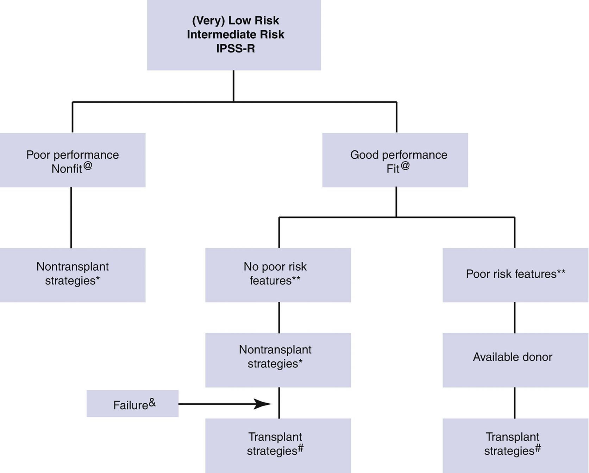
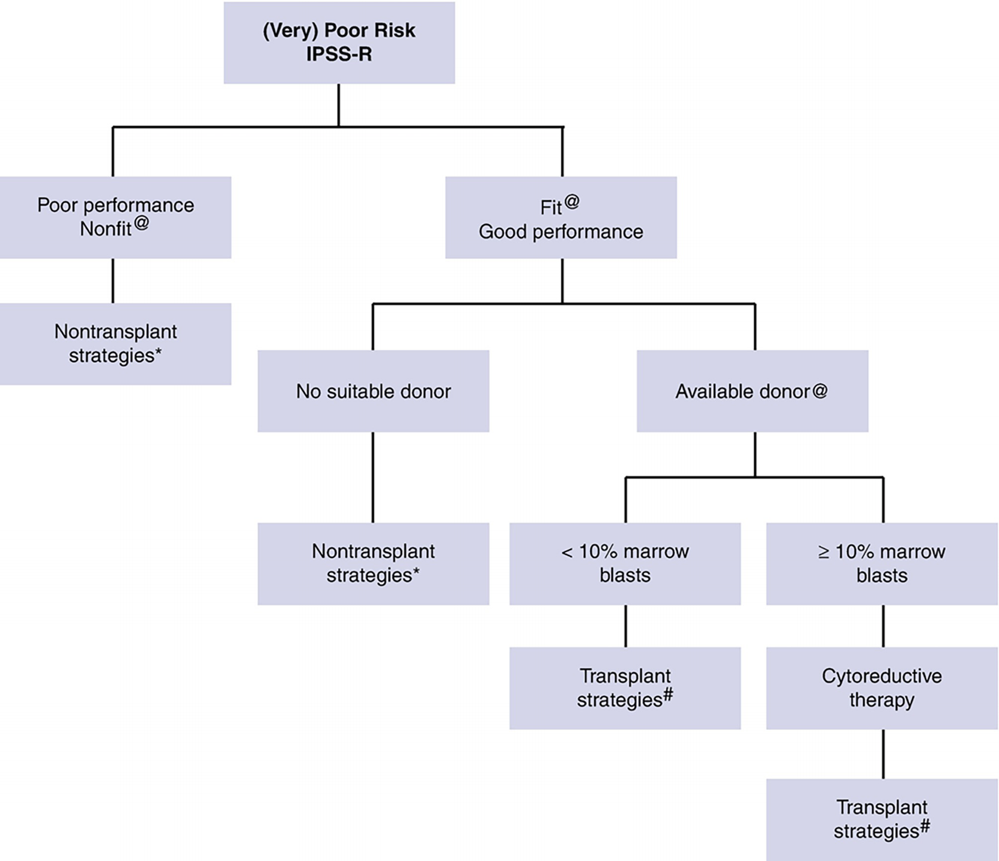

# Chapter 74. Myelodysplastic Neoplasms/Syndromes (MDS)

> **Source:** Sureda A, Corbacioglu S, Greco R, Kröger N, Carreras E (eds). *The EBMT Handbook: Hematopoietic Cell Transplantation and Cellular Therapies*, 8th ed. Springer, Cham; 2024. pp. 669–677. https://doi.org/10.1007/978-3-031-44080-9_74  
> **Authors:** Robin, Marie; Gurnari, Carmelo  
>   - Robin, Marie: Hôpital Saint-Louis, Assistance Publique Hôpitaux de Paris, Université de Paris Cité  
>   - Gurnari, Carmelo: University of Rome Tor Vergata; Taussig Cancer Institute, Cleveland Clinic  
> **License:** CC BY 4.0 (https://creativecommons.org/licenses/by/4.0/). Text reproduced verbatim from the open-access HTML edition; formatting converted to Markdown.

## Abstract

Myelodysplastic neoplasms/syndromes (MDS) are a heterogeneous group of clonal stem cell disorders characterized by peripheral cytopenias and dysplastic features in blood and bone marrow.

## 74.1 Introduction

Myelodysplastic syndromes (MDS) are a heterogeneous group of clonal stem cell disorders characterized by peripheral cytopenias and dysplastic features in blood and bone marrow. The natural history of these diseases varies from an indolent course, over a number of years, to a more rapid transition into secondary acute myeloid leukemia (AML). MDS is mainly diagnosed in elderly patients, with an annual incidence of 4.9/100,000 person/year, increasing up to 20–50 cases after the age of 60. In 2022, two classifications for MDS/AML have been published, an update of the WHO classification and the International Consensus Classification (ICC) (Khoury et al. 2022; Arber et al. 2022). As compared to the previous WHO 2016 classification, these 2 news proposal for MDS classification include genetic classification and do not consider marrow blast percentage as the single criteria to define MDS or AML. Both classifications recognize *SF3B1* mutated MDS and *TP53* biallelic mutated MDS as specific entities. Notably, several cases of MDS will now be defined as MDS/AML when they will show 10–19% BM blasts, recognizing the diagnostic continuum between these two nosologic entities.

Due to the variable course the disease may take, a number of different *risk-scoring systems* have been developed. The initial one is the International Prognostic Scoring System (IPSS) (P. Greenberg et al. 1997) revised in 2012 to account also for the degree of cytopenias (P. L. Greenberg et al. 2012) (Table 74.1). The importance of transfusion dependency is included in a WHO classification-based prognostic scoring system (WPSS) (Della Porta et al. 2015).

**Table 74.1 “Revised IPSS”**

| Points                                         | *0*        | *0.5* | *1*            | *1.5*         | *2*          | *3*  | *4*       |
|------------------------------------------------|------------|-------|----------------|---------------|--------------|------|-----------|
| Marrow blast                                   | \<3        |       | 3–4            |               | 5–10         | \>10 |           |
| Cytogenetica                        | Very good  |       | Good           |               | Intermediate | Poor | Very poor |
| Cytopeniab                          | No         | Mild  | Moderate       | Severe anemia |              |      |           |
| Risk                                           | *Very low* | *Low* | *Intermediate* | *High*        | *Very high*  |      |           |
| Number of points                               | ≤ 1.5      | 2–3   | 4–4.5          | 5–6           | \>6          |      |           |
| Median OS (years)                              | 8.8        | 5.3   | 3              | 1.6           | 0.8          |      |           |
| Median time to 25% AML transformation in years |            | 10.8  | 3.2            | 1.4           | 0.73         |      |           |

1.  a Cytogenetics: *very good*, -Y, del(11q); *good,* normal, del(5q), del(12p), del(20q), double including del(5q); intermediate, del(7q), −8, −19, i(17q), any other single or double independent clones; *poor,* −7, inv.(3)/t(3q)/del(3q), double including −7/del(7q), complex, 3 abnormalities; *very poor*, complex, \>3 abnormalities
2.  b Cytopenia, *mild cytopenia*, platelet count \<100 × 109/L or neutrophil count \<0.8 × 109/L; *moderate cytopenia*, hemoglobin \<10 g/dL but \>8 g/dL, platelet count \<50 × 109/L; *severe anemia*, hemoglobin \<8 g/dL

The role of somatic mutations has been explored recently, highlighting their prognostic impact, now taken into account in the most recent classifications. For instance, *SF3B1* mutations are commonly associated with refractory anemia with ringed sideroblasts and expected survival of \>10 years. Poor prognostic genomic alterations, such as *TP53* mutations, occur mainly in patients with HR-MDS (especially those causing biallelic inactivation) and confer a higher risk of transition to AML (Bernard Elsa et al. 2022). The urge to incorporate such molecular information into MDS prognostication led to the development of the molecular IPSS (IPSS-M), currently being validated in different variety of MDS settings (Bernard Elsa et al. 2022; Sauta et al. 2023; Kewan et al. 2023). The IPSS-M can be calculated using https://mds-risk-model.com.

In the setting of allo-HCT, both somatic mutations and cytogenetic characteristics conserve their prognostic impacts after transplantation, and this aspect will be discussed further hereafter.

In the 3 prospective trails based on donor availibility (Robin et al. 2015; Kröger et al. 2021; Nakamura et al. 2021) higher risk patient benefit more from allogeneic stem cell transplantation than from conventional therapy. Higher risk categories are patients (HR-MDS) classified intermediate-2 or high according to the classical IPSS, as compared to intermediate-1 and low risk patients (LR-MDS). Survivals of these higher risk patients may correspond to high and very high risk with the IPSS-M, but this needs to be confirmed. Especially LR-MDS are very heterogeneous with expected median survival between 3 and 10 years. As a result, intensive treatment strategies are predominantly applied in patients with HR-MDS, whereas LR-MDS tend to be treated conservatively (Robin et al. 2015; Kröger et al. 2021; Nakamura et al. 2021).

Allo-HCT is increasingly performed in MDS. Data from the EBMT registry show that 2591 MDS patients were transplanted in 2019, increasing from 946 patients in 2006. This has been the consequence of an expanded access to HCT also in older patients (\>60 years), representing 52% of all transplants in 2019 vs. 24% in 2006, as well as the recourse to more MURD (43% vs. 34%, respectively). The use of HLA mismatched related donor, mainly haplo-identical donor, has indeed grown from 4.5% in 2006 to 20.5% in 2019.

## 74.2 Indication of HCT in MDS and Timing to Transplant

HCT is an established procedure for MDS leading to potential long-term survival. The indications for HCT may change following the introduction of new treatment strategies, and the HCT approach itself has consistently evolved over time. NRM should always be balanced against the benefits associated with HCT. Prospective trials based on donor availability showed a gain in life expectancy in HR-MDS patients who have a donor (Robin et al. 2015; Kröger et al. 2021; Nakamura et al. 2021). Retrospective studies showed that LR-MDS patients do not benefit from upfront HCT (Cutler et al. 2004; Koreth et al. 2013). International expert panel has confirmed the indication of HCT in HR-MDS and in LR-MDS when they have or acquire specific poor prognostic features, including genetic alterations, failure to respond to usual treatment, life-threatening cytopenias, and high transfusion burden (de Witte et al. 2017; DeFilipp et al. 2023). Figures 74.1 and 74.2 summarize transplant indications in MDS patients. Currently, efforts to incorporate molecular scores to guide decision for HCT are under investigations, including the use of the new IPSS-M emphasizing that not only disease-specific but also transplant-related characteristic must be considered in the prognosis of MDS patients undergoing HCT(Sauta et al. 2023; Gurnari et al. 2023).

**Fig. 74.1**

Therapeutic flow chart for adult MDS patients with (very) low-risk or intermediate-risk IPSS-R scores @indicates nonfit (patients with multiple comorbidities and/or poor performance) or fit (patients with no comorbidities and good performance status). \* indicates nontransplant strategies according to most recent versions published by international MDS expert groups, including ELN and NCCN. & indicates failure of nontransplant strategies. \*\* indicates poor-risk features (defined as poor-risk cytogenetic characteristics, persistent blast increase \[\>50% or with \>15% BM blasts\], life-threatening cytopenias, high transfusion burden \>2 units per months for 6 months; molecular testing should be considered, in case of absence of poor-risk cytogenetic characteristics or persistent blast increase). \# indicates transplant strategies (all forms of HCT, for details of the donor selection, type of conditioning, and post-transplant strategies, see text; no upper age limit if patients are fit, without serious comorbidity, and with good Karnofsky status)

**Fig. 74.2**

Therapeutic flow chart for adult MDS patients with poor IPSS-R scores. @ indicates nonfit (patients with multiple comorbidities and/or poor performance) or fit (patients with no comorbidities and good performance status). \* indicates nontransplant strategies according to most recent versions published by international MDS expert groups, including ELN and NCCN. & indicates failure of nontransplant strategies. \*\* indicates poor-risk features (defined as poor-risk cytogenetic characteristics, persistent blast increase \[\>50% or with \>15% BM blasts\], life-threatening cytopenias, high transfusion burden \>2 units per months for 6 months; molecular testing should be considered, in case of absence of poor-risk cytogenetic characteristics or persistent blast increase). \# indicates transplant strategies (all forms of HCT, for details of the donor selection, type of conditioning, and post transplant strategies, see text; no upper age limit if patients are fit, without serious comorbidity,and with good Karnofsky status)

## 74.3 Treatment Prior to HCT

Pregraft therapy is still a matter of debate. Upfront transplantation, hypomethylating agents alone or in combination, or chemotherapy may be all viable options in HR-MDS, although more studies are needed to determine the precise allocation of these therapy. The use of pregraft therapy may prevent transformation into AML in cases whereby the transplantation cannot be performed in a timely fashion.

International guidelines generally recommend with a low level of evidence that patients with more than 10% marrow blast should receive cytoreductive treatment (de Witte et al. 2017; DeFilipp et al. 2023). Refractoriness to pregraft treatment is generally associated with poor outcomes (Potter et al. 2016). As shown by the BMT-AZA prospective study, azacitidine bridge in HR-MDS is feasibile before HCT (Voso et al. 2017).

## 74.4 Preparative Regimen

The use of RIC regimens for HCT has raised considerable interest. Multiple centers have developed novel RIC regimens that have reduced NRM and morbidity and subsequently expanded the curative potential of HCT to older individuals who have historically not been considered to be HCT candidates. An EBMT prospective study including 120 patients and comparing the use of RIC (FLU/BU) and MAC (CY/BU) in patients with MDS or secondary AML (Kröger et al. 2017) failed to show any impact of the regimen intensity with regards to OS and RFS. The BMT-CTN performed a prospective study on 272 patients with MDS or AML who were randomized between RIC and MAC. In the MDS subgroup, there was no difference in OS, despite a higher relapse rate after RIC (Scott et al. 2017). Recently, the CIBMTR performed a registry analysis based on a Disease Risk Index (DRI) in 4387 adults with MDS and AML (aged 40–65 years). While in low/intermediate DRI cases, RIC associated with lower DFS rates (HR, 1.19; *P* = 0.001), in high/very high DRI, DFS was similar regardless of conditioning intensity (Bejanyan et al. 2021). A phase 3 trial comparing RIC and sequential regimen has also reported similar outcomes in both arms (Craddock et al. 2021).

Nowadays, the conditioning regimen is still based on the fitness of the patients, using MAC only in eligible, fit and generally younger patients.

## 74.5 Post-HCT Outcomes

As aforementioned, post-HCT outcomes depend both on disease- and transplant-specific risk factors. Poor and very poor risk cytogenetics, including monosomal karyotypes, and HR-MDS are associated with poorer outcomes. Age and hematopoietic cell transplant-comorbidity index (HCT-CI) are patient-specific risk factors. An EBMT study defined a transplant-specific risk score including age, donor type, performance status, cytogenetic category, recipient’s cytomegalovirus status, percentage of blasts, and platelet count, which outperformed previous scoring systems specifically predicting post-HCT outcomes (Gagelmann et al. 2019). Somatic mutations, i.e., biallelic *TP53* inactivation*, ASXL1, RUNX1*, and *RAS* pathways mutations, have also been reported to be prognostic independent players (Lindsley et al. 2017; Sauta et al. 2023).

## 74.6 Alternative Donors and Donor Choice

While MUD and HLA-matched sibling donor are both suitable options in MDS patients (de Witte et al. 2017), as well as in other diseases, the recourse to haplo-identical donor have progressively increased. Conversely, unrelated cord blood units are less used, due to the limited number of cells and the slow hematological and immunological recovery. In recent analyses of the EBMT registry, transplantation from an haplo-identical donor showed promising results, albeit without reaching the outcomes of HLA-matched unrelated or related donors, due to an excess risk of NRM (Raj et al. 2022; Robin et al. 2017, 2019). A specific issue is the impact of donor age on post-transplant outcomes, suggesting the use of younger donors (Kröger et al. 2013; Murthy et al. 2022). This is particularly relevant in MDS, where both recipients and related donors are typically old.

## 74.7 Post-HCT Treatment

MDS patients with relapse after HCT become often refractory to treatment, or are not fit enough to be treated. The main risk factors for treatment response are time from transplantation to relapse and percentage of marrow blast with better prognosis in patients who have only a molecular relapse. An EBMT study involving 181 MDS patients treated with AZA for post-HCT relapse confirmed that lower blast counts upon relapse and a time gap of \>6 months after HCT were both good prognostic factors (Craddock et al. 2016). In this study, the addition of DLI did not modify outcomes. Another EBMT study exploring the use of cellular therapy after relapse (DLI or second transplant) showed that a second allo-HCT performed in CR may rescue some patients, especially those with no prior history of GVHD, and for whom a new donor is available (Schmid et al. 2018). In a French SFGM-TC study of 147 MDS patients relapsing after transplant (Guièze et al. 2016), only those receiving DLI or second HCT were able to achieve long-term survival (32% versus 6% for chemotherapy alone).

Besides DLI, other strategies involve preventive or preemptive treatment after transplantation to avoid morphological relapse (maintenance). These strategies based on the underlying risk or monitoring of minimal residual disease may help in patients who present a high risk of post-transplant relapse, namely cases with biallelic *TP53* inactivation or complex cytogenetics (DeFilipp et al. 2023). Although relapse remains the most common cause of transplant failure, particularly in patients with high-risk features, the preemptive use of AZA or DLI may be effective in improving historically poor outcomes. Preventive post-transplant treatment testing and HMA early after transplantation have also been reported in small prospective studies and a recent systematic review and metanalysis showed a better survival outcomes in patients receveing preventively HMA after HCT (Kungwankiattichai et al. 2022). However, the phase 3 trial randomizing 5-azacytidine to observation has not concluded to a benefit for the interventional arm (Oran et al. 2020). Trials using novel oral azacitidine formulations and targeted agents (venetoclax, enasidenib, and eprenetapopt) alone or in combinations are expected.

### Key Points

- Allo-HCT is the treatment of choice for all patients with HR-MDS who are fit enough to be considered for transplantation.

&nbsp;

- In HR-MDS, delayed HCT is associated with reduced chances of prolonged relapse-free survival. Conversely, patients with LR-MDS may benefit from deferred HCT upon disease progression.

&nbsp;

- Allo-HCT outcomes have improved progressively in recent years, mainly due to a gradual reduction in non-relapse mortality. Reduced-intensity conditioning (RIC) regimens have extended the use of allo-HCT to older patients, including those entering their eighth decade.

&nbsp;

- The use of alternative donors has broadened the chance to recourse to HCT in MDS with satisfying long-term outcomes.

- A number of questions remain to be solved by prospective studies, such as the role of molecular markers in the HCT decision algorithm and the post-transplant maintenance strategies, in line of the availability of new targeted treatments.

## References

- Arber DA, Orazi A, Hasserjian RP, Borowitz MJ, Calvo KR, Kvasnicka H-M, Wang SA, et al. International consensus classification of myeloid neoplasms and acute Leukemias: integrating morphologic, clinical, and genomic data. Blood. 2022;140(11):1200–28. https://doi.org/10.1182/blood.2022015850.

- Bejanyan N, Zhang M, Bo-Subait K, Brunstein C, Wang H, Warlick ED, Giralt S, et al. Myeloablative conditioning for allogeneic transplantation results in superior disease-free survival for acute myelogenous leukemia and myelodysplastic syndromes with low/intermediate but not high disease risk index: a center for international blood and marrow transplant research study. Transplant Cell Ther. 2021;27(1):68.e1–9. https://doi.org/10.1016/j.bbmt.2020.09.026.

- Craddock C, Labopin M, Robin M, Finke J, Chevallier P, Yakoub-Agha I, Bourhis JH, et al. Clinical activity of Azacitidine in patients who relapse after allogeneic stem cell transplantation for acute myeloid leukemia. Haematologica. 2016;101(7):879–83. https://doi.org/10.3324/haematol.2015.140996.

- Craddock C, Jackson A, Loke J, Siddique S, Hodgkinson A, Mason J, Andrew G, et al. Augmented reduced-intensity regimen does not improve postallogeneic transplant outcomes in acute Myeloid Leukemia. J Clin Oncol. 2021;39(7):768–78. https://doi.org/10.1200/JCO.20.02308.

- Cutler CS, Lee SJ, Greenberg P, Deeg HJ, Perez WS, Anasetti C, Bolwell BJ, et al. A decision analysis of allogeneic bone marrow transplantation for the myelodysplastic syndromes: delayed transplantation for low-risk myelodysplasia is associated with improved outcome. Blood. 2004;104(2):579–85.

- de Witte T, Bowen D, Robin M, Malcovati L, Niederwieser D, Yakoub-Agha I, Mufti GJ, et al. Allogeneic hematopoietic stem cell transplantation for MDS and CMML: recommendations from an international expert panel. Blood. 2017;129(13):1753–62. https://doi.org/10.1182/blood-2016-06-724500.

- DeFilipp Z, Ciurea SO, Cutler C, Robin M, Warlick ED, Nakamura R, Brunner AM, et al. Hematopoietic cell transplantation in the Management of Myelodysplastic Syndrome: an evidence-based review from the American Society for Transplantation and Cellular Therapy Committee on practice guidelines. Transplant Cell Ther. 2023;29(2):71–81. https://doi.org/10.1016/j.jtct.2022.11.014.

- Della Porta MG, Tuechler H, Malcovati L, Schanz J, Sanz G, Garcia-Manero G, Solé F, et al. Validation of WHO classification-based prognostic scoring system (WPSS) for myelodysplastic syndromes and comparison with the revised international prognostic scoring system (IPSS-R). A study of the international working Group for Prognosis in myelodysplasia (IWG-PM). Leukemia. 2015;29(7):1502–13. https://doi.org/10.1038/leu.2015.55.

- Elsa B, Heinz T, Greenberg PL, Hasserjian RP, Arango Ossa Juan E, Yasuhito N, Devlin SM, et al. Molecular international prognostic scoring system for myelodysplastic syndromes. NEJM Evidence. 2022;1(7):EVIDoa2200008. https://doi.org/10.1056/EVIDoa2200008.

- Gagelmann N, Eikema D-J, Stelljes M, Beelen D, de Wreede L, Mufti G, Knelange NS, et al. Optimized EBMT transplant-specific risk score in myelodysplastic syndromes after allogeneic stem-cell transplantation. Haematologica. 2019;104(5):929–36. https://doi.org/10.3324/haematol.2018.200808.

- Greenberg P, Cox C, LeBeau MM, Fenaux P, Morel P, Sanz G, Sanz M, et al. International scoring system for evaluating prognosis in myelodysplastic syndromes. Blood. 1997;89(6):2079–88.

- Greenberg PL, Tuechler H, Schanz J, Sanz G, Garcia-Manero G, Sole F, Bennett JM, et al. Revised international prognostic scoring system for myelodysplastic syndromes. Blood. 2012;120(12):2454–65.

- Guièze R, Damaj G, Pereira B, Robin M, Chevallier P, Michallet M, Vigouroux S, et al. Management of Myelodysplastic Syndrome Relapsing after allogeneic hematopoietic stem cell transplantation: a study by the French Society of Bone Marrow Transplantation and Cell Therapies. Biol Blood Marrow Transplant. 2016;22(2):240–7. https://doi.org/10.1016/j.bbmt.2015.07.037.

- Gurnari C, Gagelmann N, Badbaran A, Awada H, Dima D, Pagliuca S, D’Aveni-Piney M, et al. Outcome prediction in myelodysplastic neoplasm undergoing hematopoietic cell transplant in the molecular era of IPSS-M. Leukemia. 2023;37(3):717–9. https://doi.org/10.1038/s41375-023-01820-4.

- Kewan T, Bahaj W, Durmaz A, Aly M, Ogbue OD, Carraway HE, Sekeres MA, Visconte V, Gurnari C, Maciejewski JP. Validation of the molecular international prognostic scoring system in patients with myelodysplastic syndromes. Blood. 2023;141(14):1768–72. https://doi.org/10.1182/blood.2022018896.

- Khoury JD, Solary E, Abla O, Akkari Y, Alaggio R, Apperley JF, Bejar R, et al. The 5th edition of the World Health Organization classification of Haematolymphoid Tumours: myeloid and histiocytic/dendritic neoplasms. Leukemia. 2022;36(7):1703–19. https://doi.org/10.1038/s41375-022-01613-1.

- Koreth J, Pidala J, Perez WS, Deeg HJ, Garcia-Manero G, Malcovati L, Cazzola M, et al. Role of reduced-intensity conditioning allogeneic hematopoietic stem-cell transplantation in older patients with de novo myelodysplastic syndromes: an international collaborative decision analysis. J Clin Oncol. 2013;31(21):2662–70.

- Kröger N, Zabelina T, de Wreede L, Berger J, Alchalby H, van Biezen A, Milpied N, et al. Allogeneic stem cell transplantation for older advanced MDS patients: improved survival with young unrelated donor in comparison with HLA-identical siblings. Leukemia. 2013;27(3):604–9. https://doi.org/10.1038/leu.2012.210.

- Kröger N, Iacobelli S, Franke G-N, Platzbecker U, Uddin R, Hübel K, Scheid C, et al. Dose-reduced versus standard conditioning followed by allogeneic stem-cell transplantation for patients with myelodysplastic syndrome: a prospective randomized phase III study of the EBMT (RICMAC trial). J Clin Oncol Off J Am Soc Clin Oncol. 2017;35(19):2157–64. https://doi.org/10.1200/JCO.2016.70.7349.

- Kröger N, Sockel K, Wolschke C, Bethge W, Schlenk RF, Wolf D, Stadler M, et al. Comparison between 5-azacytidine treatment and allogeneic stem-cell transplantation in elderly patients with advanced mds according to donor availability (VidazaAllo Study). J Clin Oncol. 2021;39(30):3318–27. https://doi.org/10.1200/JCO.20.02724.

- Kungwankiattichai S, Ponvilawan B, Roy C, Tunsing P, Kuchenbauer F, Owattanapanich W. Maintenance with Hypomethylating agents after allogeneic stem cell transplantation in acute myeloid leukemia and myelodysplastic syndrome: a systematic review and meta-analysis. Front Med. 2022;9:801632. https://doi.org/10.3389/fmed.2022.801632.

- Lindsley RC, Saber W, Mar BG, Redd R, Wang T, Haagenson MD, Grauman PV, et al. Prognostic mutations in myelodysplastic syndrome after stem-cell transplantation. N Engl J Med. 2017;376(6):536–47. https://doi.org/10.1056/NEJMoa1611604.

- Murthy G, Subramanian G, Kim S, Zhen-Huan H, Estrada-Merly N, Abid MB, Aljurf M, Bacher U, et al. Relapse and disease-free survival in patients with myelodysplastic syndrome undergoing allogeneic hematopoietic cell transplantation using older matched sibling donors vs younger matched unrelated donors. JAMA Oncol. 2022;8(3):404–11. https://doi.org/10.1001/jamaoncol.2021.6846.

- Nakamura R, Saber W, Martens MJ, Ramirez A, Scott B, Oran B, Leifer E, et al. Biologic assignment trial of reduced-intensity hematopoietic cell transplantation based on donor availability in patients 50–75 years of age with advanced myelodysplastic syndrome. J Clin Oncol. 2021;39(30):3328–39. https://doi.org/10.1200/JCO.20.03380.

- Oran B, de Lima M, Garcia-Manero G, Thall PF, Lin R, Popat U, Alousi AM, et al. A phase 3 randomized study of 5-Azacitidine maintenance vs observation after transplant in high-risk AML and MDS patients. Blood Adv. 2020;4(21):5580–8. https://doi.org/10.1182/bloodadvances.2020002544.

- Potter VT, Iacobelli S, van Biezen A, Maertens J, Bourhis J-H, Passweg JR, Yakhoub-Agha I, et al. Comparison of intensive chemotherapy and hypomethylating agents before allogeneic stem cell transplantation for advanced myelodysplastic syndromes: a study of the myelodysplastic syndrome subcommittee of the chronic malignancies working party of the european society for blood and marrow transplant research. Biol Blood Marrow Transplant. 2016;22(9):1615–20. https://doi.org/10.1016/j.bbmt.2016.05.026.

- Raj K, Eikema D-J, Sheth V, Koster L, de Wreede LC, Blaise D, Di Grazia C, et al. Comparison of outcomes for HLA-matched sibling and Haplo-identical donors in myelodysplastic syndromes: report from the chronic malignancies working party of EBMT. Blood Cancer J. 2022;12(9):140. https://doi.org/10.1038/s41408-022-00729-y.

- Robin M, Porcher R, Adès L, Raffoux E, Michallet M, François S, Cahn J-Y, et al. HLA-matched allogeneic stem cell transplantation improves outcome of higher risk myelodysplastic syndrome a prospective study on behalf of SFGM-TC and GFM. Leukemia. 2015;29(7):1496–501. https://doi.org/10.1038/leu.2015.37.

- Robin M, Porcher R, Ciceri F, Teresa M, van Lint S, Santarone GE, Blaise D, et al. Haploidentical transplant in patients with myelodysplastic syndrome. Blood Adv. 2017;1(22):1876–83. https://doi.org/10.1182/bloodadvances.2017007146.

- Robin M, Porcher R, Ruggeri A, Blaise D, Wolschke C, Koster L, Angelucci E, et al. HLA-mismatched donors in patients with myelodysplastic syndrome: an EBMT registry analysis. Biol Blood Marrow Transplant. 2019;25(1):114–20. https://doi.org/10.1016/j.bbmt.2018.08.026.

- Sauta E, Robin M, Bersanelli M, Travaglino E, Meggendorfer M, Zhao L-P, Berrocal JCC, et al. Real-world validation of molecular international prognostic scoring system for myelodysplastic syndromes. J Clin Oncol Off J Am Soc Clin Oncol. 2023;41(15):2827–42. https://doi.org/10.1200/JCO.22.01784.

- Schmid C, de Wreede LC, van Biezen A, Finke J, Ehninger G, Ganser A, Volin L, et al. Outcome after relapse of myelodysplastic syndrome and secondary acute myeloid leukemia following allogeneic stem cell transplantation: a retrospective registry analysis on 698 patients by the chronic malignancies working Party of the European Society of blood and marrow transplantation. Haematologica. 2018;103(2):237–45. https://doi.org/10.3324/haematol.2017.168716.

- Scott BL, Pasquini MC, Logan BR, Juan W, Devine SM, Porter DL, Maziarz RT, et al. Myeloablative versus reduced-intensity hematopoietic cell transplantation for acute myeloid leukemia and myelodysplastic syndromes. J Clin Oncol Off J Am Soc Clin Oncol. 2017;35(11):1154–61. https://doi.org/10.1200/JCO.2016.70.7091.

- Voso MT, Leone G, Piciocchi A, Fianchi L, Santarone S, Candoni A, Criscuolo M, et al. Feasibility of allogeneic stem-cell transplantation after Azacitidine bridge in higher-risk myelodysplastic syndromes and low blast count acute myeloid leukemia: results of the BMT-AZA prospective study. Ann Oncol. 2017;28(7):1547–53. https://doi.org/10.1093/annonc/mdx154.
