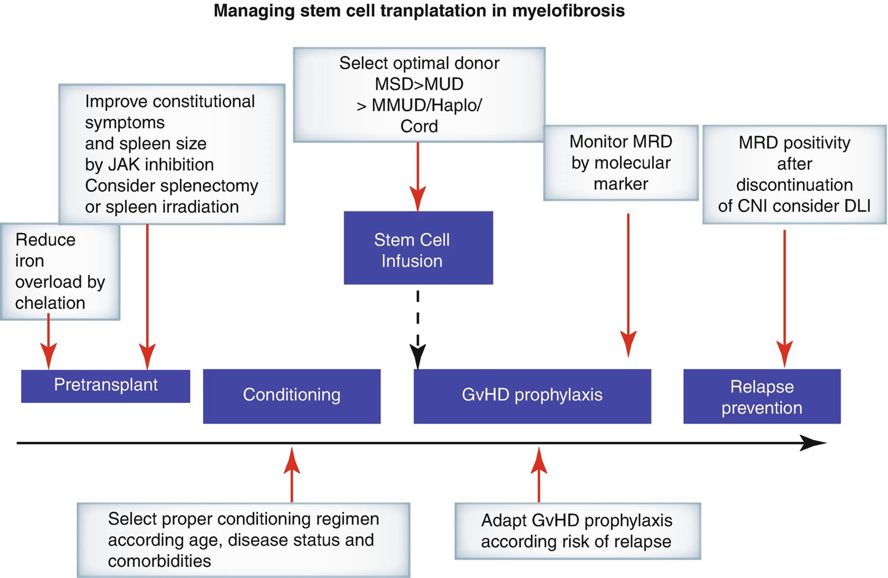
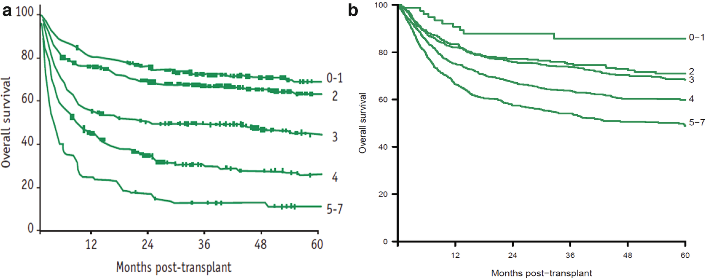

# Chapter 77. Myeloproliferative Neoplasms

> **Source:** Sureda A, Corbacioglu S, Greco R, Kröger N, Carreras E (eds). *The EBMT Handbook: Hematopoietic Cell Transplantation and Cellular Therapies*, 8th ed. Springer, Cham; 2024. pp. 695–705. https://doi.org/10.1007/978-3-031-44080-9_77  
> **Authors:** Kröger, Nicolaus; McLornan, Donal P.; Chalandon, Yves  
>   - Kröger, Nicolaus: University Medical Center Hamburg-Eppendorf  
>   - McLornan, Donal P.: University College London Hospitals NHS Trust  
>   - Chalandon, Yves: Hôpitaux Universitaires de Genève, University of Geneva  
> **License:** CC BY 4.0 (https://creativecommons.org/licenses/by/4.0/). Text reproduced verbatim from the open-access HTML edition; formatting converted to Markdown.

## Abstract

Polycythemia vera (PV) and essential thrombocythemia (ET) have a favorable outcome without need for allo-HCT unless the disease has progressed to post-ET/PV myelofibrosis or secondary AML (Lussana et al. 2014).

## 77.1 Primary and Post ET/PV Myelofibrosis

### 77.1.1 Definition and Risk Scores

Polycythemia vera (PV) and essential thrombocythemia (ET) have a favorable outcome without need for allo-HCT unless the disease has progressed to post-ET/PV myelofibrosis or secondary AML (Lussana et al. 2014).

Primary myelofibrosis (PMF) or post-ET/PV myelofibrosis is one of the “Philadelphia-negative” myeloproliferative neoplasms (MPN) with the worst overall survival of approximately 6 years. Allo-HCT can cure a substantial number of patients but is still not universally applicable due to toxicity, which may lead to therapy-related morbidity and mortality (McLornan et al. 2021).

### 77.1.2 Transplant Results in Myelofibrosis

In the late 1980s and the early 1990s, the feasibility of allo-HCT for myelofibrosis was highlighted in several small case series. One retrospective, multicenter study described outcomes from MAC in relatively young patients (median age 42 years) with a NRM of 27% and a 9% incidence of graft failure. The OS and PFS was 47% and 39% at 5 years (Guardiola et al. 1999). A single-center study from Seattle included 104 patients most of whom received allo-HCT after MAC, and NRM at 5 years of 34% and OS at 7 years of 61% were reported (Deeg et al. 2003).

The evidence of graft-versus-myelofibrosis effect was documented by responses to DLI after failure of allo-HCT (Byrne et al. 2000). RIC for myelofibrosis was investigated in two prospective studies. The prospective EBMT study reported results of 103 patients who received a BU/FLU-based RIC followed by related or unrelated HCT. The median age was 55 years, and the NRM at 1 year was 16%. Cumulative incidence of relapse was 22% at 3 years. PFS and OS at 5 years were 51% and 67%, respectively. Advanced age and HLA-mismatched donor were independent predictive factors for reduced survival (Kroger et al. 2009). A recent update of the study after a median follow-up of 60 months showed an 8-year OS of 65% with stable plateau. Five-year DFS was 40%, and 5-year cumulative incidence of relapse/progression was 28% with a 3-year NRM of 21%.

The Myeloproliferative Disorders Research Consortium performed also a prospective phase II trial including 66 patients with primary or post-ET/PV myelofibrosis investigating a reduced conditioning regimen with MEL/FLU. With a median follow-up of 25 months, OS was 75% in the sibling group and only 32% in the unrelated (URD) group due to a higher NRM in the URD group (59% vs. 22%) (Rondelli et al. 2014). Other studies using RIC or MAC confirmed the curative effect of allo-HCT irrespective of the intensity of the conditioning (summarized in Kröger et al. 2015a). Transplantation outcomes in accelerated phase are similar to chronic phase while outcome in blastic phase is worse (Gagelmann et al. 2022a, b; Orti et al. 2023).

### 77.1.3 Disease-Specific Risk Factors

Patients with PMF or post-ET/PV myelofibrosis have a median survival of approximately 6 years, but survival varies from less than 2 to more than 15 years. Risk scores (see Table 77.1) such as IPSS (Cervantes et al. 2009), dynamic IPSS (DIPSS) (Passamonti et al. 2010), or DIPSS plus (Gangat et al. 2011) are currently used in clinical practice to determine the prognosis of patients with PMF. More recently, molecular markers have been introduced into the PMF specific risk score (MIPSS70) (Guglielmelli et al. 2018), and a specific MYSEC score for post-ET/PV myelofibrosis has been proposed (Passamonti et al. 2017; Kroger et al. 2015a). The EBMT/ELN consensus paper recommended allo-HCT for patients less than 70 years with an estimated median survival of less than 5 years. This would include patients with IPSS or DIPSS intermediate-2 and high risk and is based on a comparison between transplanted and non-transplanted patients in the pre-ruxolitinib era (Kroger et al. 2015a, b). Patients with intermediate-1 risk can be considered for allo-HCT if other high-risk features such as *ASXL1* mutation, more than 2% peripheral blasts, refractory transfusion-dependent anemia, or adverse cytogenetics according to DIPSS plus are present (Kroger et al. 2015a).

**Table 77.1 Prognosis risk scores and transplant specific (MTSS) score for myelofibrosis**

<table>
<thead>
<tr>
<th>
Score
</th>
<th>
Adverse factors (puntos)
</th>
<th>
Risk group and median SRV
</th>
</tr>
</thead>
<tbody>
<tr>
<td>
IPSS
</td>
<td>
Age &gt; 65 years (1 p)

Constitutional symptoms (1 p)

Hb &lt;100 g/L (1 p)

Leucocytes &gt;25 × 109/L (1 p)

Blasts in PB ≥1% (1 p)
</td>
<td>
Low (0 p), 11.3 years

Intermediate-1 (1 p), 7.9 years

Intermediate-2 (2 p), 4 years

High (3–5 p), 2.3 years
</td>
</tr>
<tr>
<td>
DIPSS
</td>
<td>
Age &gt; 65 years (1 p)

Constitutional symptoms (1 p)

Hb &lt;100 g/L (2 p)

Leucocytes &gt;25 × 109/L (1 p)

Blasts in PB ≥1% (1 p)
</td>
<td>
Low (0 p), not reached

Intermediate-1 (1–2 p):,14.2 years

Intermediate-2 (3–4 p), 4 years

High (5–6 p), 1.5 years
</td>
</tr>
<tr>
<td>
DIPSS plus
</td>
<td>
DIPSS Int-1 (1 p)

DIPSS Int-2 (2 p)

DIPSS high (3 p)

Platelets &lt;100 × 109/L (1 p)

Transfusion requirement (1 p)

Unfavorable karyotypea (1 p)
</td>
<td>
Low (0 p), 15.4 years

Intermediate-1 (1 p), 6.5 years

Intermediate-2 (2–3 p), 2.9 years

High (4–6 p), 1.3 years
</td>
</tr>
<tr>
<td>
MIPSS70
</td>
<td>
Leucocytes &gt;25 × 109/L (2 p)

Hb &lt;100 g/L (1 p)

Constitutional symptoms (1 p)

BM fibrosis grade ≥ 2 (1 p)

Blasts in PB ≥ 2% (1 p)

CALR typ1 (1 p)

Platelets &lt;100 × 109/L (2 p)

HMR (1 p)

HMR ≥2 (2p)
</td>
<td>
Low (0–1 p) 27.7 years

Intermediate (2–4 p) 7.1 years

High (≥5 p) 2.3 years
</td>
</tr>
<tr>
<td>
MTSS
</td>
<td>
Platelets &lt;150 × 109/L (1 p)

Leucocytes &gt;25 × 109/L (1 p)

Karnosfsky &lt;90% (1 p)

Age ≥ 57 years
</td>
<td>
Low (score 0–2) OS 90% (5 years) NRM 10%

Intermediate (score 3–4) OS 77% (5 years), NRM 22%
</td>
</tr>
<tr>
<td> </td>
<td>
NonCALR/MPL mutation (2 p)

ASXL-1 (1 p)

Mismatch unrelated donor (2 p)
</td>
<td>
High (score 5) OS 50% (5 years) NRM 36%

Very high (≥6) OS 34% (5 years) NRM 57
</td>
</tr>
</tbody>
</table>

1.  DIPSS: https://qxmd.com/calculate/dipss-prognosis-in-myelofibrosis
2.  DIPSS-plus: https://qxmd.com/calculate/dipss-plus-score-for-prognosis-in-myelofibrosis
3.  *HMR* Highmolecuar risk: IDH1/2,SRSF2,ASXL-1, or EZH2
4.  a+8; −7/7q−; −5/5q−; i17q; 12p−; rearrangement 11q23

### 77.1.4 Transplant-Specific Risk Factors

In most of the transplant studies, alternative donors were associated with a worse outcome independent of disease-specific risk factors. CBT resulted in a high risk of graft failure (Robin et al. 2014). Haplo-identical donor with PT-CY as GVHD prophylaxis is currently under investigation, but more recent EBMT data reported a 5-year survival of only 38% (Raj et al. 2016).

The intensity of the conditioning regimen has not been investigated within prospective studies, but retrospective comparisons of MAC and RIC preparative regimens resulted in similar outcome.(McLornan et al. 2019; Gagelmann et al. 2022a, b) Because of the reduced toxicity and a generally older age of patients with myelofibrosis, RIC regimens are currently used more frequently and account for about two-thirds of allotransplants for myelofibrosis reported to the EBMT registry. Recently, the transplant-specific risk score (MTSS) including molecular genetics, platelet, and WBC count as well as Karnofsky index, age, and stem cell donor can predict outcome after allo-HCT (Gagelmann et al. 2019a, b).

### 77.1.5 Patient-Specific Risk Factors

Age is a significant patient-specific risk factor for outcome after allo-HCT (Scott et al. 2012; Kroger et al. 2015a). Besides age, comorbidities and geriatric assessments (see Chap. 11) also impact on outcome after allo-HCT but have not been studied specifically in myelofibrosis patients to date.

### 77.1.6 Role of Splenectomy and JAK Inhibition

Splenomegaly is a hallmark of myelofibrosis and may have an impact on engraftment and graft function after HCT. Splenectomy is an option to reduce spleen size prior to transplantation, (Polverelli et al. 2021). Splenic irradiation to reduce spleen size has been reported successfully in single cases prior to conditioning. Since ruxolitinib is approved for myelofibrosis, the drug can be used prior to transplantation to improve constitutional symptoms and to reduce spleen size. The European LeukemiaNet and the European Society for Blood and Marrow Transplantation recommend the use of ruxolitinib at least 2 months prior to HCT and a careful weaning prior to conditioning to avoid the rebound phenomenon. More recent data suggests better outcomes after HCT if patients received transplant after responding to ruxolitinib rather than postponing the transplant until ruxolitinib failure (Kröger et al. 2021).

### 77.1.7 Impact of Molecular Remission and Posttransplant Adoptive Immunotherapy

About 90% of myelofibrosis patients harbor one of the driver mutations *JAK2*V617F, calreticulin (*CALR*), or *MPL* which are used to monitor MRD in PB by highly sensitive qPCR or digital PCR to determine molecular remission (Wolschke et al. 2017). In a retrospective single center experience, no achievement of molecular remission on day 180 post-allograft was associated with a significantly higher incidence of a subsequent clinical relapse. Due to a graft-versus-myelofibrosis effect, donor lymphocyte infusion has been successfully applied in patients with molecular or hematological relapse to induce a molecular remission (Kröger et al. 2009; Gagelmann et al. 2023) (Fig. 77.1).

**Fig. 77.1**

*MSD* matched sibling donor, *MUD* matched unrelated donor, *MMUD* mismatched unrelated donor, *MRD* minimal residual disease, *CNI* calcineurin inhibitor, *GVHD* graft-versus-host disease

Furthermore, BM fibrosis is another hallmark of the disease, with rapid regression after allo-HCT suggesting that fibrogenesis is a highly dynamic process. Systematic investigations have shown that about 60% of the patients have a complete or nearly CR of BM fibrosis on day+100, and the percentage of patients increased to 90% at day+180. Notably, those patients with a rapid resolution of BM fibrosis had the best long-term outcome (Kröger et al. 2007).

### Key Points

- Primary or post-ET/PV myelofibrosis can only be cured by allo-HCT which can induce molecular remission and resolution of bone marrow fibrosis.

- Indication for allo-HCT is recommended for patients younger than 70 years and a median survival expectation of less than 5 years such as risk score intermediate or high risk according to DIPPS or intermediate-1 risk with additional risk factors and taking into account risk profile according to the transplant specific risk score (MTSS).

- Splenectomy or splenic irradiation prior to transplant can be considered in patients with extensive spleen size and or response to JAK inhibitor treatment prior to transplantation.

- Major risk factors for worse outcome are advanced age and use of a HLA-mismatched donor.

## 77.2 Chronic Myeloid Leukemia

- Yves Chalandon 

### 77.2.1 Definition, Epidemiology, Diagnosis, and Classification

Chronic myeloid leukemia (CML) is a clonal myeloproliferative disorder of the HSC. CML was the first leukemia described and the first to be characterized by a consistent chromosomal aberration, the 22q- or “Philadelphia” (Ph) chromosome, later identified as a reciprocal translocation, t(9;22), encoding the BCR-ABL oncoprotein.

CML is the most common of the myeloproliferative disorders. The incidence is 0.4–1.75 per 100,000 population per year, and it increases with age (Höglund et al. 2015). The disease can occur at any age, but the median age at presentation ranges between 45 and 55 years. There is a slight male predominance, with a male to female ratio of 1.3:1.

CML present initially as an indolent or chronic phase (CP), easily controlled with treatment. The natural history continues with a bi- or triphasic stage, becoming more aggressive through accelerated phase (AP) and then blast crisis (BC) or directly from CP to BC.

### 77.2.2 Risk Factors and Prognostic Index

Several multivariable-derived prognostic models and staging have been proposed to help define individual prognosis and allow assigning patients to different strategies of therapy based on risks. The most commonly used are the Sokal and Hasford one (Sokal et al. 1984; Hasford et al. 1998) and more recently the ELST one (Pfirmann et al. 2016).

The benefit of allo-HCT is that it can provide cure, but the clear disadvantage is its association with considerable morbidity and mortality, which typically occur early post procedure. Outcome can be improved by better selection of those most likely to benefit. In this context, the EBMT developed a risk score for patients with CML, based on five variables: donor type, disease phase, recipient age, donor/recipient gender combination, and interval from diagnosis to transplant, which together results in a score of 0–7 (see risk factors in Chap. 11) (Gratwohl et al. 1998).

Results of transplant are now highly predictable based on these five factors. It is worth remembering that the EBMT or “Gratwohl” score was developed in the mid-1990s and was based on 3142 patients transplanted between 1989 and 1996 (Fig. 77.2a). With overall improvements in supportive care, it would be reasonable to expect that a similar analysis performed on patients transplanted more recently would demonstrate improved results across all-risk scores. However, the analysis is complicated by the change in approach to management of CML. During the period of the original analysis, allo-HCT was the treatment of choice for all patients. Since 2000 allo-HCT has been replaced by tyrosine kinase inhibitors (TKI) as frontline therapy, and hence the reasons for patients coming to transplant are not always clear from registry data. Although this should be compensated by the use of factors such as age at transplant, disease phase, and time from diagnosis to transplant, some caution should be exercised in the interpretation of more recent results. Having said this, the analysis has been repeated recently for 3185 patients transplanted from 2011 to 2021 and confirmed improved outcome of 5-year OS across all-risk scores by 11–41% (Fig. 77.2b) but with this improvement there is also a decrease between the different risk groups, particularly 2–3 which could nowadays be regrouped together. Although these pretransplant factors are known to affect outcome in all diseases, it is worth focusing specifically on the impact of disease phase in CML, in particular because one of the few problems of TKI therapy is that within the cohort of patients receiving transplants, the proportion transplanted in advanced phases as opposed to first CP has increased over time (Table 77.2).

**Fig. 77.2**

(**a**) OS of CML patients after allo-HCT according to EBMT risk score. Original curves published in 3142 patients transplanted between 1989 and 1996. Modified from (Gratwohl et al. 1998). (**b**) OS curves supplied by Mrs. Linda Koster for the EBMT CMWP and based on 3497 patients transplanted from 2011 to 2021

**Table 77.2 Change in proportion of patients transplanted in each disease phase from 2011 to 2021**

| Year of transplant | 1st CP           | AP               | ≥2CP             | BC               |
|--------------------|------------------|------------------|------------------|------------------|
|                    | Number (% total) | Number (% total) | Number (% total) | Number (% total) |
| 2011               | 154 (46)         | 50 (15)          | 84 (25)          | 46 (14)          |
| 2012               | 128 (45)         | 34 (12)          | 75 (27)          | 44 (16)          |
| 2013               | 137 (44)         | 42 (13)          | 77 (25)          | 55 (18)          |
| 2014               | 140 (43)         | 49 (15)          | 75 (23)          | 60 (19)          |
| 2015               | 141 (44)         | 43 (14)          | 75 (23)          | 62 (19)          |
| 2016               | 115 (41)         | 31 (11)          | 73 (26)          | 62 (22)          |
| 2017               | 99 (39)          | 29 (11)          | 76 (30)          | 51 (20)          |
| 2018               | 130 (48)         | 31 (11)          | 55 (20)          | 56 (21)          |
| 2019               | 127 (43)         | 40 (14)          | 69 (23)          | 59 (20)          |
| 2020               | 108 (44)         | 26 (10)          | 59 (24)          | 55 (22)          |
| 2021               | 96 (37)          | 33 (12)          | 47 (18)          | 87 (33)          |

Data provided by Mrs. Linda Koster on behalf of the EBMT CMWP.

Allografts for CML were initially restricted to patients in AP, and improvements in survival came only when transplant was performed in the CP. Data of 138 patients with CML transplanted between 1978 and 1982 and reported to the IBMTR showed 3-year survivals of 63%, 36%, and 12% for patients transplanted in the CP, AP, and BC, respectively. The probability of relapse for those transplanted in CP was 7% (Speck et al. 1984). The effect of disease phase on the outcome of transplantation has not changed over the years. To optimize the effect of allo-HCT for a patient who has progressed to blast crisis, a second CP should be achieved using TKI and/or conventional combination chemotherapy, but to further improve the results, physicians who are taking care of CML patients should follow them closely and send them to transplant as soon as there is molecular progression after all line of TKIs given prior to being in a more advanced phase (AP, BC, ≥CP2) (Chalandon et al. 2023) .

### 77.2.3 Pretransplantation Treatment

Early descriptions of therapy included radiotherapy, introduced at the beginning of the twentieth century and later oral chemotherapy, in particular BU and hydroxycarbamide. These approaches could control the signs and symptoms of CML in chronic phase but could not prevent its inevitable transformation into a rapidly fatal chemoresistant blastic disease. The first treatment that eradicated the Ph-positive clone and induced cure was BMT, initially described in syngeneic twins and soon followed by procedures involving HLA-matched siblings and later URD. Transplantation, once the treatment of choice for this disease, has been relegated to second-, third-, and even fourth-line treatment in parallel with the development of the TKI. As more potent TKI move to first-line therapy, patients destined to respond poorly to these drugs are identified earlier, and transplant will possibly return to use as an earlier line strategy.

### 77.2.4 Autologous HCT

Autologous HCT for CML started about at the same time as allo-HCT in the late 1970s early 1980s in Europe with the goal to set up the clock to early phase with high-dose therapy followed by reinfusion of autologous HSC. However, following the introduction of targeted therapy with TKI, the number of auto-HCT in Europe has decreased rapidly, with only 0–1 per year between 2017 and 2022 as per the EBMT registry data. Auto-HCT is currently not a recommended strategy in CML; however, it should be mentioned that due to the lack of randomized studies, the potential role of autologous HCT for CML remains unknown.

### 77.2.5 Allogeneic HCT

#### 77.2.5.1 Indication

Although the introduction of TKI in the early 2000s dramatically changed the therapeutic strategy for CML, allo-HCT has still a place, offering a very long-term PFS. This is particularly true as the leukemic quiescent stem cells are not dependent on BCR-ABL signaling for survival, and therefore those cells are not targeted by TKIs leading to a proportion of patients who will relapse or will have resistant disease despite TKI treatment. With extended follow-up, it appears that some 60% of patients can achieve excellent long-term disease control on imatinib, and a small proportion may even be able to stop treatment without experiencing disease recurrence. Approximately half of this group will achieve or regain remission on one of the second-generation TKI (2ndGTKI), bosutinib, dasatinib, and nilotinib, or third-generation TKI (3rdGTKI) ponatinib or with the new class inhibitor of the myristoyl pocket of ABL (STAMP inhibitor), asciminib which are the only one that are effective against the T315I mutation.

The efficacy of 2ndGTKI has led to their use as first-line therapy, and phase III studies suggest that approximately 80% of patients will achieve complete cytogenetic remissions within the first year, compared to 65% on imatinib. Based on these results, dasatinib and nilotinib have both been licensed for use in newly diagnosed patients. However, allo-HCT remains the therapy of choice for advanced phase CML as well as for those with CP who failed to respond, develop TKI-resistant mutations, and lose an established response and/or are intolerant of the drug.

The time to proceed to transplant remains controversial. This is particularly true for the substantial number of patients being started on 2ndGTKI as first-line therapy, who, in case of resistance, progression, or relapse, may be rescued with either another 2ndGTKI, 3rdGTKI, or asciminib, and then the question to proceed to transplant immediately or wait for another progression and third- or fourth-line therapy rescue before to have allo-HCT is a matter of debate. This is less true for those who are failing third- or fourth-line therapy or who have a T315I mutation for whom allo-HCT is recommended.

A number of national and international study groups are now reporting that long-term response to imatinib and 2ndGTKI can be predicted by the rate of fall of BCR-ABL transcript levels (as measured by RQ-PCR at 3 and 6 months). It is therefore possible to identify the patient destined for transplant within the first year of diagnosis while still in CP and return to a more measured approach to transplant. Recently, the CMWP of the EBMT analyzed the data of patients transplanted for CML in the 3rdGTKI era that showed that the number of TKI given prior to allo-HCT seems not to impact on the outcome; however, the stage of the disease as well as the performance status of patients did have an important impact (Chalandon et al. 2023). It is therefore very important to try to keep patients in first CP and avoid progression, even for those rescued to second or more CP after having progressed to advanced phase, as the results after transplantation are worse in this category. Allo-HCT is also recommended for patients with BC after debulking with second or 3rdGTKI plus induction chemotherapy. For AP CML patients, this should be individualized, but the search for a donor and referral to a transplant center should be done rapidly, and transplant should be initiated after obtaining a new response to TKI for those progressing from CP to AP under therapy as their outcome is not good without allo-HCT.

#### 77.2.5.2 Source of SC

About two-thirds of the transplantation done nowadays for CML use PBSC as source of HSC (Chalandon et al. 2023); this is close to what is seen in other hematological malignancies (Holtick et al. 2014). It appears that there is no difference in general outcome depending on the stem cell source, although BM seems to have a decrease incidence on chronic GvHD and its severity. The source of stem is therefore left open, but PBSC may potentially be preferred to decrease the risk of graft failure and the relapse risk in more advanced disease, particularly with the use of RIC.

#### 77.2.5.3 Conditioning and GvHD Prophylaxis

For CML patients, the best conditioning regimen as well as the best GvHD prophylaxis remains to be determined. Regarding the MAC, CY combined either with BU or TBI is still the one that has shown the best overall long-term survival (Copelan 2006). RIC that has been introduced later to offer transplantation to older patients or with more comorbidities did not show improved outcome over MAC, particularly in relation with a higher incidence of relapse with RIC (Kebriaei et al. 2007; Chalandon et al. 2023). Therefore, for elderly patients or those with comorbidities, RIC (FLU with BU or MEL) will be the choice, and for the others, particularly with advanced phases in order to control better the disease, MAC should be proposed.

For GvHD prophylaxis, CSA combined with short course MTX seems also to remain the standard for allo-HCT for CML (Copelan 2006). In order to reduce the incidence and severity of GvHD, TCD was introduced in the 1980s; however, there was an increase of relapse rate (Apperley et al. 1986). This led to many groups abandoning the use of TCD in sibling allografts for CML and often also in URD procedures. Others continued with its use and have reported good outcomes in sibling transplants, particularly following the introduction of DLI. In a small series of 23 CML patients with a median age of 36 years (range 18–58 years) transplanted with sibling donors and MAC between 1998 and 2016 at the University Hospital of Geneva using partial TCD with Campath-1H (alemtuzumab), the 15-year OS and LFS was 95% using the strategy of escalating doses DLI for early molecular relapses with a low incidence of acute and chronic GvHD (Chalandon, unpublished data). More recently, the advent of cyclophosphamide post-transplantation has offered new possibilies of GvHD prophylaxis allowing allo-HCT with haplo-identical donors or mismatched unrelated donors with outcomes similar to the one of matched unrelated donors (Gagelmann et al. 2019a, b). This is also the case for CML allo-HCT and very recently the CMWP of the EBMT did report on haplo-identical donor for CML giving similar OS but a slightly lower RFS as compared to MUD, but not to MRD (Onida et al. submitted for publication). The same holds true when using post-CY for MUD or MMUD as compared to standard GvHD prophylaxis calcineurin inhibitors and methotrexate, but in that case there were not differences within the 3 cohort either in OS, RFS, RI, or NRM (Ortí et al. 2023).

#### 77.2.5.4 Post Transplant Strategies

After allo-HCT, rising or persistently high levels of BCR-ABL1 mRNA can be detected prior to cytogenetic or hematological relapse. Low or falling BCR-ABL1 transcript levels are associated with continuous remission, while high or rising transcript levels predict relapse. Therefore, monitoring BCR-ABL1 post-allo-HCT for CML is of utmost importance, even in the long term, due to relapses that have occurred up to more than 15 years post-HCT.

Many CML patients will remain RQ-PCR positive during the first 3 months after allo-HCT, especially in the era of RIC or using TCD. In patients who are at least 4 months post-allo-HCT, one working definition of molecular relapse is one of the following:

1.  \(a\)

    BCR-ABL/ABL1 ratio higher than 0.02% in three samples a minimum of 4 weeks apart.

2.  \(b\)

    Clearly rising BCR-ABL/ABL1 ratio in three samples a minimum of 4 weeks apart with the last two higher than 0.02%.

3.  \(c\)

    BCR-ABL/ABL1 ratio higher than 0.05% in two samples a minimum of 4 weeks apart (Kaeda et al. 2006).

Administration of DLI can re-induce remission in 60–90% of patients with CML transplanted in, and relapsing in CP. The use of escalating doses in case of persistent disease reduces the risk of GvHD (Mackinnon et al. 1995). An EBMT study showed 69% 5-year survival in 328 patients who received DLI for relapsed CML. DLI-related mortality was 11%, and disease-related mortality was 20%. Some form of GvHD was observed in 38% of patients. Risk factors for developing GvHD after DLI were T-cell dose at first DLI, time interval from transplant to DLI and donor type. In a time-dependent multivariate analysis, GvHD after DLI was associated with a 2.3-fold increase in risk of death as compared with patients without GvHD (Chalandon et al. 2010).

With the advent of TKI, the CML post transplant interventions are more complexes but give more opportunities to rescue patients. It is possible to combine DLI and TKI for relapsing patients; however, the best order (TKI first, DLI first, or both combined) has not yet been defined. The CMWP of the EBMT reported 431 patients with CML relapses post-allo-HCT who received TKI either alone (55%) or in combination with DLI (14.5% before, 4.4% at the same time, and 26% after TKI). Only 42% of the patient obtained either a complete molecular (17.7%), cytogenetic (4.4%) or hematological (20.2%) remission with a 5-year OS of 60% and of 47% for RFS (Chalandon et al. 2017). This rather low response rate may be in relation with the fact that 235 patients were transplanted for advanced phases (AP, BC, or \> CP1).

Maintenance with TKI post allo-HCT has been evaluated in a registry study of the CIBMTR which suggested that patients who received TKI maintenance did not have a better outcome as compared to the one who did not with a 5-year leukemia-free survival of 42% vs 44%, respectively, p = 0.65 (DeFilipp et al. 2020).

### Key Points

- With the advent of targeted therapy, allo-HCT use has decreased; however, it is of importance to monitor closely patients who are under TKI and avoid that they progress to advanced phase (AP or BC) as the outcome after transplant is better for CP1 as compared to all other conditions.

- Allo-HCT should be considered for patient with BC after their return to CP, for those progressing from CP to AP and for the one in CP after failure of third-line or fourth-line therapy or with T315I mutation.

## References

- Apperley JF, Jones L, Hale G, et al. Bone marrow transplantation for patients with chronic myeloid leukaemia: T-cell depletion with Campath-1 reduces the incidence of graft-versus-host disease but may increase the risk of leukaemic relapse. Bone Marrow Transplant. 1986;1:53–66.

- Byrne JL, Beshti H, Clark D, et al. Induction of remission after donor leucocyte infusion for the treatment of relapsed chronic idiopathic myelofibrosis following allogeneic transplantation: evidence for a ‘graft vs. myelofibrosis’ effect. Br J Haematol. 2000;108:430–3.

- Cervantes F, Dupriez B, Pereira A, et al. New prognostic scoring system for primary myelofibrosis based on a study of the international working Group for Myelofibrosis Research and Treatment. Blood. 2009;113:2895–901.

- Chalandon Y, Passweg JR, Schmid C, et al. Outcome of patients developing GVHD after DLI given to treat CML relapse: a study by the chronic leukemia working party of the EBMT. Bone Marrow Transplant. 2010;45:558–64.

- Chalandon Y, Iacobelli S, Hoek J et al. Use of first or second generation TKI for CML after allogeneic hematopoietic stem cell transplantation: a study by the CMWP of the EBMT. In: EBMT annual meeting, Marseille, France, 2017.

- Chalandon Y, Sbianchi G, Gras L, et al. Allogeneic hematopoietic cell transplantation in patients with chronic phase chronic myleloid leukemia in the era of third generation tyrosine kinase inhibitors: a study by the CMWP of the EBMT. Am J Hematol. 2023;98:112–21.

- Copelan EA. Hematopoietic stem-cell transplantation. N Engl J Med. 2006;354:1813–26.

- Deeg HJ, Gooley TA, Flowers ME, et al. Allogeneic hematopoietic stem cell transplantation for myelofibrosis. Blood. 2003;102:3912–8.

- DeFilipp Z, Anchetta R, Liu Y, et al. Maintenance tyrosine kinase inhibitors following allogeneic hematopoietic stem cell transplantation for chronic myelogenous leukemia: a center for international blood and marrow transplant research study. Biol Blood Marrow Transplant. 2020;26:472–9.

- Gagelmann N, Bacigalupo A, Rambaldi A, et al. Haploidentical stem cell transplantation with posttransplant cyclophosphamide therapy vs other donor transplantations in adults with hematologic cancers: A Systematic Review and Meta-analysis. JAMA Oncol. 2019a;5:1739–48.

- Gagelmann N, Ditschkowski M, Bogdanov R, et al. Comprehensive clinical-molecular transplant scoring system for myelofibrosis undergoing stem cell transplantation. Blood. 2019b;133:2233–42.

- Gagelmann N, Salit RB, Schroeder T, et al. High molecular and cytogenetic risk in myelofibrosis does not benefit from higher intensity conditioning before hematopoietic cell transplantation: an international collaborative analysis. Hema. 2022a;6:e784.

- Gagelmann N, Wolschke C, Salit RB, et al. Reduced intensity hematopoietic stem cell transplantation for accelerated-phase myelofibrosis. Blood Adv. 2022b;6:1222–31.

- Gagelmann N, Wolschke C, Badbaran A, et al. Donor Lymphocyte Infusion and Molecular Monitoring for Relapsed Myelofibrosis After Hematopoietic Cell Transplantation. Hemasphere. 2023;7(7):e921.

- Gangat N, Caramazza D, Vaidya R, et al. DIPSS plus: a refined dynamic international prognostic scoring system for primary myelofibrosis that incorporates prognostic information from karyotype, platelet count, and transfusion status. J Clin Oncol. 2011;29:392–7.

- Gratwohl A, Hermans J, Goldman JM, et al. Risk assessment for patients with chronic myeloid leukaemia before allogeneic blood or marrow transplantation. Chronic leukemia working Party of the European Group for blood and marrow transplantation. Lancet. 1998;352:1087–92.

- Guardiola P, Anderson JE, Bandini G, et al. Allogeneic stem cell transplantation for agnogenic myeloid metaplasia: a European Group for Blood and Marrow Transplantation, Societe Francaise de Greffe de Moelle, Gruppo Italiano per il Trapianto del Midollo Osseo, and Fred Hutchinson Cancer Research Center collaborative study. Blood. 1999;93:2831–8.

- Guglielmelli P, Lasho TL, Rotunno G, et al. MIPSS70: mutation-enhanced international prognostic score system for transplantation-age patients with primary myelofibrosis. J Clin Oncol. 2018;36:310–8.

- Hasford J, Pfirrmann M, Hehlmann R, et al. A new prognostic score for survival of patients with chronic myeloid leukemia treated with interferon alfa. Writing Committee for the Collaborative CML prognostic factors project group. J Natl Cancer Inst. 1998;90:850–8.

- Hoglund M, Sandin F, Simonsson B. Epidemiology of chronic myeloid leukaemia: an update. Ann Hematol. 2015;94(Suppl 2):S241–7.

- Holtick U, Albrecht M, Chemnitz JM, et al. Bone marrow versus peripheral blood allogeneic haematopoietic stem cell transplantation for haematological malignancies in adults. Cochrane Database of Syst Rev. 2014;4:CD010189.

- Kaeda J, O'Shea D, Szydlo RM, et al. Serial measurement of BCR-ABL transcripts in the peripheral blood after allogeneic stem cell transplantation for chronic myeloid leukemia: an attempt to define patients who may not require further therapy. Blood. 2006;107:4171–6.

- Kebriaei P, Detry MA, Giralt S, et al. Long-term follow-up of allogeneic hematopoietic stem-cell transplantation with reduced-intensity conditioning for patients with chronic myeloid leukemia. Blood. 2007;110:3456–62.

- Kröger N, Thiele J, Zander A, et al. Rapid regression of bone marrow fibrosis after dose-reduced allogeneic stem cell transplantation in patients with primary myelofibrosis. Exp Hematol. 2007;35:1719–22.

- Kroger N, Holler E, Kobbe G, et al. Allogeneic stem cell transplantation after reduced-intensity conditioning in patients with myelofibrosis: a prospective, multicenter study of the chronic leukemia working Party of the European Group for blood and marrow transplantation. Blood. 2009;114:5264–70.

- Kröger N, Alchalby H, Klyuchnikov E, et al. JAK2-V617F-triggered preemptive and salvage adoptive immunotherapy with donor-lymphocyte infusion in patients with myelofibrosis after allogeneic stem cell transplantation. Blood. 2009;113:1866–8.

- Kroger NM, Deeg JH, Olavarria E, et al. Indication and management of allogeneic stem cell transplantation in primary myelofibrosis: a consensus process by an EBMT/ELN international working group. Leukemia. 2015a;29:2126–33.

- Kroger N, Giorgino T, Scott BL, et al. Impact of allogeneic stem cell transplantation on survival of patients less than 65 years of age with primary myelofibrosis. Blood. 2015b;125:3347–50.

- Kröger N, Sbianchi G, Sirait T, et al. Impact of prior JAK-inhibitor therapy with ruxolitinib on outcome after allogeneic hematopoietic stem cell transplantation for myelofibrosis: a study of the CMWP of EBMT. Leukemia. 2021;35:3551–60.

- Lussana F, Rambaldi A, Finazzi MC, et al. Allogeneic hematopoietic stem cell transplantation in patients with polycythemia vera or essential thrombocythemia transformed to myelofibrosis or acute myeloid leukemia: a report from the MPN Subcommittee of the Chronic Malignancies Working Party of the European Group for Blood and Marrow Transplantation. Haematologica. 2014;99:916–21.

- Mackinnon S, Papadopoulos EB, Carabasi MH, et al. Adoptive immunotherapy evaluating escalating doses of donor leukocytes for relapse of chronic myeloid leukemia after bone marrow transplantation: separation of graft-versus-leukemia responses from graft-versus-host disease. Blood. 1995;86:1261–8.

- McLornan D, Szydlo R, Koster L, et al. Myeloablative and reduced-intensity conditioned allogeneic hematopoietic stem cell transplantation in myelofibrosis: a retrospective study by the chronic malignancies working Party of the European Society for blood and marrow transplantation. Biol Blood Marrow Transplant. 2019;25:2167–71.

- McLornan D, Eikema DJ, Czerw T, et al. Trends in allogeneic haematopoietic cell transplantation for myelofibrosis in Europe between 1995 and 2018: a CMWP of EBMT retrospective analysis. Bone Marrow Transplant. 2021;56:2160–72.

- Onida F, Ge J, Gras L, et al. Haplo-identical donor allogeneic transplantation compared to other donor types for Ph+ chronic myeloid leukemia: a retrospective analysis from the chronic malignancies working party of the EBMT; submitted for publication.

- Ortí G, Gras L, Zinger N, et al. Outcomes after allogeneic hematopoietic cell transplant in patients diagnosed with blast phase of myeloproliferative neoplasms: A retrospective study from the Chronic Malignancies Working Party of the European Society for Blood and Marrow Transplantation. Hematol: Am J; 2023;98(4):628−38.

- Orti G, Gras L, Koster L, et al. Graft-versus-host prophylaxis with post transplant cyclophosphamide in chronic myeloid leukemia patients undergoing allogeneic hematopoietic cell transplantation from either an unrelated or mismatched related donor: a comparative study from the chronic malignancies working party of the EBMT (CMWP-EBMT). Transplant Cell Ther. 2023;S2666–6367(23):01573–7.

- Passamonti F, Cervantes F, Vannucchi AM, et al. A dynamic prognostic model to predict survival in primary myelofibrosis: a study by the IWG-MRT (international working Group for Myeloproliferative Neoplasms Research and Treatment). Blood. 2010;115:1703–8.

- Passamonti F, Giorgino T, Mora B, et al. A clinical-molecular prognostic model to predict survival in patients with post polycythemia vera and post essential thrombocythemia myelofibrosis. Leukemia. 2017;31:2726–31.

- Pfirrmann M, Baccarani M, Saussele S, et al. Prognosis of long-term survival considering disease-specific death in patients with chronic myeloid leukemia. Leukemia. 2016;30:48–56.

- Polverelli N, Mauff K, Kröger N, et al. Impact of spleen size and splenectomy on outcomes of allogeneic hematopoietic cell transplantation for myelofibrosis: a retrospective analysis by the chronic malignancies working party on behalf of European society for blood and marrow transplantation (EBMT). Am J Hematol. 2021;96:69–79.

- Raj K, Olavarria E, Eikema D-J, et al. Family mismatched donor transplantation for myelofibrosis: a retrospective analysis of the EBMT chronic leukaemia working party. Blood. 2016;128:4655.

- Robin M, Giannotti F, Deconinck E, et al. Unrelated cord blood transplantation for patients with primary or secondary myelofibrosis. Biol Blood Marrow Transplant. 2014;20:1841–6.

- Rondelli D, Goldberg JD, Isola L, et al. MPD-RC 101 prospective study of reduced-intensity allogeneic hematopoietic stem cell transplantation in patients with myelofibrosis. Blood. 2014;124:1183–91.

- Scott BL, Gooley TA, Sorror ML, et al. The dynamic international prognostic scoring system for myelofibrosis predicts outcomes after hematopoietic cell transplantation. Blood. 2012;119:2657–64.

- Sokal JE, Cox EB, Baccarani M, et al. Prognostic discrimination in “good-risk” chronic granulocytic leukemia. Blood. 1984;63:789–99.

- Speck B, Bortin MM, Champlin R, et al. Allogeneic bone-marrow transplantation for chronic myelogenous leukaemia. Lancet. 1984;1:665–8.

- Wolschke C, Badbaran A, Zabelina T, et al. Impact of molecular residual disease post allografting in myelofibrosis patients. Bone Marrow Transplant. 2017;52:1526–9.
