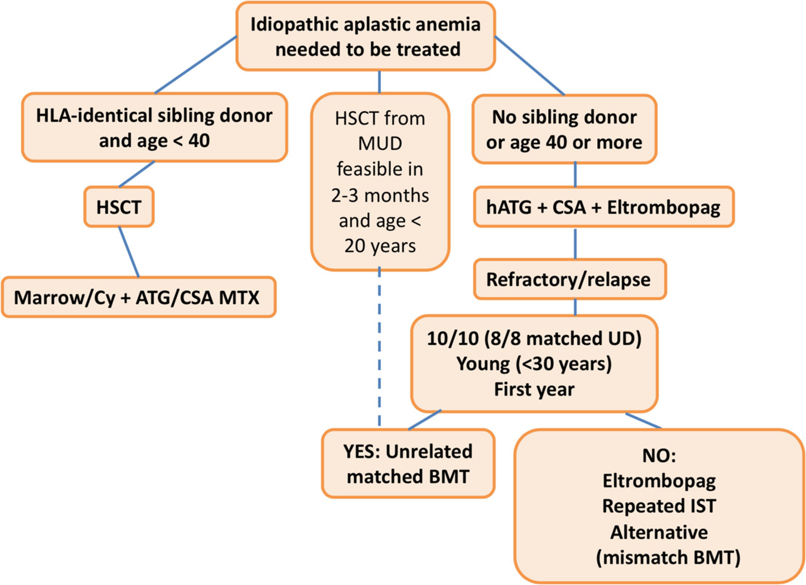

# Chapter 78. Acquired Bone Marrow Failure: Severe Aplastic Anemia and Paroxysmal Nocturnal Hemoglobinuria

> **Source:** Sureda A, Corbacioglu S, Greco R, Kröger N, Carreras E (eds). *The EBMT Handbook: Hematopoietic Cell Transplantation and Cellular Therapies*, 8th ed. Springer, Cham; 2024. pp. 707–715. https://doi.org/10.1007/978-3-031-44080-9_78  
> **Authors:** de Latour, Régis Peffault; Risitano, Antonio; Kulasekararaj, Austin; Dufour, Carlo  
>   - de Latour, Régis Peffault: French Reference Center for Aplastic Anemia and Paroxysmal Nocturnal Hemoglobinuria, Saint-Louis Hospital; Assistance Publique–Hôpitaux de Paris, Saint-Louis Hospital; University Paris Cité  
>   - Risitano, Antonio: Federico II University of Naples  
>   - Kulasekararaj, Austin: King’s College Hospital NHS Foundation Trust  
>   - Dufour, Carlo: Hematology Unit, IRCCS Istituto G. Gaslini Children Hospital  
> **License:** CC BY 4.0 (https://creativecommons.org/licenses/by/4.0/). Text reproduced verbatim from the open-access HTML edition; formatting converted to Markdown.

## Abstract

Severe aplastic anemia (SAA) is an autoimmune disorder due to the attack of autoreactive cytotoxic T lymphocytes to the hematopoietic component of the bone marrow. SAA might be associated with PNH, resulting from the clonal expansion of hematopoietic stem cells that have somatic mutations in the X-linked gene PIG-A. This review is summarizing the management of SAA from the diagnosis, where inherited disorders need to be excluded, to the overall treatment algorithm of this disease, including immunosuppression and bone marrow transplantation.

## 78.1 Definition and Epidemiology

Severe aplastic anemia (SAA) is an autoimmune disorder (AID) due to the attack of autoreactive cytotoxic T lymphocytes to the hematopoietic component of the bone marrow. The triggering antigen is so far unknown. The incidence of SAA is about 2–3/million in Europe and the United States and threefold higher in East Asia, with two age peaks of incidence (in young adults and in the elderly) (Young and Kaufman 2008).

Paroxysmal nocturnal hemoglobinuria (PNH) is another bone marrow failure syndrome (BMFS), which is often closely associated with SAA. PNH results from the clonal expansion of hematopoietic stem cells that have somatic mutations in the X-linked gene *PIG-A* (Takeda et al. 1993). *PIG-A* mutations cause an early block in the synthesis of glycosylphosphatidylinositol (GPI) anchors, which tether many proteins to the cell surface. Intravascular hemolysis is a prominent feature of PNH and is the consequence of the absence of the GPI-linked complement regulatory protein CD55 & CD59 (Motoyama et al. 1992). PNH includes hemolytic anemia but also thrombophilia in addition to bone marrow failure; thrombophilia represents the major cause of death in PNH patients (de Latour et al. 2008).

## 78.2 Diagnosis and Indication for Treatment for SAA

SAA is usually diagnosed in the setting of pancytopenia and a hypocellular BM. Diseases such as myelodysplasia, myelofibrosis, hypocellular acute leukemia, and inherited BMF (Fanconi’s anemia or Telomere Biology Diseases) need to be excluded. In this respect, wide scale genetic testing (targeted NGS panels or whole genome/exome sequencing) may help to identify undiagnosed constitutional bone marrow failure syndromes that may have a dismal outcome if transplanted with classical SAA conditioning regimens (McReynolds et al. 2022). Also, immunological screen was shown to detect immune deficiency and immune dysregulation disorder among a proportion of pediatric patients with apparently acquired AA (Miano et al. 2021) and should therefore be part of the diagnostic workup.

Cytogenetic abnormalities can be found in up to 10% of immune mediated SAA such as del(20q), +8, del13q and -Y (outside MDS defining cytogenetic abnormalities (Khoury et al. 2022; Hosokawa et al. 2012)). Somatic mutations might also be found in acquired aplastic anemia at diagnosis or during follow-up but are not informative if isolated and with low variant allele frequency (Peffault de Latour et al. 2022).

There is a close relationship between PNH and acquired SAA with a concomitant diagnosis in 40% of cases. SAA is diagnosed when marrow hematopoietic cellularity is \<30%, and two of three of the following criteria are met: absolute neutrophil count \<0.5 × 10⁹/L, absolute reticulocyte count \<60 × 10⁹/L, and platelet count \<20 × 10⁹/L (Camitta 1988).

Treatment requires careful planning and may be prolonged. A watch and wait strategy is often used initially if there is milder pancytopenia (e.g., moderate AA). Conversely, in case of transfusion requirement or if the criteria for SAA are met, treatment should begin with no delay. Prior to treatment the patient should be stable clinically with control of bleeding and infections. Once the diagnosis is confirmed, and the disease severity is assessed, family HLA-typing and matched unrelated donor search should be done in the work-up phase. In the absence of signs and symptoms of intravascular hemolysis, patient’s treatment algorithm is directed towards SAA despite the presence of PNH clones.

## 78.3 Treatment of SAA

### 78.3.1 First-Line Treatment for SAA

#### 78.3.1.1 Upfront Matched Sibling (MSD) Transplantation

The choice of first-line treatment depends on the age of the patient and the availability of an HLA matched sibling donor (MSD) (Fig. 78.1). The standard first-line treatments for a newly diagnosed patient with SAA are HCT from an HLA-identical sibling donor or immunosuppressive therapy (IST) using a combination of horse ATG and CSA (ATG + CSA). Early bone marrow HCT after a conditioning regimen with CY, ATG, and GVHD prophylaxis combining CSA and MTX promotes excellent engraftment (95%) and OS (90% at 2 years) (Bacigalupo et al. 2010; Peffault de Latour 2016). This approach enabled also a very good long-term outcome with a rather limited number of late effects like avascular necrosis, endocrine dysfunctions, and very rarely secondary malignancy (Konopacki et al. 2012). However, toxicity related to transplantation as well as increased risk of GvHD is still a problem for patients older than 40 years of age and for those with high comorbidity index (Marsh et al. 2011). Different studies have shown that best results are seen when ATG is included in the preparative regimen to prevent both GVHD and graft failure (due to the underlying immune-mediated pathophysiology of SAA) (Bacigalupo et al. 2010; Peffault de Latour 2016); low-dose TBI (200 cGy) may also help to reduce the risk of graft failure in older patients (Bacigalupo et al. 2010). The importance of a T-cell directed serotherapy in this setting was confirmed using alternative T-cell depleting agents as alemtuzumab (Marsh et al. 2011; Dufour et al. 2015a, b).

**Fig. 78.1**

Treatment algorithm of SAA in 2023

#### 78.3.1.2 Standard IST in Case a Sibling Donor Is Not Available

For these categories first-line immunosuppression is recommended. Many efforts to improve results of the standard treatment with horse ATG and CSA have failed since 40 years (Scheinberg and Young 2012). Excellent results obtained with eltrombopag in monotherapy in refractory patients prompted American colleagues from the NIH to test if the addition of eltrombopag to standard IST as the first treatment for SAA would have increased the rate of CR and improved the long-term outcome. In the best cohort (eltrombopag associated to ATG and CSA from day 1), complete and overall response rates at 6 months were 58% and 94%, respectively. After a median follow-up of 2 years, survival rate is 97% (Townsley et al. 2017). Rates of relapse and clonal evolution were similar to historical experience. The severe aplastic anemia working party of the EBMT ran an open-label, multicenter, randomized, phase 3 trial, to compare the efficacy and safety of horse ATG plus cyclosporine with or without eltrombopag as front-line therapy in previously untreated patients with severe aplastic anemia. The primary endpoint was reached with higher compete response at month 3 in the experimental arm. At 6 months, the overall response rate (the percentage of patients who had a complete or partial response) was 41% (ATG + CSA) and 68% (ATG + CSA + EPAG). The response was quicker with EPAG and more patients were transfusion independent. The safety was similar between both groups. The addition of eltrombopag to standard immunosuppressive therapy thus improved the rate, rapidity, and strength of hematologic response among previously untreated patients with severe aplastic anemia and should be considered as the new standard of care in those patients (Peffault de Latour et al. 2022).

#### 78.3.1.3 Upfront Matched Unrelated Donor (MUD) Transplantation

Although pediatric patients respond better to IST, the long-term risks of relapse, CSA dependence, and clonal evolution are high (Dufour et al. 2015a, b; Tichelli et al. 2020). UK investigators reported an excellent estimated 5-year FFS of 95% in 44 consecutive children who received a 10-antigen (HLA-A, HLA-B, HLA-C, HLA-DRB1, HLA-DQB1) MUD HCT; 40 of these children had previously failed IST. HCT conditioning was with FLU, CY, and campath (FCC) (Samarasinghe and Webb 2012). Because of those excellent results, upfront MUD HCT became an attractive first-line option in children. Between 2005 and 2014, a UK cohort of 29 consecutive children with idiopathic SAA received UD HCTs (including five patients with 1 Ag mismatched transplants) as first-line therapy after conditioning with FCC. Results were excellent, with OS and EFS of 96% and 92%, respectively, low GVHD rates, and only one death (from idiopathic pneumonia). This cohort was then compared with historical matched controls who had received (1) first-line MRD HCT, (2) first-line IST with horse ATG + CSA, and (3) MUD HCT post-IST failure as second-line therapy. Outcomes for the up-front unrelated cohort were similar to MRD HCT and superior to IST and UD HCT post-IST failure (Dufour et al. 2015a, b). Similar results were observed in another pediatric study (Choi et al. 2017). The SAAWP of the EBMT recently published positive results using this approach (Petit et al. 2022). A Recent North American comparative feasibility study showed that upfront MUD HCT is feasible in children with SAA and, although numbers were small, that the outcome is likely to be superior than that with ATG + CSA) (Pulsipher et al. 2020).

At the moment, if a 10/10 MUD is available and the transplant appears feasible within 2–3 months since diagnosis, this type of HCT has become a reasonable frontline option for young patients in many centers.

### 78.3.2 Second-Line Treatment for SAA

The choice of second-line treatment is also driven by age, comorbidities, and presence of a matched related (MRD) or unrelated donor (MUD):

- In older patients with a MRD and confirmed refractory SAA, HCT should be considered in the absence of significant comorbidities.

- In younger patients with SAA refractory to or relapsed after IST, if a MUD is available, HCT is recommended. Results of MUD HCT have improved to such an extent that OS of idiopathic SAA are not statistically inferior to MRD transplants (Dufour et al. 2015a, b). This improvement has been largely attributed to better donor selection through allele matching, progress in supportive care, prophylaxis of GVHD, incorporation of FLU in conditioning regimens, and the addition of low-dose TBI. Some factors were found to positively affect OS after MUD HCT including age ≤ 30 years, transplant within the first year after diagnosis (Devillier et al. 2016), use of BM vs PB, and CMV status (Dufour et al. 2015a, b).

- In retrospective trials of refractory SAA, monotherapy with eltrombopag, an oral thrombopoietin-receptor agonist, induced an overall response of 40% with trilineage responses in some cases (Olnes et al. 2012; Desmond et al. 2014) and might help even if the patients were already exposed to eltrombopag in front line. Androgens might also be useful and have been very recently revisited (Pagliuca et al. 2023).

### 78.3.3 Emerging Strategies for SAA: Alternative Donor Transplantation in SAA

Alternative HCTs (MMURD, CB, and haplo-family donors) are possible for individuals with no suitable MUD. Alternative HCTs may be curative, but the risks of graft rejection, infectious complications, and GVHD are higher than those for MRD or MUD HCT. Patient age, comorbidities, and alternative HCT specificities are thus important issues in the decision-making process. Age and comorbidities are the first barriers to this type of procedure. Most of the larger retrospective cohorts (\>50 patients) tend to mainly include pediatric patients. In historic studies, long-term OS of about 60% (Yagasaki et al. 2011; Peffault de Latour et al. 2011; Horan et al. 2012) compared to 5-year OS seen in refractory patients receiving only supportive care (Valdez et al. 2011). However, more recently, tremendous progress has been done. In pediatric patients refractory to IST, good results have been published using cord blood as source of stem cells (Peffault de Latour et al. 2018). The use of haplo-identical transplantation in patients with aplastic anemia has also improved drastically using T-cell replete grafts with the administration of post-transplantation cyclophosphamide. The Baltimore group recently published a confirmatory study on the use of PTCy in refractory/relapsed young patients (median age 24.9 years) with aplastic anemia in the context of haplo-identical donor (DeZern et al. 2022): (1) despite HLA barriers, cure rates for patients with acquired AA following HLA-haploidentical BMT using a non-myeloablative conditioning regimen and PTCy exceed 80% overall survival with low rates of GVHD and eventually low TRM, (2) the results were drastically improved by added anti-thymocyte globuline (2.5 mg/kg total dose) to the “classical” Baltimore protocol (Luznik et al. 2008), and (3) the recommended source of stem cells is bone marrow (over peripheral blood stem cells) due to the low incidence of GvHD with bone marrow grafts and the amount should be higher than (\>2.5 × 10⁸ nucleated marrow cells per kg of recipient ideal bodyweight). Promising results were also reported on behalf of the Severe Aplastic Anemia Working Party of the European Blood and Marrow Transplantation group on 36 patients (median age 42 years) transplanted between 2010 and 2017 with 1-year overall survival about 78% that peaks to 93% for those who received Baltimore-like protocol (Prata et al. 2020). More recently, a 3-year OS of 92% with 7% grade II–IV Ac GvHD and 4% cGvHD were achieved with the same protocol in 27 SAA patients transplanted front-line form haploidentical donors. In the subset of patients treated with higher TBI dose (400 cGy), OS and GRFS were 100% (DeZern et al. 2023). These results prompted our US colleagues to propose this approach upfront (first line) in young patients.

### 78.3.4 Supportive Care in SAA patients

The therapy of SAA is based not only on definitive modalities such as IST and HCT; indeed, even in case of excellent responses, hematological recovery is not expected to occur for 3–6 months after IST, and patients remain at high risk of disease-associated complications for a long time. They include obvious consequences of pancytopenia, such as bleeding and infections. Thus, prompt and effective strategies of supportive care are essential to prevent (or treat) such unavoidable complications. The highest attention needs to be focused towards prevention and treatment of infectious complications; indeed, it has been shown that most of the improved outcome of SAA patients (which includes also patients who do not respond to IST) is due to the availability of more effective anti-infectious treatments (especially against fungal infections) (Valdez et al. 2011).

## 78.4 Treatment of PNH

Clinical presentation of PNH is extremely heterogeneous, including a variable combination of bone marrow failure, hemolytic anemia, and thromboembolism (de Latour et al. 2008). These clinical manifestations may change during the disease course of each individual patient so that the treatment of PNH should target the specific clinical presentation.

The treatment of marrow failure in PNH parallels that of SAA, and it has been described above; indeed, the presence of a PNH clone does not change the treatment algorithm of SAA. Even in case of clinically meaningful clones that may account for concomitant hemolysis, the management of AA (either severe or moderate) should always be taken into account, even when a concomitant anticomplement treatment has been given or may be indicated (Pagliuca et al. 2018; Griffin et al. 2018). Transplantation in PNH should not be performed in case of thrombosis occurrence because of the high risk of toxicity. It might be of help in patients with hemolytic PNH when complement inhibition is not available and is part of the treatment in case of aplastic anemia (Peffault de Latour et al. 2012). Given the paucity of systematic studies, open questions remain in the field of HCT for PNH, starting with the best conditioning regimen (Marotta et al. 2014). Patients transplanted for a marrow failure, SAA-like regimens represent the best option, although busulphan-based myeloablative conditioning regimens have been used for PNH patients with normocellular/hypercellular marrow (Peffault de Latour et al. 2012; Raiola et al. 2000), as analternative to RIC (Takahashi et al. 2004). Since PNH, as SAA, is a nonmalignant disease and GvL is not needed for preventing disease recurrence, GVHD should be spared and thus strategies to prevent GVHD must be preferred.

Nevertheless, nowadays the room for HCT in PNH seems limited, since the treatment of complement-mediated hemolytic anemia and of thromboembolic PNH is based on complement inhibition through anti-C5 monoclonal antibodies. Eculizumab, the first in class anti-C5, has proven to be effective in inhibiting intravascular hemolysis of PNH, leading to hemoglobin stabilization and transfusion independency in about half of patients (Hillmen et al. 2006; Hillmen et al. 2007; Brodsky et al. 2008). This dramatic effect on intravascular hemolysis, eventually resulting in improved quality of life, is also associated with a significant reduction of the risk of thromboembolic complications (Hillmen et al. 2007). Notably, eculizumab treatment leads to a significant improvement of overall survival of PNH patients (Kelly et al. 2011; Loschi et al. 2016). The development of second-generation complement inhibitor began by the optimization of anti-C5 therapy, using long-acting monoclonal antibodies, ravulizumab. Ravulizumab is a derivative of eculizumab, with four amino acid substitutions, results in extended half-life. Given intravenously with eight-week dosing intervals, it was investigated in two large phase 3 studies enrolling untreated (Lee et al. 2019) or eculizumab-treated PNH patients (Kulasekararaj et al. 2019), respectively. Ravulizumab was shown to be non-inferior to eculizumab in terms of LDH change or normalization, transfusion avoidance, breakthrough hemolysis, hemoglobin stabilization and patient-reported outcomes and is now available on the market.

### 78.4.1 Emerging Strategies for PNH

The development of novel anti-complement agents exploits a new strategy of inhibition, which targets the early phases of complement activation aiming to address extravascular hemolysis (Risitano et al. 2009). The targets are (1) C3 with a pegylated peptide (pegcetacoplan), which block the access of the C3 to the convertases; (2) Factor D (FD) with danicopan, an oral complement FD inhibitor blocking the cleavage of complement Factor B and therefore the formation of functional C3 (and C5) convertase; (3) Factor B with iptacopan, an oral selective small molecule inhibitor of complement Factor B, which prevents its cleavage and therefore the formation of functional C3 (and C5) convertase.

The safety and efficacy of pegcetacoplan (anti-C3) were investigated in a phase III, open-label randomized study enrolling adult PNH patients with hemoglobin \<10.5 g/dL on eculizumab therapy At week 16, pegcetacoplan was superior to eculizumab in terms of hemoglobin change from baseline, with an adjusted mean treatment difference of 3.84 g/dL (*p* \< 0.0001). Transfusion avoidance was higher (85.4%, versus 15.4% in the pegcetacoplan and eculizumab arms, respectively), while noninferiority was demonstrated for the change in absolute reticulocyte count, but not for LDH. The safety profile was acceptable (Hillmen et al. 2021). These data have since been confirmed in the long-term analysis (48 weeks) (de Latour et al. 2022). The first-in-class factor D inhibitor, danicopan, is developed at the moment as an add-on treatment, in patients who respond poorly to eculizumab in aphase 3 randomized study (NCT04469465). Last but not least, factor B inhibitor iptacopan, an oral agent, which was investigated in an open-label phase two study enrolling 10 PNH patients with signs of active hemolysis on eculizumab treatment (Risitano et al. 2021). Eight out of the 10 patients achieved full normalization of hemoglobin level, with the mean hemoglobin level increasing from 9.77 ± 10.5 at baseline to 12.63 ± 1.85 g/dL at 13 weeks (*p* \< 0.001). Iptacopan is now being investigated in two large phase three multicenter trials enrolling PNH patients with suboptimal hematological response to standard-of-care anti-C5 treatment (NCT04558918) and in patients naive to complement inhibition (NCT04820530).

### Key Points

- SAA is usually diagnosed in the setting of pancytopenia and a hypocellular BM when other diseases, especially inherited BMF such as Fanconi’s anemia, telomere diseases, and immune deficiency/dysregulation have been excluded.

- The preferred treatment of SAA is HCT from HLA-identical sibling donor. Transplantation from a MUD may be considered for patients without a sibling donor after failure of IS therapy or up front in younger ≤20 years if feasible in 2–3 months since diagnosis.

- The association of ATG + CSA + Eltrombopag is now the new standard of care of patients with severe or very severe aplastic anemia who are not eligible for HCT.

- Alternative donor HCT, especially haplo-identical BMT improved tremendously in the recent years and is already considered as front-line treatment in pediatric patients by US authors.

## References

- Bacigalupo A, Socie G, Lanino E, et al. Fludarabine, cyclophosphamide, antithymocyte globulin, with or without low dose total body irradiation, for alternative donor transplants, in acquired severe aplastic anemia: a retrospective study from the EBMT-SAA Working Party. Haematologica. 2010;95(6):976–82.

- Brodsky RA, Young NS, Antonioli E, et al. Multicenter phase 3 study of the complement inhibitor eculizumab for the treatment of patients with paroxysmal nocturnal hemoglobinuria. Blood. 2008;111(4):1840–7.

- Camitta BM. Criteria for severe aplastic anaemia. Lancet. 1988;1(8580):303–4.

- Choi YB, Yi ES, Lee JW, et al. Immunosuppressive therapy versus alternative donor hematopoietic stem cell transplantation for children with severe aplastic anemia who lack an HLA-matched familial donor. Bone Marrow Transplant. 2017;52(1):47–52.

- de Latour RP, Mary JY, Salanoubat C, et al. Paroxysmal nocturnal hemoglobinuria: natural history of disease subcategories. Blood. 2008;112(8):3099–106.

- de Latour RP, Szer J, Weitz IC, et al. Pegcetacoplan versus eculizumab in patients with paroxysmal nocturnal haemoglobinuria (PEGASUS): 48-week follow-up of a randomised, open-label, phase 3, active-comparator, controlled trial. Lancet Haematol. 2022;9(9):e648–59.

- Desmond R, Townsley DM, Dumitriu B, et al. Eltrombopag restores trilineage hematopoiesis in refractory severe aplastic anemia that can be sustained on discontinuation of drug. Blood. 2014;123(12):1818–25.

- Devillier R, Dalle JH, Kulasekararaj A, et al. Unrelated alternative donor transplantation for severe acquired aplastic anemia: a study from the French Society of Bone Marrow Transplantation and Cell Therapies and the EBMT Severe Aplastic Anemia Working Party. Haematologica. 2016;101(7):884–90.

- DeZern A, Zahurak ML, Symons HJ, et al. Alternative donor BMT with post-transplant cyclophosphamide as initial therapy for acquired severe aplastic anemia. Blood. 2023;141(25):3031–8.

- DeZern AE, Eapen M, Wu J, et al. Haploidentical bone marrow transplantation in patients with relapsed or refractory severe aplastic anaemia in the USA (BMT CTN 1502): a multicentre, single-arm, phase 2 trial. Lancet Haematol. 2022;9(9):e660–9.

- Dufour C, Pillon M, Sociè G, et al. Outcome of aplastic anaemia in children. A study by the severe aplastic anaemia and paediatric disease working parties of the European group blood and bone marrow transplant. Br J Haematol. 2015b;169(4):565–73.

- Dufour C, Veys P, Carraro E, et al. Similar outcome of upfront-unrelated and matched sibling stem cell transplantation in idiopathic paediatric aplastic anaemia. A study on behalf of the UK Paediatric BMT Working Party, Paediatric Diseases Working Party and Severe Aplastic Anaemia Working Party of EBMT. Br J Haematol. 2015a;171(4):585–94.

- Griffin M, Kulasekararaj A, Gandhi S, et al. Concurrent treatment of aplastic anemia/paroxysmal nocturnal hemoglobinuria syndrome with immunosuppressive therapy and eculizumab: a UK experience. Haematologica. 2018;103(8):e345–7.

- Hillmen P, Muus P, Dührsen U, et al. Effect of the complement inhibitor eculizumab on thromboembolism in patients with paroxysmal nocturnal hemoglobinuria. Blood. 2007;110(12):4123–8.

- Hillmen P, Szer J, Weitz I, et al. Pegcetacoplan versus Eculizumab in paroxysmal nocturnal hemoglobinuria. N Engl J Med. 2021;384(11):1028–37.

- Hillmen P, Young NS, Schubert J, et al. The complement inhibitor eculizumab in paroxysmal nocturnal hemoglobinuria. N Engl J Med. 2006;355(12):1233–43.

- Horan J, Wang T, Haagenson M, et al. Evaluation of HLA matching in unrelated hematopoietic stem cell transplantation for nonmalignant disorders. Blood. 2012;120(14):2918–24.

- Hosokawa K, Katagiri T, Sugimori N, et al. Favorable outcome of patients who have 13q deletion: a suggestion for revision of the WHO “MDS-U” designation. Haematologica. 2012;97(12):1845–9.

- Kelly RJ, Hill A, Arnold LM, et al. Long-term treatment with eculizumab in paroxysmal nocturnal hemoglobinuria: sustained efficacy and improved survival. Blood. 2011;117(25):6786–92.

- Khoury JD, Solary E, Abla O, et al. The 5th edition of the World Health Organization classification of haematolymphoid tumours: myeloid and histiocytic/dendritic neoplasms. Leukemia. 2022;36(7):1703–19.

- Konopacki J, Porcher R, Robin M, et al. Long-term follow up after allogeneic stem cell transplantation in patients with severe aplastic anemia after cyclophosphamide plus antithymocyte globulin conditioning. Haematologica. 2012;97(5):710–6.

- Kulasekararaj AG, Hill A, Rottinghaus ST, et al. Ravulizumab (ALXN1210) vs eculizumab in C5-inhibitor-experienced adult patients with PNH: the 302 study. Blood. 2019;133(6):540–9.

- Lee JW, Sicre de Fontbrune F, Wong Lee Lee L, et al. Ravulizumab (ALXN1210) vs eculizumab in adult patients with PNH naive to complement inhibitors: the 301 study. Blood. 2019;133(6):530–9.

- Loschi M, Porcher R, Barraco F, et al. Impact of eculizumab treatment on paroxysmal nocturnal hemoglobinuria: a treatment versus no-treatment study. Am J Hematol. 2016;91(4):366–70.

- Luznik L, O’Donnell PV, Symons HJ, et al. HLA-haploidentical bone marrow transplantation for hematologic malignancies using nonmyeloablative conditioning and high-dose, posttransplantation cyclophosphamide. Biol Blood Marrow Transplant. 2008;14(6):641–50.

- Marotta S, Pagliuca S, Risitano AM. Hematopoietic stem cell transplantation for aplastic anemia and paroxysmal nocturnal hemoglobinuria: current evidence and recommendations. Expert Rev Hematol. 2014;7(6):775–89.

- Marsh JC, Gupta V, Lim Z, et al. Alemtuzumab with fludarabine and cyclophosphamide reduces chronic graft-versus-host disease after allogeneic stem cell transplantation for acquired aplastic anemia. Blood. 2011;118(8):2351–7.

- McReynolds LJ, Rafati M, Wang Y, et al. Genetic testing in severe aplastic anemia is required for optimal hematopoietic cell transplant outcomes. Blood. 2022;140(8):909–21.

- Miano M, Grossi A, Dell’Orso G, et al. Genetic screening of children with marrow failure. The role of primary immunodeficiencies. Am J Hematol. 2021;96(9):1077–86.

- Motoyama N, Okada N, Yamashina M, et al. Paroxysmal nocturnal hemoglobinuria due to hereditary nucleotide deletion in the HRF20 (CD59) gene. Eur J Immunol. 1992;22(10):2669–73.

- Olnes MJ, Scheinberg P, Calvo KR, et al. Eltrombopag and improved hematopoiesis in refractory aplastic anemia. N Engl J Med. 2012;367(1):11–9.

- Pagliuca S, Kulasekararaj AG, Eikema DJ, et al. Current use of androgens in bone marrow failure disorders: a report from the Severe Aplastic Anemia Working Party of the European Society of Blood and Marrow Transplantation. Haematologica. 2023; https://doi.org/10.3324/haematol.2023.282935.

- Pagliuca S, Risitano AM, De Fontbrune FS, et al. Combined intensive immunosuppression and eculizumab for aplastic anemia in the context of hemolytic paroxysmal nocturnal hemoglobinuria: a retrospective analysis. Bone Marrow Transplant. 2018;53(1):105–7.

- Peffault de Latour R. Transplantation for bone marrow failure: current issues. Hematology Am Soc Hematol Educ Program. 2016;2016(1):90–8.

- Peffault de Latour R, Chevret S, Jubert C, et al. Unrelated cord blood transplantation in patients with idiopathic refractory severe aplastic anemia: a nationwide phase 2 study. Blood. 2018;132(7):750–4.

- Peffault de Latour R, Kulasekararaj A, Iacobelli S, et al. Eltrombopag added to immunosuppression in severe aplastic anemia. N Engl J Med. 2022;386(1):11–23.

- Peffault de Latour R, Purtill D, Ruggeri A, et al. Influence of nucleated cell dose on overall survival of unrelated cord blood transplantation for patients with severe acquired aplastic anemia: a study by eurocord and the aplastic anemia working party of the European group for blood and marrow transplantation. Biol Blood Marrow Transplant. 2011;17(1):78–85.

- Peffault de Latour R, Schrezenmeier H, Bacigalupo A, et al. Allogeneic stem cell transplantation in paroxysmal nocturnal hemoglobinuria. Haematologica. 2012;97(11):1666–73.

- Petit AF, Kulasekararaj AG, Eikema DJ, et al. Upfront unrelated donor hematopoietic stem cell transplantation in patients with idiopathic aplastic anemia: a retrospective study of the Severe Aplastic Anemia Working Party of European Bone Marrow Transplantation. Am J Hematol. 2022;97(1):E1–3.

- Prata PH, Eikema DJ, Afansyev B, et al. Haploidentical transplantation and posttransplant cyclophosphamide for treating aplastic anemia patients: a report from the EBMT Severe Aplastic Anemia Working Party. Bone Marrow Transplant. 2020;55(6):1050–8.

- Pulsipher MA, Lehmann LE, Bertuch AA, et al. A study assessing the feasibility of randomization of pediatric and young adult patients between matched unrelated donor bone marrow transplantation and immune-suppressive therapy for newly diagnosed severe aplastic anemia: a joint pilot trial of the North American Pediatric Aplastic Anemia Consortium and the Pediatric Transplantation and Cellular Therapy Consortium. Pediatr Blood Cancer. 2020;67(10):e28444.

- Raiola AM, Van Lint MT, Lamparelli T, et al. Bone marrow transplantation for paroxysmal nocturnal hemoglobinuria. Haematologica. 2000;85(1):59–62.

- Risitano AM, Notaro R, Marando L, et al. Complement fraction 3 binding on erythrocytes as additional mechanism of disease in paroxysmal nocturnal hemoglobinuria patients treated by eculizumab. Blood. 2009;113(17):4094–100.

- Risitano AM, Röth A, Soret J, et al. Addition of iptacopan, an oral factor B inhibitor, to eculizumab in patients with paroxysmal nocturnal haemoglobinuria and active haemolysis: an open-label, single-arm, phase 2, proof-of-concept trial. Lancet Haematol. 2021;8(5):e344–54.

- Samarasinghe S, Webb DKH. How I manage aplastic anaemia in children. Br J Haematol. 2012;157(1):26–40.

- Scheinberg P, Young NS. How I treat acquired aplastic anemia. Blood. 2012;120(6):1185–96.

- Takahashi Y, McCoy JP Jr, Carvallo C, et al. In vitro and in vivo evidence of PNH cell sensitivity to immune attack after nonmyeloablative allogeneic hematopoietic cell transplantation. Blood. 2004;103:1383–9.

- Takeda J, Miyata T, Kawagoe K, et al. Deficiency of the GPI anchor caused by a somatic mutation of the PIG-A gene in paroxysmal nocturnal hemoglobinuria. Cell. 1993;73(4):703–11.

- Tichelli A, de Latour RP, Passweg J, et al. Long-term outcome of a randomized controlled study in patients with newly diagnosed severe aplastic anemia treated with antithymocyte globulin and cyclosporine, with or without granulocyte colony-stimulating factor: a Severe Aplastic Anemia Working Party Trial from the European Group of Blood and Marrow Transplantation. Haematologica. 2020;105(5):1223–31.

- Townsley DM, Scheinberg P, Winkler T, et al. Eltrombopag added to standard immunosuppression for aplastic anemia. N Engl J Med. 2017;376(16):1540–50.

- Valdez JM, Scheinberg P, Nunez O, et al. Decreased infection-related mortality and improved survival in severe aplastic anemia in the past two decades. Clin Infect Dis. 2011;52(6):726–35.

- Yagasaki H, Kojima S, Yabe H, et al. Acceptable HLA-mismatching in unrelated donor bone marrow transplantation for patients with acquired severe aplastic anemia. Blood. 2011;118(11):3186–90.

- Young NS, Kaufman DW. The epidemiology of acquired aplastic anemia. Haematologica. 2008;93(4):489–92.
