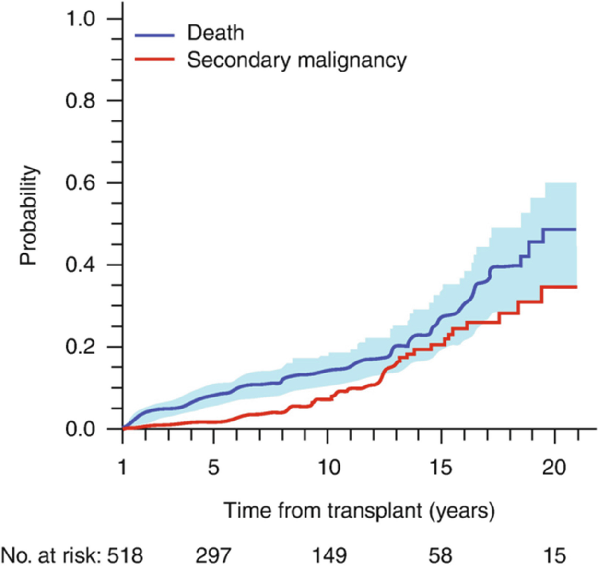

# Chapter 79. Fanconi Anemia and Other Hereditary Bone Marrow Failure Syndromes

> **Source:** Sureda A, Corbacioglu S, Greco R, Kröger N, Carreras E (eds). *The EBMT Handbook: Hematopoietic Cell Transplantation and Cellular Therapies*, 8th ed. Springer, Cham; 2024. pp. 717–724. https://doi.org/10.1007/978-3-031-44080-9_79  
> **Authors:** Diaz-de-Heredia, Cristina; Bierings, Marc; Dalle, Jean-Hugues; Fioredda, Francesca; Strahm, Brigitte  
>   - Diaz-de-Heredia, Cristina: Hospital Universitari Vall d’Hebron  
>   - Bierings, Marc: Princess Maxima Centre for Pediatric Oncology and University Children’s Hospital, Wilhelmina Kinderziekenhuis  
>   - Dalle, Jean-Hugues: HCT Programme, Hemato Immunology Department, Hôpital Robert Debré GHU APHP Nord—Université Paris Cité  
>   - Fioredda, Francesca: Hematology Unit, IRCCS, Istituto Giannina Gaslini  
>   - Strahm, Brigitte: Medical Center and Faculty of Medicine, University of Freiburg  
> **License:** CC BY 4.0 (https://creativecommons.org/licenses/by/4.0/). Text reproduced verbatim from the open-access HTML edition; formatting converted to Markdown.

## Abstract

Inherited bone marrow failure syndromes (IBMFS) are a heterogeneous group of rare blood disorders due to hematopoiesis impairment, with different clinical presentations and pathogenic mechanisms. Some patients present with congenital malformations, may progress through clonal evolution (myelodisplasia, MDS and acute leukemia, AL) and are at risk for solid tumors at early ages. With the rapid evolution of diagnostic accuracy, the number of identified genetic defects rises annually. HCT is a curative treatment for these congenital disorders. However, it should be well understood that it will only correct the hematopoietic deficiency and will not cure the congenital malformations or reduce the risk of solid tumors. Moreover, HCT per se may increase this risk additionally. Consequently, the decision to transplant a patient should be taken by a multidisciplinary team. HCT must be performed at specialized centers owing to patient susceptibilities to toxicity and the need for specific management during and after the procedure. The general recommendations for management of IBMFS are included in the key points at the end of the chapter.

## 79.1 Introduction

Inherited bone marrow failure syndromes (IBMFS) are a heterogeneous group of rare blood disorders due to hematopoiesis impairment, with different clinical presentations and pathogenic mechanisms. Some patients present with congenital malformations, may progress through clonal evolution (myelodisplasia, MDS and acute leukemia, AL) and are at risk for solid tumors at early ages. With the rapid evolution of diagnostic accuracy, the number of identified genetic defects rises annually. HCT is a curative treatment for these congenital disorders. However, it should be well understood that it will only correct the hematopoietic deficiency and will not cure the congenital malformations or reduce the risk of solid tumors. Moreover, HCT per se may increase this risk additionally. Consequently, the decision to transplant a patient should be taken by a multidisciplinary team. HCT must be performed at specialized centers owing to patient susceptibilities to toxicity and the need for specific management during and after the procedure. The general recommendations for management of IBMFS are included in the key points at the end of the chapter.

## 79.2 Fanconi Anemia

### 79.2.1 Pathogenesis and Principal Clinical Features

Fanconi anemia (FA) is the most common IBMFS with an estimated incidence of 1/200,000. FA is a disorder of DNA damage repair, leading to increased chromosomal breakage in diagnostic assays. At least twenty-three underlying genes have been identified. The presentation is variable with somatic abnormalities in 70% of patients, marrow failure, and a highly increased risk of malignancies (MDS, leukemia, head and neck cancer, gynecological cancers) at an early age. The diagnosis can be delayed into adulthood, e.g., in cases of (familial) pancytopenia, myelodysplasia, head, and neck cancer at young age or unexpected severe toxicity of treatment. FA patients are highly susceptible to alkylating agent-based chemotherapy and irradiation-induced damage such as mucositis and bowel toxicity.

### 79.2.2 Indications of HCT

Indications for transplant include marrow failure (transfusion dependency or severe neutropenia) and myelodysplasia/leukemia. Since transplantation implies exposure to chemo/radiotherapy and since the outcome is dependent on age at transplant, the decision to proceed to transplant should be individualized and discussed with experts in the field trying to intercept the most appropriate time.

### 79.2.3 Specific Considerations for Conditioning Regimen

Conditioning regimens should be adapted for FA patients, with reduced doses of many cytotoxic drugs and irradiation. Current conditioning regimens generally contain FLU (cumulative dose 150 mg/m²), in combination with reduced doses of CY (up to 50 mg/kg cumulative) and/or low-dose TBI (100–300 cGy) in the case of unrelated donors. For adults no clear recommendations can be given at this point. Patients with MDS with excess of blasts, overt AML, or BRCA2/FANCD1 patients may benefit from pre-HCT cytoreduction with fludarabine and cytarabine; however, it is very important to secure a donor before starting chemotherapy given the risk of prolonged chemotherapy-associated aplasia.

### 79.2.4 Results

Current results of transplant for marrow failure in children with FA show survival rates depending on donor type ranging from 50% to more than 90%. Factors influencing outcome include age at transplant, MSD availability, and the use of FLU in the conditioning regimen. An EBMT study of the period 2000–2009 reported 78% and 65% OS at 5-year post-transplant for MSD and MUD, respectively.

Eight hundred and thirteen patients patients under 18 years from the EBMT data registry were reported at ASH 2022. Ninety one percent of patients received a first HCT for marrow failure whereas 9% for either MDS or AML. Eighty three percent received FLU-based conditioning regimen, 87% any type of serotherapy, and 88% did not receive any irradiation. 5y-OS was 83%, statistically better for those transplanted from either MSD or MUD compared to those transplanted from MMUD or haploidentical donor. Being transplanted for MDS/AML dramatically worsened OS 40% vs. 85% for those transplanted for AA. Clonal disease and adult age at transplant remain a challenge. Both TRM and relapse of malignant disease contribute to these generally poor results.

### 79.2.5 Recommendations for Long-Term Follow-Up

After transplant, the risk of secondary malignancies is high (Fig. 79.1). Patients should be carefully monitored for head-neck malignancies (regular ear, nose, mouth, and throat specialist checks for early signs of malignant transformation, and women undergo gynecological checkups and screening for breast cancer with ultrasound and MRI) and other manifestations of FA (e.g., endocrinopathies such as thyroid dysfunction, diabetes, growth problems, and early menopause). As more FA patients survive into adulthood, specialist multidisciplinary teams taking care of these complex patients are needed.

**Fig. 79.1**

Fanconi’s anemia: probability of death and secondary malignancies post transplant. The EBMT experience. Peffault de Latour R. Blood 2013; 122: 4279–86

Due to the increased risk of both head and neck and perineal secondary cancers, vaccination against human papilloma virus is strongly recommended.

## 79.3 Telomere Disorders

### 79.3.1 Pathogenesis and Principal Clinical Features

Telomere disorders are multisystemic disorders. The classic example being dyskeratosis congenita (DC), characterized by the triad of nail dystrophy, skin pigment alteration, and oral leukoplakia, is frequently associated with bone marrow failure and organ involvement (pulmonary fibrosis, liver, neurological and gastrointestinal abnormalities, ocular impairment, and cancer predisposition). The causative mechanism of the disease is abnormal telomere shortening due to a defect in one of the genes encoding for the telomerase-shelterin complex. Bone marrow failure is the main cause of death, although pulmonary fibrosis, liver cirrhosis, and cancer significantly contribute to morbidity and mortality. Androgens have shown some effect on hematopoiesis and lung function.

### 79.3.2 Indications for Transplant

HCT is the only curative option for bone marrow failure in DC. Organ dysfunction is not corrected by HCT and limits its indication by negatively affecting outcome. HCT is not indicated as a preemptive measure but is recommended in cases of progressive marrow failure without significant organ dysfunction.

### 79.3.3 Specific Considerations for Donor Selection and Conditioning Regimen

MSD are the donors of choice when familial genetic study is available and demonstrated the donor is not affected; MUD and mismatched related donors are associated with inferior outcomes. Given tissue “fragility,” a reduced intensity combination containing fludarabine would be preferable to a myeloablative regimen. A thorough evaluation of organ status is recommended prior to transplant.

### 79.3.4 Results

Five- and 10-year survival is 57% and 23%, respectively. Age \> 20 years at HCT, HCT before 2000 and alternative donor transplant were poor prognostic markers. Patients transplanted after 2000 had improved early survival to 70% at 5-year post transplant. However, medium- and long-time follow-up still remain poor. One of the unsolved caveats is the lack of a clear genotype–phenotype association. In fact, it is possible that some telomeropathies are associated with a good outcome after HCT, while others are associated with poor survival, regardless of the type of transplantation.

### 79.3.5 Specific Recommendations for Long-Term Follow-Up

Since HCT may increase the risk of secondary malignancies in these patients, long-term follow-up is mandatory.

## 79.4 Severe Congenital Neutropenia and Shwachman-Diamond Syndrome

### 79.4.1 Pathogenesis and Principal Clinical Features

The term “severe congenital neutropenia” (SCN) covers a group of inherited disorders characterized by a persistent absolute neutrophil count (ANC) below 0.5 × 10⁹/L and early onset of severe infections. To date, more than 30 distinct genes have been associated with SCN, which may manifest as an isolated disorder or associated with various extra-hematologic features. The most common form (60%) of genetic neutropenia, at least in the Western registries, is due to mutations in the *ELANE* gene. Shwachman Diamond syndrome (SDS) caused by a biallelic pathogenic variants in the *SBDS* gene is the most common form of neutropenia associated with extra-hematologic features (exocrine pancreas deficiency, metaphyseal dysplasia, mental retardation, cardiomyopathy, and immune dysfunction).

The underlying pathogenic mechanism of most genetic SCN is accelerated apoptosis of promyelocytes causing blockage of neutrophil maturation. In SDS, the defect in the SBDS protein causes abnormal ribosomal assembly and inadequate maintenance of the stromal microenvironment.

The SCN clinical phenotype consists of predisposition to severe infections. The use of granulocyte colony-stimulating factor (G-CSF) improved the prognosis of the disease, which had been lethal in almost 50% of cases. The aim of treatment is to maintain protective neutrophil values (between 1.0 and 5.0 × 10⁹/L) that are usually achieved with G-CSF doses of 3–5 μg/kg/day. Patients requiring G-CSF between 10 and 15 μg/kg/day are defined as “poor responders,” whereas those requiring \>20 μg/kg/day are considered “non-responders.”

Another feature of SCN and SDS is its tendency to transform into MDS/AML. The overall cumulative incidence of MDS/AML is 10.8% and 22% after 15 and 20 years of G-CSF treatment according to the French and International Severe Chronic Neutropenia Registries, respectively. In SDS, the cumulative incidence is between 18% and 36% at 20 and 30 years.

### 79.4.2 Indications for Transplant

The definitive cure of the hematologic defect is HCT. For SCN, established indications are patients with absent or poor response to G-CSF and MDS/AML. However, given the long-term dependency to G-CSF, HCT for children \<10 years old with a healthy MSD may be considered. For SDS, the indications for transplant are worsening cytopenias with increased transfusion dependence and transformation into MDS/AML. However, given the very poor prognosis of SDS patients with leukemia, HCT should be performed before leukemia is established in patients with unfavorable cytogenetics or MDS.

### 79.4.3 Specific Considerations for Conditioning Regimen

A MAC regimen is considered appropriate in SCN, while a RIC is recommended in SDS owing to possible secondary organ dysfunction (e.g., heart disease). In patients with MDS/AML, the safety of a chemotherapy-based myeloablative conditioning should be evaluated case by case. Cytoreductive chemotherapy before HCT is an option, although its efficacy is in debate.

### 79.4.4 Results

For SCN patients, an EBMT study reported a 5-year post transplant OS of 82% with TRM of 17% in the largest cohort (136 patients) described. Better results were obtained in patients under 10 years of age, in those transplanted after 2000 and in cases of MSD transplants. For SDS in another study from the EBMT the OS at 5-year post transplant was 63.3%, and the TRM was 19.8%.

## 79.5 Diamond-Blackfan Anemia

### 79.5.1 Pathogenesis and Principal Clinical Features

Diamond-Blackfan anemia (DBA) is a rare IBMFS mainly caused by heterozygous mutations in ribosomal genes. No genetic aberration is identified in approximately 30% of patients. Patients usually present with transfusion-dependent macrocytic anemia at birth or in early infancy. Mild neutropenia and progressive thrombocytopenia have been observed in the course of the disease. Despite various possible physical abnormalities (short stature, abnormal thumbs, cleft palate, heart defects, and urogenital malformations), the nonhematologic phenotype is usually rather subtle in around 50% of patients. Patients with DBA are at increased risk of developing hematologic (AML/MDS) and nonhematologic malignancies (osteosarcoma, colon cancer).

After the first year of life, at least two trials of steroid therapy are recommended; around 60% of the patients are responders. Patients \<12 months of age or those who are steroid nonresponders are treated with red blood cell (RBC) transfusions. Iron chelation is essential to prevent organ damage from iron overload. About 20% of patients become transfusion independent with no further treatment (spontaneous remission).

### 79.5.2 Indications for Transplant

HCT is the only cure for hematologic manifestations. Indications are nonresponse to steroids, steroid dependency at a dose ≥0.3 mg/kg/day, transfusion dependency, alloimmunization to RBC, progressive pancytopenia, or MDS/AML. Published data indicate that HCT should be performed before the age of 10 years; however, an earlier time point might be preferable to avoid iron overload. Indications must be evaluated taking into account the alternative approach with RBC transfusions combined with rigorous iron chelation.

### 79.5.3 Specific Considerations for Donor Selection and Conditioning Regimen

HCT from a MSD including cord blood has resulted in OS \>80% and is recommended for all indications. Sibling donors should be carefully assessed to rule out silent carrier status. Recent reports have described no differences in terms of survival between sibling and MUD transplants, although GVHD was higher in MUD transplants. By contrast, data supporting HCT from mismatched donors as standard procedure are scarce.

The majority of transplants reported were performed with myeloablative conditioning. Based on available data, a standard regimen including FLU and BU or TREO is recommended. ATG/ATLG has been used in multiply transfused patients transplanted from MSD and MUD with excellent engraftment rates.

### 79.5.4 Results

In children aged \<10 years outcomes are comparable for HCT performed using MSD and MUD. A study of DBA patients registered in Germany and France reported a cGFS of 90% for patients \<10 years and of 78% for those aged 10–18 years. Lower OS and higher TRM have been reported in patients with higher ferritin levels as a marker of iron overload.

### 79.5.5 Specific Recommendations for Long-Term Follow-Up

Long-term care for patients being transplanted for DBA should focus on the management of iron overload. Depending on its extent, phlebotomies, and/or iron chelation therapy might be indicated. Furthermore, patients and physicians should be aware of the increased risk of malignancies (especially osteosarcoma and colon cancer).

## 79.6 Congenital Amegakaryocytic Thrombocytopenia

### 79.6.1 Pathogenesis and Principal Clinical Features

Congenital amegakaryocytic thrombocytopenia (CAMT) is a rare IBMFS caused by mutations in the gene coding for the thrombopoietin receptor *MPL.* Patients usually present with thrombocytopenia at birth or within the first year of life. Most patients develop hypocellular bone marrow and progress to pancytopenia early in the course of disease. Clonal evolution with acquired chromosomal aberrations and the development of myelodysplastic syndromes are very rare events. Characteristic nonhematologic manifestations of the disease have not been described.

### 79.6.2 Indications for Transplant

HCT is the only curative treatment and should be offered to all patients with transfusion-dependent thrombocytopenia, pancytopenia, or clonal evolution.

### 79.6.3 Specific Considerations for Donor Selection and Conditioning Regimen

HCT from an MSD is the preferred option, and successful transplants from heterozygous-related donors have been reported. HCT from MUD (≥9/10) is an acceptable alternative. Successful HCT from mismatched family donors or mismatched unrelated cord blood donors have been reported: these should preferentially be performed in clinical trials or experienced centers.

In view of a considerable graft failure rate, a MAC with FLU in combination with TREO or BU is preferred. There have been reports of successful engraftment after a RIC, and this might be considered in cases with severely hypocellular bone marrow in the absence of clonal aberrations and alloimmunization to platelet transfusions.

### 79.6.4 Results

Five-year OS was 77% with TRM of 12.6% in a retrospective EBMT study. However, this series included HCT performed over a period of 26 years with a variety of donors, regimens, and stem cell sources, with no difference in outcome.

These results were updated for ASH annual meeting in 2022 and demonstrated a 6-year OS of 85.6% with a transplant-related mortality of 8.0%. GVHD/graft failure-free survival was 65.7% at 6 years. 6-year OS was significantly lower after cord blood (37.5%) than after BM ( 95%) or PB (88.9%) (*p* \< 0.001).

### Key Points

<table>
<tbody>
<tr>
<td>
Patient
</td>
<td>
Evaluate carefully hematologic and extra-hematologic manifestations of the disease prior to transplant
</td>
</tr>
<tr>
<td>
Donor
</td>
<td>
The best donor is MSD; however, it is mandatory to test the genetic defect in the donor since some IBMFS may present different clinical and hematologic expression in members of the same family

Consider MUD in case of no appropriate MSD

Mismatched related and UD and unrelated CB only in experienced centers and preferentially in clinical trials
</td>
</tr>
<tr>
<td>
Source of stem cells
</td>
<td>
BM is the best source of stem cells

Matched related CB is a good option

PB is associated with higher risk of cGVHD and should be avoided
</td>
</tr>
<tr>
<td>
Cell dose
</td>
<td>
It is important for graft failure prevention:

NC &gt; 3 × 108/kg recipient bw for BM

NC &gt; 3 × 107/kg recipient bw for related CB

NC &gt; 4 × 107/kg recipient bw for unrelated CB
</td>
</tr>
<tr>
<td>
Conditioning regimen
</td>
<td>
MAC or RIC depending on the type of IBMF

Irradiation should be avoided owing to the known risk of cancer

Patients with Fanconi’s anemia and dyskeratosis congenita must receive a RIC
</td>
</tr>
<tr>
<td>
GVHD prophylaxis
</td>
<td>
GVHD must be avoided

Include two immunosuppressive drugs

Serotherapy for UD transplants
</td>
</tr>
<tr>
<td>
Long-term follow-up
</td>
<td>
It is mandatory owing to high risk of secondary malignancies, extra-hematologic manifestations, and iron overload

Patients should be followed-up by a multidisciplinary team
</td>
</tr>
</tbody>
</table>

## Further Reading

- Ayas M, Saber W, Davies SM, et al. Allogeneic hematopoietic stem cell transplantation for Fanconi anemia in patients with pre-transplantation cytogenetic abnormalities, myelodysplastic syndrome or acute leukemia. J Clin Oncol. 2013;31:1669–76.

- Ballmaier M, Germeshausen M. Congenital amegakaryocytic thrombocytopenia: clinical presentation, diagnosis, and treatment. Semin Thromb Hemost. 2011;37:673–81.

- Barbaro P, Vedi A. Survival after hematopoietic stem cell transplant in patients with dyskeratosis congenita: a systematic review of the literature. Biol Blood Marrow Transplant. 2016;22:1152–8.

- Benajiba L, Salvado C, Dalle JH, et al. HLA-matched related donor HSCT in Fanconi anemia patients conditioned with cyclophosphamide and fludarabine. Blood. 2015;125:417–8.

- Bizzetto R, Bonfim C, Rocha V, et al. Outcomes after related and unrelated umbilical cord blood transplantation for hereditary bone marrow failure syndromes other than Fanconi anemia. Haematologica. 2011;96:134–41.

- Cesaro S, Pillon M, Sauer M, et al. Long-term outcome after allogeneic hematopoietic stem cell transplantation for Shwachman-Diamond Syndrome: a retrospective analysis and a review of the literature by the Severe Aplastic Anemia Working Party of the European Society for Blood and Marrow Transplantation (SAAWP-EBMT). Bone Marrow Transplant. 2020;55:1796–809.

- Cesaro S, Donadieu J, Cipolli M, et al. Stem cell transplantation in patients affected by shwachman-diamond syndrome: expert consensus and recommendations from the EBMT Severe Aplastic Anaemia Working Party. Transplant Cell Ther. 2022;28:637–49.

- Dalle JH, Fahd M, et al. Allogeneic stem cell transplantation in amegacaryocytosis: results of a retrospective study in EBMT centers. Biol Blood Marrow Transplant. 2014;20:S81–2.

- Diaz de Heredia C, Bresters D, Faulkner L, et al. Recommendations on hematopoietic stem cell transplantation for patients with Diamond–Blackfan anemia. On behalf of the Pediatric Diseases and Severe Aplastic Anemia Working Parties of the EBMT. Bone Marrow Transplant. 2021;56:2956–63.

- Donadieu J, Fenneteau O, Beaupain B, et al. Classification of and risk factors for hematologic complications in a French national cohort of 102 patients with Shwachman-Diamond syndrome. Haematologica. 2012;97:1312–9.

- Donadieu J, Beaupain B, Fenneteau O, et al. Congenital neutropenia in the era of genomics: classification, diagnosis, and natural history. Br J Haematol. 2017;79:557–74.

- Dufour C, Pierri F. Modern management of Fanconi anemia. ASH Education. https://doi.org/10.1182/hematology.2022000393.

- Fagioli F, Quarello P, Zecca M, et al. Haematopoietic stem cell transplantation for diamond Blackfan anaemia: a report from the Italian association of Paediatric Haematology and oncology registry. Br J Haematol. 2014;165:673–81.

- Fioredda F, Iacobelli S, van Biezen A, et al. Severe aplastic anemia the inborn error and the pediatric disease working parties of the European Society for Blood and Bone Marrow Transplantation (EBMT) and stem cell transplant for Immunodeficiencies in Europe (SCETIDE). Stem cell transplantation in severe congenital neutropenia: an analysis from the European Society for Blood and Marrow Transplantation. Blood. 2015;126:1885–92.

- Frangoul H, Keates-Baleeiro J, Calder C, et al. Unrelated bone marrow transplant for congenital amegakaryocytic thrombocytopenia: report of two cases and review of the literature. Pediatr Transplant. 2010;14:E42–5.

- Mahadeo KM, Tewari P, Parikh SH, et al. Durable engraftment and correction of hematological abnormalities in children with congenital amegakaryocytic thrombocytopenia following myeloablative umbilical cord blood transplantation. Pediatr Transplant. 2015;19:753–7.

- Miano M, Eikema DJ, de la Fuente J, et al. Stem cell transplantation for diamond-Blackfan anemia. A retrospective study on behalf of the severe aplastic anemia working party of the European Blood and Marrow Transplantation Group (EBMT). Transplant Cell Ther. 2021;27:274.e1–5.

- Mugishima H, Ohga S, Ohara A, et al. Hematopoietic stem cell transplantation for Diamond-Blackfan anemia: a report from the aplastic anemia Committee of the Japanese Society of pediatric hematology. Pediatr Transplant. 2007;11:601–7.

- Muraoka K, Ischii E, Ihara K, et al. Successful bone marrow transplantation in a patient with c-mpl-mutated congenital amegakaryocytic thrombocytopenia from a carrier donor. Pediatr Transplant. 2005;9:101–3.

- Peffault de Latour R, Porcher R, Dalle JH, et al. Allogeneic hematopoietic stem cell transplantation in Fanconi anemia: the European Group for Blood and Marrow Transplantation experience. Blood. 2013;122:4279–86.

- Peffault de Latour R, Peters C, Gibson B, et al. On behalf of the pediatric working Party of the European Group for blood and marrow transplantation and the severe aplastic anemia working Party of the European Group for blood and marrow transplantation. Recommendations on hematopoietic stem cell transplantation for inherited bone marrow failure syndromes. Bone Marrow Transplant. 2015;50:1168–72.

- Rosenberg PS, Zeidler C, Bolyard AA, et al. Stable long-term risk of leukaemia in patients with severe congenital neutropenia maintained on G-CSF therapy. Br J Haematol. 2010;150:196–9.

- Savage SA, Dufour C. Classical inherited bone marrow failure syndromes with high risk for myelodysplastic syndrome and acute myelogenous leukemia. Semin Hematol. 2017;54:105–14.

- Strahm B, Loewecke F, Niemeyer CM, et al. Favorable outcomes of hematopoietic stem cell transplantation in children and adolescents with Diamond-Blackfan anemia. Blood Adv. 2020;4:1760–9.

- Team Telomere. https://teamtelomere.org/telomere-biology-disorders-diagnosis-and-management-guidelines-downloads/. n.d.

- Vlachos A, Muir E. How I treat diamond-Blackfan anemia. Blood. 2010;116:3715–23.

- Woods G, Bajwa RP, Rose MJ, et al. Reduced intensity transplantation for congenital amegakaryocytic thrombocytopenia: report of a case and review of the literature. Pediatr Transplant. 2014;18:E31–4.
