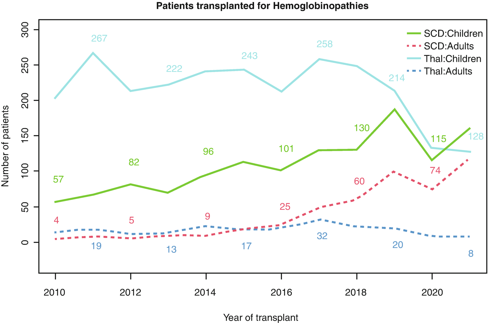
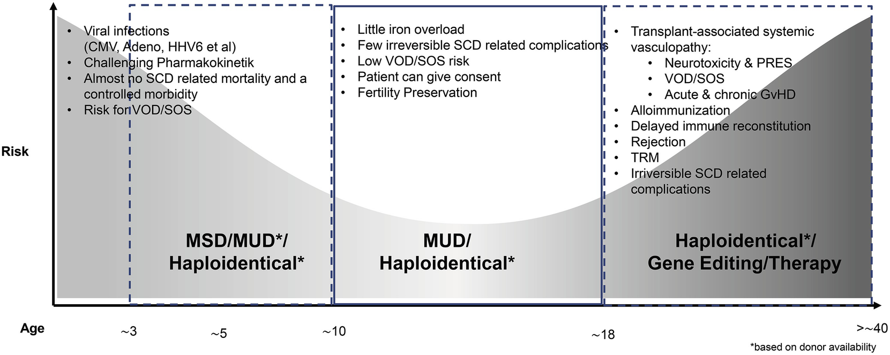
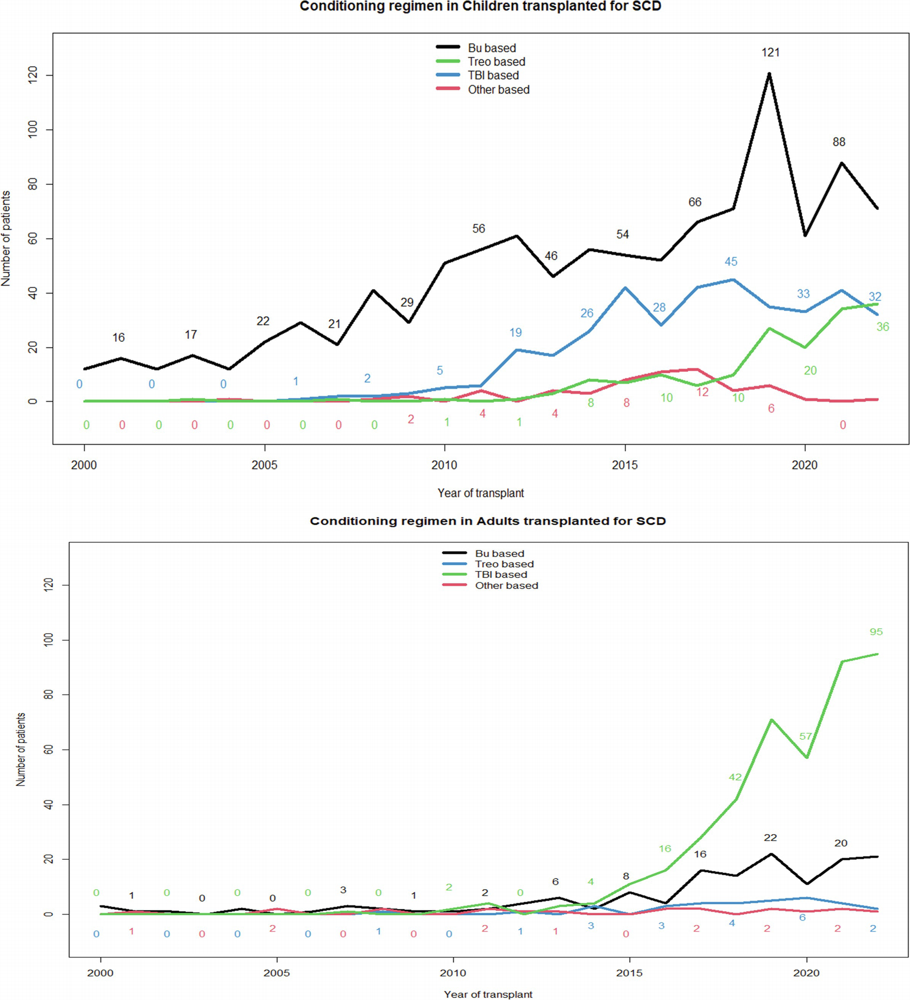
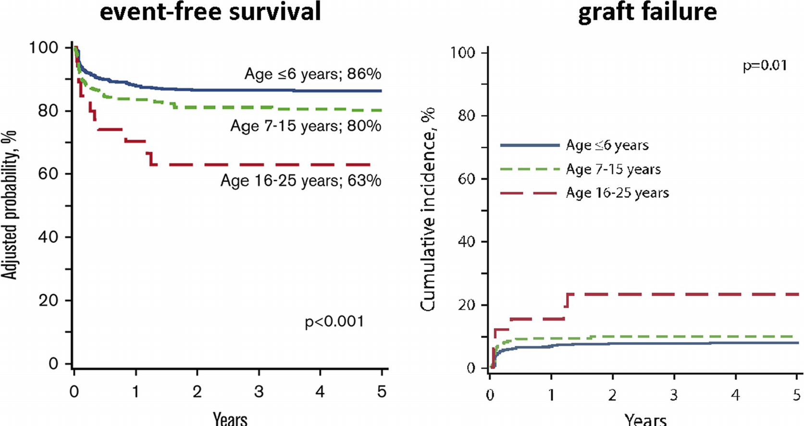
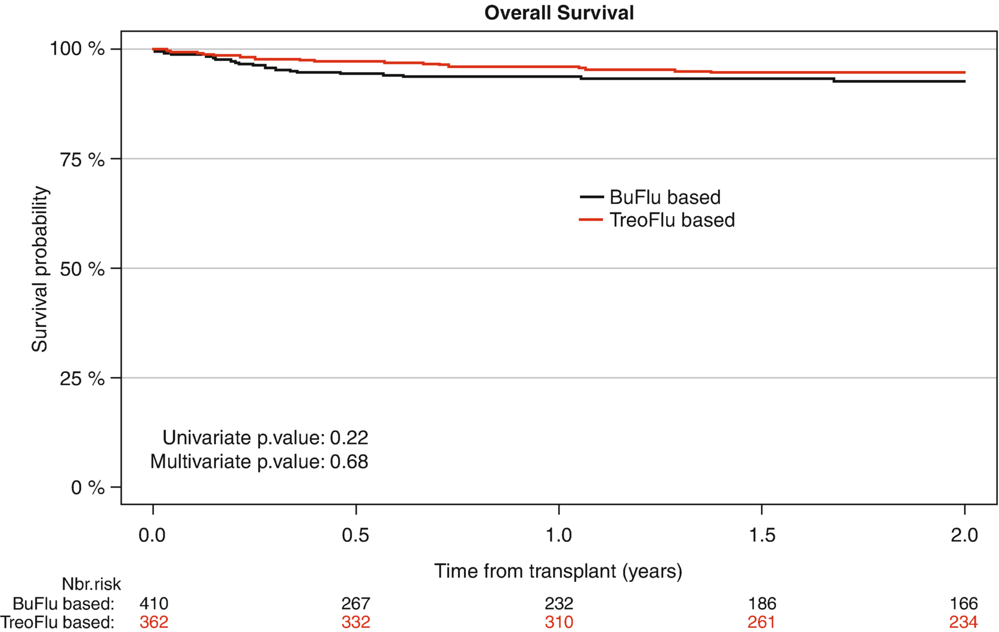

# Chapter 80. Hemoglobinopathies (Sickle Cell Disease and Thalassemia)

> **Source:** Sureda A, Corbacioglu S, Greco R, Kröger N, Carreras E (eds). *The EBMT Handbook: Hematopoietic Cell Transplantation and Cellular Therapies*, 8th ed. Springer, Cham; 2024. pp. 725–739. https://doi.org/10.1007/978-3-031-44080-9_80  
> **Authors:** Cappelli, Barbara; Gluckman, Eliane; Corbacioglu, Selim; de la Fuente, Josu; Abboud, Miguel R.  
>   - Cappelli, Barbara: Eurocord-Monacord, Centre Scientifique de Monaco; Hospital Saint Louis, University Paris-Diderot  
>   - Gluckman, Eliane: Eurocord-Monacord, Centre Scientifique de Monaco; Hospital Saint Louis, University Paris-Diderot  
>   - Corbacioglu, Selim: Oncology and Stem Cell Transplantation University Medical Center  
>   - de la Fuente, Josu: St. Mary’s Hospital & Centre for Haematology, Hammersmith Hospital, Imperial College Healthcare NHS Trust  
>   - Abboud, Miguel R.: American University of Beirut Medical Center  
> **License:** CC BY 4.0 (https://creativecommons.org/licenses/by/4.0/). Text reproduced verbatim from the open-access HTML edition; formatting converted to Markdown.

## Abstract

Hematopoietic cell transplantation (HCT) using an HLA-matched sibling donor is a well-established curative therapy for pediatric patients with sickle cell disease (SCD) and transfusion-dependent thalassemias (TDT). In order to expand the donor pool, new approaches such as related haploidentical donor HCT have been used with encouraging results. These approaches aim for a higher overall survival, an effective reduction of acute and chronic GvHD and a reduced toxicity. Due to these alternative approaches and adult patients being increasingly transplanted, the number of HCT has dramatically increased in the last decade. Furthermore, different gene therapy and gene editing strategies are being developed in clinical trials, showing promising results.

## 80.1 HCT for Sickle Cell Disease

- Barbara Cappelli,
- Eliane Gluckman &
- Selim Corbacioglu 

### 80.1.1 Definition and Epidemiology

Sickle cell disease (SCD) is the most common inherited hemoglobinopathy worldwide. It is caused by a single-nucleotide substitution that leads to a propensity toward hemoglobin polymerization and red blood cell sickling. SCD is characterized by anemia, ongoing hemolysis, and acute and chronic vaso-occlusive complications affecting multiple organs. SCD affects mostly patients of African origin, but with a high prevalence also in certain parts of Turkey and the Arabic countries. The substantial migration in particular over the last decade led to a prominent rise of the prevalence in all European countries.

The implementation of newborn screening, penicillin prophylaxis, vaccination programs, narcotics, chronic transfusions, hydroxyurea, and the early detection of cerebral vasculopathy with transcranial doppler have basically abrogated the SCD-related mortality in childhood (Brandow and Liem 2022) but had little impact on the overall survival from SCD. Novel, diseases modifying treatment options such as Voxelotor, L-Glutamine, and Crizanlizumab, focusing on stabilization of the oxygenated hemoglobin state, reducing anti-sickling or cellular adhesion, or activating pyruvate, intend to effectively control the disease (de la Fuente et al. 2020) (Table 80.1), but the impact on the SCD-related chronic vasculopathy is unpredictable and the Phase III trial on Crizalinizumab failed to reach the primary endpoint.

**Table 80.1 Current and future disease modifying therapies for sickle cell disease; modified from de la Fuente et al. ( 2020 )**

<table>
<thead>
<tr>
<th> </th>
<th>
Indication
</th>
<th>
Stage of development
</th>
<th>
Proposed mechanism of action
</th>
</tr>
</thead>
<tbody>
<tr>
<td>
Hydroxycarbamide (hydroxyurea)
</td>
<td>
Prevention of vaso-occlusive crisis, acute chest syndrome, and primary stroke; also recommended for treatment of severe anemia
</td>
<td>
Standard care
</td>
<td>
Enhances fetal hemoglobin production, increases mean corpuscular volume, and reduces white blood cells and reticulocytes; might also be a nitric oxide donor
</td>
</tr>
<tr>
<td>
Chronic blood transfusion
</td>
<td>
Treatment and prevention of acute and chronic complications of sickle cell disease
</td>
<td>
Standard care
</td>
<td>
Suppresses endogenous erythropoiesis, decreases the concentration of red blood cells containing hemoglobin S, and increases hemoglobin concentration
</td>
</tr>
<tr>
<td>
Glutamine
</td>
<td>
Reduction in vaso-occlusive crisis
</td>
<td>
Approved in USA (2017, for SCD pts. ≥ 5 years old)

but not approved in Europe
</td>
<td>
Raises nicotinamide adenine dinudeotide redox ratio and prevents oxydative damage within hemoglobin S-containing erythrocytes
</td>
</tr>
<tr>
<td>
Voxelotor
</td>
<td>
Treatment of sickle cell disease has been shown to increase hemoglobin concentration and reduce biomarkers of hemolysis.
</td>
<td>
Approved for SCD pts. ≥12 years old in the USA (2019) and Europe (2022)
</td>
<td>
Synthetic allosteric modifier of hemoglobin; inhibits polymerization of hemoglobin S
</td>
</tr>
<tr>
<td>
Crizanlizumab
</td>
<td>
Reduction in vaso-occlusive crisis
</td>
<td>
Approved for SCD pts. ≥16 years old

in USA (2019) and Europe (2020)

Phase III trial failed primary endpoint (2023)
</td>
<td>
Humanized monoclonal antibody, blocks P-selectin-mediated multicellular adhesion
</td>
</tr>
</tbody>
</table>

### 80.1.2 Allo-HCT with an HLA Identical Sibling

Allogeneic HCT remains the only curative therapy for SCD. The goal when performing HCT is to replace the patient’s marrow with donor stem cells prior to major organ dysfunction and irreversible damage.

Several barriers prevent widespread application of HCT including lack of a suitable donor, lack of information, and limited understanding of HCT. Moreover, HCT encompasses a certain risk of early- and late-onset regimen-related toxicities, such as rejection, GVHD, and treatment-related mortality which impedes the decision for patients/caregivers to prefer HCT over non-curative treatment options, especially since hemoglobinopathies are so called non-malignant diseases. Nevertheless, the transplantation frequency for hemoglobinopathies in Europe has been increasing in the last decade (Fig. 80.1). According to the registry of the EBMT, the frequency of transplantations in adult SCD patients has risen significantly within the last decade. Most remarkable is the 2-yrs overall survival of these patients that exceeds that of adult TDT patients, who have been transplanted for a substantially longer time period (Table 80.2).

**Fig. 80.1**

Transplant activities in the EBMT registries for hemoglobinopathies in the last decade

**Table 80.2 Two-years overall survival in the EBMT registries for hemoglobinopathies in the last decade**

|                | 2 y OS           |
|----------------|------------------|
| SCD: Children  | 95.6 (94.1–96.6) |
| SCD: Adults    | 93.5 (90.7–95.5) |
| Thal: Children | 92.1 (90.8–93.2) |
| Thal: Adults   | 84.4 (78.1–89.0) |

The first successful HLA identical HCT was performed in a patient affected by both SCD and AML in 1984. After that, many groups have described series of patients transplanted from an HLA identical sibling with an OS that varies between 91% and 100% and EFS that varies between 73 and 100% (Bernaudin et al. 2007). An international survey including 1000 HLA identical transplants, performed between 1986 and 2013 and reported to EBMT, Eurocord, and the CIBMTR, showed a 5-year EFS and OS of 91.4% and 92.9%, respectively. Graft failure was observed in 23 patients (Gluckman et al. 2017).

Age at transplantation is an important predictor of survival. Patients younger than 5 years have an excellent OS and EFS (Cappelli et al. 2019; Bhalla et al. 2023); therefore, HLA-identical sibling HCT should be proposed early in life, before complications occur. It must be noticed that at a cutoff of 15 years, the incidence of cGVHD in matched sibling donors can rise beyond 20% (Cappelli et al. 2019).

Other studies have shown that different to most other diseases a fully matched unrelated donor yields different EFS, OS, and also the incidence of cGVHD is substantially higher compared to an age matched sibling donor, again with a similar cutoff for worse outcome at age ≥ 13 years (Eapen et al. 2019).

Patient’s age should be also be taken into account for the choice of the best donor selection and treatment strategy according to HCT-related complications (de la Fuente et al. 2020) (Fig. 80.2).

**Fig. 80.2**

Age related risk factors for allogeneic HCT in SCD patients and recommendations for donor selection/treatment strategy. From Josu de la Fuente et al. (2020)

*HCT* hematopoieitic cell transplantation. *GVHD* graft-versus-host disease. \*Based on donor availability

Family-directed cord blood banking could represent a useful stem cell resource for families with a child affected by SCD (Rafii et al. 2017).

A recent survey evaluating changes on experienced health and personal life goals demonstrated that transplantation has a positive impact on physical, mental, and social health in adult SCD patients (Dovern et al. 2023).

There is an increasing body of evidence that reversibility affecting almost all organs, including cerebral perfusion (Bernaudin 2020) and osteonecrosis (Hernigou et al. 1997), is possible. Pivotal part of any pretransplant consultation is a thorough assessment of SCD-related organ damage, followed by a discussion of the expectations to avoid disappointment and frustration.

### 80.1.3 Conditioning Regimen

To date, a myeloablative conditioning (MAC) regimen is the gold standard for HLA identical sibling HCTs (EFS: 73–96%, OS: 91–100%) despite the risk of long-term transplant-related toxicity, especially when patients are already suffering from organ damage due to their SCD status (Bhalla et al. 2023). Historically, a BU-based conditioning regimen including cyclophosphamide or FLU has been used but with high toxicities and GvHD risk; therefore, in order to lower the GvHD risk, the addition of ATG is recommended. In recent years, fludarabin, treosulfan, and thiotepa (FTT) emerged as a frequently used contemporaneous MAC conditioning in SCD in children and adults. The reason is that FTT is well tolerated with the advantage of a limited endothelial toxicity and less blood–brain barrier passage (EBMT registry data) (Foell et al. 2020) and a higher tendency for a preserved fertility (Faraci et al. 2019) (Fig. 80.3).

**Fig. 80.3**

Conditioning regimens in Children and Adults transplanted in EBMT centers

A reduced intensity conditioning (RIC) regimen has been explored to decrease toxicity allowing a stable mixed chimerism. The aim of a tailored conditioning regimen in children is to preserve fertility, whereas in adults, it is to reduce toxicity in severely compromised patients due to their underlying disease. Recently, encouraging outcomes and low early- and long-term toxicity have been observed with FLU-based RIC regimens or after a chemotherapy-free regimen (ALEM-TBI 300 cGy; DFS = 92% and OS = 100%) (Bhalla et al. 2023; de la Fuente et al. 2020).

Despite MAC regimens, a mixture of both donor and recipient hematopoietic cells (mixed donor chimerism) can be consistently observed in approximately 10–20% of transplanted children. Interestingly, this mixed chimeric state with the presence of both recipient and donor blood cells is sufficient to direct bone marrow to preferentially produce donor-type hemoglobin (rather than abnormal hemoglobin of the recipient), reverse the red blood cell SCD phenotype, and minimize the risk of GvHD, confirming the therapeutic efficacy of mixed chimerism for hemoglobinopathies. In cases of a mixed chimerism, split chimerism analyses are pivotal for a proper understanding of the hematopoietic compartments, where a full myeloid chimerism encourages a watch-and-wait strategy. This approach avoids unnecessary and dangerous interventions to achieve a full donor chimerism, which is not mandatory in case of a non-malignant myeloid disease.

### 80.1.4 Alternative Donors

Finding a potential matched unrelated donor (MUD) is based on the ethnic and racial background of the recipient; for SCD patients the probability for an 8/8 HLA MUD or CB donor is less than 18%. Nevertheless, some small series of patients using unrelated donors have been published, but for now relapse rate and GvHD risk remain high (Gluckman et al. 2020). Whereas in many diseases, outcome does not differ much between MSD and MUD, a recent retrospective multicenter, cohort study in SCD found significant differences in pivotal outcome parameters such as OS and GVHD in SCD. As in MSD HCT, the threshold for worse outcome is again adolescent age (≥13 years) (Eapen et al. 2019).

The development of both in vivo and ex vivo T-cell depletion strategies has facilitated the emergence of haploidentical donor HCT as a solution with universal availability of donors. Initial attempts resulted in a high rate of graft failure (43%); therefore, different conditioning regimens have been developed. A nonmyeloablative conditioning regimen including ATG, fludarabine, thiotepa, cyclophosphamide, and low-dose total body irradiation, followed by post-transplantation cyclophosphamide showed an excellent OS with a low graft failure and a low mortality rate (de la Fuente 2019).

A single-center experience with TCRαβ-depleted and CD19-depleted grafts conditioned with FTT and ATG showed rapid engraftment and a low incidence of GvHD with OS and DFS comparable to MSD HCT (Foell et al. 2019). This approach is currently evaluated in a prospective stratified trial (NCT04201210). Taken together, these results show that outcomes of haploidentical HCT are increasingly similar to MSD HCT and seem feasible, safe, and effective, thus offering a curative option for the majority of SCD patients with no matched donor.

### 80.1.5 Gene therapy and Gene editing

To date, several gene therapy or gene editing clinical trials have been conducted or are ongoing Home - ClinicalTrials.gov.

Lentiviral vector based approaches carrying a modified beta globin or gamma globin gene are under investigation for safety and efficacy. In 2021, lentiviral vectors trials were temporarily suspended due to the observation of three cases of leukemia after gene therapy with Lentiglobin (Bluebird). Lentiviral vector BB305 was not shown responsible of the clonal transformation. In order to predict the risk of leukemia or other secondary tumors in SCD patients after transplantation or after gene therapy, it seems very important to determine if some genetic factors, such as clonal hematopoiesis of indeterminate potential (CHIP) are present. Evidence supporting this hypothesis would support the screening of sickle cell patients for pre-leukemic genetic factors before HCT, gene therapy or gene editing.

B-cell lymphoma/leukemia 11A (BCL11A), a transcription factor that represses γ-globin expression, has been identified as a target to restore high expression of fetal hemoglobin (HbF). New strategies of gene therapy infusing autologous CD34+ cells transduced with the BCH-BB694 lentiviral vector, which encodes a short hairpin RNA targeting in the erythroid lineage BCL11A mRNA embedded in a microRNA, lead to a robust and stable HbF induction, with marked clinical improvements (Esrick et al. 2021).

The clustered regularly interspaced short palindromic repeats (CRISPR)-Cas9 nuclease system is another strategy used targeting the erythroid-specific enhancer region of BCL11A.Using this strategy, the CLIMB 121 SCD study is ongoing and preliminary results are very encouraging. Most advanced is a (CRISPR)-Cas9-based approach using nonviral, ex vivo editing of the erythroid-specific enhancer region of *BCL11A* in CD34⁺ cells to reduce erythroid-specific expression of BCL11A (NCT03745287) (Frangoul et al. 2021).

CD34+ cells collection after G-CSF stimulation is now contraindicated in SCD patient for severe complications, whereas plerixafor (CXCR4 chemokine receptor antagonist) alone or in combination with GRO-β (CXCR2 agonist) has been used successfully **(**Frangoul et al. 2021; Leonard et al. 2022).

### 80.1.6 Conclusion

Sickle cell disease is increasingly recognized as a health-care priority with several novel disease modifying drugs being licensed in recent years and excellent outcomes after HLA-matched sibling donor transplantation, especially if performed at young age. Improved conditioning regimens, and novel GvHD prophylaxis have contributed to an increased use and acceptability of HCT for SCD. Moreover, for patients lacking an HLA-matched sibling donor, outcomes of haploidentical HCT are improving. Innovative gene therapy and gene editing clinical trials are ongoing and show promising results. The future challenges are to stratify patients according to the disease risk, to revise transplantation indications, and to define the best therapeutic approach for each patient.

## 80.2 Thalassemia

- Miguel R. Abboud &
- Josu de la Fuente 

### 80.2.1 Introduction

The outcome of transfusion-dependent thalassemia (TDT) has improved dramatically over the past two decades due to improvements in supportive care, and iron chelation therapy with magnetic resonance-based tissue iron monitoring (Taher et al. 2021). Life expectancy for TDT patients currently exceeds 40 years (Vitrano et al. 2017), but despite these advances it remains below that of the general population (Kountouris et al. 2021; Jobanputra et al. 2020). Furthermore, patients have a significant burden of morbidity and quality of life is significantly affected starting from childhood (Jobanputra et al. 2020; Shah et al. 2021). Recently, luspatercept was approved and was shown to decrease transfusion requirements in patients with thalassemia. The ultimate impact of this drug remains to be determined (Sheth et al. 2023).

Despite the recent approval of a gene addition therapy for some patients with TDT (see below), matched family donor (MFD) allo-HCT is currently considered the only curative standard therapeutic approach for this disorder (Oikonomopoulou and Goussetis 2021). HCT, though associated with significant risks results in life-long transfusion independence, allows reversal of tissue iron load with possible resolution of iron accumulation complications and improved quality of life (Caocci et al. 2011a, b; La Nasa et al. 2013; Mulas et al. 2022).

### 80.2.2 Best Transplant Candidates and Conditioning

In the late 1990s, the Pesaro group proposed a risk classification for pediatric patients undergoing MFD HCT for TDT (Lucarelli et al. 1998). The classification depended on three risk factors (Table 80.3) and was validated in the pediatric population; however, it did not predict risk in adult patients (Angelucci et al. 2017). The Pesaro classification is applicable in the setting of best medical care. In developing countries, where medical care might not be optimal, a very-high-risk group was identified in Pesaro class 3 patients if liver size is \>5 cm below the costal margin and if the patient age is \>7 years (Mathews et al. 2007). The introduction of fludarabine-based conditioning regimens has abrogated the risks for all but the most severely iron loaded, including the class 3 patients (Bernardo et al. 2008, 2012). The EBMT has recently identified age of 14 years as the oldest age for best outcome in HCT for TDT (Baronciani et al. 2016). Age as a risk factor was corroborated by more recent data from CIBMTR with optimal outcomes up to 7 years of age (Li et al. 2019) (Fig. 80.4). A recent retrospective analysis of the Turkish experience (1469 patients treated in 25 centres) further supports the need to incorporate HCT in the treatment algorithm at a young age (Yisilipek et al. 2022).

**Table 80.3 Pesaro classifications for risk assessment prior to HCT for TM (Lucarelli et al. 1998 )**

| Risk factor          | Class 1 | Class 2 (min. 1, max. 2) | Class 3 |
|----------------------|---------|--------------------------|---------|
| Inadequate chelation | ×       | ×/✓                      | ✓       |
| Hepatomegaly \>2 cm  | ×       | ×/✓                      | ✓       |
| Portal fibrosis      | ×       | ×/✓                      | ✓       |

**Fig. 80.4**

Age is the major determinant in event-free survival and graft failure in TDT (Li et al. 2019)

Accurate assessment of iron content in the liver and heart is crucial before proceeding to transplant. Serum ferritin level might not reflect accurately the severity of iron overload and does not provide information regarding the stage of fibrosis. Liver biopsy is the gold standard; however, it carries the risks of the invasive procedure and transient elastography (FibroScan) has been shown to be reliable noninvasive methods to predict liver fibrosis secondary to iron overload in adults (Hamidieh et al. 2014, 2015). In addition, center experience is a significant factor in outcomes, and hence, it is important HCT for TDT occurs in designated centers with experience (Yesilipek et al. 2022). Transplantation allows reversal of end-organ damage (Muretto et al. 2002); thus, development of new predictive indices that allow the identification of risks associated with the procedure and the patients most likely to benefit from it in different settings should be targets of future research (Kulkarni et al. 2022).

### 80.2.3 Conditioning Regimens

Myeloablative busulfan (BU) and cyclophosphamide (CY) were the standard conditioning regimen for HCT for TDT due to the increased marrow activity and the allo-sensitization in heavily transfused patients (Lucarelli et al. 1990). However, this regimen was associated with hepatic and cardiac toxicity due to the iron overload and the effects of BU and CY, respectively. Younger patients have a greatest risk of rejection, which can be abrogated with the addition of thiotepa 10 mg/kg to the conditioning regimen (Lucarelli and Gaziev 2008; Chiesa et al. 2010). Additional interventions that can minimize the risk of graft failure are the pretransplantation suppression of endogenous hemopoiesis with hypertransfusions, the use of hydroxycarbamide 30 mg/kg and azathioprine 3 mg/kg pre-transplantation, and the use of ATG/ATLG (Sodani et al. 2004; Shen et al. 2008; Cappelli et al. 2009).

BU/CY-based conditioning regimens have been progressively superseded by reduced toxicity fludarabine-based myeloablative conditioning regimens, increasingly with treosulfan use (Bernardo et al. 2008, 2012). It was recently demonstrated that there is no overall difference in outcomes between busulfan and treosulfan in fludarabine-based conditioning regimens (Fig. 80.5), though there is a trend toward less toxicity but higher graft failure with treosulfan (Lüftinger et al. 2022). Initially, serotherapy was used only in the setting of unrelated donors but since the identification of the favorable effect of ATG on engraftment (Bernaudin et al. 2007; Cappelli et al. 2009), its use is now widely adopted. Concerning other regimens, there is limited evidence, needing further corroboration, that non-myeloablative approaches may also be feasible in TDT, which would significantly expand HCT in adults (Shin et al. 2020).

**Fig. 80.5**

Effect of treosulfan compared with busulfan-based regimens on OS (Lüftinger 2022)

The incidence of GVHD is a major determinant of post-transplant morbidity, mortality, and quality of life (Caocci et al. 2011a, b). Thus, new approaches to GVHD prevention are being evaluated, Abatacept added to routine GVHD prophylaxis in the context of fludarabine reduced toxicity myeloablative conditioning for hemoglobinopathies reduced the incidence of day +100 severe acute GVHD without impacting engraftment or survival in thalassaemia (Khandelwal et al. 2021). This agent is also protective against the development of chronic GvHD through extended dosing in the context of haploidentical transplantation with post transplantation cyclophosphamide (PTCy) for transfusion-dependent thalassaemia (Jaiswal et al. 2020).

Defibrotide has been used successfully to prevent SOS/VOD in patients with TDT undergoing HCT with conditioning regimen containing IV BU (Cappelli et al. 2009). The use of this agent is, however, restricted to the treatment of SOS in many countries. Basing busulfan dosing on BU pharmacokinetics was associated with better engraftment and less toxicity (Gaziev et al. 2010); however, these studies are available in a limited number of institutions worldwide.

### 80.2.4 Alternative Donors

#### 80.2.4.1 Matched Unrelated Donors (MUD)

Advances in high-resolution typing, supportive care, and the availability of fludarabine-based conditioning regimens containing both busulfan and treosulfan have enabled the consideration of matched unrelated transplantation as a suitable alternative (Bernardo et al. 2012; Li et al. 2012) with outcomes not significantly different to related donors. Equivalent outcomes have been validated in real-world data from CIBMTR (Li et al. 2019) and the recent retrospective analysis of the Turkish experience found identical hazards ratio for GvHD-free thalassemia-free survival for related and unrelated donors (Yesilipek et al. 2022). Hence, matched unrelated transplantation should be considered a standard option alongside related transplantation notwithstanding the limitations of non-Caucasian overall donor availability (Gragert et al. 2014).

#### 80.2.4.2 Unrelated Umbilical Cord

The use of unrelated umbilical cord (UCB) as a source of stem cells for HCT in TDT is hampered by the high incidence of graft failure due to the low stem cell dose. The graft failure rate could be as high as 57% (Ruggeri et al. 2011). This could be partially overcome by the use of double UCB units. The 5-year overall and thalassemia-free survival rates were 88.3% and 73.9%, respectively, when using two units instead of one if no single units included more than 25 × 10⁶ total nucleated cells/kg of recipient weight. Other strategies to overcome the main barrier of low cell dose include co-transplantation of third-party mesenchymal stromal or TCD haploidentical cells (Kwon et al. 2014).

#### 80.2.4.3 Haploidentical HCT

Due to the low probability of finding a MUD in some ethnicities and the previously mentioned issues with umbilical-cord transplant, new strategies were employed to develop an effective and safe haploidentical transplant procedure for TDT patients. Historically, the use of mismatched donors has been associated with increased mortality and reduced long-term engraftment (Li et al. 2019; Lüftinger et al. 2022). Ex vivo T cell depletion (TCD) with CD34+ selection techniques were associated with high rate of infections and increased risk of graft failure due to allo-sensitization and hyperactive marrow (Gaziev et al. 2000). However, these challenges are being addressed with novel TCRαβ CD19+ depleted TCD techniques (Bertaina et al. 2017; Merli et al. 2022) and PTCy (de la Fuente et al. 2019; Jaiswal et al. 2020; Anurathapan et al. 2020), with results approaching the outcomes of both related and unrelated transplantation.

### 80.2.5 Stem Cell Source

The ideal source of stem cells remains bone marrow, and this is associated with lower rates of acute and chronic GVHD, therefore associated with normalization of quality of life (Caocci et al. 2011a, b). Nonetheless, recently good outcomes have been reported with adequate GVHD prophylaxis and peripheral blood stem cells (PBSC) to obtain sufficient stem cells for recipients with high body weight (Yesilipek et al. 2022).

### 80.2.6 Mixed Chimerism

Mixed chimerism is common and often results in stable chimerism or complete engraftment and patients remain transfusion independent (Andreani et al. 2000). However, this situation needs to be stabilized because it can lead to poor graft function and clonal evolution (Gassas et al. 2021). Mixed chimerism is usually driven by mixed T cell chimerism. This is best addressed by enhancement of immunosuppression, usually by maintaining or adding mycophenolate mofetil as a second immunosuppressive agent which maximizes the donor fraction (Mehta et al. 2023). An alternative approach is to use DLI though it carries a risk of GVHD and its efficacy can be limited (Frugnoli et al. 2010; Karasu et al. 2012; Chen et al. 2020). Pretransplantation immunosuppression (PTIS) can minimize mixed chimerism and graft failure in higher risk transplants like haploidentical and reduced intensity transplantation (Anurathapan et al. 2020; Jaiswal et al. 2020).

### 80.2.7 Post-Transplant Iron Chelation and Follow Up

Iron overload remains a problem after HCT, and most investigators rely on phlebotomy to decrease excessive iron stores. In a recent phase II, multicenter, single-arm trial, deferasirox at a dose of 20 mg/kg/day, starting after a minimum of 6 months of transplant, and continued for 1 year, was safe and associated with decreased burden of iron overload after transplant (serum ferritin, liver, and cardiac iron content by MRI) (Yesilipek et al. 2018). Patients with thalassemia who are cured by stem cell transplants experience significantly improved quality of life; however, they require lifelong follow-up for complications that may have preceded the transplant as well as transplant-related issues.

### 80.2.8 Gene Therapy

The advent of gene addition and gene editing strategies will inevitably impact the indication for stem cell transplantation in thalassemia. To date no malignancies have been reported in patients with thalassemia who received gene therapy after myeloablative busulfan. Although, the initial lentiviral gene addition strategy proved more successful in patients with non–β⁰/β⁰ genotypes (Thompson et al. 2018; Locatelli et al. 2022a, b) and children (Marktel et al. 2019), improvements in manufacturing and provision have led to led high rates of long-term to freedom from transfusion with improvement of dyserythropoiesis and iron overload in all patients (Thompson et al. 2021; Magrin et al. 2022). Recently, excellent results were published utilizing a CRISPR-Cas9-based approach using nonviral, ex vivo editing of the erythroid-specific enhancer region of BCL11A in CD34⁺ cells to reduce erythroid-specific expression of BCL11A and increase the expression of fetal hemoglobin. Most patients became transfusion independent with a few having decreased transfusion burden NCT03745287) **(**Frangoul et al. 2021). This technique was effective in both β⁰/β⁰ and non β⁰/β⁰ genotypes. It is important to establish the patients for whom its priority is indicated, particularly in the early phase of use outside experimental trials conducted in highly selected centers (Baronciani et al. 2021).

### Key Points

- HLA identical sibling HCT is an established treatment option for SCD and TDT.

- Unrelated transplantation offers equivalent outcomes to sibling transplantation in TDT.

- HCT should be performed as early as possible.

- Haplo identical HCT, gene therapy, and gene editing trials for SCD and TDT are ongoing with promising results.

- Mixed chimerism is common and its management is key to optimal outcomes.

## References

- Andreani M, Nesci S, Lucarelli G, et al. Long-term survival of ex-thalassemic patients with persistent mixed chimerism after bone marrow transplantation. Bone Marrow Transplant. 2000;25:401–4.

- Angelucci E, Pilo F, Coates TD. Transplantation in thalassemia: revisiting the Pesaro risk factors 25 years later. Am J Hematol. 2017;92:411–3.

- Anurathapan U, Hongeng S, Pakakasama S, Songdej D, Sirachainan N, Pongphitcha P, Chuansumrit A, Charoenkwan P, Jetsrisuparb A, Sanpakit K, Rujkijyanont P, Meekaewkunchorn A, Lektrakul Y, Iamsirirak P, Surapolchai P, Sirireung S, Sruamsiri R, Wahidiyat PA, Andersson BS. Hematopoietic stem cell transplantation for severe thalassemia patients from haploidentical donors using a novel conditioning regimen. Biol Blood Marrow Transplant. 2020;26(6):1106–12.

- Baronciani D, Angelucci E, Potschger U, et al. Hemopoietic stem cell transplantation in thalassemia: a report from the European Society for Blood and Bone Marrow Transplantation Hemoglobinopathy Registry, 2000–2010. Bone Marrow Transplant. 2016;51:536–41.

- Baronciani D, Casale M, De Franceschi L, Graziadei G, Longo F, Origa R, Rigano P, Pinto V, Marchetti M, Gigante A, Forni GL. Selecting β-thalassemia patients for gene therapy: a decision-making algorithm. Hema. 2021;5(5):e555.

- Bernardo ME, Zecca M, Piras E, Vacca A, Giorgiani G, Cugno C, Caocci G, Comoli P, Mastronuzzi A, Merli P, La Nasa G, Locatelli F. Treosulfan-based conditioning regimen for allogeneic haematopoietic stem cell transplantation in patients with thalassaemia major. Br J Haematol. 2008;143(4):548–51.

- Bernardo ME, Piras E, Vacca A, et al. Allogeneic hematopoietic stem cell transplantation in thalassemia major: results of a reduced-toxicity conditioning regimen based on the use of treosulfan. Blood. 2012;120:473–6.

- Bernaudin F. What is the place of hematopoietic stem cell transplantation in the management of cerebral vasculopathy in children with sickle cell anemia? Hematol Oncol Stem Cell Ther. 2020;13(3):121–30.

- Bernaudin F, Socie G, Kuentz M, et al. Long-term results of related myeloablative stem cell transplantation to cure sickle cell disease. Blood. 2007;110:2749–56.

- Bertaina A, Pitisci A, Sinibaldi M, Algeri M. T Cell-depleted and T cell-replete HLA-haploidentical stem cell transplantation for non-malignant disorders. Curr Hematol Malig Rep. 2017;12:68–78.

- Bhalla N, Bhargav A, Yadav SK, Singh AK. Allogeneic hematopoietic stem cell transplantation to cure sickle cell disease: a review. Front Med (Lausanne). 2023;10:1036939.

- Brandow AM, Liem RI. Advances in the diagnosis and treatment of sickle cell disease. J Hematol Oncol. 2022;15(1):20.

- Caocci G, La Nasa G, d'Aloja E, Vacca A, Piras E, Pintor M, Demontis R, Pisu S. Ethical issues of unrelated hematopoietic stem cell transplantation in adult thalassemia patients. BMC Med Ethics. 2011a;12:4.

- Caocci G, Efficace F, Ciotti F, Roncarolo MG, Vacca A, Piras E, Littera R, Dawood Markous RS, Collins GS, Ciceri F, Mandelli F, Marktel S, La Nasa G. Prospective assessment of health-related quality of life in pediatric patients with beta-thalassemia following hematopoietic stem cell transplantation. Biol Blood Marrow Transplant. 2011b;17(6):861–6.

- Cappelli B, Chiesa R, Evangelio C, et al. Absence of VOD in paediatric thalassaemic HSCT recipients using defibrotide prophylaxis and intravenous Busulphan. Br J Haematol. 2009;147:554–60.

- Cappelli B, Volt F, Tozatto-Maio K, Scigliuolo GM, Ferster A, Dupont S, Simões BP, Al-Seraihy A, Aljurf MD, Almohareb F, Belendez C, Matthes S, Dhedin N, Pondarre C, Dalle JH, Bertrand Y, Vannier JP, Kuentz M, Lutz P, Michel G, Rafii H, Neven B, Zecca M, Bader P, Cavazzana M, Labopin M, Locatelli F, Magnani A, Ruggeri A, Rocha V, Bernaudin F, de La Fuente J, Corbacioglu S, Gluckman E, Eurocord, the Cellular Therapy and Immunobiology Working Party (CTIWP), and the Paediatric Diseases Working Party (PDWP) of the EBMT. Risk factors and outcomes according to age at transplantation with an HLA-identical sibling for sickle cell disease. Haematologica. 2019;104(12):e543–6.

- Chen H, Li XY, Zhan LP, Fang JP, Huang K, Li Y, Weng WJ, Xu LH, Xu HG, Zhou DH. Prediction, management, and prognosis of mixed chimerism after hematopoietic stem cell transplantation in transfusion-dependent pediatric thalassemia patients. Pediatr Transplant. 2020;24(8):e13876.

- Chiesa R, Cappelli B, Crocchiolo R, Frugnoli I, Biral E, Noè A, Evangelio C, Fossati M, Roccia T, Biffi A, Finizio V, Aiuti A, Broglia M, Bartoli A, Ciceri F, Roncarolo MG, Marktel S. Unpredictability of intravenous busulfan pharmacokinetics in children undergoing hematopoietic stem cell transplantation for advanced beta thalassemia: limited toxicity with a dose-adjustment policy. Biol Blood Marrow Transplant. 2010;16(5):622–8.

- de la Fuente J. Augmenting non-myeloablative BMT with Ptcy using thiotepa or 400 Cgy TBI improves engraftment in patients with transfusion dependent thalassemia: results of a haploidentical transplant consortium for hemoglobinopathies (ICHH). Transplant Cell Ther. 2019;25(3):S310–1.

- de la Fuente J, Dhedin N, Koyama T, Bernaudin F, Kuentz M, Karnik L, Socié G, Culos KA, Brodsky RA, DeBaun MR, Kassim AA. Haploidentical bone marrow transplantation with post-transplantation cyclophosphamide plus thiotepa improves donor engraftment in patients with sickle cell anemia: results of an international learning collaborative. Biol Blood Marrow Transplant. 2019;25(6):1197–209.

- de la Fuente J, Gluckman E, Makani J, Telfer P, Faulkner L, Corbacioglu S, Paediatric Diseases Working Party of the European Society for Blood and Marrow Transplantation. The role of haematopoietic stem cell transplantation for sickle cell disease in the era of targeted disease-modifying therapies and gene editing. Lancet Haematol. 2020;7(12):e902–11.

- Dovern E, Nijland SJAM, van Muilekom MM, Suijk LMJ, Hoogendoorn GM, Mekelenkamp H, Biemond BJ, Haverman L, Nur E. Physical, mental, and social health of adult patients with sickle cell disease after allogeneic hematopoietic stem cell transplantation: a mixed-methods study. Transplant Cell Ther. 2023;29(4):283.e1–9.

- Eapen M, Brazauskas R, Walters MC, Bernaudin F, Bo-Subait K, Fitzhugh CD, Hankins JS, Kanter J, Meerpohl JJ, Bolaños-Meade J, Panepinto JA, Rondelli D, Shenoy S, Williamson J, Woolford TL, Gluckman E, Wagner JE, Tisdale JF. Effect of donor type and conditioning regimen intensity on allogeneic transplantation outcomes in patients with sickle cell disease: a retrospective multicentre, cohort study. Lancet Haematol. 2019;6(11):e585–96.

- Esrick EB, Lehmann LE, Biffi A, Achebe M, Brendel C, Ciuculescu MF, Daley H, MacKinnon B, Morris E, Federico A, Abriss D, Boardman K, Khelladi R, Shaw K, Negre H, Negre O, Nikiforow S, Ritz J, Pai SY, London WB, Dansereau C, Heeney MM, Armant M, Manis JP, Williams DA. Post-transcriptional genetic silencing of *BCL11A* to treat sickle cell disease. N Engl J Med. 2021;384(3):205–15.

- Faraci M, Diesch T, Labopin M, Dalissier A, Lankester A, Gennery A, Sundin M, Uckan-Cetinkaya D, Bierings M, Peters AMJ, Garwer M, Schulz A, Michel G, Giorgiani G, Gruhn B, Locatelli F, Giardino S, Uyttebroeck A, Rialland F, Itäla-Remes M, Dreger P, Shaw PJ, Bordon V, Schlegel PG, Mellgren K, Moraleda JM, Patrick K, Schneider P, Jubert C, Lawitschka A, Salooja N, Basak GW, Corbacioglu S, Duarte R, Bader P, Pediatric and Transplant Complications Working Parties of the European Society for Blood and Marrow Transplantation. Gonadal function after busulfan compared with treosulfan in children and adolescents undergoing allogeneic hematopoietic stem cell transplant. Biol Blood Marrow Transplant. 2019;25(9):1786–91.

- Foell J, Schulte JH, Pfirstinger B, Troeger A, Wolff D, Edinger M, Hofmann P, Aslanidis C, Lang P, Holler E, Eggert A, Corbacioglu S. Haploidentical CD3 or α/β T-cell depleted HSCT in advanced stage sickle cell disease. Bone Marrow Transplant. 2019;54(11):1859–67.

- Foell J, Kleinschmidt K, Jakob M, Troeger A, Corbacioglu S. Alternative donor: αß/CD19 T-cell-depleted haploidentical hematopoietic stem cell transplantation for sickle cell disease. Hematol Oncol Stem Cell Ther. 2020;13(2):98–105.

- Frangoul H, Altshuler D, Cappellini MD, Chen YS, Domm J, Eustace BK, Foell J, de la Fuente J, Grupp S, Handgretinger R, Ho TW, Kattamis A, Kernytsky A, Lekstrom-Himes J, Li AM, Locatelli F, Mapara MY, de Montalembert M, Rondelli D, Sharma A, Sheth S, Soni S, Steinberg MH, Wall D, Yen A, Corbacioglu S. CRISPR-Cas9 gene editing for sickle cell disease and β-thalassemia. N Engl J Med. 2021;384(3):252–60.

- Frugnoli I, Cappelli B, Chiesa R, Biral E, Noè A, Evangelio C, Fossati M, Napolitano S, Ciceri F, Roncarolo MG, Marktel S. Escalating doses of donor lymphocytes for incipient graft rejection following SCT for thalassemia. Bone Marrow Transplant. 2010;45(6):1047–51.

- Gassas A, et al. Complex clonal evolution can occur following transplantation for transfusion dependent thalassaemia in the context of mixed myeloid chimerism and reduced conditioning regimens. Blood. 2021;138(Suppl. 1):2906.

- Gaziev D, Galimberti M, Lucarelli G, et al. Bone marrow transplantation from alternative donors for thalassemia: HLA-phenotypically identical relative and HLA-nonidentical sibling or parent transplants. Bone Marrow Transplant. 2000;25:815–21.

- Gaziev J, Nguyen L, Puozzo C, et al. Novel pharmacokinetic behavior of intravenous busulfan in children with thalassemia undergoing hematopoietic stem cell transplantation: a prospective evaluation of pharmacokinetic and pharmacodynamic profile with therapeutic drug monitoring. Blood. 2010;115:4597–604.

- Gluckman E, Cappelli B, Bernaudin F, et al. Sickle cell disease: an international survey of results of HLA-identical sibling hematopoietic stem cell transplantation. Blood. 2017;129:1548–56.

- Gluckman E, Cappelli B, Scigliuolo GM, De la Fuente J, Corbacioglu S. Alternative donor hematopoietic stem cell transplantation for sickle cell disease in Europe. Hematol Oncol Stem Cell Ther. 2020;13(4):181–8. https://doi.org/10.1016/j.hemonc.2019.12.011. Epub 2020 Mar 16

- Gragert L, Eapen M, Williams E, Freeman J, Spellman S, Baitty R, Hartzman R, Rizzo JD, Horowitz M, Confer D, Maiers M. HLA match likelihoods for hematopoietic stem-cell grafts in the U.S. registry. N Engl J Med. 2014;371(4):339–48.

- Hamidieh AA, Shazad B, Ostovaneh MR, et al. Noninvasive measurement of liver fibrosis using transient elastography in pediatric patients with major thalassemia who are candidates for hematopoietic stem cell transplantation. Biol Blood Marrow Transplant. 2014;20:1912–7.

- Hamidieh AA, Moeininia F, Tayebi S, et al. Efficacy of hepatic T2\* MRI values and serum ferritin concentration in predicting thalassemia major classification for hematopoietic stem cell transplantation. Pediatr Transplant. 2015;19:301–6.

- Hernigou P, Bernaudin F, Reinert P, Kuentz M, Vernant JP. Bone-marrow transplantation in sickle-cell disease. Effect on osteonecrosis: a case report with a four-year follow-up. J Bone Joint Surg Am. 1997;79(11):1726–30.

- Jaiswal SR, Bhakuni P, Aiyer HM, Soni M, Bansal S, Chakrabarti S. CTLA4Ig in an extended schedule along with sirolimus improves outcome with a distinct pattern of immune reconstitution following post-transplantation cyclophosphamide-based haploidentical transplantation for hemoglobinopathies. Biol Blood Marrow Transplant. 2020;26(8):1469–76.

- Jobanputra M, Paramore C, Laird SG, McGahan M, Telfer P. Co-morbidities and mortality associated with transfusion-dependent beta-thalassaemia in patients in England: a 10-year retrospective cohort analysis. Br J Haematol. 2020;191(5):897–905.

- Karasu GT, Yesilipek MA, Karauzum SB, Uygun V, Manguoglu E, Kupesiz A, Hazar V. The value of donor lymphocyte infusions in thalassemia patients at imminent risk of graft rejection following stem cell transplantation. Pediatr Blood Cancer. 2012;58(3):453–8.

- Khandelwal P, Yeh RF, Yu L, Lane A, Dandoy CE, et al. Graft-versus-host disease prophylaxis with abatacept reduces severe acute graft-versus-host disease in allogeneic hematopoietic stem cell transplant for beta-thalassemia major with busulfan, fludarabine, and thiotepa. Transplantation. 2021;105(4):891–6.

- Kountouris P, Michailidou K, Christou S, Hadjigavriel M, Sitarou M, Kolnagou A, Kleanthous M, Telfer P. Effect of HBB genotype on survival in a cohort of transfusion-dependent thalassemia patients in Cyprus. Haematologica. 2021;106(9):2458–68.

- Kulkarni UP, Pai AA, Kavitha ML, Selvarajan S, et al. Endothelial activation and stress index-measured pretransplantation predicts transplantation-related mortality in patients with thalassemia major undergoing transplantation with Thiotepa, Treosulfan, and fludarabine conditioning. Transplant Cell Ther. 2022;28(7):356.e1–6.

- Kwon M, Bautista G, Balsalobre P, Sánchez-Ortega I, Serrano D, Anguita J, Buño I, Fores R, Regidor C, García Marco JA, Vilches C, de Pablo R, Fernández MN, Gayoso J, Duarte R, Díez-Martín JL, Cabrera R. Haplo-cord transplantation using CD34+ cells from a third-party donor to speed engraftment in high-risk patients with hematologic disorders. Biol Blood Marrow Transplant. 2014;20(12):2015–22.

- La Nasa G, Caocci G, Efficace F, Dessì C, Vacca A, Piras E, Sanna M, Marcias M, Littera R, Carcassi C, Lucarelli G. Long-term health-related quality of life evaluated more than 20 years after hematopoietic stem cell transplantation for thalassemia. Blood. 2013;122(13):2262–7.

- Leonard A, Tisdale JF, Bonner M. Gene therapy for hemoglobinopathies: beta-thalassemia, sickle cell disease. Hematol Oncol Clin North Am. 2022;36(4):769–95.

- Li C, Wu X, Feng X, et al. A novel conditioning regimen improves outcomes in beta-thalassemia major patients using unrelated donor peripheral blood stem cell transplantation. Blood. 2012;120:3875–81.

- Li C, Mathews V, Kim S, George B, Hebert K, Jiang H, Li C, Zhu Y, Keesler DA, Boelens JJ, Dvorak CC, Agarwal R, Auletta JJ, Goyal RK, Hanna R, Kasow K, Shenoy S, Smith AR, Walters MC, Eapen M. Related and unrelated donor transplantation for β-thalassemia major: results of an international survey. Blood Adv. 2019;3(17):2562–70.

- Locatelli F, Thompson AA, Kwiatkowski JL, et al. Betibeglogene autotemcel gene therapy for Non–β0/β0 genotype β-thalassemia. NEJM. 2022a;386(5):415–27.

- Locatelli F, Thompson AA, Kwiatkowski JL, Porter JB, Thrasher AJ, Hongeng S, Sauer MG, Thuret I, Lal A, Algeri M, Schneiderman J, Olson TS, Carpenter B, Amrolia PJ, Anurathapan U, Schambach A, Chabannon C, Schmidt M, Labik I, Elliot H, Guo R, Asmal M, Colvin RA, Walters MC. Betibeglogene autotemcel gene therapy for Non-β0/β0 genotype β-thalassemia. N Engl J Med. 2022b;386(5):415–27.

- Lucarelli G, Gaziev J. Advances in the allogeneic transplantation for thalassemia. Blood Rev. 2008;22(2):53–63. https://doi.org/10.1016/j.blre.2007.10.001. Epub 2007 Nov 26

- Lucarelli G, Galimberti M, Polchi P, et al. Bone marrow transplantation in patients with thalassemia. N Engl J Med. 1990;322:417–21.

- Lucarelli G, Galimberti M, Giardini C, et al. Bone marrow transplantation in thalassemia. The experience of Pesaro. Ann N Y Acad Sci. 1998;850:270–5.

- Lüftinger R, Zubarovskaya N, Galimard JE, Cseh A, Salzer E, Locatelli F, Algeri M, Yesilipek A, de la Fuente J, Isgrò A, Alseraihy A, Angelucci E, Smiers FJ, La NG, Zecca M, Fisgin T, Unal E, Kleinschmidt K, Peters C, Lankester A, Corbacioglu S, EBMT Pediatric Diseases, Inborn Errors Working Parties. Busulfan-fludarabine- or treosulfan-fludarabine-based myeloablative conditioning for children with thalassemia major. Ann Hematol. 2022;101(3):655–65.

- Magrin E, Semeraro M, Hebert N, Joseph L, Magnani A, Chalumeau A, Gabrion A, Roudaut C, Marouene J, Lefrere F, Diana JS, Denis A, Neven B, Funck-Brentano I, Negre O, Renolleau S, Brousse V, Kiger L, Touzot F, Poirot C, Bourget P, El Nemer W, Blanche S, Tréluyer JM, Asmal M, Walls C, Beuzard Y, Schmidt M, Hacein-Bey-Abina S, Asnafi V, Guichard I, Poirée M, Monpoux F, Touraine P, Brouzes C, de Montalembert M, Payen E, Six E, Ribeil JA, Miccio A, Bartolucci P, Leboulch P, Cavazzana M. Long-term outcomes of lentiviral gene therapy for the β-hemoglobinopathies: the HGB-205 trial. Nat Med. 2022;28(1):81–8.

- Marktel S, Scaramuzza S, Cicalese MP, Giglio F, Galimberti S, Lidonnici MR, Calbi V, Assanelli A, Bernardo ME, Rossi C, Calabria A, Milani R, Gattillo S, Benedicenti F, Spinozzi G, Aprile A, Bergami A, Casiraghi M, Consiglieri G, Masera N, D'Angelo E, Mirra N, Origa R, Tartaglione I, Perrotta S, Winter R, Coppola M, Viarengo G, Santoleri L, Graziadei G, Gabaldo M, Valsecchi MG, Montini E, Naldini L, Cappellini MD, Ciceri F, Aiuti A, Ferrari G. Intrabone hematopoietic stem cell gene therapy for adult and pediatric patients affected by transfusion-dependent ß-thalassemia. Nat Med. 2019;25(2):234–41.

- Mathews V, George B, Deotare U, et al. A new stratification strategy that identifies a subset of class III patients with an adverse prognosis among children with beta thalassemia major undergoing a matched related allogeneic stem cell transplantation. Biol Blood Marrow Transplant. 2007;13:889–94.

- Mehta P, Singh A, Halder R, Verma M, Agrawal N, Ahmed R, Bhurani D. Immunosuppression boost with mycophenolate mofetil for mixed chimerism in thalassemia transplants. Transplant Cell Ther. 2023;29(2):122.e1–6.

- Merli P, Pagliara D, Galaverna F, Li Pira G, Andreani M, Leone G, Amodio D, Pinto RM, Bertaina A, Bertaina V, Mastronuzzi A, Strocchio L, Boccieri E, Pende D, Falco M, Di Nardo M, Del Bufalo F, Algeri M, Locatelli F. TCRαβ/CD19 depleted HSCT from an HLA-haploidentical relative to treat children with different nonmalignant disorders. Blood Adv. 2022;6(1):281–92.

- Mulas O, Mola B, Caocci G, La Nasa G. Conditioning regimens in patients with β-thalassemia who underwent hematopoietic stem cell transplantation: a scoping review. J Clin Med. 2022;11(4):907.

- Muretto P, Angelucci E, Lucarelli G. Reversibility of cirrhosis in patients cured of thalassemia by bone marrow transplantation. Ann Intern Med. 2002;136(9):667–72.

- Oikonomopoulou C, Goussetis E. HSCT remains the only cure for patients with transfusion-dependent thalassemia until gene therapy strategies are proven to be safe. Bone Marrow Transplant. 2021;56(12):2882–8.

- Rafii H, Bernaudin F, Rouard H, Vanneaux V, Ruggeri A, Cavazzana M, Gauthereau V, Stanislas A, Benkerrou M, De Montalembert M, Ferry C, Girot R, Arnaud C, Kamdem A, Gour J, Touboul C, Cras A, Kuentz M, Rieux C, Volt F, Cappelli B, Maio KT, Paviglianiti A, Kenzey C, Larghero J, Gluckman E. Family cord blood banking for sickle cell disease: a twenty-year experience in two dedicated public cord blood banks. Haematologica. 2017;102(6):976–83.

- Ruggeri A, Eapen M, Scaravadou A, et al. Umbilical cord blood transplantation for children with thalassemia and sickle cell disease. Biol Blood Marrow Transplant. 2011;17:1375–82.

- Shah F, Telfer P, Velangi M, Pancham S, Wynn R, Pollard S, Chalmers E, Kell J, Carter AM, Hickey J, Paramore C, Jobanputra M, Ryan K. Routine management, healthcare resource use and patient and carer-reported outcomes of patients with transfusion-dependent β-thalassaemia in the United Kingdom: a mixed methods observational study. EJHaem. 2021;2(4):738–49.

- Shen J, Griffith JF, Cheng LN, Duan XH, Liang BL, Xu HG. Bone marrow MR imaging as predictors of outcome in hemopoietic stem cell transplantation. Eur Radiol. 2008;18(9):1884–91.

- Sheth S, Taher AT, Coates TD, Kattamis A, Cappellini MD. Management of luspatercept therapy in patients with transfusion-dependent β-thalassaemia. Br J Haematol. 2023;201(5):824–31.

- Shin SH, Park SS, Park S, Jeon YW, Yoon JH, Yahng SA, Cho BS, Kim YJ, Lee S, Kim HJ, Min CK, Cho SG, Kim DW, Lee JW, Eom KS. Non-myeloablative matched sibling stem cell transplantation with the optional reinforced stem cell infusion for patients with hemoglobinopathies. Eur J Haematol. 2020;105(4):387–98.

- Sodani P, Gaziev D, Polchi P, Erer B, Giardini C, Angelucci E, Baronciani D, Andreani M, Manna M, Nesci S, Lucarelli B, Clift RA, Lucarelli G. New approach for bone marrow transplantation in patients with class 3 thalassemia aged younger than 17 years. Blood. 2004;104(4):1201–3.

- Taher AT, Musallam KM, Cappellini MD. β-Thalassemias. N Engl J Med. 2021;384(8):727–43.

- Thompson AA, Walters MC, Kwiatkowski J, Rasko JEJ, Ribeil JA, Hongeng S, Magrin E, Schiller GJ, Payen E, Semeraro M, Moshous D, Lefrere F, Puy H, Bourget P, Magnani A, Caccavelli L, Diana JS, Suarez F, Monpoux F, Brousse V, Poirot C, Brouzes C, Meritet JF, Pondarré C, Beuzard Y, Chrétien S, Lefebvre T, Teachey DT, Anurathapan U, Ho PJ, von Kalle C, Kletzel M, Vichinsky E, Soni S, Veres G, Negre O, Ross RW, Davidson D, Petrusich A, Sandler L, Asmal M, Hermine O, De Montalembert M, Hacein-Bey-Abina S, Blanche S, Leboulch P, Cavazzana M. Gene therapy in patients with transfusion-dependent β-thalassemia. N Engl J Med. 2018;378(16):1479–93.

- Thompson AA, Locatelli F, Yannaki E, Walters MC, Porter JB, Hongeng S, Kulozik AE, Sauer MG, Thrasher AJ, Thuret I, Lal A, Cavazzana M, Rasko JEJ, Lin D, Colvin RA, Kwiatkowski JL. Restoring iron homeostasis in pts who achieved transfusion independence after treatment with Betibeglogene Autotemcel gene therapy: results from up to 7 years of follow-up. Blood. 2021;138(Suppl. 1):573.

- Vitrano A, Calvaruso G, Lai E, et al. The era of comparable life expectancy between thalassaemia major and intermedia: is it time to revisit the major-intermedia dichotomy? Br J Haematol. 2017;176:124–30.

- Yesilipek MA, Karasu G, Kaya Z, et al. A phase II, multicenter, single-arm study to evaluate the safety and efficacy of deferasirox after hematopoietic stem cell transplantation in children with beta-thalassemia major. Biol Blood Marrow Transplant. 2018;24:613–8.

- Yesilipek MA, Uygun V, Kupesiz A, Karasu G, Ozturk G, Ertem M, Şaşmaz İ, Daloğlu H, Güler E, Hazar V, Fisgin T, Sezgin G, Kansoy S, Kuşkonmaz B, Akıncı B, Özbek N, İnce EÜ, Öztürkmen S, Küpesiz FT, Yalçın K, Anak S, Bozkurt C, Karakükçü M, Küpeli S, Albayrak D, Öniz H, Aksoylar S, Okur FV, Albayrak C, Yenigürbüz FD, Bozkaya İO, İleri T, Gürsel O, Karagün BŞ, Kintrup GT, Çelen S, Elli M, Aksoy BA, Yılmaz E, Tanyeli A, Akyol ŞT, Siviş ZÖ, Özek G, Uçkan D, Kartal İ, Atay D, Akyay A, Bilir ÖA, Çakmaklı HF, Kürekçi E, Malbora B, Akbayram S, Demir HA, Kılıç SÇ, Güneş AM, Zengin E, Özmen S, Antmen AB. Thalassemia-free and graft-versus-host-free survival: outcomes of hematopoietic stem cell transplantation for thalassemia major, Turkish experience. Bone Marrow Transplant. 2022;57(5):760–7.
