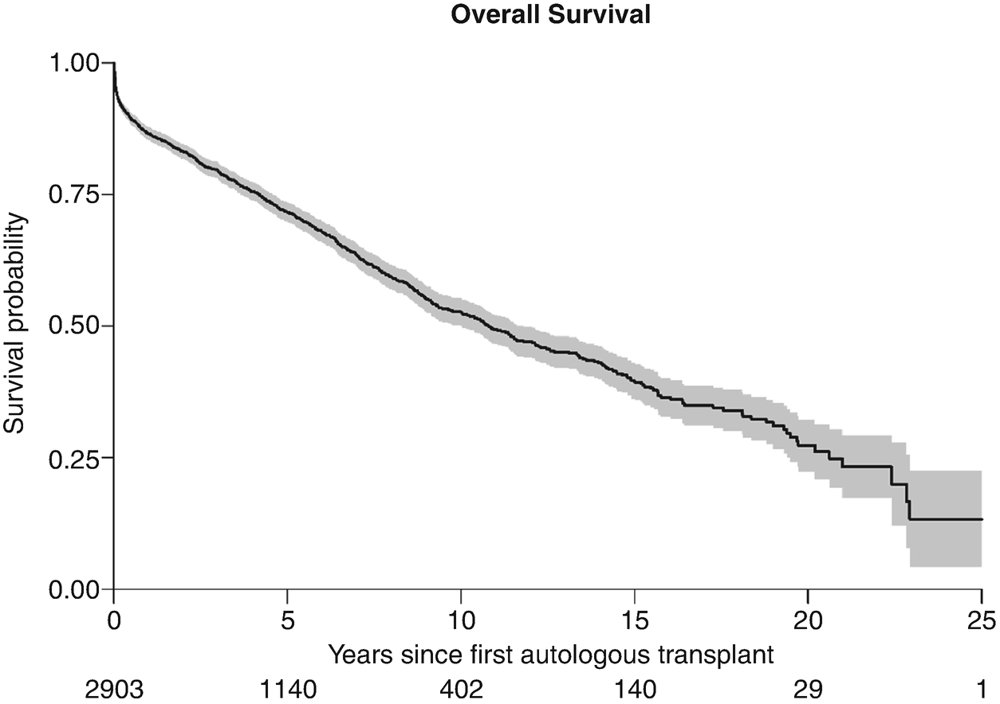

# Chapter 82. Systemic Light Chain Amyloidosis

> **Source:** Sureda A, Corbacioglu S, Greco R, Kröger N, Carreras E (eds). *The EBMT Handbook: Hematopoietic Cell Transplantation and Cellular Therapies*, 8th ed. Springer, Cham; 2024. pp. 751–755. https://doi.org/10.1007/978-3-031-44080-9_82  
> **Authors:** Minnema, Monique; Schönland, Stefan  
>   - Minnema, Monique: UMC Utrecht, University Utrecht  
>   - Schönland, Stefan: University Hospital of Heidelberg  
> **License:** CC BY 4.0 (https://creativecommons.org/licenses/by/4.0/). Text reproduced verbatim from the open-access HTML edition; formatting converted to Markdown.

## Abstract

Systemic light chain (AL) amyloidosis is a rare protein misfolding and deposition disorder. Clonal plasma cells or rarely B cells produce immunoglobulin light chains with the potential to misfold. Treatment is clone directed with the goal to achieve a complete or at least very good hematological remission. AutoHCT is an option in a selected group of patients. Results from cellular therapies are encouraging and will play an important role in the future.

## 82.1 Definition and Epidemiology

Systemic light chain (AL) amyloidosis is a protein misfolding and deposition disorder with an incidence of 5–10 persons per million per year. Clonal plasma cells or rarely B cells produce immunoglobulin light chains with the potential to misfold. These light chains are deposited as extracellular amyloid fibrils in peripheral tissues and cause morbidity and mortality. Organs most frequently involved are the heart, kidney, liver, autonomic and peripheral nervous system, gastrointestinal tract, and soft tissue.

## 82.2 Diagnosis

AL amyloidosis should be suspected in any patient with a monoclonal gammopathy and a compatible clinical syndrome such as heart failure with a preserved ejection fraction, nephrotic range proteinuria, unexplained weight loss, peripheral neuropathy, a bleeding diathesis, or carpal tunnel syndrome. Gammopathy work-up should include a serum-free light chain (FLC) assay, immunofixation of serum and urine, bone marrow cytology, flow cytometry, histology and iFISH, and a full-body scan to exclude bone lesions due to symptomatic multiple myeloma (MM). Amyloidosis is diagnosed by histopathology with Congo red staining and the typical apple-green birefringence under polarized light. Screening biopsies such as abdominal fat, salivary gland, upper GI tract, or bone marrow as well as symptomatically involved organs can be utilized (Palladini et al. 2020). The amyloid subtype (i.e., AL, ATTR, AA, or another even more rare subtype) has to be further confirmed by immunohistochemistry, immune electron microscopy, or laser microdissection and mass spectrometry. Besides the more common systemic AL amyloidosis, this type of amyloidosis can also occur as a local presentation with a very good prognosis, for example, in the pharynx or bladder, and requires another treatment approach which will not be discussed in this chapter.

## 82.3 Classification

AL amyloidosis can be classified by the origin of the underlying bone marrow disease: a clonal plasma cell or more rarely lymphoid dyscrasia, which is often an IgM related AL amyloidosis. Plasma cell dyscrasias can further be divided into monoclonal gammopathy, smoldering MM, and symptomatic MM among other things depending on the size of the clone. Each of those can lead to AL amyloidosis, but the clone is usually small (Palladini et al. 2020).

## 82.4 Risk Factors and Prognostic Scores

The underlying bone marrow disease as well as organ damage-related biomarkers can be utilized to stratify patients into risk groups. A bone marrow plasma cell infiltration above 10% and a high difference between involved and uninvolved serum-free light chain (dFLC) are negative prognostic factors for overall survival. Comparable to MM genetic aberrations can be detected on iFISH in plasma cell dyscrasias and be utilized to predict response to specific treatments (e.g., in patients with translocation (11;14) HDM/HCT is more effective) (Palladini et al. 2020).

Commonly used is the cardiac biomarker based classification from the Mayo clinic with the European modification. This staging system uses the biomarkers NT-ProBNP and cardiac troponins (cTnI, cTnT) measured at diagnosis. This classification system with stages I, II, IIIa, and IIIb is strongly related with survival and also provides guidance for the intensity of treatment that patients can tolerate.

For patients with renal involvement, total proteinuria/24 h and estimated glomerular filtration rate (eGFR) can anticipate the risk for terminal renal failure. The depth of response is also a significant prognostic factor as patients achieving an amyloidosis VGPR (dFLC below 40 mg/L) or CR after treatment have a significantly better outcome (Palladini et al. 2020).

## 82.5 First-Line Treatment

Risk-adapted treatment is strongly preferred and many patients are fragile and do not tolerate standard used dosing regimens (see Table 82.1). Three categories are defined with low-risk patients, transplant eligible, being a minority (≤20%). High-risk patients are defined by Stage IIIb and/or having NYHA class III or IV heart disease. Other factors to consider are age, performance status, eGFR, neuropathy and systolic blood pressure. Frequent assessments of hematological response during treatment are needed, and the goal is to achieve a CR or VGPR as a deep hematologic response is closely related to survival. Patients having a hematologic response may gradually achieve an organ response.

**Table 82.1 First-line treatment options according to risk status**

<table>
<thead>
<tr>
<th>
Risk status
</th>
<th>
Treatment
</th>
</tr>
</thead>
<tbody>
<tr>
<td>
Low risk

Stage I
</td>
<td>
 • (± induction treatment) Mel (200 mg/m2) + autoHCT

 • Daratumumab CyBorD or CyBorD
</td>
</tr>
<tr>
<td>
Intermediate risk

Stages II–IIIa
</td>
<td>
 • Daratumumab CyBorD or CyBorD

 • Bortezomib-Mel-dex

Signficant neuropathy: Mel-dex or Lenalidomide-dex
</td>
</tr>
<tr>
<td>
High risk

Stage IIIb
</td>
<td>
 • Dose reduced therapies like Daratumumab monotherapy or

 • modified CyBorD
</td>
</tr>
</tbody>
</table>

1.  *CyBorD* cyclophosphamide, bortezomib, dexamathasoone. *Mel* melphalan

In 2021, the EMA approved the first-line treatment of Daratumumab-Cyclosphosphamide-Bortezomib-Dexamethason with Daratumumab maintenance for patients with cardiac stages I, II, IIIa after the publication of the Andromeda study (Kastritis et al. 2021). This study demonstrated a better deep hematological response as well as better major organ detoriation and hematologic progression free survival in the daratumumab-treated patients. At 6 months, more cardiac and renal responses occurred in the daratumumab group than in the control group (41.5% vs. 22.2% and 53.0% vs. 23.9%, respectively). This regimen is the current preferred treatment regimen for most patients, but excludes cardiac IIIb patients (Wechalekar et al. 2023). Transplant eligible patients can still receive AutoHCT, especially when the hematological response is less than a VGPR, because the long-term data of transplant are excellent with a low relapse rate in patients in CR (Sanchorawala et al. 2022).

## 82.6 Second-Line Treatment

There is no positive randomized trial data to guide treatment at relapse. Patients with a good duration of response who tolerate initial treatment well may be retreated with the same initial regimen. Patients with a short response are best treated with an alternative agent combination using agents to which the patient has not been exposed, autoHCT or in a clinical trial tailored to the individual patient in terms of their age, comorbidities, extent of organ involvement, and the patient’s wishes. Lenalidomide and pomalidomide can be considered in relapsed disease although data on durability of response are limited (Basset et al. 2021). Toxicity with lenalidomide is a significant issue, and it is recommended to start at a dose of 15 mg daily, with further dose reduction based on glomerular filtration rate (GFR) (Basset et al. 2021). Patients with t(11;14) have a very high chance for reaching a VGPR or CR with venetoclax (Premkumar et al. 2021) with a reasonable toxicity making this treatment very appealing.

## 82.7 Autologous HCT

### 82.7.1 Indication

Eligibility criteria for autoHCT are variable depending on the transplanting center. However, the usual eligibility criteria include age ≤ 70 years, performance status 0–2, NYHA class I or II, absence of significant clinical cardiac involvement (NT pro BNP \<5000 ng/L, left ejection fraction ≥45 to 50%), absence of severe orthostatic hypotension (i.e., systolic blood pressure ≥ 90 mm Hg), and eGFR \>40 mL/min. Induction therapy before stem cell mobilization can be given, especially in patients who fulfill (smoldering) myeloma definition criteria, i.e., ≥10% bone marrow plasma cell infiltration.

The correct selection of patients is extremely important since the mortality associated with autoHCT in AL amyloidosis can be unacceptable high if not done properly. Since the selection criteria also include the cardiac biomarkers, treatment-related mortality has dropped from around 20 to 2%; also see Table 82.2.

**Table 82.2 Summary of the outcome of patients with systemic AL amyloidosis undergoing autologous stem cell transplantation, according to the more recent publications**

<table style="width:100%;">
<thead>
<tr>
<th>
Source
</th>
<th>
Type
</th>
<th>
No. of patients
</th>
<th>
Overall response rate (CR) (%)
</th>
<th>
TRM (%)
</th>
<th>
Overall survival (%)
</th>
</tr>
</thead>
<tbody>
<tr>
<td>
Landau et al. (2017)
</td>
<td>
Retrospective
</td>
<td>
143
</td>
<td>
CR 43% at 12 months (83 pts. only)
</td>
<td>
5%
</td>
<td>
Median 10.4 years
</td>
</tr>
<tr>
<td>
D’Souza et al. (2015)
</td>
<td>
Retrospective
</td>
<td>
1536
</td>
<td>
ORR 71%

CR 37% (2007–2012 cohort)
</td>
<td>
5% (2007–2012 cohort)
</td>
<td>
5 years 77% (2007–2012 cohort)
</td>
</tr>
<tr>
<td>
Minnema et al. (2019)
</td>
<td>
Prospective
</td>
<td>
50
</td>
<td>
ORR 86%

CR 46%
</td>
<td>
0%
</td>
<td>
5 years 86%
</td>
</tr>
<tr>
<td>
Abdallah et al. (2020)
</td>
<td>
Retrospective
</td>
<td>
651
</td>
<td> </td>
<td> </td>
<td>
13 vs. 11.4 years, early vs. deferred ASCT
</td>
</tr>
</tbody>
</table>

### 82.7.2 Recommended

Stem cell mobilization and leucapheresis can be associated with unusual morbidity, and a syndrome of hypoxia and hypotension has been described both during mobilization with G-CSF and during the leucapheresis procedure itself, probably as a result of a capillary leak syndrome triggered by G-CSF. Therefore, use of reduced doses of G-CSF (such as 10 μg/kg per day for 4–5 days) is recommended. In low-burden disease (i.e., plasma cells \<10%), the use of CY mobilization chemotherapy does not seem to be necessary.

Conditioning regimens are based on high-dose MEL. The usual MEL dose is 200 mg/m², since lower dose melphalan is associated with decreased hematological response and PFS and therefore other treatment non-transplant options may be more suitable (Cibeira et al. 2011).

### 82.7.3 Results

Figure 82.1 shows OS of patients included in the EBMT database treated with autoHCT with a median survival longer than 10 years. In Table 82.2, the results from other publications are summarized. The use of induction therapy before HCT has been more frequently applied and seems to demonstrate better hematologic responses than HCT alone (Gustine et al. 2022).

**Fig. 82.1**

AutoHCT EBMT data (patients treated from 1993 until 2021), with a median follow-up of 46 months for patients alive

## 82.8 Cellular Therapies

The largest retrospective analysis on allo-HCT for AL amyloidosis was performed by the EBMT in 2006 (Schönland et al. 2006). Nineteen patients were analyzed. Seven patients received MAC, and eight RIC. 40% of patients died of TRM. Long-term survival and sustained CR were achieved in seven patients and were associated with chronic GVHD in the majority of them. DLI has been successfully performed in a few patients with AL amyloidosis, thereby demonstrating a potent “graft-versus-plasma cell-dyscrasia” effect. The EBMT initiated a noninterventional prospective study (NIS) for patients with AL amyloidosis undergoing allo-HCT. Preliminary results have been presented at the EBMT meeting in 2016 with improved overall survival of more than 70% after 5 years. Allo-HCT after RIC can be discussed as a treatment option for relapse after auto-HCT in patients \<60 years with preserved organ functions and a HLA-identical donor. It might be a curative treatment for highly selected patients.

To date, there are only 9 cases published (some only as abstract) by centers in Spain and Israel who have been treated with academic BCMA CAR T-cells. Efficacy and tolerability have been very good. All patients achieved CR of the underlying clonal bone marrow disorder and organ responses could be observed (Oliver-Caldes et al. 2021; Kfir-Erenfeld et al. 2022). Clinical trials are on the way to apply this treatment to a larger cohort of AL amyloidosis patients.

### Major Key Points

- AL amyloidosis therapy is directed against the underlying plasma cell or B cell clone.

- Deep hematological response is the goal of therapy and improves survival.

- Intensity of chemotherapy has to be risk adapted.

- High-dose chemotherapy with auto-HCT is still a good choice for low-risk patients treated in experienced centers.

- Results from cellular therapies are encouraging and will play an important role in the future.

## References

- Abdallah N, Sidana S, Dispenzieri A, et al. Outcomes with early vs. deferred stem cell transplantation in light chain amyloidosis. Bone Marrow Transplant. 2020;55(7):1297–304.

- Basset M, Kimmich CR, Schreck N, et al. Lenalidomide and dexamethasone in relapsed/refractory immunoglobulin light chain (AL) amyloidosis: results from a large cohort of patients with long follow-up. Br J Haematol. 2021;195(2):230–43.

- Cibeira MT, Sanchorawala V, Seldin DC, et al. Outcome of AL amyloidosis after high-dose melphalan and autologous stem cell transplantation: long-term results in a series of 421 patients. Blood. 2011;118:4346–52.

- D’Souza A, Dispenzieri A, Wirk B, et al. Improved outcomes after autologous hematopoietic cell transplantation for light chain amyloidosis: a Center for International Blood and Marrow Transplant Research Study. J Clin Oncol. 2015;33:3741–9.

- Gustine JN, Staron A, Szalat RE, et al. Predictors of hematologic response and survival with stem cell transplantation in AL amyloidosis: a 25-year longitudinal study. Am J Hematol. 2022;97(9):1189–99.

- Kastritis E, Palladini G, Minnema MC, et al. Daratumumab-based treatment for immunoglobulin light-chain amyloidosis. N Engl J Med. 2021;385(1):46–58.

- Kfir-Erenfeld S, Asherie N, Grisariu S, et al. Feasibility of a novel academic BCMA-CART (HBI0101) for the treatment of relapsed and refractory AL amyloidosis. Clin Cancer Res. 2022;28(23):5156–66.

- Landau H, Smith M, Landry C, et al. Long-term event-free and overall survival after risk-adapted melphalan and SCT for systemic light chain amyloidosis. Leukemia. 2017;31:136–42.

- Minnema MC, Nasserinejad K, Hazenberg B, et al. Bortezomib-based induction followed by stem cell transplantation in light chain amyloidosis: results of the multicenter HOVON 104 trial. Haematologica. 2019;104(11):2274–82.

- Oliver-Caldes A, Jimenez R, Espanol-Rego M, et al. First report of CART treatment in AL amyloidosis and relapsed/refractory multiple myeloma. J Immunother Cancer. 2021;9(12)

- Palladini G, Milani P, Merlini G. Management of AL amyloidosis in 2020. Blood. 2020;136(23):2620–7.

- Premkumar VJ, Lentzsch S, Pan S, et al. Venetoclax induces deep hematologic remissions in t(11;14) relapsed/refractory AL amyloidosis. Blood Cancer J. 2021;11(1):10.

- Sanchorawala V, Boccadoro M, Gertz M, et al. Guidelines for high dose chemotherapy and stem cell transplantation for systemic AL amyloidosis: EHA-ISA Working Group Guidelines. Amyloid. 2022;29(1):1–7.

- Schönland SO, Lokhorst H, Buzyn A, et al. Allogeneic and syngeneic hematopoietic cell transplantation in patients with amyloid light-chain amyloidosis: a report from the European Group for Blood and Marrow Transplantation. Blood. 2006;107(6):2578–84.

- Wechalekar AD, Cibeira MT, Gibbs SD, et al. Guidelines for non-transplant chemotherapy for treatment of systemic AL amyloidosis: EHA-ISA working group. Amyloid. 2023;30(1):3–17.
