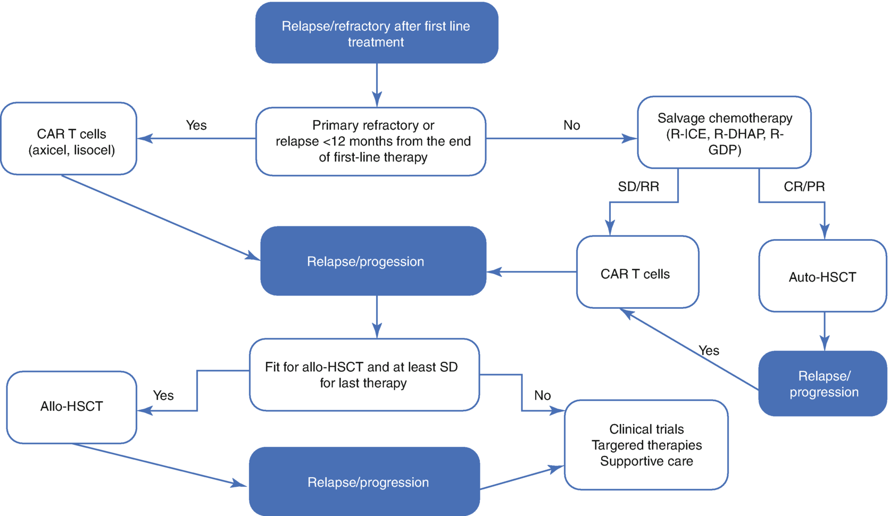

# Chapter 86. Large B-Cell Lymphoma

> **Source:** Sureda A, Corbacioglu S, Greco R, Kröger N, Carreras E (eds). *The EBMT Handbook: Hematopoietic Cell Transplantation and Cellular Therapies*, 8th ed. Springer, Cham; 2024. pp. 777–785. https://doi.org/10.1007/978-3-031-44080-9_86  
> **Authors:** Bento, Leyre; Glass, Bertram; Schmitz, Norbert  
>   - Bento, Leyre: Son Espases University Hospital, IdISBa, University of Balearic Islands  
>   - Glass, Bertram: Helios Hospital Berlin-Buch  
>   - Schmitz, Norbert: University Hospital Münster  
> **License:** CC BY 4.0 (https://creativecommons.org/licenses/by/4.0/). Text reproduced verbatim from the open-access HTML edition; formatting converted to Markdown.

## Abstract

The most recent WHO classification of tumors of hematopoietic and lymphoid tissues (Alaggio et al. 2022) classifies large B cell lymphomas (LBCL) into diffuse large B cell lymphoma (DLBCL) NOS with distinct morphological and molecular (germinal center B-cell, activated B-cell) subtypes, high-grade B-cell lymphomas (with MYC and BCL2 rearrangements or NOS subtype), and other less frequent subtypes.

## 86.1 Definition and Epidemiology

The most recent WHO classification of tumors of hematopoietic and lymphoid tissues (Alaggio et al. 2022) classifies large B cell lymphomas (LBCL) into diffuse large B cell lymphoma (DLBCL) NOS with distinct morphological and molecular (germinal center B-cell, activated B-cell) subtypes, high-grade B-cell lymphomas (with MYC and BCL2 rearrangements or NOS subtype), and other less frequent subtypes.

With some important exceptions, diagnostic work-up and treatment are identical in all LBCL subtypes. It is beyond the scope of this article to fully describe the exceptions; we mention the most important differences but otherwise focus on transplantation and cell therapy for patients with relapsed/refractory (R/R) LBCL.

DLBCL is the most frequent lymphoma subtype and accounts for approximately one third of newly diagnosed lymphoma cases worldwide. In Europe, the 10-year prevalence of DLBCL is estimated at 43.3 per 100,000 per year (Smith et al. 2015). The disease is slightly more frequent in men than in women; it mostly is a disease of the elderly (median patient age beyond 60 years) but can occur also in children and adolescents.

## 86.2 Diagnosis

The diagnosis is made according to the WHO classification from a sufficiently large surgical specimen or excisional lymph node biopsy; needle biopsies are not recommended. Beyond morphological evaluation by an experienced pathologist, determination of the immunophenotype of the malignant cells (positivity of malignant cells for CD19 and CD20 must be documented because of its therapeutic consequences) and determination of the cell of origin by adequate molecular methods are required (Alaggio et al. 2022).

## 86.3 Classification

The LBCL comprise the morphological and molecular subtypes of DLBCL NOS, high-grade B-cell lymphomas, and other LBCL (see Paragraph 1).

The WHO classification describes 14 other lymphomas of large B cells. Among these, primary large B-cell lymphoma of immune privileged sites (CNS, testicle, and vitreoretina), lymphomatoid granulomatosis, primary mediastinal large B-cell lymphoma (PMBCL), and plasmablastic lymphoma not only show significant differences in pathogenesis and clinical manifestation but in most centers are treated different from classical DLBCL. In order to fulfill all WHO requirements, the cell of origin (GCB or ABC-subtype by IHC or gene expression profiling) and the presence/absence of distinct chromosomal translocations (BCL2 and MYC by FISH testing or IHC) must be determined.

## 86.4 Risk Factors

The International Prognostic Index (IPI) remains the most important tool in order to estimate the prognosis of patients with LBCL (Ziepert et al. 2010). The IPI takes into account five factors (age, stage, LDH, performance status, and number of extranodal sites involved). Patients within the low (IPI 0, 1), low-intermediate (IPI 2), high-intermediate (IPI 3), and high-risk group (IPI 4, 5) can expect 3-year overall survival of 91.4%, 80.9%, 65.1%, and 59.0%, respectively, if treated with R-CHOP or one of its variants. Other clinical risk factor models (R-IPI; NCCN-IPI) (Sehn et al. 2007; Zhou et al. 2014) have been proposed, but advantages over the original IPI seem limited.

## 86.5 First-Line Treatment

First-line treatment of patients with LBCL generally consists of RTX at standard dose (375 mg/sqm) in combination with CHOP (CY, DOXO, VCR, and PRD). Six cycles of R-CHOP are generally used. Patients with early disease (IPI 0 and 1) have been treated with abbreviated chemotherapy and involved-field radiotherapy (RT). Some studies do not support a role for RT in such patients (Lamy et al. 2018). In patients with IPI 2–5, radiotherapy to bulky and extranodal disease is regularly recommended after R-CHOP in some but not in the majority of countries. Recently, prospective randomized trial has confirmed the benefit of adding polatuzumab to R-CHP in patients with IPI ≥2 in terms of progression-free survival (Tilly et al. 2022).

Several studies failed to demonstrate an advantage of consolidation with auto-HCT over conventional chemotherapy; therefore, it is generally not recommended as part of first-line therapy in LBCL.

Patients with primary large B-cell lymphoma of immuned privileged sites must receive chemotherapy penetrating into the CNS. More aggressive chemotherapies (CHOEP, DA-EPOCH, or ACVBP) in combination with RTX with or without RT are recommended in patients with PMBCL or plasmablastic lymphoma. Also, more intensive therapy has been recommended for patients with MYC and BCL2 rearrangements based mainly on retrospective studies (Oki et al. 2014).

## 86.6 Second-Line Treatment

The principles of management of relapsed and refractory (R/R) LBCL are shown in Table 86.1. CAR T cells have become the standard of care for patients with refractory disease or early relapse (within 12 months from the end of first-line therapy). Auto-HCT is currently considered an option for patients with R/R LBCL especially in late relapse. All chemotherapy-based salvage regimens cause hematologic toxicity in many cases necessitating RBC and platelet transfusions. Mucositis, gastrointestinal toxicities, neutropenic fever, and infections are reported in a significant proportion of patients. Nephrotoxicity, hepatotoxicity, and other nonhematologic toxicities are also observed. Failure to mobilize hematopoietic stem cells in 10–20% of cases occurs with all salvage regimens. Efficacy of different salvage options is shown in Table 86.2.

**Table 86.1 Management of relapsed or refractory LBCL**

<table>
<tbody>
<tr>
<td>
 – <em>New biopsy</em>: Highly recommended in all patients with R/R LBCL. Core biopsies acceptable

 – <em>Radiological evaluation</em>: PET/CT recommended for evaluation of treatment outcome
</td>
</tr>
<tr>
<td>
 – <em>Salvage therapy followed by auto-HCT</em> is currently considered the standard of care for patients with R/R DLBCL with late relapse (&gt;12 months from the end of first-line therapy)

 – <em>CAR T cells</em> is considered standard of care for patients with refractory disease or early relapse (within 12 months from the end of first-line therapy)

 – <em>Allo-HCT</em> could be considered a potential treatment option in younger patients without comorbidities especially in patients with R/R after CAR T cells and with chemosensitive disease
</td>
</tr>
<tr>
<td>
 – <em>Selection of salvage therapy</em>: Randomized studies failed to show significant differences in terms of efficacy or toxicity with different salvage regimens. Therefore, salvage strategies should take into account individual patient characteristics (age and comorbidities) considering potential cumulative hematologic and nonhematologic toxicity and the possibility of harvesting stem cells. Cardiac, pulmonary, renal, and liver function should be evaluated prior to treatment

 – The objective of salvage chemotherapy is to induce a complete or partial response indicating that the tumor remains chemosensitive, this having a major impact on outcome after transplantation. PET negativity after salvage therapy is a surrogate marker of chemosensitivity and predicts patient outcome after auto-HCT
</td>
</tr>
</tbody>
</table>

**Table 86.2 Response to salvage regimens**

<table>
<tbody>
<tr>
<td colspan="2">
Regimens compared in prospective randomized trials
</td>
</tr>
<tr>
<td>
R-DHAP (Gisselbrecht et al. 2010)
</td>
<td>
Dexamethasone, cytarabine, cisplatin

ORR 62.8% (44.1%)a, CR 28% (14.3%)a
</td>
</tr>
<tr>
<td>
R-GDP (Crump et al. 2014)
</td>
<td>
Gemcitabine, dexamethasone, cisplatin

ORR 45.1%, CR 13.5% after 2 cycles
</td>
</tr>
<tr>
<td>
R-ICE (Gisselbrecht et al. 2010)
</td>
<td>
Ifosfamide, carboplatin, etoposide

ORR 63.5%, CR 24%
</td>
</tr>
<tr>
<td colspan="2">
Addition of new drugs (lenalidomide, ibrutinib, brentuximab vedotin, polatuzumab, other) to RTX-chemo in order to improve response rates of salvage regimens is not recommended outside clinical trials
</td>
</tr>
</tbody>
</table>

1.  aPercentages in brackets from Crump et al. (2014)

## 86.7 Autologous HCT

Auto-HCT is still considered the standard of care for patients with late relapse (\>12 months from the end of first-line therapy) in PR or CR after salvage therapy and could be an option treatment for patients with early relapse or primary refractory disease when CAR T cells are not available. EBMT indications (Snowden et al. 2022) for auto-HCT in LBCL are shown in Table 86.3. Auto-HCT is generally not recommended as part of first-line therapy in DLBCL; however, it could be considered in those patients with high-grade B cell lymphomas treated with R-CHOP like regimens and in LBCL with CNS involvement at diagnosis with chemosensitive disease. We discourage auto-HCT for patients with refractory disease not responding to salvage therapy.

**Table 86.3 Indications for auto-HCT in LBCL**

<table>
<thead>
<tr>
<th>
Disease status
</th>
<th>
Recommendations
</th>
</tr>
</thead>
<tbody>
<tr>
<td>
First complete remission
</td>
<td>
Clinical option

Level of evidence I
</td>
</tr>
<tr>
<td>
Chemosensitive early relapse, ≥CR2
</td>
<td>
Clinical option

Level of evidence I
</td>
</tr>
<tr>
<td>
Chemosensitive late relapse, ≥CR2
</td>
<td>
Standard of care

Level of evidence II
</td>
</tr>
<tr>
<td>
Refractory disease
</td>
<td>
Generally not recommended

Level of evidence I
</td>
</tr>
</tbody>
</table>

### 86.7.1 HSC Source

PBSC is used in \>90% of auto-HCT.

### 86.7.2 Consolidation (High-Dose Therapy)

Consolidation (high-dose therapy) should eliminate malignant cells with minimal impact on organ systems other than hematopoiesis. The choice of the preparative regimen varies and is based on institutional experience rather than evidence. The BEAM regimen typically consisting of BCNU (300 mg/m² × 1, day-6), VP (200 mg/m², days −5 to −2), Ara-C (200 mg/m² bid, days −5 to −2), and MEL (140 mg/kg/day ×1, days −1) is the preferred regimen in EBMT centers.

Acute toxicities of BEAM include severe mucositis, nausea and vomiting, diarrhea, hepatotoxicity, nephrotoxicity, and noninfective pulmonary complications. Late toxicities include pulmonary complications such as chronic interstitial fibrosis and decrease in lung diffusion capacity (21%), infection (30%), metabolic syndrome (17%), cardiovascular complications (12%), secondary tumors (20%), and other toxicities (20%). The most frequent cause of NRM is subsequent malignancy (12-fold increased risk compared with the general population). Late death is also attributed to cardiac toxicity (2%), pulmonary complications (2%), and other treatment-related toxicities (15%).

Other high-dose regimens have been used sometimes because of shortage of MEL or BCNU. Some publications suggest that the BEAC (CY) and TEAM (TT) regimens show efficacy and toxicity similar to BEAM in most if not all lymphoma subtypes (Robinson et al. 2018).

### 86.7.3 Prognostic Factors

Adverse prognostic factors for auto-HCT identified in prospective studies include early relapse within 12 months of induction therapy (Crump et al. 2017), secondary age-adjusted IPI, poor performance status, and involvement of two or more extranodal sites at relapse.

### 86.7.4 Results of Auto-HCT

|                                        | NRM  | OS at 3 years   | EFS at 3 years  |
|----------------------------------------|------|-----------------|-----------------|
| Gisselbrecht et al. (2012)a | 1.4% | 51% (DHAP)      | 35% (DHAP)      |
| Crump et al. (2014)a        | NR   | 39% (both arms) | 26% (both arms) |

1.  aResults from prospective randomized studies. Differences in OS and EFS may be explained by differing patient characteristics and study design

### 86.7.5 Consolidation Treatment After Auto-HCT

There are no data and no recommendation for consolidative therapy after auto-HCT for LBCL. In the CORAL study (Gisselbrecht et al. 2012), RTX maintenance did not improve outcome.

### 86.7.6 Tandem Transplantation

No data from the RTX era are available.

### 86.7.7 Relapse After Auto-HCT

CAR T cells therapy is considered the standard treatment for these patients. Results of CAR T cells after failure of auto-HCT are reported below. Data on the use of new drugs such as bispecific antibodies are promising but currently in clinical trials (Thieblemont et al. 2023; Dickinson et al. 2022).

## 86.8 CAR T Cells

Recently, anti-CD19 CAR T cells, axicabtagene ciloleucel and lisocaptagene maraleucel, show significant improvement in PFS and a strong trend in OS in two phase III clinical studies in high-risk R/R LBCL compared with salvage therapy followed by auto-HCT (Locke et al. 2022; Kamdar et al. 2021). For this reason, CAR T cells have been recently considered the best option for patients with refractory disease or early relapse.

CAR T cells have been considered the standard of care for patients failing an autograft (grade of evidence I) (Schuster et al. 2019; Neelapu et al. 2017). Real-world evidence in third line use has been recently published confirming the efficacy and safety of these approach. These studies support higher efficacy and also a higher toxicity of axi-cel compared to tisa-cel (Bachy et al. 2022; Bethge et al. 2022).

There are some advantages of CAR T cells comparing with HCT; chemosensitivity is not needed and patients that are not candidates for HCT because of age or comorbidities could be rescued with this strategy (Sehgal et al. 2022).

## 86.9 Allogeneic HCT

Allo-HCT is still considered a curative treatment option for patients with LBCL who relapse or progress after CAR T cells (Mussetti et al. 2023). Survival and NRM for allo-HCT in LBCL are summarized in Table 85.9.6.

The only prospective randomized clinical trial reported so far including patients with R/R T and B aggressive lymphomas who underwent allo-HCT with MAC conditioning confirmed 3 year-PFS and OS 25% and 26%, respectively (Glass et al. 2014). Haploidentical allo-HCT with post-transplant cyclophosphamide (PT-CY) as GVHD prophylaxis has been associated with a lower chronic GVHD compared with matched sibling receiving calcineurin inhibitor-based prophylaxis and unrelated donor (URD) with or without T-cell depletion (Dreger et al. 2019). These data show that allo-HCT should be still considered a curative option for patients relapsing after CAR T cells.

### 86.9.1 Stem Cell Source

PBSC is the preferred stem cell source for allo-HCT. The use of haploidentical donors has somewhat increased the use of BM in some of the series.

### 86.9.2 Donor Selection

In recent years, there has been a significant increase in the use of haploidentical donors for allo-HCT after the introduction of PT-CY. Retrospective analyses from EBMT and CIBMTR (Kanate et al. 2016) suggest that allo-HCT from HLA-identical family and URD or from haploidentical donors give comparable results. However, no prospective clinical trials comparing haploidentical donors versus HLA-identical siblings and MUD have been published so far.

### 86.9.3 Conditioning

RIC regimens reduce NRM after transplantation in many indications but also tend to increase RI after transplantation. Because no prospective clinical trials demonstrating the superiority of one conditioning regimen over another have been reported, the question if RIC or MAC should be preferred cannot generally be answered. Aggressive disease not completely responding to salvage therapy and high tumor are situations where MAC should be considered.

### 86.9.4 Prognostic Factors

The most important adverse prognostic factor that impacts long-term outcome of patients being treated with allo-HCT is disease status before the treatment. However, unlike the situation with auto-HCT, also patients not perfectly responding to salvage therapy, e.g., patients with minor response or stable disease, may benefit from allo-HCT.

### 86.9.5 The Use of Allo-HCT in the Era of New Drugs and CAR T Cells

Allo-HCT is still a curative therapeutic strategy for fit patients with chemosensitive disease, especially relapsing after CAR T cells or whenever CAR T cells are not available.

### 86.9.6 Results of Allo-HCT

|                      | NRM (%) | OS at 3 years (%) | PFS at 3 years (%) |
|----------------------|---------|-------------------|--------------------|
| Glass et al. (2014)  | 35      | 26                | 25                 |
| Fenske et al. (2016) | 30      | 31                | 37                 |
| Bento et al. (2021)  | 30      | 44                | 38                 |

### 86.9.7 Disease Relapse After Allo-HCT

Patients relapsing after allo-HCT generally have a poor prognosis. Clinical trials should be actively considered including bispecific antibodies or other targeted therapies such as polatuzumab or lenalidomide. Unfortunately, palliative care is a reality in many cases.

### 86.9.8 Therapeutic Algorithm Recommended by the Authors (See Fig. 86.1)

See Fig. 86.1.

**Fig. 86.1**

HCT and CAR T cells in R/R LBCL: treatment decision

### Key Points

- Auto-HCT is generally not recommended as part of first-line therapy in LBCL. It is still the standard of care for those LBCL patients with chemosensitive first late relapse.

- CAR T cells are considered standard of care for patients with refractory disease, early relapse (within 12 months from the end of first-line therapy) or patients relapsing after auto-HCT.

- Allo-HCT is the only curative treatment option for fit patients with relapse disease after CART cells. Conditioning should be guided by the individual clinical situation.

## References

- Alaggio R, Amador C, Anagnostopoulos I, Attygalle AD, de Araujo IBO, Berti E, Bhagat G, Borges AM, Boyer D, Calaminici M, Chadburn A, Chan JKC, Cheuk W, Chng W-J, Choi JK, Chuang S-S, Coupland SE, Czader M, Dave SS, de Jong D, et al. The 5th edition of the World Health Organization classification of haematolymphoid tumours: lymphoid neoplasms. Leukemia. 2022;36:1720–48.

- Bachy E, Le Gouill S, Di Blasi R, Sesques P, Manson G, Cartron G, Beauvais D, Roulin L, Gros FX, Rubio MT, Bories P, Bay JO, Llorente CC, Choquet S, Casasnovas R-O, Mohty M, Guidez S, Joris M, Loschi M, Carras S, et al. A real-world comparison of tisagenlecleucel and axicabtagene ciloleucel CAR T cells in relapsed or refractory diffuse large B cell lymphoma. Nat Med. 2022;28:2145–54.

- Bento L, Gutiérrez A, Novelli S, Montoro J, Piñana JL, López-Corral L, Cabrero M, Martín-Sancho A, Gutiérrez-García G, Ortiz-Moscovich M, Bastos-Oreiro M, Dorado N, Pérez A, Hernani R, Ferrà C, Parody R, García-Cadenas I, Herrera P, Rodríguez G, Rodríguez N, et al. Allogeneic stem cell transplantation as a curative option in relapse/refractory diffuse large B cell lymphoma: Spanish multicenter GETH/GELTAMO study. Bone Marrow Transplant. 2021;56:1919–28.

- Bethge WA, Martus P, Schmitt M, Holtick U, Subklewe M, von Tresckow B, Ayuk F, Wagner-Drouet EM, Wulf GG, Marks R, Penack O, Schnetzke U, Koenecke C, von Bonin M, Stelljes M, Glass B, Baldus CD, Vucinic V, Mougiakakos D, Topp M, et al. GLA/DRST real-world outcome analysis of CAR T-cell therapies for large B-cell lymphoma in Germany. Blood. 2022;140:349–58.

- Crump M, Kuruvilla J, Couban S, MacDonald DA, Kukreti V, Kouroukis CT, Rubinger M, Buckstein R, Imrie KR, Federico M, Di Renzo N, Howson-Jan K, Baetz T, Kaizer L, Voralia M, Olney HJ, Turner AR, Sussman J, Hay AE, Djurfeldt MS, et al. Randomized comparison of gemcitabine, dexamethasone, and cisplatin versus dexamethasone, cytarabine, and cisplatin chemotherapy before autologous stem-cell transplantation for relapsed and refractory aggressive lymphomas: NCIC-CTG LY.12. J Clin Oncol. 2014;32:3490–6.

- Crump M, Neelapu SS, Farooq U, Van Den Neste E, Kuruvilla J, Westin J, Link BK, Hay A, Cerhan JR, Zhu L, Boussetta S, Feng L, Maurer MJ, Navale L, Wiezorek J, Go WY, Gisselbrecht C. Outcomes in refractory diffuse large B-cell lymphoma: results from the international SCHOLAR-1 study. Blood. 2017;130:1800–8.

- Dickinson MJ, Carlo-Stella C, Morschhauser F, Bachy E, Corradini P, Iacoboni G, Khan C, Wróbel T, Offner F, Trněný M, Wu S-J, Cartron G, Hertzberg M, Sureda A, Perez-Callejo D, Lundberg L, Relf J, Dixon M, Clark E, Humphrey K, et al. Glofitamab for relapsed or refractory diffuse large B-cell lymphoma. N Engl J Med. 2022;387:2220–31.

- Dreger P, Sureda A, Ahn KW, Eapen M, Litovich C, Finel H, Boumendil A, Gopal A, Herrera AF, Schmid C, Diez-Martin JL, Fuchs E, Bolaños-Meade J, Gooptu M, Al Malki MM, Castagna L, Ciurea SO, Dominietto A, Blaise D, Ciceri F, et al. PTCy-based haploidentical vs matched related or unrelated donor reduced-intensity conditioning transplant for DLBCL. Blood Adv. 2019;3:360–9.

- Fenske TS, Ahn KW, Graff TM, DiGilio A, Bashir Q, Kamble RT, Ayala E, Bacher U, Brammer JE, Cairo M, Chen A, Chen Y-B, Chhabra S, D’Souza A, Farooq U, Freytes C, Ganguly S, Hertzberg M, Inwards D, Jaglowski S, et al. Allogeneic transplantation provides durable remission in a subset of DLBCL patients relapsing after autologous transplantation. Br J Haematol. 2016;174:235–48.

- Gisselbrecht C, Glass B, Mounier N, Singh Gill D, Linch DC, Trneny M, Bosly A, Ketterer N, Shpilberg O, Hagberg H, Ma D, Brière J, Moskowitz CH, Schmitz N. Salvage regimens with autologous transplantation for relapsed large B-cell lymphoma in the rituximab era. J Clin Oncol. 2010;28:4184–90.

- Gisselbrecht C, Schmitz N, Mounier N, Singh Gill D, Linch DC, Trneny M, Bosly A, Milpied NJ, Radford J, Ketterer N, Shpilberg O, Dührsen U, Hagberg H, Ma DD, Viardot A, Lowenthal R, Brière J, Salles G, Moskowitz CH, Glass B. Rituximab maintenance therapy after autologous stem-cell transplantation in patients with relapsed CD20(+) diffuse large B-cell lymphoma: final analysis of the collaborative trial in relapsed aggressive lymphoma. J Clin Oncol. 2012;30:4462–9.

- Glass B, Hasenkamp J, Wulf G, Dreger P, Pfreundschuh M, Gramatzki M, Silling G, Wilhelm C, Zeis M, Görlitz A, Pfeiffer S, Hilgers R, Truemper L, Schmitz N, German High-Grade Lymphoma Study Group. Rituximab after lymphoma-directed conditioning and allogeneic stem-cell transplantation for relapsed and refractory aggressive non-Hodgkin lymphoma (DSHNHL R3): an open-label, randomised, phase 2 trial. Lancet Oncol. 2014;15:757–66.

- Kamdar M, Solomon SR, Arnason JE, Johnston PB, Glass B, Bachanova V, Ibrahimi S, Mielke S, Mutsaers PGNJ, Hernandez-Ilizaliturri FJ, Izutsu K, Morschhauser F, Lunning MA, Maloney DG, Crotta A, Montheard S, Previtali A, Stepan L, Ogasawara K, Mack T, et al. Lisocabtagene maraleucel (liso-cel), a CD19-directed chimeric antigen receptor (CAR) T cell therapy, versus standard of care (SOC) with salvage chemotherapy (CT) followed by autologous stem cell transplantation (ASCT) as second-line (2L) treatment in patients (Pts) with relapsed or refractory (R/R) large B-cell lymphoma (LBCL): results from the randomized phase 3 transform study. Blood. 2021;138:91. https://ashpublications.org/blood/article/138/Supplement/1/91/477568/Lisocabtagene-Maraleucel-liso-cel-a-CD19-Directed

- Kanate AS, Mussetti A, Kharfan-Dabaja MA, Ahn KW, DiGilio A, Beitinjaneh A, Chhabra S, Fenske TS, Freytes C, Gale RP, Ganguly S, Hertzberg M, Klyuchnikov E, Lazarus HM, Olsson R, Perales M-A, Rezvani A, Riches M, Saad A, Slavin S, et al. Reduced-intensity transplantation for lymphomas using haploidentical related donors vs HLA-matched unrelated donors. Blood. 2016;127:938–47.

- Lamy T, Damaj G, Soubeyran P, Gyan E, Cartron G, Bouabdallah K, Gressin R, Cornillon J, Banos A, Le Du K, Benchalal M, Moles M-P, Le Gouill S, Fleury J, Godmer P, Maisonneuve H, Deconinck E, Houot R, Laribi K, Marolleau JP, et al. R-CHOP 14 with or without radiotherapy in nonbulky limited-stage diffuse large B-cell lymphoma. Blood. 2018;131:174–81.

- Locke FL, Miklos DB, Jacobson CA, Perales M-A, Kersten M-J, Oluwole OO, Ghobadi A, Rapoport AP, McGuirk J, Pagel JM, Muñoz J, Farooq U, van Meerten T, Reagan PM, Sureda A, Flinn IW, Vandenberghe P, Song KW, Dickinson M, Minnema MC, et al. Axicabtagene ciloleucel as second-line therapy for large B-cell lymphoma. N Engl J Med. 2022;386:640–54.

- Mussetti A, Bento L, Bastos-Oreiro M, Rius-Sansalvador B, Albo C, Bailen R, Barba P, Benzaquén A, Briones J, Caballero AC, Campos A, Español I, Ferra C, López SG, González Sierra PA, Guerra LM, Hernani R, Iacoboni G, Jiménez-Ubieto A, Kwon M, et al. Role of allogeneic hematopoietic cell transplant for relapsed/refractory aggressive B-cell lymphomas in the CART era. Bone Marrow Transplant. 2023;58:738.

- Neelapu SS, Locke FL, Bartlett NL, Lekakis LJ, Miklos DB, Jacobson CA, Braunschweig I, Oluwole OO, Siddiqi T, Lin Y, Timmerman JM, Stiff PJ, Friedberg JW, Flinn IW, Goy A, Hill BT, Smith MR, Deol A, Farooq U, McSweeney P, et al. Axicabtagene ciloleucel CAR T-cell therapy in refractory large B-cell lymphoma. N Engl J Med. 2017;377:2531–44.

- Oki Y, Noorani M, Lin P, Davis RE, Neelapu SS, Ma L, Ahmed M, Rodriguez MA, Hagemeister FB, Fowler N, Wang M, Fanale MA, Nastoupil L, Samaniego F, Lee HJ, Dabaja BS, Pinnix CC, Medeiros LJ, Nieto Y, Khouri I, et al. Double hit lymphoma: the MD Anderson Cancer Center clinical experience. Br J Haematol. 2014;166:891–901.

- Robinson SP, Boumendil A, Finel H, Dreger P, Sureda A, Hermine O, Montoto S. High-dose therapy with BEAC conditioning compared to BEAM conditioning prior to autologous stem cell transplantation for non-Hodgkin lymphoma: no differences in toxicity or outcome. A matched-control study of the EBMT-lymphoma working party. Bone Marrow Transplant. 2018;53:1553–9.

- Schuster SJ, Bishop MR, Tam CS, Waller EK, Borchmann P, McGuirk JP, Jäger U, Jaglowski S, Andreadis C, Westin JR, Fleury I, Bachanova V, Foley SR, Ho PJ, Mielke S, Magenau JM, Holte H, Pantano S, Pacaud LB, Awasthi R, et al. Tisagenlecleucel in adult relapsed or refractory diffuse large B-cell lymphoma. N Engl J Med. 2019;380:45–56.

- Sehgal A, Hoda D, Riedell PA, Ghosh N, Hamadani M, Hildebrandt GC, Godwin JE, Reagan PM, Wagner-Johnston N, Essell J, Nath R, Solomon SR, Champion R, Licitra E, Fanning S, Gupta N, Dubowy R, D’Andrea A, Wang L, Ogasawara K, et al. Lisocabtagene maraleucel as second-line therapy in adults with relapsed or refractory large B-cell lymphoma who were not intended for haematopoietic stem cell transplantation (PILOT): an open-label, phase 2 study. Lancet Oncol. 2022;23:1066–77.

- Sehn LH, Berry B, Chhanabhai M, Fitzgerald C, Gill K, Hoskins P, Klasa R, Savage KJ, Shenkier T, Sutherland J, Gascoyne RD, Connors JM. The revised International Prognostic Index (R-IPI) is a better predictor of outcome than the standard IPI for patients with diffuse large B-cell lymphoma treated with R-CHOP. Blood. 2007;109:1857–61.

- Smith A, Crouch S, Lax S, Li J, Painter D, Howell D, Patmore R, Jack A, Roman E. Lymphoma incidence, survival and prevalence 2004–2014: sub-type analyses from the UK’s Haematological Malignancy Research Network. Br J Cancer. 2015;112:1575–84.

- Snowden JA, Sánchez-Ortega I, Corbacioglu S, Basak GW, Chabannon C, de la Camara R, Dolstra H, Duarte RF, Glass B, Greco R, Lankester AC, Mohty M, Neven B, de Latour RP, Pedrazzoli P, Peric Z, Yakoub-Agha I, Sureda A, Kröger N, European Society for Blood and Marrow Transplantation (EBMT). Indications for haematopoietic cell transplantation for haematological diseases, solid tumours and immune disorders: current practice in Europe, 2022. Bone Marrow Transplant. 2022;57:1217–39.

- Thieblemont C, Phillips T, Ghesquieres H, Cheah CY, Clausen MR, Cunningham D, Do YR, Feldman T, Gasiorowski R, Jurczak W, Kim TM, Lewis DJ, van der Poel M, Poon ML, Cota Stirner M, Kilavuz N, Chiu C, Chen M, Sacchi M, Elliott B, et al. Epcoritamab, a novel, subcutaneous CD3xCD20 bispecific T-cell-engaging antibody, in relapsed or refractory large B-cell lymphoma: dose expansion in a phase I/II trial. J Clin Oncol. 2023;41:2238–47.

- Tilly H, Morschhauser F, Sehn LH, Friedberg JW, Trněný M, Sharman JP, Herbaux C, Burke JM, Matasar M, Rai S, Izutsu K, Mehta-Shah N, Oberic L, Chauchet A, Jurczak W, Song Y, Greil R, Mykhalska L, Bergua-Burgués JM, Cheung MC, et al. Polatuzumab vedotin in previously untreated diffuse large B-cell lymphoma. N Engl J Med. 2022;386:351–63.

- Zhou Z, Sehn LH, Rademaker AW, Gordon LI, Lacasce AS, Crosby-Thompson A, Vanderplas A, Zelenetz AD, Abel GA, Rodriguez MA, Nademanee A, Kaminski MS, Czuczman MS, Millenson M, Niland J, Gascoyne RD, Connors JM, Friedberg JW, Winter JN. An enhanced international prognostic index (NCCN-IPI) for patients with diffuse large B-cell lymphoma treated in the rituximab era. Blood. 2014;123:837–42.

- Ziepert M, Hasenclever D, Kuhnt E, Glass B, Schmitz N, Pfreundschuh M, Loeffler M. Standard international prognostic index remains a valid predictor of outcome for patients with aggressive CD20+ B-cell lymphoma in the rituximab era. J Clin Oncol. 2010;28:2373–80.
