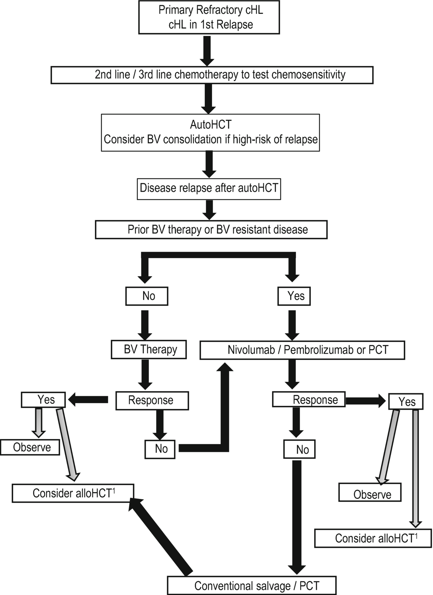
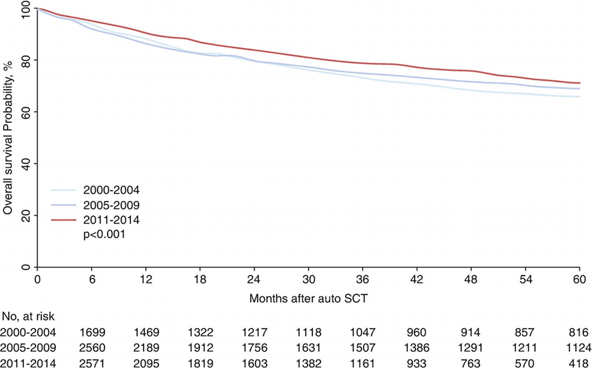
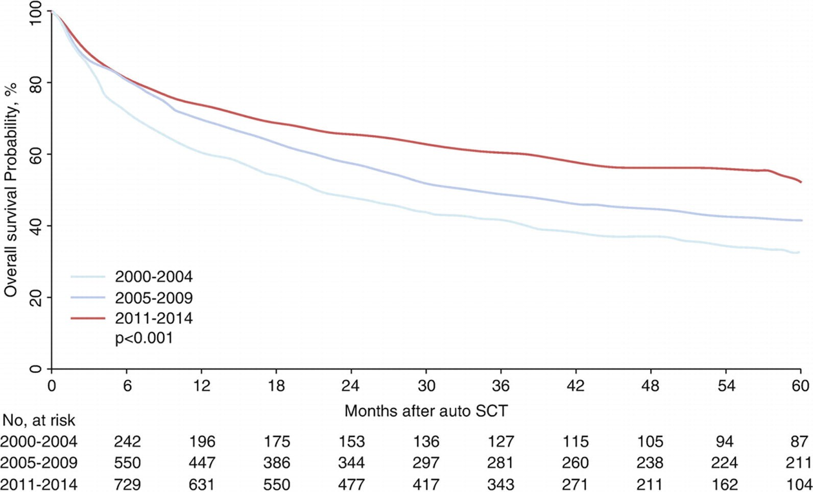

# Chapter 89. Classical Hodgkin’s Lymphoma

> **Source:** Sureda A, Corbacioglu S, Greco R, Kröger N, Carreras E (eds). *The EBMT Handbook: Hematopoietic Cell Transplantation and Cellular Therapies*, 8th ed. Springer, Cham; 2024. pp. 799–808. https://doi.org/10.1007/978-3-031-44080-9_89  
> **Authors:** Martínez, Carmen; Bazarbachi, Ali; Sureda, Anna  
>   - Martínez, Carmen: Hospital Clínic de Barcelona, Universitat de Barcelona  
>   - Bazarbachi, Ali: American University of Beirut Medical Center  
>   - Sureda, Anna: Institut Català d’Oncologia-Hospitalet  
> **License:** CC BY 4.0 (https://creativecommons.org/licenses/by/4.0/). Text reproduced verbatim from the open-access HTML edition; formatting converted to Markdown.

## Abstract

HL is a malignancy arising from germinal centre or post-germinal centre B cells. The cancer cells form a minority of the tumour and are surrounded by a reactive inflammatory milieu comprising lymphocytes, eosinophils, neutrophils, histiocytes and plasma cells. These malignant cells can be pathognomonic, multinucleate giant cells or large mononuclear cells and, together, are referred to as Hodgkin and Reed–Sternberg (HRS) cells.

## 89.1 Definition and Epidemiology

HL is a malignancy arising from germinal centre or post-germinal centre B cells. The cancer cells form a minority of the tumour and are surrounded by a reactive inflammatory milieu comprising lymphocytes, eosinophils, neutrophils, histiocytes and plasma cells. These malignant cells can be pathognomonic, multinucleate giant cells or large mononuclear cells and, together, are referred to as Hodgkin and Reed–Sternberg (HRS) cells.

HL accounts for approximately 10% of cases of newly diagnosed lymphoma. The incidence of HL in Europe is 2.2 per 100,000 per year with a mortality rate of 0.7 cases/100,000 a year. The disease is more frequent in men than in women, and peaks in incidence are noted in young adults and in people older than 60 years. Incidence has remained mostly unchanged during the past two decades.

## 89.2 Diagnosis

Pathological diagnosis should be made according to the WHO classification from a sufficiently large surgical specimen or excisional lymph node biopsy to provide enough material for fresh frozen and formalin-fixed samples (Eichenauer et al. 2014).

## 89.3 Classification

HL is classified as either classical (cHL, defined by the presence of HRS cells) or nodular lymphocyte-predominant (NLPHL). The immunophenotype of the malignant cells in cHL and NLPHL differs significantly and helps to establish the diagnosis. Four subtypes of cHL exist (nodular sclerosis, mixed cellularity, rich in lymphocytes and lymphocyte depleted), which differ in presentation, sites of involvement, epidemiology and association with EBV. Management, however, is broadly similar in all subtypes. NLPHL has a distinct clinical course, and it only represents less than 5% of the cases of HL. While in the recent fifth edition of the World Health Organization Classification of Haematolymphoid Tumours NLPHL remains an essentially unchanged diagnostic entity, in the 2022 International Consensus Classification of Mature Lymphoid Neoplasms, NLPHL is now renamed nodular lymphocyte predominant B cell lymphoma (NLPBL) in recognition of the distinct pathologic, biologic and clinical differences (Alaggio et al. 2022; Campo et al. 2022).

## 89.4 Risk Factors

The outlook for patients with early-stage disease (stages I–IIA) is excellent, with OS exceeding 90% in many trials. In advanced-stage disease (IIB, III–IV), OS is 75–90%. Risk factors for patients with early-stage disease are size of mediastinal mass, age, erythrocyte sedimentation rate, number of nodal areas, B symptoms and mixed cellularity or lymphocyte-depleted histology. Different risk stratification systems combining these factors are defined by the EORTC, GHSG, NCCN and National Cancer Institute of Canada and are currently used in clinical practice. Risk factors for advanced stages consist of albumin \<4 g/dL, haemoglobin \<10.5 g/dL, male, age ≥45 years, stage IV disease, leucocytosis ≥15 × 10⁹/L and lymphocytopenia (lymphocyte count less than 8% of white blood cell count and/or lymphocyte count less than 0.6 × 10⁹/L) (International Prognosis Score, 1 point per factor) (Eichenauer et al. 2014).

## 89.5 First-Line Treatment

The treatment of patients with cHL is primarily guided by the clinical stage and prognostic factors of disease. Patients with early-stage disease are usually treated with a combination of chemotherapy (ABVD) plus RTx. The amount of chemotherapy and dose of radiation differ for patients with favourable and unfavourable prognosis of disease. Chemotherapy (ABVD, escalated BEACOPP or Stanford V) was the main treatment for patients with advanced stage, and RTx may be used for selected patients as consolidation (Eichenauer et al. 2014). PET-CT scan adapted therapy is increasingly used allowing treatment de-escalation to decrease toxicity or escalation in case of insufficient tumour control (Johnson et al. 2016; Casasnovas et al. 2019). Data from the Echelon-1 study demonstrated improved overall survival in first-line therapy of advanced HL when replacing bleomycine in ABVD with brentuximab vedotin (Ansell et al. 2022).

## 89.6 Second-Line Treatment Before Auto-HCT

The principles of management of relapse or refractory cHL are shown in Table 89.1 (von Tresckow and Moskowitz 2016). All chemotherapy-based salvage regimens are associated with haematologic toxicity. Infection and neutropenic fever are reported in 10–24% of cases. Nephrotoxicity, hepatotoxicity, mucositis and gastrointestinal toxicity are observed in \<10%. Haematopoietic stem cell mobilization appears adequate with all regimens. Efficacy of different salvage options is shown in Table 89.2.

**Table 89.1 Principles of management of relapse or refractory cHL**

<table>
<tbody>
<tr>
<td>
<em>New biopsy</em>

 – Mandatory if relapse is ≥12 months after the end of primary treatment in order to exclude alternative diagnoses. Highly recommended for patients with suspected relapse &lt;12 months

 – If apparent primary refractory disease, histological confirmation of HL is only recommended if progression is suspected within new sites of disease. Biopsy may not be mandatory in patients with clear radiological progression in sites of primary disease during treatment

<em>Radiological evaluation</em>

 – A whole-body CT scan with contrast dye injection and a PET are recommended for further comparison
</td>
</tr>
<tr>
<td>
<em>Therapy</em>

 – Salvage therapy followed by high-dose chemotherapy and auto-HCT is currently considered the standard of care for relapsed cHL patients

 – No study has compared effectiveness of different salvage regimens

 – Salvage strategy should be tailored on an individual basis taking into account the initial therapy given, the risk of adding cumulative non-haematologic toxicity and the possibility of harvesting stem cells

 – Cardiac and pulmonary function should be evaluated prior to treatment

 – If indicated, reproductive counselling should be proposed prior to treatment

 – Objective of salvage chemotherapy: to produce a response (tumour remains chemosensitive), which has a major impact on post-auto-HCT outcome. Achievement of PET negativity defines chemosensitivity and should be the goal of salvage chemotherapy
</td>
</tr>
</tbody>
</table>

**Table 89.2 Salvage regimens**

<table>
<tbody>
<tr>
<td colspan="2">
<em>Conventional chemotherapy</em>
</td>
</tr>
<tr>
<td>
DHAP
</td>
<td>
ORR 89%, CR 21%
</td>
</tr>
<tr>
<td>
ESHAP
</td>
<td>
ORR 67%, CR 50%
</td>
</tr>
<tr>
<td>
ICE
</td>
<td>
ORR 88%, CR 67%
</td>
</tr>
<tr>
<td>
Gemcitabine-containing regimens

 • IGEV

 • GVD

 • GDP

 • BeGEV
</td>
<td>
ORR 81%, CR 54%

ORR 70%, CR 19%

ORR 62%, CR 1%

ORR 83%, CR 73%
</td>
</tr>
<tr>
<td colspan="2">
<em>No chemotherapy strategies</em>
</td>
</tr>
<tr>
<td>
Brentuximab vedotin (BV)
</td>
<td>
Currently approved after failure of at least two prior multiagent chemotherapy regimens in patients who are not auto-HCT candidates. ORR 50%, CR 12%
</td>
</tr>
<tr>
<td>
Pembrolizumab
</td>
<td>
Currently approved for the treatment of patients with refractory cHL or who have relapsed after three or more prior lines of therapy. ORR 69%, CR 22%
</td>
</tr>
<tr>
<td colspan="2">
<em>New drugs in association with chemotherapy</em>a,b
</td>
</tr>
<tr>
<td>
<em>Sequential strategies</em>

 • BV followed by ICE

 • Nivolumab followed by ICE
</td>
<td>
77%

86%
</td>
</tr>
<tr>
<td>
<em>Combination strategies</em>

 • BV plus bendamustine

 • BV plus ESHAP

 • BV plus ICE

 • BV plus DHAP

 • BV plus nivolumab

 • Pembrolizumab plus GVD

 • Pembrolizumab plus ICE
</td>
<td>
74%

70%

69%

90%

62%

95%

86%
</td>
</tr>
</tbody>
</table>

1.  aThese combinations are not currently approved for this indication
2.  bPET-negative response rate

## 89.7 Autologous HCT

Auto-HCT is currently considered the standard treatment for relapsed/refractory (R/R) cHL patients. Two landmark randomized clinical trials, the British National Lymphoma Investigation (BNLI) in 1993 and the joint German Hodgkin Study Group (GHSG)/EBMT HD-R1 trial in 2002, compared high-dose chemotherapy followed by auto-HCT versus chemotherapy and showed significant a benefit of auto-HCT in terms of EFS and FFTF in front of conventional salvage chemotherapy; however, there was no significant OS benefit. EBMT current indications for autologous HCT in HL are shown in Table 89.3 (Snowden et al. 2022).

**Table 89.3 EBMT current indications for autologous HCT in cHL (Snowden et al. 2022 )**

<table>
<thead>
<tr>
<th>
Disease status
</th>
<th>
Recommendations
</th>
</tr>
</thead>
<tbody>
<tr>
<td>
First complete remission
</td>
<td>
Generally not recommended

Level of evidence I
</td>
</tr>
<tr>
<td>
Sensitive relapse/no previous auto HCT

Sensitive relapse/previous auto HCT
</td>
<td>
Standard of care

Level of evidence I

Clinical option

Level of evidence III
</td>
</tr>
<tr>
<td>
Refractory disease
</td>
<td>
Clinical option

Level of evidence III
</td>
</tr>
</tbody>
</table>

### 89.7.1 Stem Cell Source and Conditioning Regimen

Haematopoietic stem cells from mobilized PB are the preferred stem cell source for auto-HCT.

Although the choice of preparative regimen varies and is typically based on institutional experience, BEAM is the preferred option. Standard BEAM consists of BCNU (300 mg/m² × 1, day −6), VP (200 mg/m², days −5 to −2), Ara-C (200 mg/m² bid, days −5 to −2) and MEL (140 mg/kg/day × 1, days −1). The CY, BCNU and VP (CBV) regimen is also commonly used in North America. The use of TBI-based regimens is not recommended due to the higher risk of developing secondary malignancies.

Late toxicities of BEAM include pulmonary complications (chronic interstitial fibrosis and decrease in lung diffusing capacity, 21%), infection (30%), metabolic syndrome (17%), cardiovascular complications (12%), secondary tumours (20%) and other toxicities (20%). The most frequent cause of NRM is subsequent malignancy (12-fold increased risk compared with the general population).

### 89.7.2 Prognostic Factors

Adverse prognostic factors for post-auto-HCT outcome consistent across many reported trials included primary induction failure, initial remission duration of \<3 months, relapse within 12 months of induction therapy, extranodal disease, B symptoms, advanced stage at relapse, resistance to salvage chemotherapy and persistent disease at the time of transplant.

### 89.7.3 Results of Auto-HCT

| Disease status pre-auto-HCT | NRM (%) | OS at 5 years (%) | PFS at 5 years (%) |
|-----------------------------|---------|-------------------|--------------------|
| Chemosensitive disease      | 0–18    | 75                | 50                 |
| Primary refractory disease  | 0–18    | 30–36             | 15–38              |

### 89.7.4 Consolidation Treatment After Auto-HCT

Brentuximab vedotin (BV) is currently the only drug approved for consolidation treatment after auto-HCT in patients at risk of relapse or progression. This approval was obtained after the results of the phase III AETHERA trial. In this multicentre randomized trial, 329 patients with relapsed or refractory HL were allocated to either consolidation therapy of up to 16 cycles of BV or placebo after auto-HCT. PFS was significantly longer in patients in the BV group (median PFS 43 months vs. 24 months, *P* = 0.0013). When patients were grouped by the number of risk factors, a higher number led to more notable benefits in the consolidation arm (Moskowitz et al. 2015).

## 89.8 Tandem Auto-HCT

Several groups have explored a tandem transplant approach to improve post-transplant outcomes of patients with poor risk factors. These studies showed that tandem auto-HCT is feasible and associated with a NRM of 0–5%, 5-year OS of 54–84% and 5-year PFS of 49–55% (Smith et al. 2018). According to these results, risk-adapted tandem auto-HCT can be considered an option for poor-risk patients, but integration of PET findings and new drugs such as BV and checkpoint inhibitors may help to refine the need for a second auto-HCT and possibly improve outcomes of these patients.

## 89.9 Disease Relapse After Auto-HCT

Patients relapsing following auto-HCT used to have an overall poor prognosis. Early relapse, stage IV, bulky disease, poor performance status and age ≥50 years at auto-HCT failure have been identified as predictors of poor outcome (Jethava et al. 2017; Kallam and Armitage 2018; Lapo and Blum 2016). Recently, a large retrospective analysis from the EBMT that included 1781 adult patients with relapsed cHL after auto HCT over a period of 12 years, noted a significant improvement in the 4-year OS after relapse, which increased from 32% in patients who relapsed between 2006 and 2008 to 63% in those who relapsed between 2015 and 2017 (Bazarbachi et al. 2022). In this study, survival increased with the length of time between auto-HCT and relapse, whereas increasing age, poor performance status, bulky disease, extranodal disease and presence of B-symptoms at relapse were associated with a worse OS (Bazarbachi et al. 2022). Therapeutic options are very heterogeneous (Table 89.4) (Martínez et al. 2013; Hahn et al. 2013).

**Table 89.4 Therapeutic options after auto-HCT relapse**

<table>
<tbody>
<tr>
<td>
Brentuximab vedotin (Chen et al. 2016)
</td>
<td>
Currently approved for the treatment of cHL relapsed after auto-HCT

ORR 75%, CR 34%

PFS 5.6 months
</td>
</tr>
<tr>
<td>
Nivolumab
</td>
<td>
Currently approved for the treatment of cHL relapsed after auto-HCT and BV

ORR 69%, CR 16%

1-year OS 92%, median PFS 12–18 months
</td>
</tr>
<tr>
<td>
Pembrolizumab
</td>
<td>
Currently approved for the treatment of cHL relapsed after auto-HCT

ORR 69%, CR 22%

PFS 72% at 6 months
</td>
</tr>
<tr>
<td>
Gemcitabine-based chemotherapy
</td>
<td>
ORR 69–86%, EFS 10%
</td>
</tr>
<tr>
<td>
Bendamustine
</td>
<td>
ORR 53–78%, CR 29–33%
</td>
</tr>
<tr>
<td>
Lenalidomide
</td>
<td>
ORR 19%
</td>
</tr>
<tr>
<td>
Histone deacetylase inhibitors
</td>
<td>
ORR 4–74%, CR 0–4%

1-year OS 78%
</td>
</tr>
<tr>
<td>
Everolimus

Tislelizumab

CAR-T cells
</td>
<td>
ORR 47%

ORR 82%, CR 63%

ORR 39–100%, CR 50%
</td>
</tr>
<tr>
<td>
Second auto-HCT
</td>
<td>
NRM 15%, 5-year OS and PFS 30%
</td>
</tr>
<tr>
<td>
Allogeneic transplantation
</td>
<td>
See Sect. 89.10
</td>
</tr>
</tbody>
</table>

## 89.10 Allogeneic HCT

Allo-HCT is still considered a curative treatment strategy for patients with cHL who relapse or progress after auto-HCT (Peggs et al. 2008). Our knowledge on the curative capacity of allo-HCT relies on the results of several retrospective analyses, some of them registry-based, phase II prospective clinical trials (Sureda et al. 2012) that included low number of patients and retrospective analyses that in a donor-versus-no-donor strategy demonstrate that allo-HCT offers a significant benefit in terms of both PFS and OS. EBMT current indications for allo-HCT in cHL are shown in Table 89.5.

**Table 89.5 EBMT current indications for allogeneic HCT in cHL (Snowden et al. 2022 )**

<table>
<thead>
<tr>
<th>
Disease risk
</th>
<th>
MSD
</th>
<th>
MUD
</th>
<th>
Alternative donorsa
</th>
</tr>
</thead>
<tbody>
<tr>
<td>
First remission
</td>
<td>
GNR

Level of evidence III
</td>
<td>
GNR

Level of evidence III
</td>
<td>
GNR

Level of evidence III
</td>
</tr>
<tr>
<td>
Chemosensitive relapse, previous auto-HCT: no
</td>
<td>
Developmental

Level of evidence III
</td>
<td>
Developmental

Level of evidence III
</td>
<td>
GNR

Level of evidence III
</td>
</tr>
<tr>
<td>
Chemosensitive relapse, previous auto-HCT: yes
</td>
<td>
Standard

Level of evidence II
</td>
<td>
Standard

Level of evidence II
</td>
<td>
Standard

Level of evidence II
</td>
</tr>
<tr>
<td>
Refractory disease
</td>
<td>
Developmental

Level of evidence II
</td>
<td>
Developmental

Level of evidence II
</td>
<td>
Developmental

Level of evidence III
</td>
</tr>
</tbody>
</table>

1.  a*MMUD*, haploidentical donors, CB. *GNR* generally not recommended

### 89.10.1 Stem Cell Source, Type of Donor and Conditioning Regimen

HSC from mobilized PB are the preferred stem cell source for allo-HCT. The use of haploidentical donors has increased the use of BM in some of the series. Later studies have demonstrated no significant differences in terms of GVHD incidence with the use of PB in this setting.

In recent years, there has been a significant increase in the use of haploidentical donors with the introduction of the PT-CY approach. The interesting results observed with this type of transplant have already decreased the use of MUD and MRD in the EBMT reporting centres (Gayoso et al. 2016). Retrospectively, registry-based studies from both EBMT and CIBMTR indicate that outcomes of PT-CY-based haplo-HCT are similar to those of MRD and MUD; cumulative incidence of GVHD seems to be lower with the haploidentical approach and translates into a better PFS-cGVHD in some of the series (Martínez et al. 2017).

More than 50% of the patients with HL treated with allo-HCT receive a RIC protocol. RIC regimens have demonstrated to significantly reduce NRM after transplantation but also to increase RI after transplant (Sureda et al. 2008). There are no formal prospective clinical trials demonstrating the superiority of a given conditioning protocol in front of the others. Retrospective analysis indicates that low-dose TBI-containing regimens are associated with a higher RI and lower survival than non-TBI-containing protocols. A more recent restrospective analysis from the EBMT registry showed that with modern transplant practices, the NRM associated with MAC for HL has strongly decreased, resulting in a trend towards better EFS compared with RIC transplants (Genadieva-Stavrik et al. 2016). Therefore, an MAC could be an option to be considered on a case-by-case basis.

### 89.10.2 Prognostic Factors

The most important adverse prognostic factor associated with long-term outcome after allo-HCT is the disease status before transplant. However, the impact of a PET-negative CR before the procedure is not as straightforward as in the auto-HCT setting.

### 89.10.3 The Use of Allo-HCT in the Era of New Drugs

The role and positioning of allo-HCT in patient’s relapsing/progressing after auto-HCT are less clear with the introduction of new drugs. Numbers of allo-HCT for this indication seem to have decreased over the last 2 years.

BV has been used as a bridge to allo-HCT. There is no evidence of a need of a washout period between the last dose of BV and day 0 of HCT. The number of BV cycles being given before allo-HCT is usually between four and six. The use of BV before transplant does not modify post-transplant-related toxicities and might improve results by improving performance status and disease status before allo-HCT. It might also allow more patients to successfully go through the transplant and potentially reduce the incidence of chronic GVHD (Bazarbachi et al. 2018).

Checkpoint inhibitors (nivolumab, pembrolizumab) before allo-HCT seem very effective with promising survival results (Dada 2018). However, follow-up is still too short, and it has been suggested that their use could be associated with increase in transplant-related toxicity (acute GVHD, SOS/VOD, post-transplant hyperacute febrile syndrome). It is generally recommended to hold checkpoint inhibitors for at least 6 weeks before allo-HCT and to use PTCY for GVHD prophylaxis.

The final decision of whether to allograft a patient that relapses after auto-HCT might rely on the risk profile of the underlying disease as well as the transplant-related risk.

### 89.10.4 Results of Allo-HCT

| Disease status pre-allo-HCT | NRM (%) | OS at 3 years (%) | PFS at 3 years (%) |
|-----------------------------|---------|-------------------|--------------------|
| Chemosensitive disease      | 15–20   | 60–70             | 40–50              |
| Chemorefractory disease     | 20–30   | 40–50             | 20–30              |

### 89.10.5 Disease Relapse After Allo-HCT

Disease relapse carries out a dim prognosis. Therapeutic options are variable and heterogeneous (Table 89.6), and in some cases, palliative care is the only feasible one.

**Table 89.6 Therapeutic options after allo-HCT relapse**

<table>
<tbody>
<tr>
<td>
DLI alone
</td>
<td>
ORR 33–54%
</td>
</tr>
<tr>
<td>
DLI + brentuximab vedotin

DLI + bendamustine
</td>
<td>
ORR 69% (CR 54%/PR 15%), PFS 5.5 months

ORR 55% (CR 16%/39%), PFS 6 months
</td>
</tr>
<tr>
<td>
Brentuximab vedotin (Gopal et al. 2012)
</td>
<td>
ORR 50–69%

CR 31–38%/PR 37%

Median PFS 7–8 months
</td>
</tr>
<tr>
<td>
Nivolumab (Herbaux et al. 2017)
</td>
<td>
ORR 77–95%

CR 42–55%/PR 40–52%

1-year PFS 58%
</td>
</tr>
</tbody>
</table>

## 89.11 Therapeutic Algorithm Recommended by the Authors (Modified from Yethava et al.)

**Figure**

*PCT* prospective clinical trials. ¹In young and fit patients with responding disease and an adequate donor available. Grey arrows. Both options can eventually be considered acceptable after a careful balance of adverse prognostic factors of the patient/transplant-related comorbidities/careful discussion with the patient

## 89.12 Long-Term Outcomes of Auto-HCT and Allo-HCT in Patients with Relapsed/Refractory cHL (EBMT Database, with Permission)

**Figure**

OS of auto-HCT in relapsed/refractory cHL over time

**Figure**

OS of allo-HCT in relapsed/refractory cHL over time

### Key Points

- Auto-HCT is still the standard of care for those patients with primary refractory/chemosensitive first relapse. Results of auto-HCT might improve in the future with better selection of patients, improved results of salvage strategies and consolidation treatment in those patients with high risk of relapse after auto-HCT.

- Allo-HCT is the only curative treatment options for those patients relapsing after auto-HCT. The use of allo-HCT is being modified by the introduction of haploidentical donors as well as targeted therapies in this setting.

## References

- Alaggio R, Amador C, Anagnostopoulos I, et al. The 5th edition of the World Health Organization classification of haematolymphoid tumours: lymphoid neoplasms. Leukemia. 2022;36:1720–48.

- Ansell SM, Radford J, Connors JM, et al. Overall survival with brentuximab vedotin in stage III or IV Hodgkin’s lymphoma. N Engl J Med. 2022;387:310–20.

- Bazarbachi A, Boumendil A, Finel H, et al. Brentuximab vedotin prior to allogeneic stem cell transplantation in Hodgkin lymphoma: a report from the EBMT Lymphoma Working Party. Br J Haematol. 2018;181:86–96.

- Bazarbachi A, Boumendil A, Finel H, et al. The outcome of patients with Hodgkin lymphoma and early relapse after autologous stem cell transplant has improved in recent years. Leukemia. 2022;36:1646–53.

- Campo E, Jaffe ES, Cook JR, et al. The international consensus classification of mature lymphoid neoplasms: a report from the clinical advisory committee. Blood. 2022;140:1229–53.

- Casasnovas RO, Bouabdallah R, Brice P, et al. PET-guided, BEACOPPescalated therapy in advanced Hodgkin lymphoma. Lancet Oncol. 2019;20:e190.

- Chen R, Gopal AK, Smith SE, et al. Five-year survival and durability results of brentuximab vedotin in patients with relapsed or refractory Hodgkin lymphoma. Blood. 2016;128:1562–6.

- Dada R. Program death inhibitors in classical Hodgkin’s lymphoma: a comprehensive review. Ann Hematol. 2018;97:555–61.

- Eichenauer DA, Engert A, André M, et al. Hodgkin’s lymphoma: ESMO clinical practice. Guidelines for diagnosis, treatment and follow-up on behalf of the ESMO Guidelines Working Group. Ann Oncol. 2014;25(Suppl 3):iii70–5.

- Gayoso J, Balsalobre P, Pascual MJ, et al. Busulfan-based reduced intensity conditioning regimens for haploidentical transplantation in relapsed/refractory Hodgkin lymphoma: Spanish multicenter experience. Bone Marrow Transplant. 2016;51:1307–12.

- Genadieva-Stavrik S, Boumendil A, Dreger P, et al. Myeloablative versus reduced intensity allogeneic stem cell transplantation for relapsed/refractory Hodgkin’s lymphoma in recent years: a retrospective analysis of the Lymphoma Working Party of the European Group for Blood and Marrow Transplantation. Ann Oncol. 2016;27:2251–7.

- Gopal AK, Ramchandren R, O’Connor OA, et al. Safety and efficacy of brentuximab vedotin for Hodgkin lymphoma recurring after allogeneic stem cell transplantation. Blood. 2012;120:560–8.

- Hahn T, McCarthy PL, Carreras J, et al. Simplified validated prognostic model for progression-free survival after autologous transplantation for Hodgkin lymphoma. Biol Blood Marrow Transplant. 2013;19:1740–4.

- Herbaux C, Gauthier J, Brice P, et al. Efficacy and tolerability of nivolumab after allogeneic transplantation for relapsed Hodgkin lymphoma. Blood. 2017;129:2471–8.

- Jethava Y, Guru Murthy GS, Hamadani M. Relapse of Hodgkin lymphoma after autologous transplantation: time to rethink treatment? Hematol Oncol Stem Cell Ther. 2017;10:47–56.

- Johnson P, Federico M, Kirkwood A, et al. Adapted treatment guided by interim PET-CT scan in advanced Hodgkin’s lymphoma. N Engl J Med. 2016;374:2419–29.

- Kallam A, Armitage JO. Current and emerging treatment options for a patient with a second relapse of Hodgkin’s lymphoma. Expert Rev Hematol. 2018;22:1–8.

- Lapo A, Blum KA. How I treat relapsed classical Hodgkin lymphoma after autologous stem cell transplant. Blood. 2016;127:287–95.

- Martínez C, Canals C, Sarina B, et al. Identification of prognostic factors predicting outcome in Hodgkin’s lymphoma patients relapsing after autologous stem cell transplantation. Ann Oncol. 2013;24:2430–4.

- Martínez C, Gayoso J, Canals C, et al. Post-transplantation cyclophosphamide-based haploidentical transplantation as alternative to matched sibling or unrelated donor transplantation for Hodgkin lymphoma: a registry study of the Lymphoma Working Party of the European Society for Blood and Marrow Transplantation. J Clin Oncol. 2017;35:3425–32.

- Moskowitz CH, Nademanee A, Masszi T, et al. Brentuximab vedotin as consolidation therapy after autologous stem-cell transplantation in patients with Hodgkin’s lymphoma at risk of relapse or progression (AETHERA): a randomised, double-blind, placebo-controlled, phase 3 trial. Lancet. 2015;385:1853–62.

- Peggs KS, Anderlini P, Sureda A. Allogeneic transplantation for Hodgkin lymphoma. Br J Haematol. 2008;143:468–80.

- Smith EP, Li H, Friedberg JW, et al. Tandem autologous hematopoietic cell transplantation for patients with primary progressive or recurrent Hodgkin lymphoma: a SWOG and Blood and Marrow Transplant Clinical Trials Network Phase II Trial (SWOG S0410/BMT CTN 0703). Biol Blood Marrow Transplant. 2018;24:700–7.

- Snowden JA, Sánchez-Ortega I, Corbacioglu S, et al. Indications for haematopoietic cell transplantation for haematological diseases, solid tumours and immune disorders: current practice in Europe, 2022. Bone Marrow Transplant. 2022;57:1217–39.

- Sureda A, Robinson S, Canals C, et al. Reduced-intensity conditioning compared with conventional allogeneic stem-cell transplantation in relapsed or refractory Hodgkin’s lymphoma: an analysis from the Lymphoma Working Party of the European Group for Blood and Marrow Transplantation. J Clin Oncol. 2008;26:455–62.

- Sureda A, Canals C, Arranz R, et al. Allogeneic stem cell transplantation after reduced intensity conditioning in patients with relapsed or refractory Hodgkin’s lymphoma. Results of the HDR-ALLO study—a prospective clinical trial by the Grupo Español de Linfomas/Trasplante de Médula Osea (GEL/TAMO) and the Lymphoma Working Party of the European Group for Blood and Marrow Transplantation. Haematologica. 2012;97:310–7.

- von Tresckow B, Moskowitz CH. Treatment of relapsed and refractory Hodgkin lymphoma. Semin Hematol. 2016;53:180–5.
