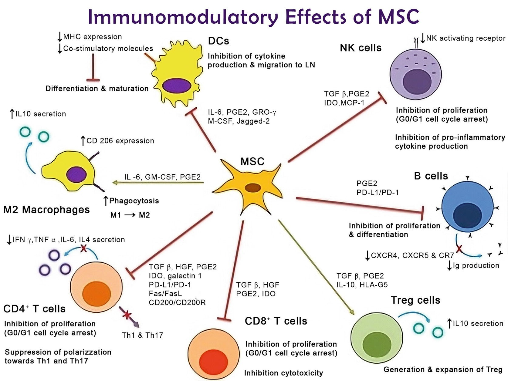
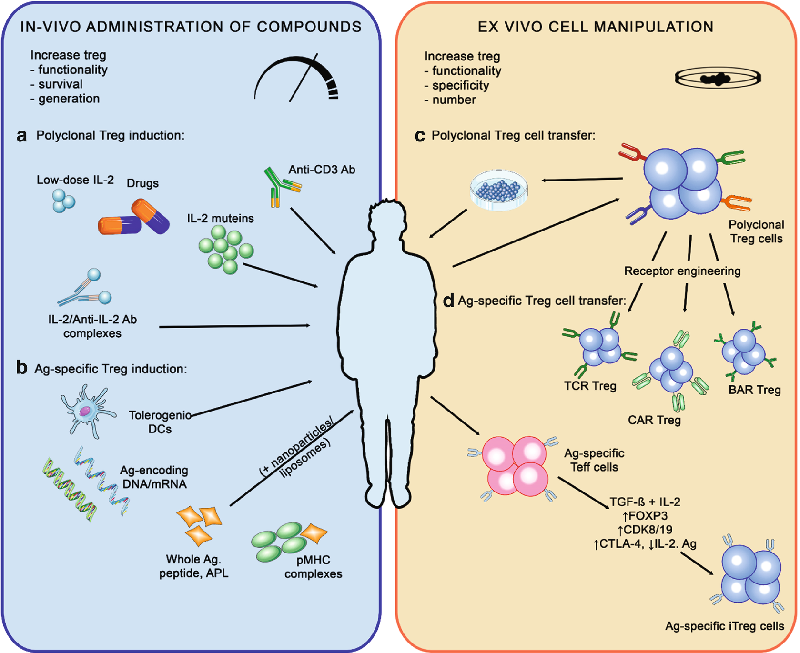

# Chapter 93. CART Cells and Other Cell Therapies (ie MSC, Tregs) in Autoimmune Diseases

> **Source:** Sureda A, Corbacioglu S, Greco R, Kröger N, Carreras E (eds). *The EBMT Handbook: Hematopoietic Cell Transplantation and Cellular Therapies*, 8th ed. Springer, Cham; 2024. pp. 837–848. https://doi.org/10.1007/978-3-031-44080-9_93  
> **Authors:** Greco, Raffaella; Farge, Dominique  
>   - Greco, Raffaella: IRCCS San Raffaele Hospital, Vita-Salute San Raffaele University  
>   - Farge, Dominique: Unité de Médecine Interne (UF 04): CRMR MATHEC, Maladies auto-immunes et thérapie cellulaire, Centre de Référence des Maladies auto-immunes systémiques Rares d’Ile-de-France FAI2R, EBMT CIC 0461, Hôpital St-Louis, AP-HP; Université de Paris-Cité, IRSL, URP 3518, Eq 3: MATHEC-EUROCORD  
> **License:** CC BY 4.0 (https://creativecommons.org/licenses/by/4.0/). Text reproduced verbatim from the open-access HTML edition; formatting converted to Markdown.

## Abstract

Auto-immune diseases (AD) are heterogeneous conditions, characterized by polyclonal activation of the immune system with a defect of B or T lymphocyte selection and altered lymphocytic reactions to auto-antigens components (Burnet 1959a, b), although it is rare to identify a single antigenic epitope. The native immune system and its tissue environment play an important role to determine if exposure to a given antigen will induce an immune response or tolerance or anergy. The role of the genes coding for the major histocompatibility system molecules, but also of many other genes, is important in the regulation of the immune response, although this does not explain all the observed phenomena during loss of tolerance (Matzinger 1994; Rioux and Abbas 2005).

## 93.1 Introduction

Auto-immune diseases (AD) are heterogeneous conditions, characterized by polyclonal activation of the immune system with a defect of B or T lymphocyte selection and altered lymphocytic reactions to auto-antigens components (Burnet 1959a, b), although it is rare to identify a single antigenic epitope. The native immune system and its tissue environment play an important role to determine if exposure to a given antigen will induce an immune response or tolerance or anergy. The role of the genes coding for the major histocompatibility system molecules, but also of many other genes, is important in the regulation of the immune response, although this does not explain all the observed phenomena during loss of tolerance (Matzinger 1994; Rioux and Abbas 2005).

Over the years, a better understanding of the genetic background of ADs led to revise the traditional pathogenesis of autoimmune diseases. The presence of self-directed tissue inflammation as a component of each type of AD occurs independently of T or B cells abnormalities. Most of the classical AD are polygenic diseases which result from a combination of auto-inflammatory and autoimmune mechanisms (Rioux and Abbas 2005; McGonagle and McDermott 2006) with a predominant autoimmune component background \[systemic lupus erythematosus (SLE), Type 1 diabetes (T1D), autoimmune thyroiditis\], whereas other polygenic AD have a predominant auto-inflammatory component \[Crohn’s disease (CD) for instance\]. More exceptionally, ADs are set by mutations associated with monogenic autoimmune diseases \[Immunodysregulation polyendocrinopathy enteropathy X-linked syndrome (IPEX) with *FOXP3* mutation\] or on the other hand of the spectrum appear as monogenic auto-inflammatory diseases \[Familial Mediterranean Fever with *MEFV*/pyrin, or TNF receptor-associated periodic fever syndrome (TRAPS) with *TNFRSFIA/*TNFR1\]. Autoimmunity is used to cause by impairment of adaptive immunity, whereas autoinflammatory was originally defined as a consequence of unregulated innate immunity. Despite the contrast in the system primarily tangled, they share a lot of similarities, both in pathogenesis and clinical presentations. Therefore, the optimal treatment of an AD should be discussed considering this specific pathological continuum between autoimmunity and auto-inflammation, which variably interacts in the ultimate phenotypic expression (Alexander and Greco 2022).

In this context, restoration of the immune tolerance with consequent resolution of the inflammatory response against self-antigens is one of the treatment goals to provide durable remissions.

Different types of cellular therapies, which include mesenchymal stem cells (MSC), regulatory T cells (Tregs) and chimeric antigen receptors (CAR) T cell therapies, have been developed to restore immunologic self-tolerance or foster tissue regeneration in AD patients.

## 93.2 Mesenchymal Stem Cells (MSC)

MSC-based therapies (Burt et al. 2021) theoretically appear as ideal tools to target the respective auto-inflammatory and autoimmune components of AD.

MSC were first identified in the bone marrow (MSC- bone marrow \[BM\])-stem cell niche 45 years ago (Friedenstein 1976) and since extensively characterized as main support of haematopoiesis. These multipotent progenitor cells can be harvested and cultured in vitro from many other sources, mostly from adipose tissue-MSC(AT)-, umbilical cord (MSC- umbilical cord \[UC\]) or Wharton’s jelly MSC (WJ) for therapeutic applications. In vitro expanded MSC were defined a minima in 2006 by the International Society of Cellular Therapy (ISCT) MSC committee as: (1) a plastic-adherent polyclonal population with fibroblast-like morphology, (2) positive for CD73, CD90 and CD105 markers (in \>95% MSC), (3) negative for haematopoietic and endothelial markers and (4) able to differentiate in vitro into osteoblasts, adipocytes and chondroblasts (Dominici et al. 2006). MSC have in vitro and in vivo immune-modulatory and immunosuppressive effects on both the innate and adaptive immunity and also pro-angiogenic and anti-fibrotic properties, all supporting their therapeutic use in several AD.

While MSC from various tissue sources share many biological features, they differ in terms of proliferation potential, multilineage capacities, overall transcriptional profile and functionality. Importantly, numerous other parameters modulate MSC functional properties, including autologous or allogeneic donor sources, each step of production processes (culture conditions, priming, scale of expansion, cryopreservation) and the recipients characteristics and inflammatory environment, which account for high heterogeneity amongst the various MSC products used for clinical application (Barrett et al. 2019; Fernandez-Santos et al. 2022; Menard and Tarte 2013).

MSC have long been considered as immuno-privileged, due to low level of MHC class I molecules and lack of MHC class II and several co-stimulatory molecules expression at basal state on their cell surface. However, MSC exposure to inflammatory environment increases the MHC class I and induces MHC class II molecules expression. The use of unmatched allogeneic MSC infusion may induce anti-HLA class I antibodies, with potential clinical consequences which are still under study (Farge et al. 2021, 2022; Menard and Tarte 2013).

MSCs interact with the humoral and the cell-mediated immune responses (Menard and Tarte 2013), including B-, T-, NK, and dendritic-cell inhibition, decrease in pro-inflammatory cytokine production, and blocking neutrophil recruitment (Fig. 93.1). They may act by cell to cell contact, but their primary mechanism of action is paracrine, through the secretion of enzymes (Han et al. 2022), with a central role for IDO/iNOS, and various growth factors, cytokines, hormones (e.g., VEGF, PDGF, ANG-1, IL-11, PGE2, TSG-6, SDF-1, HGF, IGF-1), which are not constitutively expressed by the MSCs, but induced by the inflammatory stimuli (e.g. IFN-γ ± TNF-α, IL-1α or IL-1β) (MSC priming in vitro or at site of local tissue), and all contribute to tissue regeneration. Other MSC mechanism of actions, demonstrated on in vivo models, include: (a) mitochondrial transfer from MSC to T cells that was shown to trigger transcriptomic, metabolic, and functional reprogramming and favour Treg differentiation and (b) efferocytosis, the process by which apoptotic cells are engulfed, leading macrophages towards IDO expression and MSC towards PGE2 and IL-10 upregulation, which also accounts for their immunosuppressive activity (Galipeau and Sensebe 2018; Galleu et al. 2017; Pang et al. 2021; Zhang et al. 2019). MSC also produce extracellular vesicles (EVs), namely exosomes, microvesicles and apoptotic bodies, which are small membrane vesicles (44–100 nm diameter), with evident immunosuppressive and immunomodulatory activity in vitro and in animal models, for which clinical applications are currently under study in several AD.

**Fig. 93.1**

Immunomodulatory effects of mesenchymal stem cells (MSC) in autoimmune diseases. Proinflammatory microenvironment in autoimmune disease patients shift MSC towards an immunomodulatory state, able to target multiple cells from the innate (inhibition of dendritic \[DC\] and natural killer \[NK\] cells, and polarization of M1–M2 macrophages) and acquired (inhibition of B, T-CD4+ and T-CD8+ cells, and activation of regulatory T \[Treg\] cells) immune responses, notably through the production of metabolic enzymes (e.g.: Indeolemine 2,3 dioxygenase \[IDO\]) and cytokines (e.g.: transforming growth factor \[TGF\]-β, interleukins \[IL\]-6 and IL-10, prostaglandin E2 \[PGE-2\])

The importance to assess MSC functional properties has been underlined since 2016 (Galipeau et al. 2016). The use of standardized functional markers of MSC potency and release potency assays, which must be defined to conduct advanced clinical studies, is of utmost importance and required to seek potential registration of the product. The preferred matrix assays to evaluate MSC immunosuppressive and immune-modulatory capacities include the use of: (a) quantitative RNA analysis of selected gene product, (b) flow cytometry analysis of functionally relevant surface markers, and (c) protein-based assay of secretome. In addition, multiparametric immune-monitoring tools have to be set up to characterize the patient immunological status and the various immune cell subsets before and after MSC treatment, to identify responders and thereby optimize clinical trials design.

### 93.2.1 MSC Clinical Applications for AD

MSCs produced from various sources \[MSC(BM), MSC(UC)- and MSC(AT)\] have been studied in around 1700 clinical trials worldwide for many conditions and their safety repeatedly demonstrated and summarized in a 2020 meta-analysis of 55 clinical trials in 12 countries using MSCs in 2700 recipients with various diseases (Thompson et al. 2020).

Initially tested in the pre-clinical model of multiple sclerosis (MS), the rationale for using MSCs in AD was subsequently obtained in many preclinical models and provide effective experimental support for their clinical application in patients with rheumatoid arthritis (RA), SLE and CD, which are characterized by a predominant auto-inflammatory component, but also in other AD, such as Sjogren disease, systemic sclerosis (SSc), type I and II diabetes or autism.

Numerous phase I–II trials and few completed or still ongoing phase III trials worldwide were developed first in China and Asia, then in US and Europe, to analyse the safety and efficacy of either autologous or allogeneic MSCs, from various tissue sources (UC, B, AT) using single or repeated iv, sc or local injections in neurological, rheumatological or gastrointestinal AD.

After 20 years of clinical research, since the first report (Le Blanc et al. 2004) on clinical efficacy of MSC(M) in a child with refractory aGvHD and more than 1360 clinical trials for MSC registered on Clinicaltrails.gov as of April 2023, in the field of AD per se only one MSC product allogeneic MSC(AT) for the treatment of Crohn’s fistula (Alofisel/Takeda) has been approved since 2018 in Europe, Japan and Canada. The first successful autologous MSC(AT) injection for CD rectovaginal fistula was performed in 2003. Several phase I and II studies for the treatment of anoperineal fistulas in CD reported 46–90%, efficacy until the ADMIRE phase III randomized, double-blind, international multicentre trial (RCT) demonstrated the superiority of MSC(AT) over placebo in 212 patients with CD and one or more complex anoperineal fistulas (Garcia-Olmo et al. 2022). For the other auto-immune diseases, several phase I–II studies reported safety results and promising efficacy signals in progressive MS, RA, SLE, SSc still require large RCT to demonstrate MSC efficacy (Burt et al. 2021; Farge et al. 2022; Loisel et al. 2023; Petrou et al. 2020; Wen et al. 2019). Progress in the field has been hampered by large heterogeneity when considering each AD type and patient selection, MSC type, origin and production process, route of delivery and number of injections, clinical trial design and national regulations.

Although the number of clinical trials registered on www.clinicaltrials.gov using MSC-EVs for therapeutic purposes increases in the last 10 years, few results are available (Burt et al. 2021).

## 93.3 Regulatory T Cells (Tregs)

Regulatory T cells (Tregs) are a specialized subset of CD4⁺ T lymphocytes endowed with immune-suppressive functions. Tregs are positively selected in the thymus and emigrate to the periphery. They represent a very heterogeneous population, distributed in secondary lymphoid organs and tissues. Tregs contribute to maintain the immune tolerance and to prevent autoimmunity. Tregs constitutionally express high levels of the interleukin-2 receptor alpha (CD25) and are highly enriched in the fraction of CD4⁺CD25^(bright) cells. In addition, they are classically identified as CD127^(low) and Forkhead-box-P3 (FoxP3)⁺ cells. The FoxP3 transcription factor has been identified as the master regulator, which is essential for Treg development (Ikegawa and Matsuoka 2021). Aberrant Treg plasticity, quantitative and functional deficiencies of Treg impair immune homeostasis and importantly contribute to AD (Selck and Dominguez-Villar 2021).

Considering their properties, Tregs represent the ideal candidate for immunotherapy in AD setting. To this end, several strategies (Fig. 93.2) have been developed to enhance the Treg response (Doglio et al. 2022; Xue et al. 2022).

**Fig. 93.2**

Regulatory T cells (Treg)-based approaches in autoimmune diseases (AD). Polyclonal and antigen-specific Treg cell-based therapies are the 2 main strategies: the administration of immunomodulatory agents that enhance the number and/or function of Treg cells in vivo (**a**, **b**), and the adoptive transfer of in vitro expanded Treg cells (**c**, **d**). Interventions that increase polyclonal endogenous Treg cells in vivo involve drugs (ie sirolimus), low-dose interleukin-2 (IL-2), mutant IL-2, IL2/Anti-IL-2 Ab complexes as well as selective depletion of effector T (Teff) cells by Anti-CD3 Ab (**a**). Applications of antigen-based treatments could lead to the enhancement of antigen-specific Treg subsets (**b**). Adoptive Treg cell therapies rely on the optimal isolation and expansion of Treg cells in vitro. One option is based on expanded polyclonal Treg cell populations (**c**). Moreover, antigen-specific Treg cells can be generated in vitro (**d**) by genetic insertion of synthetic receptors (engineered T cell receptors \[TCR\], chimeric antigen receptors \[CAR\] or B cell antibody receptors \[BAR\]) or by transformation of antigen-specific Teff cells into induced Treg (iTreg) cells via stimulation in the presence of transforming growth factor beta (TGF-β) and IL-2, transgenic FOXP3 overexpression, blockade of cyclin-dependent kinase 8 (CDK8) and CDK19 signaling, or a combination of cytotoxic T lymphocyte antigen 4 (CTLA-4) overexpression, IL-2 ablation and antigenic stimulation. *Ag* antigen, *DCs* dendritic cells, *APL* altered peptide ligands, *pMHC* peptide-major histocompatibility complex. \[Adapted from *Selck* et al. and *Doglio* et al. (Doglio et al. 2022; Selck and Dominguez-Villar 2021)\]

The first approach relies on the induction of Tregs directly in vivo, by enhancing their activity and/or persistence. Several drugs employed for the treatment of autoimmune diseases act directly or indirectly on Treg numbers and/or functionality. In this context, the role of rapamycin/sirolimus in increasing the number of Tregs through the inhibition of the mTOR pathway is well established (Greco et al. 2021; Peng et al. 2020). Moreover, an indirect boost of Treg expansion may be induced by CY, as used after allogeneic haematopoietic cell transplantation (HCT) for the prevention of GvHD (Cieri et al. 2015; Fletcher et al. 2023).

Other interventions that increase the number of polyclonal endogenous Treg cells in vivo involve low-dose interleukin-2 (IL-2), mutant IL-2, IL2/Anti-IL-2 Ab complexes. In contrast, applications of antigen-based treatments could lead to the enhancement of antigen-specific Treg subsets (Ikegawa and Matsuoka 2021).

Moreover, after autologous HCT, the reset of Treg compartment is essential to obtain long-term remission in ADs (Baraut et al. 2014; Cencioni et al. 2022; Doglio et al. 2022).

A second approach relies on adoptive Treg cell therapies, through the optimal isolation and in vitro expansion of Treg cells.

Data have shown the feasibility and safety of adoptive polyclonal Treg transfer, with variable efficacy, explained by the low level of Treg persistence in vivo and a limited number of Ag-specific cells in the final cell product (Doglio et al. 2022; Eggenhuizen et al. 2020). Challenges in in vitro Treg expansion and long-term persistence, as well as difficulties in the identification of specific antigens, have significantly slowed their clinical application (Xue et al. 2022).

However, antigen-specific Tregs can be generated in vitro by genetic insertion of synthetic receptors, including engineered T cell receptors (TCR), B cell antibody receptors (BAR) or CAR (Scott 2021; Selck and Dominguez-Villar 2021). In the context of autoimmunity, CARs may be effective in redirecting the antigen specificity of Tregs, boosting their suppressive capacities. CAR-Tregs proved very effective in controlling inflammatory conditions in pre-clinical studies (Doglio et al. 2022).

## 93.4 Chimeric Antigen Receptor T Cells (CART)

Chimeric antigen receptors (CAR) are chimeric molecules capable of redirecting the specificity of engineered cells against target antigens, while simultaneously boosting their activation (Freitag et al. 2020).

CARs are composed of three major components: an extracellular domain, a linker peptide and an intracellular part. The extracellular domain accounts for the recognition of the antigen. The intracellular portion mediates the transduction of the signal upon antigen binding. The most frequently used intracellular portions are represented by the zeta-chain of CD3 (CD3z) and the intracellular portion of CD28, 4-1BB and OX-40, each molecule being involved in the co-stimulation and activation of T lymphocytes (Doglio et al. 2022). According to the composition of the intracellular part, different generations of CARs can be distinguished: (a) the first generation composed only by the CD3z, (b) the second generation with two different domains with CD28-CD3z and 4-1BB-CD3z, which represent the two most frequent combinations in use and (c) a third generation with three domains, generally obtained by adding OX-40 to a second generation CAR (Sadelain et al. 2017).

Conventional T cells (Tconvs) expressing CARs revealed impressive clinical results in patients affected by haematological malignancies, since their cytotoxic action could be specifically redirected against transformed cells (Sterner and Sterner 2021).

Additionally, CAR-T cells (CART) may be employed in the field of autoimmunity, thanks to their ability of conferring new antigen-specificities and to simultaneously boost cell activation (Alexander and Greco 2022).

B cells and their effectors such as antibodies and cytokines impact the pathophysiology of ADs (Lee et al. 2021), thus attracting innovative B cell depletion therapies. Compared to monoclonal antibodies, CART have the advantage of a broader depletion of autoreactive B cells, (Doglio et al. 2022), especially those maintained in inflamed tissues and access to lymphoid organ (i.e. lymph node and spleen).

Recent clinical experiences (Table 93.1) suggest the efficacy of CD19-CAR Tconvs in SLE, showing resolution of nephritis and other disease-related symptoms in five patients (Mackensen et al. 2022; Mougiakakos et al. 2021). This effect is associated with a profound B-cell depletion, followed by B-cell repopulation over time, after a median observation of 110 days post-infusion. After 3 months, circulating CARTs were still detectable. All patients received autologous CD19-directed CART, without developing relevant toxicities, and only mild cytokine-release syndrome was reported in these patients. All patients had a normalization of serum double-stranded DNA antibodies and complement levels.

**Table 93.1 Clinical application of chimeric antigen receptor (CAR) T cells in autoimmune diseases (AD)**

|                           | AD                                                                                            | CAR-T cell                            | Lymphodepletion                                                                                                              | CRS/ICANS                                                                             | Other toxicities                                             | Disease response                                                                                                                                            | Follow up  |
|---------------------------|-----------------------------------------------------------------------------------------------|---------------------------------------|------------------------------------------------------------------------------------------------------------------------------|---------------------------------------------------------------------------------------|--------------------------------------------------------------|-------------------------------------------------------------------------------------------------------------------------------------------------------------|------------|
| Mougiakakos et al. (2021) | SLE (active lupus nephritis); 1 patient                                                       | CD19 CAR, 4-1BB co-stimulatory domain | Flu 25 mg/m2/day i.v. on days −5, −4, −3 and Cy 1000 mg/m2/day i.v. on day −3                          | None                                                                                  | None                                                         | Clinical remission (proteinuria, SLEDAI), serologic remission (dsDNA Ab; C3/C4)                                                                             | 44 days    |
| Mackensen et al. (2022)   | SLE (multiorgan involvement, lupus nephritis in all); 5 patients                              | CD19 CAR, 4-1BB co-stimulatory domain | Flu 25 mg/m2/day i.v. on days −5, −4, −3 and Cy 1000 mg/m2/day i.v. on day −3                          | CRS grade 1 (3/5); no ICANS                                                           | No infections                                                | Resolution of nephritis and disease-related symptoms, serologic remission (5/5)                                                                             | 8 months   |
| Müller et al. (2023)      | Antisynthetase syndrome; 1 patient                                                            | CD19 CAR lentiviral vector            | Flu 25 mg/m2/day i.v. on days −5, −4, −3 and Cy 1000 mg/m2/day i.v. on day −3                          | CRS grade 1, transient CRS-related symptoms (increased creatinine kinase and myalgia) | Decreased Ig levels                                          | Improvement in muscle strength and regained muscle endurance, decreased creatinine kinase and myoglobin, serologic remission, resolution of myositis at MRI | 200 days   |
| Bergmann et al. (2023)    | Diffuse cutaneous SSc with diffuse myocardial fibrosis, lung fibrosis, pulmonary hypertension | CD19 CAR lentiviral vector            | Flu 12.5 mg/m2; days −5, −4 and −3 and Cy 500 mg/m2, day −3 (50% dose-reduced due to renal impairment) | CRS grade 1; no ICANS                                                                 | None                                                         | Improvement of heart, joint and skin manifestations, serologic remission, stable pulmonary fibrosis                                                         | 6 months   |
| Qin et al (2023)          | NMOSD; 12 patients                                                                            | BCMA CAR                              | Flu 30 mg/m2/day i.v and Cy 500 mg/m2/day i.v.. on days −4, −3, −2                                     | CRS grade 1–2 (12/12); no ICANS, no other neurologic toxicities                       | Common haematotoxicity; 58% infections (no grade 4); 25% CMV | Drug-free and serologic remission (11/12), improvement in disabilities (12/12)                                                                              | 5.5 months |

1.  *Ab* autoantibodies, *AD* autoimmune diseases, *CAR* chimeric antigen receptor, *CMV* cytomegalovirus, *Cy* cyclophosphamide, *CRS* cytokine-release syndrome, *dsDNA* double-stranded DNA, *Flu* fludarabine, *ICANS* immune effector cell-associated neurotoxicity syndrome, *Ig* immunoglobulin, *MRI* magnetic resonance imaging, *NMOSD* neuromyelitis optica spectrum disorder, *SLE* systemic lupus erythematosus, *SLEDAI* systemic lupus erythematosus disease activity index score, *SSc* severe systemic sclerosis

Other preliminary experiences with CD19-targeted CART have been reported in a case of refractory antisynthetase syndrome (Muller et al. 2023) and a patient with severe SSc (Bergmann et al. 2023).

CART therapy that targets B-cell maturation antigen (BCMA) has been explored in 12 patients with relapsed/refractory neuromyelitis optica spectrum disorder (NMOSD) (Qin et al. 2023). Only a mild cytokine release syndrome was reported. No relapse has been observed at a median follow-up of 5.5 months in 11 patients, paralleled by a reduction of autoantibodies.

Overall, initial experiences suggest a rapid response of AD to CART therapy, although extended follow-up is needed to determine long-term efficacy.

## 93.5 Conclusions and Future Directions

New insights are emerging in the complexity and power of innovative cellular therapies. MSC, a heterogeneous population of stromal cells with high regenerative capacity that can be isolated, cultured, and expanded ex vivo represent a promising source for cellular therapy approaches in AD due to their immunosuppressive, angiogenic and anti-fibrotic properties. MSCs plasticity and their regenerative and immunomodulatory properties are known to be driven by microenvironmental factors. MSC of different tissue origin have been investigated for treating several indications. Progresses in the field have been hampered by large heterogeneity of MSC products and sources. Promising results have been obtained in SSc, SLE and access to the market in CD.

Tregs, a specialized subset of T lymphocytes with immune suppressive capacities and dysfunctional in AD constitute the ideal candidate for adoptive cell therapy in AD. Despite safe, polyclonal Tregs mediated suboptimal/controversial responses in clinical trials, mainly due to low amount of disease relevant antigen-specific cells. CARs can redirect the T cell antigen specificity, aiming at restoring the immune tolerance.

CAR-Tregs were proven very effective in controlling inflammatory conditions in AD pre-clinical studies Current available clinical data reveal that CD19 conventional CART effectively deplete B cells in patients with SLE, leading to impressive drug-free remission in patients refractory to standard therapies. The clinical effect of CART appears to be associated with abrogation of autoimmunity and persists even after B cell reconstitution. Longer follow-up is warranted after these preliminary promising experiences with various CART approaches in a variety of AD (antisynthetase syndrome, SSc, NMOSD). These findings show that the generation and administration of CART in AD is feasible and safe.

Future studies are warranted to further elucidate the mechanism of action of these cellular-based therapies, while shedding light on the underlying pathogenesis of AD.

### Key Points

- AD are heterogeneous conditions characterized by aberrant activation of the immune system with failure of the immune regulation to maintain adapted tolerance.

- The optimal treatment of AD should be discussed, in light of this pathological continuum between autoimmunity and auto-inflammation, which variably interacts in each AD phenotypic expression.

- MSC based therapies appear as ideal tools to target the respective auto-inflammatory and autoimmune components of AD. Progresses in the field have been hampered by large heterogeneity.

- Tregs constitute the ideal candidate for adoptive cell therapy in AD, aiming at restoring the immune tolerance. Despite safe, polyclonal Tregs mediated controversial results in clinical trials. CAR-Tregs proved very effective in controlling inflammatory conditions in pre-clinical studies.

- CART approach is feasible, tolerable and highly effective in severe/refractory SLE and other AD (antisynthetase syndrome, SSc, NMOSD) in preliminary clinical reports. Longer follow-up is warranted.

## References

- Alexander T, Greco R. Hematopoietic stem cell transplantation and cellular therapies for autoimmune diseases: overview and future considerations from the Autoimmune Diseases Working Party (ADWP) of the European Society for Blood and Marrow Transplantation (EBMT). Bone Marrow Transplant. 2022;57:1055–62. https://doi.org/10.1038/s41409-022-01702-w.

- Baraut J, Grigore EI, Jean-Louis F, Khelifa SH, Durand C, Verrecchia F, Farge D, Michel L. Peripheral blood regulatory T cells in patients with diffuse systemic sclerosis (SSc) before and after autologous hematopoietic SCT: a pilot study. Bone Marrow Transplant. 2014;49:349–54. https://doi.org/10.1038/bmt.2013.202.

- Barrett AN, Fong CY, Subramanian A, Liu W, Feng Y, Choolani M, Biswas A, Rajapakse JC, Bongso A. Human Wharton’s jelly mesenchymal stem cells show unique gene expression compared with bone marrow mesenchymal stem cells using single-cell RNA-sequencing. Stem Cells Dev. 2019;28:196–211. https://doi.org/10.1089/scd.2018.0132.

- Bergmann C, Muller F, Distler JHW, Gyorfi AH, Volkl S, Aigner M, Kretschmann S, Reimann H, Harrer T, Bayerl N, et al. Treatment of a patient with severe systemic sclerosis (SSc) using CD19-targeted CAR T cells. Ann Rheum Dis. 2023;82:1117. https://doi.org/10.1136/ard-2023-223952.

- Burnet M. Auto-immune disease. I. Modern immunological concepts. Br Med J. 1959a;2:645–50. https://doi.org/10.1136/bmj.2.5153.645.

- Burnet M. Auto-immune disease. II. Pathology of the immune response. Br Med J. 1959b;2:720–5. https://doi.org/10.1136/bmj.2.5154.720.

- Burt RK, Farge D, Ruiz MA, Saccardi R, Snowden JA. Hematopoietic stem cell transplantation and cellular therapies for autoimmune diseases. Boca Raton: CRC Press; 2021. https://www.routledge.com/Hematopoietic-Stem-Cell-Transplantation-and-Cellular-Therapies-for-Autoimmune/Burt-Farge-Ruiz-Saccardi-Snowden/p/book/978113855855

- Cencioni MT, Genchi A, Brittain G, de Silva T, Sharrack B, Snowden JA, Alexander T, Greco R, Muraro PA. Immune reconstitution following autologous hematopoietic stem cell transplantation for multiple sclerosis: a review on behalf of the EBMT Autoimmune Diseases Working Party (ADWP). Front Immunol. 2022;12:813957. https://doi.org/10.3389/fimmu.2021.813957.

- Cieri N, Greco R, Crucitti L, Morelli M, Giglio F, Levati G, Assanelli A, Carrabba MG, Bellio L, Milani R, et al. Post-transplantation cyclophosphamide and sirolimus after haploidentical hematopoietic stem cell transplantation using a treosulfan-based myeloablative conditioning and peripheral blood stem cells. Biol Blood Marrow Transplant. 2015;21:1506–14. https://doi.org/10.1016/j.bbmt.2015.04.025.

- Doglio M, Alexander T, Del Papa N, Snowden JA, Greco R, Autoimmune Diseases Working Party (ADWP) of the European Society for Blood and Marrow Transplantation (EBMT). New insights in systemic lupus erythematosus: from regulatory T cells to CAR-T-cell strategies. J Allergy Clin Immunol. 2022;150:1289–301. https://doi.org/10.1016/j.jaci.2022.08.003.

- Dominici M, Le Blanc K, Mueller I, Slaper-Cortenbach I, Marini F, Krause D, Deans R, Keating A, Prockop D, Horwitz E. Minimal criteria for defining multipotent mesenchymal stromal cells. The International Society for Cellular Therapy position statement. Cytotherapy. 2006;8:315–7. https://doi.org/10.1080/14653240600855905.

- Eggenhuizen PJ, Ng BH, Ooi JD. Treg enhancing therapies to treat autoimmune diseases. Int J Mol Sci. 2020;21:7015. https://doi.org/10.3390/ijms21197015.

- Farge D, Loisel S, Lansiaux P, Tarte K. Mesenchymal stromal cells for systemic sclerosis treatment. Autoimmun Rev. 2021;20:102755. https://doi.org/10.1016/j.autrev.2021.102755.

- Farge D, Loisel S, Resche-Rigon M, Lansiaux P, Colmegna I, Langlais D, Charles C, Pugnet G, Maria AT, Chatelus E, Martin T, Hachulla E, Kheav VD, Lambert NC, Wang H, Michonneau D, Martinaud C, Sensebé L, Cras A, Tarte K. Safety and preliminary efficacy of allogeneic bone marrow-derived multipotent mesenchymal stromal cells for systemic sclerosis: a single-centre, open-label, dose-escalation, proof-of-concept, phase 1/2 study. Lancet Rheumatol. 2022;4:E91–E104. https://doi.org/10.1016/S2665-9913(21)00326-X.

- Fernandez-Santos ME, Garcia-Arranz M, Andreu EJ, Garcia-Hernandez AM, Lopez-Parra M, Villaron E, Sepulveda P, Fernandez-Aviles F, Garcia-Olmo D, Prosper F, et al. Optimization of mesenchymal stromal cell (MSC) manufacturing processes for a better therapeutic outcome. Front Immunol. 2022;13:918565. https://doi.org/10.3389/fimmu.2022.918565.

- Fletcher RE, Nunes NS, Patterson MT, Vinod N, Khan SM, Mendu SK, Li X, de Paula Pohl A, Wachsmuth LP, Choo-Wosoba H, et al. Posttransplantation cyclophosphamide expands functional myeloid-derived suppressor cells and indirectly influences Tregs. Blood Adv. 2023;7:1117–29. https://doi.org/10.1182/bloodadvances.2022007026.

- Freitag F, Maucher M, Riester Z, Hudecek M. New targets and technologies for CAR-T cells. Curr Opin Oncol. 2020;32(5):510–17. PMID: 32657796. https://doi.org/10.1097/CCO.0000000000000653

- Friedenstein AJ. Precursor cells of mechanocytes. Int Rev Cytol. 1976;47:327–59. https://doi.org/10.1016/s0074-7696(08)60092-3.

- Galipeau J, Sensebe L. Mesenchymal stromal cells: clinical challenges and therapeutic opportunities. Cell Stem Cell. 2018;22:824–33. https://doi.org/10.1016/j.stem.2018.05.004.

- Galipeau J, Krampera M, Barrett J, Dazzi F, Deans RJ, DeBruijn J, Dominici M, Fibbe WE, Gee AP, Gimble JM, et al. International Society for Cellular Therapy perspective on immune functional assays for mesenchymal stromal cells as potency release criterion for advanced phase clinical trials. Cytotherapy. 2016;18:151–9. https://doi.org/10.1016/j.jcyt.2015.11.008.

- Galleu A, Riffo-Vasquez Y, Trento C, Lomas C, Dolcetti L, Cheung TS, von Bonin M, Barbieri L, Halai K, Ward S, et al. Apoptosis in mesenchymal stromal cells induces in vivo recipient-mediated immunomodulation. Sci Transl Med. 2017;9:aam7828. https://doi.org/10.1126/scitranslmed.aam7828.

- Garcia-Olmo D, Gilaberte I, Binek M, Lindner D, Selvaggi F, Spinelli A, Panes J. Follow-up study to evaluate the long-term safety and efficacy of darvadstrocel (mesenchymal stem cell treatment) in patients with perianal fistulizing Crohn’s disease: ADMIRE-CD phase 3 randomized controlled trial. Dis Colon Rectum. 2022;65:713–20. https://doi.org/10.1097/DCR.0000000000002325.

- Greco R, Lorentino F, Albanese S, Lupo Stanghellini MT, Giglio F, Piemontese S, Clerici D, Lazzari L, Marcatti M, Mastaglio S, et al. Posttransplantation cyclophosphamide- and sirolimus-based graft-versus-host-disease prophylaxis in allogeneic stem cell transplant. Transplant Cell Ther. 2021;27:776 e771–13. https://doi.org/10.1016/j.jtct.2021.05.023.

- Han Y, Yang J, Fang J, Zhou Y, Candi E, Wang J, Hua D, Shao C, Shi Y. The secretion profile of mesenchymal stem cells and potential applications in treating human diseases. Signal Transduct Target Ther. 2022;7:92. https://doi.org/10.1038/s41392-022-00932-0.

- Ikegawa S, Matsuoka KI. Harnessing Treg homeostasis to optimize posttransplant immunity: current concepts and future perspectives. Front Immunol. 2021;12:713358. https://doi.org/10.3389/fimmu.2021.713358.

- Le Blanc K, Rasmusson I, Sundberg B, Gotherstrom C, Hassan M, Uzunel M, Ringden O. Treatment of severe acute graft-versus-host disease with third party haploidentical mesenchymal stem cells. Lancet. 2004;363:1439–41. https://doi.org/10.1016/S0140-6736(04)16104-7.

- Lee DSW, Rojas OL, Gommerman JL. B cell depletion therapies in autoimmune disease: advances and mechanistic insights. Nat Rev Drug Discov. 2021;20:179–99. https://doi.org/10.1038/s41573-020-00092-2.

- Loisel S, Lansiaux P, Rossille D, Menard C, Dulong J, Monvoisin C, Bescher N, Bezier I, Latour M, Cras A, et al. Regulatory B cells contribute to the clinical response after bone marrow-derived mesenchymal stromal cell infusion in patients with systemic sclerosis. Stem Cells Transl Med. 2023;12:194–206. https://doi.org/10.1093/stcltm/szad010.

- Mackensen A, Muller F, Mougiakakos D, Boltz S, Wilhelm A, Aigner M, Volkl S, Simon D, Kleyer A, Munoz L, et al. Anti-CD19 CAR T cell therapy for refractory systemic lupus erythematosus. Nat Med. 2022;28:2124–32. https://doi.org/10.1038/s41591-022-02017-5.

- Matzinger P. Tolerance, danger, and the extended family. Annu Rev Immunol. 1994;12:991–1045. https://doi.org/10.1146/annurev.iy.12.040194.005015.

- McGonagle D, McDermott MF. A proposed classification of the immunological diseases. PLoS Med. 2006;3(8):e297. PMID: 16942393. https://doi.org/10.1371/journal.pmed.0030297.

- Menard C, Tarte K. Immunoregulatory properties of clinical grade mesenchymal stromal cells: evidence, uncertainties, and clinical application. Stem Cell Res Ther. 2013;4:64. https://doi.org/10.1186/scrt214.

- Mougiakakos D, Kronke G, Volkl S, Kretschmann S, Aigner M, Kharboutli S, Boltz S, Manger B, Mackensen A, Schett G. CD19-targeted CAR T cells in refractory systemic lupus erythematosus. N Engl J Med. 2021;385:567–9. https://doi.org/10.1056/NEJMc2107725.

- Muller F, Boeltz S, Knitza J, Aigner M, Volkl S, Kharboutli S, Reimann H, Taubmann J, Kretschmann S, Rosler W, et al. CD19-targeted CAR T cells in refractory antisynthetase syndrome. Lancet. 2023;401:815–8. https://doi.org/10.1016/S0140-6736(23)00023-5.

- Pang SHM, D'Rozario J, Mendonca S, Bhuvan T, Payne NL, Zheng D, Hisana A, Wallis G, Barugahare A, Powell D, et al. Mesenchymal stromal cell apoptosis is required for their therapeutic function. Nat Commun. 2021;12:6495. https://doi.org/10.1038/s41467-021-26834-3.

- Peng L, Wu C, Hong R, Sun Y, Qian J, Zhao J, Wang Q, Tian X, Wang Y, Li M, Zeng X. Clinical efficacy and safety of sirolimus in systemic lupus erythematosus: a real-world study and meta-analysis. Ther Adv Musculoskelet Dis. 2020;12:1759720X20953336. https://doi.org/10.1177/1759720X20953336.

- Petrou P, Kassis I, Levin N, Paul F, Backner Y, Benoliel T, Oertel FC, Scheel M, Hallimi M, Yaghmour N, et al. Beneficial effects of autologous mesenchymal stem cell transplantation in active progressive multiple sclerosis. Brain. 2020;143:3574–88. https://doi.org/10.1093/brain/awaa333.

- Qin C, Tian DS, Zhou LQ, Shang K, Huang L, Dong MH, You YF, Xiao J, Xiong Y, Wang W, et al. Anti-BCMA CAR T-cell therapy CT103A in relapsed or refractory AQP4-IgG seropositive neuromyelitis optica spectrum disorders: phase 1 trial interim results. Signal Transduct Target Ther. 2023;8:5. https://doi.org/10.1038/s41392-022-01278-3.

- Rioux JD, Abbas AK. Paths to understanding the genetic basis of autoimmune disease. Nature. 2005;435:584–9. https://doi.org/10.1038/nature03723.

- Sadelain M, Riviere I, Riddell S. Therapeutic T cell engineering. Nature. 2017;545:423–31. https://doi.org/10.1038/nature22395.

- Scott DW. Driving CARs to BARs: the winding road to specific regulatory T cells for tolerance. Front Immunol. 2021;12:742719. https://doi.org/10.3389/fimmu.2021.742719.

- Selck C, Dominguez-Villar M. Antigen-specific regulatory T cell therapy in autoimmune diseases and transplantation. Front Immunol. 2021;12:661875. https://doi.org/10.3389/fimmu.2021.661875.

- Sterner RC, Sterner RM. CAR-T cell therapy: current limitations and potential strategies. Blood Cancer J. 2021;11:69. https://doi.org/10.1038/s41408-021-00459-7.

- Thompson M, Mei SHJ, Wolfe D, Champagne J, Fergusson D, Stewart DJ, Sullivan KJ, Doxtator E, Lalu M, English SW, et al. Cell therapy with intravascular administration of mesenchymal stromal cells continues to appear safe: an updated systematic review and meta-analysis. EClinicalMedicine. 2020;19:100249. https://doi.org/10.1016/j.eclinm.2019.100249.

- Wen L, Labopin M, Badoglio M, Wang D, Sun L, Farge-Bancel D. Prognostic factors for clinical response in systemic lupus erythematosus patients treated by allogeneic mesenchymal stem cells. Stem Cells Int. 2019;2019:7061408. https://doi.org/10.1155/2019/7061408.

- Xue E, Minniti A, Alexander T, Del Papa N, Greco R, On Behalf of the Autoimmune Diseases Working Party (ADWP) of the European Society for Blood and Marrow Transplantation (EBMT). Cellular-based therapies in systemic sclerosis: from hematopoietic stem cell transplant to innovative approaches. Cell. 2022;11:3346. https://doi.org/10.3390/cells11213346.

- Zhang Z, Huang S, Wu S, Qi J, Li W, Liu S, Cong Y, Chen H, Lu L, Shi S, et al. Clearance of apoptotic cells by mesenchymal stem cells contributes to immunosuppression via PGE2. EBioMedicine. 2019;45:341–50. https://doi.org/10.1016/j.ebiom.2019.06.016.

## Acknowledgments

The authors thank Manuela Badoglio and Myriam Labopin in the EBMT Paris Office for provision of data from the EBMT registry, EBMT centres for their contributions to the registry and those active in the ADWP.
