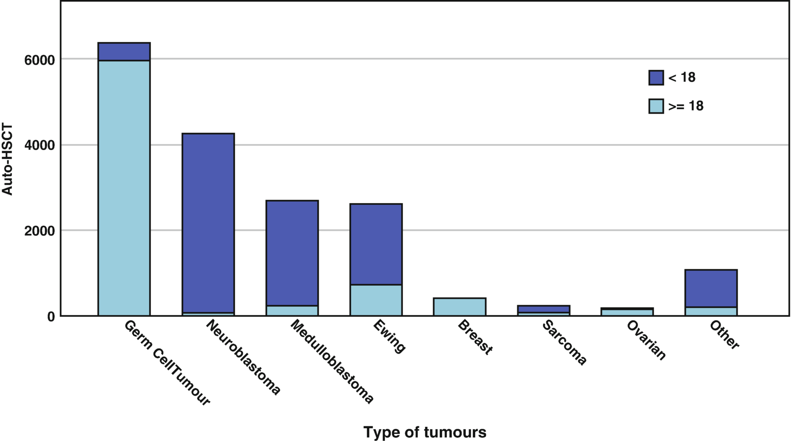
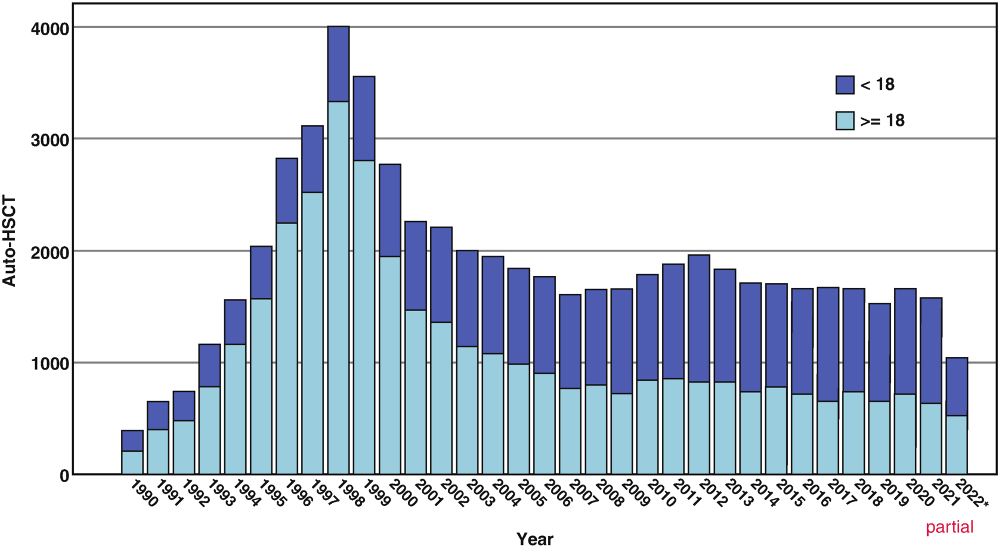

# Chapter 94. Solid Tumours

> **Source:** Sureda A, Corbacioglu S, Greco R, Kröger N, Carreras E (eds). *The EBMT Handbook: Hematopoietic Cell Transplantation and Cellular Therapies*, 8th ed. Springer, Cham; 2024. pp. 849–862. https://doi.org/10.1007/978-3-031-44080-9_94  
> **Authors:** Ladenstein, Ruth; Pedrazzoli, Paolo; Rosti, Giovanni  
>   - Ladenstein, Ruth: Medical University of Vienna  
>   - Pedrazzoli, Paolo: IRCCS Fondazione Policlinico San Matteo; University of Pavia  
>   - Rosti, Giovanni: IRCCS Fondazione Policlinico San Matteo  
> **License:** CC BY 4.0 (https://creativecommons.org/licenses/by/4.0/). Text reproduced verbatim from the open-access HTML edition; formatting converted to Markdown.

## Abstract

In the absence of randomized prospective trials, the EBMT registry remains an important source to survey indications, outcome and clinical risk factors in patients with solid tumours treated by auto- and allo-HCT. At the end of 2022, the EBMT registry included 65,586 HCT for solid tumours in 47,221 patients, with a slight prevalence in adults compared with children (58% vs. 42%). Auto-HCT represented 97% of the total HCT, whereas allo-HCT was used in 3% of the procedures. Multiple transplants were performed in 1/3 of the cases (Table 94.1; Figs. 94.1 and 94.2) compare activity and indications between adults and children.

## 94.1 Introduction

In the absence of randomized prospective trials, the EBMT registry remains an important source to survey indications, outcome and clinical risk factors in patients with solid tumours treated by auto- and allo-HCT. At the end of 2022, the EBMT registry included 65,586 HCT for solid tumours in 47,221 patients, with a slight prevalence in adults compared with children (58% vs. 42%). Auto-HCT represented 97% of the total HCT, whereas allo-HCT was used in 3% of the procedures. Multiple transplants were performed in 1/3 of the cases (Table 94.1; Figs. 94.1 and 94.2) compare activity and indications between adults and children.

**Table 94.1 EBMT registry on HCT for solid tumours (data updated on February 2023)**

|                                   |                     |                   |
|-----------------------------------|---------------------|-------------------|
| *Solid tumour registry*           | *65,0586*           |                   |
| *Patients*                        | *47,221*            |                   |
| *Adults/pediatric (%)*            | *58/42*             |                   |
| *Male/female (%)*                 | *48/52*             |                   |
| *Auto/allo (%)*                   | *97/3*              |                   |
| *Nb of HSCT*                      | *Auto (n = 63,592)* | *Allo (n = 1981)* |
| *First HSCT*                      | *45,997*            | *1221*            |
| Second HSCT                       | 12,124              | 577               |
| Third HSCT                        | 4470                | 134               |
| Fourth HSCT                       | 746                 | 34                |
| ≥Fifth HSCT                       | 210                 | 1                 |
| *Median follow up (year \< 2020)* | *3.49 (\<1*–*39)*   | *2.98 (\<1*–*37)* |

**Fig. 94.1**

EBMT registry on auto-HCT for solid tumours in the period 2012–2022 (*n* = 17,850). Adults vs. paediatric HCT is reported (February 2023)

**Fig. 94.2**

EBMT registry showing numbers of auto-HCT for solid tumour indication over the years: 1990/2022 in both adults and children (data of 2022 are partial)

## 94.2 Solid Tumours in Children and Adolescents

Ruth Ladenstein

Regarding the respective solid tumour entities relevant in the paediatric and adolescent age groups this year’s report informs on recent advances in the literature. In brief, to date the evidence for high-dose-therapy (HDT)/HCT from prospective randomized trials is still limited to high-risk neuroblastoma hrNBL and Ewing sarcoma (Matthay et al. 2009; Whelan et al. 2018).

### 94.2.1 Recall on General Lessons Based on EBMT Data

Transplant-related mortality. TRM markedly decreased over time and is related with the HDT regimen (i.e., elimination of TBI) and most importantly use of peripheral stem cells. TRM rates associated to auto-HCT dropped to under 5% after 1992 and is since 2012 only 1%.

Total body irradiation. TBI showed no advantage in any of the solid tumour indications and should thus be avoided in children with solid tumours in view of late effects.

Remission status. First-line high-risk patients perform significantly better than after relapse. Response to induction treatments prior to HDT/HCT is critical in all indications. In brief, good response to first-line treatment (CR/VGPR/PR) in high-risk patients in and sensitive relapse (SR) are good indications, while patients with stable disease or minor response (\<50%) (SD/MR) should only be considered for well-defined phase I/phase II trials. Patients with no response (NR) or tumour progression or refractory disease (RR) have a very short life expectancy even after HDT/HCT and thus should not be considered.

Age plays a crucial role as outcome predictor. Adolescent age is generally associated with inferior outcome. While age \<10 years is a favourable factor in sarcomas (Ewing sarcoma and rhabdomyosarcoma), NBL has an earlier cut-off at 5 years. Patients with NBL ≤18 months at diagnosis need biological profiling and are only eligible with high-risk biological features, in particular MYCN amplification (Canete et al. 2009; Ladenstein et al. 2023).

Double HCT approaches. The EBMT data on tandem or repetitive HDT/HCT approaches show no advantage over single HDT/HCT. However, the elective selection of particularly poor-prognosis patients in phase II settings is a likely bias. A randomized trial in NBL emerged with superiority for the tandem strategy for hrNBL in front-line patients (Park et al. 2016).

Busulfan–melphalan. This HDT combination is the only one in the EBMT database resulting in significantly improved survival rates in NBL and Ewing tumours.

Allo-HCT. No advantage for allo-HCT can be detected in the EBMT data for any paediatric solid tumour indication. The potential bias of negative selection of particular poor-prognosis patients’ needs to be considered.

The EBMT data showed a benefit from salvage HDT/HCT in responding patients relapsing after 12 months from diagnosis and without a previous HDT.

### 94.2.2 Neuroblastoma (NBL)

High-risk neuroblastoma (hrNBL) is defined in the front-line setting by widespread disease \>18 months, but includes any stage and age in the presence of MYCN oncogene amplification (Cohn et al. 2009; Moroz et al. 2011; Canete et al. 2009; Ladenstein et al. 2023). In addition, genetic alterations of ALK (clonal mutations and amplifications) are independent predictors of poorer survival in hrNBL (Bellini et al. 2021; Goldsmith et al. 2023) ALK inhibitors are increasingly integrated in upfront treatments, mostly the third-generation ALK inhibitor lorlatinib, and contribute to improved response rates prior to HCT. Standard treatment approaches include multicycle, intense induction where recently combinations with immunotherapy are evaluated in randomised trails, local control via mostly extensive surgery to the primary tumour site enhanced by radiotherapy including local and, in some collaborative groups, also metastatic sites delivered after HDT/auto-HCT. Immunotherapy for maintenance with respective ch14.18 antibodies is meanwhile considered standard (Park et al. 2016; Yu et al. 2010; Ladenstein et al. 2017, 2018).

#### 94.2.2.1 Autologous HCT in NBL

Although three randomized trials and a meta-analysis have demonstrated that HDT with aHCT improves EFS in high-risk NBL (Pritchard et al. 2005; Berthold et al. 2005; Matthay et al. 2009; Yalçin et al. 2013), there is no consensus which HDT regimen is superior. Whilst EBMT data and the HR-NBl1/SIOPEN trial support Busulphan and Melphalan as HDT regimen (Ladenstein et al. 2008, 2017), the randomized results of the ANBL0532 COG found superiority for double HDT/HCT \[first HDT, CY and TT; second HDT, CBP, VP and MEL (with reduced doses of single HDT CEM) vs. single HDT (CEM)/auto-HCT (Park et al. 2019) with Anti-GD2 antibody-based immunotherapy being beneficial for both arms (Yu et al. 2010)\]. The value of a tandem approach including Busulphan and Melphalan is currently explored within the randomized HRNBL2/SIOPEN trial.

A recent analysis (Ladenstein et al. 2023) on MYCN amplified NBL in infants and toddlers found markedly improved outcomes within the HR-NBl1/SIOPEN trial for infants and toddlers.

Targeted therapies, in particular iodine-131-metaiodobenzylguanidine (mIBG) therapy with and without chemotherapy or radiosensitisers like vorinostat and/or HDT followed by HCT, have generated increasing interest (Lee et al. 2017; Johnson et al. 2011; Ferry et al. 2018; Kraal et al. 2017, 2019; DuBois et al. 2021). Further HDT tandem approaches with or without mIBG are currently explored by the COG and SIOPEN in randomized and by other groups in non-randomized trials (Lee et al. 2017).

#### 94.2.2.2 Allogeneic HCT in NBL

The role of allo-HCT remains controversial. Allo-HCT as immunotherapy received special attention after introduction of RIC and NMA transplants. Some reports highlight a graft-versus-tumour (GvT) effect with adopted allo-HCT approaches, while early EBMT data showed no benefit with classical allo-HCT (Ladenstein et al. 1994). The CIBMTR conducted a retrospective review showing some benefit for allo-HCT in patients without prior auto HCT (Hale et al. 2013). The Japan Children’s Cancer Group (JCCG) (Hara et al. 2022) reported recently improved outcomes with allo-HCT.

Haplo-HCT in very high-risk refractory/relapsed (R(/R) patients is capable to induce long-term remission (Illhardt et al. 2018). Graft-versus-NBL effects can be elicited by transplantation of haploidentical hematopoietic cells (haplo-HCT) exploiting cytotoxic functions of natural killer cells and their activation by the anti-GD2 antibody dinutuximab beta (DB) (Flaadt et al. 2023). Immunotherapy after haplo-HCT is feasible, with low risk of inducing GvHD and resulted in markedly improved long-term survival likely attributable to increased anti-NBL activity by donor-derived effector cells.

#### 94.2.2.3 Cell Therapy in NBL

The success of anti-GD2 therapy has proven that immunotherapy can be effective in NBL. Adoptive transfer of chimeric antigen receptor (CAR) T cells has the potential to build on this success. In early phase clinical trials, CART for NBL has proven to be safe and feasible, but significant barriers to efficacy remain. One such approach is adoptive transfer of CART cells, which combine the specificity of an antibody with the cytolytic capacity of T cells in an MHC independent manner. Persisting hurdles to date include lack of T cell persistence and potency, difficulty in target identification, and an immunosuppressive tumour microenvironment. Outcomes so far have been encouraging but modest, with only a fraction of patients achieving measurable responses and very few patients demonstrating long-term persistence of CART cells (Yang et al. 2017; Yeku et al. 2017; Pinto et al. 2018; Richards et al. 2018; Heczey et al. 2017). Immunotherapy with CAR T cells that target the disialoganglioside GD2 expressed on tumour cells, i.e., third-generation GD2-CART cells expressing the inducible caspase 9 suicide gene (GD2-CART01) may be a new therapeutic opportunity in R/R advanced high-risk neuroblastoma (Del Bufalo et al. 2023).

#### 94.2.2.4 Recommended Indications NBL–HCT

Standard indications include first-line hrNBL \>18 months at diagnosis with widespread metastatic disease or those of any age with MYCN amplified tumours with INSS stages 2–4. Any responding metastatic relapse in patients \>18 months and any MYCN amplified tumour without prior HDT/HCT are suitable indications. Any other indication is reserved for well-designed experimental phase I/phase II trials. Children \<18 months need to be evaluated for a high-risk biological risk profile prior to being considered for HDT/auto-HCT (Canete et al. 2009; Ladenstein et al. 2023; Moroz et al. 2011; Cohn et al. 2009). Immunotherapy-related approaches including recent haploidentical HCT and third generations CART cell approaches hold promise for patients advanced relapsed and refractory disease.

### 94.2.3 Ewing Sarcomas (EWS)

Ewing sarcomas (EWS) are solid tumours of the bone and soft tissue that usually affect children, adolescents and young adults. An incidence rate of 4.5 per million a year is reported, with a peak incidence of 11 per million at the age of 12 years. Metastatic disease is detected in about 20–30% and is typically found in the lungs, bone, bone marrow or a combination of these. Presence of metastatic disease at diagnosis (primary metastatic disease) is the most important adverse prognostic factor and is associated with a 5-year survival lower than 30%. The hypothesis is that HDC regimens may overcome the resistance to standard multidrug chemotherapy and improve survival rates. Despite more intensive chemotherapy, 30–40% of young people with Ewing sarcoma will have recurrence of the disease. Less than 30% of young people with a recurrence of EWS are alive at 24 months, and less than 10% are alive at 48 months (Haveman et al. 2021).

#### 94.2.3.1 Autologous HCT in EWS

For primary disseminated multifocal EWS (Ladenstein et al. 2010) receiving BU/MEL HDT/auto-HCT after VIDE induction (Euro-EWING 99 study group), an increased risk at diagnosis was observed for patients ≥14 years (HR = 1.6), with a primary tumour volume \>200 mL (HR = 1.8), more than one bone metastatic site (HR = 2.0), BM metastases (HR = 1.6) and additional lung metastases (HR = 1.5), carry. A score based on these factors identified patients with an EFS rate of 50% for scores ≤3 (82 patients), 25% for a score \>3 and ≤5 (102 patients) and 10% for score ≥5 (70 patients; *p* \< 0.0001). In Ewing2008R3, the effect of treosulfan and melphalan (TreoMel) HDT/HCT was investigated in patients with disseminated EWS with metastases to bone and/or other sites, excluding patients with only pulmonary metastases (Koch et al. 2022). Additionally, TreoMel-HDT was of no benefit for the entire cohort of patients, whereas TreoMel-HDT may be of benefit for children age \<14 years.

When using standard methodological procedures as expected by Cochrane no evidence from RCTs or CCTs to determine the efficacy of HDC with AHCT compared to conventional chemotherapy was found for patients with primary metastases to locations other than the lungs (Haveman et al. 2021).

In EWS patients with poor histologic response (≥10% viable cells) after VIDE induction (6 courses) or large tumour volume at diagnosis (≥200 mL), the risk of event was significantly decreased by BU/MEL compared to VAI with better EFS and OS. For this group of patients, BU/MEL is now a standard of care (Euro-EWING 99 study group (Whelan et al. 2018).

In contrast, the R2Pulm trial of the Euro-EWING 99 study group and EWING 2008 randomised busulfan–melphalan HDT/HCT (BuMel) in comparison with standard chemotherapy with whole lung irradiation (WLI) in EWS presenting with pulmonary and/or pleural metastases (Dirksen et al. 2019). There was a clear benefit from BuMel compared with conventional VAI plus WLI which in addition was associated with less toxicity.

A retrospective study addressed the important question of compatibility of BU/MEL and whole lung irradiation (WLI) and found WLI at recommended doses and time interval after BU/MEL feasible (Abate et al. 2021).

A recent analysis on R/R EWS patients underpinned a role of HDT/HCT in 196 patients with 64 patients receiving HDT, 98 standard non-HDT chemotherapy and 34 no systemic therapy (Windsor et al. 2022).

However, a survey on patients with a first recurrence of EWS in children, adolescents, and young adults found no informative data from randomized controlled trials (RCTs) or (historical) controlled clinical trials (CCTs), so no conclusions may be drawn (Haveman et al. 2021).

#### 94.2.3.2 Allogeneic HCT in EWS

Tandem HDT and allo-HCT were part of the EICESS92 and Meta-EICESS protocols yielding long-term DFS in patients with advanced EWS (Burdach and Jürgens 2002).

Patients suffering a relapse generally have a poor prognosis with conventional chemotherapy. The role of HDT/auto-HCT still awaits clarification in randomized controlled studies (Tenneti et al. 2018; Ferrari et al. 2015). A GvT or improved survival following allo-HCT effect was highlighted in some reports, but a retrospective review (Thiel et al. 2011) could not identify benefits with either RIC or MAC or with either HLA-matched or HLA-mismatched grafts. Haplo-HCT for consolidation after conventional therapy seems to be of interest for some, but not for most patients with high-risk paediatric sarcomas (Eichholz et al. 2023; Sano et al. 2022).

#### 94.2.3.3 Recommended Indications in EWS

BU/MEL HDT for patients with a poor histological response after induction and/or a tumour volume ≥200 mL is now standard of care. Patients with primary metastatic disease at sites other than the lungs and a low-risk score may be considered good candidates in the absence of a controlled trial. Any metastatic relapse without prior HDT may be considered for controlled phase II HDT protocols. Adoptive immunotherapy is an evolving field and subject to experimental early trials.

### 94.2.4 Soft Tissue Sarcoma (STS)

Rhabdomyosarcoma (RMS) is the most common soft tissue sarcoma (STS) in childhood. Whereas more than 90% of patients with localized low-risk RMS can be cured, metastatic RMS have a dismal outcome, with survival rates of less than 30%.

#### 94.2.4.1 Recommended Indications

Currently there is no evidence-based standard indication for HDT/HCT in STS.

### 94.2.5 Osteosarcoma (OS)

Even in responding high-risk patients treated with HDT/HCT in first or second remission, the length of remission is short, and relapse occurs early after HDT. High-risk features include poor histological response or non-response of the primary tumour at the time of definitive surgery, inoperable, axial tumours (large volume), primary dissemination or relapse other than isolated, late lung metastases.

#### 94.2.5.1 Recommended Indications in OS

There is no standard indication for HCT based on published results or EBMT data.

### 94.2.6 Retinoblastoma (RB)

Retinoblastoma (RB) is the most frequent intraocular malignancy in children, with the incidence rate of 1 per 17,000–24,000 live births. Delayed time to diagnosis may lead to the development of locally advanced or metastatic disease associated with poor survival, especially when CNS metastasis is present. Chemotherapy drugs that may be useful for these patients include platinum-containing agents (carboplatin and cisplatin), etoposide, vincristine, cisplatin, cyclophosphamide and anthracyclines.

#### 94.2.6.1 Recommended Indications in RB

Advocated HDT/auto-HCT approaches are CARBOPEC (CBP, VP, CY) (Jaradat et al. 2012), but for CNS-positive patients, TT or BU was introduced (Dunkel et al. 2010). Other groups used combinations including MEL and CBDCA and/or VP for metastatic RB and reported promising survival results for patients without CNS involvement. Future trials should take the following high-risk factors into consideration: involvement of the cut end or subarachnoidal space of the optic nerve after enucleation, orbital involvement and distant metastatic disease and CNS disease.

### 94.2.7 Wilms’ Tumour (WT)

Wilms tumour (WT) treatment regimens are curative for more than 80% of patients, but those with relapsed or refractory disease continue to have poor outcomes. HDT-autologous aHCT rescue is often utilized although outcomes remain variable. So far attempts to conduct a randomized trial comparing maintenance chemotherapy with consolidation versus HDT/auto-HCT have failed in this indication.

#### 94.2.7.1 Recommended Indications in WT

Experience of the SIOP, GPOH, NWTS, MRC and respective national groups over the last 20 years found the probability of cure of 30% at best in the presence of adverse prognostic factors. High-risk factors are unfavourable histology and metastatic disease (Presson et al. 2010; Delafoy et al. 2022; Groenendijk et al. 2022) and are after relapse again unfavourable histology and one of the following criteria: extra-pulmonary relapse or abdominal relapse after radiation, stage IV, more than two drugs in the first-line regimen or relapse within 1 year. HDT is indicated if a response to second-line treatment is achieved.

### 94.2.8 Recommended Indications in Brain Tumours

Patients with high-risk medulloblastoma (primary metastases/relapse) of any age older than 3 years are eligible for HDT/HCT in combination with radiation, while in infants HDT/HCT is used with the aim of reducing (volumes and doses) or avoiding radiation.

Metastatic PNETs at diagnosis or with additional high-risk features such as incomplete resection or young age (younger than 3 or 5 years) as well as infants and young children (\<4 years) with malignant brain tumours are further indications.

Very controversial indications include high-grade glioma. Currently, there is little or no indication for HDT/HCT in ependymoma, brain stem glioma or pineoblastoma. More investigations are required to define the optimal HDT for each tumour type. Most groups use similar HDT regimens, i.e. BU/TT (SFOP, Spain), VP/TT/CBDCA (US/CCG, Germany, Spain) or a tandem approach Vp16/CBDCA—TTP/L-PAM (Italy).

### 94.2.9 Extra and Intracranial Germ Cell Tumours

**CNS germ cell tumours (GCTs**) can be divided into major groups including germinomas (having a superior prognosis) and non-germinomatous GCTs (NGGCTs), with teratomas often considered a separate category- and represent approximately 3% of primary paediatric brain tumours.

#### 94.2.9.1 Recommended Indications in in Germ Cell Tumours

As paediatric patients with extracranial GCTs may expect an excellent outcome with conventional chemotherapy approaches, there is no standard indication for HDT/AHCT. Based on previously published reports on adults, or the few reports for children, treatment with HDT combined with aHCT has a beneficial effect on R/R GCTs. However, the strategy of HDCT used as a frontline treatment has no demonstrated benefit for children in the poor-risk group and requires further research.

High-risk patients with extracranial GCTs are initial non-responders or poor responders (no local control achieved) and patients after relapse failing to achieve second CR.

In high-risk CNS GCT patients \<18 years, the following criteria for HDT may be adopted: recurrent CNS GCT when biological remission is achieved prior to HDC and insufficient response to primary chemotherapy.

Since carboplatin and etoposide have been included in the front-line chemotherapy of paediatric GCTs, other drug combinations should be considered for conditioning regimens, such as melphalan, thiotepa, or paclitaxel. The treatment of paediatric poor-risk GCTs is still a challenge for paediatric oncologists. HDCT combined with AHCT in this group of patients requires further study.

### Key Points for Solid Tumours in Children and Adolescents

- In neuroblastoma and Ewing sarcoma, there is clear evidence for the advantage of HDT/auto-HCT with an increasing interest in tandem transplants.

- In other paediatric solid tumour, indication still lacks randomized trials, and indications are based on observational studies, case reports and EBMT database only.

## 94.3 Solid Tumours in Adults

Paolo Pedrazzoli, Giovanni Rosti.

### 94.3.1 Auto-HCT in Adults

Supported by a strong rationale from laboratory studies and apparently ‘convincing’ results of early phase II studies, in the 1990s auto-HCT was uncritically adopted as a potentially curative option for solid tumours. For this reason, randomized trials comparing high-dose therapy with conventional control arms were difficult to conduct. As a result, the number and size of clinical studies initiated (and often unfortunately abandoned before completion) to prove or disprove its value were largely insufficient. Nowadays, after 30 years of clinical research and thousands of patients receiving auto-HCT, the benefit of auto-HCT in solid tumours, except for germ cell tumours (GCTs) and possibly in selected patients with breast cancer (BC) is still unsettled (Fig. 94.1), (Sureda et al. 2015; Snowden et al. 2022).

#### 94.3.1.1 Breast Cancer (BC)

The role of intensified chemotherapy with auto-HCT for primary BC at high risk of recurrence (at least four involved axillary lymph nodes) has been assessed by several randomized trials, evaluated by a meta-analysis of individual patient data (Berry et al. 2011a; Pedrazzoli et al. 2015). Overall, it was shown that auto-HCT prolonged DFS when used as adjuvant therapy and showed a benefit on BC-specific survival and OS in selected cohorts of patients (Nitz et al. 2005; Pedrazzoli et al. 2015). Whether auto-HCT has benefits in the context of contemporary targeted therapies is largely unknown.

In the metastatic setting, seven phase III studies have been published in peer-reviewed journals. Most of these trials showed improved PFS in the auto-HCT arm, but only one OS advantage. Six randomized trials, including 866 metastatic breast cancer (MBC) patients, have been analyzed in the parallel meta-analysis of individual patient data (Berry et al. 2011b) showing a significant improvement in PFS, but no improvement in OS.

Overall, based on the randomized studies so far, meta-analyses and retrospective studies, auto-HCT may still represent a therapeutic option for younger patients harbouring HER2-negative tumours and having gross involvement of axillary nodes (adjuvant setting) or highly chemo sensitive disease (advanced setting) (Martino et al. 2016, 2022).

A recent update (20 years) of the Dutch trial (Steenbruggen 2020) on 885 patients below 56 years of age did provide improved statistically significant overall survival in very high-risk patients (i.e. with ≥10 involved axillary lymph nodes) compared to standard adjuvant therapy. High-dose chemotherapy did not affect the long-term risk of a second malignant neoplasm or major cardiovascular events.

#### 94.3.1.2 Germ Cell Tumours (GCTs)

Auto-HCT is not recommended as first-line therapy in GCT.

In relapsed GCT, high-dose chemotherapy (HDCT) is considered a therapeutic option, especially when poor prognostic factors are present (Lorch et al. 2011; Necchi et al. 2015; De Giorgi et al. 2017a, b). In this setting, a randomized trial (Tiger study) comparing conventional-dose therapy with high-dose therapy has recently (2023) completed its accrual of over 400 patients worldwide, but results are not available yet. Auto-HCT is a standard of care for patients that are (primarily) refractory to platinum-based chemotherapy or for those with a second or further relapse (Necchi et al. 2015). Multiple intensified cycles with carboplatin and etoposide are recommended as the standard conditioning regimen for GCT also due to concerns that using a three-drug regimen would require dose reductions of the two most active drugs in this disease (Einhorn et al. 2007; Feldman et al. 2010).

Furthermore, auto-HCT can be safely administered in high-risk patients older than 45 years. However, since the prognosis is poorer for older patients with non-seminoma histology, a comprehensive risk–benefit evaluation should include co-morbidities and the patient’s risk category.

The assessment of a large series of EBMT centers, including 46 cases with pure seminoma, seems to support the notion that auto-HCT may represent a valuable therapeutic option after failure of standard-dose chemotherapy in this patient category (Necchi et al. 2017).

Both HDCT with peripheral blood stem cell transplant and conventional-dose chemotherapy (CDCT) are recommended treatment options for relapsed GCTs. Consistently reported cure rates from phase II and large retrospective studies support the use of HDCT in the hands of an experienced team of oncologists (Adra et al. 2017; Chovanec 2023).

The role of auto-HCT in the mediastinal non-seminoma (MnS) GCT disease category is under evaluation due to the rarity of the disease. Data from the EBMT confirmed that the MnS was characterized by the poorest outcome with 5-year OS ranging from 40 to 45% (Rosti et al. 2019). The use of auto-HCT as both early intensification and at disease recurrence proved to be effective, given upfront and may produce a 15–20% absolute improvement in survival compared with standard-dose CT (Bokemeyer et al. 2002, 2003; De Giorgi et al. 2005). The EBMT is currently conducting a registry-based retrospective international study on primary mediastinal GCTs.

#### 94.3.1.3 Soft Tissue Sarcoma (STS)

STS accounts for about 1% of adult cancers. Based on the observation of a dose–response correlation for some drugs used in STS, e.g., DOX and IFO, HDT with auto-HCT has been investigated in some, mostly non-randomized phase II trials. Most of these trials found few patients to possibly benefit from auto-HCT but, owing to the small patient numbers of each of the included histologic subgroups, they could not establish robust markers for identifying these patients.

A recent large retrospective analysis from the EBMT Registry (Heilig et al. 2020) found no evidence for a clear benefit of auto-HCT in STS but, again, did not sufficiently report on outcomes in the different histologic subgroups. However, considering that the current WHO classification differentiates more than 50 histological subtypes of STS, it might be hypothesized that clinical response to auto-HCT may vary significantly depending on the histological differentiation.

#### 94.3.1.4 Other Solid Tumours

Data from randomized phase III studies comparing HDCT vs. CDC for first-line treatment of advanced ovarian cancer and limited or extensive small-cell lung cancer have shown no statistically significant difference in PFS or OS (Pedrazzoli et al. 2006). Limitations due to study design, difficulty in recruitment and toxicity may have accounted for the lack of favourable results that were expected based on previous phase II and retrospective analyses of such highly chemo-sensitive diseases.

In other chemo-sensitive histologies, including Ewing/PNET and certain CNS tumours, data regarding auto-HCT in adult patients are limited, again based on clinical trials without randomization and retrospective analyses. For this reason, auto-HCT cannot be recommended as a standard of care. High-dose therapy can be regarded as a potential clinical option in selected adult and AYA (adult young adolescents) patients harbouring paediatric tumours including Ewing’s sarcoma and medulloblastoma (Haveman et al. 2021; Spreafico et al. 2005).

### 94.3.2 Allo-HCT in Adults

Immune therapy for cancer is being pursued with extraordinary interest by researchers all over the world, given the recent scientific acquisitions on immune mechanisms that control cancer and the introduction in the marketplace of checkpoint inhibitor molecules, such as nivolumab/pembrolizumab (PD-1/PDL-1 inhibitors) and ipilimumab (anti-CTLA4). The paradigm for immune therapy of cancer is allo-HCT, whose therapeutic effect is carried out by immunocompetent T cells of the donor, an effect known graft-versus-tumour effect (GvT). Several studies of allo-HCT in selected solid tumours, namely, renal cell cancer (RCC), ovarian cancer, BC, colorectal cancer and others, with some evidence of GvT and occurrence of transplant-related toxicities, mostly GvHD have been reported. In RCC, a long-term survival effect in a fraction (20%) of patients was documented. Since 2004, when molecularly targeted drugs were introduced into the clinic for renal cell cancer, patient referral for transplants dropped precipitously, and transplant rate evaluation for solid tumours from 2009 was limited to a few patients in Europe.

A survey provided a picture of the status of allo-HCT for solid tumours in EBMT centres (Bregni et al. 2016). In contrast to our expectations, allo-HCT for solid tumour indications has been nearly abandoned in adults and can be proposed only within clinical trials.

### 94.3.3 Cell Therapy in Solid Tumours in Adults

Despite the encouraging success of industry-manufactured chimeric antigen receptor (CAR)-T cell therapy in haematology, clinical trials with advanced therapy medicinal products (ATMP) face unique challenges in solid tumours because of the immunosuppressive tumour microenvironment, the hurdle of T-cell trafficking and infiltration into scarcely accessible tumour sites and difficulties in identifying targetable antigens with optimal expression and a good toxicity profile (Comoli et al. 2019; Maher and Davies 2023). In addition, due to the variety of programs and infrastructures involved in ATMP manufacturing and delivery, the availability of information on ongoing studies in ST is limited (Comoli et al. 2023).

Currently, while waiting for breakthrough cellular products to treat ST, cellular therapy programs in solid tumours in adults can be offered only within clinical trials.

### Key Points

- The benefit of auto-HCT in solid tumours of the adults, with the possible exception of selected high risk (more than 10 positive axillary nodes) and metastatic breast cancer patients and germ cell tumours in second or subsequent lines, is still unsettled.

- Despite the great potential, cell therapy programs, including allogeneic transplant for cancer control still have a marginal, if any, role in the management of patients with solid tumours. This issue should be regarded as a priority for medical oncology and cell therapy/transplantation societies also in view of the recent development of immune checkpoint inhibitors that represent a major breakthrough in cancer treatment and may well be incorporated into cell therapy programs.

- The story of HCT in solid tumours demonstrates the importance of adopting an internationally coordinated approach to the investigation of this treatment modality. There needs to be an increased emphasis on prospective trials that are statistically robust and have well-defined criteria for patient selection. Only these will be able to demonstrate whether HCT, alone or incorporated into programs with novel therapeutic modalities, is worthwhile in patients for whom conventional treatments have often limited impact on survival.

## References

- Abate ME, Cammelli S, Ronchi L, et al. Whole lung irradiation after high-dose busulfan/melphalan in Ewing sarcoma with lung metastases: an Italian sarcoma group and Associazione Italiana Ematologia Oncologia Pediatrica Joint Study. Cancers (Basel). 2021;13(11):2789.

- Adra N, Abonour R, Althouse SK, et al. High-dose chemotherapy and autologous peripheral-blood stem-cell transplantation for relapsed metastatic germ cell tumors: the Indiana University Experience. J Clin Oncol. 2017;35:1096–102.

- Bellini A, Pötschger U, Bernard V, et al. Frequency and prognostic impact of ALK amplifications and mutations in the European Neuroblastoma Study Group (SIOPEN) high-risk neuroblastoma trial (HR-NBL1). J Clin Oncol. 2021;39(30):3377–90.

- Berry DA, Ueno NT, Johnson MM, et al. High dose chemotherapy with autologous stem cell support versus standard-dose chemotherapy: overview of individual patient data from 15 randomized adjuvant therapy breast cancer trials. J Clin Oncol. 2011a;29:3214–23.

- Berry DA, Ueno NT, Johnson MM, et al. High-dose chemotherapy with autologous hematopoietic stem-cell transplantation in metastatic breast cancer: overview of six randomized trials. J Clin Oncol. 2011b;29:3224–31.

- Berthold F, Boos J, Burdach S, et al. Myeloablative megatherapy with autologous stem-cell rescue versus oral maintenance chemotherapy as consolidation treatment in patients with high-risk neuroblastoma: a randomised controlled trial. Lancet Oncol. 2005;6(9):649–58.

- Bokemeyer C, Nichols CR, Droz JP, et al. Extragonadal germ cell tumors of the mediastinum and retroperitoneum: results from an international analysis. J Clin Oncol. 2002;20:1864–73.

- Bokemeyer C, Schleucher N, Metzner B, et al. First-line sequential high-dose VIP chemotherapy with autologous transplantation for patients with primary mediastinal nonseminomatous germ cell tumours: a prospective trial. Br J Cancer. 2003;89:29–35.

- Bregni M, Badoglio M, Pedrazzoli P, Lanza F. Is allogeneic transplant for solid tumors still alive? Bone Marrow Transplant. 2016;51:751–2.

- Burdach S, Jürgens H. High-dose chemoradiotherapy (HDC) in the Ewing family of tumors (EFT). Crit Rev Oncol Hematol. 2002;41:169–89.

- Canete A, Gerrard M, Rubie H, et al. Poor survival for infants with MYCN-amplified metastatic neuroblastoma despite intensified treatment: the International Society of Paediatric Oncology European Neuroblastoma Experience. J Clin Oncol. 2009;27:1014–9.

- Clarissa A, Sutandi N, Fath AA. Stem-cell therapy following high-dose chemotherapy in advanced retinoblastoma: a systematic review. Asia-Pacific J Ophthalmol. 2021;10(4):397–407.

- Cohn SL, Pearson ADJ, London WB, et al. The International Neuroblastoma Risk Group (INRG) classification system: an INRG task force report. J Clin Oncol. 2009;27:289–97.

- Comoli P, Chabannon C, Koehl U, et al. Development of adaptive immune effector therapies in solid tumors. Ann Oncol. 2019;30:1740–50.

- Comoli P, Pentheroudakis G, Ruggeri A, et al. Current strategies of cell and gene therapy for solid tumors: results of the joint international ESMO and CTIWP-EBMT survey. 2023.

- De Giorgi U, Demirer T, Wandt H, et al. Second-line high-dose chemotherapy in patients with mediastinal and retroperitoneal primary non-seminomatous germ cell tumors: the EBMT experience. Ann Oncol. 2005;16(1):146–51.

- De Giorgi U, Nicolas-Virelizier E, Badoglio M, et al. High-dose chemotherapy for adult-type ovarian granulosa cell tumors: a retrospective study of the European Society for Blood and Marrow Transplantation. Int J Gynecol Cancer. 2017a;27:248–51.

- De Giorgi U, Richard S, Badoglio M, et al. Salvage high-dose chemotherapy in female patients with relapsed/refractory germ-cell tumors: a retrospective analysis of the European Group for Blood and Marrow Transplantation (EBMT). Ann Oncol. 2017b;28:1910–6.

- Del Bufalo F, De Angelis B, Caruana I, et al. GD2-CART01 for relapsed or refractory high-risk neuroblastoma. N Engl J Med. 2023;388:1284–95.

- Dirksen U, Brennan B, Le Deley M-C, Euro-E.W.I.N.G. 99 and Ewing 2008 Investigators, et al. High-dose chemotherapy compared with standard chemotherapy and lung radiation in Ewing sarcoma with pulmonary metastases: results of the European Ewing Tumour Working Initiative of National Groups, 99 Trial and EWING 2008. J Clin Oncol. 2019;37(34):3192–202.

- DuBois SG, Granger MM, Groshen S, et al. Randomized phase II trial of MIBG versus MIBG, vincristine, and irinotecan versus MIBG and vorinostat for patients with relapsed or refractory neuroblastoma: a report from NANT consortium. J Clin Oncol. 2021;39(31):3506–14.

- Dunkel IJ, Chan HSL, Jubran R, et al. High-dose chemotherapy with autologous hematopoietic stem cell rescue for stage 4B retinoblastoma. Pediatr Blood Cancer. 2010;55:149–52.

- Eichholz T, Döring M, Giardino S, et al. Haplo-HCT for consolidation after conventional therapy seems to be of interest for some, but not for the majority of patients with high-risk pediatric sarcomas. Front Oncol. 2023;13:1064190.

- Einhorn LH, Williams SD, Chamness A, et al. High-dose chemotherapy and stem-cell rescue for metastatic germ-cell tumors. N Engl J Med. 2007;357:340–8.

- Feldman DR, Sheinfeld J, Bajorin DF, et al. TI-CE high-dose chemotherapy for patients with previously treated germ cell tumors: results and prognostic factor analysis. J Clin Oncol. 2010;28:1706–1.

- Ferrari S, Luksch R, Hall KS, et al. Post-relapse survival in patients with Ewing sarcoma. Pediatr Blood Cancer. 2015;62:994–9.

- Ferry I, Kolesnikov-Gauthier H, Oudoux A, et al. Feasibility of busulfan melphalan and stem cell rescue after 131I-MIBG and Topotecan therapy for refractory or relapsed metastatic neuroblastoma: the French Experience. J Pediatr Hematol Oncol. 2018;40(6):426–32.

- Flaadt T, Ladenstein RL, Ebinger M, et al. Anti-GD2 antibody dinutuximab beta and low-dose interleukin 2 after haploidentical stem-cell transplantation in patients with relapsed neuroblastoma: a multicenter phase I/II trial. J Clin Oncol. 2023;41(17):3135–48. https://doi.org/10.1200/JCO.22.01630.

- Goldsmith KC, Park JR, Kayser K, et al. Lorlatinib with or without chemotherapy in ALK-driven refractory/relapsed neuroblastoma: phase 1 trial results. Nat Med. 2023;29(5):1092–102.

- Hale GA, Arora M, Ahn KW, et al. Allogeneic hematopoietic cell transplantation for neuroblastoma: the CIBMTR experience. Bone Marrow Transplant. 2013;48(8):1056–64.

- Hara J, Nitani C, Shichino H, et al. Outcome of children with relapsed high-risk neuroblastoma in Japan and analysis of the role of allogeneic hematopoietic stem cell transplantation. Jpn J Clin Oncol. 2022;52(5):486–92. https://doi.org/10.1093/jjco/hyac007.

- Haveman LM, van Ewijk R, van Dalen EC, et al. High-dose chemotherapy followed by autologous haematopoietic cell transplantation for children, adolescents, and young adults with first recurrence of Ewing sarcoma. Cochrane Database Syst Rev. 2021;9:CD011406.

- Heczey A, Louis CU, Savoldo B, Dakhova O, Durett A, Grilley B, et al. CAR T cells administered in combination with lymphodepletion and PD-1 inhibition to patients with neuroblastoma. Mol Ther. 2017;25:2214–24.

- Heilig CE, Badoglio M, Labopin M, et al. Haematopoietic stem cell transplantation in adult soft-tissue sarcoma: an analysis from the European Society for Blood and Marrow transplantation. ESMO Open. 2020;5(5):e000860. https://doi.org/10.1136/esmoopen-2020-000860.

- Illhardt T, Toporski J, Feuchtinger T, et al. Haploidentical stem cell transplantation for refractory/relapsed neuroblastoma. Biol Blood Marrow Transplant. 2018;24:1005–12.

- Jaradat I, Mubiden R, Salem A, et al. High-dose chemotherapy followed by stem cell transplantation in the management of retinoblastoma: a systematic review. Hematol Oncol Stem Cell Ther. 2012;5:107–17.

- Johnson K, McGlynn B, Saggio J, et al. Safety and efficacy of tandem 131I-metaiodobenzylguanidine infusions in relapsed/refractory neuroblastoma. Pediatr Blood Cancer. 2011;57:1124–9.

- Koch R, Gelderblom H, Haveman L, et al. High-dose treosulfan and melphalan as consolidation therapy versus standard therapy for high-risk (metastatic) Ewing sarcoma. J Clin Oncol. 2022;40(21):2307–20.

- Kraal KCJM, Bleeker GM, van Eck-Smit BLF, et al. Feasibility, toxicity and response of upfront metaiodobenzylguanidine therapy followed by German Pediatric Oncology Group Neuroblastoma 2004 protocol in newly diagnosed stage 4 neuroblastoma patients. Eur J Cancer. 2017;76:188–96.

- Kraal KCJM, Timmerman I, Kansen HM, et al. Peripheral stem cell apheresis is feasible post 131Iodine-metaiodobenzylguanidine-therapy in high-risk neuroblastoma, but results in delayed platelet reconstitution. Clin Cancer Res. 2019;25(3):1012–21.

- Ladenstein R, Lasset C, Hartmann O, et al. Impact of megatherapy on survival after relapse from stage 4 neuroblastoma in patients over 1 year of age at diagnosis: a report from the European Group for Bone Marrow Transplantation. J Clin Oncol. 1993;11:2330–41.

- Ladenstein R, Lasset C, Hartmann O, et al. Comparison of auto versus allografting as consolidation of primary treatments in advanced neuroblastoma over 1 year of age at diagnosis: report from the European Group for Bone Marrow Transplantation. Bone Marrow Transplant. 1994;14:37–46.

- Ladenstein R, Pötschger U, Hartman O, Pearson AD, Klingebiel T, Castel V, Yaniv I, Demirer T, Dini G, EBMT Paediatric Working Party. 28 years of high-dose therapy and SCT for neuroblastoma in Europe: lessons from more than 4000 procedures. Bone Marrow Transplant. 2008;41(Suppl 2):S118–27. https://doi.org/10.1038/bmt.2008.69.

- Ladenstein R, Pötschger U, Le Deley MC, et al. Primary disseminated multifocal Ewing sarcoma: results of the Euro-EWING 99 trial. J Clin Oncol. 2010;28:3284–91.

- Ladenstein R, Pötschger U, Pearson ADJ, et al. Busulfan and melphalan versus carboplatin, etoposide, and melphalan as high-dose chemotherapy for high-risk neuroblastoma (HR-NBL1/SIOPEN): an international, randomised, multi-arm, open-label, phase 3 trial. Lancet Oncol. 2017;18:500–14.

- Ladenstein R, Pötschger U, Valteau-Couanet D, et al. Interleukin 2 with anti-GD2 antibody ch14.18/CHO (dinutuximab beta) in patients with high-risk neuroblastoma (HR-NBL1/SIOPEN): a multicentre, randomised, phase 3 trial. Lancet Oncol. 2018;19:1617. https://doi.org/10.1016/1470-2045(18)30578-3.

- Ladenstein R, Poetschger U, Valteau Couanet D, et al. High risk neuroblastoma (HR-NB) with MNA and age \<18 months: Results from the HR-NBL1/SIOPEN trial. J Clin Oncol. 2023;41(suppl 16):abstr 10000.

- Lee JW, Lee S, Cho HW, et al. Incorporation of high-dose 131I-metaiodobenzylguanidine treatment into tandem high-dose chemotherapy and autologous stem cell transplantation for high-risk neuroblastoma: results of the SMC NB-2009 study. J Hematol Oncol. 2017;10:108.

- Lorch A, Bascoul-Mollevi C, Kramar A, et al. Conventional-dose versus high-dose chemotherapy as first salvage treatment in male patients with metastatic germ cell tumors: evidence from a large international database. J Clin Oncol. 2011;29:2178–84.

- Maher J, Davies DM. CAR-based immunotherapy of solid tumours—a survey of the emerging targets. Cancers (Basel). 2023;15:1171. https://doi.org/10.3390/cancers15041171.

- Martino M, Lanza F, Pavesi L, et al. High-dose chemotherapy and autologous hematopoietic stem cell transplantation as adjuvant treatment in high-risk breast cancer: data from the European Group for Blood and Marrow Transplantation Registry. Biol Blood Marrow Transplant. 2016;22:475–81.

- Martino M, Pitino A, Gori M, EBMT Cellular Therapy and Immunobiology Working Party (CTIWP), et al. Long-term survival in a fraction of patients with metastatic breast cancer who received consolidation therapy with high-dose chemotherapy and autologous stem cell transplant between 2000 and 2015: an EBMT registry-based study. Bone Marrow Transplant. 2022;57:276–8.

- Matthay KK, Reynolds CP, Seeger RC, et al. Long-term results for children with high-risk neuroblastoma treated on a randomized trial of myeloablative therapy followed by 13-*cis*-retinoic acid: a children’s oncology group study. J Clin Oncol. 2009;27:1007–13.

- Moroz V, Machin D, Faldum A, et al. Changes over three decades in outcome and the prognostic influence of age-at-diagnosis in young patients with neuroblastoma: a report from the International Neuroblastoma Risk Group Project. Eur J Cancer. 2011;47:561–71.

- Necchi A, Lanza F, Rosti G, European Society for Blood and Marrow Transplantation, Solid Tumors Working Party (EBMT-STWP) and the Italian Germ Cell Cancer Group (IGG), et al. High-dose chemotherapy for germ cell tumors: do we have a model? Expert Opin Biol Ther. 2015;15:33–44.

- Necchi A, L Vullo, Bregni M·et al Salvage high-dose chemotherapy for relapsed pure seminoma in the last 10 years: results from the European Society for Blood and Marrow Transplantation series 2002–2012. Clin Genitourin Cancer 2017; 15: 163–167.

- Nitz UA, Mohrmann S, Fischer J, et al. Comparison of rapidly cycled tandem high-dose chemotherapy plus peripheral-blood stem-cell support versus dose-dense conventional chemotherapy for adjuvant treatment of high-risk breast cancer: results of a multicentre phase III trial. Lancet. 2005;366:1935–44.

- Park JR, Kreissman SG, London WB, et al. A phase III randomized clinical trial (RCT) of tandem myeloablative autologous stem cell transplant (ASCT) using peripheral blood stem cell (PBSC) as consolidation therapy for high-risk neuroblastoma (HR-NB): a Children’s Oncology Group (COG) study. J Clin Oncol. 2016;34(18_Suppl):LBA3.

- Park JR, Kreissman SG, London WB, et al. Effect of tandem autologous stem cell transplant vs single transplant on event-free survival in patients with high-risk neuroblastoma: a randomized clinical trial. JAMA. 2019;322(8):746–55. https://doi.org/10.1001/jama.2019.11642.

- Pedrazzoli P, Ledermann JA, Lotz JP, European Group for Blood and Marrow Transplantation (EBMT) Solid Tumors Working Party, et al. High dose chemotherapy with autologous hematopoietic stem cell support for solid tumors other than breast cancer in adults. Ann Oncol. 2006;17:1479–88.

- Pedrazzoli P, Martino M, Delfanti S, et al. High-dose chemotherapy with autologous hematopoietic stem cell transplantation in high-risk breast cancer patients. J Natl Cancer Inst. 2015;51:70–5.

- Pinto N, Kuenkele A, Gardner RA, et al. ENCIT-01: a phase 1 study of autologous T-cells lentivirally transduced to express CD171-specific chimeric antigen receptors for recurrent/refractory high-risk neuroblastoma. San Francisco: Advances in Neuroblastoma Research; 2018.

- Presson A, Moore TB, Kempert P. Efficacy of high-dose chemotherapy and autologous stem cell transplant for recurrent Wilmsʼ tumor: a meta-analysis. J Pediatr Hematol Oncol. 2010;32:454–61.

- Pritchard J, Cotterill SJ, Germond SM, Imeson J, de Kraker J, Jones DR. High dose melphalan in the treatment of advanced neuroblastoma: results of a randomised trial (ENSG-1) by the European Neuroblastoma Study Group. Pediatr Blood Cancer. 2005;44(4):348–57.

- Richards RM, Sotillo E, Majzner RG. CAR T cell therapy for neuroblastoma. Front Immunol. 2018;9:2380.

- Rosti G, Secondino S, Necchi A, at al. Primary mediastinal germ cell tumors. Semin Oncol. 2019;46:107–11.

- Sano H, Mochizuki K, Kobayashi S, et al. T-cell replete haploidentical stem cell transplantation with low dose anti-thymocyte globulin for relapsed/refractory Ewing sarcoma family tumors. Cancer Rep (Hoboken). 2022;5(7):e1519.

- Snowden JA, Sánchez-Ortega I, Corbacioglu S, European Society for Blood and Marrow Transplantation (EBMT), et al. Indications for haematopoietic cell transplantation for haematological diseases, solid tumours and immune disorders: current practice in Europe, 2022. Bone Marrow Transplant. 2022;57:1217–39.

- Spreafico F, Massimino M, Gandola L, et al. Survival of adults treated for medulloblastoma using paediatric protocols. Eur J Cancer. 2005;41:1304–10.

- Sureda A, Bader P, Cesaro S, et al. Indications for allo and auto-SCT for haematological diseases, solid tumors, and immune disorders: current practice in Europe 2015. Bone Marrow Transplant. 2015;50:1037–56.

- Tenneti P, Zahid U, Sagar F, et al. Role of high-dose chemotherapy and autologous stem cell transplantation for relapsed Ewing’s sarcoma: a case report with a focused review of the literature. Cureus. 2018;10:e2581.

- Thiel U, Wawer A, Wolf P, et al. No improvement of survival with reduced- versus high-intensity conditioning for allogeneic stem cell transplants in Ewing tumor patients. Ann Oncol. 2011;22:1614–21.

- Whelan J, Le Deley MC, Dirksen U, Euro-E.W.I.N.G.99 and EWING-2008 Investigators, et al. High-dose chemotherapy and blood autologous stem-cell rescue compared with standard chemotherapy in localized high-risk Ewing sarcoma: results of Euro-E.W.I.N.G.99 and Ewing-2008. J Clin Oncol. 2018;36:3110. https://doi.org/10.1200/JCO.2018.78.2516.

- Windsor R, Hamilton A, McTiernan A, et al. Survival after high-dose chemotherapy for refractory and recurrent Ewing sarcoma. Eur J Cancer. 2022;170:131–9.

- Yalçin B, Kremer LC, Caron HN, van Dalen EC. High-dose chemotherapy and autologous haematopoietic stem cell rescue for children with high-risk neuroblastoma. Cochrane database Syst Rev. 2013;8:CD006301.

- Yang L, Ma X, Liu Y-C, Zhao W, Yu L, Qin M, et al. Chimeric antigen receptor 4SCAR-GD2-modified T cells targeting high-risk and recurrent neuroblastoma: a phase II multi-center trial in China. Blood. 2017;130(Suppl. 1):3335.

- Yeku OO, Purdon TJ, Koneru M, et al. Armored CAR T cells enhance antitumor efficacy and overcome the tumor microenvironment. Sci Rep. 2017;7:10541. https://doi.org/10.1038/s41598-017-10940-8.

- Yu AL, Gilman AL, Ozkaynak MF, et al. Anti-GD2 antibody with GM-CSF, interleukin-2, and isotretinoin for neuroblastoma. N Engl J Med. 2010;63:1324–34.
